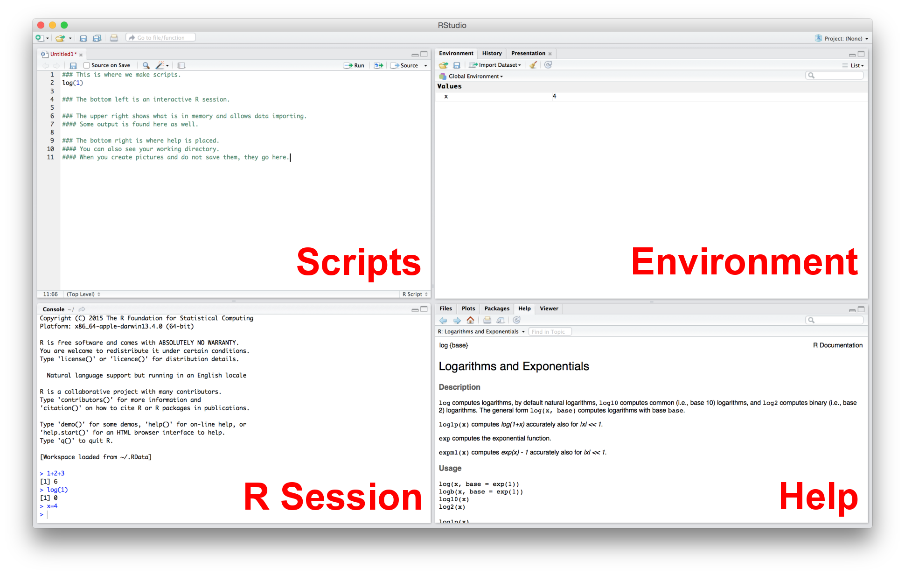
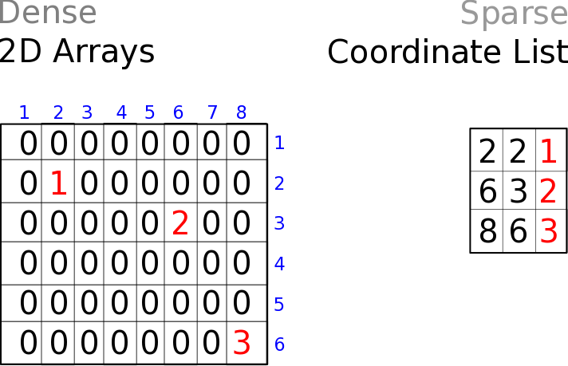

Single-cell RNA-Seq Analysis
========================================================
author: Timothy Tickle and Brian Haas
css: single_cell_analysis.css
date: October 10, 2016

Before We Get Started
===

- Single-cell analysis is new.
  - Give you a feel for the data.
  - Give you some options to explore.
  - These techniques will grow as the field does.

Before We Get Started
===

- This is VERY hands on.
  - Much can be applied to other analyses.
  - Strengthen those R ninja skills!
  - If you need, cut and pasting is available (cut_and_paste.txt).
  - There will many cute corgi pics.
  
---


What We Will Attempt to Cover
===

### Day 1  
__Morning:__ Overview of laboratory prep and sequence analysis.  
__Afternoon:__ Characteristics of expression data and QC.  

### Day 2  
__Morning:__ Plotting Single Cell RNA-Seq data.  
__Afternoon:__ Evaluating and defining cell populations.  

Welcome to day 1
===

- Overview of assays (SmartSeq2, Dropseq, 10X).
- Overview of sequence data (SmartSeq2, Dropseq, 10X).
- Overview of Dropseq sequence analysis pipeline.
- Overview of 10X sequence analysis pipeline.
- Sequence level quality control.
- What does single cell expression data look like and why?
- Introduction to RStudio.
- Initial data exploration.
- Quality control for expression matrices.
- Filtering genes and samples.
- Considerations in data analysis when using UMIs.
- Why normalize gene expression and common types of normalization?
- Using Scone for normalization.

SECTION: Overview of single-cell assays (SmartSeq2, Dropseq, 10X) (TODO)
===


SmartSeq2
===

Add description of assay.

Dropseq
===


[Drop Seq Video Abstract](http://www.sciencedirect.com/science/article/pii/S0092867415005498)

Add Description of Assay

10X
===

- Add description of Assay
- Droplet-based, 3' mRNA
- Standardized instrumentation and reagents
- Less processing time
- More high-throughput 1-6K cell for sample
- Up to 50% capture rate.

SECTION: Overview of Smartseq sequence analysis pipeline (TODO)
===

- Describe standard processing pipeline

SECTION: Overview of Dropseq sequence analysis pipeline (TODO)
===

- Describe DropSeq Pipeline

SECTION: Overview of 10X sequence analysis pipeline (TODO)
===

- Describe CellRanger Guts

SECTION: Sequence level quality control (TODO)
===

- Describe useful picard tools and FastQC and when where they go in the pipeline

Morning Summary (TODO)
===

Add Summary

What does single cell expression data look like and why?
===


We Start with a Matrix of Expression
===


Genes Have Different Distributions
===
class:small-code


Genes Have Different Distributions
===
class:small-code


Genes Have Different Distributions
===
class:small-code


Genes Have Different Distributions
===
class:small-code


Genes Have Different Distributions
===
class:small-code


Underlying Biology
===

Zero inflation.
- Drop-out event during reverse-transcription.
- Genes with more expression have less zeros.
- Complexity varies.

Transcription stochasticity.
- Transcription bursting.
- Coordinated transcription of multigene networks.
- Overdispersed counts.

---


Considerations in data analysis when using UMIs
===

 Points
 - Same sequence aligned to the same gene
 - Show example of UMI collapse
 - Can filter more conservatively when collapsing by UMI

Summary of the Data
===

- We are still understanding scData and how to apply it.
  - Data can be NOT normal.
  - Data can be Zero-inflated.
  - Data can be very noisey.
  - Cells vary in library complexity.
- Keeping these characteristics in analysis assumptions.

Introduction to RStudio
===


RStudio Integrative Development Environment
===



Initial data exploration
===


Seurat
===


Logistics
===
class:small-code


```r
# Load libraries
library(Seurat) # Single cell General Analysis
library(dplyr) # Dataframe manipulation
library(Matrix) # Sparse matrices
library(useful) # Corner function
library(vioplot) # Violin pots
library(scater) # Single Cell QC
```

Representing Sparse Matrices
===


```r
# Load 10X data
pbmc.10X <- Read10X("./data/filtered_gene_bc_matrices/hg19")

# Memory use as a sparse matrix
object.size(pbmc.10X)
```

```
38715120 bytes
```

```r
# Memory use as a dense matrix
# 18 X more
object.size(as.matrix(pbmc.10X))
```

```
709264728 bytes
```

How are Sparse Representations Made?
===

- Sparse Matrix: A matrix where most of the elements are 0.
- Dense Matrix: A matrix where most elements are not 0.
- Underlying structure is a coordinate list.

2D Arrays vs Coordinate List
===



Create a Seurat Object
===


```r
# Expected raw counts (non-normalized data)
# Can give log transformed data but do not transform in setup method
pbmc.seurat <- new("seurat", raw.data=pbmc.10X)
```

What is in a Seurat Object?
===


```r
# Display the internal pieces of the Seurat Object
slotNames(pbmc.seurat)
```

What is in a Seurat Object?
===


```
 [1] "raw.data"            "data"                "scale.data"         
 [4] "var.genes"           "is.expr"             "ident"              
 [7] "pca.x"               "pca.rot"             "emp.pval"           
[10] "kmeans.obj"          "pca.obj"             "gene.scores"        
[13] "drop.coefs"          "wt.matrix"           "drop.wt.matrix"     
[16] "trusted.genes"       "drop.expr"           "data.info"          
[19] "project.name"        "kmeans.gene"         "kmeans.cell"        
[22] "jackStraw.empP"      "jackStraw.fakePC"    "jackStraw.empP.full"
[25] "pca.x.full"          "kmeans.col"          "mean.var"           
[28] "imputed"             "mix.probs"           "mix.param"          
[31] "final.prob"          "insitu.matrix"       "tsne.rot"           
[34] "ica.rot"             "ica.x"               "ica.obj"            
[37] "cell.names"          "cluster.tree"        "snn.sparse"         
[40] "snn.dense"           "snn.k"              
```

What is in a Seurat Object?
===

Raw sparse matrix


```r
head(pbmc.seurat@raw.data)
```

```
6 x 2700 sparse Matrix of class "dgTMatrix"
                                                                          
MIR1302-10   . . . . . . . . . . . . . . . . . . . . . . . . . . . . . . .
FAM138A      . . . . . . . . . . . . . . . . . . . . . . . . . . . . . . .
OR4F5        . . . . . . . . . . . . . . . . . . . . . . . . . . . . . . .
RP11-34P13.7 . . . . . . . . . . . . . . . . . . . . . . . . . . . . . . .
RP11-34P13.8 . . . . . . . . . . . . . . . . . . . . . . . . . . . . . . .
AL627309.1   . . . . . . . . . . . . . . . . . . . . . . . . . . . . . . .
                                                                          
MIR1302-10   . . . . . . . . . . . . . . . . . . . . . . . . . . . . . . .
FAM138A      . . . . . . . . . . . . . . . . . . . . . . . . . . . . . . .
OR4F5        . . . . . . . . . . . . . . . . . . . . . . . . . . . . . . .
RP11-34P13.7 . . . . . . . . . . . . . . . . . . . . . . . . . . . . . . .
RP11-34P13.8 . . . . . . . . . . . . . . . . . . . . . . . . . . . . . . .
AL627309.1   . . . . . . . . . . . . . . . . . . . . . . . . . . . . . . .
                                                                          
MIR1302-10   . . . . . . . . . . . . . . . . . . . . . . . . . . . . . . .
FAM138A      . . . . . . . . . . . . . . . . . . . . . . . . . . . . . . .
OR4F5        . . . . . . . . . . . . . . . . . . . . . . . . . . . . . . .
RP11-34P13.7 . . . . . . . . . . . . . . . . . . . . . . . . . . . . . . .
RP11-34P13.8 . . . . . . . . . . . . . . . . . . . . . . . . . . . . . . .
AL627309.1   . . . . . . . . . . . . . . . . . . . . . . . . . . . . . . .
                                                                          
MIR1302-10   . . . . . . . . . . . . . . . . . . . . . . . . . . . . . . .
FAM138A      . . . . . . . . . . . . . . . . . . . . . . . . . . . . . . .
OR4F5        . . . . . . . . . . . . . . . . . . . . . . . . . . . . . . .
RP11-34P13.7 . . . . . . . . . . . . . . . . . . . . . . . . . . . . . . .
RP11-34P13.8 . . . . . . . . . . . . . . . . . . . . . . . . . . . . . . .
AL627309.1   . . . . . . . . . . . . . . . . . . . . . . . . . . . . . . .
                                                                          
MIR1302-10   . . . . . . . . . . . . . . . . . . . . . . . . . . . . . . .
FAM138A      . . . . . . . . . . . . . . . . . . . . . . . . . . . . . . .
OR4F5        . . . . . . . . . . . . . . . . . . . . . . . . . . . . . . .
RP11-34P13.7 . . . . . . . . . . . . . . . . . . . . . . . . . . . . . . .
RP11-34P13.8 . . . . . . . . . . . . . . . . . . . . . . . . . . . . . . .
AL627309.1   . . . . . . . . . . . . . . . . . . . . . . . . . . . . . . .
                                                                          
MIR1302-10   . . . . . . . . . . . . . . . . . . . . . . . . . . . . . . .
FAM138A      . . . . . . . . . . . . . . . . . . . . . . . . . . . . . . .
OR4F5        . . . . . . . . . . . . . . . . . . . . . . . . . . . . . . .
RP11-34P13.7 . . . . . . . . . . . . . . . . . . . . . . . . . . . . . . .
RP11-34P13.8 . . . . . . . . . . . . . . . . . . . . . . . . . . . . . . .
AL627309.1   . . . . . . . . . . . . . . . . . . . . . . . . . . . . . . .
                                                                          
MIR1302-10   . . . . . . . . . . . . . . . . . . . . . . . . . . . . . . .
FAM138A      . . . . . . . . . . . . . . . . . . . . . . . . . . . . . . .
OR4F5        . . . . . . . . . . . . . . . . . . . . . . . . . . . . . . .
RP11-34P13.7 . . . . . . . . . . . . . . . . . . . . . . . . . . . . . . .
RP11-34P13.8 . . . . . . . . . . . . . . . . . . . . . . . . . . . . . . .
AL627309.1   . . . . . . . . . . . . . . . . . . . . . . . . . . . . . . .
                                                                          
MIR1302-10   . . . . . . . . . . . . . . . . . . . . . . . . . . . . . . .
FAM138A      . . . . . . . . . . . . . . . . . . . . . . . . . . . . . . .
OR4F5        . . . . . . . . . . . . . . . . . . . . . . . . . . . . . . .
RP11-34P13.7 . . . . . . . . . . . . . . . . . . . . . . . . . . . . . . .
RP11-34P13.8 . . . . . . . . . . . . . . . . . . . . . . . . . . . . . . .
AL627309.1   . . . . . . . . . . . . . . . . . . . . . . . . . . . . . . .
                                                                          
MIR1302-10   . . . . . . . . . . . . . . . . . . . . . . . . . . . . . . .
FAM138A      . . . . . . . . . . . . . . . . . . . . . . . . . . . . . . .
OR4F5        . . . . . . . . . . . . . . . . . . . . . . . . . . . . . . .
RP11-34P13.7 . . . . . . . . . . . . . . . . . . . . . . . . . . . . . . .
RP11-34P13.8 . . . . . . . . . . . . . . . . . . . . . . . . . . . . . . .
AL627309.1   . . . . . . . . . . . . . . . . . . . . . . . . . . . . . . .
                                                                          
MIR1302-10   . . . . . . . . . . . . . . . . . . . . . . . . . . . . . . .
FAM138A      . . . . . . . . . . . . . . . . . . . . . . . . . . . . . . .
OR4F5        . . . . . . . . . . . . . . . . . . . . . . . . . . . . . . .
RP11-34P13.7 . . . . . . . . . . . . . . . . . . . . . . . . . . . . . . .
RP11-34P13.8 . . . . . . . . . . . . . . . . . . . . . . . . . . . . . . .
AL627309.1   . . . . . . . . . . . . . . . . . . . . . . . . . . . . . . .
                                                                          
MIR1302-10   . . . . . . . . . . . . . . . . . . . . . . . . . . . . . . .
FAM138A      . . . . . . . . . . . . . . . . . . . . . . . . . . . . . . .
OR4F5        . . . . . . . . . . . . . . . . . . . . . . . . . . . . . . .
RP11-34P13.7 . . . . . . . . . . . . . . . . . . . . . . . . . . . . . . .
RP11-34P13.8 . . . . . . . . . . . . . . . . . . . . . . . . . . . . . . .
AL627309.1   . . . . . . . . . . . . . . . . . . . . . . . . . . . . . . .
                                                                          
MIR1302-10   . . . . . . . . . . . . . . . . . . . . . . . . . . . . . . .
FAM138A      . . . . . . . . . . . . . . . . . . . . . . . . . . . . . . .
OR4F5        . . . . . . . . . . . . . . . . . . . . . . . . . . . . . . .
RP11-34P13.7 . . . . . . . . . . . . . . . . . . . . . . . . . . . . . . .
RP11-34P13.8 . . . . . . . . . . . . . . . . . . . . . . . . . . . . . . .
AL627309.1   . . . . . . . . . . . . . . . . . . . . . . . . . . . . . . .
                                                                          
MIR1302-10   . . . . . . . . . . . . . . . . . . . . . . . . . . . . . . .
FAM138A      . . . . . . . . . . . . . . . . . . . . . . . . . . . . . . .
OR4F5        . . . . . . . . . . . . . . . . . . . . . . . . . . . . . . .
RP11-34P13.7 . . . . . . . . . . . . . . . . . . . . . . . . . . . . . . .
RP11-34P13.8 . . . . . . . . . . . . . . . . . . . . . . . . . . . . . . .
AL627309.1   . . . . . . . . . . . . . . . . . . . . . . . . . . . . . . .
                                                                          
MIR1302-10   . . . . . . . . . . . . . . . . . . . . . . . . . . . . . . .
FAM138A      . . . . . . . . . . . . . . . . . . . . . . . . . . . . . . .
OR4F5        . . . . . . . . . . . . . . . . . . . . . . . . . . . . . . .
RP11-34P13.7 . . . . . . . . . . . . . . . . . . . . . . . . . . . . . . .
RP11-34P13.8 . . . . . . . . . . . . . . . . . . . . . . . . . . . . . . .
AL627309.1   . . . . . . . . . . . . . . . . . . . . . . . . . . . . . . .
                                                                          
MIR1302-10   . . . . . . . . . . . . . . . . . . . . . . . . . . . . . . .
FAM138A      . . . . . . . . . . . . . . . . . . . . . . . . . . . . . . .
OR4F5        . . . . . . . . . . . . . . . . . . . . . . . . . . . . . . .
RP11-34P13.7 . . . . . . . . . . . . . . . . . . . . . . . . . . . . . . .
RP11-34P13.8 . . . . . . . . . . . . . . . . . . . . . . . . . . . . . . .
AL627309.1   . . . . . . . . . . 1 . . . . . . . . . . . . . . . . . . . .
                                                                          
MIR1302-10   . . . . . . . . . . . . . . . . . . . . . . . . . . . . . . .
FAM138A      . . . . . . . . . . . . . . . . . . . . . . . . . . . . . . .
OR4F5        . . . . . . . . . . . . . . . . . . . . . . . . . . . . . . .
RP11-34P13.7 . . . . . . . . . . . . . . . . . . . . . . . . . . . . . . .
RP11-34P13.8 . . . . . . . . . . . . . . . . . . . . . . . . . . . . . . .
AL627309.1   . . . . . . . . . . . . . . . . . . . . . . . . . . . . . . .
                                                                          
MIR1302-10   . . . . . . . . . . . . . . . . . . . . . . . . . . . . . . .
FAM138A      . . . . . . . . . . . . . . . . . . . . . . . . . . . . . . .
OR4F5        . . . . . . . . . . . . . . . . . . . . . . . . . . . . . . .
RP11-34P13.7 . . . . . . . . . . . . . . . . . . . . . . . . . . . . . . .
RP11-34P13.8 . . . . . . . . . . . . . . . . . . . . . . . . . . . . . . .
AL627309.1   . . . . . . . . . . . . . . . . . . . . . . . . . . . . . . .
                                                                          
MIR1302-10   . . . . . . . . . . . . . . . . . . . . . . . . . . . . . . .
FAM138A      . . . . . . . . . . . . . . . . . . . . . . . . . . . . . . .
OR4F5        . . . . . . . . . . . . . . . . . . . . . . . . . . . . . . .
RP11-34P13.7 . . . . . . . . . . . . . . . . . . . . . . . . . . . . . . .
RP11-34P13.8 . . . . . . . . . . . . . . . . . . . . . . . . . . . . . . .
AL627309.1   . . . . . . . . . . . . . . . . . . . . . . . . . . . . . . .
                                                                          
MIR1302-10   . . . . . . . . . . . . . . . . . . . . . . . . . . . . . . .
FAM138A      . . . . . . . . . . . . . . . . . . . . . . . . . . . . . . .
OR4F5        . . . . . . . . . . . . . . . . . . . . . . . . . . . . . . .
RP11-34P13.7 . . . . . . . . . . . . . . . . . . . . . . . . . . . . . . .
RP11-34P13.8 . . . . . . . . . . . . . . . . . . . . . . . . . . . . . . .
AL627309.1   . . . . . . . . . . . . . . . . . . . . . . . . . . . . . . .
                                                                          
MIR1302-10   . . . . . . . . . . . . . . . . . . . . . . . . . . . . . . .
FAM138A      . . . . . . . . . . . . . . . . . . . . . . . . . . . . . . .
OR4F5        . . . . . . . . . . . . . . . . . . . . . . . . . . . . . . .
RP11-34P13.7 . . . . . . . . . . . . . . . . . . . . . . . . . . . . . . .
RP11-34P13.8 . . . . . . . . . . . . . . . . . . . . . . . . . . . . . . .
AL627309.1   . . . . . . . . . . . . . . . . . . . . . . . . . . . . . . .
                                                                          
MIR1302-10   . . . . . . . . . . . . . . . . . . . . . . . . . . . . . . .
FAM138A      . . . . . . . . . . . . . . . . . . . . . . . . . . . . . . .
OR4F5        . . . . . . . . . . . . . . . . . . . . . . . . . . . . . . .
RP11-34P13.7 . . . . . . . . . . . . . . . . . . . . . . . . . . . . . . .
RP11-34P13.8 . . . . . . . . . . . . . . . . . . . . . . . . . . . . . . .
AL627309.1   . . . . . . . . . . . . . . . . . . . . . . . . . . . . . . .
                                                                          
MIR1302-10   . . . . . . . . . . . . . . . . . . . . . . . . . . . . . . .
FAM138A      . . . . . . . . . . . . . . . . . . . . . . . . . . . . . . .
OR4F5        . . . . . . . . . . . . . . . . . . . . . . . . . . . . . . .
RP11-34P13.7 . . . . . . . . . . . . . . . . . . . . . . . . . . . . . . .
RP11-34P13.8 . . . . . . . . . . . . . . . . . . . . . . . . . . . . . . .
AL627309.1   . . . . . . . . . . . . . . . . . . . . . . . . . . . . . . .
                                                                          
MIR1302-10   . . . . . . . . . . . . . . . . . . . . . . . . . . . . . . .
FAM138A      . . . . . . . . . . . . . . . . . . . . . . . . . . . . . . .
OR4F5        . . . . . . . . . . . . . . . . . . . . . . . . . . . . . . .
RP11-34P13.7 . . . . . . . . . . . . . . . . . . . . . . . . . . . . . . .
RP11-34P13.8 . . . . . . . . . . . . . . . . . . . . . . . . . . . . . . .
AL627309.1   . . . . . . . . . . . . . . . . . . . . . . . . . . . . . . .
                                                                          
MIR1302-10   . . . . . . . . . . . . . . . . . . . . . . . . . . . . . . .
FAM138A      . . . . . . . . . . . . . . . . . . . . . . . . . . . . . . .
OR4F5        . . . . . . . . . . . . . . . . . . . . . . . . . . . . . . .
RP11-34P13.7 . . . . . . . . . . . . . . . . . . . . . . . . . . . . . . .
RP11-34P13.8 . . . . . . . . . . . . . . . . . . . . . . . . . . . . . . .
AL627309.1   . . . . . . . . . . . . . . . . . . . . . . . . . . . . . . .
                                                                          
MIR1302-10   . . . . . . . . . . . . . . . . . . . . . . . . . . . . . . .
FAM138A      . . . . . . . . . . . . . . . . . . . . . . . . . . . . . . .
OR4F5        . . . . . . . . . . . . . . . . . . . . . . . . . . . . . . .
RP11-34P13.7 . . . . . . . . . . . . . . . . . . . . . . . . . . . . . . .
RP11-34P13.8 . . . . . . . . . . . . . . . . . . . . . . . . . . . . . . .
AL627309.1   . . . . . . . . . . . . . . . . . . . . . . . . . . . . . . .
                                                                          
MIR1302-10   . . . . . . . . . . . . . . . . . . . . . . . . . . . . . . .
FAM138A      . . . . . . . . . . . . . . . . . . . . . . . . . . . . . . .
OR4F5        . . . . . . . . . . . . . . . . . . . . . . . . . . . . . . .
RP11-34P13.7 . . . . . . . . . . . . . . . . . . . . . . . . . . . . . . .
RP11-34P13.8 . . . . . . . . . . . . . . . . . . . . . . . . . . . . . . .
AL627309.1   . . . . . . . . . . . . . . . . . . . . . . . . . . . . . . .
                                                                          
MIR1302-10   . . . . . . . . . . . . . . . . . . . . . . . . . . . . . . .
FAM138A      . . . . . . . . . . . . . . . . . . . . . . . . . . . . . . .
OR4F5        . . . . . . . . . . . . . . . . . . . . . . . . . . . . . . .
RP11-34P13.7 . . . . . . . . . . . . . . . . . . . . . . . . . . . . . . .
RP11-34P13.8 . . . . . . . . . . . . . . . . . . . . . . . . . . . . . . .
AL627309.1   . . . . . . . . . . . . . . . . . . . . . . . . . . . . . . .
                                                                          
MIR1302-10   . . . . . . . . . . . . . . . . . . . . . . . . . . . . . . .
FAM138A      . . . . . . . . . . . . . . . . . . . . . . . . . . . . . . .
OR4F5        . . . . . . . . . . . . . . . . . . . . . . . . . . . . . . .
RP11-34P13.7 . . . . . . . . . . . . . . . . . . . . . . . . . . . . . . .
RP11-34P13.8 . . . . . . . . . . . . . . . . . . . . . . . . . . . . . . .
AL627309.1   . . . . . . . . . . . . . . . . . . . . . . . . . . . . . . .
                                                                          
MIR1302-10   . . . . . . . . . . . . . . . . . . . . . . . . . . . . . . .
FAM138A      . . . . . . . . . . . . . . . . . . . . . . . . . . . . . . .
OR4F5        . . . . . . . . . . . . . . . . . . . . . . . . . . . . . . .
RP11-34P13.7 . . . . . . . . . . . . . . . . . . . . . . . . . . . . . . .
RP11-34P13.8 . . . . . . . . . . . . . . . . . . . . . . . . . . . . . . .
AL627309.1   . . . . . . . . . . . . . . . . . . . . . . . . . . . . . . .
                                                                          
MIR1302-10   . . . . . . . . . . . . . . . . . . . . . . . . . . . . . . .
FAM138A      . . . . . . . . . . . . . . . . . . . . . . . . . . . . . . .
OR4F5        . . . . . . . . . . . . . . . . . . . . . . . . . . . . . . .
RP11-34P13.7 . . . . . . . . . . . . . . . . . . . . . . . . . . . . . . .
RP11-34P13.8 . . . . . . . . . . . . . . . . . . . . . . . . . . . . . . .
AL627309.1   . . . . . . . . . . . . . . . . . . . . . . . . . . . . . . .
                                                                          
MIR1302-10   . . . . . . . . . . . . . . . . . . . . . . . . . . . . . . .
FAM138A      . . . . . . . . . . . . . . . . . . . . . . . . . . . . . . .
OR4F5        . . . . . . . . . . . . . . . . . . . . . . . . . . . . . . .
RP11-34P13.7 . . . . . . . . . . . . . . . . . . . . . . . . . . . . . . .
RP11-34P13.8 . . . . . . . . . . . . . . . . . . . . . . . . . . . . . . .
AL627309.1   . . . . . . . . . . . . . . . . . . . . . . . . . . . . . . .
                                                                          
MIR1302-10   . . . . . . . . . . . . . . . . . . . . . . . . . . . . . . .
FAM138A      . . . . . . . . . . . . . . . . . . . . . . . . . . . . . . .
OR4F5        . . . . . . . . . . . . . . . . . . . . . . . . . . . . . . .
RP11-34P13.7 . . . . . . . . . . . . . . . . . . . . . . . . . . . . . . .
RP11-34P13.8 . . . . . . . . . . . . . . . . . . . . . . . . . . . . . . .
AL627309.1   . . . . . . . . . . . . . . . . . . . . . . . . . . . . . . .
                                                                          
MIR1302-10   . . . . . . . . . . . . . . . . . . . . . . . . . . . . . . .
FAM138A      . . . . . . . . . . . . . . . . . . . . . . . . . . . . . . .
OR4F5        . . . . . . . . . . . . . . . . . . . . . . . . . . . . . . .
RP11-34P13.7 . . . . . . . . . . . . . . . . . . . . . . . . . . . . . . .
RP11-34P13.8 . . . . . . . . . . . . . . . . . . . . . . . . . . . . . . .
AL627309.1   . . . . . . . . . . . . . . . . . . . . . . . . . 1 . . . . .
                                                                          
MIR1302-10   . . . . . . . . . . . . . . . . . . . . . . . . . . . . . . .
FAM138A      . . . . . . . . . . . . . . . . . . . . . . . . . . . . . . .
OR4F5        . . . . . . . . . . . . . . . . . . . . . . . . . . . . . . .
RP11-34P13.7 . . . . . . . . . . . . . . . . . . . . . . . . . . . . . . .
RP11-34P13.8 . . . . . . . . . . . . . . . . . . . . . . . . . . . . . . .
AL627309.1   . . . . . . . . . . . . . . . . . . . . . . . . . . . . . . .
                                                                          
MIR1302-10   . . . . . . . . . . . . . . . . . . . . . . . . . . . . . . .
FAM138A      . . . . . . . . . . . . . . . . . . . . . . . . . . . . . . .
OR4F5        . . . . . . . . . . . . . . . . . . . . . . . . . . . . . . .
RP11-34P13.7 . . . . . . . . . . . . . . . . . . . . . . . . . . . . . . .
RP11-34P13.8 . . . . . . . . . . . . . . . . . . . . . . . . . . . . . . .
AL627309.1   . . . . . . . . . . . . . . . . . . . . . . . . . . . . . . .
                                                                          
MIR1302-10   . . . . . . . . . . . . . . . . . . . . . . . . . . . . . . .
FAM138A      . . . . . . . . . . . . . . . . . . . . . . . . . . . . . . .
OR4F5        . . . . . . . . . . . . . . . . . . . . . . . . . . . . . . .
RP11-34P13.7 . . . . . . . . . . . . . . . . . . . . . . . . . . . . . . .
RP11-34P13.8 . . . . . . . . . . . . . . . . . . . . . . . . . . . . . . .
AL627309.1   . . . . . . . . . . . . . . . . . . . . . 1 . . . . . . . . .
                                                                          
MIR1302-10   . . . . . . . . . . . . . . . . . . . . . . . . . . . . . . .
FAM138A      . . . . . . . . . . . . . . . . . . . . . . . . . . . . . . .
OR4F5        . . . . . . . . . . . . . . . . . . . . . . . . . . . . . . .
RP11-34P13.7 . . . . . . . . . . . . . . . . . . . . . . . . . . . . . . .
RP11-34P13.8 . . . . . . . . . . . . . . . . . . . . . . . . . . . . . . .
AL627309.1   . . . . . . . . . . . . . . . . . . . . . . . . . . . . . . .
                                                                          
MIR1302-10   . . . . . . . . . . . . . . . . . . . . . . . . . . . . . . .
FAM138A      . . . . . . . . . . . . . . . . . . . . . . . . . . . . . . .
OR4F5        . . . . . . . . . . . . . . . . . . . . . . . . . . . . . . .
RP11-34P13.7 . . . . . . . . . . . . . . . . . . . . . . . . . . . . . . .
RP11-34P13.8 . . . . . . . . . . . . . . . . . . . . . . . . . . . . . . .
AL627309.1   . . . . . . . . . . . . . . 1 . . . . . . . . . . . . . . . .
                                                                          
MIR1302-10   . . . . . . . . . . . . . . . . . . . . . . . . . . . . . . .
FAM138A      . . . . . . . . . . . . . . . . . . . . . . . . . . . . . . .
OR4F5        . . . . . . . . . . . . . . . . . . . . . . . . . . . . . . .
RP11-34P13.7 . . . . . . . . . . . . . . . . . . . . . . . . . . . . . . .
RP11-34P13.8 . . . . . . . . . . . . . . . . . . . . . . . . . . . . . . .
AL627309.1   . . . . . . . . . . . . . . . . . . . . . . . . . . . . . . .
                                                                          
MIR1302-10   . . . . . . . . . . . . . . . . . . . . . . . . . . . . . . .
FAM138A      . . . . . . . . . . . . . . . . . . . . . . . . . . . . . . .
OR4F5        . . . . . . . . . . . . . . . . . . . . . . . . . . . . . . .
RP11-34P13.7 . . . . . . . . . . . . . . . . . . . . . . . . . . . . . . .
RP11-34P13.8 . . . . . . . . . . . . . . . . . . . . . . . . . . . . . . .
AL627309.1   . . . . . . . . . . . . . . . . . . . . . . . . . . . . . . .
                                                                          
MIR1302-10   . . . . . . . . . . . . . . . . . . . . . . . . . . . . . . .
FAM138A      . . . . . . . . . . . . . . . . . . . . . . . . . . . . . . .
OR4F5        . . . . . . . . . . . . . . . . . . . . . . . . . . . . . . .
RP11-34P13.7 . . . . . . . . . . . . . . . . . . . . . . . . . . . . . . .
RP11-34P13.8 . . . . . . . . . . . . . . . . . . . . . . . . . . . . . . .
AL627309.1   . . . . . . . . . . . . . . . . . . . . . . . . . . . . . . .
                                                                          
MIR1302-10   . . . . . . . . . . . . . . . . . . . . . . . . . . . . . . .
FAM138A      . . . . . . . . . . . . . . . . . . . . . . . . . . . . . . .
OR4F5        . . . . . . . . . . . . . . . . . . . . . . . . . . . . . . .
RP11-34P13.7 . . . . . . . . . . . . . . . . . . . . . . . . . . . . . . .
RP11-34P13.8 . . . . . . . . . . . . . . . . . . . . . . . . . . . . . . .
AL627309.1   . . . . . . . . . . . . . . . . . . . . . . . . . . . . . . .
                                                                          
MIR1302-10   . . . . . . . . . . . . . . . . . . . . . . . . . . . . . . .
FAM138A      . . . . . . . . . . . . . . . . . . . . . . . . . . . . . . .
OR4F5        . . . . . . . . . . . . . . . . . . . . . . . . . . . . . . .
RP11-34P13.7 . . . . . . . . . . . . . . . . . . . . . . . . . . . . . . .
RP11-34P13.8 . . . . . . . . . . . . . . . . . . . . . . . . . . . . . . .
AL627309.1   . . . . . . . . . . . . . . . . . . . . . . . . . . . . . . .
                                                                          
MIR1302-10   . . . . . . . . . . . . . . . . . . . . . . . . . . . . . . .
FAM138A      . . . . . . . . . . . . . . . . . . . . . . . . . . . . . . .
OR4F5        . . . . . . . . . . . . . . . . . . . . . . . . . . . . . . .
RP11-34P13.7 . . . . . . . . . . . . . . . . . . . . . . . . . . . . . . .
RP11-34P13.8 . . . . . . . . . . . . . . . . . . . . . . . . . . . . . . .
AL627309.1   . . . . . . . . . . . . . . . . . . . . . . . . . . 1 . . . .
                                                                          
MIR1302-10   . . . . . . . . . . . . . . . . . . . . . . . . . . . . . . .
FAM138A      . . . . . . . . . . . . . . . . . . . . . . . . . . . . . . .
OR4F5        . . . . . . . . . . . . . . . . . . . . . . . . . . . . . . .
RP11-34P13.7 . . . . . . . . . . . . . . . . . . . . . . . . . . . . . . .
RP11-34P13.8 . . . . . . . . . . . . . . . . . . . . . . . . . . . . . . .
AL627309.1   . . . . . . . . . . . . . . . . . . . . . . . . . . . . . . .
                                                                          
MIR1302-10   . . . . . . . . . . . . . . . . . . . . . . . . . . . . . . .
FAM138A      . . . . . . . . . . . . . . . . . . . . . . . . . . . . . . .
OR4F5        . . . . . . . . . . . . . . . . . . . . . . . . . . . . . . .
RP11-34P13.7 . . . . . . . . . . . . . . . . . . . . . . . . . . . . . . .
RP11-34P13.8 . . . . . . . . . . . . . . . . . . . . . . . . . . . . . . .
AL627309.1   . . . . . . . . . . . . . . . . . . . . . . . . . . . . . . .
                                                                          
MIR1302-10   . . . . . . . . . . . . . . . . . . . . . . . . . . . . . . .
FAM138A      . . . . . . . . . . . . . . . . . . . . . . . . . . . . . . .
OR4F5        . . . . . . . . . . . . . . . . . . . . . . . . . . . . . . .
RP11-34P13.7 . . . . . . . . . . . . . . . . . . . . . . . . . . . . . . .
RP11-34P13.8 . . . . . . . . . . . . . . . . . . . . . . . . . . . . . . .
AL627309.1   . . . . . . . . 1 . . . . . . . . . . . . . . . . . . . . . .
                                                                          
MIR1302-10   . . . . . . . . . . . . . . . . . . . . . . . . . . . . . . .
FAM138A      . . . . . . . . . . . . . . . . . . . . . . . . . . . . . . .
OR4F5        . . . . . . . . . . . . . . . . . . . . . . . . . . . . . . .
RP11-34P13.7 . . . . . . . . . . . . . . . . . . . . . . . . . . . . . . .
RP11-34P13.8 . . . . . . . . . . . . . . . . . . . . . . . . . . . . . . .
AL627309.1   . . . . . . . . . . . . . . . . . . . . . . . . . . . . . . .
                                                                          
MIR1302-10   . . . . . . . . . . . . . . . . . . . . . . . . . . . . . . .
FAM138A      . . . . . . . . . . . . . . . . . . . . . . . . . . . . . . .
OR4F5        . . . . . . . . . . . . . . . . . . . . . . . . . . . . . . .
RP11-34P13.7 . . . . . . . . . . . . . . . . . . . . . . . . . . . . . . .
RP11-34P13.8 . . . . . . . . . . . . . . . . . . . . . . . . . . . . . . .
AL627309.1   . . . . . . . . . . . . . . . . . . . . . . . . . . . . . . .
                                                                          
MIR1302-10   . . . . . . . . . . . . . . . . . . . . . . . . . . . . . . .
FAM138A      . . . . . . . . . . . . . . . . . . . . . . . . . . . . . . .
OR4F5        . . . . . . . . . . . . . . . . . . . . . . . . . . . . . . .
RP11-34P13.7 . . . . . . . . . . . . . . . . . . . . . . . . . . . . . . .
RP11-34P13.8 . . . . . . . . . . . . . . . . . . . . . . . . . . . . . . .
AL627309.1   . . . . . . . . . . . . . . . . . . . . . . . . . . . . . . .
                                                                          
MIR1302-10   . . . . . . . . . . . . . . . . . . . . . . . . . . . . . . .
FAM138A      . . . . . . . . . . . . . . . . . . . . . . . . . . . . . . .
OR4F5        . . . . . . . . . . . . . . . . . . . . . . . . . . . . . . .
RP11-34P13.7 . . . . . . . . . . . . . . . . . . . . . . . . . . . . . . .
RP11-34P13.8 . . . . . . . . . . . . . . . . . . . . . . . . . . . . . . .
AL627309.1   . . . . . . . . . . . . . . . . . . . . . . . . . . . . . . .
                                                                          
MIR1302-10   . . . . . . . . . . . . . . . . . . . . . . . . . . . . . . .
FAM138A      . . . . . . . . . . . . . . . . . . . . . . . . . . . . . . .
OR4F5        . . . . . . . . . . . . . . . . . . . . . . . . . . . . . . .
RP11-34P13.7 . . . . . . . . . . . . . . . . . . . . . . . . . . . . . . .
RP11-34P13.8 . . . . . . . . . . . . . . . . . . . . . . . . . . . . . . .
AL627309.1   . . . . . . . . . . . . . . . . . . . . . . . . . . . . . . .
                                                                          
MIR1302-10   . . . . . . . . . . . . . . . . . . . . . . . . . . . . . . .
FAM138A      . . . . . . . . . . . . . . . . . . . . . . . . . . . . . . .
OR4F5        . . . . . . . . . . . . . . . . . . . . . . . . . . . . . . .
RP11-34P13.7 . . . . . . . . . . . . . . . . . . . . . . . . . . . . . . .
RP11-34P13.8 . . . . . . . . . . . . . . . . . . . . . . . . . . . . . . .
AL627309.1   . . . . . . . . . . . . . . . . 1 . . . . . . . . . . . . . .
                                                                          
MIR1302-10   . . . . . . . . . . . . . . . . . . . . . . . . . . . . . . .
FAM138A      . . . . . . . . . . . . . . . . . . . . . . . . . . . . . . .
OR4F5        . . . . . . . . . . . . . . . . . . . . . . . . . . . . . . .
RP11-34P13.7 . . . . . . . . . . . . . . . . . . . . . . . . . . . . . . .
RP11-34P13.8 . . . . . . . . . . . . . . . . . . . . . . . . . . . . . . .
AL627309.1   . . . . . . . . . . . . . . . . . . . . . . . . . . . . . . .
                                                                          
MIR1302-10   . . . . . . . . . . . . . . . . . . . . . . . . . . . . . . .
FAM138A      . . . . . . . . . . . . . . . . . . . . . . . . . . . . . . .
OR4F5        . . . . . . . . . . . . . . . . . . . . . . . . . . . . . . .
RP11-34P13.7 . . . . . . . . . . . . . . . . . . . . . . . . . . . . . . .
RP11-34P13.8 . . . . . . . . . . . . . . . . . . . . . . . . . . . . . . .
AL627309.1   . . . . . . . . . . . . . . . . . . . . . . . . . . . . . . .
                                                                          
MIR1302-10   . . . . . . . . . . . . . . . . . . . . . . . . . . . . . . .
FAM138A      . . . . . . . . . . . . . . . . . . . . . . . . . . . . . . .
OR4F5        . . . . . . . . . . . . . . . . . . . . . . . . . . . . . . .
RP11-34P13.7 . . . . . . . . . . . . . . . . . . . . . . . . . . . . . . .
RP11-34P13.8 . . . . . . . . . . . . . . . . . . . . . . . . . . . . . . .
AL627309.1   . . . . . . . . . . . . . . . . . . . . . . . . . . . . . . .
                                                                          
MIR1302-10   . . . . . . . . . . . . . . . . . . . . . . . . . . . . . . .
FAM138A      . . . . . . . . . . . . . . . . . . . . . . . . . . . . . . .
OR4F5        . . . . . . . . . . . . . . . . . . . . . . . . . . . . . . .
RP11-34P13.7 . . . . . . . . . . . . . . . . . . . . . . . . . . . . . . .
RP11-34P13.8 . . . . . . . . . . . . . . . . . . . . . . . . . . . . . . .
AL627309.1   . . . . . . . . . . . . . . . . . . . . . . . . . . . . . . .
                                                                          
MIR1302-10   . . . . . . . . . . . . . . . . . . . . . . . . . . . . . . .
FAM138A      . . . . . . . . . . . . . . . . . . . . . . . . . . . . . . .
OR4F5        . . . . . . . . . . . . . . . . . . . . . . . . . . . . . . .
RP11-34P13.7 . . . . . . . . . . . . . . . . . . . . . . . . . . . . . . .
RP11-34P13.8 . . . . . . . . . . . . . . . . . . . . . . . . . . . . . . .
AL627309.1   . . . . . . . . . . . . . . . . . . . . . . . . . . . . . . .
                                                                          
MIR1302-10   . . . . . . . . . . . . . . . . . . . . . . . . . . . . . . .
FAM138A      . . . . . . . . . . . . . . . . . . . . . . . . . . . . . . .
OR4F5        . . . . . . . . . . . . . . . . . . . . . . . . . . . . . . .
RP11-34P13.7 . . . . . . . . . . . . . . . . . . . . . . . . . . . . . . .
RP11-34P13.8 . . . . . . . . . . . . . . . . . . . . . . . . . . . . . . .
AL627309.1   1 . . . . . . . . . . . . . 1 . . . . . . . . . . . . . . . .
                                                                          
MIR1302-10   . . . . . . . . . . . . . . . . . . . . . . . . . . . . . . .
FAM138A      . . . . . . . . . . . . . . . . . . . . . . . . . . . . . . .
OR4F5        . . . . . . . . . . . . . . . . . . . . . . . . . . . . . . .
RP11-34P13.7 . . . . . . . . . . . . . . . . . . . . . . . . . . . . . . .
RP11-34P13.8 . . . . . . . . . . . . . . . . . . . . . . . . . . . . . . .
AL627309.1   . . . . . . . . . . . . . . . . . . . . . . . . . . . . . . .
                                                                          
MIR1302-10   . . . . . . . . . . . . . . . . . . . . . . . . . . . . . . .
FAM138A      . . . . . . . . . . . . . . . . . . . . . . . . . . . . . . .
OR4F5        . . . . . . . . . . . . . . . . . . . . . . . . . . . . . . .
RP11-34P13.7 . . . . . . . . . . . . . . . . . . . . . . . . . . . . . . .
RP11-34P13.8 . . . . . . . . . . . . . . . . . . . . . . . . . . . . . . .
AL627309.1   . . . . . . . . . . . . . . . . . . . . . . . . . . . . . . .
                                                                          
MIR1302-10   . . . . . . . . . . . . . . . . . . . . . . . . . . . . . . .
FAM138A      . . . . . . . . . . . . . . . . . . . . . . . . . . . . . . .
OR4F5        . . . . . . . . . . . . . . . . . . . . . . . . . . . . . . .
RP11-34P13.7 . . . . . . . . . . . . . . . . . . . . . . . . . . . . . . .
RP11-34P13.8 . . . . . . . . . . . . . . . . . . . . . . . . . . . . . . .
AL627309.1   . . . . . . . . . . . . . . . . . . . . . . . . . . . . . . .
                                                                          
MIR1302-10   . . . . . . . . . . . . . . . . . . . . . . . . . . . . . . .
FAM138A      . . . . . . . . . . . . . . . . . . . . . . . . . . . . . . .
OR4F5        . . . . . . . . . . . . . . . . . . . . . . . . . . . . . . .
RP11-34P13.7 . . . . . . . . . . . . . . . . . . . . . . . . . . . . . . .
RP11-34P13.8 . . . . . . . . . . . . . . . . . . . . . . . . . . . . . . .
AL627309.1   . . . . . . . . . . . . . . . . . . . . . . . . . . . . . . .
                                                                          
MIR1302-10   . . . . . . . . . . . . . . . . . . . . . . . . . . . . . . .
FAM138A      . . . . . . . . . . . . . . . . . . . . . . . . . . . . . . .
OR4F5        . . . . . . . . . . . . . . . . . . . . . . . . . . . . . . .
RP11-34P13.7 . . . . . . . . . . . . . . . . . . . . . . . . . . . . . . .
RP11-34P13.8 . . . . . . . . . . . . . . . . . . . . . . . . . . . . . . .
AL627309.1   . . . . . . . . . . . . . . . . . . . . . . . . . . . . . . .
                                                                          
MIR1302-10   . . . . . . . . . . . . . . . . . . . . . . . . . . . . . . .
FAM138A      . . . . . . . . . . . . . . . . . . . . . . . . . . . . . . .
OR4F5        . . . . . . . . . . . . . . . . . . . . . . . . . . . . . . .
RP11-34P13.7 . . . . . . . . . . . . . . . . . . . . . . . . . . . . . . .
RP11-34P13.8 . . . . . . . . . . . . . . . . . . . . . . . . . . . . . . .
AL627309.1   . . . . . . . . . . . . . . . . . . . . . . . . . . . . . . .
                                                                          
MIR1302-10   . . . . . . . . . . . . . . . . . . . . . . . . . . . . . . .
FAM138A      . . . . . . . . . . . . . . . . . . . . . . . . . . . . . . .
OR4F5        . . . . . . . . . . . . . . . . . . . . . . . . . . . . . . .
RP11-34P13.7 . . . . . . . . . . . . . . . . . . . . . . . . . . . . . . .
RP11-34P13.8 . . . . . . . . . . . . . . . . . . . . . . . . . . . . . . .
AL627309.1   . . . . . . . . . . . . . . . . . . . . . . . . . . . . . . .
                                                                          
MIR1302-10   . . . . . . . . . . . . . . . . . . . . . . . . . . . . . . .
FAM138A      . . . . . . . . . . . . . . . . . . . . . . . . . . . . . . .
OR4F5        . . . . . . . . . . . . . . . . . . . . . . . . . . . . . . .
RP11-34P13.7 . . . . . . . . . . . . . . . . . . . . . . . . . . . . . . .
RP11-34P13.8 . . . . . . . . . . . . . . . . . . . . . . . . . . . . . . .
AL627309.1   . . . . . . . . . . . . . . . . . . . . . . . . . . . . . . .
                                                                          
MIR1302-10   . . . . . . . . . . . . . . . . . . . . . . . . . . . . . . .
FAM138A      . . . . . . . . . . . . . . . . . . . . . . . . . . . . . . .
OR4F5        . . . . . . . . . . . . . . . . . . . . . . . . . . . . . . .
RP11-34P13.7 . . . . . . . . . . . . . . . . . . . . . . . . . . . . . . .
RP11-34P13.8 . . . . . . . . . . . . . . . . . . . . . . . . . . . . . . .
AL627309.1   . . . . . . . . . . . . . . . . . . . . . . . . . . . . . . .
                                                                          
MIR1302-10   . . . . . . . . . . . . . . . . . . . . . . . . . . . . . . .
FAM138A      . . . . . . . . . . . . . . . . . . . . . . . . . . . . . . .
OR4F5        . . . . . . . . . . . . . . . . . . . . . . . . . . . . . . .
RP11-34P13.7 . . . . . . . . . . . . . . . . . . . . . . . . . . . . . . .
RP11-34P13.8 . . . . . . . . . . . . . . . . . . . . . . . . . . . . . . .
AL627309.1   . . . . . . . . . . . . . . . . . . . . . . . . . . . . . . .
                                                                          
MIR1302-10   . . . . . . . . . . . . . . . . . . . . . . . . . . . . . . .
FAM138A      . . . . . . . . . . . . . . . . . . . . . . . . . . . . . . .
OR4F5        . . . . . . . . . . . . . . . . . . . . . . . . . . . . . . .
RP11-34P13.7 . . . . . . . . . . . . . . . . . . . . . . . . . . . . . . .
RP11-34P13.8 . . . . . . . . . . . . . . . . . . . . . . . . . . . . . . .
AL627309.1   . . . . . . . . . . . . . . . . . . . . . . . . . . . . . . .
                                                                          
MIR1302-10   . . . . . . . . . . . . . . . . . . . . . . . . . . . . . . .
FAM138A      . . . . . . . . . . . . . . . . . . . . . . . . . . . . . . .
OR4F5        . . . . . . . . . . . . . . . . . . . . . . . . . . . . . . .
RP11-34P13.7 . . . . . . . . . . . . . . . . . . . . . . . . . . . . . . .
RP11-34P13.8 . . . . . . . . . . . . . . . . . . . . . . . . . . . . . . .
AL627309.1   . . . . . . . . . . . . . . . . . . . . . . . . . . . . . . .
                                                                          
MIR1302-10   . . . . . . . . . . . . . . . . . . . . . . . . . . . . . . .
FAM138A      . . . . . . . . . . . . . . . . . . . . . . . . . . . . . . .
OR4F5        . . . . . . . . . . . . . . . . . . . . . . . . . . . . . . .
RP11-34P13.7 . . . . . . . . . . . . . . . . . . . . . . . . . . . . . . .
RP11-34P13.8 . . . . . . . . . . . . . . . . . . . . . . . . . . . . . . .
AL627309.1   . . . . . . . . . . . . . . . . . . . . . . . . . . . . . . .
                                                                          
MIR1302-10   . . . . . . . . . . . . . . . . . . . . . . . . . . . . . . .
FAM138A      . . . . . . . . . . . . . . . . . . . . . . . . . . . . . . .
OR4F5        . . . . . . . . . . . . . . . . . . . . . . . . . . . . . . .
RP11-34P13.7 . . . . . . . . . . . . . . . . . . . . . . . . . . . . . . .
RP11-34P13.8 . . . . . . . . . . . . . . . . . . . . . . . . . . . . . . .
AL627309.1   . . . . . . . . . . . . . . . . . . . . . . . . . . . . . . .
                                                                          
MIR1302-10   . . . . . . . . . . . . . . . . . . . . . . . . . . . . . . .
FAM138A      . . . . . . . . . . . . . . . . . . . . . . . . . . . . . . .
OR4F5        . . . . . . . . . . . . . . . . . . . . . . . . . . . . . . .
RP11-34P13.7 . . . . . . . . . . . . . . . . . . . . . . . . . . . . . . .
RP11-34P13.8 . . . . . . . . . . . . . . . . . . . . . . . . . . . . . . .
AL627309.1   . . . . . . . . . . . . . . . . . . . . . . . . . . . . . . .
                                                                          
MIR1302-10   . . . . . . . . . . . . . . . . . . . . . . . . . . . . . . .
FAM138A      . . . . . . . . . . . . . . . . . . . . . . . . . . . . . . .
OR4F5        . . . . . . . . . . . . . . . . . . . . . . . . . . . . . . .
RP11-34P13.7 . . . . . . . . . . . . . . . . . . . . . . . . . . . . . . .
RP11-34P13.8 . . . . . . . . . . . . . . . . . . . . . . . . . . . . . . .
AL627309.1   . . . . . . . . . . . . . . . . . . . . . . . . . . . . . . .
                                                                          
MIR1302-10   . . . . . . . . . . . . . . . . . . . . . . . . . . . . . . .
FAM138A      . . . . . . . . . . . . . . . . . . . . . . . . . . . . . . .
OR4F5        . . . . . . . . . . . . . . . . . . . . . . . . . . . . . . .
RP11-34P13.7 . . . . . . . . . . . . . . . . . . . . . . . . . . . . . . .
RP11-34P13.8 . . . . . . . . . . . . . . . . . . . . . . . . . . . . . . .
AL627309.1   . . . . . . . . . . . . . . . . . . . . . . . . . . . . . . .
                                                                          
MIR1302-10   . . . . . . . . . . . . . . . . . . . . . . . . . . . . . . .
FAM138A      . . . . . . . . . . . . . . . . . . . . . . . . . . . . . . .
OR4F5        . . . . . . . . . . . . . . . . . . . . . . . . . . . . . . .
RP11-34P13.7 . . . . . . . . . . . . . . . . . . . . . . . . . . . . . . .
RP11-34P13.8 . . . . . . . . . . . . . . . . . . . . . . . . . . . . . . .
AL627309.1   . . . . . . . . . . . . . . . . . . . . . . . . . . . . . . .
                                                                          
MIR1302-10   . . . . . . . . . . . . . . . . . . . . . . . . . . . . . . .
FAM138A      . . . . . . . . . . . . . . . . . . . . . . . . . . . . . . .
OR4F5        . . . . . . . . . . . . . . . . . . . . . . . . . . . . . . .
RP11-34P13.7 . . . . . . . . . . . . . . . . . . . . . . . . . . . . . . .
RP11-34P13.8 . . . . . . . . . . . . . . . . . . . . . . . . . . . . . . .
AL627309.1   . . . . . . . . . . . . . . . . . . . . . . . . . . . . . . .
                                                                          
MIR1302-10   . . . . . . . . . . . . . . . . . . . . . . . . . . . . . . .
FAM138A      . . . . . . . . . . . . . . . . . . . . . . . . . . . . . . .
OR4F5        . . . . . . . . . . . . . . . . . . . . . . . . . . . . . . .
RP11-34P13.7 . . . . . . . . . . . . . . . . . . . . . . . . . . . . . . .
RP11-34P13.8 . . . . . . . . . . . . . . . . . . . . . . . . . . . . . . .
AL627309.1   . . . . . . . . . . . . . . . . . . . . . . . . . . . . . . .
                                                                          
MIR1302-10   . . . . . . . . . . . . . . . . . . . . . . . . . . . . . . .
FAM138A      . . . . . . . . . . . . . . . . . . . . . . . . . . . . . . .
OR4F5        . . . . . . . . . . . . . . . . . . . . . . . . . . . . . . .
RP11-34P13.7 . . . . . . . . . . . . . . . . . . . . . . . . . . . . . . .
RP11-34P13.8 . . . . . . . . . . . . . . . . . . . . . . . . . . . . . . .
AL627309.1   . . . . . . . . . . . . . . . . . . . . . . . . . . . . . . .
                                                                          
MIR1302-10   . . . . . . . . . . . . . . . . . . . . . . . . . . . . . . .
FAM138A      . . . . . . . . . . . . . . . . . . . . . . . . . . . . . . .
OR4F5        . . . . . . . . . . . . . . . . . . . . . . . . . . . . . . .
RP11-34P13.7 . . . . . . . . . . . . . . . . . . . . . . . . . . . . . . .
RP11-34P13.8 . . . . . . . . . . . . . . . . . . . . . . . . . . . . . . .
AL627309.1   . . . . . . . . . . . . . . . . . . . . . . . . . . . . . . .
                                                                          
MIR1302-10   . . . . . . . . . . . . . . . . . . . . . . . . . . . . . . .
FAM138A      . . . . . . . . . . . . . . . . . . . . . . . . . . . . . . .
OR4F5        . . . . . . . . . . . . . . . . . . . . . . . . . . . . . . .
RP11-34P13.7 . . . . . . . . . . . . . . . . . . . . . . . . . . . . . . .
RP11-34P13.8 . . . . . . . . . . . . . . . . . . . . . . . . . . . . . . .
AL627309.1   . . . . . . . . . . . . . . . . . . . . . . . . . . . . . . .
                                                                          
MIR1302-10   . . . . . . . . . . . . . . . . . . . . . . . . . . . . . . .
FAM138A      . . . . . . . . . . . . . . . . . . . . . . . . . . . . . . .
OR4F5        . . . . . . . . . . . . . . . . . . . . . . . . . . . . . . .
RP11-34P13.7 . . . . . . . . . . . . . . . . . . . . . . . . . . . . . . .
RP11-34P13.8 . . . . . . . . . . . . . . . . . . . . . . . . . . . . . . .
AL627309.1   . . . . . . . . . . . . . . . . . . . . . . . . . . . . . . .
                                                                          
MIR1302-10   . . . . . . . . . . . . . . . . . . . . . . . . . . . . . . .
FAM138A      . . . . . . . . . . . . . . . . . . . . . . . . . . . . . . .
OR4F5        . . . . . . . . . . . . . . . . . . . . . . . . . . . . . . .
RP11-34P13.7 . . . . . . . . . . . . . . . . . . . . . . . . . . . . . . .
RP11-34P13.8 . . . . . . . . . . . . . . . . . . . . . . . . . . . . . . .
AL627309.1   . . . . . . . . . . . . . . . . . . . . . . . . . . . . . . .
                                                                          
MIR1302-10   . . . . . . . . . . . . . . . . . . . . . . . . . . . . . . .
FAM138A      . . . . . . . . . . . . . . . . . . . . . . . . . . . . . . .
OR4F5        . . . . . . . . . . . . . . . . . . . . . . . . . . . . . . .
RP11-34P13.7 . . . . . . . . . . . . . . . . . . . . . . . . . . . . . . .
RP11-34P13.8 . . . . . . . . . . . . . . . . . . . . . . . . . . . . . . .
AL627309.1   . . . . . . . . . . . . . . . . . . . . . . . . . . . . . . .
                                                                          
MIR1302-10   . . . . . . . . . . . . . . . . . . . . . . . . . . . . . . .
FAM138A      . . . . . . . . . . . . . . . . . . . . . . . . . . . . . . .
OR4F5        . . . . . . . . . . . . . . . . . . . . . . . . . . . . . . .
RP11-34P13.7 . . . . . . . . . . . . . . . . . . . . . . . . . . . . . . .
RP11-34P13.8 . . . . . . . . . . . . . . . . . . . . . . . . . . . . . . .
AL627309.1   . . . . . . . . . . . . . . . . . . . . . . . . . . . . . . .
                                                                          
MIR1302-10   . . . . . . . . . . . . . . . . . . . . . . . . . . . . . . .
FAM138A      . . . . . . . . . . . . . . . . . . . . . . . . . . . . . . .
OR4F5        . . . . . . . . . . . . . . . . . . . . . . . . . . . . . . .
RP11-34P13.7 . . . . . . . . . . . . . . . . . . . . . . . . . . . . . . .
RP11-34P13.8 . . . . . . . . . . . . . . . . . . . . . . . . . . . . . . .
AL627309.1   . . . . . . . . . . . . . . . . . . . . . . . . . . . . . . .
                  
MIR1302-10   . . .
FAM138A      . . .
OR4F5        . . .
RP11-34P13.7 . . .
RP11-34P13.8 . . .
AL627309.1   . . .
```

What is in a Seurat Object?
===

- __var.genes__ Variable genes across cells
- __data.info__ Misc info including complexity (nGene) 
- __cell.names__ Column (cell) names 
- __gene.names__ Row (gene) names


```r
?seurat
```

Always Look at Your Data
===
class:midcenter

_**Hiding within those mounds of data is knowledge that could change the life of a patient, or change the world.**_  -– Atul Butte

What are Our Genes?
===
class:small-code


```r
# Gene names (row names)
head(row.names(pbmc.seurat@raw.data))
```

```
[1] "MIR1302-10"   "FAM138A"      "OR4F5"        "RP11-34P13.7"
[5] "RP11-34P13.8" "AL627309.1"  
```

```r
length(row.names(pbmc.seurat@raw.data))
```

```
[1] 32738
```

What are Our Cells?
===
class:small-code


```r
# Column names
# Sample / Cell names / Barcodes
head(colnames(pbmc.seurat@raw.data))
```

```
[1] "AAACATACAACCAC" "AAACATTGAGCTAC" "AAACATTGATCAGC" "AAACCGTGCTTCCG"
[5] "AAACCGTGTATGCG" "AAACGCACTGGTAC"
```

```r
length(colnames(pbmc.seurat@raw.data))
```

```
[1] 2700
```

How to Show Expression?
===
class:small-code


```r
# Only the corner
# The full data will be too large to see
corner(as.matrix(pbmc.seurat@raw.data))
```

How to Show Expression?
===
class:small-code


```
             AAACATACAACCAC AAACATTGAGCTAC AAACATTGATCAGC AAACCGTGCTTCCG
MIR1302-10                0              0              0              0
FAM138A                   0              0              0              0
OR4F5                     0              0              0              0
RP11-34P13.7              0              0              0              0
RP11-34P13.8              0              0              0              0
             AAACCGTGTATGCG
MIR1302-10                0
FAM138A                   0
OR4F5                     0
RP11-34P13.7              0
RP11-34P13.8              0
```

How Many Expressed Genes (Complexity)?
===
class:small-code


```r
# Plot genes per cell How many genes expressed per sample
complexity.per.cell <- apply(pbmc.seurat@raw.data, 2, function(x) sum(x > 0))
# How much expression per cell.
expression.per.cell <- colMeans(pbmc.seurat@raw.data)
# Gene prevalence
gene.prevalence <- apply(pbmc.seurat@raw.data, 1, function(x) sum(x > 0))
```

How Many Expressed Genes (Complexity)?
===
class:small-code


```r
# Plot genes per cell How many genes expressed per sample
vioplot(complexity.per.cell)
stripchart(complexity.per.cell, add = TRUE, vertical = TRUE, method = "jitter", 
    jitter = 0.3, pch = 19)
abline(h = 200, col = "red")
abline(h = 2500, col = "blue")
```

Box Plots vs Violin Plots
===
class:small-code

**Boxplot:**  
Roboust representation of a distribution using quantiles


---

**Violin Plot:**  
Box plot with kernel density plot mirrored on sides.


How Many Expressed Genes (Complexity)?
===
class:small-code

Complexity of all samples in a study.  


Identifying Outliers?
===
class:small-code

- Cells that are unusually simple (or no expression)
- Cells that are unusually complex (doublets?)


```r
plot(complexity.per.cell, log2(expression.per.cell + 1))
abline(v = 200, col = "red")
abline(h = log2(4))
```

Identifying Outliers?
===
class:small-code

- Cells that are unusually simple (or no expression)
- Cells that are unusually complex (doublets?)


Identifying Noise?
===
class:small-code


```r
# hist(gene.prevalence)
hist(log2(gene.prevalence))
abline(v = 3, col = "red")
```

Identifying Noise?
===
class:small-code


Filter Cells: Removing the Outlier Cells
===
class:small-code


```r
pbmc.seurat <- Setup(pbmc.seurat, min.cells = 3, min.genes = 200, do.logNormalize = TRUE, 
    total.expr = 10000, project = "Tutorial")
```

```
[1] "Performing log-normalization"

  |                                                                       
  |                                                                 |   0%
  |                                                                       
  |======================                                           |  33%
  |                                                                       
  |===========================================                      |  67%
  |                                                                       
  |=================================================================| 100%
[1] "Scaling data matrix"

  |                                                                       
  |                                                                 |   0%
  |                                                                       
  |=====                                                            |   7%
  |                                                                       
  |=========                                                        |  14%
  |                                                                       
  |==============                                                   |  21%
  |                                                                       
  |===================                                              |  29%
  |                                                                       
  |=======================                                          |  36%
  |                                                                       
  |============================                                     |  43%
  |                                                                       
  |================================                                 |  50%
  |                                                                       
  |=====================================                            |  57%
  |                                                                       
  |==========================================                       |  64%
  |                                                                       
  |==============================================                   |  71%
  |                                                                       
  |===================================================              |  79%
  |                                                                       
  |========================================================         |  86%
  |                                                                       
  |============================================================     |  93%
  |                                                                       
  |=================================================================| 100%
```

Filter Genes: Averages are Less Useful
===
class:small-code

_**Say you were standing with one foot in the oven and one foot in an ice bucket. According to the percentage people, you should be perfectly comfortable.**_ --Bobby Bragan

Filter Genes: Averages are Less Useful
===
class:small-code


Filter Genes: Using Prevalence
===
class:small-code


Filter Cells: Removing the Outlier Cells
===
class:small-code

- Outlier samples are not just measured by complexity
  - Percent Reads Mapping
  - Percent Mitochondrial Reads
  - Presence of marker genes
  - Intergenic/ exonic rate
  - 5' or 3' bias
  - other metadata ...
- Picard Tools and RNASeQC

Quality control for expression matrices (TODO)
===


Seurat: Filtering on Metadata
===
class:small-code

- Data driven features

```r
# Get gene names
mito.gene.names <- grep("^MT-", rownames(pbmc.seurat@data), value=TRUE)
# Get TSS normalized mitochodrial counts
col.total.counts <- colSums(expm1(pbmc.seurat@data))
mito.percent.counts <- colSums(expm1(pbmc.seurat@data[mito.gene.names, ]))/col.total.counts
# Add to seurat object as a metadata
pbmc.seurat <- AddMetaData(pbmc.seurat, mito.percent.counts, "percent.mitochodrial")
```

Seurat: Filtering on Metadata
===
class:small-code


```r
VlnPlot(pbmc.seurat, c("nGene", "nUMI", "percent.mitochodrial"), nCol=3)
```

Seurat: Filtering on Metadata
===
class:small-code


Seurat: Filtering on Metadata
===
class:small-code


```r
GenePlot(pbmc.seurat, "nUMI", "percent.mitochodrial")
```


Seurat: Filtering on Metadata
===
class:small-code


```r
GenePlot(pbmc.seurat, "nUMI", "nGene")
```


Seurat: Filtering on Metadata
===
class:small-code


```r
dim(pbmc.seurat@data)
```

```
[1] 13714  2700
```

```r
pbmc.seurat <- SubsetData(pbmc.seurat, subset.name = "nGene", accept.high = 2500)
pbmc.seurat <- SubsetData(pbmc.seurat, subset.name = "percent.mitochodrial", accept.high = 0.05)
dim(pbmc.seurat@data)
```

```
[1] 13714  2638
```

How Much Sequencing Depth
====

- The correct depth of sequencing will depend on the cell and the question.
- Can view saturation levels.

Plotting Sequencing Saturation of a Cell
===
class:small-code


Saving as an R Object
===
class:small-code


```r
save(pbmc.seurat, file = "~/seurat_tutorial.Robj")
```

Saving as Text Files
===


```r
# Log-scale expression matrix
write.table(pbmc.seurat@data, file = "seurat_data.txt")

# Study metadata
write.table(pbmc.seurat@data.info, file = "seurat_metadata_tsne.txt")

# What is the metadata so far
head(pbmc.seurat@data.info)
```

Exploring QC with Scater
===
class:small-code


```r
# Load Data
data("sc_example_counts")
data("sc_example_cell_info")
```

Scater: What is the Data?
===
class:small-code


```r
corner(sc_example_counts)
```

```
          Cell_001 Cell_002 Cell_003 Cell_004 Cell_005
Gene_0001        0      123        2        0        0
Gene_0002      575       65        3     1561     2311
Gene_0003        0        0        0        0     1213
Gene_0004        0        1        0        0        0
Gene_0005        0        0       11        0        0
```

Scater: What is the Info?
===
class:small-code


```r
corner(sc_example_cell_info)
```

```
             Cell Mutation_Status Cell_Cycle Treatment
Cell_001 Cell_001        positive          S    treat1
Cell_002 Cell_002        positive         G0    treat1
Cell_003 Cell_003        negative         G1    treat1
Cell_004 Cell_004        negative          S    treat1
Cell_005 Cell_005        negative         G1    treat2
```

Scater: Create Scater Object
===
class:small-code


```r
pd <- new("AnnotatedDataFrame", data=sc_example_cell_info)
rownames(pd) <- pd$Cell
example_sceset <- newSCESet(countData=sc_example_counts, phenoData=pd)
```

Scater: Quick Filter
===
class:small-code


```r
keep_feature <- rowSums(exprs(example_sceset)) > 0
example_sceset <- example_sceset[keep_feature,]
```

Scater: Calculare QC Metrics
===
class:small-code


```r
example_sceset <- calculateQCMetrics(example_sceset, feature_controls = 1:40)
```

Scater: Interactive Exploration
===
class:small-code


```r
scater_gui(example_sceset)
```

Scater: Plotting 2 Metadata with Counts
===
class:small-code


```r
plot(example_sceset, block1 = "Mutation_Status", block2 = "Treatment",
     colour_by = "Cell_Cycle", nfeatures = 300, exprs_values = "counts")
```

Scater: Plotting 2 Metadata with Counts
===
class:small-code


Scater: Plotting 2 Metadata with Gene Expression
===
class:small-code


```r
plotExpression(example_sceset, rownames(example_sceset)[1:6],
               x = "Mutation_Status", exprs_values = "exprs", colour = "Treatment")
```

Scater: Plotting 2 Metadata with Gene Expression
===
class:small-code


Scater: Plotting Expression Trends Given Metadata
===
class:small-code


```r
plotExpression(example_sceset, rownames(example_sceset)[7:12],
               x = "Mutation_Status", exprs_values = "counts", colour = "Cell_Cycle",
               show_median = TRUE, show_violin = FALSE,  xlab = "Mutation Status",
               log = TRUE)
```

Scater: Plotting Expression Trends Given Metadata
===
class:small-code


Scater: Plotting Technical Noise
===
class:small-code


```r
plotQC(example_sceset, type = "exprs-freq-vs-mean")
```

Scater: Plotting Technical Noise
===
class:small-code


Normalization in Single Cell Data (TODO)
===


Why Not Use Population Based RNA-Seq Normalizations
===

Scone PPT

Using Scone for normalization (TODO)
===

Scone tutorial.

Afternoon Summary (TODO)
===

Add summary

Good Morning!
===


Welcome to day 2!
===

- Using Seurat to plot genes
- Dimensionality reduction and plotting (PCA, tSNE).
- Plotting Samples.
- Batch effects and study confounding.
- Moving from clusters to populations of cells.
- Differential Expression (SCDE).
- Pathway analysis.
- Overview of available methodology.

Using Seurat to plot genes (TODO)
===


Seurat: Viewing Specific Genes
===
class:small-code

- Check the identity of the cells!!!


```r
VlnPlot(pbmc.seurat, c("GAPDH"))
```

Seurat: Viewing Specific Genes
===
class:small-code

- Check the identity of the cells!!!


Seurat: Plotting Genes vs Genes
===
class:small-code


```r
# Plot a gene vs a gene
GenePlot(pbmc.seurat, "CD79A", "CD79B", cex.use = 1)
```

Seurat: Plotting Genes vs Genes
===
class:small-code


Dimensionality reduction and plotting (PCA, tSNE)
===


Dimensionality Reduction and Ordination
===

- Start with many measurements (high dimensional).
  - Want to reduce to a few features (lower-dimensional space).
- One way is to extract features based on capturing groups of variance.
- Another could be to preferentially select some of the current features.
  - We have already done this.
- We need this to plot the cells in 2D (or ordinate them).

PCA: in Quick Theory
===

- Eigenvectors of covariance matrix.
- Find orthogonal groups of variance.
- Given from most to least variance.
  - Components of variation.
  - Linear combinations explaining the variance.
  
---


PCA: in Quick Theory
===

http://setosa.io/ev/principal-component-analysis

PCA: in Practice
===

Things to be aware of.
- Data with different magnitudes will dominate.
  - Zero center and divided by SD.
  - (Standardized).
- Can be affected by outliers.

t-SNE: Nonlinear Dimensional Reduction
===


t-SNE: Collapsing the Visualization to 2D
===


t-SNE: What and Why?
===


PCA and tSNE Together
===

Often tSNE is performed on PCA components
- Liberal number of components.
- Removes mild signal (assumption of noise).
- Faster, on less data but, hopefully the same signal.

Plotting Samples
===


PCA using Seurat
===
class:small-code


```r
# Select Highly variable genese
pbmc.seurat <- MeanVarPlot(pbmc.seurat,fxn.x=expMean,fxn.y=logVarDivMean,
                           x.low.cutoff=0.0125,x.high.cutoff=3,
                           y.cutoff=0.5,do.contour=FALSE)
```

```
[1] "Calculating gene dispersion"

  |                                                                       
  |                                                                 |   0%
  |                                                                       
  |=====                                                            |   7%
  |                                                                       
  |=========                                                        |  14%
  |                                                                       
  |==============                                                   |  21%
  |                                                                       
  |===================                                              |  29%
  |                                                                       
  |=======================                                          |  36%
  |                                                                       
  |============================                                     |  43%
  |                                                                       
  |================================                                 |  50%
  |                                                                       
  |=====================================                            |  57%
  |                                                                       
  |==========================================                       |  64%
  |                                                                       
  |==============================================                   |  71%
  |                                                                       
  |===================================================              |  79%
  |                                                                       
  |========================================================         |  86%
  |                                                                       
  |============================================================     |  93%
  |                                                                       
  |=================================================================| 100%
```


```r
pbmc.seurat <- PCA(pbmc.seurat,pc.genes=pbmc.seurat@var.genes,do.print=FALSE)
```

PCA using Seurat
===
class:small-code


```r
# Calculate PCA projection
pbmc.seurat <- ProjectPCA(pbmc.seurat)
# Can plot top genes for top components
PrintPCA(pbmc.seurat, pcs.print = 1:5, genes.print = 5, use.full = TRUE)
```

PCA using Seurat
===
class:small-code


```r
# Calculate PCA projection
pbmc.seurat <- ProjectPCA(pbmc.seurat)
```

```

  |                                                                       
  |                                                                 |   0%
  |                                                                       
  |=====                                                            |   7%
  |                                                                       
  |=========                                                        |  14%
  |                                                                       
  |==============                                                   |  21%
  |                                                                       
  |===================                                              |  29%
  |                                                                       
  |=======================                                          |  36%
  |                                                                       
  |============================                                     |  43%
  |                                                                       
  |================================                                 |  50%
  |                                                                       
  |=====================================                            |  57%
  |                                                                       
  |==========================================                       |  64%
  |                                                                       
  |==============================================                   |  71%
  |                                                                       
  |===================================================              |  79%
  |                                                                       
  |========================================================         |  86%
  |                                                                       
  |============================================================     |  93%
  |                                                                       
  |=================================================================| 100%
[1] "PC1"
 [1] "MALAT1"  "RPS27A"  "PTPRCAP" "RPS27"   "RPL23A"  "RPS3A"   "RPL3"   
 [8] "IL32"    "LTB"     "CD3D"    "RPL21"   "RPSA"    "RPL9"    "RPL13A" 
[15] "RPS3"    "RPS6"    "RPL31"   "CD3E"    "RPL30"   "RPS15A"  "RPS25"  
[22] "RPS12"   "RPS18"   "LDHB"    "RPS23"   "RPS29"   "RPL27A"  "RPL13"  
[29] "RPLP2"   "CXCR4"  
[1] ""
 [1] "CST3"     "TYROBP"   "LST1"     "AIF1"     "FCN1"     "LYZ"     
 [7] "S100A9"   "FTL"      "FTH1"     "TYMP"     "FCER1G"   "CFD"     
[13] "LGALS1"   "LGALS2"   "S100A8"   "CD68"     "CTSS"     "SERPINA1"
[19] "IFITM3"   "SPI1"     "SAT1"     "IFI30"    "COTL1"    "PSAP"    
[25] "CFP"      "NPC2"     "GRN"      "S100A11"  "LGALS3"   "AP1S2"   
[1] ""
[1] ""
[1] "PC2"
 [1] "CD79A"     "MS4A1"     "TCL1A"     "HLA-DQA1"  "HLA-DQB1" 
 [6] "LINC00926" "RPL18A"    "CD79B"     "HLA-DRA"   "VPREB3"   
[11] "RPL32"     "LTB"       "RPL13A"    "RPL13"     "FCER2"    
[16] "HLA-DQA2"  "RPL11"     "CD74"      "HLA-DRB1"  "BANK1"    
[21] "CD37"      "RPS23"     "RPS27"     "RPL8"      "HLA-DPB1" 
[26] "HLA-DMA"   "RPL12"     "RPS18"     "TSPAN13"   "FCRLA"    
[1] ""
 [1] "NKG7"   "GZMB"   "PRF1"   "CST7"   "GZMA"   "FGFBP2" "GNLY"  
 [8] "CTSW"   "SPON2"  "GZMH"   "CCL4"   "B2M"    "FCGR3A" "CCL5"  
[15] "XCL2"   "KLRD1"  "CD247"  "CLIC3"  "GZMM"   "AKR1C3" "SRGN"  
[22] "TTC38"  "HLA-C"  "HCST"   "PRSS23" "HOPX"   "IGFBP7" "S1PR5" 
[29] "ITGB2"  "GPR56" 
[1] ""
[1] ""
[1] "PC3"
 [1] "PPBP"       "PF4"        "SDPR"       "GNG11"      "SPARC"     
 [6] "HIST1H2AC"  "NRGN"       "GP9"        "RGS18"      "TUBB1"     
[11] "CLU"        "AP001189.4" "CD9"        "ITGA2B"     "PTCRA"     
[16] "TMEM40"     "CA2"        "ACRBP"      "MMD"        "TREML1"    
[21] "F13A1"      "PGRMC1"     "SEPT5"      "MYL9"       "TSC22D1"   
[26] "MPP1"       "CMTM5"      "PTGS1"      "SNCA"       "RUFY1"     
[1] ""
 [1] "RPL10"  "RPS2"   "RPL11"  "RPL18A" "RPL32"  "RPL28"  "RPS19" 
 [8] "RPL12"  "RPL19"  "RPL13"  "RPS6"   "RPS14"  "RPS15"  "TMSB10"
[15] "RPLP1"  "RPL29"  "RPL6"   "RPL26"  "RPS4X"  "RPS16"  "RPS3"  
[22] "EEF1A1" "RPL15"  "RPL13A" "RPS7"   "RPL8"   "RPS12"  "RPL23A"
[29] "RPS18"  "RPLP2" 
[1] ""
[1] ""
[1] "PC4"
 [1] "CD79A"     "HLA-DQA1"  "CD79B"     "MS4A1"     "HLA-DQB1" 
 [6] "CD74"      "HLA-DPB1"  "HLA-DPA1"  "HLA-DRB1"  "TCL1A"    
[11] "HLA-DRA"   "LINC00926" "HLA-DQA2"  "HLA-DRB5"  "VPREB3"   
[16] "HLA-DMA"   "HLA-DMB"   "FCER2"     "BANK1"     "HVCN1"    
[21] "GZMB"      "HLA-DOB"   "PDLIM1"    "FCRLA"     "TSPAN13"  
[26] "FGFBP2"    "CD72"      "EAF2"      "PKIG"      "SPIB"     
[1] ""
 [1] "CD3D"    "LDHB"    "RPS14"   "IL7R"    "CD3E"    "RPL32"   "VIM"    
 [8] "IL32"    "RPS12"   "NOSIP"   "RPL28"   "GIMAP7"  "RPL11"   "RPL13"  
[15] "FYB"     "ZFP36L2" "RPL10"   "AQP3"    "JUNB"    "RPS25"   "RPLP1"  
[22] "MAL"     "LEF1"    "RGCC"    "S100A6"  "FOS"     "RPS3"    "CD2"    
[29] "RPL35A"  "RPL36"  
[1] ""
[1] ""
[1] "PC5"
 [1] "LTB"      "TMEM66"   "LDHB"     "HSPA8"    "PABPC1"   "NPM1"    
 [7] "RNASET2"  "JUNB"     "SOD1"     "CD52"     "NAP1L1"   "CALM2"   
[13] "EEF1A1"   "RPSA"     "HINT1"    "IL7R"     "VIM"      "FXYD5"   
[19] "AQP3"     "ARHGDIB"  "LDHA"     "HNRNPA1"  "NACA"     "HSP90AA1"
[25] "GSTK1"    "ITM2B"    "RPLP0"    "RPS19"    "ACTG1"    "RPS10"   
[1] ""
 [1] "S100A8"  "FGFBP2"  "GZMB"    "S100A9"  "NKG7"    "CCL4"    "S100A12"
 [8] "LGALS2"  "RBP7"    "GNLY"    "CST7"    "SPON2"   "GZMA"    "PRF1"   
[15] "CCL3"    "FOLR3"   "MS4A6A"  "GZMH"    "CD14"    "PRSS23"  "S1PR5"  
[22] "KLRD1"   "TYROBP"  "XCL2"    "CTSW"    "CCL5"    "CLIC3"   "CEBPD"  
[29] "TTC38"   "GSTP1"  
[1] ""
[1] ""
```

PCA using Seurat
===
class:small-code


```
[1] "PC1"
[1] "MALAT1"  "RPS27A"  "PTPRCAP" "RPS27"   "RPL23A" 
[1] ""
[1] "CST3"   "TYROBP" "LST1"   "AIF1"   "FCN1"  
[1] ""
[1] ""
[1] "PC2"
[1] "CD79A"    "MS4A1"    "TCL1A"    "HLA-DQA1" "HLA-DQB1"
[1] ""
[1] "NKG7" "GZMB" "PRF1" "CST7" "GZMA"
[1] ""
[1] ""
[1] "PC3"
[1] "PPBP"  "PF4"   "SDPR"  "GNG11" "SPARC"
[1] ""
[1] "RPL10"  "RPS2"   "RPL11"  "RPL18A" "RPL32" 
[1] ""
[1] ""
[1] "PC4"
[1] "CD79A"    "HLA-DQA1" "CD79B"    "MS4A1"    "HLA-DQB1"
[1] ""
[1] "CD3D"  "LDHB"  "RPS14" "IL7R"  "CD3E" 
[1] ""
[1] ""
[1] "PC5"
[1] "LTB"    "TMEM66" "LDHB"   "HSPA8"  "PABPC1"
[1] ""
[1] "S100A8" "FGFBP2" "GZMB"   "S100A9" "NKG7"  
[1] ""
[1] ""
```

PCA Visualizations
===
class:small-code


```r
VizPCA(pbmc.seurat, 1:2)
```

PCA Visualizations
===
class:small-code


PCA Visualizations
===
class:small-code


```r
PCAPlot(pbmc.seurat, 1, 2)
```

PCA Visualizations
===
class:small-code


PCA Visualizations
===
class:small-code


```r
PCHeatmap(pbmc.seurat, pc.use=1, cells.use=100, do.balanced=TRUE)
```

PCA Visualizations
===
class:small-code


Seurat: Choosing Components
===
class:small-code


```r
# Time Intensive
# Jackstraw
pbmc.seurat <- JackStraw(pbmc.seurat, num.replicate = 100, do.print = FALSE)
```

Seurat: Choosing Components
===
class:small-code


```r
# Scree (elbow) plot
PCElbowPlot(pbmc.seurat)
```

Seurat: Choosing Components
===
class:small-code


```r
# Tiem Efficient but more ad hoc
# Scree (elbow) plot
PCElbowPlot(pbmc.seurat)
```

Seurat: Choosing Components
===
class:small-code


Seurat: Store Clusters
===
class:small-code


```r
pbmc.seurat <- FindClusters(pbmc.seurat, pc.use = 1:10, resolution = 0.6, print.output = 0, save.SNN = TRUE)
```

Seurat: Run t-SNE
===
class:small-code


```r
pbmc.seurat <- RunTSNE(pbmc.seurat, dims.use = 1:10, do.fast = TRUE)
TSNEPlot(pbmc.seurat)
```

Seurat: Run t-SNE
===
class:small-code


Seurat: Side by side
===
class:small-code

**PCA**  


---

**t-SNE**  


Seurat: Plotting Genes Through Clusters
===
class:small-code


```r
VlnPlot(pbmc.seurat, c("MS4A1","CD79A"))
```

Seurat: Plotting Genes Through Clusters
===
class:small-code


Seurat: Plotting Genes on Clusters
===
class:small-code


```r
FeaturePlot(pbmc.seurat, c("MS4A1","CD3E", "GNLY", "FCER1A"), cols.use = c("grey","blue"))
```

Seurat: Plotting Genes on Clusters
===
class:small-code


Confirm Cell Identity
===
class:small-code

- Many cell populations have known expressing genes.
- Many assays use sorting.
- Could have contaminants or unexpected diversity.

Morning Summary (TODO)
===

Add Summary Here

Confounding by Design
===


QC the Clusters!
===
class:small-code


```r
FeaturePlot(pbmc.seurat, c("nGene"), cols.use = c("grey","blue"))
```

QC the Clusters!
===
class:small-code


QC the Clusters!
===
class:small-code


```r
# Making Fake Data
fake.sites <- as.integer(pbmc.seurat@ident %in% c(5,2,8,7))
names(fake.sites) <- colnames(pbmc.seurat@data)
# Add metadata
pbmc.seurat <- AddMetaData(pbmc.seurat, fake.sites, "site")
# Plot feature
FeaturePlot(pbmc.seurat, c("site"), cols.use = c("green","orange"))
```

QC the Clusters!
===
class:small-code


Differential Expression (SCDE)
===


Seurat: Getting your labels
===


```r
cell.labels <- pbmc.seurat@ident
corner(cell.labels)
```

Seurat: Getting your labels
===


```
AAACATACAACCAC AAACATTGAGCTAC AAACATTGATCAGC AAACCGTGCTTCCG AAACCGTGTATGCG 
             1              3              0              5              6 
Levels: 0 1 2 3 4 5 6 7 8
```

SCDE: Single Cell Differential Expression
===


SCDE: in Quick Theory
===

For each group (ES or MEF).
- Genes are modeled to have two groups of counts.
  - Noisey area highly prone to dropout (Poisson distribution).
  - "Amplified" signal (Negative Binomial distribution).
- This makes the error model or how much one can trust counts.
- Pairwise within groups.

Differential Expression.
- Expected value * the probability of dropout in that cell for that expression level .

SCDE: Create Lables
===
class:small-code


```r
library(scde) # Differential Expressions
data(es.mef.small)
## Setting up cells groups
data.groups <- rep(NA, ncol(es.mef.small))
data.groups[ grep("MEF", names(es.mef.small)) ] <- "MEF"
data.groups[ grep("ESC", names(es.mef.small)) ] <- "ESC"
data.groups <- factor(data.groups, levels = c("ESC","MEF"))
names(data.groups) <- colnames(es.mef.small)
table(data.groups)
```

```
data.groups
ESC MEF 
 20  20 
```

SCDE: filter if not already
===
class:small-code


```r
dim(es.mef.small)
```

```
[1] 14897    40
```

```r
cd <- clean.counts(es.mef.small, min.lib.size=1000, min.reads = 1, min.detected = 1)
dim(cd)
```

```
[1] 12142    40
```

SCDE: filter if not already
===
class:small-code


```r
## Calculate error models
## Time Intensive step
# o.ifm <- scde.error.models(counts=cd, groups= data.groups, n.cores=4,
#                           threshold.segmentation=TRUE, save.crossfit.plots=FALSE,
#                           save.model.plots=FALSE, verbose=1)
## Precomputed
data(o.ifm)
```

SCDE: Model Details
===
class:small-code


```r
# Erorormodel coefficients (cells = rows)
# corr.a = slope of the correlated component fit
# Negative corr.a could be bad cells
# corr.b intercept of the correlated component fit
# corr.theta is NB over-dispersion
# fail.r background poisson rate
head(o.ifm)
```

SCDE: Model Details
===
class:small-code


```
          conc.b    conc.a    fail.r    corr.b    corr.a corr.theta
ESC_10 -1.449443 0.5639140 -2.302585 0.7148157 0.6496142  0.7732069
ESC_11 -3.244421 0.7327046 -2.302585 1.5918205 0.5351960  0.7070433
ESC_12 -4.472559 0.8073935 -2.302585 1.5203470 0.4909147  0.7372590
ESC_13 -5.208909 0.8804523 -2.302585 1.2539230 0.5242493  0.8215473
ESC_14 -4.124369 0.7794612 -2.302585 1.1127353 0.5620266  0.7456712
ESC_15 -5.410838 0.9324758 -2.302585 1.1571732 0.5482784  0.7712750
```

SCDE: Filter Out Poor Fits
===
class:small-code


```r
dim(o.ifm)
```

```
[1] 40  6
```

```r
valid.cells <- o.ifm$corr.a > 0
table(valid.cells)
```

```
valid.cells
TRUE 
  40 
```

```r
o.ifm <- o.ifm[valid.cells, ]
dim(o.ifm)
```

```
[1] 40  6
```

SCDE: Estimate a Prior to Start
===
class:small-code


```r
## Calculate the Prior (starting value)
o.prior <- scde.expression.prior(models=o.ifm, counts=cd, length.out=400, show.plot=FALSE)
```

SCDE: Perform Differential Tests
===


```r
## Setting up cells groups
data.groups <- rep(NA, nrow(o.ifm))
data.groups[ grep("MEF", rownames(o.ifm)) ] <- "MEF"
data.groups[ grep("ESC", rownames(o.ifm)) ] <- "ESC"
data.groups <- factor(data.groups, levels = c("ESC","MEF"))
names(data.groups) <- row.names(o.ifm)

## Perform T-test like analysis
ediff <- scde.expression.difference(o.ifm, cd, o.prior, groups=data.groups, n.randomizations=100, n.cores=1, verbose=1)
```

```
comparing groups:

ESC MEF 
 20  20 
calculating difference posterior
summarizing differences
```

Visualize Differentially Expressed Genes
===

- mle = log2 fold change (estimate) .
- ub and lb = upper and lower bound on mle .
- ce = log2 fold change (conservative estimate) .
- Z = Z-score .
- cZ = Z-score corrected for multiple hypothesis testing .

---


SCDE: Top Upregulated Genes
===


```r
head(ediff[order(ediff$Z, decreasing  =  TRUE), ])
```

```
                    lb      mle        ub       ce        Z       cZ
Dppa5a        8.075220 9.984631 11.575807 8.075220 7.160813 5.989598
Pou5f1        5.370220 7.200073  9.189043 5.370220 7.160328 5.989598
Gm13242       5.688455 7.677425  9.785734 5.688455 7.159979 5.989598
Tdh           5.807793 8.075220 10.302866 5.807793 7.159589 5.989598
Ift46         5.449779 7.359190  9.228822 5.449779 7.150242 5.989598
4930509G22Rik 5.409999 7.478528  9.785734 5.409999 7.115605 5.978296
```

SCDE: Write Data to Text File
===


```r
write.table(ediff[order(abs(ediff$Z), decreasing = TRUE), ],
            file = "./data/results.txt", row.names = TRUE, col.names = TRUE, sep = "\t", quote = FALSE)
```

SCDE: Plot a Gene
===


```r
scde.test.gene.expression.difference("Tdh", models = o.ifm, counts = cd, prior = o.prior)
```

SCDE: Plot a Gene
===


```
          lb     mle       ub       ce        Z       cZ
Tdh 5.728235 8.03544 10.30287 5.728235 7.151425 7.151425
```

SCDE: Interactive Exploration
===


```r
scde.browse.diffexp(ediff, o.ifm, cd, o.prior, groups = groups, name = "diffexp1", port = 1299)
```

Pathway analysis
===


Pagoda: Overview Methodology
===

Add overview

Pagoda: Overview KNN
===

Add Visual tool for KNN

Pagoda: Load Data
===
class:small-code


```r
data(pollen)
# Original genes and samples (count matrix)
dim(pollen)
```

```
[1] 23710    64
```

```r
# Filter poor cells
pollen.clean <- clean.counts(pollen)
# Cleaned matrix dimensions
dim(pollen.clean)
```

```
[1] 11310    64
```

Pagoda: Create a Color Legend
===
class:small-code


```r
name.keys <- gsub("^Hi_(.*)_.*", "\\1", colnames(pollen.clean))
name.keys
```

```
 [1] "NPC"    "NPC"    "NPC"    "NPC"    "NPC"    "NPC"    "NPC"   
 [8] "NPC"    "NPC"    "NPC"    "NPC"    "NPC"    "NPC"    "NPC"   
[15] "NPC"    "GW16"   "GW16"   "GW21"   "GW21+3" "GW21+3" "GW16"  
[22] "GW21+3" "GW21+3" "GW16"   "GW16"   "GW16"   "GW16"   "GW16"  
[29] "GW16"   "GW16"   "GW16"   "GW16"   "GW16"   "GW21"   "GW21"  
[36] "GW16"   "GW16"   "GW21"   "GW16"   "GW16"   "GW16"   "GW16"  
[43] "GW16"   "GW21"   "GW21"   "GW21"   "GW21+3" "GW16"   "GW16"  
[50] "GW16"   "GW16"   "GW16"   "GW21"   "GW21+3" "GW21+3" "GW21+3"
[57] "GW21+3" "GW21+3" "GW21+3" "GW21+3" "GW21+3" "GW21+3" "GW21+3"
[64] "GW21+3"
```

Pagoda: Create a Color Legend
===
class:small-code


```r
l2cols <- c("coral4", "olivedrab3", "skyblue2", "slateblue3")[as.integer(factor(name.keys, 
    levels = c("NPC", "GW16", "GW21", "GW21+3")))]
l2cols
```

```
 [1] "coral4"     "coral4"     "coral4"     "coral4"     "coral4"    
 [6] "coral4"     "coral4"     "coral4"     "coral4"     "coral4"    
[11] "coral4"     "coral4"     "coral4"     "coral4"     "coral4"    
[16] "olivedrab3" "olivedrab3" "skyblue2"   "slateblue3" "slateblue3"
[21] "olivedrab3" "slateblue3" "slateblue3" "olivedrab3" "olivedrab3"
[26] "olivedrab3" "olivedrab3" "olivedrab3" "olivedrab3" "olivedrab3"
[31] "olivedrab3" "olivedrab3" "olivedrab3" "skyblue2"   "skyblue2"  
[36] "olivedrab3" "olivedrab3" "skyblue2"   "olivedrab3" "olivedrab3"
[41] "olivedrab3" "olivedrab3" "olivedrab3" "skyblue2"   "skyblue2"  
[46] "skyblue2"   "slateblue3" "olivedrab3" "olivedrab3" "olivedrab3"
[51] "olivedrab3" "olivedrab3" "skyblue2"   "slateblue3" "slateblue3"
[56] "slateblue3" "slateblue3" "slateblue3" "slateblue3" "slateblue3"
[61] "slateblue3" "slateblue3" "slateblue3" "slateblue3"
```

Pagoda: Create Error Models
===
class:small-code


```r
# knn <- knn.error.models(pollen.clean, k=ncol(pollen.clean)/4, n.cores=1,
# min.count.threshold=2, min.nonfailed=5, max.model.plots=10) Check number
# of cores
detectCores()
```

```
[1] 8
```

```r
# Precomputed data
data(knn)
```

Pagoda: Normalize the Variance
===
class:small-code


```r
varinfo <- pagoda.varnorm(knn, counts = pollen.clean, trim = 3/ncol(pollen.clean), 
    max.adj.var = 5, n.cores = 1, plot = TRUE)
```


```r
# list top overdispersed genes
sort(varinfo$arv, decreasing = TRUE)[1:10]
```

```
     DCX     EGR1      FOS  IGFBPL1   MALAT1    MEF2C    STMN2    TOP2A 
5.000000 5.000000 5.000000 5.000000 5.000000 5.000000 5.000000 5.000000 
  BCL11A     SOX4 
4.753855 4.464440 
```

```r
# Control for complexity
varinfo <- pagoda.subtract.aspect(varinfo, colSums(pollen.clean[, rownames(knn)] > 
    0))
```

Pagoda: Load Precomputed Gene Groups
===
class:small-code


```r
library(org.Hs.eg.db)
# translate gene names to ids
ids <- unlist(lapply(mget(rownames(pollen.clean), org.Hs.egALIAS2EG, ifnotfound = NA), 
    function(x) x[1]))
rids <- names(ids)
names(rids) <- ids
# convert GO lists from ids to gene names
gos.interest <- unique(c(ls(org.Hs.egGO2ALLEGS)[1:100], "GO:0022008", "GO:0048699", 
    "GO:0000280", "GO:0007067"))
go.env <- lapply(mget(gos.interest, org.Hs.egGO2ALLEGS), function(x) as.character(na.omit(rids[x])))
go.env <- clean.gos(go.env)  # remove GOs with too few or too many genes
go.env <- list2env(go.env)  # convert to an environment
```

Pagoda: Know Gene Groups Overdispersion
===
class:small-code


```r
pwpca <- pagoda.pathway.wPCA(varinfo, go.env, n.components = 1, n.cores = 1)
df <- pagoda.top.aspects(pwpca, return.table = TRUE, plot = TRUE, z.score = 1.96)
```


Pagoda: Know Gene Groups Overdispersion
===
class:small-code


```r
head(df)
```

```
         name npc   n    score         z     adj.z sh.z adj.sh.z
49 GO:0000280   1 428 1.620140 12.150359 11.826264   NA       NA
50 GO:0007067   1 362 1.619551 11.425712 11.142646   NA       NA
14 GO:0000070   1 116 1.479519  6.027709  5.675130   NA       NA
39 GO:0000165   1 510 1.354124  8.151159  7.803790   NA       NA
27 GO:0000122   1 493 1.343421  7.835465  7.511645   NA       NA
33 GO:0000149   1  83 1.309115  3.991729  3.533589   NA       NA
```

Pagoda: Novel Gene Group Overdispersion
===
class:small-code


```r
clpca <- pagoda.gene.clusters(varinfo, trim = 7.1/ncol(varinfo$mat), n.clusters = 50, 
    n.cores = 2, plot = TRUE)
```


Pagoda: Novel Gene Group Overdispersion
===
class:small-code


```r
df <- pagoda.top.aspects(pwpca, clpca, return.table = TRUE, plot = TRUE, z.score = 1.96)
```


Pagoda: Novel Gene Group Overdispersion
===
class:small-code


```r
head(df)
```

```
             name npc   n    score         z     adj.z sh.z adj.sh.z
58  geneCluster.8   1 307 3.389715 13.098668 12.798317   NA       NA
65 geneCluster.15   1 287 1.720246  6.790308  6.309612   NA       NA
76 geneCluster.26   1 333 1.621604  6.557095  6.123671   NA       NA
49     GO:0000280   1 428 1.620140 12.150359 11.826264   NA       NA
50     GO:0007067   1 362 1.619551 11.425712 11.142646   NA       NA
97 geneCluster.47   1 177 1.532903  4.932328  4.413806   NA       NA
```


Pagoda: Cell Clustering
===
class:small-code


```r
# Get full info on the top aspects
tam <- pagoda.top.aspects(pwpca, clpca, n.cells = NULL, z.score = qnorm(0.01/2, 
    lower.tail = FALSE))
# Determine overall cell clustering
hc <- pagoda.cluster.cells(tam, varinfo)
tamr <- pagoda.reduce.loading.redundancy(tam, pwpca, clpca)
tamr2 <- pagoda.reduce.redundancy(tamr, distance.threshold = 0.9, plot = TRUE, 
    cell.clustering = hc, labRow = NA, labCol = NA, box = TRUE, margins = c(0.5, 
        0.5), trim = 0)
```


```r
col.cols <- rbind(groups = cutree(hc, 3))
```

Pagoda: Visualize Clustering
===
class:small-code


```r
pagoda.view.aspects(tamr2, cell.clustering = hc, box = TRUE, labCol = NA, margins = c(0.5, 
    20), col.cols = rbind(l2cols))
```


Pagoda: Interactive Clustering
===
class:small-code


```r
# compile a browsable app, showing top three clusters with the top color bar
app <- make.pagoda.app(tamr2, tam, varinfo, go.env, pwpca, clpca, col.cols = col.cols, 
    cell.clustering = hc, title = "NPCs")
# show app in the browser (port 1468)
show.app(app, "pollen", browse = TRUE, port = 1468)
```

What Did We Miss?
===

- Seurat
  - Data imputation and Spatial Inference.
- SCDE
  - Batch Effect Correction.
- Pseudotemporal Analysis (time-series)
- So many more tools are emerging
-- https://github.com/seandavi/awesome-single-cell

Afternoon Summary
===

Add Summary

Thank You
===

- Aviv Regev
- Anindita Basu
- Asma Bankapur
- Brian Haas
- Karthik Shekhar
- Michel cole
- Monika Kowalczyk
- Nir Yosef
- Regev Single Cell Working Group
- Today's Attendees

References
===

Please note this is a collection of many peoples ideas.
Included in the download is a references.txt to document sources, tutorials, software, and links to cute corgi pictures :-)

Questions?
===


Notes: to Make a PDF
===
class:small-code

- Create a pdf file before you plot ( can plot multiple plots ).
- Close the plotting.


```r
# pdf( 'data/my_file.pdf', useDingbats = FALSE ) # Start pdf plot( 1:10,
# log(1:10 ) ) # plot in to the pdf file plot( seq(0,.9,.1), sin(0:9) ) #
# another plot for the pdf file dev.off() # Close pdf file ( very important
# )
```
