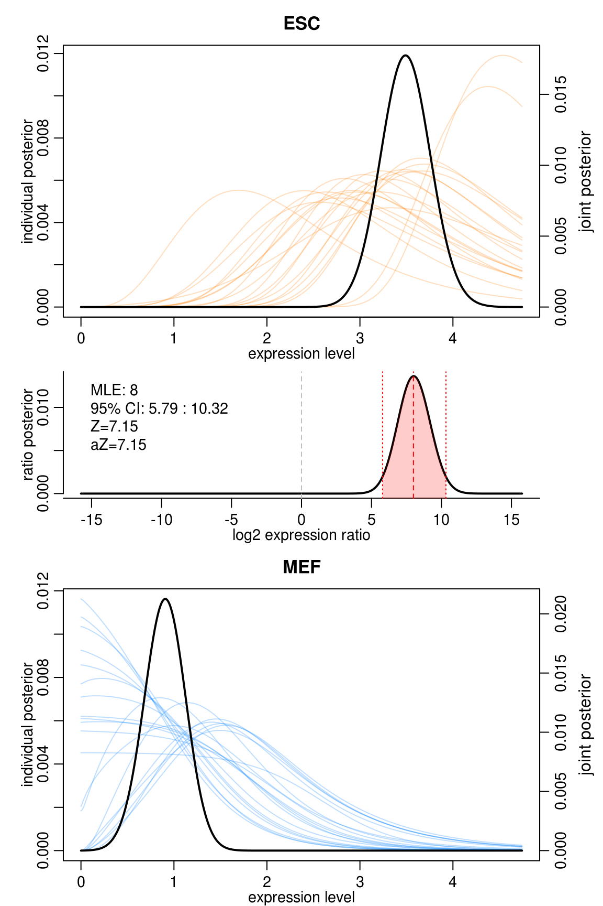

Single-cell RNA-Seq Analysis
========================================================
author: Timothy Tickle and Brian Haas
css: single_cell_analysis.css
date: October 1, 2015

Before we get started
===

- Single-cell analysis is new
  - Give you a feel for the data
  - Give you some options to explore
  - These techniques will grow as the field does

Before we get started
===

- This is VERY hands on
  - Much can be applied to other analyses
  - Strengthen those R ninja skills!
  - If you need, cut and pasting is available
  - Complex R is simplified in functions
  
---


What we will attempt to Cover
===

- How did we get here?
- How to initially look at the data.
- Ways to plot genes and samples.
- Discussion on performing inference.
- An example of unique plots for single-cell Analysis

Briefly Single-cell sequencing
===


RStudio: getting to know you
===

Let's take a moment
- Pull data from online (Github)
  - https://github.com/TimothyTickle/single_cell_analysis
- You can view this presentation on-line at
  - http://rpubs.com/timothyltickle/scAnalysis
- Quick overview of RStudio

Logistics
===
class:small-code

- install_notes.txt
- load libraries


```r
# Load libraries
library(caret)  #Near-zero filter
library(gplots)  #Colorpanel
library(scatterplot3d)  #3D plotting
library(Seurat)

# Source code
source(file.path("src", "heatmap.3b.R"))  #Custom HCL
source(file.path("src", "Modules.R"))  #Helper functions
```

Today's data set
===

Islam S et al. __Characterization of the single-cell transcriptional landscape by highly multiplex RNA-seq__ . Genome Research 2011

- 96 Samples
  - Embryonic Stem Cells (ES)
     - 2.5 k distinct genes expressed
     - Found more correlated than MEF
  - Embryonic Fibroblasts (MEF)
     - 5.4 k distinct genes expressed

Data: Ready, start, load!
===
class:small-code


```r
# Load tab delimited file
data = read.delim( file.path("data","GSE29087_L139_expression_tab.annotated_colnames.txt"), row.names = 1 )
```

Always look at your data
===
class:midcenter


A generic start
===

- These are important steps for any data set

What are our genes?
===


```r
rownames( data )
```

```
    [1] "RNA_SPIKE_1"        "RNA_SPIKE_2"        "RNA_SPIKE_3"       
    [4] "RNA_SPIKE_4"        "RNA_SPIKE_5"        "RNA_SPIKE_6"       
    [7] "RNA_SPIKE_7"        "RNA_SPIKE_8"        "Tor1aip2"          
   [10] "Pnkd"               "Smyd3"              "4921521F21Rik"     
   [13] "Gpbar1"             "1700016C15Rik"      "Eef1b2"            
   [16] "Rrp15"              "A830018L16Rik"      "Cd247"             
   [19] "Zbtb37"             "Rdh10"              "Il1rl1"            
   [22] "Tmem183a"           "Cnnm4"              "Gigyf2"            
   [25] "Cnih4"              "Traf3ip3"           "Kcnk2"             
   [28] "Cntnap5b"           "Fmo9"               "5430435G22Rik"     
   [31] "Dusp10"             "Tbc1d8"             "Cxcr2"             
   [34] "Cyb5r1"             "Ppp1r12b"           "Ly96"              
   [37] "Cr1l"               "Stat1"              "Creb1"             
   [40] "Ngef"               "Tram2"              "Atp6v1g3"          
   [43] "Prox1"              "Mir128-1"           "Dsel"              
   [46] "Tmem163"            "Darc"               "Tmem70"            
   [49] "Fn1"                "Tmem185b"           "B3galt2"           
   [52] "Mrpl15"             "Neu4"               "Pam"               
   [55] "Mybl1"              "Rgs8"               "Plxna2"            
   [58] "Neu2"               "Syt14"              "Tmem81"            
   [61] "Klhl30"             "Sf3b1"              "Dtymk"             
   [64] "Nmur1"              "Rgs16"              "Boll"              
   [67] "Pbx1"               "Ifi204"             "Tada1"             
   [70] "Lmx1a"              "Rufy4"              "Prss39"            
   [73] "Irs1"               "Ppp2r5a"            "Lemd1"             
   [76] "Pou3f3"             "Tm4sf20"            "Kdm5b"             
   [79] "Gpatch2"            "Apobec4"            "Cep170"            
   [82] "Inpp4a"             "Uchl5"              "Pkp1"              
   [85] "Mixl1"              "Rftn2"              "Psmd1"             
   [88] "Glrx2"              "Serpinc1"           "Fam78b"            
   [91] "Hsfy2"              "Vangl2"             "H3f3a"             
   [94] "Gin1"               "Adss"               "Klhl12"            
   [97] "Mpzl1"              "5830403L16Rik"      "Nek2"              
  [100] "Mpz"                "Cdk5r2"             "Col9a1"            
  [103] "Rab17"              "Ufc1"               "Fbxo36"            
  [106] "Serpinb11"          "Cnga3"              "Farp2"             
  [109] "Mgat5"              "Bzw1"               "Arpc2"             
  [112] "Farsb"              "Nos1ap"             "Ncoa2"             
  [115] "Mndal"              "Oprk1"              "Plekha6"           
  [118] "B4galt3"            "Kcnh1"              "Lrrc67"            
  [121] "Dcaf8"              "Fam168b"            "Uhmk1"             
  [124] "1500015O10Rik"      "Il1rl2"             "Batf3"             
  [127] "5033404E19Rik"      "Ormdl1"             "Selp"              
  [130] "Refbp2"             "Sertad4"            "Fmo3"              
  [133] "E030037K03Rik"      "Tnnt2"              "Serpinb3a"         
  [136] "Slc4a3"             "Scly"               "Fmod"              
  [139] "Tnfsf18"            "Ugt1a6b"            "Il24"              
  [142] "Rnasel"             "Mapkapk2"           "Kcne4"             
  [145] "Rassf5"             "Smap1"              "Inhbb"             
  [148] "Nrp2"               "Ptpn14"             "Mark1"             
  [151] "Nckap5"             "Snrpe"              "Tuba4a"            
  [154] "Tmem194b"           "Slamf1"             "Ing5"              
  [157] "Ndufb3"             "Ptpn4"              "Slco6d1"           
  [160] "Lefty1"             "Wnt6"               "Insig2"            
  [163] "Esrrg"              "Rfwd2"              "Pvrl4"             
  [166] "Stat4"              "Tbx19"              "Sdccag8"           
  [169] "Sell"               "Copa"               "Abl2"              
  [172] "Il18r1"             "Pdcl3"              "Plekhb2"           
  [175] "Pfkfb2"             "4832428D23Rik"      "Mrps14"            
  [178] "Rcsd1"              "Imp4"               "Cxcr4"             
  [181] "Nhlh1"              "Adora1"             "Trpm8"             
  [184] "Chit1"              "Otos"               "Cd55"              
  [187] "Pogk"               "Optc"               "Prelp"             
  [190] "Tmem206"            "Pard3b"             "Rnpep"             
  [193] "AA408296"           "Fbxo28"             "Dis3l2"            
  [196] "Lrrfip1"            "Enah"               "D1Ertd622e"        
  [199] "Ptprc"              "2810422O20Rik"      "Dusp12"            
  [202] "Nop58"              "Tmem37"             "Slamf7"            
  [205] "Pax3"               "Ephx1"              "Ppp1r15b"          
  [208] "AI597479"           "Hdlbp"              "Ier5"              
  [211] "Pea15a"             "Erbb4"              "Stk16"             
  [214] "Dyrk3"              "Cacybp"             "Spata3"            
  [217] "Akp3"               "Zc3h11a"            "Als2cr4"           
  [220] "Rpe"                "Scg2"               "9230116N13Rik"     
  [223] "Ramp1"              "Aff3"               "Ino80d"            
  [226] "Blzf1"              "Als2"               "Apoa2"             
  [229] "Acbd6"              "Prg4"               "Elf3"              
  [232] "Tmem9"              "Fam132b"            "Pecr"              
  [235] "Nuak2"              "Olfr1414"           "En1"               
  [238] "Atp1b1"             "Inha"               "Plekhm3"           
  [241] "Ifi203"             "Tmem169"            "Mogat1"            
  [244] "1110058L19Rik"      "Glrp1"              "Csrp1"             
  [247] "Ipo9"               "Ptpn7"              "Cd48"              
  [250] "Mobkl3"             "1700019D03Rik"      "Spag16"            
  [253] "Stk11ip"            "Ptprv"              "Fam178b"           
  [256] "Serpinb8"           "Olfr432"            "Olfr419"           
  [259] "Rab3gap2"           "3110035E14Rik"      "Lancl1"            
  [262] "9530009M10Rik"      "Trak2"              "Ccdc108"           
  [265] "Il17f"              "Gpr37l1"            "Olfr418-ps1"       
  [268] "4933406M09Rik"      "Bai3"               "Fmn2"              
  [271] "Tnp1"               "Eprs"               "Yod1"              
  [274] "Aamp"               "Fam126b"            "Fcgr3"             
  [277] "Prdx6"              "Rpl7"               "Slc19a2"           
  [280] "Clasp1"             "Steap3"             "Ube2f"             
  [283] "Ihh"                "Col3a1"             "Mcm6"              
  [286] "Ube2w"              "Nphs2"              "Cops8"             
  [289] "Lbr"                "Il1r1"              "Aox4"              
  [292] "Rgs18"              "Arl4c"              "Cnih3"             
  [295] "BC055324"           "Mstn"               "Cfh"               
  [298] "Ren2"               "Ankrd45"            "Lgsn"              
  [301] "Vash2"              "Hspd1"              "Lgtn"              
  [304] "Rgs1"               "Wdr75"              "Atp6v1h"           
  [307] "Tmem198"            "C130026I21Rik"      "Zcchc2"            
  [310] "Hspe1"              "Armc9"              "Rgl1"              
  [313] "Ralb"               "Arl8a"              "Coq10b"            
  [316] "Ankzf1"             "Satb2"              "Btg2"              
  [319] "Rcor3"              "Fcer1g"             "9430031J16Rik"     
  [322] "F11r"               "Obsl1"              "Pigr"              
  [325] "Parp1"              "B020018G12Rik"      "Prex2"             
  [328] "R3hdm1"             "Ccl20"              "F5"                
  [331] "Olfr1416"           "Fzd7"               "A130010J15Rik"     
  [334] "Pdc"                "Rxrg"               "Gm101"             
  [337] "Cntn2"              "Npas2"              "Nvl"               
  [340] "Smyd2"              "Cflar"              "Ddx18"             
  [343] "Wnt10a"             "Psen2"              "Mtap2"             
  [346] "2310035C23Rik"      "Slco5a1"            "Bat2l2"            
  [349] "Speg"               "3110009E18Rik"      "Mgat4a"            
  [352] "Sulf1"              "Scarna6"            "Ifi202b"           
  [355] "Smg7"               "Lax1"               "Cadm3"             
  [358] "Sox13"              "Rgs2"               "D630023F18Rik"     
  [361] "Faim3"              "Dnajb3"             "Fam135a"           
  [364] "Tpr"                "Spata17"            "Lefty2"            
  [367] "Bag2"               "Neurl3"             "Fam119a"           
  [370] "1700012A16Rik"      "Slamf6"             "Pask"              
  [373] "Fzd5"               "Mir206"             "Tfb2m"             
  [376] "Crygb"              "Cabc1"              "Slamf9"            
  [379] "Usp21"              "Zap70"              "Igfbp2"            
  [382] "Ikbke"              "Crispld1"           "Mfsd6"             
  [385] "Sox17"              "Dusp28"             "Ppip5k2"           
  [388] "Traf5"              "Serpinb7"           "Zfand2b"           
  [391] "Tnr"                "Wdfy1"              "Rpl37a"            
  [394] "Ptprn"              "Slc40a1"            "Ralgps2"           
  [397] "Spats2l"            "Elk4"               "Iqca"              
  [400] "Phlda3"             "Pou2f1"             "Cdh19"             
  [403] "Hibch"              "Zfp281"             "Fcer1a"            
  [406] "Olfr1410"           "Olfr1411"           "Pappa2"            
  [409] "Ica1l"              "Ppil3"              "Chml"              
  [412] "Cacna1e"            "Crb1"               "Lhx4"              
  [415] "Rnf25"              "Nfasc"              "Prdm14"            
  [418] "Apcs"               "Chst10"             "Mpp4"              
  [421] "Jph1"               "Grem2"              "Lad1"              
  [424] "Fam134a"            "Obfc2a"             "Srp9"              
  [427] "Inpp5d"             "4931440L10Rik"      "Nif3l1"            
  [430] "Aox1"               "Olfr417"            "Tnfsf4"            
  [433] "Olfr1406"           "Olfr414"            "Gm4847"            
  [436] "Mterfd2"            "Ugt1a6a"            "BC003331"          
  [439] "Camk1g"             "Dstyk"              "Cd46"              
  [442] "Pigc"               "Alppl2"             "Resp18"            
  [445] "Kcnt2"              "Pde6d"              "Rhbdd1"            
  [448] "Dtl"                "Hhat"               "Asnsd1"            
  [451] "Atic"               "Tor3a"              "Olfr16"            
  [454] "Rab23"              "Gpa33"              "Nab1"              
  [457] "Ptgs2"              "Serpinb3b"          "C130074G19Rik"     
  [460] "Kmo"                "1700034H15Rik"      "2310007B03Rik"     
  [463] "Glul"               "Tmcc2"              "Nme7"              
  [466] "Uap1"               "Slc19a3"            "Ctse"              
  [469] "Bcs1l"              "Gm4956"             "Mrpl30"            
  [472] "1190005F20Rik"      "Col5a2"             "Ankar"             
  [475] "Kcnq5"              "Lactb2"             "Lypla1"            
  [478] "Ly9"                "Bmpr2"              "Tmem177"           
  [481] "Tns1"               "Tram1"              "Serpinb12"         
  [484] "Rqcd1"              "Cyp20a1"            "Prss40"            
  [487] "Pfdn2"              "Il18rap"            "Lpgat1"            
  [490] "Opn3"               "Gpr161"             "Tatdn3"            
  [493] "Tmem63a"            "Dnajb2"             "Fcrla"             
  [496] "Vsig8"              "Sec16b"             "Teddm1"            
  [499] "Mr1"                "Mitd1"              "Lgr6"              
  [502] "Gm8883"             "Cd84"               "Actr1b"            
  [505] "Pex19"              "Igfbp5"             "Brp44"             
  [508] "Eif4e2"             "Irf6"               "Ptpn18"            
  [511] "Serpinb5"           "Mettl11b"           "Xcl1"              
  [514] "Hlx"                "1200016B10Rik"      "Gpc1"              
  [517] "1700057K13Rik"      "Akt3"               "Cacna1s"           
  [520] "Sele"               "Prim2"              "Tcea1"             
  [523] "Icos"               "Rab3gap1"           "Cfc1"              
  [526] "Map4k4"             "Ctla4"              "Pigm"              
  [529] "Gm5523"             "Arpc5"              "Bok"               
  [532] "Fam124b"            "Scarna3a"           "Ppfia4"            
  [535] "Fcrl6"              "Cenpl"              "Pcmtd1"            
  [538] "Gm6086"             "Itln1"              "Zp3r"              
  [541] "Sumo1"              "Lamc1"              "Xrcc5"             
  [544] "Mgst3"              "Cyp27a1"            "Adhfe1"            
  [547] "Snord87"            "Snora36b"           "Pm20d1"            
  [550] "Pld5"               "Prkag3"             "Utp14b"            
  [553] "Acsl3"              "Aox3l1"             "Fam36a"            
  [556] "St8sia4"            "Ercc5"              "Tnni1"             
  [559] "Osgepl1"            "Pms1"               "Als2cr12"          
  [562] "Olfr1412"           "Atf6"               "Agxt"              
  [565] "Fam5c"              "Ano7"               "Xpr1"              
  [568] "Dnm3os"             "Ncf2"               "Rpl31"             
  [571] "Exo1"               "6330578E17Rik"      "Cep350"            
  [574] "Cryga"              "Igsf8"              "Cox5b"             
  [577] "Atp2b4"             "Rabif"              "Ivns1abp"          
  [580] "Aldh9a1"            "Serpinb10-ps"       "B3gat2"            
  [583] "Thap4"              "Kif26b"             "Crygf"             
  [586] "Pikfyve"            "Mettl13"            "Casp8"             
  [589] "Fh1"                "Gm7609"             "Uxs1"              
  [592] "Gpr35"              "F13b"               "Rims1"             
  [595] "Eya1"               "Atf3"               "Pi15"              
  [598] "Gpr45"              "Lmod1"              "Cfhr1"             
  [601] "Usf1"               "Tgfb2"              "Agfg1"             
  [604] "Serpinb3c"          "Rasal2"             "Sgk3"              
  [607] "Zbtb41"             "Kcnj13"             "Sh2d1b1"           
  [610] "Zranb3"             "Stk17b"             "Zfp451"            
  [613] "Sdpr"               "Marco"              "Rrs1"              
  [616] "4930521A18Rik"      "Mosc2"              "Ccdc115"           
  [619] "Ddx59"              "Cntnap5a"           "Crygd"             
  [622] "Ndufs1"             "G0s2"               "Tpp2"              
  [625] "Slc30a1"            "Vcpip1"             "Dnpep"             
  [628] "Heatr7b1"           "AA986860"           "Olfr248"           
  [631] "Gsta3"              "Slc41a1"            "Chi3l1"            
  [634] "Mrps9"              "Acadl"              "Fmo1"              
  [637] "Twist2"             "Orc2l"              "Myo1b"             
  [640] "Mybph"              "Ddr2"               "Bpnt1"             
  [643] "Fam71a"             "Plcd4"              "Soat1"             
  [646] "Kiss1"              "Nsl1"               "Itm2c"             
  [649] "Hnrnpu"             "Crp"                "Fam129a"           
  [652] "Trove2"             "Ubxn4"              "Rp1"               
  [655] "Scyl3"              "Angel2"             "Fhl2"              
  [658] "Smarcal1"           "Tsn"                "Efcab2"            
  [661] "Ncl"                "Capn2"              "Ap1s3"             
  [664] "Lhx9"               "Vps4b"              "St18"              
  [667] "Fcgr2b"             "Mlph"               "Uck2"              
  [670] "Dpt"                "Etnk2"              "Fam174a"           
  [673] "Fam117b"            "Myl1"               "Lyg1"              
  [676] "Kctd18"             "Ankrd44"            "Pyhin1"            
  [679] "Ugt1a7c"            "D2hgdh"             "Myoc"              
  [682] "4931428L18Rik"      "Gm3646"             "Gm3852"            
  [685] "Arid5a"             "Dusp27"             "Rnf2"              
  [688] "Ankrd39"            "D1Bwg0212e"         "Epb4.1l5"          
  [691] "Cdc73"              "Tcfap2d"            "Nit1"              
  [694] "Nav1"               "Golt1a"             "Adam23"            
  [697] "Cpa6"               "Fam163a"            "Hsd11b1"           
  [700] "Slco4c1"            "1700025G04Rik"      "1700009P17Rik"     
  [703] "Ankrd23"            "Tmem182"            "Bcl2"              
  [706] "Serpinb3d"          "Sh3bp4"             "Tnn"               
  [709] "Stradb"             "Agap1"              "Adamts4"           
  [712] "Dst"                "Rbbp5"              "Creg2"             
  [715] "Dars"               "Mael"               "Ccnt2"             
  [718] "Ccnyl1"             "Cab39"              "Serpinb2"          
  [721] "Hdac4"              "Abi2"               "Bivm"              
  [724] "Inpp1"              "Stk25"              "Kifap3"            
  [727] "Pla2g4a"            "Hs6st1"             "Avpr1b"            
  [730] "5730559C18Rik"      "Stau2"              "Pkhd1"             
  [733] "Mki67ip"            "Tagln2"             "Hjurp"             
  [736] "Timm17a"            "Igsf9"              "Wdr12"             
  [739] "Vamp4"              "Chrng"              "1700056E22Rik"     
  [742] "1810031K17Rik"      "Nr1i3"              "Col4a3"            
  [745] "Klf7"               "Ndufs2"             "Kif14"             
  [748] "Khdrbs2"            "Olfr429"            "Cxcr7"             
  [751] "Tcfcp2l1"           "Mcm3"               "Gal3st2"           
  [754] "Il17a"              "Il10"               "Cdh20"             
  [757] "D1Pas1"             "Ptma"               "Gm16432"           
  [760] "Kdsr"               "Klhdc8a"            "2810459M11Rik"     
  [763] "Col19a1"            "Pcp4l1"             "Phlpp1"            
  [766] "Cd244"              "Asb18"              "Serpine2"          
  [769] "Tmem131"            "Rgs13"              "Msc"               
  [772] "2310009B15Rik"      "Cnst"               "Fmo4"              
  [775] "Ncstn"              "1110028C15Rik"      "Hecw2"             
  [778] "Slc39a10"           "Vil1"               "Fev"               
  [781] "Ctdsp1"             "Angptl1"            "Ilkap"             
  [784] "B3gnt7"             "Paqr8"              "Wdr64"             
  [787] "Slc11a1"            "Rgs7"               "Wdr26"             
  [790] "Tiprl"              "Sft2d2"             "Gulp1"             
  [793] "4930455F23Rik"      "Dusp23"             "Lmbrd1"            
  [796] "Daf2"               "Tlr5"               "Srgap2"            
  [799] "Mdm4"               "Terf1"              "Rgs4"              
  [802] "Dner"               "Tsga10"             "Asb1"              
  [805] "Olfr427"            "Unc50"              "Crygc"             
  [808] "Crisp4"             "Sept2"              "Tceb1"             
  [811] "Idh1"               "Lamc2"              "Glb1l"             
  [814] "Nr5a2"              "Olfr1413"           "Olfr12"            
  [817] "Olfr1404"           "Nck2"               "Stx6"              
  [820] "Thsd7b"             "Cryge"              "Pdcd1"             
  [823] "Gls"                "Ccdc150"            "Dedd"              
  [826] "Fcamr"              "Fcgr4"              "Myog"              
  [829] "Clk1"               "Atg16l1"            "Spp2"              
  [832] "BC031781"           "Prrx1"              "Kcnj9"             
  [835] "4632411B12Rik"      "Npl"                "Ccdc93"            
  [838] "Rev1"               "1110034B05Rik"      "1700022P22Rik"     
  [841] "Slc16a14"           "Ptp4a1"             "Nek7"              
  [844] "Trip12"             "Rabgap1l"           "Pign"              
  [847] "Hes6"               "Ugt1a10"            "Kctd3"             
  [850] "Dars2"              "Fam5b"              "Gdap1"             
  [853] "Nuf2"               "Qsox1"              "Actr3"             
  [856] "Abcb6"              "Slamf8"             "Adipor1"           
  [859] "Nbeal1"             "Rab7l1"             "Ugt1a5"            
  [862] "Atp1a2"             "Cr2"                "Htr5b"             
  [865] "Pth2r"              "Cspp1"              "Ikzf2"             
  [868] "Mars2"              "Zfp238"             "Pppde1"            
  [871] "4933415F23Rik"      "Slc23a3"            "Arfgef1"           
  [874] "Cdk18"              "Acbd3"              "Ugt1a2"            
  [877] "Serpinb13"          "Ankmy1"             "Als2cr11"          
  [880] "Dcaf6"              "Degs1"              "Tmem14a"           
  [883] "Htr2b"              "Gmppa"              "Pycr2"             
  [886] "Snord89"            "Bend6"              "Ints7"             
  [889] "Olfr1408"           "Ren1"               "Sdhc"              
  [892] "Nppc"               "Cul3"               "Wdr69"             
  [895] "Aox3"               "Ndufa10"            "Fasl"              
  [898] "Mdh1b"              "Epha4"              "Cops5"             
  [901] "Syt2"               "Des"                "Rnf152"            
  [904] "Tmeff2"             "Slc35f5"            "Astn1"             
  [907] "Ifi205"             "Sag"                "Ush2a"             
  [910] "Tmbim1"             "Sned1"              "Tor1aip1"          
  [913] "Cd28"               "Olfr424"            "Olfr421"           
  [916] "Olfr430"            "Olfr433"            "Slc45a3"           
  [919] "Sp100"              "Ecel1"              "Cd34"              
  [922] "Capn10"             "Spna1"              "Capn8"             
  [925] "Il1r2"              "Itpkb"              "Prlh"              
  [928] "Edem3"              "Il20"               "Nmnat2"            
  [931] "Snord47"            "Lyplal1"            "Sccpdh"            
  [934] "Gpr1"               "Cdh7"               "Shisa4"            
  [937] "Susd4"              "Rnpepl1"            "Sp110"             
  [940] "Cops7b"             "Bard1"              "Zfp142"            
  [943] "Tcfap2b"            "Sntg1"              "Alpi"              
  [946] "Pinc"               "Rps6kc1"            "Dnm3"              
  [949] "Gas5"               "Gm5069"             "Txndc9"            
  [952] "C1ql2"              "Lin9"               "Mfsd4"             
  [955] "Chrnd"              "Atg4b"              "Gm4846"            
  [958] "Mosc1"              "Camsap1l1"          "Fastkd2"           
  [961] "AI848100"           "Mff"                "A630001G21Rik"     
  [964] "Defb41"             "Ugt1a1"             "Stk36"             
  [967] "A530032D15Rik"      "Slco6c1"            "Lrrn2"             
  [970] "Arhgef4"            "Rgs5"               "Adcy10"            
  [973] "Gorab"              "Accn4"              "Usp37"             
  [976] "Cxcr1"              "1700029F09Rik"      "Efhc1"             
  [979] "Gpr39"              "Nucks1"             "Abca12"            
  [982] "Ugt1a9"             "Trpa1"              "Sema4c"            
  [985] "Slc9a4"             "Fam123c"            "Nhej1"             
  [988] "Trp53bp2"           "Arhgap30"           "Aqp12"             
  [991] "Vwc2l"              "Tsen15"             "Carf"              
  [994] "Cnnm3"              "Tnfrsf11a"          "Fam72a"            
  [997] "Dennd1b"            "Per2"               "Snhg6"             
 [1000] "E330020D12Rik"      "Gm13363"            "Olfml2b"           
 [1003] "C4bp"               "Dhx9"               "Snord82"           
 [1006] "6030422M02Rik"      "Tstd1"              "1700066M21Rik"     
 [1009] "Cdc42bpa"           "Rfx8"               "Gm4850"            
 [1012] "Ccdc121"            "9130024F11Rik"      "Iars2"             
 [1015] "A230020J21Rik"      "Uggt1"              "Dpp10"             
 [1018] "1700020N18Rik"      "Sgol2"              "Kif1a"             
 [1021] "Creg1"              "3110079O15Rik"      "1700047M11Rik"     
 [1024] "Gm13749"            "Eif5b"              "4930594C11Rik"     
 [1027] "Dnahc7b"            "Ccdc19"             "Slc26a9"           
 [1030] "Khdc1b"             "Glt25d2"            "4930523C07Rik"     
 [1033] "Plcl1"              "Aspm"               "Rb1cc1"            
 [1036] "Tdrd5"              "Gpr25"              "Myeov2"            
 [1039] "EG214403"           "1700001G17Rik"      "Dock10"            
 [1042] "Efhd1"              "Fam20b"             "4933400F21Rik"     
 [1045] "9430060I03Rik"      "C130036L24Rik"      "2810025M15Rik"     
 [1048] "2610203C22Rik"      "7530420F21Rik"      "Olfr420"           
 [1051] "Kdelc1"             "1700019A02Rik"      "1700019O17Rik"     
 [1054] "2010300C02Rik"      "Ysk4"               "4921528O07Rik"     
 [1057] "Ildr2"              "Lamb3"              "Snord11"           
 [1060] "Gm5415"             "C4bp-ps1"           "March4"            
 [1063] "Ppox"               "Mfsd7b"             "Mrpl44"            
 [1066] "Gli2"               "6330403A02Rik"      "Unc80"             
 [1069] "Kcnb2"              "Tmco1"              "Klhl20"            
 [1072] "Kif21b"             "Ogfrl1"             "9430016H08Rik"     
 [1075] "Lct"                "Phf3"               "Cryba2"            
 [1078] "1700015E13Rik"      "Gpr55"              "BC026585"          
 [1081] "Tomm40l"            "Raph1"              "Lipt1"             
 [1084] "Slco6b1"            "Rbm44"              "Cenpf"             
 [1087] "Kcnj10"             "4931408C20Rik"      "4922505E12Rik"     
 [1090] "Vmn1r1"             "Mfsd9"              "A730008H23Rik"     
 [1093] "Chpf"               "Gm106"              "9430070O13Rik"     
 [1096] "Lrrc52"             "Rnf149"             "Sctr"              
 [1099] "2900060B14Rik"      "2900092D14Rik"      "Sphkap"            
 [1102] "Casq1"              "2610017I09Rik"      "Npbwr1"            
 [1105] "Snora41"            "Snord70"            "BC026782"          
 [1108] "Hmcn1"              "Gm973"              "Ttll4"             
 [1111] "Olfr1415"           "Rc3h1"              "Mnda"              
 [1114] "Lyg2"               "Sp140"              "A530098C11Rik"     
 [1117] "Sgpp2"              "Cps1"               "Defb18"            
 [1120] "Gm5531"             "9130409I23Rik"      "Espnl"             
 [1123] "Usp40"              "Gm216"              "Il19"              
 [1126] "Slc9a2"             "Olfr218"            "Gm15386"           
 [1129] "Acmsd"              "Ube2t"              "Pik3c2b"           
 [1132] "Olfr220"            "Lypd1"              "Gbx2"              
 [1135] "Ahctf1"             "Mir29c"             "Mir26b"            
 [1138] "Snora75"            "Mir181b-1"          "Mir199a-2"         
 [1141] "Mir135b"            "Mir30a"             "Mir194-1"          
 [1144] "Mir350"             "Mir205"             "Mir181a-1"         
 [1147] "Mir215"             "Mir149"             "Mir488"            
 [1150] "Cdk15"              "Mir30c-2"           "Mir29b-2"          
 [1153] "E430029J22Rik"      "Gm15455"            "Gpr52"             
 [1156] "Gm597"              "Pid1"               "BC094916"          
 [1159] "Lonrf2"             "1700084C01Rik"      "Khdc1c"            
 [1162] "Slc30a10"           "Khdc1a"             "Mir214"            
 [1165] "Fmo2"               "Sh2d1b2"            "Tgfbrap1"          
 [1168] "Nenf"               "Zdbf2"              "Pgap1"             
 [1171] "Ppp1r7"             "Mir133b"            "Mir375"            
 [1174] "Zbed6"              "Dgkd"               "Gtf3c3"            
 [1177] "Lman2l"             "Fcrlb"              "Traf3ip1"          
 [1180] "Dytn"               "Hsd17b7"            "Xkr4"              
 [1183] "Xkr9"               "Mreg"               "Dbi"               
 [1186] "Col4a4"             "7420461P10Rik"      "1810030J14Rik"     
 [1189] "Gm10516"            "Rgs20"              "C030002c11rik"     
 [1192] "A330023F24Rik"      "Klhdc9"             "Atp1a4"            
 [1195] "AA619741"           "Rd3"                "Fmo6"              
 [1198] "Olfr231"            "Nms"                "Aim2"              
 [1201] "Defb44-ps"          "Atg9a"              "Mir1981"           
 [1204] "Mir664"             "Slc22a16"           "Atoh7"             
 [1207] "Cdk2"               "Myo1a"              "Myl6b"             
 [1210] "Plekhg1"            "Shprh"              "Rnf41"             
 [1213] "Vmn2r80"            "Cdk19"              "Osbpl8"            
 [1216] "Btg1"               "Anks1b"             "Sec63"             
 [1219] "Myb"                "Wdr18"              "Agpat3"            
 [1222] "Caps2"              "Nxph4"              "1700009J07Rik"     
 [1225] "Olfr773"            "Zwint"              "Olfr1357"          
 [1228] "Tube1"              "Elk3"               "Epm2a"             
 [1231] "Tab2"               "Pex7"               "Jmjd1c"            
 [1234] "Lyz1"               "Ric8b"              "Rmst"              
 [1237] "Nav3"               "Upb1"               "Psap"              
 [1240] "Ccar1"              "Syne1"              "Csl"               
 [1243] "Mettl7b"            "2410017P07Rik"      "Ccdc53"            
 [1246] "Dusp6"              "Tbata"              "Raet1c"            
 [1249] "Vmn2r85"            "Cited2"             "Dos"               
 [1252] "Col13a1"            "Vmn2r83"            "Ankrd52"           
 [1255] "Ankrd24"            "Gdf11"              "Ppfia2"            
 [1258] "Tdg"                "Egr2"               "Apba3"             
 [1261] "9530003J23Rik"      "Hk1"                "Pkib"              
 [1264] "Arid5b"             "Inhbe"              "Gas2l3"            
 [1267] "1810043G02Rik"      "Lrp11"              "Zc3h12d"           
 [1270] "Hmg20b"             "Lum"                "Olfr776"           
 [1273] "Fam54a"             "Aim1"               "Ranbp2"            
 [1276] "Slc35d3"            "Srgn"               "Rhobtb1"           
 [1279] "Vta1"               "Mgat4c"             "Gadd45b"           
 [1282] "Med23"              "Rdh19"              "Apon"              
 [1285] "Chpt1"              "R3hdm2"             "Olfr788"           
 [1288] "Olfr812"            "Stab2"              "Cpm"               
 [1291] "Slc19a1"            "D10Jhu81e"          "Rgs17"             
 [1294] "Plxnc1"             "Ppp1r14c"           "Olfr1355"          
 [1297] "Aifm2"              "Dtx3"               "Hnrnph3"           
 [1300] "1700027D21Rik"      "Pcdh15"             "Slc39a3"           
 [1303] "Vip"                "Gli1"               "Syt1"              
 [1306] "Gstt2"              "Hace1"              "Nfyb"              
 [1309] "4930519F09Rik"      "Slc35e3"            "Celf5"             
 [1312] "Npffr1"             "Ascc1"              "Slc25a3"           
 [1315] "Neurod4"            "Eif4ebp2"           "4930444G20Rik"     
 [1318] "Hsp90b1"            "1700025K23Rik"      "Xpot"              
 [1321] "Os9"                "Reps1"              "Tjp3"              
 [1324] "Mical1"             "Gm4307"             "Gm4302"            
 [1327] "Gm4303"             "Fgd6"               "Tspan8"            
 [1330] "Tbk1"               "Fuca2"              "Hint3"             
 [1333] "Rev3l"              "Esr1"               "Tnfaip3"           
 [1336] "Ndufa12"            "Fzr1"               "Wasf1"             
 [1339] "Olig3"              "Tle6"               "Ppm1h"             
 [1342] "Tmtc3"              "Cep290"             "Xrcc6bp1"          
 [1345] "Nr2e1"              "Dna2"               "Avpr1a"            
 [1348] "Avil"               "Rassf3"             "4632428N05Rik"     
 [1351] "Sirt1"              "Tmem194"            "Jsrp1"             
 [1354] "Hey2"               "Tspyl1"             "Fgf22"             
 [1357] "Rps12"              "Derl3"              "Mrpl42"            
 [1360] "Lilrb4"             "Stk11"              "Hebp2"             
 [1363] "Kitl"               "Gng7"               "Anapc16"           
 [1366] "Slc41a2"            "Slc5a8"             "9130017N09Rik"     
 [1369] "Stx11"              "Mypn"               "Sarnp"             
 [1372] "Nap1l1"             "Adamtsl5"           "Palm"              
 [1375] "Diras1"             "Aire"               "Casp14"            
 [1378] "1700020N01Rik"      "Stx7"               "1700021F05Rik"     
 [1381] "Dip2a"              "Hcn2"               "Txnrd1"            
 [1384] "1600002K03Rik"      "Taar1"              "Mif"               
 [1387] "Olfr813"            "Snrpf"              "C2cd4c"            
 [1390] "Rab21"              "Pcnt"               "Slc16a10"          
 [1393] "Rfx4"               "BC048403"           "Dnajb12"           
 [1396] "Pex3"               "Zbtb24"             "H2afy2"            
 [1399] "Tbxa2r"             "Itgb1bp3"           "Olfr1356"          
 [1402] "Zfp781"             "Fam184a"            "Madcam1"           
 [1405] "Eya4"               "Esyt1"              "Hmga2"             
 [1408] "Snrpd3"             "Helb"               "Apof"              
 [1411] "Spic"               "Fstl3"              "Ect2l"             
 [1414] "Nedd1"              "Vgll2"              "Cdk1"              
 [1417] "Grik2"              "Aes"                "Slc39a5"           
 [1420] "Rdh7"               "Perp"               "Creb3l3"           
 [1423] "Tcf3"               "Izumo4"             "Taar8c"            
 [1426] "Gcc2"               "Zdhhc17"            "Chchd10"           
 [1429] "Tle2"               "Wif1"               "Myct1"             
 [1432] "Tbc1d30"            "Ppp1r12a"           "Ddt"               
 [1435] "Fam13c"             "Rdh16"              "Chst3"             
 [1438] "Naca"               "Rab5b"              "Lama4"             
 [1441] "Socs2"              "Pias4"              "Rassf9"            
 [1444] "Cdk17"              "Vmn2r81"            "Gm6251"            
 [1447] "Tspan15"            "Man1a"              "Ptprr"             
 [1450] "Grm1"               "Ankrd57"            "Oit3"              
 [1453] "Tysnd1"             "Amdhd1"             "Ccdc105"           
 [1456] "Ank3"               "Dram1"              "Col6a2"            
 [1459] "Fyn"                "Traf3ip2"           "Thop1"             
 [1462] "Epb4.1l2"           "Amd2"               "Sirt6"             
 [1465] "Ggt1"               "Nab2"               "Ckap4"             
 [1468] "Tmtc2"              "Gm4340"             "Olfr247"           
 [1471] "Olfr796"            "Glipr1l2"           "BC013529"          
 [1474] "Lrriq1"             "Popdc3"             "Prmt2"             
 [1477] "D10Bwg1379e"        "B4galnt1"           "Olfr1351"          
 [1480] "Gm3258"             "Plagl1"             "6330407J23Rik"     
 [1483] "Poc1b"              "AI646023"           "2010107G23Rik"     
 [1486] "Bclaf1"             "Ormdl2"             "Ctgf"              
 [1489] "Trappc10"           "Grip1"              "Nr1h4"             
 [1492] "Myl6"               "Vnn3"               "Wisp3"             
 [1495] "Cct2"               "Tbpl1"              "Sf3b5"             
 [1498] "Rpf2"               "Olfr799"            "Olfr808"           
 [1501] "Olfr791"            "Csnk1g2"            "Dot1l"             
 [1504] "Ctnna3"             "Klf16"              "Pawr"              
 [1507] "Olfr780"            "Ppa1"               "Olfr772"           
 [1510] "Olfr769"            "Enpp3"              "Gzmm"              
 [1513] "Tcf21"              "Lss"                "Tmpo"              
 [1516] "Adarb1"             "Slc16a9"            "Il23a"             
 [1519] "Pcbd1"              "Slc1a6"             "Zc3h10"            
 [1522] "Dohh"               "Nudt4"              "Gamt"              
 [1525] "Smarcb1"            "Sgk1"               "AU041133"          
 [1528] "Lace1"              "Dnmt3l"             "Dgka"              
 [1531] "Cytsa"              "Mobkl2a"            "Plekhj1"           
 [1534] "Theg"               "Tbc1d15"            "Echdc1"            
 [1537] "Arl1"               "Hdac2"              "Icosl"             
 [1540] "Scamp4"             "Olfr818"            "Olfr821"           
 [1543] "9330159F19Rik"      "Gtf3c6"             "Rps15"             
 [1546] "Herc4"              "Bsg"                "Syn3"              
 [1549] "Lsm7"               "Olfr8"              "Slc16a7"           
 [1552] "Enpp1"              "Glt8d2"             "Olfr765"           
 [1555] "Olfr784"            "Olfr781"            "Mmp19"             
 [1558] "Cdc40"              "Mmp11"              "Pfkl"              
 [1561] "Atg5"               "Iltifb"             "Smarcc2"           
 [1564] "Gm4922"             "BC021785"           "Rnf217"            
 [1567] "Fam164b"            "Rnf126"             "Unc5b"             
 [1570] "Cdc34"              "Frs2"               "Fam108a"           
 [1573] "Grin3b"             "Clvs2"              "Rmnd1"             
 [1576] "Qrsl1"              "Tac2"               "Gna15"             
 [1579] "Olfr767"            "Slc29a3"            "Utrn"              
 [1582] "Olfr802"            "Olfr790"            "Snx3"              
 [1585] "Ncln"               "Kiss1r"             "Ppil4"             
 [1588] "3110049J23Rik"      "Nuak1"              "Apc2"              
 [1591] "Vps26a"             "Gm6924"             "Gpr182"            
 [1594] "Gpx4"               "Gstt3"              "Tpd52l1"           
 [1597] "Sdr9c7"             "D10Ertd610e"        "Amh"               
 [1600] "Kcnmb4"             "Actr6"              "Uqcr11"            
 [1603] "Olfr814"            "Ust"                "Hbs1l"             
 [1606] "Lims1"              "Fbxo30"             "Nup107"            
 [1609] "Lta4h"              "Olfr827"            "Olfr801"           
 [1612] "Tacr2"              "Efna2"              "Ube2n"             
 [1615] "Glipr1"             "Ppil6"              "Trmt11"            
 [1618] "Mdm1"               "Raet1d"             "Timp3"             
 [1621] "Metap2"             "Marcks"             "Gstt1"             
 [1624] "Sumo3"              "BC005764"           "Mettl1"            
 [1627] "1700040L02Rik"      "Prf1"               "Apaf1"             
 [1630] "Elane"              "Akap7"              "Sf3a2"             
 [1633] "Cfd"                "Pmch"               "Foxo3"             
 [1636] "Cnot2"              "Rab32"              "Polr3b"            
 [1639] "Acss3"              "Aldh8a1"            "Tmem19"            
 [1642] "3110056O03Rik"      "Olfr770"            "Olfr763"           
 [1645] "Rdh9"               "Lrp1"               "Slc5a4b"           
 [1648] "Map2k2"             "Iyd"                "Olfr805"           
 [1651] "Olfr798"            "Olfr803"            "Olfr806"           
 [1654] "Olfr811"            "Olfr810"            "Cyp27b1"           
 [1657] "Eef2"               "Pdss2"              "Sesn1"             
 [1660] "Cabin1"             "Msl3l2"             "Gns"               
 [1663] "F630110N24Rik"      "Ros1"               "Atp5b"             
 [1666] "Sbno2"              "Ipmk"               "5830405N20Rik"     
 [1669] "S100b"              "Ndufs7"             "Ostm1"             
 [1672] "Polrmt"             "X99384"             "Ccdc28a"           
 [1675] "Mon2"               "Igf1"               "Mtrf1l"            
 [1678] "Ascc3"              "Cnpy2"              "Reep3"             
 [1681] "Wibg"               "Olfr9"              "Lemd3"             
 [1684] "Col10a1"            "Atcay"              "2510012J08Rik"     
 [1687] "Shc2"               "Med16"              "Olfr809"           
 [1690] "Gna11"              "Lrrc3"              "Thap2"             
 [1693] "Susd2"              "Itga7"              "4930507D05Rik"     
 [1696] "Hs3st5"             "Txlnb"              "Gstt4"             
 [1699] "Ddx50"              "Gm10318"            "Atp2b1"            
 [1702] "Sycp3"              "Cry1"               "Vmn2r84"           
 [1705] "Zbtb7a"             "Ptprb"              "Pip4k2c"           
 [1708] "Oaz1"               "Rap1b"              "Baz2a"             
 [1711] "Aig1"               "Sar1a"              "Pcmt1"             
 [1714] "Ndufa4l2"           "Tfam"               "Mcm3ap"            
 [1717] "Ddo"                "Atp8b3"             "Raet1a"            
 [1720] "Lyz2"               "Rspo3"              "Sim1"              
 [1723] "Hddc2"              "Arid3a"             "Nr2c1"             
 [1726] "BC025920"           "Fhl4"               "Olfr816"           
 [1729] "Olfr815"            "1700049L16Rik"      "Prtn3"             
 [1732] "Ccdc59"             "Llph"               "Adat2"             
 [1735] "Mars"               "Vmn2r87"            "Vmn2r86"           
 [1738] "Mtap7"              "Rtn4ip1"            "Tspyl4"            
 [1741] "Pde7b"              "Fam26e"             "Col6a1"            
 [1744] "Slc5a4a"            "Nodal"              "Slc25a16"          
 [1747] "Prim1"              "Samd3"              "Lrrc10"            
 [1750] "Trhde"              "Tmbim4"             "Stac3"             
 [1753] "Ano4"               "Phyhipl"            "Olfr825"           
 [1756] "Olfr820"            "Olfr826"            "Lats1"             
 [1759] "Cd24a"              "Gnaz"               "Fig4"              
 [1762] "Olfr1353"           "Olfr1352"           "Ntn4"              
 [1765] "Gja1"               "Smpdl3a"            "1110021L09Rik"     
 [1768] "Pbld"               "Sash1"              "Gm4792"            
 [1771] "Ddit4"              "Rdh1"               "Olfr800"           
 [1774] "Pwp1"               "Akap12"             "Mrpl54"            
 [1777] "Hsd17b6"            "Rwdd1"              "Edar"              
 [1780] "Mknk2"              "Gpr6"               "Dnajc14"           
 [1783] "Pwp2"               "Stox1"              "Dcbld1"            
 [1786] "Rnf146"             "Lrig3"              "4930547N16Rik"     
 [1789] "2610028H24Rik"      "Ifng"               "Zfp280b"           
 [1792] "Aldh1l2"            "Btbd11"             "Fbxo7"             
 [1795] "Cd63"               "Pip5k1c"            "Myf6"              
 [1798] "Myf5"               "Rtkn2"              "Gm5779"            
 [1801] "Gm5176"             "Vmn2r82"            "P4ha1"             
 [1804] "Bend3"              "Olfr807"            "Pan2"              
 [1807] "BC067068"           "Nus1"               "Inhbc"             
 [1810] "Tmprss9"            "Atp5d"              "Yeats4"            
 [1813] "Ifngr1"             "Olfr768"            "Onecut3"           
 [1816] "Cbara1"             "Lgr5"               "Scml4"             
 [1819] "Map3k5"             "Epyc"               "Ptges3"            
 [1822] "Mybpc1"             "Mcm9"               "Fam26f"            
 [1825] "Frk"                "Ppap2c"             "Hmha1"             
 [1828] "Cd164"              "Il22"               "Bloc1s1"           
 [1831] "Midn"               "Ptprq"              "Gm5512"            
 [1834] "Irak3"              "Mbd3"               "Polr2e"            
 [1837] "Hsf2"               "Nmbr"               "BC089597"          
 [1840] "Sgpl1"              "Zfr2"               "Arg1"              
 [1843] "BC030307"           "Ikzf4"              "Reep6"             
 [1846] "Mier2"              "Cnn2"               "Ncoa7"             
 [1849] "Erbb3"              "Hal"                "Dcn"               
 [1852] "Mterfd3"            "Olfr786"            "Olfr775"           
 [1855] "Olfr771"            "Olfr777"            "Tet1"              
 [1858] "Olfr823"            "Olfr824"            "Olfr822"           
 [1861] "Gm4794"             "Ascl1"              "Zfa"               
 [1864] "Galnt4"             "2310011J03Rik"      "Cstb"              
 [1867] "Coq10a"             "Cradd"              "1110038D17Rik"     
 [1870] "4930430F08Rik"      "Bicc1"              "4933403O03Rik"     
 [1873] "Pa2g4"              "Gm16517"            "Ptprk"             
 [1876] "Ctdsp2"             "1700052N19Rik"      "Stxbp5"            
 [1879] "Cdh23"              "Spryd4"             "Lama2"             
 [1882] "Mum1"               "4921510H08Rik"      "Arhgap18"          
 [1885] "Cisd1"              "Tspan31"            "Timm13"            
 [1888] "Cirbp"              "Sgta"               "Lrrc20"            
 [1891] "Usp15"              "Pdxk"               "Obfc2b"            
 [1894] "Gm4489"             "Vpreb3"             "Trpm2"             
 [1897] "Rdh5"               "Ptbp1"              "Ddit3"             
 [1900] "Col18a1"            "Alx1"               "Cnksr3"            
 [1903] "Rufy2"              "Spock2"             "Pcbp3"             
 [1906] "Nts"                "Stat2"              "Pcsk4"             
 [1909] "4932415G12Rik"      "2310057J18Rik"      "Raet1b"            
 [1912] "Timeless"           "S1pr4"              "Smpd2"             
 [1915] "Nup37"              "Ikbip"              "Olfr774"           
 [1918] "Usp44"              "Ccdc162"            "Pln"               
 [1921] "Fbxo5"              "Asf1a"              "Plk5"              
 [1924] "Bpil2"              "Nt5dc1"             "Hivep2"            
 [1927] "Rexo1"              "Krtap12-1"          "Gm10778"           
 [1930] "Ggt5"               "Katna1"             "Tmem26"            
 [1933] "D10Wsu52e"          "Abca7"              "Tmem200a"          
 [1936] "Gm5136"             "Ddx21"              "Mdm2"              
 [1939] "Zbtb39"             "Ahi1"               "Neurog3"           
 [1942] "Appl2"              "Olfr794"            "Rsph4a"            
 [1945] "Ccdc138"            "Tmem5"              "Itgb2"             
 [1948] "D930020B18Rik"      "Ube2g2"             "Gp49a"             
 [1951] "Slc35f1"            "Pofut2"             "Eid3"              
 [1954] "Ccdc41"             "Fabp7"              "Csrp2"             
 [1957] "Stat6"              "Phlda1"             "Glipr1l1"          
 [1960] "Pah"                "Chst11"             "Rps26"             
 [1963] "D10Wsu102e"         "Vnn1"               "Kif5a"             
 [1966] "Ftcd"               "Matk"               "BC020402"          
 [1969] "1810008A18Rik"      "2510003E04Rik"      "Nepn"              
 [1972] "Scyl2"              "Sh3rf3"             "L3mbtl3"           
 [1975] "Mthfd1l"            "C030046I01Rik"      "Gm3238"            
 [1978] "3110003A17Rik"      "Tcp11l2"            "Rrp1"              
 [1981] "Ccdc38"             "9030224M15Rik"      "Gm3285"            
 [1984] "Syde1"              "Ccdc6"              "E130317F20Rik"     
 [1987] "Sobp"               "Gls2"               "Msrb3"             
 [1990] "Suox"               "Slc17a8"            "Utp20"             
 [1993] "9230102K24Rik"      "Gm4925"             "Speer5-ps1"        
 [1996] "Bbs10"              "Gm5424"             "Gipc3"             
 [1999] "Ccdc109a"           "Prdm1"              "Ap3d1"             
 [2002] "Nhsl1"              "Prdm4"              "Gprc6a"            
 [2005] "Il20ra"             "Uhrf1bp1l"          "Lingo3"            
 [2008] "Btbd2"              "1110012D08Rik"      "Slc6a15"           
 [2011] "Tmcc3"              "Samd5"              "E2f7"              
 [2014] "Krr1"               "Il22ra2"            "Vezt"              
 [2017] "Kera"               "1190007I07Rik"      "Zfp365"            
 [2020] "Pldi"               "Themis"             "Ltv1"              
 [2023] "Supv3l1"            "Lrrtm3"             "Mbd6"              
 [2026] "Shmt2"              "A130042E20Rik"      "Arhgap9"           
 [2029] "Rfx6"               "Nt5dc3"             "Rpl41"             
 [2032] "Slc2a12"            "Tsfm"               "Krtap10-4"         
 [2035] "Tyms-ps"            "Serinc1"            "Prep"              
 [2038] "LOC100302688"       "Fam162b"            "9030612E09Rik"     
 [2041] "1500009L16Rik"      "LOC16697"           "Mex3d"             
 [2044] "Gm9786"             "Raet1e"             "D630029K05Rik"     
 [2047] "Mip"                "4933416C03Rik"      "Adat3"             
 [2050] "Gm10941"            "Gm8580"             "LOC100045653"      
 [2053] "Adora2a"            "2010001E11Rik"      "Gm9767"            
 [2056] "Nfic"               "1810014B01Rik"      "Rtdr1"             
 [2059] "Fam19a2"            "Cenpw"              "2210404O07Rik"     
 [2062] "Gm5134"             "Amd1"               "Gm9079"            
 [2065] "Rbms2"              "Pla2g12b"           "Dazap1"            
 [2068] "Dnajc12"            "Cand1"              "B230315N10Rik"     
 [2071] "Nup43"              "A830082N09Rik"      "2310050B05Rik"     
 [2074] "C920009B18Rik"      "Ascl4"              "1700058G18Rik"     
 [2077] "Trdn"               "Tph2"               "4930503E24Rik"     
 [2080] "Prssl1"             "Hcfc2"              "1700017N19Rik"     
 [2083] "Dux"                "Lin7a"              "Fam26d"            
 [2086] "Gm4981"             "Srgap1"             "Adamts14"          
 [2089] "Oprm1"              "Bcr"                "D630037F22Rik"     
 [2092] "Krtap10-10"         "Kcnc2"              "A230046K03Rik"     
 [2095] "Sept10"             "A630066F11Rik"      "Zbtb2"             
 [2098] "March9"             "Dse"                "Gm239"             
 [2101] "Dyrk2"              "Pttg1ip"            "Gm4301"            
 [2104] "Gm4305"             "Zfc3h1"             "Heca"              
 [2107] "Ube2d1"             "Hkdc1"              "1700113H08Rik"     
 [2110] "Rab36"              "Olfr819"            "Mir546"            
 [2113] "Snord37"            "Odf3l2"             "Ado"               
 [2116] "Taar7f"             "Taar7b"             "Taar5"             
 [2119] "Taar4"              "Taar3"              "Taar2"             
 [2122] "Zfp873"             "4930404N11Rik"      "AI597468"          
 [2125] "Olfr792"            "Olfr787"            "Olfr804"           
 [2128] "Olfr782"            "Olfr57"             "2610008E11Rik"     
 [2131] "Armc2"              "Ipcef1"             "Taar7d"            
 [2134] "Taar8b"             "Taar9"              "Taar7a"            
 [2137] "Taar8a"             "Taar6"              "Nkain2"            
 [2140] "Cpsf6"              "Agap2"              "Cdk4"              
 [2143] "Gm10825"            "Gopc"               "Mirlet7i"          
 [2146] "Mir684-1-Chr10"     "Mir678"             "Mir677"            
 [2149] "Mir26a-2"           "Mir135a-2"          "Mir763"            
 [2152] "Mir331"             "Ilvbl"              "Bet3l"             
 [2155] "Gm4312"             "Si"                 "Nrbf2"             
 [2158] "Taar7e"             "Sult3a1"            "Cs"                
 [2161] "Slc26a10"           "Moxd1"              "Best3"             
 [2164] "Zufsp"              "ORF61"              "Gje1"              
 [2167] "Bves"               "G630090E17Rik"      "Lin28b"            
 [2170] "H60b"               "F830002L21Rik"      "Gm10754"           
 [2173] "BB019430"           "Rfpl4b"             "Rab3ip"            
 [2176] "Gpr126"             "Atxn7l3b"           "Gm5177"            
 [2179] "Gm8709"             "AA474331"           "AI317395"          
 [2182] "Lmnb2"              "Dctn2"              "Dapk3"             
 [2185] "Gnptab"             "Eea1"               "Mir1929"           
 [2188] "Mir1930"            "Mir1982"            "Mir1931"           
 [2191] "Phactr2"            "Mrc2"               "Fgf18"             
 [2194] "Rnf112"             "Stx8"               "Tmem97"            
 [2197] "Myo15"              "Ppp1r9b"            "Mir451"            
 [2200] "Akap1"              "Ccdc137"            "Pwwp2a"            
 [2203] "Krtap9-5"           "Card14"             "Tsen54"            
 [2206] "Morc2a"             "Rpain"              "Tubg2"             
 [2209] "Cnot8"              "C030019I05Rik"      "Exoc7"             
 [2212] "Eif4a3"             "Gcgr"               "Wap"               
 [2215] "Sirt7"              "4933422H20Rik"      "Gdf9"              
 [2218] "Appbp2"             "Sat2"               "Otop3"             
 [2221] "Eif4enif1"          "Olfr1393"           "Ccdc69"            
 [2224] "Hdac5"              "Nf2"                "Tcf7"              
 [2227] "Pemt"               "Hmmr"               "Ush1g"             
 [2230] "Rcvrn"              "Hexim1"             "Pdlim4"            
 [2233] "Rpl38"              "Osbpl7"             "E030025P04Rik"     
 [2236] "Abhd15"             "Fbxo47"             "Ccdc99"            
 [2239] "Mgat1"              "Stk10"              "Gck"               
 [2242] "Camkk1"             "Krtap9-1"           "C1qtnf2"           
 [2245] "Mink1"              "Phf12"              "Gemin4"            
 [2248] "A230051G13Rik"      "Kctd2"              "Hoxb6"             
 [2251] "Hoxb13"             "Ankrd13b"           "Gpx3"              
 [2254] "Fam196b"            "Lhx1"               "Abr"               
 [2257] "Pcyt2"              "Chad"               "Ddx5"              
 [2260] "Olfr397"            "Sarm1"              "Trim17"            
 [2263] "Mapk9"              "Bcl11a"             "Zfp62"             
 [2266] "Wnt3a"              "Tex19.2"            "Fzd2"              
 [2269] "Aspa"               "AU040829"           "Gjc1"              
 [2272] "Mlx"                "Irf1"               "Pmp22"             
 [2275] "Tcap"               "1110005A03Rik"      "Med1"              
 [2278] "Sh3bp5l"            "Tspan10"            "Fam71b"            
 [2281] "Gabrg2"             "Trp53"              "Pik3r5"            
 [2284] "Sp2"                "Cacnb1"             "Krt13"             
 [2287] "Ikzf1"              "Slc16a11"           "Gjc2"              
 [2290] "Arf1"               "1810027O10Rik"      "Higd1b"            
 [2293] "Cisd3"              "Cacng1"             "Csnk1d"            
 [2296] "Med7"               "Irgm2"              "Trim7"             
 [2299] "Hand1"              "Luc7l3"             "Fxr2"              
 [2302] "Tekt1"              "Prdxdd1"            "Slc26a11"          
 [2305] "Gm11938"            "Gm11567"            "Krt20"             
 [2308] "Ints2"              "Commd1"             "Mllt6"             
 [2311] "Rhbdl3"             "Cabp7"              "Nploc4"            
 [2314] "Wdr92"              "Nefh"               "Asb3"              
 [2317] "Il13"               "Ctns"               "Rffl"              
 [2320] "Dhrs13"             "Uqcrq"              "Ifi47"             
 [2323] "Sept8"              "Krt12"              "Olfr1380"          
 [2326] "Olfr1383"           "Cobl"               "Olfr1390"          
 [2329] "Olfr410"            "Olfr401"            "Nol11"             
 [2332] "Zpbp"               "Zpbp2"              "Ccdc104"           
 [2335] "0610010F05Rik"      "Afmid"              "Slc6a4"            
 [2338] "Olfr1378"           "Slc39a11"           "Olfr1391"          
 [2341] "Olfr1387"           "Ccdc46"             "Slfn4"             
 [2344] "Eno3"               "Myo1g"              "Rpl27"             
 [2347] "Gsdma2"             "Med31"              "Kif19a"            
 [2350] "Npm1"               "Nt5c3l"             "Dnajc7"            
 [2353] "Col23a1"            "Ace"                "Itga2b"            
 [2356] "Fat2"               "Slfn1"              "Sgcd"              
 [2359] "Slu7"               "Olfr330"            "Skap1"             
 [2362] "Phb"                "Actr2"              "Tha1"              
 [2365] "Tbc1d16"            "Kpnb1"              "Chmp6"             
 [2368] "1810049H13Rik"      "Krtap1-5"           "Krtap3-3"          
 [2371] "Fam57a"             "Efemp1"             "Gm12253"           
 [2374] "Blmh"               "Aldh3a1"            "Aoc2"              
 [2377] "Olfr389"            "Ccdc45"             "Arhgdia"           
 [2380] "Mpp2"               "Btbd17"             "Ube2b"             
 [2383] "Zfp207"             "Cct6b"              "Myl4"              
 [2386] "Expi"               "Cacng4"             "Poldip2"           
 [2389] "Ppp3r1"             "Stc2"               "Krtap31-1"         
 [2392] "Cog1"               "Rptor"              "Casc3"             
 [2395] "Socs7"              "Gm11565"            "Gm11595"           
 [2398] "Nkiras2"            "2310007L24Rik"      "1700006E09Rik"     
 [2401] "Camta2"             "Phf23"              "Galk1"             
 [2404] "Hexim2"             "D11Wsu47e"          "F830116E18Rik"     
 [2407] "Nxph3"              "Dcaf7"              "Gatsl3"            
 [2410] "Rgs9"               "Sec61g"             "Slit3"             
 [2413] "Pank3"              "Unk"                "AF251705"          
 [2416] "Bptf"               "Gh"                 "Ccdc57"            
 [2419] "Med24"              "Pnpt1"              "Leap2"             
 [2422] "Rnf167"             "Slc22a21"           "Lrrc46"            
 [2425] "Dgke"               "Fkbp10"             "Fam114a2"          
 [2428] "Tcn2"               "Tbrg4"              "Krt19"             
 [2431] "Bcl6b"              "Smcr8"              "Kif1c"             
 [2434] "Cpeb4"              "Galnt10"            "Egfr"              
 [2437] "Hap1"               "Ppm1d"              "Rnf185"            
 [2440] "Coro6"              "Coasy"              "Nptx1"             
 [2443] "Ptrf"               "Srebf1"             "Aipl1"             
 [2446] "Derl2"              "Nags"               "Erlec1"            
 [2449] "Tm4sf5"             "Clec10a"            "Ccdc85a"           
 [2452] "Spred2"             "Smurf2"             "Igfbp4"            
 [2455] "Anxa6"              "Havcr2"             "Ccdc88a"           
 [2458] "Inpp5j"             "Etv4"               "Canx"              
 [2461] "Pipox"              "Wnt9a"              "Ccdc157"           
 [2464] "Mmp28"              "Snf8"               "Gm11968"           
 [2467] "Prpsap2"            "Pttg1"              "Gm15698"           
 [2470] "Adra1b"             "Csf2"               "Olfr23"            
 [2473] "Srr"                "A730011L01Rik"      "Hoxb8"             
 [2476] "Hoxb4"              "Lasp1"              "Serpinf1"          
 [2479] "Tmc6"               "Cpsf4l"             "1500010J02Rik"     
 [2482] "Ybx2"               "Pecam1"             "Cbr2"              
 [2485] "Nfe2l1"             "Krt33a"             "Itga3"             
 [2488] "P4hb"               "Atp5g1"             "Nf1"               
 [2491] "Azi1"               "Nme1"               "Aldh3a2"           
 [2494] "G3bp1"              "Vamp2"              "4933439F18Rik"     
 [2497] "Gsdma"              "Thg1l"              "Lgals3bp"          
 [2500] "Sap30bp"            "Rabep1"             "Zfp454"            
 [2503] "Spnb2"              "Armc7"              "Smtnl2"            
 [2506] "Cox10"              "Ppp2ca"             "Cyfip2"            
 [2509] "Snora5c"            "Slc25a10"           "Pcgf2"             
 [2512] "Plxdc1"             "Abi3"               "Tbx4"              
 [2515] "Slc25a11"           "2310033P09Rik"      "Lsmd1"             
 [2518] "Vat1"               "Neurod2"            "Ccdc103"           
 [2521] "Ppy"                "Cyb5d1"             "Proca1"            
 [2524] "Hba-a1"             "Ankfy1"             "4933427D14Rik"     
 [2527] "Osbp2"              "2210415F13Rik"      "Xpo1"              
 [2530] "Tmem220"            "Cbx1"               "1700113I22Rik"     
 [2533] "1700016K19Rik"      "Chrnb1"             "Apoh"              
 [2536] "Tubd1"              "Flt4"               "Olfr179"           
 [2539] "Olfr403"            "D030028A08Rik"      "Tmc8"              
 [2542] "Zfp2"               "Gp1ba"              "Snap47"            
 [2545] "Rab1"               "Omg"                "Glra1"             
 [2548] "Becn1"              "Nacad"              "Tmem101"           
 [2551] "1700020C11Rik"      "Spaca3"             "Rnf43"             
 [2554] "Aloxe3"             "Prr11"              "Mdh1"              
 [2557] "Ccr7"               "Olfr1"              "Olfr43"            
 [2560] "Olfr398"            "Ddx42"              "Nat9"              
 [2563] "Scrn2"              "C330016O10Rik"      "Gm11937"           
 [2566] "Ovca2"              "Meis1"              "Olfr384"           
 [2569] "Llgl1"              "Atp5h"              "Cd300lg"           
 [2572] "Ewsr1"              "Dusp14"             "Smarce1"           
 [2575] "Aurkb"              "Rpl26"              "0610010K14Rik"     
 [2578] "Ehbp1"              "Ddx52"              "Rab34"             
 [2581] "Plscr3"             "Acyp2"              "Hsd17b1"           
 [2584] "Per1"               "Ramp2"              "Kcnj2"             
 [2587] "Hic1"               "Car10"              "Ndel1"             
 [2590] "Olfr1392"           "Olfr1389"           "Zfp3"              
 [2593] "Eif5a"              "Stra13"             "Epn2"              
 [2596] "Mpp3"               "Npepps"             "Timp2"             
 [2599] "Cops3"              "Ntn1"               "Wdr81"             
 [2602] "Ap1b1"              "Upp1"               "Mrpl45"            
 [2605] "Fignl1"             "Actg1"              "Myo1c"             
 [2608] "Mgl2"               "2210407C18Rik"      "Brca1"             
 [2611] "Sdk2"               "Cd79b"              "Map2k4"            
 [2614] "Aebp1"              "Arhgap23"           "Axin2"             
 [2617] "Nmt1"               "Slc43a2"            "Slfn2"             
 [2620] "Olfr59"             "Thoc4"              "Hist3h2bb-ps"      
 [2623] "Tnfaip1"            "Gabra6"             "Pelp1"             
 [2626] "Spag5"              "Zswim7"             "Krtap3-1"          
 [2629] "Krt33b"             "4931440F15Rik"      "Fbxl20"            
 [2632] "Myh4"               "Naglu"              "Cdk12"             
 [2635] "Thra"               "Rhot1"              "Mafg"              
 [2638] "Cryba1"             "Sqstm1"             "Dppa1"             
 [2641] "Gm12171"            "Rnf222"             "Cntrob"            
 [2644] "Dlg4"               "Fam171a2"           "Limk2"             
 [2647] "Syngr2"             "Olfr312"            "Olfr311"           
 [2650] "Olfr20"             "Olfr376"            "Mettl2"            
 [2653] "Krt23"              "Ngfr"               "Smarcd2"           
 [2656] "Ublcp1"             "Flii"               "Abca6"             
 [2659] "Sec14l2"            "Hoxb3"              "Olfr385"           
 [2662] "Nxn"                "Gosr2"              "Mett10d"           
 [2665] "Snx11"              "Arf2"               "Znhit3"            
 [2668] "2900041M22Rik"      "Nudcd2"             "E230016K23Rik"     
 [2671] "Psmb6"              "G6pc"               "Vezf1"             
 [2674] "Eif1"               "Tgtp1"              "Ebf1"              
 [2677] "Tmem93"             "Suz12"              "Slc16a6"           
 [2680] "Mrpl38"             "Taf15"              "Myocd"             
 [2683] "Btnl9"              "Sstr2"              "Sec14l1"           
 [2686] "Dusp3"              "Tmem107"            "Dysfip1"           
 [2689] "Sox9"               "Mrpl55"             "Alox12"            
 [2692] "Fasn"               "Gm12169"            "Krtap9-3"          
 [2695] "Pex13"              "Olfr1373"           "Abca13"            
 [2698] "Gm11564"            "Krtap17-1"          "Synrg"             
 [2701] "Nlrp3"              "Olfr1386"           "Nbr1"              
 [2704] "Xbp1"               "Sept9"              "Zfp354a"           
 [2707] "Eftud2"             "Rprml"              "C1qtnf1"           
 [2710] "Ccl5"               "Ccl4"               "Smek2"             
 [2713] "Myh10"              "Map2k6"             "Dcxr"              
 [2716] "D11Bwg0517e"        "Krt24"              "Dhx58"             
 [2719] "Spns3"              "Fam134c"            "Wipi1"             
 [2722] "Irgm1"              "Grap"               "Snord65"           
 [2725] "Il9r"               "Nsf"                "Tmem88"            
 [2728] "Ccl9"               "Phf15"              "Srsf2"             
 [2731] "B3gnt2"             "Dbnl"               "Gfpt2"             
 [2734] "Cacng5"             "Arl16"              "Ttc19"             
 [2737] "Slc1a4"             "Tubg1"              "Kcnh4"             
 [2740] "Guk1"               "Lig3"               "Gfap"              
 [2743] "Tekt3"              "Amac1"              "Rpl19"             
 [2746] "Ccl11"              "Phospho1"           "Mir142"            
 [2749] "Chac2"              "Gemin5"             "Acaca"             
 [2752] "Spem1"              "Adam19"             "Lsm11"             
 [2755] "Zfp354c"            "Crk"                "Ogdh"              
 [2758] "Slfn3"              "Gps1"               "Tmem92-ps"         
 [2761] "1810043H04Rik"      "Ccdc47"             "Tnfsf12"           
 [2764] "2810408A11Rik"      "Dhx8"               "Rps27a"            
 [2767] "Zfp616"             "Ankrd36"            "Ccm2"              
 [2770] "Ubb"                "Psmd3"              "2810021J22Rik"     
 [2773] "Tns4"               "Mmgt2"              "Hus1"              
 [2776] "Mtif2"              "Olfr462"            "Ranbp17"           
 [2779] "Nhp2"               "1110031I02Rik"      "Mrps24"            
 [2782] "Gabarap"            "Copz2"              "Top3a"             
 [2785] "Cyth1"              "Mir218-2"           "Rnmtl1"            
 [2788] "Itgb4"              "1700093K21Rik"      "Rtn4rl1"           
 [2791] "Dhx33"              "1700071K01Rik"      "Zmiz2"             
 [2794] "Snrnp25"            "Baiap2"             "Mfap3"             
 [2797] "Atpaf2"             "Gm11517"            "Crhr1"             
 [2800] "Spag9"              "Polm"               "Hcrt"              
 [2803] "Igfbp1"             "Ifi35"              "Aoc3"              
 [2806] "Rufy1"              "Tnfsf13"            "Fn3k"              
 [2809] "Ttc1"               "Agxt2l2"            "Tmem17"            
 [2812] "Dhx40"              "Fstl4"              "Olfr323"           
 [2815] "Kif2b"              "Fbf1"               "Rhbdf2"            
 [2818] "Vstm2a"             "Tex14"              "BC049762"          
 [2821] "Fbxw11"             "C630004H02Rik"      "Hnf1b"             
 [2824] "Prkca"              "Tmem11"             "Cwc25"             
 [2827] "Gm11711"            "Tmem49"             "Hormad2"           
 [2830] "Olfr1396"           "Rab5c"              "Olfr382"           
 [2833] "Slc38a10"           "Mfap4"              "Sez6"              
 [2836] "Dynll2"             "Hoxb9"              "Hoxb5"             
 [2839] "Tnrc6c"             "Gm12216"            "Taco1"             
 [2842] "Pisd-ps1"           "Mis12"              "Zfp287"            
 [2845] "Adam11"             "Cxcl16"             "Fam20a"            
 [2848] "Ern1"               "Fancl"              "Fabp6"             
 [2851] "Otop2"              "Rasd1"              "Tbx21"             
 [2854] "Spag7"              "Thoc5"              "Gria1"             
 [2857] "Grb2"               "Recql5"             "Olfr1381"          
 [2860] "Olfr381"            "Zfp39"              "Fnip1"             
 [2863] "1700012B07Rik"      "Camk2b"             "Ccl8"              
 [2866] "H2afv"              "Sox15"              "Dullard"           
 [2869] "Zfp830"             "Ykt6"               "Aspscr1"           
 [2872] "Ubtf"               "Ttll6"              "Pold2"             
 [2875] "Krtap4-6"           "Kat2a"              "Arhgef15"          
 [2878] "2210020M01Rik"      "Kremen1"            "Tmub2"             
 [2881] "Mprip"              "Slc22a4"            "Ltc4s"             
 [2884] "Engase"             "Wnt9b"              "Cd7"               
 [2887] "Cd68"               "Ccl7"               "0610009B22Rik"     
 [2890] "Dus1l"              "D930048N14Rik"      "Il12b"             
 [2893] "Acsl6"              "Olfr402"            "Mtmr3"             
 [2896] "Nog"                "Cnrip1"             "Galr2"             
 [2899] "Cacna1g"            "Sectm1b"            "Pus10"             
 [2902] "Flot2"              "Stat3"              "Metrnl"            
 [2905] "Olfr56"             "Polg2"              "Dlx4"              
 [2908] "Ddx56"              "Mnt"                "Strada"            
 [2911] "5730455P16Rik"      "Acsf2"              "Ahsa2"             
 [2914] "Sphk1"              "Zzef1"              "Pigw"              
 [2917] "Krtap1-3"           "Trim47"             "Olfr463"           
 [2920] "Olfr464"            "Glp2r"              "F930015N05Rik"     
 [2923] "Igf2bp1"            "Trim58"             "Mxra7"             
 [2926] "Slc25a39"           "Hint1"              "Fam183b"           
 [2929] "Pde6g"              "Mbtd1"              "Zkscan17"          
 [2932] "Patz1"              "Tmem132e"           "Hn1"               
 [2935] "Hspa4"              "Sebox"              "Psmd12"            
 [2938] "Akap10"             "Hs3st3b1"           "Cdc42ep4"          
 [2941] "Ap2b1"              "Krt222"             "1700020L24Rik"     
 [2944] "Pfn1"               "Sf3a1"              "Krt27"             
 [2947] "Gm11710"            "Vps53"              "Cntd1"             
 [2950] "Txndc17"            "Asgr1"              "Skp1a"             
 [2953] "Gas7"               "Slc9a3r1"           "1700125H20Rik"     
 [2956] "Krt10"              "Urgcp"              "Mfsd11"            
 [2959] "March10"            "Traf4"              "Olfr378"           
 [2962] "Psmc5"              "Evi2a"              "2810433D01Rik"     
 [2965] "Tmigd1"             "Rdm1"               "Pip4k2b"           
 [2968] "Abca8b"             "Ggt6"               "Rnf215"            
 [2971] "Ankrd40"            "Zfp735"             "Dnahc2"            
 [2974] "Ghdc"               "Rpl23a"             "Rilp"              
 [2977] "Dnahc9"             "Amz2"               "Tbcd"              
 [2980] "Ncor1"              "Rad51l3"            "Slc35b1"           
 [2983] "Kctd11"             "Slc36a1"            "Olfr393"           
 [2986] "Gm885"              "Adora2b"            "Vps25"             
 [2989] "Fmnl1"              "Vtn"                "Trpv2"             
 [2992] "Itgb3"              "Gna13"              "Supt6h"            
 [2995] "Rel"                "Rfng"               "Krt14"             
 [2998] "C1qbp"              "Aanat"              "Cntnap1"           
 [3001] "1110017F19Rik"      "BC017643"           "Ppm1e"             
 [3004] "Ccl6"               "Fads6"              "Gabrb2"            
 [3007] "2310003H01Rik"      "Krt25"              "Stac2"             
 [3010] "Grm6"               "BC046404"           "Zmynd15"           
 [3013] "Olfr1394"           "Olfr317"            "Aatk"              
 [3016] "Hoxb2"              "Mtmr4"              "Rhbdf1"            
 [3019] "Ksr1"               "4930544D05Rik"      "Nprl3"             
 [3022] "D11Wsu99e"          "Butr1"              "Prkar1a"           
 [3025] "Abca9"              "Papolg"             "Zbtb4"             
 [3028] "Efnb3"              "Atp2a3"             "Fdxr"              
 [3031] "6330403K07Rik"      "Stard3"             "Tnfrsf13b"         
 [3034] "Gprc5c"             "B230217C12Rik"      "Olfr399"           
 [3037] "Olfr411"            "Sec14l4"            "Caskin2"           
 [3040] "Nsg2"               "Tlx3"               "Gm12238"           
 [3043] "Map3k14"            "Sfi1"               "Igtp"              
 [3046] "Birc5"              "Cdc6"               "Ube2z"             
 [3049] "Shpk"               "Cldn7"              "Psmc3ip"           
 [3052] "BC030867"           "Shbg"               "1200011M11Rik"     
 [3055] "1810046J19Rik"      "Arhgap27"           "Clint1"            
 [3058] "Ttc25"              "Lrrc48"             "Rnft1"             
 [3061] "Nipsnap1"           "Odz2"               "Mpg"               
 [3064] "Timd2"              "Eif4a1"             "Adap2"             
 [3067] "Cyb561"             "Olfr328"            "Olfr325"           
 [3070] "Rps6kb1"            "Rap1gap2"           "Gga3"              
 [3073] "Jmjd6"              "H3f3b"              "Sgsh"              
 [3076] "Ramp3"              "Lrrc45"             "Chd3"              
 [3079] "Olfr1384"           "Olfr380"            "Adcy1"             
 [3082] "Igfbp3"             "Hexdc"              "Wdr16"             
 [3085] "Dph1"               "Ugp2"               "Samd14"            
 [3088] "Wsb1"               "Krtap3-2"           "Atxn7l3"           
 [3091] "Gm2a"               "Anapc11"            "Slc25a19"          
 [3094] "Hnrnph1"            "Etaa1"              "Med11"             
 [3097] "Arl4d"              "Prop1"              "Ikzf3"             
 [3100] "1110036O03Rik"      "Kcnip1"             "Kif3a"             
 [3103] "Fgf11"              "Cygb"               "Gnb2l1"            
 [3106] "Gm11978"            "Krtap4-7"           "B3gntl1"           
 [3109] "Fam117a"            "Calcoco2"           "Gm11435"           
 [3112] "Sept4"              "Csf3"               "Olfr412"           
 [3115] "Pitpna"             "Rad50"              "4933402P03Rik"     
 [3118] "Zfp879"             "Slfn9"              "Bcas3"             
 [3121] "Pycr1"              "Slc16a5"            "1200014J11Rik"     
 [3124] "Plek"               "Cd300e"             "Slfn8"             
 [3127] "Arsg"               "Zfp286"             "Ccdc42"            
 [3130] "Acly"               "Pitpnm3"            "AV249152"          
 [3133] "Grb7"               "Rars"               "Wbp2"              
 [3136] "Cct4"               "Limd2"              "Pes1"              
 [3139] "Rpl23"              "2310047M10Rik"      "Gm11554"           
 [3142] "Gm11569"            "Gm11596"            "6030468B19Rik"     
 [3145] "Fam101b"            "Slc46a1"            "Rapgef6"           
 [3148] "Evpl"               "Clk4"               "Hgs"               
 [3151] "Chrne"              "Abcc3"              "Drg2"              
 [3154] "Krtap4-13"          "Trim41"             "Elac2"             
 [3157] "Hba-x"              "Abca8a"             "Lrrc59"            
 [3160] "Ftsj3"              "Hlf"                "Cep68"             
 [3163] "Fam33a"             "Ormdl3"             "Slfn10-ps"         
 [3166] "Rangrf"             "St6galnac1"         "4932411E22Rik"     
 [3169] "Rasl10a"            "Aarsd1"             "Dhrs7b"            
 [3172] "P4ha2"              "Rph3al"             "Olfr224"           
 [3175] "Tbx2"               "Gaa"                "Sdf2"              
 [3178] "Lyzl6"              "Rab11fip4"          "Mfsd6l"            
 [3181] "Gltpd2"             "Olfr1371"           "Scn4a"             
 [3184] "Slc35e4"            "Ypel2"              "C1ql1"             
 [3187] "Nt5c"               "Pld6"               "Tlcd2"             
 [3190] "9930111J21Rik2"     "Il3"                "Tom1l2"            
 [3193] "Jmjd4"              "Asgr2"              "Pgam2"             
 [3196] "1110002N22Rik"      "Pik3r6"             "Foxk2"             
 [3199] "Dvl2"               "Tlk2"               "Pnmt"              
 [3202] "Alox12e"            "Myh2"               "Mapt"              
 [3205] "Accn1"              "Plekhh3"            "Grin2c"            
 [3208] "Pex12"              "Tbc1d10a"           "Wscd1"             
 [3211] "Sectm1a"            "Mrpl22"             "Pgs1"              
 [3214] "Gm11426"            "Pik3ip1"            "Cd300lf"           
 [3217] "Trpv3"              "Hbq1"               "Foxi1"             
 [3220] "Olfr1377"           "Fam100b"            "Tax1bp3"           
 [3223] "Cant1"              "Olfr223"            "Tmem100"           
 [3226] "Ift20"              "Hba-a2"             "Trim16"            
 [3229] "Alkbh5"             "Mpdu1"              "Olfr1395"          
 [3232] "Hoxb7"              "Mrps7"              "2410002I01Rik"     
 [3235] "Wrap53"             "Krt17"              "Sun3"              
 [3238] "Grb10"              "4930524B15Rik"      "Kcnj16"            
 [3241] "Gast"               "Senp3"              "Gm11545"           
 [3244] "Cdk5r1"             "Hoxb1"              "Rnd2"              
 [3247] "Ccdc117"            "Rac3"               "Cpd"               
 [3250] "Odf4"               "Rai12"              "Ccr10"             
 [3253] "Scpep1"             "Gps2"               "Ccdc56"            
 [3256] "Lpo"                "Wwc1"               "Hnrnpab"           
 [3259] "Nlrp1c-ps"          "Slc13a2"            "Gm11563"           
 [3262] "Rtn4"               "Peli1"              "P2rx1"             
 [3265] "Olfr319"            "Ccl2"               "Vwc2"              
 [3268] "9930111J21Rik1"     "Utp6"               "Taok1"             
 [3271] "Usp43"              "Zmat5"              "Krt39"             
 [3274] "Epx"                "Mrpl27"             "Msi2"              
 [3277] "Nos2"               "Ccng1"              "Llgl2"             
 [3280] "Mrm1"               "Heatr6"             "Nle1"              
 [3283] "Meox1"              "Gm11428"            "Rai1"              
 [3286] "Gm16515"            "9530068E07Rik"      "Sar1b"             
 [3289] "Timd4"              "Jup"                "Myst2"             
 [3292] "2810008D09Rik"      "Aatf"               "1700106J16Rik"     
 [3295] "B9d1"               "Rpa1"               "Havcr1"            
 [3298] "Tex19.1"            "Olfr1388"           "Car4"              
 [3301] "Map3k3"             "Mpo"                "Gal3st1"           
 [3304] "Cbx4"               "Slc2a4"             "Olfr406-ps"        
 [3307] "Alox15"             "Glod4"              "Flcn"              
 [3310] "Nlk"                "Mgat5b"             "Gm12581"           
 [3313] "Tmem98"             "Lif"                "Slc25a35"          
 [3316] "Gsg2"               "Mmd"                "Plcd3"             
 [3319] "Krt16"              "Sh3pxd2b"           "P2rx5"             
 [3322] "Acadvl"             "1110067D22Rik"      "Nudcd3"            
 [3325] "Dusp18"             "Ddc8"               "Smyd4"             
 [3328] "Tk1"                "Myo18a"             "Slc36a3"           
 [3331] "Mrpl12"             "Dcakd"              "Gm11961"           
 [3334] "Icam2"              "Ascc2"              "Ccl12"             
 [3337] "B4galnt2"           "Myh13"              "Vrk2"              
 [3340] "Kcnj12"             "Cdrt4"              "Gucy2e"            
 [3343] "Gm525"              "Rnf145"             "Pno1"              
 [3346] "Tac4"               "Lcp2"               "Olfr315"           
 [3349] "Olfr314"            "Olfr313"            "Olfr394"           
 [3352] "Olfr392"            "Olfr395"            "Otx1"              
 [3355] "Col1a1"             "4930505A04Rik"      "AI662270"          
 [3358] "Shisa6"             "Dlx3"               "Alox8"             
 [3361] "Cbx2"               "Wnt3"               "Stat5b"            
 [3364] "Plekhm1"            "Il4"                "Cdk5rap3"          
 [3367] "Fndc8"              "Nek8"               "Gdpd1"             
 [3370] "Tada2a"             "Cenpv"              "Doc2b"             
 [3373] "Zkscan6"            "Shmt1"              "Polr2a"            
 [3376] "Tlcd1"              "Mrps23"             "Cuedc1"            
 [3379] "Tcam1"              "Tmed4"              "Mat2b"             
 [3382] "Ccl3"               "Hist3h2ba"          "Eml6"              
 [3385] "Zrsr1"              "Atp1b2"             "Olfr54"            
 [3388] "Trim11"             "Scgb3a1"            "Ccl1"              
 [3391] "Uts2r"              "Cd300ld"            "Myh1"              
 [3394] "Gm11562"            "Fscn2"              "Msl1"              
 [3397] "Rmnd5b"             "Rapgefl1"           "Znrf3"             
 [3400] "Mycbpap"            "Itgae"              "Smtn"              
 [3403] "Efcab9"             "Ube2g1"             "Pyy"               
 [3406] "Kpna2"              "Krt42"              "G6pc3"             
 [3409] "Pctp"               "Nt5m"               "Aldoc"             
 [3412] "Bzrap1"             "Mrpl10"             "Gm11529"           
 [3415] "Zfp385c"            "Rhbdd3"             "Krt35"             
 [3418] "Atp6v0a1"           "Psme4"              "Tsr1"              
 [3421] "Tmem104"            "Drg1"               "Ict1"              
 [3424] "Zcchc10"            "4930504O13Rik"      "Dbil5"             
 [3427] "Hes7"               "Abca5"              "Top2a"             
 [3430] "Klhl11"             "Rundc1"             "Krtap4-2"          
 [3433] "Ulk2"               "Tmem106a"           "Srcin1"            
 [3436] "Rundc3a"            "Rnf135"             "Hils1"             
 [3439] "Cnp"                "Slc22a5"            "Slc4a1"            
 [3442] "Sost"               "2310004I24Rik"      "Sp6"               
 [3445] "Gngt2"              "Klhl10"             "Psme3"             
 [3448] "Ppp1r1b"            "Rara"               "E130012A19Rik"     
 [3451] "Krt15"              "Fbxw10"             "Kcnmb1"            
 [3454] "Prr15l"             "Ezh1"               "Gm11559"           
 [3457] "Spata20"            "Evi2b"              "Mif4gd"            
 [3460] "Myh8"               "Narf"               "Socs3"             
 [3463] "Hspb9"              "Pld2"               "Sgca"              
 [3466] "Coil"               "Prpf8"              "Ywhae"             
 [3469] "Emid1"              "Inpp5k"             "Olfr390"           
 [3472] "Wdr45l"             "Nup88"              "Stat5a"            
 [3475] "Cd300a"             "Myo19"              "Atox1"             
 [3478] "Krt31"              "Pdk2"               "Rnasek"            
 [3481] "Krt34"              "2310067B10Rik"      "Il5"               
 [3484] "Mybbp1a"            "Bhlha9"             "Ccdc40"            
 [3487] "4932435O22Rik"      "Ube2o"              "Notum"             
 [3490] "Tmem199"            "Pitpnc1"            "Gpr75"             
 [3493] "4933400C05Rik"      "Gabrp"              "Npb"               
 [3496] "Asb16"              "Fam195b"            "Gm884"             
 [3499] "1810065E05Rik"      "Ptrh2"              "Cnot6"             
 [3502] "Gm4535-Chr11"       "Sec24a"             "Krtap4-1"          
 [3505] "Srsf1"              "Fam83g"             "Nme2"              
 [3508] "1300001I01Rik"      "Helz"               "Brip1"             
 [3511] "Trim65"             "BC018473"           "4921536K21Rik"     
 [3514] "Sap30l"             "Dnahc17"            "Pisd-ps3"          
 [3517] "Olfr75-ps1"         "2310004N24Rik"      "Ptchd3"            
 [3520] "Tug1"               "Stxbp4"             "Efcab3"            
 [3523] "Sh3d20"             "Tusc5"              "Zfp672"            
 [3526] "Slc36a2"            "1700001P01Rik"      "Maml1"             
 [3529] "Lyrm7"              "Ggnbp2"             "Fbxo48"            
 [3532] "Zfp652"             "Sox30"              "Slc16a3"           
 [3535] "Ccdc43"             "Gm12166-Chr11"      "Hist3h2a"          
 [3538] "Pla2g3"             "Tnfsf12-Tnfsf13"    "Mir423"            
 [3541] "Olfr30"             "Rnf157"             "Ubtd2"             
 [3544] "Fam18b"             "Adamts2"            "Ankrd43"           
 [3547] "Lgals9"             "Gjd3"               "Pirt"              
 [3550] "Psmd11"             "Myo1d"              "Acbd4"             
 [3553] "Wfikkn2"            "Efcab5"             "Nmur2"             
 [3556] "Gm1564"             "Rad51c"             "Gpr142"            
 [3559] "Npc1l1"             "Gabra1"             "Unc45b"            
 [3562] "Wnk4"               "Sparc"              "Krt28"             
 [3565] "Acox1"              "Zfp692-ps"          "Fn3krp"            
 [3568] "Lsm12"              "Tanc2"              "Gip"               
 [3571] "Map2k3"             "Acap1"              "Eme1"              
 [3574] "Cd300lb"            "Krtap4-9"           "Krtap4-8"          
 [3577] "Tnk1"               "Cbx8"               "Ssh2"              
 [3580] "1700034F02Rik"      "Tns3"               "Atp10b"            
 [3583] "Pafah1b1"           "Larp1"              "Serpinf2"          
 [3586] "1100001G20Rik"      "Obscn"              "Wipf2"             
 [3589] "Dhrs11"             "Aftph"              "Uqcr10"            
 [3592] "Kif18b"             "Sumo2"              "Tbkbp1"            
 [3595] "Gm11194"            "Olfr10"             "Zfp750"            
 [3598] "Olfr51"             "Olfr318"            "Tgtp2"             
 [3601] "Arl5c"              "Mir196a-1"          "Krt9"              
 [3604] "Fam58b"             "Trim37"             "Cdc42se2"          
 [3607] "Gm7367"             "Gm15772"            "Gm11202"           
 [3610] "Sgsm2"              "LOC100134990"       "Fam161a"           
 [3613] "Cdk3-ps"            "1810032O08Rik"      "Hs3st3a1"          
 [3616] "Gm12070"            "Ppia"               "Bahcc1"            
 [3619] "Gm16516"            "Usp36"              "Ttyh2"             
 [3622] "Tom1l1"             "Nlgn2"              "Gpatch8"           
 [3625] "Myh3"               "Clm3"               "4930404A10Rik"     
 [3628] "Cd300c"             "4933407P14Rik"      "Pgap3"             
 [3631] "Grn"                "Gm11744"            "A030009H04Rik"     
 [3634] "Trim25"             "Gm12250"            "Pigs"              
 [3637] "Tex2"               "Cox11"              "Tbc1d9b"           
 [3640] "Fam64a"             "3010026O09Rik"      "Purb"              
 [3643] "BC006965"           "Inca1"              "St6galnac2"        
 [3646] "Zfp354b"            "Myl7"               "Slc16a13"          
 [3649] "4933439F11Rik"      "Selm"               "Psmb3"             
 [3652] "Foxj1"              "Foxn1"              "Alox12b"           
 [3655] "Eral1"              "Nlrp1b"             "2210409E12Rik"     
 [3658] "1810010H24Rik"      "Crlf3"              "Vps54"             
 [3661] "Med9"               "Mapk7"              "Supt4h1"           
 [3664] "Slfn5"              "Slc47a1"            "Fbxo39"            
 [3667] "4932414J04Rik"      "5730522E02Rik"      "2810442I21Rik"     
 [3670] "2610035D17Rik"      "4933439C10Rik"      "2210015D19Rik"     
 [3673] "Aff4"               "1700052K11Rik"      "G630025P09Rik"     
 [3676] "1700096J18Rik"      "Snora21"            "Gm4926"            
 [3679] "Dock2"              "Spns2"              "Krtap2-4"          
 [3682] "Myadml2"            "B130006D01Rik"      "Tob1"              
 [3685] "Snord49b"           "Tnip1"              "Kcnab3"            
 [3688] "AA465934"           "Snord7"             "D630032N06Rik"     
 [3691] "4930563E22Rik"      "8430429K09Rik"      "AI450353"          
 [3694] "A430084P05Rik"      "Spata22"            "Gpr179"            
 [3697] "Gm12185"            "1810012P15Rik"      "1700081L11Rik"     
 [3700] "Sertad2"            "Rab37"              "Enpp7"             
 [3703] "Cdr2l"              "Med13"              "Sco1"              
 [3706] "Rasgef1c"           "Gm11992"            "Dnaic2"            
 [3709] "Ccnjl"              "Krt40"              "Krtap31-2"         
 [3712] "Krt26"              "Pom121l12"          "Rnf187"            
 [3715] "Ankfn1"             "Mks1"               "Gm11541"           
 [3718] "Xaf1"               "Rsad1"              "Utp18"             
 [3721] "Qrich2"             "Rab40b"             "Cdc27"             
 [3724] "Unc119"             "Nr1d1"              "Arrb2"             
 [3727] "Krt32"              "Mgat4b"             "Pnpo"              
 [3730] "Snord1b"            "Snord95"            "Snord96a"          
 [3733] "Snord91a"           "Snord49a"           "Usp32"             
 [3736] "Krt36"              "Atad5"              "2410006H16Rik"     
 [3739] "Cytsb"              "Spop"               "Gas2l2"            
 [3742] "Gosr1"              "Vdac1"              "Snord1a"           
 [3745] "Snord1c"            "Zfp867"             "Pfas"              
 [3748] "Slc5a10"            "BC053393"           "Slc47a2"           
 [3751] "Gm5431"             "Sec14l3"            "Cyb5d2"            
 [3754] "Olfr331"            "Olfr316"            "Olfr1385"          
 [3757] "Olfr1382"           "Olfr222"            "Olfr332"           
 [3760] "Olfr225"            "Nup85"              "Osm"               
 [3763] "Vmo1"               "Kcnh6"              "Cdkn2aipnl"        
 [3766] "1700008A04Rik"      "Prpsap1"            "Smg6"              
 [3769] "Neurl4"             "Olfr329-ps"         "Olfr391-ps"        
 [3772] "Mir103-1"           "Mir193"             "2810410L24Rik"     
 [3775] "Mir744"             "Mir217"             "Mir195"            
 [3778] "Mir301"             "Mir132"             "Mir804"            
 [3781] "Mir22"              "Mir324"             "Mir216a"           
 [3784] "Mir152"             "Mir144"             "Mir146"            
 [3787] "Mir21"              "Mir684-1-Chr11"     "Mir340"            
 [3790] "Mir497"             "Mir216b"            "Mir338"            
 [3793] "Cdkl3"              "Snord4a"            "Snord104"          
 [3796] "Mir365-2"           "Smcr7"              "E130309D14Rik"     
 [3799] "Olfr324"            "Trappc1"            "Nufip2"            
 [3802] "Pigl"               "Hsf5"               "Prss38"            
 [3805] "Rasl10b"            "2210403K04Rik"      "Gm11437"           
 [3808] "4930415F15Rik"      "Mir212"             "Mir10a"            
 [3811] "Rnf130"             "Slfn14-ps"          "Olfr139"           
 [3814] "C1d"                "Olfr320"            "Xylt2"             
 [3817] "Gm10466"            "Fbll1"              "Krtap1-4"          
 [3820] "Dhrs7c"             "Unc13d"             "BC017647"          
 [3823] "Shroom1"            "Trp53i13"           "Bod1"              
 [3826] "Ccdc55"             "Gsdma3"             "Scarf1"            
 [3829] "Itk"                "Srp68"              "Nipal4"            
 [3832] "Tmem102-ps"         "Gm12298"            "Gm11190"           
 [3835] "Gm12359"            "Slc13a5"            "Epn3"              
 [3838] "2610507B11Rik"      "Kdm6b"              "Timm22"            
 [3841] "Krtap4-16"          "Gas2l1"             "Usp34"             
 [3844] "2810001G20Rik"      "Ddc"                "Git1"              
 [3847] "Nlrp1a"             "Cltc"               "Erbb2"             
 [3850] "Trpv1"              "Olfr1372-ps1"       "Mir1933"           
 [3853] "Mir467f"            "Mir1934"            "Mir1932"           
 [3856] "Usp22"              "Fkbp1b"             "Angel1"            
 [3859] "Gen1"               "Srp54c"             "Wdr60"             
 [3862] "Lrrc9"              "E2f6"               "Serpina3a"         
 [3865] "Plekhg3"            "Dcaf4"              "Grhl1"             
 [3868] "Traf3"              "Tcl1b4"             "Tcl1b3"            
 [3871] "1810035L17Rik"      "Crip1"              "4930417G10Rik"     
 [3874] "Rdh14"              "Dbpht2"             "Tgfb3"             
 [3877] "Klc1"               "Mycn"               "Nin"               
 [3880] "Nampt"              "Fam49a"             "Adam4"             
 [3883] "Map3k9"             "Gpx2"               "Catsperb"          
 [3886] "4831426I19Rik"      "Chga"               "Kcnh5"             
 [3889] "Mir127"             "Gm5081"             "Ralgapa1"          
 [3892] "Pnn"                "Fam164c"            "Ifi27l1"           
 [3895] "Atp6v1d"            "Lamb1-1"            "Yy1"               
 [3898] "Timm9"              "Psen1"              "Flrt2"             
 [3901] "Cmpk2"              "Sav1"               "Eml1"              
 [3904] "Trim9"              "Nt5c1b"             "Pfn4"              
 [3907] "Serpina3k"          "Ylpm1"              "Dicer1"            
 [3910] "Serpina3f"          "Snapc1"             "0610007P14Rik"     
 [3913] "2810002N01Rik"      "Frmd6"              "Acot1"             
 [3916] "Ngb"                "Acot3"              "Rps7"              
 [3919] "Cpsf3"              "Scin"               "Mir376c"           
 [3922] "Mir494"             "Sdc1"               "Mpp5"              
 [3925] "Serpina10"          "Prkd1"              "Coch"              
 [3928] "Ccdc85c"            "Acot5"              "2700097O09Rik"     
 [3931] "Fcf1"               "Gpr65"              "Pax9"              
 [3934] "Prkar2b"            "Plekhh1"            "4933426M11Rik"     
 [3937] "Eif2b2"             "Erh"                "Slc10a1"           
 [3940] "2610021K21Rik"      "Unc79"              "Mboat2"            
 [3943] "Cdca4"              "Cox8c"              "Zfp277"            
 [3946] "Actn1"              "4930427A07Rik"      "Colec11"           
 [3949] "Dus4l"              "Gm8300"             "BB287469"          
 [3952] "Sel1l"              "Mia2"               "Aldh6a1"           
 [3955] "Vti1b"              "Adcy3"              "Fos"               
 [3958] "Acot2"              "Slc25a21"           "Gm4027"            
 [3961] "Six6"               "Six4"               "Tmem30b"           
 [3964] "Lrfn5"              "Mir369"             "Mir487b"           
 [3967] "Rnf113a2"           "Ppp2r5c"            "Prima1"            
 [3970] "Gm10451"            "Serpina3c"          "Rtn1"              
 [3973] "Batf"               "Serpina3h"          "Kidins220"         
 [3976] "Rin3"               "Alkbh1"             "Gm889"             
 [3979] "Id2"                "Vrk1"               "Synj2bp"           
 [3982] "Greb1"              "Hdac9"              "Rab10"             
 [3985] "Pld4"               "Snora28"            "4933437F05Rik"     
 [3988] "Jkamp"              "Gm266"              "Pcnx"              
 [3991] "Mir493"             "2810055F11Rik"      "Tcl1b5"            
 [3994] "Kcnf1"              "Map4k5"             "Sostdc1"           
 [3997] "Tc2n"               "Rcor1"              "Ddx24"             
 [4000] "Cox16"              "Glrx5"              "Gphn"              
 [4003] "Rnf144a"            "Vash1"              "Papln"             
 [4006] "Ankmy2"             "Sp4"                "Clec14a"           
 [4009] "F730043M19Rik"      "Scfd1"              "Ferd3l"            
 [4012] "A530016L24Rik"      "Otub2"              "Cog5"              
 [4015] "Crip2"              "Evl"                "Odc1"              
 [4018] "Siva1"              "Rhob"               "Arf6"              
 [4021] "Matn3"              "7420416P09Rik"      "Dync1h1"           
 [4024] "Ttc8"               "Nrcam"              "Trib2"             
 [4027] "4933433P14Rik"      "Mta1"               "Hbp1"              
 [4030] "Smek1"              "Zc3h14"             "Asb2"              
 [4033] "6430527G18Rik"      "Myt1l"              "Mark3"             
 [4036] "Serpina3g"          "Cdc42bpb"           "Mir203"            
 [4039] "Tnfaip2"            "Atp6v1c2"           "Ptgr2"             
 [4042] "Tspan13"            "Daam1"              "Gphb5"             
 [4045] "Lpin1"              "Slc8a3"             "Baz1a"             
 [4048] "Gtf2a1"             "1110002B05Rik"      "Max"               
 [4051] "Ccnk"               "Six1"               "Sptlc2"            
 [4054] "Jag2"               "2010107E04Rik"      "Itpk1"             
 [4057] "Tmem195"            "Meox2"              "Cdca7l"            
 [4060] "Prkch"              "1700047I17Rik2"     "Dio3os"            
 [4063] "C79407"             "Dock4"              "LOC100233175"      
 [4066] "Hsp90aa1"           "Tshr"               "Ddx1"              
 [4069] "Pnma1"              "Mir433"             "Ltbp2"             
 [4072] "Vsnl1"              "Lrrn3"              "Pigh"              
 [4075] "Ap4s1"              "Serpina11"          "Ptpn21"            
 [4078] "Adi1"               "Cbll1"              "1700047I17Rik1"    
 [4081] "Mir495"             "Gm70"               "Spnb1"             
 [4084] "Mbip"               "L2hgdh"             "1700020O03Rik"     
 [4087] "Etv1"               "Laptm4a"            "Ppp4r4"            
 [4090] "Adam6a"             "2410016O06Rik"      "Nkx2-1"            
 [4093] "Twist1"             "Sh3yl1"             "Insm2"             
 [4096] "Ctage5"             "Slc26a4"            "Sypl"              
 [4099] "Ttc7b"              "Pik3cg"             "Klhl29"            
 [4102] "Esrrb"              "Mir541"             "Ifi27l2a"          
 [4105] "Dld"                "Osr1"               "Tmem196"           
 [4108] "Tmem63c"            "Kcns3"              "BC068281"          
 [4111] "Syne2"              "Sgpp1"              "Tcl1b1"            
 [4114] "Npc2"               "Zbtb25"             "Pomt2"             
 [4117] "Slc24a4"            "Rock2"              "Dnahc11"           
 [4120] "Tmem18"             "Tmem229b"           "Dpf3"              
 [4123] "Dtnb"               "Pqlc3"              "Gm6682"            
 [4126] "Foxg1"              "1700108M19Rik"      "Amn"               
 [4129] "Coq6"               "Esr2"               "3110039M20Rik"     
 [4132] "Dlk1"               "Pygl"               "Tssc1"             
 [4135] "Serpina9"           "5033406O09Rik"      "Wdr25"             
 [4138] "BC002230"           "Cfl2"               "Srp54a"            
 [4141] "Cys1"               "Moap1"              "Ak7"               
 [4144] "LOC100316870"       "Fam84a"             "Serpina1b"         
 [4147] "Serpina1a"          "Pomc"               "Mlh3"              
 [4150] "Acot6"              "Rnaseh1"            "Hpcal1"            
 [4153] "Ttc15"              "Ppp2r3c"            "1110034A24Rik"     
 [4156] "B930059L03Rik"      "Kcnk10"             "Mir299"            
 [4159] "Serpina3m"          "Mdga2"              "Trappc6b"          
 [4162] "Serpina12"          "Pum2"               "Setd3"             
 [4165] "Strn3"              "Eapp"               "Rtl1"              
 [4168] "Rbm25"              "Tcl1b2"             "Mnat1"             
 [4171] "Plek2"              "Ankrd9"             "Ispd"              
 [4174] "Gsc"                "Srsf5"              "Serpina1d"         
 [4177] "9330151L19Rik"      "Numb"               "Wars"              
 [4180] "Jdp2"               "Ppm1a"              "Tmed10"            
 [4183] "Ubr7"               "Fkbp3"              "Heatr5a"           
 [4186] "Nfkbia"             "Eif5"               "Med6"              
 [4189] "4930447C04Rik"      "1110057K04Rik"      "Pole2"             
 [4192] "Tomm20l"            "Dnmt3a"             "Apob"              
 [4195] "Bzw2"               "Adck1"              "Allc"              
 [4198] "Nek9"               "Tex21"              "Wdr20a"            
 [4201] "Itsn2"              "Taf1b"              "Golga5"            
 [4204] "Ntsr2"              "Rdh11"              "Rgs6"              
 [4207] "Sstr1"              "Sox11"              "Bdkrb1"            
 [4210] "Sip1"               "Lin52"              "Smc6"              
 [4213] "Psma6"              "Tmem121"            "Ncoa1"             
 [4216] "Vipar"              "Sec23a"             "Prox2"             
 [4219] "BC022687"           "A230065H16Rik"      "Akap5"             
 [4222] "Immp2l"             "Esyt2"              "Sipa1l1"           
 [4225] "G2e3"               "Gpr33"              "1110015M06Rik"     
 [4228] "Cpsf2"              "Zfyve21"            "Bag5"              
 [4231] "1200009I06Rik"      "Serpina1c"          "Prps1l1"           
 [4234] "Arl4a"              "Foxa1"              "Dhrs7"             
 [4237] "Tpo"                "Gdf7"               "Efr3b"             
 [4240] "Serpina3b"          "Lgmn"               "Tecpr2"            
 [4243] "Cyp46a1"            "Snx6"               "9030617O03Rik"     
 [4246] "Rpl36al"            "Ncapg2"             "2900006K08Rik"     
 [4249] "Klhdc2"             "Klhdc1"             "Ppil5"             
 [4252] "Akt1"               "Zfp36l1"            "Rps6ka5"           
 [4255] "Mfsd7c"             "Kcnk13"             "Mgat2"             
 [4258] "Galc"               "Hspa2"              "Actr10"            
 [4261] "Pdia6"              "Eml5"               "Pnpla8"            
 [4264] "Ppp2r5e"            "Inf2"               "2310044G17Rik"     
 [4267] "1700019M22Rik"      "Dnajc27"            "Atad2b"            
 [4270] "Bcap29"             "Ttc32"              "Psma3"             
 [4273] "Tmem179"            "Fut8"               "Rad51l1"           
 [4276] "Zfp386"             "Stk30"              "Smoc1"             
 [4279] "Itgb8"              "Dlst"               "Klhl28"            
 [4282] "Rrm2"               "Entpd5"             "Degs2"             
 [4285] "Ston2"              "Ckb"                "Acp1"              
 [4288] "Serpina6"           "Rps29"              "Gm527"             
 [4291] "Ppp1r13b"           "Churc1"             "Eif2s1"            
 [4294] "Ccdc88c"            "Serpina1f"          "Mir300"            
 [4297] "Adam21"             "Gpr22"              "Rpl10l"            
 [4300] "Agr3"               "Acyp1"              "A830093I24Rik"     
 [4303] "Adam17"             "Begain"             "Iah1"              
 [4306] "Gm10436"            "C130039O16Rik"      "Twistnb"           
 [4309] "Fam71d"             "Egln3"              "Wdr20b"            
 [4312] "Dnalc1"             "Kif3c"              "Slc26a3"           
 [4315] "Wdr35"              "Pgf"                "Sdccag1"           
 [4318] "Gm71"               "Trmt61a"            "Snhg10"            
 [4321] "Papola"             "Tmx1"               "Adssl1"            
 [4324] "Tex22"              "Exd2"               "Nrxn3"             
 [4327] "Bcl11b"             "Rhoj"               "Arid4a"            
 [4330] "Gpr132"             "Btbd6"              "Rsad2"             
 [4333] "Fam161b"            "Acot4"              "Mthfd1"            
 [4336] "Atg2b"              "Brf1"               "Serpina3n"         
 [4339] "Hectd1"             "Ahr"                "Calm1"             
 [4342] "Rab15"              "Cenpo"              "1810048J11Rik"     
 [4345] "Npas3"              "Ifrd1"              "Abcd4"             
 [4348] "Prpf39"             "Isca2"              "Hif1a"             
 [4351] "Arhgap5"            "Gstz1"              "1110002L01Rik"     
 [4354] "Cinp"               "Ifi27l2b"           "Ahsa1"             
 [4357] "Gpr68"              "Snw1"               "Trmt5"             
 [4360] "Dnajb9"             "Slc7a15"            "Agr2"              
 [4363] "Fbln5"              "Wdr89"              "1700086L19Rik"     
 [4366] "Slc39a9"            "Rad51ap2"           "Rps6kl1"           
 [4369] "Sp8"                "Zfyve1"             "Asxl2"             
 [4372] "Btbd7"              "AW555464"           "Galntl1"           
 [4375] "Gm1568"             "Foxn3"              "Pacs2"             
 [4378] "Ywhaq"              "Tcl1"               "AF357359"          
 [4381] "1110008L16Rik"      "Srp54b"             "Pxdn"              
 [4384] "Abhd12b"            "Gm2016"             "4930534B04Rik"     
 [4387] "Cdkl1"              "Zbtb1"              "Serpina5"          
 [4390] "Sntg2"              "4930403N07Rik"      "Vsx2"              
 [4393] "Zfp839"             "AF357355"           "Ttll5"             
 [4396] "Dio3"               "6530401N04Rik"      "Clmn"              
 [4399] "Klf11"              "Rapgef5"            "BC048943"          
 [4402] "Hs1bp3"             "Abcb5"              "Spata7"            
 [4405] "Dgkb"               "Fam150b"            "Zfp410"            
 [4408] "Akap6"              "Slc25a29"           "Msgn1"             
 [4411] "Fntb"               "Meg3"               "Fancm"             
 [4414] "Itgb1bp1"           "1110018G07Rik"      "Serpina4-ps1"      
 [4417] "Atl1"               "Psmc1"              "Nubpl"             
 [4420] "2310015A10Rik"      "Dio2"               "Kif26a"            
 [4423] "Asap2"              "Atxn3"              "Nkx2-9"            
 [4426] "Gm5039"             "6430411K18Rik"      "1700001K19Rik"     
 [4429] "Macc1"              "Aldoart2"           "2010109K11Rik"     
 [4432] "Syt16"              "Tdrd9"              "Serpina1e"         
 [4435] "Atp5s"              "Gm5434"             "Sos2"              
 [4438] "Slc38a6"            "Stxbp6"             "Arg2"              
 [4441] "2700049A03Rik"      "Trip11"             "Fam179b"           
 [4444] "1700030C10Rik"      "4933406K04Rik"      "2410018L13Rik"     
 [4447] "Rian"               "Tubb2a-ps2"         "D430019H16Rik"     
 [4450] "1700012B15Rik"      "Oog1"               "2810032G03Rik"     
 [4453] "Mirg"               "Bdkrb2"             "Fscb"              
 [4456] "Gm4787"             "Aspg"               "Zdhhc22"           
 [4459] "Serpina3j"          "Xrcc3"              "4921506M07Rik"     
 [4462] "Mfsd2b"             "Brms1l"             "Hhipl1"            
 [4465] "Fbxo33"             "Mipol1"             "Nbas"              
 [4468] "Nudt14"             "D430020J02Rik"      "Efcab10"           
 [4471] "Mir539"             "Mir485"             "0610009D07Rik"     
 [4474] "Mir543"             "Mir540"             "Scarna3b"          
 [4477] "Tmed8"              "Vipr2"              "Adam6b"            
 [4480] "Snx13"              "Cdhr3"              "Ttc9"              
 [4483] "1700019E19Rik"      "D230037D09Rik"      "Scarna13"          
 [4486] "Tmem90a"            "Tdp1"               "Nol10"             
 [4489] "Slc25a47"           "Nrp"                "D030025P21Rik"     
 [4492] "Gm16381"            "Zbtb42"             "Rdh12"             
 [4495] "Mir434"             "Mir376b"            "Mir410"            
 [4498] "Mir409"             "Mir134"             "Mir381"            
 [4501] "Mir382"             "Mir341"             "Mir329"            
 [4504] "Mir665"             "Mir668"             "Mir770"            
 [4507] "Mir667"             "Mir376a"            "Mir411"            
 [4510] "Mir136"             "Mir680-3"           "Mir345"            
 [4513] "Mir496"             "Mir681"             "Mir323"            
 [4516] "Mir882"             "Mir654"             "Mir673"            
 [4519] "Mir154"             "Mir153"             "Mir380"            
 [4522] "Mir379"             "Mir377"             "Mir337"            
 [4525] "Mir666"             "Mir431"             "Mir370"            
 [4528] "Mir412"             "Mir679"             "Mir453"            
 [4531] "Mir758"             "Dcaf5"              "Ptprn2"            
 [4534] "Gm5662"             "Nova1"              "Ubxn2a"            
 [4537] "Zfyve26"            "Fam110c"            "3830431G21Rik"     
 [4540] "Gm2022"             "Gm10421"            "Atxn7l1"           
 [4543] "4930512B01Rik"      "Gm1995"             "Gpr135"            
 [4546] "Gm7104"             "Kif4b"              "Gm7550"            
 [4549] "1700052I22Rik"      "Dact1"              "Mir1938"           
 [4552] "Mir1892"            "Mir1190"            "Mir1936"           
 [4555] "Mir432"             "Mir1188"            "Mir1197"           
 [4558] "Mir1193"            "Mir1906-Chr12"      "A730018C14Rik"     
 [4561] "Serpinb9b"          "Zcchc6"             "Exoc3"             
 [4564] "Stard3nl"           "Fbxw17"             "Mir27b"            
 [4567] "Barx1"              "5133401N09Rik"      "1700029F12Rik"     
 [4570] "Lrrc16a"            "4933417A18Rik"      "Snrnp48"           
 [4573] "Arsk"               "Hist1h1d"           "Scamp1"            
 [4576] "Isl1"               "Hus1b"              "Rab3c"             
 [4579] "BC052688"           "BC005537"           "Hecw1"             
 [4582] "Nup153"             "Ninj1"              "Mylip"             
 [4585] "8430426H19Rik"      "Prl7a1"             "Naip7"             
 [4588] "Serpinb6a"          "Calml3"             "Sfrp4"             
 [4591] "Zscan12"            "Golm1"              "Fgd3"              
 [4594] "Rab24"              "Serpinb9c"          "Rnf144b"           
 [4597] "Tpmt"               "Bmp6"               "Adcy2"             
 [4600] "Hist1h1c"           "Susd3"              "Kif2a"             
 [4603] "Spock1"             "Hist1h2bk"          "Hist1h2ba"         
 [4606] "Hist1h2af"          "Hist1h2ab"          "Hist1h2ah"         
 [4609] "Hist1h3c"           "Erap1"              "Rasa1"             
 [4612] "1110018J18Rik"      "Gadd45g"            "Ryr2"              
 [4615] "Tnpo1"              "Zkscan3"            "Akr1c13"           
 [4618] "Zmynd11"            "Ccdc125"            "Naip2"             
 [4621] "Tmem14c"            "Mocs2"              "Net1"              
 [4624] "Hspb3"              "Trim23"             "Mrps36"            
 [4627] "Clptm1l"            "Fam65b"             "Cts3"              
 [4630] "Nln"                "AW209491"           "Heatr1"            
 [4633] "1700013B16Rik"      "Tdp2"               "Sykb"              
 [4636] "Slc17a2"            "Vmn1r190-ps"        "Vmn1r208-ps"       
 [4639] "Btf3"               "Fgf10"              "Slc17a1"           
 [4642] "Vmn1r216"           "Vmn1r197"           "Vmn1r212"          
 [4645] "Vmn1r211"           "Vmn1r217"           "Vmn1r222"          
 [4648] "Vmn1r220"           "Vmn1r203"           "Vmn1r210"          
 [4651] "Hist1h3b"           "Hist1h2bp"          "Hist1h3g"          
 [4654] "Hist1h2aa"          "Ctsq"               "Hist1h4f"          
 [4657] "Hist1h4d"           "Zfp87"              "Srsf12"            
 [4660] "Lhfpl2"             "2410002O22Rik"      "Irx4"              
 [4663] "Ero1lb"             "Ggps1"              "F13a1"             
 [4666] "Grk6"               "Ssbp2"              "Poc5"              
 [4669] "Hist1h4h"           "BC018507"           "Hfe"               
 [4672] "Actbl2"             "Slc28a3"            "Peci"              
 [4675] "Naa35"              "Pcsk1"              "Fst"               
 [4678] "Olfr263-ps1"        "Marveld2"           "Ell2"              
 [4681] "2010111I01Rik"      "Exoc2"              "Akr1c20"           
 [4684] "Ttc37"              "Dip2c"              "Ndufs6"            
 [4687] "Pak1ip1"            "Ankra2"             "Hist1h2bc"         
 [4690] "Zbed3"              "Ipo11"              "Zfp808"            
 [4693] "Vmn1r198"           "Zfp759"             "Ccnh"              
 [4696] "Gpr137b-ps"         "Serpinb9d"          "Serpinb9f"         
 [4699] "Serpinb6c"          "Rala"               "Irx1"              
 [4702] "Hdgfl1"             "Gm906"              "Rsl1"              
 [4705] "Zfp455"             "Zfp457"             "Zfp456"            
 [4708] "Ap3b1"              "Akr1e1"             "S1pr3"             
 [4711] "Sncb"               "Rad17"              "Prl7a2"            
 [4714] "Fars2"              "Lrrc14b"            "Pou5f2"            
 [4717] "E2f3"               "Vmn1r192"           "Erbb2ip"           
 [4720] "Ankrd55"            "Hapln1"             "Nxnl2"             
 [4723] "Vcan"               "B4galt7"            "Spin1"             
 [4726] "Arsb"               "Pde4d"              "Hist1h1t"          
 [4729] "Tubb2b"             "Zfp71-rs1"          "Cdk7"              
 [4732] "Nrsn1"              "Hist1h4b"           "Aspn"              
 [4735] "Vmn1r215"           "Ercc8"              "Akr1c12"           
 [4738] "Rgs7bp"             "Gkap1"              "Taf9"              
 [4741] "4833420G17Rik"      "Faf2"               "Mrps30"            
 [4744] "Atg10"              "Zfp825"             "Prl2c3"            
 [4747] "Gtpbp4"             "Spata9"             "Btn1a1"            
 [4750] "Paip1"              "Gm11277"            "Vmn1r191"          
 [4753] "Gm11276"            "Cartpt"             "Akr1c18"           
 [4756] "Hist1h2bb"          "Olfr466"            "Mccc2"             
 [4759] "Prl3b1"             "Ctsl"               "Fam169a"           
 [4762] "Ptdss1"             "Larp4b"             "Zfp322a"           
 [4765] "Aldh5a1"            "Tmem167"            "Rreb1"             
 [4768] "Nhlrc1"             "Spz1"               "Vmn1r196"          
 [4771] "1700024P04Rik"      "Olfr1535"           "Skiv2l2"           
 [4774] "Tcfap2a"            "Zfp184"             "Slc6a18"           
 [4777] "Mtrr"               "Mef2c"              "Prl8a9"            
 [4780] "Hiatl1"             "Uqcrfs1"            "Fbp2"              
 [4783] "Nid1"               "Uqcrb"              "1300014I06Rik"     
 [4786] "Aoah"               "Ankrd34b"           "Vmn1r200"          
 [4789] "Pfn3"               "Mrpl32"             "Btn2a2"            
 [4792] "Hist1h4m"           "Nsa2"               "Nsd1"              
 [4795] "1810022C23Rik"      "Olfr1364"           "Cts6"              
 [4798] "Zcchc9"             "Gpx6"               "Ntrk2"             
 [4801] "Nol7"               "Ctsll3"             "Irf4"              
 [4804] "Rps23"              "3830408C21Rik"      "Thbs4"             
 [4807] "Hist1h3a"           "Hist1h3f"           "Pgbd1"             
 [4810] "Arl15"              "Gm15450"            "Tpbpa"             
 [4813] "Serpinb1a"          "Htr1a"              "Ror2"              
 [4816] "Ndufs4"             "Olfr1366"           "Foxd1"             
 [4819] "Tbca"               "Rnf180"             "H2afy"             
 [4822] "Gpr98"              "Slc17a3"            "Ucn3"              
 [4825] "Nqo2"               "Pitrm1"             "Mblac2"            
 [4828] "Ankrd32"            "Papd4"              "Dapk1"             
 [4831] "Ddx41"              "Nnt"                "Gdi2"              
 [4834] "Itga2"              "Cts8-ps"            "Mrps27"            
 [4837] "Kif13a"             "Ranbp9"             "Ctla2a"            
 [4840] "2210408I21Rik"      "Idi2"               "Rhobtb3"           
 [4843] "Cdk20"              "Gapt"               "Vmn1r214"          
 [4846] "Vmn1r199"           "Polk"               "Omd"               
 [4849] "Trpc7"              "Psma2"              "Sox4"              
 [4852] "4833439L19Rik"      "Srd5a1"             "Cox7c"             
 [4855] "Gm5082"             "Lysmd3"             "Hist1h2bm"         
 [4858] "Hist1h2ad"          "Hist1h2ae"          "Hist1h2ag"         
 [4861] "Hist1h2ak"          "Hist1h2an"          "Hist1h2ai"         
 [4864] "9530008L14Rik"      "Prl3d2"             "Prl3d3"            
 [4867] "Fam193b"            "Secisbp2"           "Emb"               
 [4870] "Fancc"              "Jmy"                "Hist1h4k"          
 [4873] "Pcbd2"              "Jarid2"             "Tmem161b"          
 [4876] "Zfp459"             "Prpf4b"             "Nkd2"              
 [4879] "Ahrr"               "Pelo"               "Wdr41"             
 [4882] "Serinc5"            "Cdc14b"             "Edaradd"           
 [4885] "Lman2"              "Il9"                "Zfp389"            
 [4888] "Hmgcr"              "Hist1h2ao"          "Zfp273"            
 [4891] "Ptpdc1"             "Olfr1362"           "A530054K11Rik"     
 [4894] "Ripk1"              "F2rl2"              "F2r"               
 [4897] "Shc3"               "Actn2"              "Nsun2"             
 [4900] "A130040M12Rik"      "Wdr37"              "Mak"               
 [4903] "Cd180"              "Abt1"               "Psmg4"             
 [4906] "Gpr137b"            "Thoc3"              "Ccdc127"           
 [4909] "Ssr1"               "Hexb"               "Catsper3"          
 [4912] "Pdlim7"             "Zdhhc11"            "Cts8"              
 [4915] "Cts7"               "Slc34a1"            "Xrcc4"             
 [4918] "Gcnt2"              "Tpbpb"              "Homer1"            
 [4921] "Ppap2a"             "Zfp192"             "Rfesd"             
 [4924] "Crhbp"              "Hsd17b3"            "Glrx"              
 [4927] "Sfxn1"              "Il6st"              "Zfp748"            
 [4930] "BC024659"           "Nfil3"              "Lyst"              
 [4933] "Pitx1"              "B3galnt2"           "Prss16"            
 [4936] "Cmah"               "Rnf44"              "Trim38"            
 [4939] "Nr2f1"              "Agtr1a"             "Ocln"              
 [4942] "Prl4a1"             "Bhmt"               "Calm5"             
 [4945] "Prl2c2"             "Dbn1"               "Akr1c21"           
 [4948] "Kif27"              "Nedd9"              "Sdha"              
 [4951] "Ofcc1"              "Med10"              "Serpinb9e"         
 [4954] "Dek"                "Zfp72"              "Arl10"             
 [4957] "Lect2"              "Olfr1360"           "Olfr1361"          
 [4960] "Olfr1370"           "Olfr1368"           "Olfr1367"          
 [4963] "Prl7c1"             "Prl6a1"             "Aggf1"             
 [4966] "Agtpbp1"            "2810021B07Rik"      "Hnrnpa0"           
 [4969] "Ogn"                "Itga1"              "Gzma"              
 [4972] "Gpx8"               "Mtap1b"             "Scgn"              
 [4975] "Fgfr4"              "Slc22a23"           "Slc35b3"           
 [4978] "Il31ra"             "Gzmk"               "Zfyve16"           
 [4981] "Foxf2"              "Pdcd6"              "Phf2"              
 [4984] "Gng4"               "F2rl1"              "Gpx5"              
 [4987] "Zfp738"             "Vmn1r219"           "Smn1"              
 [4990] "Mterfd1"            "Hist1h4c"           "Ctsr"              
 [4993] "Gcm2"               "Rgs14"              "Fastkd3"           
 [4996] "Ccnb1"              "Inhba"              "Smad5"             
 [4999] "Asb13"              "B230219D22Rik"      "Map3k1"            
 [5002] "Polr3g"             "Cks2"               "Calm4"             
 [5005] "Hist1h1b"           "Hist1h4a"           "Idi1"              
 [5008] "Acot12"             "Cdk13"              "D130043K22Rik"     
 [5011] "Chrm3"              "Prl2c5"             "Txndc3"            
 [5014] "Sgtb"               "Cep72"              "Dcdc2a"            
 [5017] "Eef1e1"             "Edn1"               "Zfp169"            
 [5020] "Slc6a19"            "Cltb"               "Prl5a1"            
 [5023] "Prl8a8"             "A530099J19Rik"      "Pou6f2"            
 [5026] "Zfp595"             "Bicd2"              "Fam159b"           
 [5029] "Plk2"               "Iars"               "Gpld1"             
 [5032] "Rpp40"              "Txndc5"             "BC016423"          
 [5035] "Vmn1r206"           "Vmn1r205"           "Vmn1r213"          
 [5038] "Elovl7"             "Otp"                "Bphl"              
 [5041] "Fbp1"               "Snx18"              "Vps41"             
 [5044] "Hist1h4j"           "Serpinb6e"          "Irx2"              
 [5047] "0610007P08Rik"      "Cxcl14"             "4930458L03Rik"     
 [5050] "Zfp874"             "Uimc1"              "Ptcd2"             
 [5053] "Zfp369"             "Tbc1d7"             "Higd2a"            
 [5056] "Depdc1b"            "Tert"               "Auh"               
 [5059] "Adarb2"             "Gm10324"            "Tubb2a"            
 [5062] "Cdyl"               "Prl8a2"             "Trim27"            
 [5065] "Hcn1"               "Cenpk"              "Msx2"              
 [5068] "F12"                "Mboat1"             "Olfr11"            
 [5071] "Cntnap3"            "Tgfbi"              "Hrh2"              
 [5074] "Unc5a"              "Wnk2"               "1110007C09Rik"     
 [5077] "6720457D02Rik"      "4932411G14Rik"      "Prl7d1"            
 [5080] "Nrn1"               "Pom121l2"           "Prl3d1"            
 [5083] "Acot13"             "Prelid1"            "Hivep1"            
 [5086] "Txndc15"            "Gas1"               "Prl2c4"            
 [5089] "Nkapl"              "Zfp346"             "Serpinb9"          
 [5092] "Iqgap2"             "Ctsm"               "Isca1"             
 [5095] "Zp4-ps"             "Serf1"              "Hist1h2ac"         
 [5098] "Prl3a1"             "Phactr1"            "Tmem174"           
 [5101] "Naip6"              "Serpinb6b"          "Gmpr"              
 [5104] "Ndufaf2"            "Mxd3"               "Cage1"             
 [5107] "Riok1"              "Lgals8"             "Slc6a3"            
 [5110] "Caml"               "Prl8a1"             "Elovl2"            
 [5113] "Srsf12ip1"          "4933425L06Rik"      "Cplx2"             
 [5116] "Sptlc1"             "Hnrnpk"             "Gm3604"            
 [5119] "Foxq1"              "Dimt1"              "Prl2b1"            
 [5122] "Cetn3"              "Nop16"              "Cwc27"             
 [5125] "Wrnip1"             "Mrpl36"             "Slc12a7"           
 [5128] "Dhfr"               "Ly86"               "Akr1c6"            
 [5131] "Naip1"              "Pfkp"               "Mctp1"             
 [5134] "Trip13"             "Hist1h4i"           "Gpbp1"             
 [5137] "Dok3"               "Rmi1"               "Id4"               
 [5140] "Vmn1r189"           "Esm1"               "Mtr"               
 [5143] "Hist1h1e"           "Akr1c14"            "Zfp712"            
 [5146] "Amph"               "Prl7b1"             "Prl"               
 [5149] "Ctsj"               "Rgnef"              "Rasgrf2"           
 [5152] "Sema4d"             "Dmgdh"              "Prl3c1"            
 [5155] "Naip5"              "Enc1"               "Edil3"             
 [5158] "Gprin1"             "Klf6"               "Gtf2h2"            
 [5161] "Slc25a48"           "Atxn1"              "Dhx29"             
 [5164] "Mier3"              "Col4a3bp"           "Mtx3"              
 [5167] "Ddx4"               "Vmn1r193"           "Vmn1r202"          
 [5170] "Vmn1r195"           "Vmn1r218"           "Vmn1r201"          
 [5173] "Foxc1"              "4930486L24Rik"      "Parp8"             
 [5176] "BC051665"           "Ddx46"              "Lpcat1"            
 [5179] "Gpr150"             "Prl8a6"             "Papd7"             
 [5182] "Serpinb1c"          "Sirt5"              "Zfp367"            
 [5185] "Dtnbp1"             "S100z"              "Fcho2"             
 [5188] "Fam50b"             "Mast4"              "Ppwd1"             
 [5191] "Vmn1r207-ps"        "Slc9a3"             "Nol8"              
 [5194] "4921517D22Rik"      "Drd1a"              "Habp4"             
 [5197] "Serpinb1b"          "Zfp458"             "4932441B19Rik"     
 [5200] "Gm13646"            "Vmn1r-ps103"        "Tmem170b"          
 [5203] "Ptch1"              "Ippk"               "Gpr141"            
 [5206] "Lyrm4"              "4732471D19Rik"      "Nlrp4f"            
 [5209] "Atp6ap1l"           "Cenph"              "Neurog1"           
 [5212] "Hist1h2bl"          "Hist1h2bj"          "Hist1h2bh"         
 [5215] "Hist1h3i"           "Hist1h3h"           "Hist1h3e"          
 [5218] "Hist1h2bg"          "Hist1h2bf"          "Hist1h3d"          
 [5221] "Tbce"               "Prl2a1"             "Hist1h2bn"         
 [5224] "Utp15"              "Fbxl21"             "Gm806"             
 [5227] "Ppp1r3g"            "Speer6-ps1"         "Sv2c"              
 [5230] "Arid4b"             "Etohd2"             "Ckmt2"             
 [5233] "C030044B11Rik"      "Ccno"               "Zfp493"            
 [5236] "Elmo1"              "1700001L19Rik"      "5033411D12Rik"     
 [5239] "BB123696"           "Adamts16"           "Fam172a"           
 [5242] "Serpinb9g"          "1600012F09Rik"      "Ctla2b"            
 [5245] "Dsp"                "Bhmt2"              "Zswim6"            
 [5248] "Mir683-1"           "Gm11346"            "Tspan17"           
 [5251] "Tmed9"              "Gfm2"               "2210016F16Rik"     
 [5254] "2810429I04Rik"      "6430562O15Rik"      "4930441O14Rik"     
 [5257] "C230035I16Rik"      "9330111N05Rik"      "3110070M22Rik"     
 [5260] "4833422C13Rik"      "Fam151b"            "Msh3"              
 [5263] "C130071C03Rik"      "Slc30a5"            "9630025I21Rik"     
 [5266] "2810008M24Rik"      "Prl2c1"             "Tubal3"            
 [5269] "Zfp429"             "Vmn1r204"           "Vmn1r194"          
 [5272] "Ccdc90a"            "Gfod1"              "Adamts6"           
 [5275] "Rbm24"              "Muted"              "Eif4e1b"           
 [5278] "Tmem171"            "Pik3r1"             "Gm904"             
 [5281] "Bdp1"               "Cmya5"              "Fam120a"           
 [5284] "Diras2"             "Ankdd1b"            "C78339"            
 [5287] "Zfp187"             "Mrs2"               "Zfp85-rs1"         
 [5290] "Ube2ql1"            "Gmds"               "Marcksl1-ps4"      
 [5293] "Cast"               "Arrdc3"             "Prr7"              
 [5296] "Gm6320"             "Zfp58"              "Zfp708"            
 [5299] "Olfr1359"           "Rnf182"             "Gm1574"            
 [5302] "Dusp22"             "BC048507"           "Gcnt4"             
 [5305] "Cd83"               "Cenpp"              "Tifab"             
 [5308] "1700018A04Rik"      "Tppp"               "Vmn1r221"          
 [5311] "9430083A17Rik"      "Mir874"             "Mir683-2"          
 [5314] "Mir24-1"            "Mir23b"             "Mir582"            
 [5317] "Mirlet7d"           "Mir449c"            "Mirlet7f-1"        
 [5320] "Mir9-2"             "Mir682"             "Mir713"            
 [5323] "Mirlet7a-1"         "Mir449b"            "Kdm1b"             
 [5326] "D430050G20"         "Gm4934"             "Mir449a"           
 [5329] "E130120F12Rik"      "Mir7-1"             "Gmnn"              
 [5332] "Vmn1r188"           "Gli3"               "Cdhr2"             
 [5335] "Pde8b"              "Slc17a4"            "1700026J04Rik"     
 [5338] "Akr1c19"            "Hk3"                "Zkscan4"           
 [5341] "Mylk4"              "Vmn1r223"           "Serpinb6d"         
 [5344] "Ecm2"               "Zfp366"             "Brd9"              
 [5347] "Hist1h1a"           "Vmn1r209"           "Cdkal1"            
 [5350] "Epdr1"              "Hist1h2be"          "Ubqln1"            
 [5353] "Gm7120"             "Gm10790"            "Gm10767"           
 [5356] "F630042J09Rik"      "Slc35d2"            "Slc38a9"           
 [5359] "Cap2"               "Snora47"            "Mir466i"           
 [5362] "Mir1896"            "Mir1983"            "Mir1940"           
 [5365] "Mir1904"            "Gm5084"             "Gm4814"            
 [5368] "Klhl3"              "Ear6"               "Ap1g2"             
 [5371] "Ndrg2"              "Arl11"              "Pbk"               
 [5374] "Samd4"              "R3hcc1"             "Comtd1"            
 [5377] "Cldn10a"            "C1qtnf9"            "Ngly1"             
 [5380] "Nudt18"             "Ctsb"               "Tinf2"             
 [5383] "Ppyr1"              "Nefl"               "Lrrc18"            
 [5386] "Gm1821"             "Nek4"               "4931414P19Rik"     
 [5389] "Gzmb"               "Slitrk1"            "Oit1"              
 [5392] "Otx2"               "Zc3h13"             "Ear2"              
 [5395] "Ednrb"              "Ap3m1"              "Bap1"              
 [5398] "Oxa1l"              "Lect1"              "4921530L21Rik"     
 [5401] "Pspc1"              "Gm5087"             "Olfr723"           
 [5404] "Olfr724"            "Olfr742"            "Lrrc63"            
 [5407] "Slc35f4"            "9030625A04Rik"      "Rcbtb2"            
 [5410] "Ppp3cb"             "Hesx1"              "Lgals3"            
 [5413] "Gm2897"             "Polr3d"             "Dnajc15"           
 [5416] "Ndst2"              "Ero1l"              "Sap18"             
 [5419] "Lmo7"               "Ift88"              "Pdhb"              
 [5422] "Rnase10"            "Tbc1d4"             "Vcl"               
 [5425] "9930012K11Rik"      "Elp3"               "4930578I06Rik"     
 [5428] "Cpb2"               "Olfr748"            "A2ld1"             
 [5431] "Nkx3-1"             "Cideb"              "Elf1"              
 [5434] "Pibf1"              "Nt5dc2"             "Ncoa4"             
 [5437] "Reep4"              "Ang4"               "Sfmbt1"            
 [5440] "Tlr11"              "Rnf31"              "Gpr180"            
 [5443] "Cphx"               "Rap2a"              "Sgcg"              
 [5446] "Myh7"               "Hs6st3"             "Bnip3l"            
 [5449] "1300010F03Rik"      "Tox4"               "Rp1l1"             
 [5452] "Lrit1"              "Gm9376"             "Cbln3"             
 [5455] "4930555G01Rik"      "Hnrnpc"             "Olfr741"           
 [5458] "D14Ertd668e"        "Rgr"                "Atxn7"             
 [5461] "Gnrh1"              "D14Ertd449e"        "Capn7"             
 [5464] "Rps24"              "Atp8a2"             "Rcbtb1"            
 [5467] "Btd"                "Arhgef3"            "Slc25a37"          
 [5470] "Gch1"               "Kctd9"              "Ipo4"              
 [5473] "1190002H23Rik"      "Klf12"              "Dok2"              
 [5476] "Ppif"               "Cacna1d"            "Erc2"              
 [5479] "Klhl1"              "Sox7"               "Diap3"             
 [5482] "Cdadc1"             "Fam160b2"           "Adam28"            
 [5485] "2700060E02Rik"      "Ttc5"               "Sntn"              
 [5488] "Mdp1"               "Fgf17"              "Sftpa1"            
 [5491] "Dcaf11"             "Pnp"                "Tgm1"              
 [5494] "Phyhip"             "Acin1"              "Nrg3"              
 [5497] "Abcc4"              "Ldb3"               "Prss55"            
 [5500] "Farp1"              "Htr2a"              "Clu"               
 [5503] "Galntl2"            "Pdlim2"             "Cpne6"             
 [5506] "Gm5089"             "1200011I18Rik"      "Adk"               
 [5509] "Chmp7"              "Flnb"               "AU017455"          
 [5512] "Nkiras1"            "Ccdc25"             "Fam107a"           
 [5515] "Gpr183"             "6720463M24Rik"      "Sugt1"             
 [5518] "Ear10"              "Ang6"               "Ear12"             
 [5521] "Olfr738"            "Olfr739"            "Blk"               
 [5524] "Ear7"               "Synpr"              "Rpp14"             
 [5527] "Gcap14"             "Dhrs2"              "Gzmn"              
 [5530] "Ltb4r2"             "Nufip1"             "Phf7"              
 [5533] "Socs4"              "Ipo5"               "Gzmd"              
 [5536] "Gm6878"             "Mrp63"              "2610027L16Rik"     
 [5539] "Epb4.9"             "Stc1"               "D130009I18Rik"     
 [5542] "Stab1"              "Olfr747"            "Vmn2r89"           
 [5545] "Nr1d2"              "Nudt13"             "Cma1"              
 [5548] "Mcpt1"              "4930474N05Rik"      "Efs"               
 [5551] "Zfp219"             "Gm5465"             "Eaf1"              
 [5554] "Dock9"              "Cgrrf1"             "Snord69"           
 [5557] "Itih3"              "Gja3"               "Kcnma1"            
 [5560] "Anxa7"              "AU021034"           "Fam167a"           
 [5563] "Il25"               "Kpna3"              "Colq"              
 [5566] "Dad1"               "Pcdh8"              "Scel"              
 [5569] "Lrch1"              "1810063B07Rik"      "Slc7a8"            
 [5572] "1700011H14Rik"      "Abhd6"              "Trim13"            
 [5575] "Sucla2"             "Slitrk6"            "Nedd8"             
 [5578] "Tm9sf1"             "Rarb"               "Acox2"             
 [5581] "Kcnk5"              "Slc25a30"           "Fitm1"             
 [5584] "Olfr731"            "Mcpt4"              "Ppp1r3e"           
 [5587] "Ang2"               "Gzmg"               "Gzmf"              
 [5590] "Dph3"               "Gdf2"               "Rnase1"            
 [5593] "Cmtm5"              "Ripk3"              "Myoz1"             
 [5596] "Fdft1"              "Wdfy4"              "Myst4"             
 [5599] "Mmp14"              "Cnih"               "Gfra2"             
 [5602] "Tm9sf2"             "Irg1"               "2610301G19Rik"     
 [5605] "Tdrd3"              "Gulo"               "Rnase4"            
 [5608] "Olfr31"             "Rbm26"              "Mipep"             
 [5611] "Olfr1511"           "Rpgrip1"            "Lats2"             
 [5614] "Myh6"               "Entpd4"             "Mrpl52"            
 [5617] "Ghitm"              "Asb14"              "Mmrn2"             
 [5620] "Wbp4"               "Olfr749"            "Fam123a"           
 [5623] "Snord8"             "Esco2"              "Neil2"             
 [5626] "Mycbp2"             "Glud1"              "Dnajc9"            
 [5629] "Gm5464"             "Spert"              "Tssk4"             
 [5632] "Mir208a"            "N6amt2"             "Dlg5"              
 [5635] "Bmp1"               "Uchl3"              "Chchd1"            
 [5638] "Gm5797"             "Rft1"               "Itih1"             
 [5641] "Il3ra"              "Pcdh20"             "Duxbl"             
 [5644] "Cebpe"              "Spry2"              "D830030K20Rik"     
 [5647] "Jph4"               "Pnoc"               "Fbxo16"            
 [5650] "Fgf9"               "Ccdc122"            "Syt15"             
 [5653] "Scara3"             "Gmfb"               "Sh3bp5"            
 [5656] "Mzt1"               "Olfr725"            "Slc15a1"           
 [5659] "Stk24"              "Shisa2"             "Irf9"              
 [5662] "Arf4"               "Vmn2r88"            "Hr"                
 [5665] "Lrtm1"              "Mcpt8"              "Lrp10"             
 [5668] "Slc39a14"           "Olfr726"            "Clybl"             
 [5671] "Msmb"               "Usp54"              "Cln5"              
 [5674] "Mudeng"             "Parg"               "Osgep"             
 [5677] "Fezf2"              "Wdfy2"              "Cadps"             
 [5680] "2310021P13Rik"      "Fam158a"            "Zmynd17"           
 [5683] "Tkt"                "Mtmr6"              "Peli2"             
 [5686] "Supt16h"            "Top2b"              "Epsti1"            
 [5689] "Tmem110"            "Mapk8"              "Ear1"              
 [5692] "Parp2"              "Zcchc24"            "Chdh"              
 [5695] "Gng2"               "Ktn1"               "Mir20a"            
 [5698] "Tppp2"              "Itm2b"              "1700110M21Rik"     
 [5701] "Sftpd"              "Piwil2"             "Serp2"             
 [5704] "Setdb2"             "Prkcd"              "Tsc22d1"           
 [5707] "Thoc7"              "Gdf10"              "Ecd"               
 [5710] "Dzip1"              "Dhrs1"              "Apex1"             
 [5713] "1700123O20Rik"      "Samd8"              "Zfhx2as"           
 [5716] "Ppp3cc"             "Sorbs3"             "Slc18a3"           
 [5719] "Dydc2"              "Rnase9"             "Camk2g"            
 [5722] "Fzd3"               "Bin3"               "Gtf2f2"            
 [5725] "Mettl3"             "Gm9199"             "Efha1"             
 [5728] "Wdhd1"              "Klf5"               "Zfhx2"             
 [5731] "Timm23"             "Mtmr9"              "AY358078"          
 [5734] "Gnl3"               "Slitrk5"            "Olfr729"           
 [5737] "4931406H21Rik"      "Ltb4r1"             "Kcnrg"             
 [5740] "Ear11"              "Chrna2"             "Cysltr2"           
 [5743] "Spata13"            "Rnase12"            "Rnase13"           
 [5746] "Rem2"               "Adcy4"              "Rnase6"            
 [5749] "Bmpr1a"             "Mbl1"               "Lgi3"              
 [5752] "Fut11"              "Lcp1"               "Pinx1"             
 [5755] "Cdca2"              "Anxa8"              "Cdhr1"             
 [5758] "Nefm"               "Mrps16"             "Psmd6"             
 [5761] "Ephx2"              "Pebp4"              "Pou4f1"            
 [5764] "Gm4902"             "Slc7a7"             "Kctd6"             
 [5767] "Oxsm"               "Prss52"             "Ube2e1"            
 [5770] "Defb42"             "1700001F09Rik"      "Mat1a"             
 [5773] "Antxrl"             "Mbnl2"              "Zfp488"            
 [5776] "Otx2os1"            "Zmiz1"              "Rb1"               
 [5779] "Olfr736"            "Olfr734"            "Zmym2"             
 [5782] "Oxnad1"             "Tnfrsf19"           "Adamdec1"          
 [5785] "Zic5"               "Kif13b"             "Ctsg"              
 [5788] "Xpo4"               "Mphosph8"           "Ccdc66"            
 [5791] "Ang5"               "Olfr750"            "Nkx2-6"            
 [5794] "Gpc6"               "Ngdn"               "Mettl6"            
 [5797] "Rnaseh2b"           "Haus4"              "Ebf2"              
 [5800] "Wnt5a"              "Rab2b"              "Ube2e2"            
 [5803] "4930503E14Rik"      "Spcs1"              "Cab39l"            
 [5806] "Pcdh9"              "Slmap"              "Anxa11"            
 [5809] "Ints9"              "Abhd4"              "Zfp503"            
 [5812] "Lrrc3b"             "E130203B14Rik"      "Sox21"             
 [5815] "Itgbl1"             "Mustn1"             "Gm15217"           
 [5818] "Ppp2r2a"            "Olfr720"            "2010107H07Rik"     
 [5821] "Dlgap5"             "Olfr746"            "Plau"              
 [5824] "Chat"               "Olfr1508"           "Dhrs4"             
 [5827] "Jub"                "Olfr1507"           "Adra1a"            
 [5830] "Ubac2"              "Ebpl"               "Ear14"             
 [5833] "3632451O06Rik"      "Synpo2l"            "Fgf14"             
 [5836] "Zic2"               "Sncg"               "Ccnb1ip1"          
 [5839] "Ear3"               "3830406C13Rik"      "Nalcn"             
 [5842] "Tnfsf11"            "Tnnc1"              "Selk"              
 [5845] "Mapk1ip1l"          "Esd"                "Sec24c"            
 [5848] "Defb48"             "Defb47"             "Olfr722"           
 [5851] "Psmc6"              "Lrit2"              "Gmpr2"             
 [5854] "D14Abb1e"           "4930452B06Rik"      "6330409N04Rik"     
 [5857] "Bmp4"               "Ang"                "Psmb11"            
 [5860] "Cacna2d3"           "Tdh"                "Pxk"               
 [5863] "Gm6994"             "Gzmc"               "Arhgap22"          
 [5866] "Mir17hg"            "Dct"                "Dach1"             
 [5869] "Adam2"              "Tep1"               "Loxl2"             
 [5872] "Ptger2"             "Dpysl2"             "Plac9"             
 [5875] "Med4"               "Slc22a17"           "Gpc5"              
 [5878] "Sftpc"              "Gm10094"            "Thrb"              
 [5881] "Prmt5"              "Extl3"              "Sacs"              
 [5884] "Rpl15"              "Il17d"              "Mir16-1"           
 [5887] "Psme1"              "Psme2"              "Dnase1l3"          
 [5890] "Enox1"              "1700108F19Rik"      "Sdr39u1"           
 [5893] "Nfatc4"             "Actr8"              "Ptk2b"             
 [5896] "Fbxo34"             "Rnf219"             "5031414D18Rik"     
 [5899] "Atp12a"             "Styx"               "Gjb6"              
 [5902] "Ang3"               "Exoc5"              "Bcl2l2"            
 [5905] "Nrl"                "Lrrc16b"            "Fbxl3"             
 [5908] "Cog3"               "Ptprg"              "Msra"              
 [5911] "Dusp13"             "Fermt2"             "Olfr733"           
 [5914] "Fndc3a"             "ENSMUSG00000068790" "Eddm3b"            
 [5917] "Ear5"               "Fam116a"            "Sall2"             
 [5920] "Psmb5"              "Ints6"              "Dnajc3"            
 [5923] "Cryl1"              "Dock5"              "Nid2"              
 [5926] "Gm10375"            "Rec8"               "Gata4"             
 [5929] "Zdhhc20"            "Opn4"               "Ercc6"             
 [5932] "Pcdh17"             "Gm5458"             "Hacl1"             
 [5935] "Nisch"              "Gzme"               "Tgds"              
 [5938] "Xpo7"               "Gucy1b2"            "Fam35a"            
 [5941] "Olfr1513"           "Stmn4"              "Grid1"             
 [5944] "Phf11"              "6720456H20Rik"      "Ptpn20"            
 [5947] "Txndc16"            "E130112L23Rik"      "Olfr1509"          
 [5950] "Atg14"              "Khnyn"              "Pcca"              
 [5953] "Kcnk16"             "Polr3a"             "2200001I15Rik"     
 [5956] "Adam7"              "Gm10406"            "Nupl1"             
 [5959] "Pnma2"              "Ddhd1"              "Zmym5"             
 [5962] "Trim52"             "Gm5622"             "Uggt2"             
 [5965] "Parp4"              "Dgkh"               "Gm6498"            
 [5968] "Akap11"             "Fam170b"            "Ogdhl"             
 [5971] "Tnfrsf10b"          "BC061237"           "Chd8"              
 [5974] "Rhobtb2"            "Lpar6"              "E330034G19Rik"     
 [5977] "Homez"              "Nudt15"             "Il17rb"            
 [5980] "Kctd12"             "Olfr727"            "Olfr740"           
 [5983] "Olfr745"            "Siah3"              "Pck2"              
 [5986] "Zfp395"             "Gpr137c"            "Itih4"             
 [5989] "Tpt1"               "Pde12"              "Glt8d1"            
 [5992] "Ptgdr"              "Npm2"               "Rabggta"           
 [5995] "Hmbox1"             "1700112E06Rik"      "Pabpn1"            
 [5998] "D930020E02Rik"      "Fhit"               "Sh2d4b"            
 [6001] "5730469M10Rik"      "Mcpt-ps1"           "Gm8267"            
 [6004] "F630043A04Rik"      "Cdh24"              "Slain1"            
 [6007] "Gm3219"             "Mcpt2"              "Pnp2"              
 [6010] "Naa30"              "Dis3"               "Cma2"              
 [6013] "Gm3696"             "Gprin2"             "Gnpnat1"           
 [6016] "Tspan14"            "Scara5"             "Mcpt9"             
 [6019] "Il17rd"             "1700129C05Rik"      "Kctd4"             
 [6022] "Gpr18"              "1700108J01Rik"      "A330035P11Rik"     
 [6025] "1810011H11Rik"      "Ppifos"             "Ttc18"             
 [6028] "Dleu2"              "Cdkn3"              "Snord19"           
 [6031] "Gm6904"             "Gm6907"             "Olfr730"           
 [6034] "9630013A20Rik"      "4933406F09Rik"      "Pbrm1"             
 [6037] "Timm8a2"            "Slc39a2"            "Tmem55b"           
 [6040] "Olfr1510"           "Defb43"             "Nek10"             
 [6043] "G630016D24Rik"      "Defb30"             "Gm5800"            
 [6046] "4930596D02Rik"      "Gm1587"             "Slc4a7"            
 [6049] "Gjb2"               "Olfr1512"           "1700024G13Rik"     
 [6052] "Commd6"             "Rnf17"              "Gm5801-Chr14"      
 [6055] "Olfr221"            "Tpt1p"              "Snora31"           
 [6058] "Snord58b"           "Wapal"              "Gm5460"            
 [6061] "Gm3002"             "Vdac2"              "Rbp3"              
 [6064] "Fam149b"            "Sema3g"             "Olfr728"           
 [6067] "Dupd1"              "Oxgr1"              "Gm5142"            
 [6070] "Ear4"               "Trim35"             "Nynrin"            
 [6073] "Mtrf1"              "6230400D17Rik"      "Mir15a"            
 [6076] "Mir92-1"            "Mir19b-1"           "Gm3833"            
 [6079] "Mir208b"            "Mir759"             "Mir18"             
 [6082] "Mir687"             "Mir719"             "Mir686"            
 [6085] "Mir598"             "Mir320"             "Mir19a"            
 [6088] "Mir346"             "Klhl33"             "Mir17"             
 [6091] "Olfr744"            "Cenpj"              "Kbtbd7"            
 [6094] "Naa16"              "Mir124a-1"          "Dydc1"             
 [6097] "Appl1"              "Dnahc1"             "Dcp1a"             
 [6100] "Mett11d1"           "Rpph1"              "Olfr49"            
 [6103] "Olfm4"              "Ankrd28"            "Thtpa"             
 [6106] "Olfr732"            "Olfr735"            "Olfr265"           
 [6109] "Gm10394"            "D830015G02Rik"      "Gm5088"            
 [6112] "Tmtc4"              "Gm10248"            "Xkr6"              
 [6115] "Gm10845"            "1810062O18Rik"      "Gm10391"           
 [6118] "Rnase11"            "Egr3"               "4933429O19Rik"     
 [6121] "1700109G14Rik"      "Dleu7"              "Ndfip2"            
 [6124] "Prrxl1"             "Mir1196"            "Mir1971"           
 [6127] "Mir2145-2"          "Prss51"             "3425401B19Rik"     
 [6130] "Cacna1i"            "Parvg"              "Fkbp11"            
 [6133] "Has2as"             "Dennd3"             "Ubr5"              
 [6136] "Apol7c"             "Ext1"               "Pfdn5"             
 [6139] "Kcnq3"              "Tarbp2"             "Soat2"             
 [6142] "Atf7"               "Krt79"              "Samm50"            
 [6145] "Xrcc6"              "Chrac1"             "Cenpm"             
 [6148] "Prkag1"             "Utp23"              "Ugt3a1"            
 [6151] "Vps28"              "Tymp"               "Ly6i"              
 [6154] "Gm6042"             "Rad1"               "Klf10"             
 [6157] "Gtpbp1"             "Oxct1"              "Hoxc6"             
 [6160] "Cyp2d11"            "Tuba1c"             "Nsmce2"            
 [6163] "Gsdmd"              "Kcnj4"              "D15Ertd621e"       
 [6166] "Rhebl1"             "Zfp641"             "Ank"               
 [6169] "Oc90"               "Mtmr12"             "Atf1"              
 [6172] "Hsf1"               "Wdyhv1"             "Rai14"             
 [6175] "6030408B16Rik"      "Sdc2"               "Cdh6"              
 [6178] "Slc38a1"            "Adamts20"           "Pcbp2"             
 [6181] "Dhh"                "Asb8"               "Npr3"              
 [6184] "Sepp1"              "Zfp740"             "Ptp4a3"            
 [6187] "Alg12"              "Eny2"               "Tas2r119"          
 [6190] "Prr13"              "Rpl8"               "Cyp2d22"           
 [6193] "Dip2b"              "Apol11a"            "Rarg"              
 [6196] "Lrp12"              "Zfp623"             "Arc"               
 [6199] "Npff"               "Ranbp3l"            "Tmem65"            
 [6202] "Wdr67"              "Rhpn1"              "Polr2f"            
 [6205] "Acot10"             "Adcy8"              "Ddx17"             
 [6208] "Fam19a5"            "Pkhd1l1"            "Fam118a"           
 [6211] "Plec"               "Myc"                "6030458C11Rik"     
 [6214] "Atad2"              "Cyhr1"              "Gsdmc3"            
 [6217] "Pdgfb"              "Ttll12"             "Trappc9"           
 [6220] "Eif3h"              "Polr2k"             "Slc11a2"           
 [6223] "Chadl"              "Cdc42ep1"           "Hoxc10"            
 [6226] "Zc3h3"              "Wnt1"               "Mtdh"              
 [6229] "Accn2"              "Adsl"               "Micall1"           
 [6232] "2300005B03Rik"      "Mb"                 "Fam113b"           
 [6235] "Fam109b"            "Lgals1"             "Mrpl13"            
 [6238] "Wnt7b"              "Cyp11b2"            "Cby1"              
 [6241] "Exosc4"             "Cyth4"              "Mcrs1"             
 [6244] "Irak4"              "Card10"             "Heatr7a"           
 [6247] "Lima1"              "Ankrd33b"           "Eef1d"             
 [6250] "Bop1"               "Bai1"               "Cacnb3"            
 [6253] "Zfp706"             "Dnahc5"             "Dgat1"             
 [6256] "1700029P11Rik"      "Smc1b"              "Prr5"              
 [6259] "Tcf20"              "Ncaph2"             "Spn-ps"            
 [6262] "Scn8a"              "Krt1"               "Tspyl5"            
 [6265] "Tm7sf4"             "Laptm4b"            "Nfkbil2"           
 [6268] "Dscc1"              "Cerk"               "Odf1"              
 [6271] "Ywhaz"              "Ift27"              "Sub1"              
 [6274] "A1bg"               "Eppk1"              "Tmem74"            
 [6277] "Osr2"               "Plcxd3"             "Smcr7l"            
 [6280] "Rxfp3"              "Zfp41"              "Lrrc6"             
 [6283] "Golph3"             "Lifr"               "Triobp"            
 [6286] "Lmbrd2"             "Shank3"             "Serhl"             
 [6289] "Rictor"             "Apol7a"             "Eif2c2"            
 [6292] "Eif4b"              "Cyp2d13"            "Hoxc8"             
 [6295] "Hnrnpa1"            "Ly6h"               "Prlr"              
 [6298] "Trmu"               "Hhla1"              "Eif3e"             
 [6301] "Slurp1"             "Cacng2"             "Trabd"             
 [6304] "Endou"              "Osmr"               "Prph"              
 [6307] "1700061J05Rik"      "1110038F14Rik"      "Fam134b"           
 [6310] "Ppp6r2"             "Lmbr1l"             "Pgcp"              
 [6313] "Gpd1"               "Ly6e"               "Rbm9"              
 [6316] "Lalba"              "Ppp1r1a"            "Apol6"             
 [6319] "Vdr"                "Srebf2"             "Csrnp2"            
 [6322] "Adm2"               "Slc25a17"           "Pacsin2"           
 [6325] "St3gal1"            "Cdh10"              "AI836003"          
 [6328] "Nptxr"              "Scube1"             "Cntn1"             
 [6331] "Sybu"               "Krt5"               "Gpaa1"             
 [6334] "Adamts12"           "Lgals2"             "Cyc1"              
 [6337] "Ly6c2"              "Fmnl3"              "Josd1"             
 [6340] "Mapk8ip2"           "Tef"                "Hoxc13"            
 [6343] "Krt6a"              "Tnfrsf11b"          "Glycam1"           
 [6346] "Copz1"              "AW549877"           "Yaf2"              
 [6349] "Fbxo4"              "Fam173b"            "1810041L15Rik"     
 [6352] "Ndrg1"              "Adcy6"              "Olfr283"           
 [6355] "Trib1"              "Myh9"               "1700088E04Rik"     
 [6358] "Cyp2d12"            "Krt74"              "Mkl1"              
 [6361] "St13"               "Sp7"                "1500032L24Rik"     
 [6364] "Tmem106c"           "Gsdmcl-ps"          "Muc19"             
 [6367] "Olfr257"            "Mtbp"               "Cyp2d40"           
 [6370] "Ccnt1"              "Bcdin3d"            "Polr3h"            
 [6373] "Efcab6"             "Gcat"               "Sharpin"           
 [6376] "Ppara"              "Pphln1"             "Fbxl6"             
 [6379] "Krt18"              "Puf60"              "Tars"              
 [6382] "Trps1"              "Basp1"              "Hoxc5"             
 [6385] "Ptk2"               "Lass5"              "Fam83f"            
 [6388] "Parvb"              "Gramd4"             "Ndufb9"            
 [6391] "Sla"                "Olfr282"            "Cyp2d10"           
 [6394] "Mlc1"               "Enpp2"              "Lynx1"             
 [6397] "Hoxc4"              "Maff"               "Oxr1"              
 [6400] "Pde1b"              "Cct5"               "Fam83a"            
 [6403] "Rpl30"              "BC024139"           "Jrk"               
 [6406] "Rnasen"             "Pppde2"             "Map3k12"           
 [6409] "Krt71"              "Lmf2"               "Olfr284"           
 [6412] "Olfr281"            "Miox"               "H1f0"              
 [6415] "Ly6a"               "Trhr"               "Mfng"              
 [6418] "Pdxp"               "Cbx5"               "Brd1"              
 [6421] "Myo10"              "Apol8"              "Samd12"            
 [6424] "Mir196a-2"          "Mir30d"             "Col22a1"           
 [6427] "Rapgef3"            "Celsr1"             "Skp2"              
 [6430] "Krt6b"              "Aqp5"               "Smarcd1"           
 [6433] "Commd5"             "Syngr1"             "Grap2"             
 [6436] "Cbx6"               "Nfam1"              "Tuba1b"            
 [6439] "Fbln1"              "Tenc1"              "Zdhhc25"           
 [6442] "Grina"              "Troap"              "Snx31"             
 [6445] "Ropn1l"             "Zfat"               "Dnajb7"            
 [6448] "Slc38a4"            "Tnrc6b"             "Gpr84"             
 [6451] "Creld2"             "Baalc"              "Kifc2"             
 [6454] "Krt2"               "Pop1"               "Zhx2"              
 [6457] "Spats2"             "Apol10a"            "Arhgap8"           
 [6460] "1700016M24Rik"      "Tubgcp6"            "Prpf40b"           
 [6463] "D030018L15Rik"      "Tmem71"             "H2afy3"            
 [6466] "Ndufa6"             "Poldip3"            "Asap1"             
 [6469] "Phf20l1"            "Atxn10"             "Pycrl"             
 [6472] "Stk3"               "Hdac10"             "Ttc35"             
 [6475] "Senp1"              "Gsdmc4"             "Amigo2"            
 [6478] "Cdh18"              "Fyb"                "Ugt3a2"            
 [6481] "Mov10l1"            "Rad21"              "Ly6f"              
 [6484] "Amacr"              "Kif21a"             "Rnf19a"            
 [6487] "Nfe2"               "Nckap1l"            "Brp16"             
 [6490] "Abcd2"              "Sh3bp1"             "Olfr286"           
 [6493] "Gtsf1"              "Fam83h"             "Egflam"            
 [6496] "1700011A15Rik"      "Maf1"               "Pkdrej"            
 [6499] "Apol9b"             "Grhl2"              "Aqp2"              
 [6502] "Col14a1"            "Rbx1"               "Has2"              
 [6505] "Hrsp12"             "Pou6f1"             "Matn2"             
 [6508] "Nudcd1"             "Kcnv1"              "Trio"              
 [6511] "Cox6c"              "Amhr2"              "Zfp622"            
 [6514] "Arhgap39"           "Tmem184b"           "Oplah"             
 [6517] "Dnalc4"             "Gpr172b"            "Phf5a"             
 [6520] "Gpihbp1"            "Slc45a4"            "Ctnnd2"            
 [6523] "Kcnh3"              "Ly6d"               "Gm10035"           
 [6526] "Gsdmc2"             "Aco2"               "Kdelr3"            
 [6529] "Cyp2d34"            "Dpys"               "Kcnk9"             
 [6532] "Pnpla5"             "Rpap3"              "Igfbp6"            
 [6535] "Ly6k"               "Ttc33"              "Pdzd2"             
 [6538] "Brix1"              "Zfp707"             "Kctd17"            
 [6541] "Slc25a32"           "Card6"              "Tuba1a"            
 [6544] "Fam116b"            "Eif3l"              "E330033B04Rik"     
 [6547] "Cbx7"               "Csad"               "Pus7l"             
 [6550] "Khdrbs3"            "Pick1"              "Nr4a1"             
 [6553] "Nckap5l"            "Srsf2ip"            "Upk3a"             
 [6556] "Slc39a4"            "Arsa"               "1700084J12Rik"     
 [6559] "Mfsd3"              "Rabl2"              "Grasp"             
 [6562] "Slc16a8"            "Sult4a1"            "Ghr"               
 [6565] "Chkb"               "Nol12"              "Krt73"             
 [6568] "Dnajc22"            "Fzd6"               "Fbxo32"            
 [6571] "4930572J05Rik"      "Hdac7"              "Hoxc12"            
 [6574] "2010109I03Rik"      "Il7r"               "Tg"                
 [6577] "Sntb1"              "H1fnt"              "Krt80"             
 [6580] "Cpt1b"              "Mgat3"              "Dab2"              
 [6583] "Mei1"               "Smug1"              "Ppp1r16a"          
 [6586] "Pabpc1"             "Spag1"              "Ccdc65"            
 [6589] "Peg13"              "Gsdmc"              "Krt78"             
 [6592] "Atp5g2"             "Sstr3"              "Wdr70"             
 [6595] "Baiap2l2"           "Psca"               "Krt82"             
 [6598] "Tmem117"            "Gdnf"               "Gtse1"             
 [6601] "Pdzrn4"             "Rims2"              "Zbed4"             
 [6604] "Tst"                "Ccdc134"            "Tob2"              
 [6607] "Mtss1"              "Sbf1"               "Cdh9"              
 [6610] "Ldoc1l"             "Mpped1"             "BC030476"          
 [6613] "Ddn"                "Nup155"             "Lrrc14"            
 [6616] "Arfgap3"            "Rrp7a"              "Pla2g6"            
 [6619] "Scrt1"              "Smgc"               "Lrrc24"            
 [6622] "Sgsm3"              "Racgap1"            "Recql4"            
 [6625] "Apol10b"            "L3mbtl2"            "C030006K11Rik"     
 [6628] "Adck5"              "Fam105a"            "Gpr20"             
 [6631] "Hoxc9"              "Capsl"              "Itga5"             
 [6634] "E430025E21Rik"      "Tnfrsf13c"          "Tsta3"             
 [6637] "Zhx1"               "Eif3d"              "9130401M01Rik"     
 [6640] "Scrib"              "Krt7"               "9430023L20Rik"     
 [6643] "Itgb7"              "Myg1"               "Tspo"              
 [6646] "Sqle"               "Aqp6"               "Kcns2"             
 [6649] "Spatc1"             "C1qtnf6"            "Nrbp2"             
 [6652] "Ribc2"              "Twf1"               "C6"                
 [6655] "Cela1"              "Depdc6"             "BC026439"          
 [6658] "Naprt1"             "March6"             "Galr3"             
 [6661] "Nup50"              "1700030F18Rik"      "Csnk1e"            
 [6664] "Atf4"               "Ptger4"             "Rps19bp1"          
 [6667] "Cyb5r3"             "A4galt"             "Arf3"              
 [6670] "Apol7e"             "Slc38a2"            "Tatdn1"            
 [6673] "Cpsf1"              "Krt75"              "Nell2"             
 [6676] "Txn2"               "Rnf139"             "Wisp1"             
 [6679] "Lrrk2"              "Angpt1"             "Krt85"             
 [6682] "Fam135b"            "Acr"                "Nov"               
 [6685] "Tab1"               "Med30"              "Ebag9"             
 [6688] "Mapk11"             "Zfp647"             "Slc30a8"           
 [6691] "Rspo2"              "Tcfcp2"             "Azin1"             
 [6694] "Naga"               "Dazap2"             "Rpl37"             
 [6697] "Cyp2d26"            "Tomm22"             "Apol9a"            
 [6700] "LOC100043315"       "Rangap1"            "Gpt"               
 [6703] "BC048502"           "Hemt1"              "Krt86"             
 [6706] "Pnpla3"             "Krt76"              "Cmbl"              
 [6709] "Mapk12"             "Pmm1"               "Zfpm2"             
 [6712] "Mal2"               "Tmbim6"             "Gm8221"            
 [6715] "C1qtnf3"            "Cthrc1"             "Col2a1"            
 [6718] "2210021J22Rik"      "Colec10"            "Csf2rb"            
 [6721] "Csf2rb2"            "Top1mt"             "1300018J18Rik"     
 [6724] "Ano6"               "Dmc1"               "C9"                
 [6727] "Taf2"               "Foxh1"              "Slc4a8"            
 [6730] "Phf21b"             "Ly6c1"              "Xpnpep3"           
 [6733] "Mfsd5"              "Sp1"                "Rpl3"              
 [6736] "Nhp2l1"             "Ankrd33"            "Gga1"              
 [6739] "Derl1"              "Slc45a2"            "Faim2"             
 [6742] "Fam49b"             "Sema5a"             "Sept3"             
 [6745] "Csmd3"              "Abra"               "Dnajc21"           
 [6748] "Krt4"               "Csdc2"              "Cyp2d9"            
 [6751] "Dcaf13"             "Nipbl"              "Ankrd46"           
 [6754] "Zfp7"               "Dap"                "Lypd2"             
 [6757] "Aard"               "Ncald"              "Letmd1"            
 [6760] "Ttll1"              "Fam186b"            "Gm10052"           
 [6763] "Gm5643"             "Rnd1"               "Cpne8"             
 [6766] "Cbx6-Nptxr"         "Acvr1b"             "Wnt10b"            
 [6769] "Slc1a3"             "1110020G09Rik"      "Zc3h7b"            
 [6772] "4933412E24Rik"      "4933432B09Rik"      "Elfn2"             
 [6775] "Tmprss12"           "Aaas"               "Galnt6"            
 [6778] "Sox10"              "Arid2"              "Smagp"             
 [6781] "Krt84"              "Mettl7a2"           "Ep300"             
 [6784] "March11"            "Foxred2"            "Ttll8"             
 [6787] "Dbx2"               "Klhl38"             "Mettl7a1"          
 [6790] "Zfr"                "2410075B13Rik"      "Efr3a"             
 [6793] "Apol11b"            "Fbxl7"              "Mafa"              
 [6796] "Sun2"               "Tssk5"              "Mll2"              
 [6799] "Mapk15"             "Olfr287"            "2310037I24Rik"     
 [6802] "Ncf4"               "Chkb-Cpt1b"         "Pfkm"              
 [6805] "Tbrg3"              "D730001G18Rik"      "Cyp2d37-ps"        
 [6808] "Gm5477"             "Gm5476"             "Rrm2b"             
 [6811] "Gm5468"             "Scx"                "Il2rb"             
 [6814] "4930483J18Rik"      "9330020H09Rik"      "Sco2"              
 [6817] "Plxnb2"             "Gm5478"             "Apobec3"           
 [6820] "Zfp385a"            "Krt72-ps"           "Pim3"              
 [6823] "Tbc1d22a"           "1700007E06Rik"      "Tmprss6"           
 [6826] "Fam84b"             "4933427E11Rik"      "Vps13b"            
 [6829] "Mpst"               "Acvrl1"             "Enthd1"            
 [6832] "Mir464"             "1700031M16Rik"      "LOC100302626"      
 [6835] "1700001L05Rik"      "Syt10"              "Zcrb1"             
 [6838] "2310068J16Rik"      "Gm12191"            "Snord72"           
 [6841] "Larp4"              "BC037032"           "Parp10"            
 [6844] "Snord83b"           "Snord43"            "Ttc23l"            
 [6847] "Gm4371"             "Fbxo43"             "Slc2a13"           
 [6850] "Klhdc7b"            "Bik"                "9030619P08Rik"     
 [6853] "Gxylt1"             "Ddx23"              "Gm628"             
 [6856] "5031439G07Rik"      "Spryd3"             "Krt8"              
 [6859] "Ccdc152"            "2310016M24Rik"      "Snord123"          
 [6862] "Alg10b"             "Apol7b"             "Fam105b"           
 [6865] "Ttc38"              "Olfr285"            "Olfr288"           
 [6868] "Krt83"              "Prkaa1"             "Zfp251"            
 [6871] "Atp6v1c1"           "Odf3b"              "Prickle1"          
 [6874] "Gm5414"             "Cyp11b1"            "Olfr234"           
 [6877] "Gm5803"             "Heatr7b2"           "Tigd5"             
 [6880] "4930407I10Rik"      "Gm10863"            "Trmt12"            
 [6883] "Mir875"             "Mir297-1"           "D730005E14Rik"     
 [6886] "Mir615"             "Mir688"             "Mir30b"            
 [6889] "Mirlet7b"           "Mir33"              "Mir148b"           
 [6892] "9930014A18Rik"      "Rac2"               "Gsdmcl1"           
 [6895] "2410089E03Rik"      "Mettl7a2-Higd1c"    "Cdh12"             
 [6898] "4732456N10Rik"      "Spef2"              "Krt81"             
 [6901] "Wbp2nl"             "Nipal2"             "Mirlet7c-2"        
 [6904] "Pvt1"               "Mcat"               "Rnu12"             
 [6907] "Anxa13"             "Hoxc11"             "C1ql4"             
 [6910] "Gml"                "Mchr1"              "Slc48a1"           
 [6913] "Ankrd54"            "Gm10389"            "Pvalb"             
 [6916] "Agxt2"              "Krt77"              "Higd1c"            
 [6919] "Espl1"              "Panx2"              "Calcoco1"          
 [6922] "Snora34"            "Snora2b"            "Mir1898"           
 [6925] "Mir599"             "Mir1907"            "Mir1942"           
 [6928] "Mir1943"            "Mir1944"            "Mir1941"           
 [6931] "A930017M01Rik"      "Ifitm7"             "Popdc2"            
 [6934] "Cadm2"              "Scarf2"             "Etv5"              
 [6937] "Gm10789"            "Itgb5"              "Btg3"              
 [6940] "Epha6"              "Kng2"               "Qtrtd1"            
 [6943] "BC024814"           "Dzip3"              "Txndc11"           
 [6946] "2610039C10Rik"      "Nagpa"              "Kcnj6"             
 [6949] "Ifnar1"             "Pigx"               "Rtp4"              
 [6952] "Rtn4r"              "Liph"               "Glyr1"             
 [6955] "Olfr191"            "Olfr194"            "Cpn2"              
 [6958] "Eif4a2"             "B3galt5"            "Ccdc54"            
 [6961] "Pvrl3"              "Cluap1"             "Abi3bp"            
 [6964] "Mkl2"               "Tmem44"             "Rnf168"            
 [6967] "Abcf3"              "Retnlg"             "Bdh1"              
 [6970] "Nat15"              "Ifnar2"             "Nfkbiz"            
 [6973] "Ece2"               "Fam100a"            "Atp13a5"           
 [6976] "Rnf160"             "Socs1"              "Dgcr6"             
 [6979] "Gp1bb"              "Zfp654"             "Atp13a3"           
 [6982] "Gnb1l"              "Gp5"                "A2bp1"             
 [6985] "Bach1"              "Atf7ip2"            "2610015P09Rik"     
 [6988] "Mgrn1"              "Gsk3b"              "Mylk"              
 [6991] "Nr1i2"              "Prdm15"             "Olfr164"           
 [6994] "Chodl"              "Brwd1"              "4930453N24Rik"     
 [6997] "Trp63"              "Krtap24-1"          "Ube2l3"            
 [7000] "Csnka2ip"           "Snord66"            "Pcyt1a"            
 [7003] "Gpr156"             "Smpd4"              "Trat1"             
 [7006] "D16Ertd472e"        "Dnaja3"             "Hcls1"             
 [7009] "Plcxd2"             "Dyrk1a"             "Dvl3"              
 [7012] "Dlg1"               "Prm2"               "Pkp2"              
 [7015] "Pou1f1"             "Kng1"               "Abcc1"             
 [7018] "Olfr183"            "Fam43a"             "Ccdc80"            
 [7021] "Lrrc58"             "Gm10823"            "Ncam2"             
 [7024] "Rpl35a"             "Ripply3"            "Klhl24"            
 [7027] "Fgf12"              "Krtap6-1"           "Krtap13"           
 [7030] "Atg3"               "Efcab1"             "Acap2"             
 [7033] "Slc12a8"            "Tiam1"              "Clcn2"             
 [7036] "Atp6v1a"            "Sst"                "Magmas"            
 [7039] "Mcm4"               "Il1rap"             "Ephb3"             
 [7042] "Setd4"              "Opa1"               "Sim2"              
 [7045] "Tnp2"               "Muc4"               "Ift57"             
 [7048] "Runx1"              "B830017H08Rik"      "Anks3"             
 [7051] "Sept12"             "Ciita"              "B3gnt5"            
 [7054] "Med15"              "Slc15a2"            "2310034C09Rik"     
 [7057] "Gramd1c"            "Zpld1"              "Cyp2ab1"           
 [7060] "Lpp"                "Carhsp1"            "Stfa2"             
 [7063] "Stfa1"              "Morc1"              "Polr2h"            
 [7066] "Masp1"              "Fgd4"               "Bace2"             
 [7069] "Mfi2"               "Ahsg"               "Fam86"             
 [7072] "Fyttd1"             "Ube2v2"             "4930563D23Rik"     
 [7075] "Txnrd2"             "Fam162a"            "Gtf2e1"            
 [7078] "Zc3h7a"             "Rcan1"              "Comt1"             
 [7081] "Sema5b"             "Gsc2"               "4932425I24Rik"     
 [7084] "Ppl"                "Itsn1"              "Lrch3"             
 [7087] "Chmp2b"             "Zbtb20"             "BC002163"          
 [7090] "Cd200r2"            "Olfr202"            "Olfr201"           
 [7093] "2900011O08Rik"      "Krtap8-1"           "Eaf2"              
 [7096] "Fetub"              "BC027231"           "Ildr1"             
 [7099] "Wdr5b"              "Psmd2"              "Igsf11"            
 [7102] "Tmprss15"           "Kpna1"              "Chrd"              
 [7105] "Muc20"              "Rwdd2b"             "Rg9mtd1"           
 [7108] "Adipoq"             "Golgb1"             "Gart"              
 [7111] "Krtap22-2"          "Olfr199"            "Olfr192"           
 [7114] "Olfr177"            "Olfr166"            "Dnajb11"           
 [7117] "Nubp1"              "N6amt1"             "Leprel1"           
 [7120] "Tfrc"               "Retnlb"             "Crygs"             
 [7123] "Ccdc14"             "Pigz"               "Lmln"              
 [7126] "Olfr174"            "Tcfap4"             "Sdf2l1"            
 [7129] "Tfg"                "4932438H23Rik"      "Clic6"             
 [7132] "Mx1"                "Tctex1d2"           "Cep97"             
 [7135] "Tra2b"              "2610318N02Rik"      "Cd200r1"           
 [7138] "A630089N07Rik"      "Alg3"               "Cldn14"            
 [7141] "Shisa9"             "Myh15"              "Dgcr14"            
 [7144] "Thpo"               "Ccdc58"             "Rbm11"             
 [7147] "1500031L02Rik"      "Btbd12"             "Dgkg"              
 [7150] "Hgd"                "2310057N15Rik"      "Prm1"              
 [7153] "Robo1"              "Rpl39l"             "Zdhhc19"           
 [7156] "Abcc5"              "Top3b"              "Gcet2"             
 [7159] "Olfr171"            "Dgcr8"              "Krtap27-1"         
 [7162] "AY026312"           "BC016579"           "Mrpl39"            
 [7165] "Krtap13-1"          "Gm1968"             "Ypel1"             
 [7168] "Usp16"              "Tmem186"            "Trmt2a"            
 [7171] "Mina"               "Ripk4"              "BC031361"          
 [7174] "Olfr196"            "Kcne2"              "Atp13a4"           
 [7177] "4930435E12Rik"      "Gm5416"             "Iqcg"              
 [7180] "Gtpbp8"             "2310005G13Rik"      "Srsf15"            
 [7183] "Mpv17l"             "Vpreb2"             "Vpreb1"            
 [7186] "1700037C18Rik"      "Cldn16"             "Mrap"              
 [7189] "4930451C15Rik"      "Casr"               "Jam2"              
 [7192] "Olfr176"            "Olfr206"            "Ppil2"             
 [7195] "Zdhhc8"             "Krtap8-2"           "Wdr53"             
 [7198] "Ifngr2"             "Olfr19"             "Olfr187"           
 [7201] "Olfr168"            "2310008H04Rik"      "Gspt1"             
 [7204] "Clec16a"            "Sept5"              "Tmem39a"           
 [7207] "C2cd2"              "Fbxo45"             "Snap29"            
 [7210] "Ropn1"              "Rsl1d1"             "Olfr167"           
 [7213] "Lsg1"               "Olfr208"            "Olfr190"           
 [7216] "Tmprss7"            "4930455C21Rik"      "Olfr186"           
 [7219] "Hes1"               "Cd86"               "Urb1"              
 [7222] "Dnajc28"            "Tnk2"               "Ap2m1"             
 [7225] "Eif2b5"             "Dnase1"             "Krtap16-10"        
 [7228] "Dppa4"              "Arl6"               "Gcfc1"             
 [7231] "Sidt1"              "BC100530"           "Olfr172"           
 [7234] "Olfr173"            "Fstl1"              "Cdc45"             
 [7237] "Prkdc"              "Lrrc33"             "Cpped1"            
 [7240] "Hrg"                "Igsf5"              "Glis2"             
 [7243] "Ktelc1"             "Nmral1"             "Tmprss2"           
 [7246] "2310042E22Rik"      "Olfr161"            "Grik1"             
 [7249] "Stfa3"              "Igf2bp2"            "Pak2"              
 [7252] "5730403B10Rik"      "Hmox2"              "Hira"              
 [7255] "Fam55c"             "Ranbp1"             "Cd47"              
 [7258] "Arvcf"              "Coro7"              "Naa50"             
 [7261] "Chaf1b"             "AI480653"           "Kcnj15"            
 [7264] "Gabrr3"             "Cebpd"              "Tbx1"              
 [7267] "Drd3"               "Nudt16l1"           "Slc5a3"            
 [7270] "Pdxdc1"             "Cxadr"              "Pla2g10"           
 [7273] "Cd200r3"            "Dscam"              "Stxbp5l"           
 [7276] "Snx29"              "Retnla"             "Cryzl1"            
 [7279] "Litaf"              "Tmem114"            "Impg2"             
 [7282] "Krtap26-1"          "Vasn"               "Pigp"              
 [7285] "Psmg1"              "Tagln3"             "Arhgap31"          
 [7288] "Nsun3"              "Tmem41a"            "Gabpa"             
 [7291] "Pla1a"              "Krtap15"            "Abat"              
 [7294] "Zfp295"             "Serpind1"           "Zfp263"            
 [7297] "Kcne1"              "2310061J03Rik"      "Ttc3"              
 [7300] "Gbe1"               "Dcbld2"             "Apod"              
 [7303] "Stx19"              "AU021092"           "Sh3bgr"            
 [7306] "Prm3"               "Rpl24"              "Snai2"             
 [7309] "Iqcb1"              "Trap1"              "Spag6"             
 [7312] "Boc"                "Heg1"               "Mapk1"             
 [7315] "Olig1"              "Vgll3"              "Senp2"             
 [7318] "Phldb2"             "Gm4659"             "Son"               
 [7321] "Camk2n2"            "Olfr181"            "Krtap14"           
 [7324] "C330027C09Rik"      "Ndufb4"             "Cd200"             
 [7327] "ORF63"              "Ccdc116"            "Atp5o"             
 [7330] "1600021P15Rik"      "Olfr197"            "Gm813"             
 [7333] "Stfa2l1"            "Cd96"               "Uts2d"             
 [7336] "Car15"              "Mrpl40"             "1110004E09Rik"     
 [7339] "Erg"                "Krtap16-8"          "Krtap16-5"         
 [7342] "Snx4"               "St3gal6"            "Adamts5"           
 [7345] "Krtap16-4"          "Krtap16-1"          "Rogdi"             
 [7348] "Lipi"               "Slc35a5"            "Map3k13"           
 [7351] "Ccdc74a"            "Abhd10"             "Cpox"              
 [7354] "Itgb2l"             "2610528E23Rik"      "Bbx"               
 [7357] "Dscr3"              "E330017A01Rik"      "Tomm70a"           
 [7360] "Krtap16-7"          "Speer2"             "Ncbp2"             
 [7363] "Muc13"              "Olfr170"            "Mrps6"             
 [7366] "Fam131a"            "Pdia5"              "Adprh"             
 [7369] "App"                "Rabl3"              "Lsamp"             
 [7372] "Samsn1"             "Thap7"              "Cggbp1"            
 [7375] "Parp9"              "Dnm1l"              "Tmem30c"           
 [7378] "Olfr165"            "Alcam"              "Olfr178"           
 [7381] "4931408A02Rik"      "A630055G03Rik"      "Cldn8"             
 [7384] "Umps"               "Ppp1r2"             "St6gal1"           
 [7387] "Bcl6"               "Nit2"               "Adcy9"             
 [7390] "Donson"             "Cct8"               "Mx2"               
 [7393] "Snn"                "Prodh"              "Pros1"             
 [7396] "3110001I22Rik"      "Hspa13"             "Grin2a"            
 [7399] "Ntan1"              "Ufd1l"              "Tbccd1"            
 [7402] "Vps8"               "1810013L24Rik"      "Tssk1"             
 [7405] "A930003A15Rik"      "Mefv"               "Hlcs"              
 [7408] "Dirc2"              "Polq"               "1700021K19Rik"     
 [7411] "Mzt2"               "Lztr1"              "Ehhadh"            
 [7414] "Il10rb"             "Dexi"               "Tnfrsf17"          
 [7417] "Tekt5"              "Tssk2"              "Ydjc"              
 [7420] "Cyyr1"              "Slc7a4"             "0610037P05Rik"     
 [7423] "Upk1b"              "Hic2"               "Slc25a1"           
 [7426] "D16H22S680E"        "Emp2"               "Ercc4"             
 [7429] "Gpr128"             "Pcp4"               "Alg1"              
 [7432] "Rfc4"               "Klhl22"             "Osbpl11"           
 [7435] "Lrrc15"             "Pmm2"               "Atp5j"             
 [7438] "Fam3b"              "Gpr15"              "Sec22a"            
 [7441] "Dppa2"              "Eif4g1"             "Cldn5"             
 [7444] "Adamts1"            "Dgcr2"              "Krtap6-2"          
 [7447] "Hmgn1"              "Crkl"               "Gap43"             
 [7450] "Cblb"               "Ccdc52"             "Cd80"              
 [7453] "Olfr203"            "Olfr204"            "Olfr209"           
 [7456] "Krtap16-9"          "Nlrc3"              "Epha3"             
 [7459] "Hunk"               "Nde1"               "Ets2"              
 [7462] "Dopey2"             "P2rx6"              "Nrip1"             
 [7465] "Senp5"              "Ubn1"               "Cldnd1"            
 [7468] "4921513D23Rik"      "Gm5766"             "Gm5483"            
 [7471] "Rundc2a"            "Tmem207"            "Aifm3"             
 [7474] "Olfr195"            "4930562C15Rik"      "Tmem191c"          
 [7477] "Gm5485"             "Hspbap1"            "Synj1"             
 [7480] "Srl"                "Cbr1"               "Sec14l5"           
 [7483] "Htr1f"              "Crybg3"             "Vwa5b2"            
 [7486] "Cbr3"               "Yars2"              "2010005H15Rik"     
 [7489] "Ostn"               "Parn"               "Krtap7-1"          
 [7492] "Rrn3"               "Tmem45a"            "Lamp3"             
 [7495] "Slc9a10"            "Gm7334"             "Zfp148"            
 [7498] "Cd200r4"            "Btla"               "Myh11"             
 [7501] "LOC654426"          "Col8a1"             "4933432I09Rik"     
 [7504] "Wrb"                "Map6d1"             "Olfr15"            
 [7507] "Usp25"              "Klhl6"              "0610012G03Rik"     
 [7510] "Tm4sf19"            "Tigit"              "Hrasls"            
 [7513] "Tprg"               "5330426P16Rik"      "2810055G20Rik"     
 [7516] "2310079G19Rik"      "2310061N02Rik"      "Wdr52"             
 [7519] "Fam165b"            "Krtap11-1"          "Yeats2"            
 [7522] "Mir484"             "4930404I05Rik"      "Parp14"            
 [7525] "Zfp174"             "Morc3"              "Ccdc50"            
 [7528] "Cldn17"             "Olfr180"            "Tbc1d23"           
 [7531] "2510002D24Rik"      "Zfp597"             "Fbxo40"            
 [7534] "Gm608"              "Krtap20-2"          "Ubxn7"             
 [7537] "Zbtb11"             "Dtx3l"              "Bex6"              
 [7540] "2310010M20Rik"      "Crebbp"             "Fam18a"            
 [7543] "Rimbp3"             "Olfr169"            "Olfr198"           
 [7546] "Olfr207"            "Olfr193"            "Rtp2"              
 [7549] "Adcy5"              "Senp7"              "Csta"              
 [7552] "Kalrn"              "2510009E07Rik"      "BC117090"          
 [7555] "Robo2"              "Tmem50b"            "Mir802"            
 [7558] "Mir365-1"           "Mir130b"            "Gm15760"           
 [7561] "Mir691"             "Mir690"             "Mir99a"            
 [7564] "Mir193b"            "Mir684-1-Chr16"     "Mir568"            
 [7567] "Mir301b"            "Mir125b-2"          "Mir185"            
 [7570] "Mir155"             "Snord2"             "Olfr205"           
 [7573] "Cox17"              "Parl"               "B4galt4"           
 [7576] "Ptplb"              "Pcnp"               "Olig2"             
 [7579] "Mirlet7c-1"         "Gm606"              "Zdhhc23"           
 [7582] "Pi4ka"              "Sod1"               "Osta"              
 [7585] "Bfar"               "Gm10818"            "Gm9961"            
 [7588] "Gm609"              "A630010A05Rik"      "Filip1l"           
 [7591] "Rtp1"               "Lca5l"              "4632428C04Rik"     
 [7594] "Arl13b"             "Igll1"              "Snora81"           
 [7597] "Usp7"               "Mir1945"            "Mir1306"           
 [7600] "Mir1224"            "Mir1946a"           "Mir1947"           
 [7603] "Cldn1"              "Ppm1f"              "Pdpk1"             
 [7606] "Zfp811"             "Zfp57"              "Cyp4f16"           
 [7609] "Atp6v1g2"           "Egfl8"              "Ehmt2"             
 [7612] "Col11a2"            "Kank3"              "1700061G19Rik"     
 [7615] "Ager"               "Glo1"               "Hcfc1r1"           
 [7618] "Fsd1"               "Zfand3"             "Crisp2"            
 [7621] "Mapk8ip3"           "Ebi3"               "Rpusd1"            
 [7624] "Ptprs"              "Btbd9"              "9930021D14Rik"     
 [7627] "Cryaa"              "H2-DMb1"            "Zfp52"             
 [7630] "Slc30a6"            "Ston1"              "Hspa1l"            
 [7633] "Zfp119"             "Twsg1"              "Hmga1"             
 [7636] "Cpne5"              "Mta3"               "Fkbp5"             
 [7639] "Cfb"                "Tceb2"              "Igf2r"             
 [7642] "B3galt4"            "Amdhd2"             "Enpp5"             
 [7645] "Rsph9"              "Tcp10b"             "Znrd1as"           
 [7648] "H2-Aa"              "Rrp36"              "Atf6b"             
 [7651] "Ezr"                "Msh6"               "T"                 
 [7654] "Runx2"              "Chaf1a"             "Lhfpl5"            
 [7657] "Olfr91"             "Psmb8"              "Atp6v0e"           
 [7660] "Zfp763"             "Rnf39"              "Vmn2r115"          
 [7663] "Vmn2r113"           "Vmn2r110"           "2900073G15Rik"     
 [7666] "Rab12"              "Vmn2r95"            "Srsf7"             
 [7669] "6330416L07Rik"      "BC004004"           "Emilin2"           
 [7672] "Ube2i"              "Btn3a3"             "Rab40c"            
 [7675] "Pot1b"              "Ndufv2"             "Fam120b"           
 [7678] "Slc22a2"            "H2-Q10"             "Sema6b"            
 [7681] "Rsph3b"             "Vegfa"              "Vmn2r120"          
 [7684] "Nfkbil1"            "Taf11"              "Qk"                
 [7687] "Metrn"              "Dynlt1f"            "Klc4"              
 [7690] "4930539E08Rik"      "Crisp1"             "Xdh"               
 [7693] "Tead3"              "ORF19"              "Trmt61b"           
 [7696] "Dom3z"              "Gm6402"             "H2-M10.2"          
 [7699] "Cenpq"              "Bak1"               "H2-Eb2"            
 [7702] "Luc7l"              "Slc25a23"           "Arrdc5"            
 [7705] "Efhb"               "Tmprss3"            "Tap2"              
 [7708] "Strn"               "Tubb4"              "H2-Ke6"            
 [7711] "Kat2b"              "2310014H01Rik"      "Lsm2"              
 [7714] "Dynlt1a"            "Srf"                "Pi16"              
 [7717] "Wdr27"              "Akap8l"             "Cyp39a1"           
 [7720] "Atp6v1e2"           "Prepl"              "Spdya"             
 [7723] "Caskin1"            "Olfr135"            "Synj2"             
 [7726] "Rcan2"              "Gpr110"             "Axin1"             
 [7729] "Dci"                "H2-K1"              "H2-Ke2"            
 [7732] "Cyp21a1"            "Zfp318"             "Dynlt1c"           
 [7735] "Fam82a1"            "Bat5"               "Olfr131"           
 [7738] "Ly6g6d"             "Slc37a1"            "Mdfi"              
 [7741] "H2-T10"             "Tulp4"              "Mllt1"             
 [7744] "Tpsab1"             "Rps18"              "Tcp10c"            
 [7747] "Rftn1"              "Dnase1l2"           "Tff1"              
 [7750] "Phf1"               "Brd2"               "Rpl7l1"            
 [7753] "Def6"               "Tbc1d5"             "Abca3"             
 [7756] "Cript"              "Gng13"              "Gm9705"            
 [7759] "Gpr108"             "Vmn1r236"           "Vmn1r237"          
 [7762] "March2"             "Slc44a4"            "Stub1"             
 [7765] "Ltbp1"              "Prkd3"              "BC027072"          
 [7768] "Pdcd2"              "1700010I14Rik"      "Dus3l"             
 [7771] "Cyp4f40"            "Has1"               "Foxp4"             
 [7774] "Mrps10"             "C2"                 "Tcp11"             
 [7777] "Galnt14"            "Srrm2"              "Ranbp3"            
 [7780] "Rps10"              "Olfr109"            "Lst1"              
 [7783] "Vmn2r103"           "Frs3"               "Sh3gl1"            
 [7786] "Zfp799"             "Tnfsf9"             "H2-Q7"             
 [7789] "Dcpp1"              "Pacsin1"            "Ly6g6c"            
 [7792] "Slc9a3r2"           "1600012H06Rik"      "Dhx16"             
 [7795] "Fam195a"            "Six2"               "Ndufa7"            
 [7798] "Stk19"              "Prr3"               "Zfp160"            
 [7801] "Pbx2"               "Pigq"               "Tnfrsf12a"         
 [7804] "Tmem151b"           "Mllt4"              "H2-T24"            
 [7807] "Glyatl3"            "Cd2ap"              "Smoc2"             
 [7810] "1300003B13Rik"      "Zfp101"             "Mas1"              
 [7813] "Tff2"               "Tsc2"               "Slc29a1"           
 [7816] "Dennd1c"            "Snora20"            "Pou5f1"            
 [7819] "Sbp"                "Agpat4"             "Ubr2"              
 [7822] "Jmjd8"              "Fpr-rs4"            "Rpl36"             
 [7825] "Rrp1b"              "Ly6g6e"             "Treml1"            
 [7828] "Unc5cl"             "E4f1"               "Zfp598"            
 [7831] "Tbc1d22b"           "H2-DMa"             "2410137M14Rik"     
 [7834] "Tbp"                "Map4k3"             "Gm3435"            
 [7837] "Dlgap1"             "Ubxn6"              "Lhcgr"             
 [7840] "Olfr90"             "Adcyap1"            "Nthl1"             
 [7843] "Lonp1"              "Tmem63b"            "Mocs1"             
 [7846] "Dpy30"              "Treml4"             "Cd70"              
 [7849] "A630033E08Rik"      "Pgp"                "Gemin6"            
 [7852] "Xpo5"               "Nudt12"             "Abcf1"             
 [7855] "Prss29"             "Vmn2r109"           "Vmn2r100"          
 [7858] "Sepx1"              "Msh2"               "Rab11fip3"         
 [7861] "Nrtn"               "Vav1"               "Unkl"              
 [7864] "Lemd2"              "Vars"               "Mapk14"            
 [7867] "Olfr117"            "Noxo1"              "Nme3"              
 [7870] "Med20"              "Chtf18"             "Gtpbp2"            
 [7873] "Gm7168"             "Angptl4"            "Mrgprh"            
 [7876] "Gm4769"             "A930001N09Rik"      "Cyp4f41-ps"        
 [7879] "Kdm4b"              "Nudt3"              "AU023871"          
 [7882] "Ndufv3"             "Supt3h"             "Abcg1"             
 [7885] "Ttc27"              "Plg"                "Bat2"              
 [7888] "Slc25a27"           "Slc8a1"             "Sbpl"              
 [7891] "Epcam"              "Vmn2r111"           "Pim1"              
 [7894] "Thumpd2"            "Mcfd2"              "Nme4"              
 [7897] "Akap8"              "Gtf2h4"             "Six3os1"           
 [7900] "Skiv2l"             "Vmn2r118"           "H2-Q1"             
 [7903] "Olfr97"             "Pdia2"              "Zfp81"             
 [7906] "Prss27"             "Zfp161"             "Mtch1"             
 [7909] "Vmn1r231"           "Galm"               "Dhx57"             
 [7912] "Hspa1b"             "C4b"                "Plin4"             
 [7915] "Cyp4f13"            "Hnrnpm"             "Cul7"              
 [7918] "Tcte2"              "Fem1a"              "Zfp40"             
 [7921] "Memo1"              "Rpp21"              "Prss32"            
 [7924] "Pigf"               "Sult1c2"            "Fpr3"              
 [7927] "Clic1"              "Tff3"               "H2-M10.3"          
 [7930] "Ldhal6b"            "Fpr-rs6"            "Serac1"            
 [7933] "Prss21"             "Wiz"                "H2-M3"             
 [7936] "H2-DMb2"            "Btnl6"              "Btnl7"             
 [7939] "Traf7"              "Sox8"               "Khsrp"             
 [7942] "Rnf151"             "Lclat1"             "Notch3"            
 [7945] "H2-M10.1"           "H2-M10.4"           "H2-M9"             
 [7948] "H2-M1"              "H2-M10.5"           "Zfp13"             
 [7951] "Olfr100"            "Ng23"               "Ly6g5c"            
 [7954] "Tcte1"              "Rnaset2a"           "AI314976"          
 [7957] "Pkdcc"              "Stk38"              "Pnldc1"            
 [7960] "4930511I11Rik"      "Morn2"              "Emr1"              
 [7963] "Msh5"               "Rasal3"             "Olfr114"           
 [7966] "Ier3"               "Prss30"             "Slc3a1"            
 [7969] "Ergic1"             "2610044O15Rik"      "B430306N03Rik"     
 [7972] "Rab11b"             "Riok2"              "Lbh"               
 [7975] "Pkd1"               "Rpl10a"             "Pglyrp2"           
 [7978] "Ppp2r1a"            "Dnahc8"             "Nrm"               
 [7981] "Prdm9"              "Abcg5"              "Crisp3"            
 [7984] "H2-T22"             "Ticam1"             "Vit"               
 [7987] "Prss41"             "Six3"               "Haao"              
 [7990] "Mlst8"              "Solh"               "Vmn1r233"          
 [7993] "Clpp"               "Rdbp"               "Nubp2"             
 [7996] "Fpr2"               "Acat2"              "Zdhhc14"           
 [7999] "Telo2"              "Tomm6"              "Gtf2a1l"           
 [8002] "Paqr4"              "Vmn1r229"           "Eif2ak2"           
 [8005] "Slc22a1"            "Rpl3l"              "Olfr137"           
 [8008] "Olfr130"            "Tagap1"             "H2-T9"             
 [8011] "BC032203"           "H2-Ab1"             "Spsb3"             
 [8014] "Satb1"              "Gm3448"             "BC048355"          
 [8017] "Ccnd3"              "Zbtb22"             "Socs5"             
 [8020] "Wdr46"              "2610034M16Rik"      "Sos1"              
 [8023] "Lta"                "Pde9a"              "H2-M5"             
 [8026] "Wdr4"               "Kremen2"            "Mog"               
 [8029] "Zfp870"             "Bnip1"              "Glp1r"             
 [8032] "Spast"              "Tspo2"              "Slc22a7"           
 [8035] "Ppard"              "L3mbtl4"            "Tcfeb"             
 [8038] "Slc25a41"           "Ntn3"               "H2-D1"             
 [8041] "Cuta"               "Zfp871"             "Olfr98"            
 [8044] "Olfr127"            "U2af1"              "Fahd1"             
 [8047] "Olfr107"            "Olfr110"            "Olfr129"           
 [8050] "Olfr92"             "Ralbp1"             "Pisd-ps2"          
 [8053] "Rab31"              "Rgl2"               "Dazl"              
 [8056] "4930429F11Rik"      "Gm10494"            "Zfp523"            
 [8059] "Tmem232"            "Shd"                "Slc39a7"           
 [8062] "Pacrg"              "Brp44l"             "Ttc7"              
 [8065] "Plin5"              "Mad2l1bp"           "Olfr239"           
 [8068] "Psmb9"              "Rsph1"              "Mettl4"            
 [8071] "Fgfr1op"            "Tulp1"              "C4a"               
 [8074] "Man2a1"             "Vars2"              "Tbc1d24"           
 [8077] "Cnpy3"              "Tnf"                "Trim10"            
 [8080] "Kif6"               "Crip3"              "Hsp90ab1"          
 [8083] "H2-Ea-ps"           "Cacna1h"            "Olfr113"           
 [8086] "Tapbp"              "Rgs11"              "Hdgfrp2"           
 [8089] "Kctd5"              "Haghl"              "2410091C18Rik"     
 [8092] "Scube3"             "Acat3"              "Sgol1"             
 [8095] "Atp6v0c"            "Actl9"              "3110048L19Rik"     
 [8098] "Gm10512"            "Ptcra"              "H2-Q2"             
 [8101] "Pxt1"               "Abcg8"              "1110012J17Rik"     
 [8104] "Tmem181b-ps"        "Rfx2"               "Znrd1"             
 [8107] "Clcn7"              "Pgk2"               "Itpr3"             
 [8110] "Cramp1l"            "H2-K2"              "2900010M23Rik"     
 [8113] "Tgif1"              "Birc6"              "Pdxk-ps"           
 [8116] "Smok2b"             "Fbxl17"             "Tfb1m"             
 [8119] "Anks1"              "Zfp820"             "Bat3"              
 [8122] "Crb3"               "1700067P10Rik"      "Vmn2r91"           
 [8125] "BC018101"           "Prrt1"              "Park2"             
 [8128] "Srpk1"              "Tdrd6"              "Lmf1"              
 [8131] "Lnpep"              "Cdsn"               "Tbcc"              
 [8134] "Olfr95"             "Mrpl14"             "Mrps18a"           
 [8137] "Smok4a"             "Zfp422-rs1"         "Fpr1"              
 [8140] "Vmn2r102"           "Ring1"              "Tagap"             
 [8143] "Ttll2"              "Zfp758"             "0610007P22Rik"     
 [8146] "Prss28"             "Safb"               "Daxx"              
 [8149] "Cyp1b1"             "BC011426"           "Rhot2"             
 [8152] "Tekt4"              "Brd4"               "Olfr136"           
 [8155] "Abcc10"             "Fkbpl"              "Ndufb10"           
 [8158] "Stap2"              "Crim1"              "2310039H08Rik"     
 [8161] "Rnps1"              "Psors1c2"           "Kctd20"            
 [8164] "Rhag"               "Nfya"               "Sult1c1"           
 [8167] "Ptprm"              "Lrg1"               "Slc22a3"           
 [8170] "Alkbh7"             "Bysl"               "Agpat1"            
 [8173] "Myom1"              "Polr1c"             "Sik1"              
 [8176] "Dynlt1b"            "Vmn2r105"           "Spats1"            
 [8179] "Zfp97"              "Lrpprc"             "Mea1"              
 [8182] "H2-M2"              "Uhrf1"              "Fert2"             
 [8185] "Apom"               "Ppil1"              "Gnl1"              
 [8188] "Olfr116"            "Olfr120"            "Olfr123"           
 [8191] "Neu1"               "D17H6S56E-3"        "Gm7325"            
 [8194] "Btnl2"              "Map3k4"             "Pde10a"            
 [8197] "Emr4"               "Sft2d1"             "Gm3417"            
 [8200] "Prr18"              "Dll1"               "Bat1a"             
 [8203] "Tcte3"              "Vmn2r93"            "Vmn2r97"           
 [8206] "Vmn2r98"            "Vmn2r92"            "Fndc1"             
 [8209] "Csnk2b"             "Ypel5"              "Ccdc94"            
 [8212] "Ip6k3"              "Ddr1"               "Hagh"              
 [8215] "Tap1"               "Olfr124"            "Hn1l"              
 [8218] "Olfr134"            "Olfr103"            "Olfr133"           
 [8221] "Kifc1"              "Epas1"              "Vmn2r112"          
 [8224] "Txndc2"             "Olfr63"             "Nrxn1"             
 [8227] "H2-t9"              "Foxn2"              "Clic5"             
 [8230] "Vmn2r94"            "Srd5a2"             "Cdc5l"             
 [8233] "LOC100415784"       "Mut"                "Arhgdig"           
 [8236] "Sfta2"              "Fam179a"            "Ccr6"              
 [8239] "Efna5"              "Enpp4"              "A530064D06Rik"     
 [8242] "Vmn1r235"           "Ppp2r5d"            "Bat4"              
 [8245] "Cdc42ep3"           "Yipf4"              "Olfr101"           
 [8248] "Prkce"              "BC031441"           "Ift140"            
 [8251] "Cyp4f15"            "Trim39"             "Mrpl2"             
 [8254] "1600002H07Rik"      "St6gal2"            "Wfikkn1"           
 [8257] "Rab26"              "Rps2"               "Ppp1r10"           
 [8260] "Zfp54"              "Hnrpll"             "Dync2li1"          
 [8263] "Cchcr1"             "Rhbdl1"             "Itfg3"             
 [8266] "Tnfaip8l1"          "Thbs2"              "1110038B12Rik"     
 [8269] "Pknox1"             "Vmn2r114"           "Syngr3"            
 [8272] "Neurl1B"            "Rps28"              "Aif1"              
 [8275] "Smchd1"             "Ppm1b"              "Myl12b"            
 [8278] "Tmem8"              "Gtf2h5"             "D17H6S53E"         
 [8281] "Olfr128"            "Flywch1"            "Srsf3"             
 [8284] "Ccdc78"             "Olfr121"            "Vmn2r116"          
 [8287] "Trem2"              "9130404H23Rik"      "Nhlrc4"            
 [8290] "Cyp4f39"            "Ggnbp1"             "Usp49"             
 [8293] "Cntnap5c"           "Unc93a"             "Gpsm3"             
 [8296] "Ly6g5b"             "Psmb1"              "Rnf5"              
 [8299] "Gm9992"             "Prss22"             "Lix1"              
 [8302] "Opn5"               "Clps"               "C3"                
 [8305] "Cyp4f14"            "Rsph3a"             "Gnmt"              
 [8308] "Olfr126"            "Tcf19"              "Gabbr1"            
 [8311] "Pkmyt1"             "Snx9"               "Wdr24"             
 [8314] "Calm2"              "Flot1"              "Tnfsf14"           
 [8317] "Narfl"              "Kcng3"              "Hspa1a"            
 [8320] "Ftsjd2"             "Tpsb2"              "5730437N04Rik"     
 [8323] "Rxrb"               "Mrps18b"            "Eml4"              
 [8326] "Tiam2"              "Tbl3"               "Olfr112"           
 [8329] "EG547347"           "Fam98a"             "H2-Eb1"            
 [8332] "Ehd3"               "Trerf1"             "2610110G12Rik"     
 [8335] "Trem1"              "Prss33"             "Fshr"              
 [8338] "Tmem178"            "Tubb5"              "Ubash3a"           
 [8341] "Pgc"                "Ubd"                "Mrps34"            
 [8344] "Qpct"               "Lrfn2"              "Sytl3"             
 [8347] "Rnaset2b"           "Umodl1"             "H2-T3"             
 [8350] "Rhoq"               "Mslnl"              "H2-M11"            
 [8353] "Ncrna00085"         "Tpsg1"              "Vapa"              
 [8356] "Olfr55"             "Plin3"              "AI661453"          
 [8359] "Nfkbie"             "Olfr138"            "D17Wsu104e"        
 [8362] "Cdkn1a"             "Cbs"                "Zfp229"            
 [8365] "Trem3"              "Decr2"              "Tnfrsf21"          
 [8368] "Vmac"               "Gtf2f1"             "Tcp1"              
 [8371] "Trip10"             "Pla2g7"             "Ttc39d"            
 [8374] "Vmn2r117"           "Zfp677"             "H2-Ob"             
 [8377] "Ppt2"               "Cldn20"             "1700106N22Rik"     
 [8380] "Ptk7"               "Fgd2"               "Klhdc3"            
 [8383] "Myo1f"              "Cldn9"              "Trim31"            
 [8386] "Zfp53"              "Spdef"              "Plcl2"             
 [8389] "Pspn"               "Prph2"              "Tnxb"              
 [8392] "H2-Q8"              "Rab5a"              "Pja2"              
 [8395] "Gm8909"             "Klraq1"             "Sod2"              
 [8398] "Igfals"             "Gfer"               "0610011F06Rik"     
 [8401] "Zfp51"              "Yipf3"              "Olfr125"           
 [8404] "Ndc80"              "Cyp4f17"            "Cul9"              
 [8407] "Ccnf"               "Ppp4r1"             "Snrpc"             
 [8410] "Rps6ka2"            "Vmn1r226"           "Vmn1r225"          
 [8413] "Mapk13"             "Vmn1r230"           "Vmn1r234"          
 [8416] "Vmn1r227"           "Vmn1r232"           "Apobec2"           
 [8419] "Guca1b"             "Dpp9"               "Rasgrp3"           
 [8422] "Gm9104"             "Dact2"              "Pex6"              
 [8425] "4921523A10Rik"      "Snora78"            "Vmn2r107"          
 [8428] "Arid1b"             "Mpnd"               "2410015M20Rik"     
 [8431] "Zfp472"             "Sult6b1"            "Wtap"              
 [8434] "Arhgap28"           "Acer1"              "Vmn2r90"           
 [8437] "9030025P20Rik"      "Prss34"             "Gm749"             
 [8440] "Gm6548"             "Ankrd12"            "Fance"             
 [8443] "Srbd1"              "Vmn2r96"            "Brpf3"             
 [8446] "2210404J11Rik"      "Vmn2r108"           "Gm4455"            
 [8449] "H2-gs10"            "Vmn2r101"           "Gpr116"            
 [8452] "Mdga1"              "Gm12166"            "Atl2"              
 [8455] "H2-Q6"              "Gnptg"              "Kcnk12"            
 [8458] "Morc2b"             "Vmn2r104"           "H2-Oa"             
 [8461] "Gm88"               "Vmn2r99"            "Vps52"             
 [8464] "2410017I17Rik"      "Lama1"              "Olfr118"           
 [8467] "Plekhh2"            "Cox7a2l"            "Ppp1r11"           
 [8470] "Msln"               "Rgmb"               "Lpin2"             
 [8473] "Fpr-rs3"            "Npw"                "Adamts10"          
 [8476] "Notch4"             "Vmn2r106"           "Dlk2"              
 [8479] "9130008F23Rik"      "Guca1a"             "2300002M23Rik"     
 [8482] "Ccdc64b"            "A330050F15Rik"      "Airn"              
 [8485] "Polh"               "Gm11166"            "Mep1a"             
 [8488] "Ccdc75"             "Snora64"            "Aars2"             
 [8491] "LOC100272221"       "Clip4"              "T2"                
 [8494] "Fez2"               "D17Wsu92e"          "Cd320"             
 [8497] "Treml2"             "G6b"                "Nkx2-5"            
 [8500] "Olfr96"             "Znrf4"              "LOC106740"         
 [8503] "Rbm16"              "Epb4.1l3"           "Btnl5"             
 [8506] "Ltb"                "C030034I22Rik"      "Zbtb12"            
 [8509] "Tmem217"            "1110020A21Rik"      "Ly6g6f"            
 [8512] "H2-T23"             "Thada"              "Btnl1"             
 [8515] "Gm10012"            "Fam173a"            "Tmem181c-ps"       
 [8518] "9530082P21Rik"      "4930474M22Rik"      "Mrpl18"            
 [8521] "6530411M01Rik"      "Gm4566"             "A930015D03Rik"     
 [8524] "Nox3"               "1700090G07Rik"      "Olfr122"           
 [8527] "Arhgef33"           "Pram1"              "Gm8801"            
 [8530] "4930528F23Rik"      "Hsf2bp"             "Pabpc6"            
 [8533] "Snord52"            "Tmem181d-ps"        "Trim40"            
 [8536] "Uhrf1bp1"           "Dcpp3"              "C920016K16Rik"     
 [8539] "Fbxo11"             "Heatr5b"            "3110082D06Rik"     
 [8542] "Cebpz"              "Zfp213"             "Alk"               
 [8545] "Acsbg2"             "Wdr43"              "Trim26"            
 [8548] "Dcpp2"              "4932415M13Rik"      "2310061I04Rik"     
 [8551] "Ddx11"              "Cdkl4"              "Ephx3"             
 [8554] "Vmn1r224"           "Chd1"               "Snhg9"             
 [8557] "Fut4-ps1"           "BC051142"           "1700011E24Rik"     
 [8560] "Gm10190"            "Gpr115"             "Ttbk1"             
 [8563] "2700099C18Rik"      "Snord92"            "Snord53"           
 [8566] "Abca17"             "Safb2"              "Thoc6"             
 [8569] "Pnpla1"             "Lrrc30"             "Olfr102"           
 [8572] "Olfr94"             "Gpr111"             "Capn11"            
 [8575] "Mmp25"              "Kcnh8"              "Ndufa11"           
 [8578] "4930432O21Rik"      "Baiap3"             "LOC547349"         
 [8581] "Trim15"             "Zfp563"             "Capn13"            
 [8584] "Tmem181a"           "Olfr761"            "Olfr119"           
 [8587] "Olfr104"            "Olfr106"            "Olfr115"           
 [8590] "Olfr105"            "Zfp760"             "Olfr132"           
 [8593] "Mrpl28"             "AI413582"           "BC049807"          
 [8596] "Flywch2"            "Eme2"               "Tmem146"           
 [8599] "A530088E08Rik"      "Mir7b"              "Mir877"            
 [8602] "Mirlet7e"           "Mir692-1"           "Mir99b"            
 [8605] "Mir715"             "Mir125a"            "Mir693"            
 [8608] "Mir219-1"           "Gm16386"            "Gm9880"            
 [8611] "Olfr111"            "Taf8"               "Olfr93"            
 [8614] "4921501E09Rik"      "Zscan10"            "Nlrc4"             
 [8617] "Grm4"               "Mdc1"               "Ptx4"              
 [8620] "Smok2a"             "Fbxl16"             "Wdr90"             
 [8623] "Daam2"              "4833418N02Rik"      "Rnf8"              
 [8626] "Hmga1-rs1"          "BC003965"           "Hs3st6"            
 [8629] "Zbtb9"              "1700001C19Rik"      "AA388235"          
 [8632] "Phf10"              "3110052M02Rik"      "Olfr99"            
 [8635] "Olfr108"            "Gm6084"             "Gm4710"            
 [8638] "1110001A16Rik"      "Gm5494"             "Gm10510"           
 [8641] "Ccdc154"            "Esp36"              "Esp34"             
 [8644] "Esp31"              "Esp23"              "Esp8"              
 [8647] "Esp4"               "Slc5a7"             "Gm11110"           
 [8650] "Gm1604b"            "Vmn1r228"           "Dpcr1"             
 [8653] "H2-Bl"              "Slc35b2"            "H2-M10.6"          
 [8656] "D330041H03Rik"      "Dusp1"              "Tjap1"             
 [8659] "Gm6623"             "Rab44"              "Zfp36l2"           
 [8662] "9830107B12Rik"      "Vmn2r-ps129"        "Gpr31c"            
 [8665] "1110021J02Rik"      "Gm4832"             "Ddah2"             
 [8668] "Sstr5"              "Zfp414"             "Tmem204"           
 [8671] "Mir1894"            "LOC100499420"       "Cldn6"             
 [8674] "Elp2"               "Phax"               "Aldh7a1"           
 [8677] "Fgf1"               "Spink3"             "Alpk2"             
 [8680] "Kctd1"              "Mbp"                "Gnal"              
 [8683] "Dsg2"               "Adamts19"           "Rell2"             
 [8686] "Spink11"            "Gypc"               "Ccdc11"            
 [8689] "Pcdha4"             "Poli"               "Pcdhb6"            
 [8692] "Pcdhb5"             "Pcdhb4"             "Pcdhb3"            
 [8695] "Pcdhb2"             "Bin1"               "Slc39a6"           
 [8698] "3110002H16Rik"      "Dsg1c"              "Pcdha3"            
 [8701] "Gm10267"            "Hmgxb3"             "Crem"              
 [8704] "Rax"                "Syt4"               "Skor2"             
 [8707] "Zfp474"             "1700065I17Rik"      "Spry4"             
 [8710] "Lims2"              "Lman1"              "Sap130"            
 [8713] "Ttr"                "Proc"               "Smad4"             
 [8716] "Gramd3"             "Slc14a2"            "Ccbe1"             
 [8719] "Epc1"               "4930471G03Rik"      "Eif4ebp3"          
 [8722] "Spata24"            "Ss18"               "Ndst1"             
 [8725] "E230025N22Rik"      "Hdhd2"              "Cxxc5"             
 [8728] "A730017C20Rik"      "Hdhd1a"             "Rab18"             
 [8731] "Galr1"              "Ik"                 "Kcng2"             
 [8734] "Acaa2"              "Rttn"               "Rbm27"             
 [8737] "Cetn1"              "Pcdhga12"           "Npc1"              
 [8740] "Commd10"            "Rnmt"               "Ctnna1"            
 [8743] "Zfp35"              "1700034H14Rik"      "Lmnb1"             
 [8746] "Dtwd2"              "Cidea"              "Cdc25c"            
 [8749] "Rbm22"              "Pias2"              "Mppe1"             
 [8752] "Sh3tc2"             "Pcdhb22"            "Pcdhb21"           
 [8755] "Pcdhb20"            "Pcdhb18"            "Pcdhb19"           
 [8758] "Pcdhb17"            "Pcdhb16"            "Ino80c"            
 [8761] "Pcdha1"             "Fzd8"               "Ythdc2"            
 [8764] "Zeb1"               "Pcdhb14"            "Txnl4a"            
 [8767] "Adrb2"              "Pfdn1"              "Pcdhgc5"           
 [8770] "Hsd17b4"            "Pard6g"             "Slc25a2"           
 [8773] "Pcdhgb4"            "Myoz3"              "Fam69c"            
 [8776] "Pou4f3"             "Pura"               "Rit2"              
 [8779] "Kif20a"             "Pggt1b"             "Fbxo15"            
 [8782] "Stk32a"             "Gnpda1"             "Fech"              
 [8785] "Slc35a4"            "Ier3ip1"            "Tshz1"             
 [8788] "Stard4"             "Gata6"              "Impact"            
 [8791] "Myo5b"              "Cables1"            "Ttc39c"            
 [8794] "Isoc1"              "Ppic"               "Rock1"             
 [8797] "Zadh2"              "Pcdhgc4"            "Pcdhgb5"           
 [8800] "Cndp2"              "Pqlc1"              "4930503L19Rik"     
 [8803] "Gfra3"              "Npy6r"              "Psmg2"             
 [8806] "Fbxo38"             "Iigp1"              "4921533I20Rik"     
 [8809] "Cep192"             "Mapk4"              "Nfatc1"            
 [8812] "Pcdhga8"            "Pcdhga6"            "Pcdhga7"           
 [8815] "Pcdhga5"            "Zfp236"             "Wac"               
 [8818] "Csnk1a1"            "Kif5b"              "Cep120"            
 [8821] "Vmn1r238"           "Plac8l1"            "Mocos"             
 [8824] "Reep2"              "Ndfip1"             "Galnt1"            
 [8827] "Apc"                "Fchsd1"             "Rnf14"             
 [8830] "Csnk1g3"            "Chst9"              "Rprd1a"            
 [8833] "0610009O20Rik"      "Dsc3"               "Slc12a2"           
 [8836] "Dsc1"               "Paip2"              "Matr3"             
 [8839] "Stard6"             "Riok3"              "Chsy3"             
 [8842] "Ercc3"              "D0H4S114"           "Apcdd1"            
 [8845] "Srfbp1"             "Ftmt"               "Colec12"           
 [8848] "1700034E13Rik"      "Pcdha7"             "Dnajc18"           
 [8851] "Pcdh12"             "Mcc"                "Zfp407"            
 [8854] "Pcdhb1"             "Snx24"              "Nedd4l"            
 [8857] "Ppargc1b"           "Mc2r"               "Socs6"             
 [8860] "Lipg"               "Celf4"              "Hdac3"             
 [8863] "Polr2d"             "Haus1"              "Pcdhac1"           
 [8866] "Pcdhga1"            "Pcdhgb6"            "2010001M09Rik"     
 [8869] "Ablim3"             "Dcc"                "Pdgfrb"            
 [8872] "Me2"                "B4galt6"            "Fhod3"             
 [8875] "Lrrtm2"             "Impa2"              "Grp"               
 [8878] "Pcdh1"              "Nme5"               "Hars2"             
 [8881] "Taf4b"              "Pstpip2"            "9530002K18Rik"     
 [8884] "Cabyr"              "Mib1"               "Chmp1b"            
 [8887] "Arap3"              "Txnl1"              "Pcdhb13"           
 [8890] "Pcdhb11"            "Pcdhb10"            "Pcdhb9"            
 [8893] "Pcdhb8"             "Pcdhb7"             "Slc6a7"            
 [8896] "Seh1l"              "Mep1b"              "Cyb5"              
 [8899] "Pcdhgc3"            "Pcdhga10"           "C330018D20Rik"     
 [8902] "Nars"               "Afg3l2"             "Tslp"              
 [8905] "Pcdha12"            "Nr3c1"              "Pcdhb15"           
 [8908] "Pcdha8"             "Atp9b"              "Fam53c"            
 [8911] "Pcdha5"             "Pcdha11"            "4933403F05Rik"     
 [8914] "5330437I02Rik"      "Spink7"             "Pik3c3"            
 [8917] "Gykl1"              "Kdm3b"              "Dctn4"             
 [8920] "Rnf125"             "Dsg1b"              "4921528I01Rik"     
 [8923] "Dmxl1"              "Thoc1"              "Pcdha2"            
 [8926] "2010002N04Rik"      "Abhd3"              "8030462N17Rik"     
 [8929] "Ankrd29"            "Apbb3"              "Myo7b"             
 [8932] "Esco1"              "Mpp7"               "Ppp2r2b"           
 [8935] "Gpr151"             "Setbp1"             "Smad2"             
 [8938] "Fam59a"             "Sra1"               "Pcdha4-g"          
 [8941] "2700062C07Rik"      "Rnf138"             "Cplx4"             
 [8944] "Synpo"              "Map3k8"             "Sncaip"            
 [8947] "A930012L18Rik"      "Slc26a2"            "Nol4"              
 [8950] "Bambi"              "Neto1"              "Eif1a"             
 [8953] "Spink12"            "4930592I03Rik"      "Dnd1"              
 [8956] "Mro"                "Katnal2"            "Spink10"           
 [8959] "Arhgap12"           "Pcdhgb2"            "Dpysl3"            
 [8962] "Dtna"               "Spire1"             "Diap1"             
 [8965] "Sec11c"             "Camk2a"             "Iws1"              
 [8968] "Cd14"               "Malt1"              "Sall3"             
 [8971] "Ndufa2"             "Map3k2"             "March3"            
 [8974] "Cndp1"              "Pcdha9"             "Slc14a1"           
 [8977] "Reep5"              "Zfp191"             "Hbegf"             
 [8980] "Mc5r"               "Dsg1a"              "Wnt8a"             
 [8983] "Ccny"               "Camk4"              "Wdr36"             
 [8986] "Arhgap26"           "Grpel2"             "Cdo1"              
 [8989] "Adnp2"              "D18Ertd653e"        "Fbn2"              
 [8992] "Epb4.1l4a"          "Rab27b"             "Tnfaip8"           
 [8995] "St8sia3"            "Dsg3"               "Pcdha6"            
 [8998] "Hars"               "Klhl14"             "Zbtb7c"            
 [9001] "Napg"               "Nrg2"               "Hspa9"             
 [9004] "Kcnn2"              "Dsc2"               "Pcdhga2"           
 [9007] "Pcyox1l"            "Mc4r"               "Tcof1"             
 [9010] "Rbbp8"              "Ska1"               "Mbd1"              
 [9013] "Cxxc1"              "Mbd2"               "Pcdhga4"           
 [9016] "4921524L21Rik"      "Pcdhgb1"            "Asxl3"             
 [9019] "Sil1"               "St8sia5"            "Mapre2"            
 [9022] "Pmaip1"             "Pcdha10"            "Loxhd1"            
 [9025] "Ccdc68"             "Dsg4"               "Aqp4"              
 [9028] "Usp14"              "Sema6a"             "4833403I15Rik"     
 [9031] "Pcdhac2"            "Pcdhga3"            "Ctxn3"             
 [9034] "Srp19"              "Zmat2"              "Scgb3a2"           
 [9037] "Cbln2"              "1700086O06Rik"      "Ctdp1"             
 [9040] "Cdx1"               "Lox"                "Cdh2"              
 [9043] "Snrpd1"             "Onecut2"            "Prrc1"             
 [9046] "Fam13b"             "Atg12"              "Slc4a9"            
 [9049] "Ap3s1"              "Lars"               "Wdr55"             
 [9052] "Dym"                "Fem1c"              "Pabpc2"            
 [9055] "Tubb6"              "Il17b"              "Pcdhga11"          
 [9058] "Pkd2l2"             "Gm672"              "Cul2"              
 [9061] "Zfp532"             "Pcdhgb8"            "Afap1l1"           
 [9064] "Htr4"               "Yipf5"              "Mir1-2"            
 [9067] "Ube2d2"             "Pcdhb12"            "Dok6"              
 [9070] "Ticam2"             "Sh3rf2"             "Ammecr1l"          
 [9073] "Trim36"             "Rps14"              "Zfp516"            
 [9076] "Atp5a1"             "0610010O12Rik"      "Mkx"               
 [9079] "Taf7"               "Zfp608"             "Hrh4"              
 [9082] "Hsbp1l1"            "Pde6a"              "Ptpn2"             
 [9085] "Gjd4"               "Pcdhga9"            "4933408B17Rik"     
 [9088] "Ankhd1"             "Cdc23"              "6030446N20Rik"     
 [9091] "D030074E01Rik"      "5730494M16Rik"      "1700018A14Rik"     
 [9094] "Zfp438"             "Zfp397"             "Cd226"             
 [9097] "Kctd16"             "Psma8"              "1110032A13Rik"     
 [9100] "Arhgef37"           "Cd74"               "B430212C06Rik"     
 [9103] "Osbpl1a"            "Tcf4"               "Tmx3"              
 [9106] "1700011I03Rik"      "Armc4"              "Prelid2"           
 [9109] "Ccdc112"            "Dcp2"               "4930465K10Rik"     
 [9112] "4930511M06Rik"      "Slc25a46"           "Lyzl1"             
 [9115] "Vaultrc5"           "Mospd4"             "Jakmip2"           
 [9118] "Rnf165"             "Psd2"               "Pcdhgb7"           
 [9121] "1700066O22Rik"      "Zscan30"            "Myot"              
 [9124] "Tcerg1"             "Mex3c"              "Arsi"              
 [9127] "Egr1"               "Elac1"              "Etf1"              
 [9130] "Gm5506"             "Spink5"             "Cep76"             
 [9133] "Prr16"              "Gm4951"             "Fam38b"            
 [9136] "Gm949"              "Gm94"               "Snx2"              
 [9139] "Slc27a6"            "1700066B19Rik"      "Csf1r"             
 [9142] "Ecscr"              "Tmed7"              "Sft2d3"            
 [9145] "Gm2176"             "Scarna17"           "Snord58b-Chr18"    
 [9148] "Fam170a"            "Lama3"              "Tmco6"             
 [9151] "Grxcr2"             "Gpr17"              "Megf10"            
 [9154] "Prdm6"              "Smad7"              "BC031181"          
 [9157] "Mtpap"              "Wdr7"               "1500015A07Rik"     
 [9160] "Mir133a-1"          "Mir143"             "Mir694"            
 [9163] "Mir122a"            "Mir187"             "Mir145"            
 [9166] "Slmo1"              "9430020K01Rik"      "Tmem173"           
 [9169] "Brd8"               "Spink13"            "Wdr33"             
 [9172] "Spink6"             "Spink14"            "Siglec15"          
 [9175] "Greb1l"             "Zfp521"             "Snora74a"          
 [9178] "Gm5820"             "Rpl17"              "AW554918"          
 [9181] "Slc23a1"            "Gm4013"             "9130209A04Rik"     
 [9184] "Gm5095"             "Gm10536"            "F830016B08Rik"     
 [9187] "Gm6225"             "Gm4841"             "Svil"              
 [9190] "Gm10125"            "Atp8b1"             "1700044K03Rik"     
 [9193] "Mir1893"            "Mir1-2-as"          "Mir1901"           
 [9196] "Mir1948"            "Mir1949"            "Olfr1471"          
 [9199] "Cabp4"              "Chrm1"              "Minpp1"            
 [9202] "Taf5"               "Add3"               "Usmg5"             
 [9205] "Cdc42bpg"           "Prlhr"              "Olfr235"           
 [9208] "Entpd1"             "Gpha2"              "Glyat"             
 [9211] "Olfr1441"           "Apba1"              "Suv420h1"          
 [9214] "Exoc6"              "Trpm6"              "Kcnv2"             
 [9217] "Kcnip2"             "Trpd52l3"           "Nolc1"             
 [9220] "Cpn1"               "Exosc1"             "Gstp1"             
 [9223] "Ints5"              "Dpcd"               "Slc15a3"           
 [9226] "Mtvr2"              "Dclre1a"            "Lgi1"              
 [9229] "Slc18a2"            "Lipf"               "Rbm14"             
 [9232] "Erlin1"             "Pnliprp1"           "Ldb1"              
 [9235] "Olfr1496"           "Macrod1"            "Cyp2c50"           
 [9238] "Psat1"              "Adrb1"              "Ifit2"             
 [9241] "Olfr1495"           "Ehd1"               "Fth1"              
 [9244] "Slk"                "1700025F22Rik"      "Eif3a"             
 [9247] "Cdc37l1"            "Sema4g"             "Cabp2"             
 [9250] "Zfyve27"            "Ccs"                "Cep78"             
 [9253] "Prdx5"              "Calhm1"             "Unc93b1"           
 [9256] "D630002G06Rik"      "Slc22a8"            "Hps1"              
 [9259] "Mrpl43"             "Pde6c"              "Carns1"            
 [9262] "Chuk"               "Nxf1"               "Cybasc3"           
 [9265] "Sorcs1"             "Clcf1"              "Lipm"              
 [9268] "Pga5"               "4430402I18Rik"      "Smndc1"            
 [9271] "Rfk"                "Znhit2-ps"          "Eef1g"             
 [9274] "Esrra"              "Lipn"               "Trub1"             
 [9277] "Cutc"               "Acy3"               "Adrbk1"            
 [9280] "Ccdc85b"            "Tmem109"            "Syt12"             
 [9283] "Nanos1"             "Olfr1489"           "Neurl1a"           
 [9286] "Fau"                "Sipa1"              "Ndufv1"            
 [9289] "Tcf7l2"             "Fosl1"              "Prpf19"            
 [9292] "Olfr1444"           "Psd"                "Il33"              
 [9295] "Olfr1442"           "Hps6"               "Tdrd1"             
 [9298] "Lzts2"              "Mrpl16"             "Olfr1445"          
 [9301] "Sdhaf2"             "Trim8"              "Dnmbp"             
 [9304] "Jak2"               "Fam45a"             "Pkd2l1"            
 [9307] "Kif20b"             "Cyp2c37"            "D19Ertd737e"       
 [9310] "Tmem151a"           "Plce1"              "Atad1"             
 [9313] "Pgam1"              "Tmem179b"           "Fbxw4"             
 [9316] "Cstf2t"             "B3gat3"             "Ifit3"             
 [9319] "Ppp2r5b"            "Ms4a10"             "Rorb"              
 [9322] "Rin1"               "Smc5"               "Asah2"             
 [9325] "Tm9sf3"             "Ighmbp2"            "Col17a1"           
 [9328] "Fas"                "Arhgap19"           "Fibp"              
 [9331] "Dmrt3"              "Rab3il1"            "Prdx3"             
 [9334] "Fads2"              "Taf6l"              "Otub1"             
 [9337] "Ablim1"             "Hhex"               "Pitpnm1"           
 [9340] "Fam108b"            "Trpm3"              "Cep55"             
 [9343] "Acsl5"              "2010003K11Rik"      "Olfr1436"          
 [9346] "Chka"               "Ina"                "Pdcd4"             
 [9349] "Vax1"               "Entpd7"             "Pten"              
 [9352] "Rfx3"               "Lrfn4"              "Wdr74"             
 [9355] "Patl1"              "Hectd2"             "Cuedc2"            
 [9358] "Ms4a6c"             "Zp1"                "Xpnpep1"           
 [9361] "Sfxn2"              "Tmem132a"           "Rps6kb2"           
 [9364] "Pi4k2a"             "Rcl1"               "Plcb3"             
 [9367] "Arl3"               "Gpr44"              "Eno4"              
 [9370] "Gsto1"              "Sh3pxd2a"           "Tlx1"              
 [9373] "Cpeb3"              "Tmem216"            "Mrpl11"            
 [9376] "Cyp2c44"            "6330577E15Rik"      "Gm4952"            
 [9379] "Sfxn3"              "Fam111a"            "Coro1b"            
 [9382] "Map4k2"             "Aldh3b1"            "Olfr1417"          
 [9385] "Cfl1"               "Pnliprp2"           "Tjp2"              
 [9388] "Dhdpsl"             "Pcx"                "Olfr1477"          
 [9391] "Olfr1451"           "Tcirg1"             "Cst6"              
 [9394] "Tmem223"            "Tectb"              "Tmem134"           
 [9397] "Lrrc10b"            "Scd3"               "Kcnk7"             
 [9400] "Sfxn4"              "Ctsf"               "March5"            
 [9403] "Ms4a4c"             "Adra2a"             "Uhrf2"             
 [9406] "Cnih2"              "Olfr1472"           "Olfr1459"          
 [9409] "Olfr1453"           "Olfr262"            "Olfr1433"          
 [9412] "Drap1"              "Pyroxd2"            "Pygm"              
 [9415] "Rab1b"              "Tle4"               "Ddb1"              
 [9418] "Nkx2-3"             "Ide"                "4930579J09Rik"     
 [9421] "Pcgf6"              "Mir192"             "BC021614"          
 [9424] "Brms1"              "Rbp4"               "Slc29a2"           
 [9427] "Mrpl21"             "Emx2"               "Gif"               
 [9430] "Pola2"              "Gbf1"               "Eif1ad"            
 [9433] "Mms19"              "Cyp26a1"            "Ubxn1"             
 [9436] "Afap1l2"            "Ms4a5"              "Dntt"              
 [9439] "Anxa1"              "Pitx3"              "Pip5k1b"           
 [9442] "Polr2g"             "Olfr1484"           "Olfr1475"          
 [9445] "Pold4"              "Noc3l"              "Shoc2"             
 [9448] "Rasgrp2"            "Ms4a2"              "A630007B06Rik"     
 [9451] "Cd248"              "1700017D01Rik"      "Kdm2a"             
 [9454] "Olfr1494"           "Rln1"               "Rps6ka4"           
 [9457] "Map3k11"            "Dpp3"               "I830012O16Rik"     
 [9460] "Fads1"              "Gcnt1"              "AI462493"          
 [9463] "Ms4a4b"             "Ms4a8a"             "Rce1"              
 [9466] "Scd4"               "Flrt1"              "Ahnak"             
 [9469] "Gfra1"              "AI837181"           "Ovol1"             
 [9472] "Slc22a12"           "Trmt112"            "Cyp26c1"           
 [9475] "Olfr1428"           "Sac3d1"             "Nrap"              
 [9478] "Aldh18a1"           "Fkbp2"              "Men1"              
 [9481] "Calhm2"             "Gm6642"             "Cpt1a"             
 [9484] "Doc2g"              "2700081O15Rik"      "Ak3"               
 [9487] "Blnk"               "Vldlr"              "Olfr1426"          
 [9490] "Btrc"               "Smc3"               "Gm14446"           
 [9493] "Olfr1443"           "Acta2"              "Gng3"              
 [9496] "Gal"                "Hpse2"              "E030010A14Rik"     
 [9499] "Ndufb8"             "Cox15"              "Snx15"             
 [9502] "Pfpl"               "D19Bwg1357e"        "Bscl2"             
 [9505] "Ccdc88b"            "Fgfbp3"             "Scyl1"             
 [9508] "Ins1"               "Olfr1457"           "Marveld1"          
 [9511] "Olfr1420"           "Ppp1r3c"            "Cd6"               
 [9514] "Tctn3"              "Gm98"               "Tm7sf2"            
 [9517] "Prkg1"              "Snord22"            "Zdhhc6"            
 [9520] "Tbc1d12"            "Tbc1d10c"           "Slc22a19"          
 [9523] "Rpp30"              "Nrxn2"              "Zdhhc24"           
 [9526] "Vti1a"              "Pax2"               "Fermt3"            
 [9529] "Dagla"              "Rad9"               "Pcnxl3"            
 [9532] "1700011F14Rik"      "Cdc42ep2"           "Npas4"             
 [9535] "Sf1"                "Fgf8"               "9930023K05Rik"     
 [9538] "Pank1"              "Cyp2c55"            "Ltbp3"             
 [9541] "Gpr152"             "Slc25a45"           "2010012O05Rik"     
 [9544] "Morn4"              "1110059E24Rik"      "Crtac1"            
 [9547] "Peo1"               "Sorbs1"             "Habp2"             
 [9550] "Gna14"              "Olfr1502"           "Olfr1499"          
 [9553] "Gm5631"             "Pdcd11"             "Mbl2"              
 [9556] "Grk5"               "Lipa"               "Olfr1434"          
 [9559] "Cpsf7"              "Mta2"               "Lgals12"           
 [9562] "Casp7"              "2410127L17Rik"      "Syvn1"             
 [9565] "Dtx4"               "Kcnk4"              "D030056L22Rik"     
 [9568] "Gldc"               "5730455O13Rik"      "Ms4a3"             
 [9571] "Zbtb3"              "Ppp6r3"             "Avpi1"             
 [9574] "Rbm4b"              "Nhlrc2"             "Sufu"              
 [9577] "Dkk1"               "BC014805"           "Mus81"             
 [9580] "Rbm4"               "Olfr1487"           "Olfr1504"          
 [9583] "Olfr1501"           "Rhod"               "Olfr1449"          
 [9586] "Frat1"              "Banf1"              "Stx3"              
 [9589] "Pcgf5"              "Lbx1"               "Nt5c2"             
 [9592] "Golga7b"            "Olfr1447"           "Olfr1462"          
 [9595] "Olfr1454"           "Olfr1448"           "Olfr1467"          
 [9598] "Slc1a1"             "Nfkb2"              "Trpt1"             
 [9601] "Tmc1"               "Ms4a6d"             "Nudt22"            
 [9604] "Pdcd1lg2"           "Olfr1423"           "Pprc1"             
 [9607] "Insl6"              "Cyp2c29"            "Ankrd2"            
 [9610] "Olfr1440"           "Olfr1424"           "Olfr76"            
 [9613] "Olfr1427"           "Gnaq"               "Actr1a"            
 [9616] "Slc25a28"           "Sssca1"             "1810009A15Rik"     
 [9619] "Scd1"               "5830416P10Rik"      "Ganab"             
 [9622] "Foxb2"              "Mrpl49"             "Keg1"              
 [9625] "Sorcs3"             "Smarca2"            "Pgm5"              
 [9628] "Obfc1"              "Pdlim1"             "Ifit1"             
 [9631] "Mark2"              "Rnaseh2c"           "Cnnm2"             
 [9634] "Cyp2c69"            "Cyp2c70"            "BC016495"          
 [9637] "Tigd3"              "Gm815"              "Ankrd22"           
 [9640] "Olfr1491"           "Ostf1"              "Arl2"              
 [9643] "Actn3"              "Oosp1"              "Olfr1461"          
 [9646] "Foxd4"              "Fads3"              "Tmem20"            
 [9649] "Elovl3"             "9130011E15Rik"      "As3mt"             
 [9652] "Aldh1a7"            "Dmrt1"              "Ppapdc2"           
 [9655] "A1cf"               "Yif1a"              "Loxl4"             
 [9658] "Atl3"               "Gm2518"             "Opalin"            
 [9661] "B3gnt1"             "Sart1"              "Mlana"             
 [9664] "Gda"                "Stambpl1"           "Syt7"              
 [9667] "Dock8"              "Ehbp1l1"            "Slc22a6"           
 [9670] "Rnls"               "C730048C13Rik"      "Ankrd13d"          
 [9673] "Mxi1"               "Sgms1"              "Dnajc4"            
 [9676] "1700020D05Rik"      "Cyp17a1"            "Prune2"            
 [9679] "AI846148"           "Sfrp5"              "Fam189a2"          
 [9682] "Fen1"               "Tmem2"              "Stx5a"             
 [9685] "C030046E11Rik"      "Tmem180"            "Ankrd1"            
 [9688] "Aldh1a1"            "Bad"                "Pla2g16"           
 [9691] "Mgea5"              "Pacs1"              "Got1"              
 [9694] "Zfand5"             "Csf2ra"             "Kif11"             
 [9697] "Ms4a7"              "Gsto2"              "A430093F15Rik"     
 [9700] "1700019N19Rik"      "Nudt8"              "Tbx10"             
 [9703] "Hells"              "Peli3"              "Tll2"              
 [9706] "Pnlip"              "Asrgl1"             "Ms4a6b"            
 [9709] "Poll"               "Capn1"              "Cdk2ap2"           
 [9712] "Ch25h"              "5033414D02Rik"      "Incenp"            
 [9715] "Dpf2"               "Htr7"               "Lcor"              
 [9718] "4930481A15Rik"      "Frmd8"              "Olfr1480"          
 [9721] "Dak"                "Sf3b2"              "Cnnm1"             
 [9724] "Ccdc86"             "Zfpl1"              "Ubtd1"             
 [9727] "Mpeg1"              "Fam122a"            "Papss2"            
 [9730] "Cd5"                "Fxn"                "Cyp2c40"           
 [9733] "D19Ertd386e"        "Scd2"               "Klc2"              
 [9736] "Zfp518"             "Abcc2"              "Npm3"              
 [9739] "Olfr1450"           "Slc3a2"             "Cyp2c38"           
 [9742] "Ttc9c"              "1810055G02Rik"      "Hspa12a"           
 [9745] "Rcor2"              "Lrp5"               "Rtn3"              
 [9748] "1110014N23Rik"      "Gpam"               "Fbxl15"            
 [9751] "Ptprcap"            "Hrasls5"            "Cyp2c39"           
 [9754] "Rom1"               "Olfr1497"           "Slc22a20"          
 [9757] "Efemp2"             "1700028P14Rik"      "Aip"               
 [9760] "Olfr1431"           "Ms4a1"              "Naa40"             
 [9763] "Lpxn"               "Klf9"               "Ptar1"             
 [9766] "Vwa2"               "Ccnj"               "Slc16a12"          
 [9769] "Vegfb"              "Catsper1"           "Ms4a4d"            
 [9772] "Mtl5"               "BC048609"           "Kat5"              
 [9775] "Ermp1"              "Slit1"              "Fam160b1"          
 [9778] "Lipk"               "Cwf19l1"            "Gucy2g"            
 [9781] "Hif1an"             "Best1"              "Bloc1s2"           
 [9784] "Myof"               "Osbp"               "Ccdc87"            
 [9787] "Fam178a"            "Wnt8b"              "Kcnk18"            
 [9790] "2010002M12Rik"      "4930506M07Rik"      "Cntf"              
 [9793] "Dmrt2"              "Ranbp6"             "Vps13a"            
 [9796] "Frat2"              "Ppp1r14b"           "Olfr1469"          
 [9799] "Olfr1466"           "Olfr1446"           "Gpr120"            
 [9802] "Atrnl1"             "Vps37c"             "Glis3"             
 [9805] "Cdca5"              "Eml3"               "Spnb3"             
 [9808] "Kazald1"            "Atg2a"              "Zfp91-Cntf"        
 [9811] "Kank1"              "Rab11fip2"          "Vwce"              
 [9814] "Cyp2c65"            "Cyp2c54"            "8430431K14Rik"     
 [9817] "Ms4a13"             "Gm5512-Chr19"       "Rela"              
 [9820] "Snhg1"              "E330013P04Rik"      "Ssh3"              
 [9823] "Rrp12"              "Gm6813"             "Tut1"              
 [9826] "1700092M07Rik"      "Ncrna00081"         "Neat1"             
 [9829] "Zfp91"              "4933411K16Rik"      "Emx2os"            
 [9832] "Ppp1ca"             "Gm5972"             "Gstp2"             
 [9835] "Cox8a"              "2700046G09Rik"      "1810006K21Rik"     
 [9838] "Hnrnpul2"           "Ctsw"               "A930007I19Rik"     
 [9841] "AB056442"           "Mamdc2"             "Gm8369"            
 [9844] "E030003E18Rik"      "5730408K05Rik"      "Zdhhc16"           
 [9847] "C030016D13Rik"      "Pik3ap1"            "A330040F15Rik"     
 [9850] "Tnks2"              "1700018L02Rik"      "Cd274"             
 [9853] "Dusp5"              "Cyp2c68"            "1700019N12Rik"     
 [9856] "Ccdc147"            "Ndufs8"             "Aldh3b2"           
 [9859] "Ms4a15"             "Itprip"             "Gm962"             
 [9862] "Bbs1"               "Gm97"               "Plac1l"            
 [9865] "Pdzd8"              "Scgb1a1"            "Pcsk5"             
 [9868] "Lrrn4cl"            "Cyp2c67"            "AI747699"          
 [9871] "Naaladl1"           "Tmem138"            "Olfr1425"          
 [9874] "Olfr1474"           "Olfr1465"           "Olfr1437"          
 [9877] "Olfr1463"           "Olfr1490"           "Olfr1419"          
 [9880] "Cyp2c66"            "Sec31b"             "1700123I01Rik"     
 [9883] "Stip1"              "Mir204"             "Mir101b"           
 [9886] "Mir194-2"           "Mir146b"            "AA387883"          
 [9889] "Mir107"             "Gal3st3"            "Olfr1505"          
 [9892] "Olfr1500"           "Olfr1418"           "Gm7102"            
 [9895] "Batf2"              "D330050I16Rik"      "E030024N20Rik"     
 [9898] "Malat1"             "Snx32"              "2700078E11Rik"     
 [9901] "Btaf1"              "Rbm20"              "Gpr137"            
 [9904] "AW112010"           "Gm6788"             "Gm10768"           
 [9907] "1500017E21Rik"      "9930021J03Rik"      "D19Wsu162e"        
 [9910] "Cyp2c53-ps"         "Gm10136"            "Cbwd1"             
 [9913] "Mir1192"            "Slc12a5"            "Wfdc8"             
 [9916] "Olfr1202"           "Olfr1209"           "Olfr1199"          
 [9919] "Spint1"             "Atp5e"              "Cdh22"             
 [9922] "Celf1"              "Pax8"               "Astl"              
 [9925] "Bahd1"              "Madd"               "Rexo4"             
 [9928] "Dlx1"               "Dlx2"               "Fam125b"           
 [9931] "Zfp335"             "Zfp64"              "Slc4a11"           
 [9934] "Olfr259"            "Olfr1176"           "F2"                
 [9937] "Hoxd4"              "Dclre1c"            "D2Wsu81e"          
 [9940] "Urm1"               "Ccdc34"             "Ccdc148"           
 [9943] "Romo1"              "Rrbp1"              "Csrnp3"            
 [9946] "Cacnb4"             "Ddx27"              "Gdf5"              
 [9949] "Cbfa2t2"            "Slc4a10"            "Lnp"               
 [9952] "Dnlz"               "Qsox2"              "Wfdc3"             
 [9955] "Lcn6"               "Casc4"              "Adig"              
 [9958] "Rabepk"             "Gtf3c5"             "C1ql3"             
 [9961] "Lcn14"              "Olfr1124"           "Olfr1262"          
 [9964] "Dgkz"               "Ltk"                "Caprin1"           
 [9967] "Anapc2"             "Ythdf1"             "Nfatc2"            
 [9970] "Mrps2"              "Mettl5"             "Trp53rk"           
 [9973] "4933404M02Rik"      "Tgm3"               "Slc34a3"           
 [9976] "Tmem210"            "Arfrp1"             "Ddrgk1"            
 [9979] "1700019L03Rik"      "Hoxd10"             "Cyp24a1"           
 [9982] "Hspa5"              "4922505G16Rik"      "Kif5c"             
 [9985] "Slc17a9"            "Mir126"             "Ubr1"              
 [9988] "Rprm"               "Slc43a1"            "Lsm14b"            
 [9991] "Mkks"               "Sp9"                "Arpc5l"            
 [9994] "Ano3"               "Enkur"              "Stxbp1"            
 [9997] "Bpil1"              "Ptk6"               "Fbln7"             
[10000] "Etl4"               "Fut7"               "Cdc25b"            
[10003] "Myef2"              "Ttll9"              "Olfr140"           
[10006] "Hsd17b12"           "Tmem87a"            "Scand1"            
[10009] "Ctnnbl1"            "Crnkl1"             "Pxmp4"             
[10012] "F830045P16Rik"      "Cpne1"              "Slc35c2"           
[10015] "Sgk2"               "Lhx6"               "Zfp385b"           
[10018] "Slc12a1"            "Lmo2"               "Kif3b"             
[10021] "Ier5l"              "Haus2"              "Cd59b"             
[10024] "Svs5"               "Zbtb46"             "Ogfr"              
[10027] "Osbpl6"             "Cse1l"              "Gm14308"           
[10030] "Gata5"              "Gnas"               "Vps39"             
[10033] "Rpl12"              "Itgb6"              "Slc2a8"            
[10036] "Tpd52l2"            "Nanp"               "Creb3l1"           
[10039] "Rnf114"             "Ube2c"              "Stau1"             
[10042] "Gss"                "Tbr1"               "Atrn"              
[10045] "Olfr1040"           "Defb19"             "Fam113a"           
[10048] "BC039771"           "Angptl2"            "Zdhhc12"           
[10051] "Rps21"              "Dnajc24"            "Cytip"             
[10054] "Bpil3"              "4933425O20Rik"      "Bcl2l1"            
[10057] "100043387"          "Chmp4b"             "Plcb4"             
[10060] "Rbbp9"              "Necab3"             "Med19"             
[10063] "4930525F21Rik"      "Cst10"              "Cdk9"              
[10066] "Myh7b"              "Cd302"              "Rapgef1"           
[10069] "Phf19"              "B230118H07Rik"      "Slc1a2"            
[10072] "Traf2"              "Dido1"              "Csnk2a1"           
[10075] "Prom2"              "Bambi-ps1"          "Banf2"             
[10078] "Gm14434"            "4930529M08Rik"      "Lcn9"              
[10081] "Sh3glb2"            "Kif18a"             "Lypd6"             
[10084] "Scn9a"              "Tmem90b"            "Tbpl2"             
[10087] "Olfr1014"           "Flrt3"              "Olfr1054"          
[10090] "Thnsl1"             "Bub1b"              "Arhgap21"          
[10093] "Ptpmt1"             "Sys1"               "Dnm1"              
[10096] "Pank2"              "Accs"               "1700026L06Rik"     
[10099] "4921509C19Rik"      "Trpm7"              "Plcb1"             
[10102] "Tmx2"               "Tti1"               "Xirp2"             
[10105] "Olfm1"              "Prosapip1"          "Pdrg1"             
[10108] "Plekha3"            "Adamtsl2"           "Olfr1278"          
[10111] "Olfr1279"           "4930402H24Rik"      "Gca"               
[10114] "Olfr1252"           "Olfr1173"           "Olfr1198"          
[10117] "Olfr1083"           "Olfr1113"           "Olfr1231"          
[10120] "Olfr1008"           "Chn1"               "Fibin"             
[10123] "Tank"               "Slmo2"              "Traf6"             
[10126] "Olfr50"             "Olfr1195"           "Gm826"             
[10129] "Vsx1"               "2310003C23Rik"      "Sfmbt2"            
[10132] "Gapvd1"             "Egfl7"              "Kcnip3"            
[10135] "Abl1"               "Olfr1151"           "Olfr1141"          
[10138] "Sdccag3"            "Trpc4ap"            "Cd82"              
[10141] "Itih5"              "Chst14"             "Rbm17"             
[10144] "Pip4k2a"            "Adra2b"             "Olfr1048"          
[10147] "Nsun6"              "Mettl8"             "Ppp1r16b"          
[10150] "Rgs19"              "Arhgap1"            "Olfr1274-ps"       
[10153] "Endog"              "Ube2e3"             "Prkcq"             
[10156] "Sec16a"             "Cst13"              "Olfr1188"          
[10159] "D730039F16Rik"      "Ralgds"             "Ehmt1"             
[10162] "Gabpb1"             "Zbp1"               "Mbd5"              
[10165] "Col9a3"             "BC006779"           "Lhx2"              
[10168] "Rbm12"              "Olfr1086"           "Olfr1030"          
[10171] "Olfr1020"           "Olfr1002"           "Olfr1009"          
[10174] "Olfr998"            "Cercam"             "Olfr1256"          
[10177] "Olfr1257"           "Olfr1260"           "Olfr1228"          
[10180] "Olfr1239"           "Olfr1243"           "Olfr1226"          
[10183] "Rbm18"              "Olfr1097"           "Sephs1"            
[10186] "P2rx3"              "Tor2a"              "Siglec1"           
[10189] "Olfr1258"           "Tomm34"             "Olfr1186"          
[10192] "Spo11"              "5930434B04Rik"      "Usp20"             
[10195] "Ppip5k1"            "Duoxa2"             "Matn4"             
[10198] "Mdk"                "Olfr1300-ps1"       "Zswim1"            
[10201] "Sardh"              "Vps16"              "Samhd1"            
[10204] "Raly"               "Pldn"               "Nup214"            
[10207] "Brd3"               "Rpl35"              "Ppdpf"             
[10210] "Acvr2a"             "Il1f8"              "Pin1l"             
[10213] "Golga2"             "Zscan29"            "Arfgap1"           
[10216] "Fjx1"               "Ehd4"               "Mal"               
[10219] "4921517L17Rik"      "Slc43a3"            "Rapgef4"           
[10222] "Vapb"               "Gpr107"             "Sfpi1"             
[10225] "Fam73b"             "Wt1"                "Bmf"               
[10228] "Olfr1272"           "Arrdc1"             "Kin"               
[10231] "Ola1"               "Tasp1"              "Rag2"              
[10234] "Ctsa"               "Gm14085"            "Meis2"             
[10237] "Bbs5"               "Chrna1"             "Bdnf"              
[10240] "Hipk3"              "Olfr73"             "Olfr1286"          
[10243] "Olfr1283"           "Stam2"              "Harbi1"            
[10246] "Spred1"             "Sdcbp2"             "Btbd3"             
[10249] "Ly75"               "Barhl1"             "Th1l"              
[10252] "Sh2d3c"             "Nr6a1"              "Ggt7"              
[10255] "Ryr3"               "Slc5a12"            "Gchfr"             
[10258] "Cdnf"               "Tcp11l1"            "Taf4a"             
[10261] "Nkain4"             "Ssna1"              "Dbndd2"            
[10264] "Fcnb"               "Olfr1297"           "Olfr1301"          
[10267] "Olfr1299"           "Nr5a1"              "Prokr2"            
[10270] "Eif3j"              "Fastkd5"            "Hoxd3"             
[10273] "Zbtb26"             "BC052040"           "Rapsn"             
[10276] "Acbd5"              "Pax6"               "Nfs1"              
[10279] "Mmp24"              "Nfe2l2"             "Smtnl1"            
[10282] "Sdc4"               "Dstn"               "Rin2"              
[10285] "Ass1"               "Bcl2l11"            "Snx5"              
[10288] "Cstl1"              "Mertk"              "Bmyc"              
[10291] "Pmepa1"             "Atpbd4"             "Pygb"              
[10294] "Trub2"              "Lcn5"               "Mmp9"              
[10297] "Psma7"              "Ciz1"               "Fign"              
[10300] "Cops2"              "Gpd2"               "Syt13"             
[10303] "1700003F12Rik"      "Ciao1"              "Nup35"             
[10306] "Snrpb2"             "Inpp5e"             "Tfpi"              
[10309] "Olfr3"              "Ncoa5"              "Nr4a2"             
[10312] "Fam110a"            "H13"                "Acvr1c"            
[10315] "Ncs1"               "Olfr1261"           "Olfr1051"          
[10318] "Dtwd1"              "Garnl3"             "Cd59a"             
[10321] "Rc3h2"              "Fam129b"            "Suv39h2"           
[10324] "Olfr1310"           "Olfr1314"           "Olfr1317"          
[10327] "Olfr1309"           "Svs6"               "Cd40"              
[10330] "Clp1"               "2310001A20Rik"      "Ptgs1"             
[10333] "Ptprj"              "Tprn"               "Ssrp1"             
[10336] "Ndrg3"              "Atg13"              "Nat10"             
[10339] "Rae1"               "Sulf2"              "1110008F13Rik"     
[10342] "Chgb"               "Cenpb"              "Rya3"              
[10345] "Fermt1"             "Jph2"               "Nacc2"             
[10348] "Ggta1"              "Stmn3"              "2310002J15Rik"     
[10351] "1700001O22Rik"      "Mga"                "Edn3"              
[10354] "Tcfap2c"            "Olfr1318"           "Olfr154"           
[10357] "Ndufa8"             "Qser1"              "Gbgt1"             
[10360] "Zer1"               "Olfr1295"           "Olfr1288"          
[10363] "Myo3a"              "BC029214"           "Prnd"              
[10366] "Slc30a4"            "1700010M22Rik"      "Pigt"              
[10369] "Cst7"               "Srsf6"              "Gm1322"            
[10372] "B4galt5"            "Olfr1218"           "Olfr1156"          
[10375] "Ttc30b"             "Ifih1"              "Nckap1"            
[10378] "Nsfl1c"             "Celf2"              "Dlgap4"            
[10381] "Slc23a2"            "Gsn"                "BC050777"          
[10384] "Procr"              "Dynlrb1"            "Tmem62"            
[10387] "Zcchc3"             "Wdr5"               "2210009G21Rik"     
[10390] "Bhlhe23"            "Aplnr"              "Ppig"              
[10393] "Tm9sf4"             "Nop10"              "Chrna4"            
[10396] "Il1rn"              "Eng"                "Nop56"             
[10399] "Trib3"              "Sp3"                "Ism1"              
[10402] "Sema6d"             "U46068"             "Wdr76"             
[10405] "Cst12"              "2310046K01Rik"      "Gm14461"           
[10408] "Dennd1a"            "Olfr994"            "Dnttip1"           
[10411] "Mmadhc"             "Npdc1"              "Slc9a8"            
[10414] "Zfp334"             "Ccdc73"             "8430427H17Rik"     
[10417] "Prrg4"              "Orc4l"              "Plcg1"             
[10420] "Oprl1"              "Lpin3"              "Snapc4"            
[10423] "Prpf18"             "Nxt1"               "Sptlc3"            
[10426] "Rpap1"              "Olfr1223"           "Olfr1216"          
[10429] "Il1a"               "Prpf6"              "Olfr1204"          
[10432] "Olfr1196"           "Olfr1215"           "Olfr996"           
[10435] "Olfr1015"           "Olfr1016"           "Olfr1022"          
[10438] "Olfr1029"           "Svs3a"              "Phpt1"             
[10441] "Mrrf"               "Slco4a1"            "Olfr1038-ps"       
[10444] "Patl2"              "Olfr340"            "1700037H04Rik"     
[10447] "Sestd1"             "Zfp770"             "Pkp4"              
[10450] "Olfr48"             "Pak6"               "AI182371"          
[10453] "Pomt1"              "Il1f6"              "Fam107b"           
[10456] "Olfr1308"           "A530013C23Rik"      "Zfp217"            
[10459] "Olfr1052"           "Ptpla"              "Dync1i2"           
[10462] "Eif2s2"             "Nup160"             "Sqrdl"             
[10465] "Olfr339"            "Olfr342"            "Olfr341"           
[10468] "Olfr347"            "Olfr352"            "Olfr353"           
[10471] "Olfr354"            "Olfr346"            "Olfr338"           
[10474] "Olfr345"            "Olfr348"            "Olfr351"           
[10477] "Ptpra"              "Dpm2"               "Ucma"              
[10480] "Cst9"               "Cst3"               "Taf3"              
[10483] "5430405G05Rik"      "Dnajc10"            "Capn3"             
[10486] "Ptprt"              "Acot8"              "D2Ertd750e"        
[10489] "Snai1"              "Id1"                "Ccndbp1"           
[10492] "Lcn2"               "Slc24a3"            "Ttll11"            
[10495] "Nelf"               "Olfr1249"           "Gm13691"           
[10498] "Dhtkd1"             "Abi1"               "Olfr1061"          
[10501] "Lbp"                "Fpgs"               "Mir669a-2"         
[10504] "Rbck1"              "Rims4"              "Olfr1120"          
[10507] "Ntng2"              "Ovol2"              "Hoxd8"             
[10510] "E2f1"               "Hspa14"             "Hc"                
[10513] "Foxa2"              "Rnd3"               "Tcf15"             
[10516] "Vim"                "Fam83c"             "Gatm"              
[10519] "Olfr1506"           "Serinc3"            "R3hdml"            
[10522] "Mastl"              "1500012F01Rik"      "Tshz2"             
[10525] "Trmt6"              "Lime1"              "Snord12"           
[10528] "Arfgap2"            "Dnajc17"            "Stk4"              
[10531] "Fam83d"             "Ppapdc3"            "Il15ra"            
[10534] "Gfra4"              "Ctsz"               "Ttn"               
[10537] "Polr3f"             "Olfr1033"           "Sox12"             
[10540] "4921504E06Rik"      "Dtd1"               "Dsn1"              
[10543] "Olfr1217"           "Olfr1219"           "Nr1h3"             
[10546] "Surf1"              "Hoxd1"              "Actc1"             
[10549] "Zmynd19"            "Pkn3"               "Olfr1110"          
[10552] "Hnrnpa3"            "Nudt5"              "Epb4.1l1"          
[10555] "B2m"                "Mcm10"              "Accsl"             
[10558] "Col5a1"             "Cstf1"              "Spag4"             
[10561] "L3mbtl"             "Cbln4"              "Lrrc26"            
[10564] "Tubb2c"             "Il1b"               "Olfr1180"          
[10567] "Neurod1"            "Cel"                "Acvr1"             
[10570] "Dpp4"               "Otud1"              "Gm14431"           
[10573] "Olfr1238"           "Olfr1230"           "Gm13698"           
[10576] "Olfr1189"           "Dnajc1"             "BC066135"          
[10579] "Armc3"              "Mylk2"              "Cables2"           
[10582] "Src"                "Tcea2"              "Lpcat4"            
[10585] "Ninl"               "Cacna1b"            "Olfr1284"          
[10588] "Snord90"            "Defb20"             "Nusap1"            
[10591] "Olfr1095"           "Aif1l"              "Rprd1b"            
[10594] "Olfr74"             "Mapkbp1"            "Sox18"             
[10597] "Clic3"              "Tmem141"            "Lrrn4"             
[10600] "Cobll1"             "Ubox5"              "Pla2g4b"           
[10603] "Ift52"              "Arl6ip6"            "Traf1"             
[10606] "Gm14316"            "Olfr1084"           "G6pc2"             
[10609] "Phf21a"             "Olfr362"            "Abcb11"            
[10612] "Olfr1013"           "Gm3230"             "Zbtb34"            
[10615] "Arfgef2"            "4933409G03Rik"      "2810030E01Rik"     
[10618] "Olfr358"            "Entpd2"             "Myt1"              
[10621] "Olfr228"            "Aven"               "Strbp"             
[10624] "Kcnj3"              "Ctcfl"              "Hat1"              
[10627] "Fmn1"               "Ccbl1"              "Olfr1058"          
[10630] "Olfr1057"           "Olfr152"            "Strc"              
[10633] "Gm757"              "Ppp6c"              "Olfr993"           
[10636] "Olfr995"            "Olfr1303"           "Set"               
[10639] "Tmem8c"             "Olfr1241"           "Spopl"             
[10642] "Acoxl"              "Dhx35"              "Olfr1276"          
[10645] "Rbm43"              "Fam23a"             "Pcif1"             
[10648] "Cep250"             "Olfr1082"           "Hdc"               
[10651] "Olfr1032"           "Olfr1043"           "Olfr1112"          
[10654] "Zfp120"             "Kbtbd4"             "2310021H06Rik"     
[10657] "5730494N06Rik"      "Pck1"               "Nek6"              
[10660] "Olfr1166"           "Olfr1160"           "Acss2"             
[10663] "Kcnh7"              "Psmf1"              "Gm5840"            
[10666] "Olfr142"            "Lgr4"               "Pdk1"              
[10669] "Olfr1019"           "Olfr1273-ps"        "Olfr1044"          
[10672] "Acss1"              "Ttpal"              "Svs3b"             
[10675] "Wfdc15b"            "Commd7"             "Mavs"              
[10678] "Olfr1010"           "Sstr4"              "Olfr1012"          
[10681] "Phospho2"           "Frmd4a"             "Prdm12"            
[10684] "Lass6"              "Ada"                "Atp9a"             
[10687] "Cebpb"              "Ctnnd1"             "Lamc3"             
[10690] "Eif3m"              "Cdan1"              "Stk39"             
[10693] "Olfr52"             "Yme1l1"             "Chrm5"             
[10696] "Edf1"               "Rbm38"              "Pla2r1"            
[10699] "Tox2"               "Cd44"               "Wfdc13"            
[10702] "Olfr1271"           "Cybrd1"             "Olfr1056"          
[10705] "Pex16"              "Phyhd1"             "Pacsin3"           
[10708] "Mir298"             "Mir296"             "Hoxd12"            
[10711] "Tspan18"            "Rtf1"               "Med27"             
[10714] "Gtpbp5"             "Nostrin"            "Ctdspl2"           
[10717] "3230401D17Rik"      "Olfr153"            "Adamts13"          
[10720] "Ndufaf1"            "Apbb1ip"            "Thbd"              
[10723] "Uckl1os"            "Wfdc15a"            "Csrp2bp"           
[10726] "Gyltl1b"            "8030411F24Rik"      "Immp1l"            
[10729] "Cacnb2"             "Aurka"              "Olfr1080"          
[10732] "Olfr1076"           "Olfr1079"           "Olfr1305"          
[10735] "2310003L22Rik"      "Tubgcp4"            "Duoxa1"            
[10738] "Stom"               "4930430A15Rik"      "Tnnc2"             
[10741] "Slc24a5"            "Ptgds"              "Ncaph"             
[10744] "Zeb2"               "Sord"               "Lrrc57"            
[10747] "Adrm1"              "Hoxd13"             "Hoxd11"            
[10750] "Arhgap40"           "Atp5c1"             "2900097C17Rik"     
[10753] "Wdr85"              "4931423N10Rik"      "Chst1"             
[10756] "Spg11"              "Mtap1a"             "Cry2"              
[10759] "Manbal"             "Snrpb"              "Metapl1"           
[10762] "Mfap1a"             "9230104L09Rik"      "March7"            
[10765] "Trp53inp2"          "B230120H23Rik"      "Gm14430"           
[10768] "Stx16"              "Sycp2"              "Pde1a"             
[10771] "Mrc1"               "Ttf1"               "Pbx3"              
[10774] "Mapk8ip1"           "Olfr1126"           "Olfr1132"          
[10777] "Gad1"               "Echdc3"             "Trp53i11"          
[10780] "Olfr1220"           "Tmem127"            "Trdmt1"            
[10783] "2410001C21Rik"      "Rnf208"             "Olfr1311"          
[10786] "Olfr1313"           "Itpa"               "Lypd6b"            
[10789] "Pfkfb3"             "Gm14124"            "Ube2l6"            
[10792] "2010317E24Rik"      "Ldlrad3"            "Mrps26"            
[10795] "A930018P22Rik"      "Gjd2"               "OTTMUSG00000016609"
[10798] "Slc2a10"            "Nkx2-2"             "2310003F16Rik"     
[10801] "Slc25a25"           "Pcna"               "Olfr1232"          
[10804] "Rpn2"               "Gm6793"             "Dusp15"            
[10807] "Tgm2"               "Ehf"                "Rem1"              
[10810] "Pdia3"              "Tor1a"              "Tor1b"             
[10813] "Il2ra"              "Olfr1263"           "Ttbk2"             
[10816] "Cpxm1"              "Mllt10"             "Ndufs3"            
[10819] "Ttc17"              "Ncoa3"              "Trim44"            
[10822] "Olfr1037"           "Olfr1042"           "Olfr1170"          
[10825] "Olfr1168"           "Olfr1122"           "St6galnac4"        
[10828] "Scn7a"              "Olfr1039"           "Il1f5"             
[10831] "Olfr1065"           "Olfr1085"           "Phyh"              
[10834] "Naa20"              "Trim69"             "Tmem203"           
[10837] "Fbxo3"              "Dusp19"             "Rab22a"            
[10840] "Nnat"               "Spint4"             "Hao1"              
[10843] "Neb"                "Wdsub1"             "Msrb2"             
[10846] "Oxt"                "Psmd5"              "1700058C13Rik"     
[10849] "Slc25a12"           "Olfr1045"           "Olfr1179"          
[10852] "Olfr1049"           "Pard6b"             "Nphp1"             
[10855] "Bub1"               "Olfr1212"           "Ralgapb"           
[10858] "Pter"               "Nebl"               "Rbms1"             
[10861] "Dll4"               "Ccdc3"              "Zbtb43"            
[10864] "Noxa1"              "Stard7"             "2010011I20Rik"     
[10867] "Ino80"              "Spef1"              "Chchd5"            
[10870] "Hspa12b"            "Entpd6"             "Rbpjl"             
[10873] "Dusp2"              "Abtb2"              "Sirpa"             
[10876] "Prr5l"              "Snta1"              "Edem2"             
[10879] "Gm14005"            "Eif6"               "Itga4"             
[10882] "Zfp341"             "Olfr365"            "Olfr1135"          
[10885] "Olfr1131"           "Olfr344"            "Olfr355"           
[10888] "Olfr350"            "Olfr356"            "Olfr357"           
[10891] "Olfr360"            "Surf2"              "1700007I08Rik"     
[10894] "Mtx2"               "Gcg"                "Pdcl"              
[10897] "Olfr1062"           "Gata3"              "Fitm2"             
[10900] "Slc12a6"            "1110051M20Rik"      "Phf20"             
[10903] "Rabgap1"            "6330527O06Rik"      "Aqr"               
[10906] "Elmo2"              "Gzf1"               "Depdc7"            
[10909] "Tsc1"               "Tmem87b"            "Timm10"            
[10912] "Olfr1213"           "Fam188a"            "Nmi"               
[10915] "Fer1l4"             "Gtf3c4"             "Ptpn1"             
[10918] "Foxs1"              "Hck"                "Itgav"             
[10921] "Lin7c"              "Gtsf1l"             "Blvra"             
[10924] "Olfr1233"           "Ganc"               "Tspyl3"            
[10927] "Spna2"              "Cdca7"              "Fkbp7"             
[10930] "Psmc3"              "Ppp1r3d"            "Elp4"              
[10933] "Olfr1250"           "Thbs1"              "Olfr1130"          
[10936] "Itch"               "3300002I08Rik"      "C8g"               
[10939] "Acbd7"              "8430406I07Rik"      "St6galnac6"        
[10942] "Nrarp"              "Nkx2-4"             "Ssb"               
[10945] "Slc32a1"            "Tgif2"              "Galk2"             
[10948] "Upp2"               "Wdr38"              "Srxn1"             
[10951] "Prrx2"              "Macrod2"            "Cat"               
[10954] "Adra1d"             "Optn"               "Fam171b"           
[10957] "Rif1"               "Fam78a"             "Lrp4"              
[10960] "Duox1"              "Nkx2-2as"           "Notch1"            
[10963] "Cdh4"               "Upf2"               "Atf2"              
[10966] "Nmt2"               "Olfr1036"           "Olfr1184"          
[10969] "Odf2"               "Fkbp1a"             "Nxph2"             
[10972] "Polr1b"             "Atp5g3"             "Ambra1"            
[10975] "Fmnl2"              "Zhx3"               "Trp53bp1"          
[10978] "Ext2"               "Scg5"               "Gm6710"            
[10981] "Vav2"               "Slc2a6"             "Sla2"              
[10984] "Bat2l"              "1110008P14Rik"      "Ube2v1"            
[10987] "Hnf4a"              "Hrh3"               "Tnfaip6"           
[10990] "Svs4"               "Esf1"               "Gpat2"             
[10993] "Usp6nl"             "Pofut1"             "Hnmt"              
[10996] "Fcna"               "BC051628"           "1700029I15Rik"     
[10999] "Catsper2"           "Psd4"               "Pramel7"           
[11002] "Pramel6"            "Olfr1164"           "Olfr1031"          
[11005] "Olfr1006"           "Slc35c1"            "Gm14151"           
[11008] "Snhg7"              "Ptges2"             "Olfr1254"          
[11011] "Olfr1165-ps"        "Pfdn4"              "Zswim3"            
[11014] "Kynu"               "Fgf7"               "Gm13718"           
[11017] "Olfr1047"           "Gmeb2"              "Shc4"              
[11020] "Olfr1208"           "Olfr1298"           "Arl5b"             
[11023] "Cwc22"              "Bbox1"              "2310035K24Rik"     
[11026] "Pdyn"               "Tlk1"               "Olfr1089"          
[11029] "Olfr1115"           "Olfr1121"           "Olfr1128"          
[11032] "Olfr1158"           "Olfr1155"           "Olfr1129"          
[11035] "Olfr1133"           "Olfr1138"           "Olfr1153"          
[11038] "Elf5"               "Olfr992"            "Pltp"              
[11041] "Ssfa2"              "Olfr1163"           "Olfr1290"          
[11044] "Usp8"               "Sec23b"             "Surf4"             
[11047] "Med22"              "Snap25"             "Stam"              
[11050] "Srms"               "Olfr1167"           "Mybl2"             
[11053] "Snap23"             "Semg1"              "Itga6"             
[11056] "Lcn8"               "Olfr1100"           "Olfr1111"          
[11059] "Olfr1101"           "Olfr1140"           "Olfr1023"          
[11062] "Olfr1018"           "Olfr1026"           "Scai"              
[11065] "1500003O03Rik"      "Ralgps1"            "Tmem189"           
[11068] "Cd93"               "Itih2"              "Scrn3"             
[11071] "4833422F24Rik"      "Sall4"              "0610012H03Rik"     
[11074] "Vps18"              "0610011L14Rik"      "Cep110"            
[11077] "Ell3"               "Gorasp2"            "Snrnp200"          
[11080] "Zc3h15"             "Myl9"               "Gm16523"           
[11083] "Top1"               "Adal"               "Il1f9"             
[11086] "Naif1"              "Pkig"               "Prg2"              
[11089] "Pcmtd2"             "Npepl1"             "Bmp2"              
[11092] "Angpt4"             "Lmx1b"              "Casc5"             
[11095] "6330439K17Rik"      "Olfr1183"           "Exosc2"            
[11098] "Dbh"                "a"                  "Dolk"              
[11101] "Olfml2a"            "Osbpl2"             "Tmx4"              
[11104] "Ckmt1"              "Eef1a2"             "Cds2"              
[11107] "Snx21"              "Olfr1034"           "6530402F18Rik"     
[11110] "Slc39a13"           "Mc3r"               "Galnt3"            
[11113] "Olfr1116-ps"        "Zgpat"              "Znfx1"             
[11116] "Gpsm1"              "Itpka"              "Insm1"             
[11119] "Dnmt3b"             "Olfr1055"           "Cst8"              
[11122] "Lcn4"               "Zbtb6"              "Pnpla7"            
[11125] "Ctxn2"              "Gpr176"             "Calcrl"            
[11128] "Map1lc3a"           "Spinlw1"            "Kcnq2"             
[11131] "Abca2"              "Polr3k"             "Lrsam1"            
[11134] "Kcnt1"              "Scn1a"              "Fnbp4"             
[11137] "Napb"               "Mapkap1"            "Pamr1"             
[11140] "Pde11a"             "Tbc1d20"            "Ndor1"             
[11143] "Meig1"              "Apip"               "Rcn1"              
[11146] "Slc13a3"            "Defb21"             "Zc3h8"             
[11149] "Pax1"               "Gfi1b"              "Frmd5"             
[11152] "Surf6"              "Eya2"               "Frzb"              
[11155] "Kcna4"              "Uck1"               "Pet117"            
[11158] "Scrt2"              "Rxra"               "Fbxw2"             
[11161] "Cdk5rap1"           "Cir1"               "1600027N09Rik"     
[11164] "Camsap1"            "Prnp"               "Psmb7"             
[11167] "Cox4i2"             "Olfr1282"           "Olfr1214"          
[11170] "Olfr1203"           "Olfr1201"           "2900064A13Rik"     
[11173] "Fam69b"             "1500011K16Rik"      "9430008C03Rik"     
[11176] "Ptf1a"              "Plagl2"             "Cyct"              
[11179] "Bfsp1"              "Ntsr1"              "Rag1"              
[11182] "Tas2r134"           "Olfr1102"           "1700007K13Rik"     
[11185] "Prkra"              "Rbm45"              "Ckap5"             
[11188] "Zfyve19"            "Olfr1099"           "Olfr1093"          
[11191] "Olfr361"            "Ptgis"              "Zswim2"            
[11194] "Usp50"              "2700007P21Rik"      "Cstad"             
[11197] "Rab14"              "Gdap1l1"            "Cst11"             
[11200] "Mtch2"              "Emilin3"            "Fbn1"              
[11203] "Crat"               "Tmem85"             "Fbxw5"             
[11206] "Eif2ak4"            "Samd10"             "Gm8898"            
[11209] "Wfdc12"             "Tmc2"               "Dhrs9"             
[11212] "Pdhx"               "Rassf2"             "Alkbh3"            
[11215] "Sun5"               "Mapre1"             "Olfr368"           
[11218] "Slpi"               "Tpx2"               "Bcas1"             
[11221] "9830001H06Rik"      "Ckap2l"             "Fbxo18"            
[11224] "5430407P10Rik"      "Bmp7"               "Jag1"              
[11227] "Lcn13"              "Chac1"              "Ccdc32"            
[11230] "Avp"                "Pcsk2"              "Olfr1280"          
[11233] "Olfr1294"           "Olfr1277"           "Ttc30a1"           
[11236] "Mafb"               "Gtdc1"              "Cdh26"             
[11239] "Ywhab"              "Klhl23"             "Ubr3"              
[11242] "Prex1"              "Dnajc5"             "Wisp2"             
[11245] "Blcap"              "Cstf3"              "Fastkd1"           
[11248] "Sec61a2"            "4833413D08Rik"      "Gad2"              
[11251] "Prg3"               "Cep152"             "Olfr1046"          
[11254] "Olfr1109"           "Olfr1104"           "BC018465"          
[11257] "4833423E24Rik"      "B3galt1"            "Dut"               
[11260] "Mageb3"             "Camk1d"             "Slc27a2"           
[11263] "Tmco5b"             "Spc25"              "Ppp1r14d"          
[11266] "Entpd8"             "Fap"                "Xrn2"              
[11269] "Arhgap15"           "Olfr1090"           "Olfr1098"          
[11272] "Dab2ip"             "Fshb"               "Olfr1316"          
[11275] "Ppp2r4"             "Tgm5"               "Psmd14"            
[11278] "Pdss1"              "Olfr1087"           "Olfr1106"          
[11281] "Olfr1107"           "Olfr1143"           "Dpp7"              
[11284] "Chrm4"              "Ptges"              "Dfnb59"            
[11287] "Mett5d1"            "Morn5"              "Commd9"            
[11290] "Rasgrp1"            "Rbm39"              "Olfr1269"          
[11293] "Lrrc8a"             "Ivd"                "Srp14"             
[11296] "Olfr1145"           "Olfr1123"           "Olfr1312"          
[11299] "Olfr1259"           "Abhd12"             "Prpf40a"           
[11302] "Olfr1265"           "Rsu1"               "Fam163b"           
[11305] "Olfr1289"           "Fam98b"             "Serf2"             
[11308] "Evx2"               "Olah"               "Fam171a1"          
[11311] "Api5"               "Rpusd2"             "Gm13315"           
[11314] "Duox2"              "Ppp1r1c"            "Plunc"             
[11317] "Gm14391"            "Tbc1d13"            "Kif16b"            
[11320] "Gm14137"            "Mettl11a"           "Crb2"              
[11323] "4932418E24Rik"      "Exd1"               "Secisbp2l"         
[11326] "Zfp804a"            "Slc28a2"            "Asxl1"             
[11329] "Bmi1"               "4932414N04Rik"      "Defb45"            
[11332] "Tubb1"              "Gm1337"             "Tnks1bp1"          
[11335] "Gm1631"             "2810021G02Rik"      "Plcb2"             
[11338] "Stk35"              "Pmpca"              "Scn2a1"            
[11341] "Gpr155"             "Cobra1"             "Phgr1"             
[11344] "Arl5a"              "Commd3"             "Muc15"             
[11347] "Atp8b4"             "Pabpc1l"            "6820408C15Rik"     
[11350] "Ankrd16"            "Ptrh1"              "Bpi"               
[11353] "Galnt13"            "Psp"                "Olfr141"           
[11356] "Disp2"              "Ss18l1"             "Anapc1"            
[11359] "Alx4"               "1110034G24Rik"      "Il1f10"            
[11362] "Ttc16"              "Ankrd5"             "Myo3b"             
[11365] "4933433C11Rik"      "Kcns1"              "Gm711"             
[11368] "Vstm2l"             "Sp5"                "Ap4e1"             
[11371] "Dcaf17"             "Coq4"               "Lcn10"             
[11374] "Fibcd1"             "Nup188"             "Agbl2"             
[11377] "Wipf1"              "Olfr1118-ps"        "Pak7"              
[11380] "Galnt5"             "Snhg11"             "Actr5"             
[11383] "Pla2g4e"            "Mcm8"               "Zdhhc5"            
[11386] "Snph"               "Zmynd8"             "Tyro3"             
[11389] "Rad51"              "Mcts2"              "Lrrc4c"            
[11392] "Arhgap11a"          "Gm14057"            "Tcfl5"             
[11395] "Qrfp"               "Zfp106"             "Slc38a11"          
[11398] "1700029J11Rik"      "Jmjd7"              "6430550D23Rik"     
[11401] "Hoxd9"              "Gm14139"            "Ccdc141"           
[11404] "Dlx1as"             "Zc3h6"              "Pax6os1"           
[11407] "Olfr32"             "Snora65"            "Birc7"             
[11410] "AA543186"           "Wfdc11"             "Zfp661"            
[11413] "Gpcpd1"             "4933406J08Rik"      "D630003M21Rik"     
[11416] "BC020535"           "Rtn4rl2"            "Scn3a"             
[11419] "Ttc21b"             "Fam102a"            "1700020I14Rik"     
[11422] "2810002D19Rik"      "4930470P17Rik"      "Ddb2"              
[11425] "Ebf4"               "Ncoa6"              "Rhov"              
[11428] "Eid1"               "Gm4979"             "Pip5kl1"           
[11431] "Adam33"             "AI314831"           "Ttl"               
[11434] "Fahd2a"             "Cdc123"             "Ubac1"             
[11437] "4930426L09Rik"      "4930412O13Rik"      "St8sia6"           
[11440] "Mybpc3"             "Serping1"           "Gm14160"           
[11443] "Lcmt2"              "Asb6"               "Lrp1b"             
[11446] "Gpr21"              "Wfdc2"              "Mpped2"            
[11449] "Slc27a4"            "Tgm7"               "Grem1"             
[11452] "1700020A23Rik"      "Rbl1"               "Kcnb1"             
[11455] "Agpat2"             "BC029722"           "A730017L22Rik"     
[11458] "Adnp"               "1700026D11Rik"      "0610008F07Rik"     
[11461] "Mir466"             "Gm14047"            "9630028H03Rik"     
[11464] "F730016J06Rik"      "1700084E18Rik"      "Mir669b"           
[11467] "Tmco5"              "Crls1"              "Spata2"            
[11470] "5430405H02Rik"      "Ppp4r1l-ps"         "Plxdc2"            
[11473] "1700109F18Rik"      "Dok5"               "Dpm1"              
[11476] "2010106G01Rik"      "2310001K24Rik"      "0610039K10Rik"     
[11479] "1700021F07Rik"      "Gm13889"            "1700020C07Rik"     
[11482] "Grb14"              "Ak1"                "Golga1"            
[11485] "2410042D21Rik"      "Snord57"            "A330069E16Rik"     
[11488] "Rpl7a"              "Wfdc9"              "5031425F14Rik"     
[11491] "LOC100034739"       "A930004D18Rik"      "Oip5"              
[11494] "Sel1l2"             "4930402F06Rik"      "9030418K01Rik"     
[11497] "Kcng1"              "Cubn"               "4930578N16Rik"     
[11500] "Lrp2"               "Rspo4"              "Mamdc4"            
[11503] "Glt6d1"             "Gm14092"            "Defb28"            
[11506] "Lama5"              "Zfp345"             "Neurl2"            
[11509] "2700094K13Rik"      "Wfdc10"             "Fam65c"            
[11512] "Defb25"             "Olfr367-ps"         "Fam82a2"           
[11515] "Gcnt7"              "Acp2"               "Wdr34"             
[11518] "Gm1006"             "Lrrc55"             "Ttc30a2"           
[11521] "B230208H17Rik"      "Zfp408"             "Fubp3"             
[11524] "Epc2"               "Gm561"              "Plk1s1"            
[11527] "Ddx31"              "Rpp38"              "Gm14288"           
[11530] "Shf"                "Defb36"             "Baz2b"             
[11533] "5031426D15Rik"      "Znf512b"            "Setx"              
[11536] "Tanc1"              "LOC664987"          "Otor"              
[11539] "Chd6"               "Olfr1264"           "A530058N18Rik"     
[11542] "LOC100303644"       "Slc20a1"            "Mall"              
[11545] "Gins1"              "Snord67"            "Snord110"          
[11548] "Serinc4"            "5430413K10Rik"      "Gm347"             
[11551] "Ahcy"               "Kcnk15"             "Wfdc6b"            
[11554] "Olfr1178"           "Olfr1270"           "Olfr1148"          
[11557] "Mrpl41"             "Snora43"            "Snora17"           
[11560] "Lcn11"              "Zfp831"             "Lcn3"              
[11563] "Gpr158"             "Wfdc16"             "Olfr1222"          
[11566] "Olfr1162"           "Olfr1152"           "Olfr1137"          
[11569] "Olfr1105"           "Olfr1221"           "Olfr1181"          
[11572] "Olfr1225"           "Olfr1211"           "Olfr1306"          
[11575] "Olfr1307"           "Olfr987"            "Olfr1240"          
[11578] "Olfr1242"           "Olfr1247"           "Olfr1000"          
[11581] "Olfr1255"           "Olfr1251"           "2810408M09Rik"     
[11584] "D430041D05Rik"      "Lhx3"               "Olfr366"           
[11587] "Gm996"              "Olfr1200"           "Olfr1197"          
[11590] "Ergic3"             "Lcn12"              "Ermn"              
[11593] "Pigu"               "Nrsn2"              "Card9"             
[11596] "Olfr1206"           "BC061194"           "Mrps5"             
[11599] "AU015228"           "Mfap1b"             "5330413P13Rik"     
[11602] "Erv3"               "Mocs3"              "Itpripl1"          
[11605] "4932416H05Rik"      "Ghrh"               "Tgm6"              
[11608] "Mir129-2"           "Mir124a-3"          "Mir467d"           
[11611] "Mir130a"            "Mir219-2"           "Mir181a-2"         
[11614] "Mir695"             "Mir670"             "Mir511"            
[11617] "Mir1-1"             "Mir297a-3"          "Mir103-2"          
[11620] "Mir467b"            "Mir669a-3"          "Mir297b"           
[11623] "Mir669c"            "Mir466g"            "Gm14207"           
[11626] "Mir684-1-Chr2"      "Mir147"             "Mir674"            
[11629] "Mir199b"            "Mir297c"            "4921530D09Rik"     
[11632] "Mir10b"             "Mir181b-2"          "Olfr1024"          
[11635] "Olfr1066"           "3110099E03Rik"      "5430417L22Rik"     
[11638] "Rtel1"              "Slc39a12"           "1700101E01Rik"     
[11641] "2900010J23Rik"      "Olfr1234"           "Olfr1229"          
[11644] "Olfr988"            "1190002A17Rik"      "A430105I19Rik"     
[11647] "Cass4"              "C1qtnf4"            "Olfr1134"          
[11650] "Olfr1136"           "Olfr1154"           "Olfr1157"          
[11653] "Olfr1161"           "Snord17"            "Cerkl"             
[11656] "Dolpp1"             "Mir133a-2"          "Col20a1"           
[11659] "4930526D03Rik"      "1810024B03Rik"      "Abo"               
[11662] "Gm13375"            "Nespas"             "Olfr1245"          
[11665] "Olfr1246"           "Olfr1248"           "Uap1l1"            
[11668] "Ralgapa2"           "Olfr1275"           "Olfr1287"          
[11671] "Olfr1281"           "Itga8"              "Defb22"            
[11674] "Kbtbd10"            "H2afb1"             "Epb4.2"            
[11677] "Mir499"             "Pla2g4f"            "Pla2g4d"           
[11680] "Xkr7"               "Olfr1193"           "Zfp663"            
[11683] "Olfr1302"           "2810405F15Rik"      "Idh3b"             
[11686] "1700025C18Rik"      "Gm13547"            "Gm13476"           
[11689] "Olfr1094"           "Etohi1"             "Spint3"            
[11692] "Gm13693"            "Gm13696"            "Gm13694"           
[11695] "Gm13697"            "LOC668917"          "Gm1332"            
[11698] "Nut"                "Gm10857"            "Gm13939"           
[11701] "AU019990"           "Gm11468"            "Uckl1"             
[11704] "Gm13629"            "Prdm11"             "Zfp442"            
[11707] "0610010B08Rik"      "Gm14420"            "Olfr1077-ps1"      
[11710] "Gm14164"            "Fam166a"            "Grin1"             
[11713] "Man1b1"             "BC005624"           "Fnbp1"             
[11716] "A830007P12Rik"      "Gle1"               "Fsip1"             
[11719] "Defb23"             "Defb26"             "9430021M05Rik"     
[11722] "Phactr3"            "Gm13498"            "Olfr1053"          
[11725] "Rnf24"              "Smox"               "Wfdc6a"            
[11728] "Wfdc5"              "Sohlh1"             "Defb29"            
[11731] "Agps"               "Olfr1028"           "Olfr1253"          
[11734] "A630075F10Rik"      "Gm13695"            "Uqcc"              
[11737] "Olfr1182"           "Gm14326"            "Bend7"             
[11740] "4921531C22Rik"      "Prdx6-rs1-ps"       "Dapl1"             
[11743] "Ypel4"              "AA467197"           "Mir669e"           
[11746] "Mir669k"            "Mir669g"            "Mir669j"           
[11749] "Mir669m-2"          "Mir669m-1"          "Mir669i"           
[11752] "Mir669h"            "Mir1955"            "Mir1902"           
[11755] "Mir1951"            "Mir1952"            "Mir1953"           
[11758] "Gm14403"            "P2ry12"             "Fgf2"              
[11761] "Schip1"             "Pxmp3"              "Pde4dip"           
[11764] "Adh5"               "Ampd2"              "Agtr1b"            
[11767] "Cldn11"             "Dennd2d"            "P2ry14"            
[11770] "S100a9"             "Egf"                "Slc25a31"          
[11773] "Wdr3"               "Snx16"              "Tmem56"            
[11776] "Spg20"              "Gipc2"              "Gbp5"              
[11779] "Stoml3"             "Lce1g"              "Ppp3ca"            
[11782] "1700021C14Rik"      "BC051070"           "Rabggtb"           
[11785] "Anxa9"              "Extl2"              "Tigd4"             
[11788] "Lrba"               "Tmem144"            "Gria2"             
[11791] "Ghsr"               "Glrb"               "Sprr1a"            
[11794] "Cyb561d1"           "Ubap2l"             "Nras"              
[11797] "Lpar3"              "Fam19a3"            "Anp32e"            
[11800] "Adora3"             "Tnni3k"             "Mecom"             
[11803] "Fcgr1"              "Lrriq3"             "Ssr3"              
[11806] "Efna4"              "Rprl2"              "Rsrc1"             
[11809] "Ctsk"               "Pla2g12a"           "Ptgfrn"            
[11812] "Lrrc39"             "Ube2q1"             "Postn"             
[11815] "Zmat3"              "H2afz"              "Lor"               
[11818] "Cfi"                "Bglap-rs1"          "Efna1"             
[11821] "Adam30"             "Metap1"             "Capza1"            
[11824] "Atp11b"             "Pkia"               "Efna3"             
[11827] "E130311K13Rik"      "Dpm3"               "D3Ertd751e"        
[11830] "Mtap9"              "Hsd3b4"             "Hist2h2ac"         
[11833] "Hist2h2aa1"         "Gm9733"             "Cisd2"             
[11836] "Lrrcc1"             "Sema4a"             "Pmvk"              
[11839] "Sh3glb1"            "Elf2"               "Scnm1"             
[11842] "Vmn2r4"             "Vmn2r2"             "Rxfp1"             
[11845] "Fgg"                "Prss12"             "Lmna"              
[11848] "Col11a1"            "Gatad2b"            "Ppm1j"             
[11851] "Krtcap2"            "Prmt6"              "Tiparp"            
[11854] "Msh4"               "Gfm1"               "Ttc24"             
[11857] "Dnase2b"            "Rbm8a"              "Rfx5"              
[11860] "Celsr2"             "Syt11"              "Txnip"             
[11863] "Lce1c"              "Slc27a3"            "Phc3"              
[11866] "Gstm5"              "Ak5"                "Nudt6"             
[11869] "Mgst2"              "Cd5l"               "Shc1"              
[11872] "Acp6"               "Msto1"              "Kcnd3"             
[11875] "Celf3"              "2410004B18Rik"      "Dclk1"             
[11878] "Gar1"               "Pip5k1a"            "Pcdh10"            
[11881] "Gbp6"               "Mybphl"             "Kprp"              
[11884] "Fndc7"              "Ctso"               "Manba"             
[11887] "Ap1ar"              "Bola1"              "F3"                
[11890] "Etfdh"              "Tmem154"            "Lhx8"              
[11893] "Sohlh2"             "Fga"                "Clca3"             
[11896] "Pik3ca"             "Tspan5"             "Mccc1"             
[11899] "Col24a1"            "Asb17"              "Gpr88"             
[11902] "Golph3l"            "Tchhl1"             "Fabp4"             
[11905] "Bbs7"               "Lce3c"              "H28"               
[11908] "Pdha2"              "Otud7b"             "Kcna3"             
[11911] "Stxbp3a"            "Pias3"              "Dennd4b"           
[11914] "Gbp1"               "Lass2"              "E2f5"              
[11917] "Ubqln4"             "Rnpc3"              "Sycp1"             
[11920] "Plk4"               "Crabp2"             "Ralyl"             
[11923] "Cept1"              "Ifi44"              "Ints3"             
[11926] "4931440P22Rik"      "4933421E11Rik"      "Plrg1"             
[11929] "Dkk2"               "Arl14"              "Acad9"             
[11932] "Vcam1"              "Zzz3"               "Trpc3"             
[11935] "Serp1"              "Srsf11"             "Prpf3"             
[11938] "Lce1d"              "Sec24d"             "0610031J06Rik"     
[11941] "Gyg"                "Mir367"             "Mfsd1"             
[11944] "Vps45"              "Aph1a"              "4930429B21Rik"     
[11947] "S100a11"            "Ptx3"               "Slc39a1"           
[11950] "Rpl22l1"            "Dap3"               "Lce1i"             
[11953] "Dpyd"               "Hsd3b3"             "Hiat1"             
[11956] "Magi3"              "Ngf"                "Rit1"              
[11959] "Sema6c"             "Camk2d"             "Ufm1"              
[11962] "Lenep"              "Spata16"            "Pdlim5"            
[11965] "D930015E06Rik"      "Chd1l"              "S1pr1"             
[11968] "Crct1"              "Mcoln3"             "S100a13"           
[11971] "St6galnac3"         "Kcnmb2"             "Kcnn3"             
[11974] "Setd7"              "Dnttip2"            "Vav3"              
[11977] "Slc16a1"            "Gucy1b3"            "Fpgt"              
[11980] "2810403A07Rik"      "Pdzk1"              "Fdps"              
[11983] "Olfm3"              "Mlf1"               "Adad1"             
[11986] "Pdcd10"             "Nbea"               "Csf1"              
[11989] "Amy1"               "Pygo2"              "Accn5"             
[11992] "Lmo4"               "Sv2a"               "Smcp"              
[11995] "Sars"               "Rwdd3"              "Prss48"            
[11998] "Mme"                "Smad9"              "Hist2h2bb"         
[12001] "Olfml3"             "Snapin"             "4930539J05Rik"     
[12004] "Mfsd8"              "Serpini1"           "Lce1a1"            
[12007] "Arnt"               "Cttnbp2nl"          "Fxr1"              
[12010] "Slc25a44"           "Fabp5"              "Ect2"              
[12013] "Gstm3"              "Adam15"             "Phtf1"             
[12016] "Sfrp2"              "Myoz2"              "Lce1a2"            
[12019] "4930579F01Rik"      "Ntrk1"              "1700094D03Rik"     
[12022] "Tuft1"              "Ddx20"              "Alpk1"             
[12025] "Lelp1"              "Ndst4"              "Ube2d3"            
[12028] "6530418L21Rik"      "Prpf38b"            "Prune"             
[12031] "Gpr61"              "Tdo2"               "Ankrd35"           
[12034] "Mcl1"               "Sf3b4"              "Rpf1"              
[12037] "Lysmd1"             "Rsbn1"              "Trim55"            
[12040] "Pld1"               "Gm10697"            "Alg14"             
[12043] "Lce1l"              "Kcna2"              "Mfn1"              
[12046] "Tdpoz1"             "Bank1"              "Arhgef2"           
[12049] "Rg9mtd2"            "LOC100233207"       "Fam46c"            
[12052] "Gnai3"              "Rap2b"              "Frem2"             
[12055] "Dapp1"              "Mtx1"               "Rapgef2"           
[12058] "Ap4b1"              "Scarna2"            "Slc2a2"            
[12061] "Setdb1"             "Oaz3"               "Gstm1"             
[12064] "Exosc9"             "Dclk2"              "4930503B20Rik"     
[12067] "Gabpb2"             "6030405A18Rik"      "Hax1"              
[12070] "Tpd52"              "Ppid"               "C130079G13Rik"     
[12073] "Zfp639"             "Pfn2"               "St7l"              
[12076] "Slc33a1"            "Olfr266"            "Chrnb2"            
[12079] "Notch2"             "Polr3gl"            "2310007A19Rik"     
[12082] "Pdgfc"              "Sort1"              "Rhbg"              
[12085] "Igsf3"              "Tlr2"               "Spry1"             
[12088] "Ndufc1"             "Palmd"              "S100a5"            
[12091] "Fam160a1"           "9130204L05Rik"      "Adar"              
[12094] "Fmo5"               "Prkacb"             "1110032A04Rik"     
[12097] "Tmod4"              "Larp7"              "Ccbl2"             
[12100] "Rusc1"              "Mttp"               "Thbs3"             
[12103] "Fcrl1"              "Col25a1"            "1700006A11Rik"     
[12106] "Mtfr1"              "Rorc"               "Bnipl"             
[12109] "Exosc8"             "Rarres1"            "Mrps21"            
[12112] "B930007M17Rik"      "Casq2"              "Usp33"             
[12115] "Rfxap"              "BC028528"           "Cnn3"              
[12118] "Tshb"               "Med12l"             "Tbx15"             
[12121] "Kirrel"             "5730508B09Rik"      "Alx3"              
[12124] "2310050C09Rik"      "Tacr3"              "Tyw3"              
[12127] "Tspan2"             "Hdgf"               "Lce1e"             
[12130] "Kcnc4"              "Nceh1"              "Arhgef38"          
[12133] "2810046L04Rik"      "Bdh2"               "1810037I17Rik"     
[12136] "Insrr"              "Nup210l"            "Wdr63"             
[12139] "Eif2a"              "Crh"                "Tm4sf1"            
[12142] "Ccna2"              "Anxa5"              "Hnf4g"             
[12145] "Npr1"               "Cp"                 "Ssx2ip"            
[12148] "Mir551b"            "Gtf2b"              "Clcc1"             
[12151] "Nes"                "Gm5150"             "Prr9"              
[12154] "Gpr89"              "Pex11b"             "D3Ertd254e"        
[12157] "Gm5105"             "Ccdc39"             "Abcd3"             
[12160] "Pglyrp3"            "Sprr2f"             "Vangl1"            
[12163] "Cd2"                "Aadac"              "Wnt2b"             
[12166] "Sprr2g"             "Hmgcs2"             "Ddah1"             
[12169] "Sprr2e"             "Sprr2h"             "Sprr2i"            
[12172] "Sprr2k"             "Sprr4"              "Lce3a"             
[12175] "S100a3"             "Hfe2"               "Ubl4b"             
[12178] "Lrriq4"             "Zbtb10"             "Ythdf3"            
[12181] "Car1"               "Slc30a7"            "Terc"              
[12184] "Fabp12"             "Plekho1"            "Vmn2r7"            
[12187] "Selenbp1"           "Fubp1"              "Rnf115"            
[12190] "Arpm1"              "Slitrk3"            "Cct3"              
[12193] "Fgb"                "Rab25"              "Zranb2"            
[12196] "Snx27"              "Hbxip"              "Lrrc40"            
[12199] "Sprr3"              "Bcl10"              "Pigk"              
[12202] "Gm4861"             "Pabpc4l"            "Rpe65"             
[12205] "Hist2h3c2-ps"       "Olfr1402"           "Etv3"              
[12208] "Crnn"               "Wwtr1"              "Zfp704"            
[12211] "3110057O12Rik"      "Nlgn1"              "Sox2"              
[12214] "Cth"                "Tm4sf4"             "Dear1"             
[12217] "Slc7a12"            "Enpep"              "Ntng1"             
[12220] "Ahcyl1"             "Clca4"              "Ccdc109b"          
[12223] "Il2"                "Abca4"              "Pear1"             
[12226] "Gm9125"             "Fbxw7"              "Man1a2"            
[12229] "Mrpl9"              "Vmn2r6"             "1700034I23Rik"     
[12232] "Lce1f"              "Slc7a11"            "Kpna4"             
[12235] "Actl6a"             "Smc4"               "Rap1gds1"          
[12238] "Clk2"               "Gnb4"               "Apoa1bp"           
[12241] "Tdrkh"              "Tbck"               "Nmd3"              
[12244] "Gm8234"             "Wars2"              "Npnt"              
[12247] "Isg20l2"            "Rrh"                "Bglap"             
[12250] "Prcc"               "Ints12"             "Sass6"             
[12253] "Dennd2c"            "Adh6a"              "Rptn"              
[12256] "Trim33"             "Prok1"              "Lce1b"             
[12259] "Hao2"               "Odf2l"              "Psma5"             
[12262] "Tmem79"             "Pi4kb"              "Rtcd1"             
[12265] "Lhfp"               "Acadm"              "Eif4e"             
[12268] "Cdc42se1"           "Gng5"               "Hcn3"              
[12271] "Cenpe"              "Mrps28"             "Trpc4"             
[12274] "Lce1m"              "Ccdc76"             "Gpr171"            
[12277] "Pogz"               "Gpsm2"              "Depdc1a"           
[12280] "Gnat2"              "Gstm2"              "Fam198b"           
[12283] "Mnd1"               "Ptbp2"              "Wdr77"             
[12286] "Golim4"             "Mov10"              "Mrpl24"            
[12289] "Cetn4"              "Lce1h"              "Zfand1"            
[12292] "Hspa4l"             "Lxn"                "Rab33b"            
[12295] "Muc1"               "Sgms2"              "Vmn2r5"            
[12298] "Cyp2u1"             "Gm414"              "Psmd4"             
[12301] "Phgdh"              "Tmem167b"           "Tnfsf10"           
[12304] "Gstm4"              "Neurog2"            "Tpm3"              
[12307] "Mab21l2"            "Hs2st1"             "Fnbp1l"            
[12310] "Ndst3"              "Emcn"               "Nhedc2"            
[12313] "Adh4"               "Adamtsl4"           "Cd101"             
[12316] "Phf17"              "Rnf13"              "Sprr2d"            
[12319] "Frrs1"              "4631416L12Rik"      "Eltd1"             
[12322] "Dnajb4"             "Ift80"              "S100a7a"           
[12325] "Rhoc"               "Zbbx"               "Mcoln2"            
[12328] "Fam164a"            "Hist2h3c1"          "Hist2h3b"          
[12331] "Gm5148"             "Tars2"              "Nhlrc3"            
[12334] "St6galnac5"         "Sh3d19"             "Them4"             
[12337] "Ssr2"               "Paqr6"              "Chia"              
[12340] "Ensa"               "A730037C10Rik"      "Glt28d2"           
[12343] "Ptpn22"             "Atp5f1"             "Kcnab1"            
[12346] "Vps72"              "Car3"               "Hsd3b2"            
[12349] "Ovgp1"              "Lrrc34"             "Rap1a"             
[12352] "Sucnr1"             "Cks1b"              "Slc6a17"           
[12355] "Gpr160"             "Pet112l"            "Hormad1"           
[12358] "Sprr2a1"            "Gpr87"              "Sec22b"            
[12361] "4921515J06Rik"      "Sprr1b"             "Zfhx4"             
[12364] "Slc7a14"            "Atp1a1"             "Scamp3"            
[12367] "Rag1ap1"            "Vmn2r1"             "Mllt11"            
[12370] "S100a10"            "Hey1"               "Nhlh2"             
[12373] "Cog6"               "Rbm15"              "Hltf"              
[12376] "S100a16"            "Gclm"               "Casp6"             
[12379] "Cyp7b1"             "Dclre1b"            "Eps8l3"            
[12382] "Maml3"              "S100a6"             "Hsd3b5"            
[12385] "Agxt2l1"            "Cryz"               "Ctss"              
[12388] "Sprr2b"             "Pmf1"               "Nudt17"            
[12391] "Slc22a15"           "B3galnt1"           "Rxfp4"             
[12394] "Them5"              "Cd1d1"              "S100a1"            
[12397] "Gba"                "Spata5"             "Fam73a"            
[12400] "Qrfpr"              "Fabp9"              "1700027A23Rik"     
[12403] "Gpr149"             "Gpatch4"            "Taf13"             
[12406] "Ptger3"             "Adh7"               "Clca2"             
[12409] "Cd160"              "Pex5l"              "Il12a"             
[12412] "Syt6"               "Stmn2"              "Dhx36"             
[12415] "Ttc14"              "Slc44a3"            "Ash1l"             
[12418] "Ostc"               "Armc1"              "Ctbs"              
[12421] "Sep15"              "Slc16a4"            "Hsd3b1"            
[12424] "Eif5a2"             "Iqcj"               "Alg5"              
[12427] "4930583H14Rik"      "Pitx2"              "Hps3"              
[12430] "A930005H10Rik"      "Ilf2"               "P2ry1"             
[12433] "Gucy1a3"            "4933434E20Rik"      "Unc5c"             
[12436] "Trim46"             "Reg4"               "Slc25a24"          
[12439] "Ccdc144b"           "Fabp2"              "Kcna10"            
[12442] "Gja8"               "Slc35a3"            "Dcun1d1"           
[12445] "Cyr61"              "Mapksp1"            "Ppa2"              
[12448] "Mettl14"            "Fcrls"              "Pde7a"             
[12451] "Npy2r"              "Cd53"               "Papss1"            
[12454] "Clca5"              "Gbp3"               "Uox"               
[12457] "Commd2"             "Trim2"              "Chi3l3"            
[12460] "Dph5"               "Hsd3b6"             "Bcan"              
[12463] "Veph1"              "Dbt"                "Ddit4l"            
[12466] "Usp53"              "Ptgfr"              "Nfkb1"             
[12469] "Il6ra"              "Dnajc19"            "Nhedc1"            
[12472] "Sclt1"              "Lingo4"             "Fndc3b"            
[12475] "Rab13"              "Gstm7"              "Bmpr1b"            
[12478] "Ccnl1"              "Samd7"              "Bcar3"             
[12481] "Dram2"              "Clca1"              "Rps3a"             
[12484] "Trim45"             "Chi3l4"             "Bche"              
[12487] "Naa15"              "Pklr"               "Lrat"              
[12490] "Aimp1"              "Foxo1"              "Tifa"              
[12493] "S100a8"             "Prkci"              "Pglyrp4"           
[12496] "Shox2"              "Gm6289"             "Sypl2"             
[12499] "Wls"                "Nr1h5"              "Hapln2"            
[12502] "Dcst1"              "Car2"               "Ccrn4l"            
[12505] "S100a4"             "Rnu73b"             "Rnu73a"            
[12508] "Adh1"               "Synpo2"             "Sprr2j-ps"         
[12511] "Fstl5"              "Psmb4"              "Pde5a"             
[12514] "Mbnl1"              "Mynn"               "BC023814"          
[12517] "Fam40a"             "Car14"              "Fam48a"            
[12520] "Slc44a5"            "Pcdh18"             "Ecm1"              
[12523] "Ank2"               "Agl"                "Cym"               
[12526] "Amigo1"             "Pbxip1"             "Arsj"              
[12529] "Pkn2"               "Lrrc7"              "Clrn1"             
[12532] "Gm5538"             "Intu"               "Ttll7"             
[12535] "Pgrmc2"             "Gon4l"              "Slc39a8"           
[12538] "Gdap2"              "Spata1"             "Tmem212"           
[12541] "6330549D23Rik"      "Vmn2r3"             "1700018B24Rik"     
[12544] "Ivl"                "Plch1"              "Vmn2r-ps11"        
[12547] "Tdpoz3"             "Zfp697"             "Gbp2"              
[12550] "Bcas2"              "D3Bwg0562e"         "Zfp687"            
[12553] "Znhit6"             "Hadh"               "Clca6"             
[12556] "Jtb"                "Prkab2"             "1810022K09Rik"     
[12559] "Negr1"              "Flad1"              "She"               
[12562] "Creb3l4"            "Smg5"               "Vtcn1"             
[12565] "Selenbp2"           "Aadacl2"            "Mtmr11"            
[12568] "Hist2h2be"          "Hist2h2ab"          "Hist2h2aa2"        
[12571] "Cgn"                "Sh2d2a"             "Sike1"             
[12574] "Arhgap29"           "Zbtb7b"             "Ppm1l"             
[12577] "Ccna1"              "Wdr47"              "Rnu1b2"            
[12580] "Amy2a2"             "Amy2a3"             "Amy2a4"            
[12583] "Mab21l1"            "2500003M10Rik"      "1700013F07Rik"     
[12586] "Bbs12"              "Fnip2"              "4922501L14Rik"     
[12589] "Sec24b"             "5330417C22Rik"      "Hrnr"              
[12592] "Elovl6"             "Csde1"              "Gm10731"           
[12595] "Il7"                "Nexn"               "C2cd4d"            
[12598] "Fcrl5"              "Fat4"               "Tbl1xr1"           
[12601] "Ndufb5"             "Tnik"               "4930443G12Rik"     
[12604] "LOC100038947"       "4930442L01Rik"      "4930558C23Rik"     
[12607] "Tdpoz5"             "Tdpoz4"             "Sec62"             
[12610] "Rprd2"              "Gm10696"            "Siah2"             
[12613] "Il21"               "P2ry13"             "Serpini2"          
[12616] "Aknad1"             "Gstm6"              "Rpl34"             
[12619] "4930422G04Rik"      "Hist2h4"            "2010016I18Rik"     
[12622] "Tchh"               "Fam102b"            "Lef1"              
[12625] "Cd1d2"              "4932438A13Rik"      "Hipk1"             
[12628] "1700003H04Rik"      "4933431E20Rik"      "Polr3c"            
[12631] "C030034L19Rik"      "1500004A13Rik"      "Igsf10"            
[12634] "4632415L05Rik"      "Trim59"             "Bcl2l15"           
[12637] "1700008P02Rik"      "6130401L20Rik"      "4930579G24Rik"     
[12640] "Cypt12"             "Snord45c"           "Atxn7l2"           
[12643] "Atp8b2"             "Sis"                "Tet2"              
[12646] "Amy2a5"             "Tsc22d2"            "Gm4858"            
[12649] "Gm5544"             "Gja5"               "Ampd1"             
[12652] "Fhdc1"              "Lphn2"              "Larp1b"            
[12655] "Lekr1"              "Arfip1"             "Sprr2a2"           
[12658] "I830077J02Rik"      "Fam194a"            "Mex3a"             
[12661] "Gm1527"             "Lrig2"              "Gm410"             
[12664] "Itga10"             "Gm129"              "Skil"              
[12667] "Robld3"             "Tram1l1"            "5830417I10Rik"     
[12670] "Mef2d"              "Dnajb14"            "BC037703"          
[12673] "Snord45b"           "Fam189b"            "Ugt8a"             
[12676] "Snora24"            "Snhg8"              "Lce3b"             
[12679] "AI747448"           "Tdpoz2"             "Ankrd34a"          
[12682] "Gm128"              "Lce3f"              "Cxxc4"             
[12685] "Gmps"               "2810407C02Rik"      "2610100L16Rik"     
[12688] "Car13"              "Iqgap3"             "Mrpl47"            
[12691] "Chmp4c"             "Dnajc5b"            "Bcl9"              
[12694] "Sirpb1a"            "Syde2"              "Lce6a"             
[12697] "Lix1l"              "Impa1"              "Mir16-2"           
[12700] "Gstcd"              "4833424O15Rik"      "A330050B17Rik"     
[12703] "Mir137"             "Mir15b"             "Mir302a"           
[12706] "Mir720"             "Mir302b"            "A130049A11Rik"     
[12709] "Mir760"             "Mir186"             "Sox2ot"            
[12712] "Mir302d"            "Mir190b"            "Mir92b"            
[12715] "Mir302c"            "Rbm46"              "Bhlhe22"           
[12718] "Crtc2"              "Gm6649"             "Mir9-1"            
[12721] "Mir124a-2"          "Ankrd50"            "Ttf2"              
[12724] "Flg2"               "1110032F04Rik"      "Cpb1"              
[12727] "Spag17-ps"          "Pmp2"               "Ankrd13c"          
[12730] "Usp13"              "Arhgef11"           "Cdc14a"            
[12733] "4933430H15Rik"      "Sirpb1b"            "Cpa3"              
[12736] "Tnfaip8l2"          "AI504432"           "Gm6194"            
[12739] "Gm10636"            "Gm6300"             "4933417G07Rik"     
[12742] "4930529C04Rik"      "Gm5712"             "Adh6-ps1"          
[12745] "5031434O11Rik"      "Slc10a5"            "BC021767"          
[12748] "Gm4349"             "Snx7"               "Gm9846"            
[12751] "Rps27"              "Psrc1"              "S100a14"           
[12754] "Amy2b"              "Fam63a"             "Mir1897"           
[12757] "Mir1905"            "Mir1895"            "Mir1956"           
[12760] "A730020M07Rik"      "Bglap2"             "Kcnmb3"            
[12763] "Pag1"               "Alg2"               "Ccdc21"            
[12766] "Tmem51"             "Mir429"             "Mir31"             
[12769] "Ccdc24"             "Crocc"              "Fbxo42"            
[12772] "Eif2c3"             "Fam176b"            "Gm5151"            
[12775] "Aco1"               "Melk"               "Mup6"              
[12778] "Usp45"              "Rnf183"             "9430007A20Rik"     
[12781] "Mup10"              "Tal2"               "Eif2c4"            
[12784] "Zc3h12a"            "Nfib"               "Hmgb4"             
[12787] "Cela2a"             "Ndufaf4"            "Tmco4"             
[12790] "Gjb3"               "2210012G02Rik"      "L1td1"             
[12793] "Gm13242"            "Runx1t1"            "Tmco2"             
[12796] "Gm13280"            "Pou3f1"             "Trp53inp1"         
[12799] "Dcaf10"             "Gm2002"             "Med18"             
[12802] "Fam54b"             "0610037L13Rik"      "Kif24"             
[12805] "Tesk1"              "B930041F14Rik"      "Tmem222"           
[12808] "Zmym1"              "Gem"                "Lck"               
[12811] "Luzp1"              "Tas1r2"             "Rragd"             
[12814] "Dnaja1"             "Ifna11"             "Skint3"            
[12817] "Gba2"               "Ipp"                "Ptprf"             
[12820] "Ptprd"              "Eps15"              "Acnat1"            
[12823] "Capzb"              "Ctnnal1"            "Necap2"            
[12826] "Tmem57"             "1700029I01Rik"      "5730528L13Rik"     
[12829] "Wdr65"              "Olfr1337"           "Edn2"              
[12832] "Skint2"             "Kdm4a"              "Mdn1"              
[12835] "Hook1"              "Cdkn2c"             "Wdr78"             
[12838] "Rgs3"               "Camta1"             "Plk3"              
[12841] "Pramef12"           "Orm3"               "Dhrs3"             
[12844] "Dbc1"               "Kti12"              "D4Ertd22e"         
[12847] "Hpcal4"             "Cd72"               "Coro2a"            
[12850] "Ddost"              "Eya3"               "A430005L14Rik"     
[12853] "Chchd7"             "Dab1"               "Olfr267"           
[12856] "Kdm4c"              "Gale"               "Mllt3"             
[12859] "Nt5c1a"             "Decr1"              "Nkain1"            
[12862] "N28178"             "Nipal3"             "Adamtsl1"          
[12865] "Olfr1328"           "Mobkl2b"            "Gpx7"              
[12868] "2510039O18Rik"      "Trnau1ap"           "Agmat"             
[12871] "Slc9a1"             "Eif2c1"             "Plekhf2"           
[12874] "Cdca8"              "Tmeff1"             "Nfia"              
[12877] "Slc7a13"            "D730040F13Rik"      "Ube4b"             
[12880] "Zcchc7"             "Trp73"              "Pde4b"             
[12883] "Gltpd1"             "4930538K18Rik"      "Tmem59"            
[12886] "Prdm16"             "Usp48"              "Slc2a5"            
[12889] "Fbxo2"              "Ankrd6"             "Klhl21"            
[12892] "Gabrr2"             "Tlr12"              "Ifna14"            
[12895] "Pef1"               "Olfr272"            "Tmem53"            
[12898] "Padi3"              "2810405K02Rik"      "Izumo3"            
[12901] "9530002B09Rik"      "Zbtb8os"            "Espn"              
[12904] "Gm13023"            "Ndufb6"             "Pank4"             
[12907] "Rimkla"             "Cdc42"              "Dio1"              
[12910] "Cdkn2b"             "1700029G01Rik"      "Fabp3"             
[12913] "Gm13083"            "Tnfrsf18"           "Ak4"               
[12916] "Tmem215"            "Hrct1"              "Arhgef10l"         
[12919] "Lepre1"             "Gne"                "Grin3a"            
[12922] "Acot11"             "Sfpq"               "Ccl21b"            
[12925] "Tekt2"              "Hes5"               "Cyp2j8-ps"         
[12928] "Zfp691"             "2610029I01Rik"      "Hemgn"             
[12931] "Foxd3"              "A330049M08Rik"      "Mfsd2a"            
[12934] "Ubiad1"             "Frem1"              "E130309F12Rik"     
[12937] "Gm694"              "Gm13139"            "Trappc3"           
[12940] "Ahdc1"              "Mup1"               "Cdc26"             
[12943] "Mib2"               "Ccne2"              "Hsdl2"             
[12946] "Cpne3"              "1700009N14Rik"      "Clta"              
[12949] "Prdm2"              "Pdp1"               "C1qa"              
[12952] "Gm12789"            "Macf1"              "Zmym6"             
[12955] "Stx12"              "Gm13298"            "Gpr3"              
[12958] "Atg4c"              "Clspn"              "Ctnnbip1"          
[12961] "Akirin1"            "Chd5"               "2310002L09Rik"     
[12964] "4930579C15Rik"      "Pabpc4"             "Rhd"               
[12967] "Extl1"              "Med8"               "Ripk2"             
[12970] "Pramef8"            "Aptx"               "Hpca"              
[12973] "Per3"               "Nudc"               "Mup20"             
[12976] "Cngb3"              "Aurkaip1"           "Ifna2"             
[12979] "Nphp4"              "Pou3f2"             "Sf3a3"             
[12982] "Pramel1"            "Ctps"               "Nfyc"              
[12985] "Mad2l2"             "Epb4.1l4b"          "Pla2g2c"           
[12988] "Nipsnap3b"          "Whrn"               "Osbpl9"            
[12991] "Lrrc42"             "Zfp292"             "9030409G11Rik"     
[12994] "Cyp4b1"             "Ccl19"              "Gm12657"           
[12997] "Dvl1"               "St3gal3"            "Pramel5"           
[13000] "BC003266"           "Phc2"               "Exosc10"           
[13003] "Lrp8"               "Pafah2"             "1700018C11Rik"     
[13006] "1810074P20Rik"      "Mpl"                "Arid1a"            
[13009] "Tyrp1"              "Megf9"              "B230312A22Rik"     
[13012] "Masp2"              "Rims3"              "Raver2"            
[13015] "Gm13034"            "Coq3"               "Dmbx1"             
[13018] "Rngtt"              "Ubap1"              "Vwa5b1"            
[13021] "Skint1"             "2010015L04Rik"      "Ube2j2"            
[13024] "Tle1"               "Tnfrsf9"            "Ccdc163"           
[13027] "Slc24a2"            "Olfr1342"           "Mrpl20"            
[13030] "Inadl"              "Ccl27a"             "Rpa2"              
[13033] "BC002163-Chr4"      "Ifnz"               "Srm"               
[13036] "2610528J11Rik"      "Mmp16"              "Slc2a1"            
[13039] "Ptch2"              "Dcaf12"             "Gm438"             
[13042] "Fggy"               "Stx17"              "Ggh"               
[13045] "6330545A04Rik"      "Gpr63"              "AU040320"          
[13048] "Aqp3"               "Tmem55a"            "Srsf13a"           
[13051] "Matn1"              "Ncdn"               "Nppb"              
[13054] "Orc1l"              "Guca2b"             "5730409E04Rik"     
[13057] "BC055111"           "Exosc3"             "Cap1"              
[13060] "Wnt4"               "Clcnka"             "Il11ra2"           
[13063] "Ftl2"               "Dmrta2"             "Rab2a"             
[13066] "Txn1"               "Cd52"               "Prdx1"             
[13069] "Tal1"               "Stil"               "Slc1a7"            
[13072] "Tln1"               "Cntfr"              "Aim1l"             
[13075] "Agbl4"              "2610002D18Rik"      "Csf3r"             
[13078] "Zbtb48"             "Pik3cd"             "Fam46b"            
[13081] "Slc44a1"            "Orc3l"              "2310028H24Rik"     
[13084] "4933409K07Rik"      "Plag1"              "Gja4"              
[13087] "Dnali1"             "Cyb5rl"             "Txndc12"           
[13090] "Mtap"               "Ubr4"               "Ccdc30"            
[13093] "Mup9"               "Tmem125"            "Dmrta1"            
[13096] "Gpr157"             "Lyn"                "Ifna9"             
[13099] "Tmem38b"            "Oog2"               "Hspb11"            
[13102] "C1qb"               "Ubxn11"             "Mknk1"             
[13105] "Asph"               "Rcc1"               "Mrps15"            
[13108] "Kpna6"              "Mmp23"              "Mup3"              
[13111] "Cyp4a14"            "Gm11818"            "Mthfr"             
[13114] "Invs"               "Epha7"              "Ppie"              
[13117] "Gm12597"            "Atp6v1g1"           "Zfp534"            
[13120] "Dnajc11"            "Chd7"               "Rbbp4"             
[13123] "Fhl3"               "Plod1"              "Casp8ap2"          
[13126] "Cntln"              "Mup2"               "Plekhm2"           
[13129] "Zbtb40"             "4930522H14Rik"      "4930549C01Rik"     
[13132] "Pdzk1ip1"           "6430704M03Rik"      "Iqcc"              
[13135] "Slc26a7"            "Cyp2j6"             "Ppt1"              
[13138] "Eri3"               "Skint4"             "9930104L06Rik"     
[13141] "Ppp1r8"             "Nrd1"               "Nsmaf"             
[13144] "Zdhhc21"            "CK137956"           "Htr1d"             
[13147] "Pomgnt1"            "Fblim1"             "Acnat2"            
[13150] "Ythdf2"             "Ikbkap"             "Gm13285"           
[13153] "Pdik1l"             "Thrap3"             "Lzic"              
[13156] "Ccdc28b"            "Mtor"               "Snord99"           
[13159] "Gabrd"              "Erp44"              "Osgin2"            
[13162] "Polr1e"             "Mir34a"             "Nmnat1"            
[13165] "Slc31a1"            "Nipsnap3a"          "Adc"               
[13168] "Dhcr24"             "Gm10591"            "Cldn19"            
[13171] "Gm13103"            "Elovl1"             "Astn2"             
[13174] "4930547C10Rik"      "Rpl11"              "Spsb1"             
[13177] "Epha8"              "Phactr4"            "Ccl21c"            
[13180] "Cort"               "Skint7"             "Rps6"              
[13183] "Tinagl1"            "Sync"               "Galt"              
[13186] "Arhgef16"           "Lrrc69"             "Gm1027"            
[13189] "Gm13088"            "Tnfrsf4"            "Mtf1"              
[13192] "Ssbp3"              "Dmap1"              "Dock7"             
[13195] "Cd164l2"            "2010305A19Rik"      "Ifna6"             
[13198] "Ube2j1"             "Impad1"             "Rraga"             
[13201] "Ube2u"              "Ifne"               "Cc2d1b"            
[13204] "Gm13305"            "Sytl1"              "Stmn1"             
[13207] "Fam43b"             "Ptchd2"             "Dffa"              
[13210] "Hnrnpr"             "Ifna7"              "Khdrbs1"           
[13213] "D4Bwg0951e"         "Foxe3"              "Gnb1"              
[13216] "Sdcbp"              "Oog3"               "Slc35e2"           
[13219] "Arhgef19"           "2310042D19Rik"      "Oprd1"             
[13222] "Hectd3"             "Orm2"               "Ermap"             
[13225] "Pqlc2"              "Zbtb5"              "Klf17"             
[13228] "Fam167b"            "Akr1a4"             "Tardbp"            
[13231] "Olfr62"             "Lin28a"             "Fam110b"           
[13234] "Musk"               "Unc13b"             "Slc6a9"            
[13237] "Ppap2b"             "Gm13128"            "Gm13101"           
[13240] "Dnajc6"             "Shb"                "Skint11"           
[13243] "Icmt"               "Gm13251"            "Gm12794"           
[13246] "Pramef6"            "AI314180"           "Pla2g2e"           
[13249] "Nfx1"               "Mfn2"               "Tmod1"             
[13252] "Olfr155"            "Bmp8b"              "Mul1"              
[13255] "Olfr157"            "Stk40"              "Rad54l"            
[13258] "Pla2g5"             "Tctex1d1"           "Ajap1"             
[13261] "Cyp7a1"             "Atad3a"             "Ppih"              
[13264] "C87499"             "Ccnc"               "Oma1"              
[13267] "Gm13102"            "C230096C10Rik"      "D4Wsu53e"          
[13270] "1700022I11Rik"      "Gjb5"               "Olfr1335"          
[13273] "Skint6"             "Smpdl3b"            "Pum1"              
[13276] "Tpm2"               "Fgr"                "Hes2"              
[13279] "Fam159a"            "Prkaa2"             "Pappa"             
[13282] "Ubap2"              "Toe1"               "Mobkl2c"           
[13285] "Stoml2"             "Cmpk1"              "Runx3"             
[13288] "Plaa"               "Elavl4"             "Cer1"              
[13291] "Gpr153"             "Clcnkb"             "Fv1"               
[13294] "Mfap2"              "Alad"               "Hdac1"             
[13297] "Tceb3"              "Cnr2"               "Ski"               
[13300] "Isg15"              "Ifnab"              "2810432D09Rik"     
[13303] "Pgd"                "Cyp2j12-ps"         "Rps8"              
[13306] "Ssu72"              "S100pbp"            "Efcab7"            
[13309] "Gm13275"            "Mmachc"             "Olfr70"            
[13312] "Lao1"               "Mup11"              "Vmn2r-ps14"        
[13315] "Ubxn2b"             "Foxe1"              "Sgip1"             
[13318] "1110065P20Rik"      "Myom3"              "Eif3i"             
[13321] "Gm13154"            "BB031773"           "Wdr31"             
[13324] "Hmgcl"              "Zfp37"              "Il11ra1"           
[13327] "Dnajc8"             "Marcksl1"           "Dem1"              
[13330] "Orm1"               "4930448K20Rik"      "2810432L12Rik"     
[13333] "Gm572"              "Col8a2"             "B4galt1"           
[13336] "Olfr71"             "Olfr159"            "Olfr275"           
[13339] "Olfr1341"           "Bend5"              "Dhdds"             
[13342] "Gm11757"            "Gm13178"            "Gm13271"           
[13345] "Trit1"              "Slc2a7"             "4930412C18Rik"     
[13348] "Mpdz"               "Glipr2"             "Gng10"             
[13351] "Cyp2j5"             "Zyg11a"             "Fhad1"             
[13354] "Faah"               "Pla2g2f"            "Ifna1"             
[13357] "Paqr7"              "Cdc20"              "Oxct2a"            
[13360] "Id3"                "Ptafr"              "Clstn1"            
[13363] "Acot7"              "Ldlrad1"            "Zfp593"            
[13366] "Skint8"             "Col9a2"             "Rcan3"             
[13369] "Vwa1"               "Mrto4"              "Gm428"             
[13372] "Igfbpl1"            "Tmem68"             "Lypla2"            
[13375] "Atp13a2"            "Magoh"              "Pars2"             
[13378] "Pex14"              "Lrrc38"             "Fam166b"           
[13381] "Ldlrap1"            "Clvs1"              "Vps13d"            
[13384] "Creb3"              "Park7"              "Cyp2j13"           
[13387] "Zfp189"             "Actl7b"             "Rragc"             
[13390] "Tlr4"               "6330416G13Rik"      "Aldob"             
[13393] "Rspo1"              "Mtap7d1"            "Epha2"             
[13396] "Jun"                "Snhg3"              "Pla2g2a"           
[13399] "Abca1"              "Uts2"               "Tgfbr1"            
[13402] "Srrm1"              "C8a"                "Rad23b"            
[13405] "Zbtb8a"             "Fancg"              "Calb1"             
[13408] "Smap2"              "Hint2"              "Cachd1"            
[13411] "Acer2"              "Car9"               "Psmb2"             
[13414] "Spen"               "Tas1r1"             "Pdpn"              
[13417] "Gm12887"            "Dlgap3"             "Gm8439"            
[13420] "Elavl2"             "Cpt2"               "Sigmar1"           
[13423] "Smu1"               "Ak2"                "Gm11213"           
[13426] "Scp2"               "Wwp1"               "Lingo2"            
[13429] "Gm13078"            "Gm13152"            "Bag1"              
[13432] "Gmeb1"              "Alpl"               "Eif4g3"            
[13435] "Fam132a"            "Ptpn3"              "Tprgl"             
[13438] "Artn"               "Gm13125"            "Faf1"              
[13441] "Rap1gap"            "Tmem39b"            "Klhl9"             
[13444] "Rgp1"               "Gm13057"            "Ptpru"             
[13447] "Cpsf3l"             "Gm12888"            "B020004J07Rik"     
[13450] "Pigo"               "Taf12"              "Gm13306"           
[13453] "Tesk2"              "Efhd2"              "Gpbp1l1"           
[13456] "2510006D16Rik"      "Tgs1"               "1700125D06Rik"     
[13459] "Eif2b3"             "Zkscan16"           "C1qc"              
[13462] "Psip1"              "Dnajb5"             "Bsnd"              
[13465] "Mutyh"              "Vamp3"              "Fktn"              
[13468] "Thap3"              "Cyp2j9"             "Xpa"               
[13471] "Mxra8"              "Atpaf1"             "Kcnab2"            
[13474] "Gm12824"            "Nudt2"              "1810019J16Rik"     
[13477] "Hpdl"               "Scmh1"              "C630043F03Rik"     
[13480] "Pramef17"           "Kif2c"              "Utp11l"            
[13483] "Grhpr"              "Olfr273"            "Txndc8"            
[13486] "2610305D13Rik"      "Jak1"               "Sit1"              
[13489] "Agtrap"             "Gnl2"               "Slc5a9"            
[13492] "Sesn2"              "Tstd2"              "Ddx58"             
[13495] "Olfr1338"           "Gm11756"            "Haus6"             
[13498] "Tmem64"             "Pigv"               "Zcchc17"           
[13501] "Rbp7"               "Nbl1"               "Cyp4a30b-ps"       
[13504] "Gm12603"            "Tbc1d2"             "1110037F02Rik"     
[13507] "Kank4"              "Lrrc41"             "Rod1"              
[13510] "2810408P10Rik"      "Ttc34"              "Zscan20"           
[13513] "Susd1"              "Prpf38a"            "D630039A03Rik"     
[13516] "Gm12942"            "Btbd19"             "Sec61b"            
[13519] "Srsf4"              "Urod"               "1700003M02Rik"     
[13522] "Tssk3"              "Padi2"              "Car6"              
[13525] "Atpif1"             "Insl5"              "Clcn6"             
[13528] "Car8"               "Tdrd7"              "Spata6"            
[13531] "Ccl21a"             "Rusc2"              "C430048L16Rik"     
[13534] "Sh3bgrl3"           "Gpn2"               "Cela3b"            
[13537] "Gm13157"            "Skint5"             "Ifnb1"             
[13540] "Tnfsf8"             "Mier1"              "Bspry"             
[13543] "Anp32b"             "Zfp352"             "Actrt2"            
[13546] "BC026590"           "Lepr"               "Slfnl1"            
[13549] "Hes3"               "Mycl1"              "Yars"              
[13552] "Fndc5"              "Svep1"              "Pole3"             
[13555] "Meaf6"              "Pcsk9"              "Kif1b"             
[13558] "Tnfrsf14"           "Dnaic1"             "Atp6v0b"           
[13561] "Vcp"                "Murc"               "Btf3l4"            
[13564] "Cited4"             "Tm2d1"              "Bai2"              
[13567] "Gm13011"            "1700042G07Rik"      "Tmem201"           
[13570] "4732418C07Rik"      "Cda"                "Ephb2"             
[13573] "Atp8b5"             "Prpf4"              "Sdhb"              
[13576] "Ttpa"               "Pramel4"            "2310030N02Rik"     
[13579] "Plch2"              "Zbtb8b"             "Rg9mtd3"           
[13582] "Trim14"             "Casz1"              "Nsun4"             
[13585] "Wdr8"               "Map3k6"             "Zfp362"            
[13588] "Echdc2"             "Nadk"               "Clic4"             
[13591] "Pax7"               "Col27a1"            "Cdk5rap2"          
[13594] "Rnf186"             "Ipo13"              "Dmrtb1"            
[13597] "Mos"                "Camk2n1"            "Ifna12"            
[13600] "Serinc2"            "Ttc39b"             "D830031N03Rik"     
[13603] "Ifna13"             "Pax5"               "Nol6"              
[13606] "Lsm10"              "Eno1"               "Akr7a5"            
[13609] "Gm13304"            "Rpl22"              "Gm13177"           
[13612] "Nppa"               "Tmem82"             "Zmym4"             
[13615] "Ifna5"              "1110049F12Rik"      "Nbn"               
[13618] "Htr6"               "1810030N24Rik"      "Fam82b"            
[13621] "Dffb"               "Rps6ka1"            "Ptp4a2"            
[13624] "Itgb3bp"            "Cyp4a29"            "Mycbp"             
[13627] "Hdhd3"              "B3galt6"            "Cdh17"             
[13630] "Gdf6"               "Ttll10"             "5830415F09Rik"     
[13633] "Bsdc1"              "Adprhl2"            "C8b"               
[13636] "Ptgr1"              "Olfr270"            "Kif12"             
[13639] "Oscp1"              "Akap2"              "Gm11487"           
[13642] "Cylc2"              "Gjb4"               "Cga"               
[13645] "Slc31a2"            "Lrrc19"             "Sdr16c5"           
[13648] "Srsf13b"            "Wasf2"              "Ttc4"              
[13651] "Tmem48"             "2610301B20Rik"      "Reck"              
[13654] "1700013G24Rik"      "Ebna1bp2"           "Tmem50a"           
[13657] "Errfi1"             "Tmem69"             "Pink1"             
[13660] "Tnc"                "Mecr"               "Aldh4a1"           
[13663] "9430015G10Rik"      "Zcchc11"            "Ptplad2"           
[13666] "Fbxo6"              "Chmp5"              "Pik3r3"            
[13669] "Tox"                "Foxo6"              "Slc35a1"           
[13672] "Tnfrsf8"            "Tcea3"              "Syf2"              
[13675] "Tek"                "Padi1"              "Ubxn10"            
[13678] "Nol9"               "Rnf38"              "Ppcs"              
[13681] "B4galt2"            "BC049635"           "Dctn3"             
[13684] "Sepn1"              "Klhdc7a"            "Cdcp2"             
[13687] "4933430I17Rik"      "Hivep3"             "Megf6"             
[13690] "Tas1r3"             "Fhl5"               "Zfp618"            
[13693] "Hyi"                "Baat"               "Cyp2j7-ps"         
[13696] "Rnf11"              "Gabrr1"             "Fam92a"            
[13699] "Pnrc2"              "Gja10"              "Pla2g2d"           
[13702] "Heyl"               "Hspb7"              "E2f2"              
[13705] "Map3k7"             "Phf13"              "Tnfrsf25"          
[13708] "Rab3b"              "Ift74"              "Bmp8a"             
[13711] "Kdm1a"              "Prkcz"              "Lpar1"             
[13714] "Pgm2"               "Gm13124"            "Ybx1"              
[13717] "Cnr1"               "Rnf220"             "Rbm12b"            
[13720] "1700012P22Rik"      "1520402A15Rik"      "Hp1bp3"            
[13723] "Nasp"               "1300002K09Rik"      "Olfr1340"          
[13726] "Podn"               "Aldh1b1"            "Col16a1"           
[13729] "Inpp5b"             "Zfyve9"             "Galnt12"           
[13732] "LOC100048885"       "Otud6b"             "Laptm5"            
[13735] "Npr2"               "Fam154a"            "Kncn"              
[13738] "4930412F15Rik"      "3110001D03Rik"      "Sdc3"              
[13741] "Tmem8b"             "Dpy19l4"            "Oog4"              
[13744] "Gm12695"            "Fam131c"            "Cyp4a32"           
[13747] "Ambp"               "Palm2"              "Manea"             
[13750] "Gm11758"            "3110043O21Rik"      "Glis1"             
[13753] "Ifna4"              "Smc2"               "Padi4"             
[13756] "Frmd3"              "Spink4"             "Skint9"            
[13759] "Tmem67"             "Bnc2"               "Ccdc23"            
[13762] "Snip1"              "Epb4.1"             "Olfr156"           
[13765] "Fam151a"            "Esrp1"              "Gpatch3"           
[13768] "Gm13040"            "Trnp1"              "Wdtc1"             
[13771] "4921539E11Rik"      "Fbxo44"             "Rnu11"             
[13774] "Mast2"              "Catsper4"           "Mysm1"             
[13777] "Tusc1"              "Alg6"               "Pex10"             
[13780] "Cdk11b"             "Trim32"             "Padi6"             
[13783] "Rhbdl2"             "Gm13276"            "Rlf"               
[13786] "Gm436"              "Aadacl3"            "AI464131"          
[13789] "Rab42-ps"           "Cyp4a12a"           "Slc45a1"           
[13792] "Mup8"               "Mup7"               "Mup13"             
[13795] "F730047E07Rik"      "Cyp4a31"            "Epha10"            
[13798] "Skint10"            "BC046331"           "Ccdc107"           
[13801] "Yrdc"               "Zfp462"             "Gm1661"            
[13804] "Frmpd1"             "Akna"               "Rnf20"             
[13807] "E130308A19Rik"      "Iffo2"              "Angptl3"           
[13810] "Fam76a"             "LOC100189605"       "Tex10"             
[13813] "Fbxl4"              "Nkain3"             "Cnksr1"            
[13816] "Il28ra"             "Leprot"             "Tctex1d4"          
[13819] "Atp6v0d2"           "Ints8"              "Acap3"             
[13822] "Dnajc16"            "Spata21"            "Necab1"            
[13825] "Tnfsf15"            "Ttc39a"             "Zmpste24"          
[13828] "Xkr8"               "Il22ra1"            "Txlna"             
[13831] "Fsd1l"              "Zfp46"              "Lrrc47"            
[13834] "Rars2"              "Ifnk"               "Hcrtr1"            
[13837] "Foxj3"              "Mrpl50"             "Tomm5"             
[13840] "4930544O15Rik"      "Lyrm2"              "Rer1"              
[13843] "Casp9"              "Trim62"             "Ccnl2"             
[13846] "Sh3gl2"             "Tnfrsf1b"           "Cyp4a10"           
[13849] "Gm12886"            "Tmem52"             "Slc35d1"           
[13852] "Oxct2b"             "Gm13272"            "Gm13287"           
[13855] "6230409E13Rik"      "Ttc22"              "Gm13109"           
[13858] "Klf4"               "Gm10565"            "Mmel1"             
[13861] "Ece1"               "Gm5801"             "Foxd2"             
[13864] "Klhl17"             "Mup5"               "Mup4"              
[13867] "Hspg2"              "Msmp"               "Gabbr2"            
[13870] "Rmrp"               "Tcfap2e"            "Actl7a"            
[13873] "Slc25a33"           "Bach2"              "Guca2a"            
[13876] "Sh2d5"              "E230008N13Rik"      "Klhl32"            
[13879] "Fut9"               "Sfrs18"             "Szt2"              
[13882] "BC024582"           "Enho"               "Nans"              
[13885] "Apitd1"             "Nr0b2"              "1700024P16Rik"     
[13888] "1190007F08Rik"      "Ube2r2"             "E130114P18Rik"     
[13891] "2610204G22Rik"      "Yipf1"              "Usp1"              
[13894] "Snrnp40"            "Slc46a2"            "Cdkn2a"            
[13897] "Rps20"              "1700029M20Rik"      "6330407A03Rik"     
[13900] "Sdf4"               "Otud3"              "Ugcg"              
[13903] "Snord38a"           "Snx30"              "Agrn"              
[13906] "2610028E06Rik"      "Fbxo10"             "Kcnq4"             
[13909] "Gm7534"             "Ror1"               "Aqp7"              
[13912] "Rere"               "1110017D15Rik"      "Zyg11b"            
[13915] "Ctrc"               "Gm13277"            "Gm13043"           
[13918] "Morn1"              "4930473A06Rik"      "Prdm13"            
[13921] "Grik3"              "Angptl7"            "Ccdc17"            
[13924] "Rad54b"             "Gm5506-Chr4"        "Sdr16c6"           
[13927] "Grrp1"              "Trim63"             "Gm13119"           
[13930] "Gm829"              "Gm13051"            "Zdhhc18"           
[13933] "Ddi2"               "Gm136"              "Dph2"              
[13936] "Pnrc1"              "Slc30a2"            "Dnajc25"           
[13939] "1110054O05Rik"      "Tspan1"             "Plin2"             
[13942] "H6pd"               "4930528A17Rik"      "Spaca1"            
[13945] "Cyp4a12b"           "Snord85"            "Scarna8"           
[13948] "BC013712"           "Zfp600"             "Zbtb17"            
[13951] "Rnf207"             "BC080695"           "Slc25a34"          
[13954] "Olfr1329"           "Olfr1519"           "4930555I21Rik"     
[13957] "Ndufs5"             "Maneal"             "Ccdc27"            
[13960] "Ldlrad2"            "Rasef"              "Zmynd12"           
[13963] "5830433M19Rik"      "Miip"               "AU022252"          
[13966] "Olfr1331"           "AA415398"           "Mrpl37"            
[13969] "Arid3c"             "Snapc3"             "Ccin"              
[13972] "Tie1"               "Ncbp1"              "C77080"            
[13975] "Zswim5"             "Rnf19b"             "Uqcrh"             
[13978] "Fuca1"              "Calr4"              "Gm13084"           
[13981] "Zfp69"              "Plekhn1"            "Sfn"               
[13984] "Snora16a"           "Cyp2j11-ps"         "C530005A16Rik"     
[13987] "D4Ertd617e"         "Snhg12"             "Mir207"            
[13990] "Mir455"             "Mir200a"            "Mir684-2"          
[13993] "Mir101a"            "Mir873"             "AW011738"          
[13996] "Mir761"             "Mir200b"            "Pusl1"             
[13999] "Mir700"             "Mir32"              "Mir30c-1"          
[14002] "Mir876"             "Mir872"             "Mir698"            
[14005] "Mir697"             "Mir491"             "Mir30e"            
[14008] "Topors"             "Snord55"            "B330016D10Rik"     
[14011] "9130206I24Rik"      "BC057079"           "A3galt2"           
[14014] "Mup21"              "Tmem88b"            "Col15a1"           
[14017] "Asap3"              "Usp24"              "AI427809"          
[14020] "Gm833"              "Plekhg5"            "Grhl3"             
[14023] "Gm853"              "E130306D19Rik"      "Akirin2"           
[14026] "Vmn1r2"             "Dennd4c"            "Vmn1r3"            
[14029] "Tmem54"             "2610109H07Rik"      "5430416O09Rik"     
[14032] "Anks6"              "Ppp3r2"             "Cyp4x1"            
[14035] "Hmgn2"              "Fkbp15"             "Man1c1"            
[14038] "Mcart1"             "Olfr1339"           "Olfr1333"          
[14041] "Olfr1330"           "Rsc1a1"             "C87977"            
[14044] "Gm13308"            "Gm13871"            "Nr4a3"             
[14047] "Gm3893"             "Gm16287"            "Gm13138"           
[14050] "Rex2"               "Gm12839"            "AI507597"          
[14053] "Gm12633"            "Gm13238"            "Gm12830"           
[14056] "Olfr29-ps1"         "Igsf21"             "Rcc2"              
[14059] "Rps19-ps3"          "Spag8"              "Gm13278"           
[14062] "Pm20d2"             "2310028O11Rik"      "2610002J02Rik"     
[14065] "Snora44"            "Snora61"            "Kif17"             
[14068] "Penk"               "Gm1987"             "Gtf2i"             
[14071] "Zfp326"             "1700016H13Rik"      "Tmem175"           
[14074] "Lias"               "Cwh43"              "Hgf"               
[14077] "Ulk1"               "Slc46a3"            "Cnot6l"            
[14080] "Slit2"              "Poln"               "Eif4h"             
[14083] "Dtx2"               "Chpf2"              "Hscb"              
[14086] "Noc4l"              "Gpr125"             "Dhx15"             
[14089] "Bod1l"              "Bcl7a"              "Crmp1"             
[14092] "Hspb1"              "Nop14"              "Enoph1"            
[14095] "Tctn2"              "Myl10"              "Parm1"             
[14098] "Plcxd1"             "Niacr1"             "Eif2ak1"           
[14101] "Usp46"              "Rbpj"               "Agpat9"            
[14104] "Trim56"             "Flt1"               "Tsc22d4"           
[14107] "Tmem128"            "Nmu"                "Tmem120a"          
[14110] "Gfi1"               "Klhl5"              "Mlxip"             
[14113] "Znhit1"             "Zkscan5"            "Chek2"             
[14116] "Cd36"               "Shh"                "Gm7714"            
[14119] "C330006K01Rik"      "Tmprss11e"          "Gm16367"           
[14122] "Vmn2r8"             "Pms2"               "Fgfbp1"            
[14125] "Ptcd1"              "Mtif3"              "Slc26a5"           
[14128] "Ccdc146"            "Gbp9"               "Dnajc2"            
[14131] "Katnal1"            "Gak"                "Alkbh2"            
[14134] "Abcb4"              "Gm7337"             "Htt"               
[14137] "Ints1"              "Gabrb1"             "Ppargc1a"          
[14140] "Phox2b"             "Pi4k2b"             "Anapc4"            
[14143] "Chchd2"             "Snx8"               "Tmem130"           
[14146] "Lhfpl3"             "Atp8a1"             "Cnpy1"             
[14149] "Rhof"               "Hsd17b13"           "Agap3"             
[14152] "Rplp0"              "Sema3c"             "2610024G14Rik"     
[14155] "Trafd1"             "Oas1b"              "Cyp3a25"           
[14158] "Gltp"               "Sorcs2"             "Cckar"             
[14161] "Mapk10"             "Vmn2r16"            "Zfp664"            
[14164] "Aym1"               "Mrfap1"             "Sri"               
[14167] "Cenpc1"             "Msx1as"             "Asb10"             
[14170] "Prkag2"             "Tyw1"               "Trrap"             
[14173] "Krit1"              "Mmd2"               "Wbscr17"           
[14176] "Slc30a3"            "Bhlha15"            "Lyar"              
[14179] "Caln1"              "Slc4a1ap"           "BC016201"          
[14182] "Ugt2a3"             "Areg"               "Ccng2"             
[14185] "Cxcl13"             "Pacrgl"             "0610007C21Rik"     
[14188] "Pex1"               "Krtcap3"            "Piwil1"            
[14191] "Gnai1"              "Pkd2"               "Pcolce"            
[14194] "Rbm47"              "Atp10d"             "Smurf1"            
[14197] "Vmn2r13"            "Vmn2r9"             "Aacs"              
[14200] "D5Ertd579e"         "BC061212"           "Dnahc10"           
[14203] "Kl"                 "Fras1"              "Lrrc8c"            
[14206] "Glt1d1"             "Reln"               "Ung"               
[14209] "Acad10"             "Ift172"             "Smarcd3"           
[14212] "Lap3"               "Ift81"              "4933411G11Rik"     
[14215] "Gckr"               "Pf4"                "2810006K23Rik"     
[14218] "Gsx2"               "Fam109a"            "Sh2b3"             
[14221] "Gtf2ird1"           "Galntl5"            "Klhl7"             
[14224] "Rbm19"              "Steap2"             "Gpn1"              
[14227] "Lin54"              "Abhd1"              "Srrm4"             
[14230] "Lrch4-sap25"        "Rnft2"              "Vps37d"            
[14233] "C130050O18Rik"      "Tesc"               "4930434E21Rik"     
[14236] "Pxmp2"              "Mrpl33"             "Ccdc96"            
[14239] "Tff1-Chr5"          "Wbscr28"            "Plb1"              
[14242] "Gatc"               "Fbrsl1"             "Srsf9"             
[14245] "Psmg3"              "Igj"                "Ddx51"             
[14248] "Ankle2"             "Ddx54"              "Trfr2"             
[14251] "Shroom3"            "Ctbp1"              "Rxfp2"             
[14254] "Fip1l1"             "Antxr2"             "Ddx55"             
[14257] "Atp5k"              "1700023E05Rik"      "Pde6b"             
[14260] "Tnip2"              "Gk2"                "Apbb2"             
[14263] "Epo"                "Pxn"                "Klhl8"             
[14266] "Iscu"               "Ppbp"               "Tpst2"             
[14269] "Abcf2"              "Rasl11a"            "Ocm"               
[14272] "Ran"                "Bre"                "Rasal1"            
[14275] "G3bp2"              "Vps33a"             "Sgcb"              
[14278] "Afp"                "Ephb4"              "AA792892"          
[14281] "4930449I24Rik"      "Evc"                "Ywhah"             
[14284] "Zscan21"            "Gabra2"             "Cib4"              
[14287] "Acox3"              "Vps37b"             "Tbx3"              
[14290] "Srpk2"              "Lpcat2b"            "Irs3"              
[14293] "Dynll1"             "Ociad1"             "Prkar1b"           
[14296] "Gm5868"             "Sepsecs"            "Ugt2b35"           
[14299] "4932412H11Rik"      "Gm6455"             "Trip6"             
[14302] "2810453I06Rik"      "Pus7"               "Oas1a"             
[14305] "Dmp1"               "Xrcc2"              "Lnx1"              
[14308] "Lcorl"              "Sirt4"              "Pomp"              
[14311] "Paxip1"             "Zcchc4"             "Vmn2r18"           
[14314] "Ogfod2"             "Dnajb6"             "Ube2k"             
[14317] "Mtus2"              "Dnajc30"            "Gusb"              
[14320] "Trim50"             "Tmem132d"           "Wdr86"             
[14323] "Fam47e"             "Cyth3"              "Tapt1"             
[14326] "3110047P20Rik"      "Enam"               "Ap4m1"             
[14329] "E130309D02Rik"      "Fbxo21"             "Tmprss11d"         
[14332] "Speer4c"            "En2"                "P2rx4"             
[14335] "Ankrd13a"           "Pop7"               "Zp3"               
[14338] "Gal3st4"            "Cdk5"               "Polr1d"            
[14341] "Rab28"              "Psph"               "Utp3"              
[14344] "Lat2"               "Ubc"                "Tbc1d1"            
[14347] "Slc4a4"             "A330021E22Rik"      "Lnx2"              
[14350] "Aasdh"              "Dr1"                "Mapre3"            
[14353] "Abcb1a"             "Zfp655"             "Grifin"            
[14356] "Dmtf1"              "Ugdh"               "Get4"              
[14359] "2410137F16Rik"      "Tbc1d19"            "Mlec"              
[14362] "Tecpr1"             "Pdgfra"             "Flt3"              
[14365] "Srp72"              "Smr2"               "Crygn"             
[14368] "Hspb8"              "Atp2a2"             "Mnx1"              
[14371] "Tmed11"             "Radil"              "Lrrc8d"            
[14374] "Grsf1"              "Dtx1"               "Khk"               
[14377] "Cdc7"               "Cdk14"              "Tbx5"              
[14380] "Ccdc18"             "Anxa3"              "Ep400"             
[14383] "Rabgef1"            "Smr3a"              "Kcnk3"             
[14386] "Fry"                "Tbc1d14"            "Mapkapk5"          
[14389] "Spdye4"             "Dpp6"               "Aldh2"             
[14392] "Rint1"              "Tmub1"              "Stk32b"            
[14395] "Psmc2"              "P2rx7"              "Eif2b4"            
[14398] "Asphd2"             "Oas1d"              "Klf3"              
[14401] "Ambn"               "Zkscan1"            "Tlr1"              
[14404] "AA881470"           "Srcrb4d"            "Gbas"              
[14407] "Clip1"              "Magi2"              "Triap1"            
[14410] "Gm10220"            "Nos1"               "Tnrc18"            
[14413] "Mcm7"               "Uchl1"              "Abcb1b"            
[14416] "Trpv4"              "Tec"                "Cct6a"             
[14419] "Sdad1"              "Tmem184a"           "Otof"              
[14422] "Vmn2r15"            "Pole"               "Phtf2"             
[14425] "Taf6"               "Guf1"               "Il6"               
[14428] "Prkab1"             "Sh3bp2"             "Qdpr"              
[14431] "Cyp3a13"            "Stx2"               "Csn2"              
[14434] "Anapc5"             "Cxcl15"             "Speer4f"           
[14437] "Crybb1"             "Agfg2"              "Arap2"             
[14440] "Cyp2w1"             "Brca2"              "Bst1"              
[14443] "Cxcl9"              "Papolb"             "Adrbk2"            
[14446] "Pclo"               "Ncor2"              "Lfng"              
[14449] "4930519G04Rik"      "Nipal1"             "Slc26a1"           
[14452] "Abcb8"              "Med13l"             "Pds5a"             
[14455] "Slc29a4"            "Txk"                "Agbl5"             
[14458] "2900026A02Rik"      "Ncapg"              "Acacb"             
[14461] "Gabra4"             "Gper"               "Usp42"             
[14464] "Fis1"               "Crybb3"             "Kit"               
[14467] "Sbno1"              "3110082I17Rik"      "Rnf4"              
[14470] "Glmn"               "Zbtb49"             "Cd38"              
[14473] "Pea15b"             "Vps29"              "Gc"                
[14476] "Gtf3c2"             "Pan3"               "Auts2"             
[14479] "Npffr2"             "Haus3"              "Paics"             
[14482] "Ptpn11"             "Grid2ip"            "Tchp"              
[14485] "Rilpl1"             "Rabl5"              "Mir702"            
[14488] "1110008J03Rik"      "Gpn3"               "Sppl3"             
[14491] "Dnajc5g"            "Sdsl"               "Ube3c"             
[14494] "N4bp2l1"            "Gtf2ird2"           "Plbd2"             
[14497] "Dpysl5"             "Tlr6"               "Slc24a6"           
[14500] "Cmklr1"             "Wdr1"               "Chic2"             
[14503] "Cyp3a41a"           "Snx17"              "Fam193a"           
[14506] "Cplx1"              "Zfp68"              "Naaa"              
[14509] "Yipf7"              "Rgs12"              "Csn1s2b"           
[14512] "Gm3286"             "Pgam5"              "Speer3"            
[14515] "Zfp12"              "Mvk"                "Lrpap1"            
[14518] "Mxd4"               "Rpl21"              "Tmem116"           
[14521] "Micall2"            "Mrpl1"              "Oas3"              
[14524] "A430089I19Rik"      "Mir218-1"           "Ccdc60"            
[14527] "Pdx1"               "Rsbn1l"             "Srrd"              
[14530] "Snord93"            "Stard13"            "Styxl1"            
[14533] "Arpc3"              "Prol1"              "Fkbp6"             
[14536] "Rpl5"               "Fzd1"               "Mlxipl"            
[14539] "Ppm1g"              "Serpine1"           "B3galtl"           
[14542] "Csn1s1"             "Mtf2"               "P2rx2"             
[14545] "Gpr146"             "Hopx"               "2010001M06Rik"     
[14548] "Ugt2b1"             "Galnt11"            "Rpap2"             
[14551] "Gm10240"            "Plod3"              "Usp12"             
[14554] "Stx18"              "Svop"               "Man2b2"            
[14557] "Gsx1"               "Clip2"              "Fzd10"             
[14560] "Fam175a"            "Gbp11"              "Ept1"              
[14563] "Fgfr3"              "Fam20c"             "Pcdh7"             
[14566] "Tyms"               "Mfsd10"             "Erp29"             
[14569] "Fam69a"             "Diablo"             "Slc15a4"           
[14572] "Mad1l1"             "Sumf2"              "Steap4"            
[14575] "Wscd2"              "Fbxw8"              "Fgfrl1"            
[14578] "Ankrd17"            "Arhgap24"           "Mepe"              
[14581] "Tmem60"             "Art3"               "Ythdc1"            
[14584] "Gm10416"            "Ppef2"              "4931409K22Rik"     
[14587] "Akap9"              "Pitpnb"             "Kcnip4"            
[14590] "Cds1"               "Tmprss11bnl"        "Rell1"             
[14593] "Ccni"               "Sap25"              "Nfxl1"             
[14596] "Prdm8"              "Oas1c"              "Coq2"              
[14599] "Exoc1"              "Cyp3a57"            "Vmn2r17"           
[14602] "Hvcn1"              "Gtf2h3"             "Rfc3"              
[14605] "Mospd3"             "Setd8"              "C1qtnf7"           
[14608] "Limk1"              "Mll5"               "Cdkl2"             
[14611] "Dgkq"               "Gcn1l1"             "Ccdc63"            
[14614] "Spink2"             "Rfc1"               "4930471M23Rik"     
[14617] "Rbm33"              "Mdh2"               "Wbscr27"           
[14620] "Speer4b"            "Ppat"               "Ugt2b5"            
[14623] "Ccdc92"             "Ldb2"               "Fam114a1"          
[14626] "Dao"                "N4bp2l2"            "Slc12a9"           
[14629] "Lgi2"               "Smok3a"             "Lrwd1"             
[14632] "Ssh1"               "Mpv17"              "Kctd10"            
[14635] "Sec31a"             "Orai2"              "Clrn2"             
[14638] "1700001C02Rik"      "Crot"               "Grpel1"            
[14641] "Pop5"               "Atp5j2"             "Hgfac"             
[14644] "Rest"               "Mthfd2l"            "Accn3"             
[14647] "Gigyf1"             "Tfip11"             "Sh3tc1"            
[14650] "Hs3st1"             "Zfp316"             "Nptx2"             
[14653] "Gatsl2"             "Fam126a"            "Gnb2"              
[14656] "Dspp"               "Sparcl1"            "Aff1"              
[14659] "Phkg1"              "Anapc7"             "Commd8"            
[14662] "Trim54"             "Hpse"               "Brdt"              
[14665] "Zfand2a"            "Gbp8"               "Sult1b1"           
[14668] "4930511M11Rik"      "Gtpbp6"             "Cno"               
[14671] "Prkrip1"            "Vmn2r11"            "Klb"               
[14674] "Kdelr2"             "Fam101a"            "2310079F23Rik"     
[14677] "Prom1"              "Cxcl11"             "A930003O13Rik"     
[14680] "Stim2"              "Adam1a"             "Ugt2a1"            
[14683] "Ubl3"               "Tmem129"            "Atp6v0a2"          
[14686] "Stx1a"              "Cux1"               "Cox6a1"            
[14689] "Mrps17"             "Mepce"              "Pds5b"             
[14692] "Cxcl5"              "Rfc5"               "Oas1e"             
[14695] "Oas1f"              "Tmed2"              "Arpc1a"            
[14698] "Srrm3"              "Nsun5"              "Iqce"              
[14701] "Speer4e"            "D5Ertd577e"         "Pilrb1"            
[14704] "E330014E10Rik"      "2410131K14Rik"      "Scarb1"            
[14707] "Crlf2"              "Cyp3a44"            "4921511H03Rik"     
[14710] "Zfp113"             "Alox5ap"            "4933407H18Rik"     
[14713] "Unc119b"            "4931407G18Rik"      "Tomm7"             
[14716] "Mir671"             "Rac1"               "Rbks"              
[14719] "Sema3d"             "Mrps18c"            "Gpr12"             
[14722] "Dbf4"               "Bri3bp"             "Rnf32"             
[14725] "Tmem132c"           "Sgsm1"              "Pdcl2"             
[14728] "Zfp605"             "Sema3e"             "Pus1"              
[14731] "Cyp3a16"            "Coq5"               "Lrrc17"            
[14734] "Cops4"              "Cops6"              "Drd5"              
[14737] "Amz1"               "Epha5"              "Msi1"              
[14740] "Preb"               "Fndc4"              "Kdm2b"             
[14743] "Tpst1"              "C330019G07Rik"      "Rasgef1b"          
[14746] "Chfr"               "Hmx1"               "Mpa2l"             
[14749] "Nudt9"              "Rnf6"               "Htr5a"             
[14752] "Uspl1"              "Myo18b"             "Nkx3-2"            
[14755] "Dck"                "Suds3"              "Pisd"              
[14758] "Cct8l1"             "Kcnh2"              "Bri3"              
[14761] "Oas1g"              "Azgp1"              "Gnrhr"             
[14764] "Snrnp35"            "Fgl2"               "Speer8-ps1"        
[14767] "Emid2"              "Cldn12"             "Foxk1"             
[14770] "Asl"                "Ftsj2"              "Cpz"               
[14773] "Gm9758"             "Slc4a2"             "Slbp"              
[14776] "Gna12"              "Rassf6"             "Corin"             
[14779] "Abcb9"              "Cyp51"              "Ibsp"              
[14782] "Thap6"              "Zfp644"             "Rchy1"             
[14785] "Zdhhc4"             "Abcg3"              "Morn3"             
[14788] "Hadha"              "Pebp1"              "Fbxl13"            
[14791] "Gatad1"             "Gm1679"             "Ugt2b34"           
[14794] "Hrk"                "Selplg"             "Tecrl"             
[14797] "Rhbdd2"             "Evc2"               "Lrrc66"            
[14800] "Gpc2"               "Slain2"             "Oasl1"             
[14803] "Tgfbr3"             "Vkorc1l1"           "Ache"              
[14806] "Arpc1b"             "0610007L01Rik"      "Vsig10"            
[14809] "Gm4871"             "Git2"               "4930420K17Rik"     
[14812] "Eif2b1"             "Zfp804b"            "Zar1"              
[14815] "Daglb"              "Ablim2"             "Dhx37"             
[14818] "Htra3"              "Ppp1cb"             "Mll3"              
[14821] "1700109H08Rik"      "Maea"               "A830010M20Rik"     
[14824] "Fastk"              "Plac8"              "Acads"             
[14827] "Hpd"                "Steap1"             "Rab35"             
[14830] "Oas2"               "Slc7a1"             "Camkk2"            
[14833] "Bcl7b"              "Nsg1"               "Supt7l"            
[14836] "Coro1c"             "Atxn2"              "Vmn2r12"           
[14839] "Cdk8"               "Igfbp7"             "Cdk2ap1"           
[14842] "Ptpn13"             "Cxcl1"              "Hps4"              
[14845] "Fam184b"            "Rasl11b"            "Galnt9"            
[14848] "Armc10"             "Mafk"               "Actl6b"            
[14851] "Tmprss11f"          "Paqr3"              "Polr2j"            
[14854] "Tmem33"             "Zfp498"             "Fam185a"           
[14857] "Cryba4"             "Wdr19"              "Med28"             
[14860] "Epgn"               "Tcf23"              "Iqcd"              
[14863] "Gm6460"             "Gjc3"               "Bmp3"              
[14866] "Naa25"              "Ppp1cc"             "Tmem214"           
[14869] "Fryl"               "Ccl24"              "Fam53a"            
[14872] "Cnga1"              "Gm1673"             "Cxcl10"            
[14875] "Ttyh3"              "Ankrd56"            "Yes1"              
[14878] "Srsf8"              "Vmn2r10"            "Arl6ip4"           
[14881] "Vmn2r14"            "Sept14"             "Golga3"            
[14884] "4930588N13Rik"      "Tmem165"            "Rilpl2"            
[14887] "Mobkl1a"            "Sult1e1"            "Hnrpdl"            
[14890] "Crcp"               "Cgref1"             "Sult1d1"           
[14893] "Baiap2l1"           "Foxn4"              "Pom121"            
[14896] "Tmem119"            "Zfp512"             "Wbscr22"           
[14899] "Btc"                "Ccdc62"             "Grm3"              
[14902] "Hnf1a"              "Crybb2"             "Sema3a"            
[14905] "Mfsd7a"             "4930548H24Rik"      "Rbak"              
[14908] "6430598A04Rik"      "Pgm1"               "Nsun7"             
[14911] "Hadhb"              "Uso1"               "6330406I15Rik"     
[14914] "Ncf1"               "Speer4a"            "Pdgfa"             
[14917] "A930005I04Rik"      "Mterf"              "Adam1b"            
[14920] "Ociad2"             "Psmd9"              "9530036O11Rik"     
[14923] "Rpl6"               "Add1"               "Cacna2d1"          
[14926] "Rpl9"               "Clnk"               "Ugt2b37"           
[14929] "Nos3"               "G6pd2"              "Mmab"              
[14932] "Cad"                "Gtpbp10"            "Gbp4"              
[14935] "Dcun1d4"            "Evi5"               "Rfc2"              
[14938] "1500011H22Rik"      "2010007H12Rik"      "Hsph1"             
[14941] "Ptpn12"             "A930011G23Rik"      "Speer4d"           
[14944] "Prkg2"              "Ppp2r2c"            "Adam22"            
[14947] "Zcchc8"             "1700123K08Rik"      "Wasf3"             
[14950] "Cldn4"              "Baz1b"              "Srrt"              
[14953] "D130017N08Rik"      "Lhx5"               "Tpcn1"             
[14956] "0610040J01Rik"      "C030048B08Rik"      "Eif3b"             
[14959] "Cdk6"               "Cenpa"              "Cxcl3"             
[14962] "Fscn1"              "Mmp17"              "Gtf3a"             
[14965] "Spon2"              "Nkx6-1"             "1700018F24Rik"     
[14968] "Sun1"               "Whsc2"              "Srd5a3"            
[14971] "Pmpcb"              "9330182L06Rik"      "Naa11"             
[14974] "Stbd1"              "Rsrc2"              "Gabrg1"            
[14977] "Sh2b2"              "Cdx2"               "Kctd8"             
[14980] "Rheb"               "Orc5l"              "Ube3b"             
[14983] "Adap1"              "Cpsf4"              "Wipi2"             
[14986] "Gm5129"             "Grxcr1"             "Polr2b"            
[14989] "Scfd2"              "Scand3"             "Slc5a1"            
[14992] "Lrch4"              "Afm"                "Depdc5"            
[14995] "Cox7b2"             "5031410I06Rik"      "Cyp3a59"           
[14998] "Cit"                "Pilra"              "Grk4"              
[15001] "Lmbr1"              "Tctn1"              "Ufsp1"             
[15004] "Sart3"              "Odam"               "Pla2g1b"           
[15007] "Hip1"               "9130230L23Rik"      "9930032O22Rik"     
[15010] "Ankrd61"            "Slc2a9"             "Pion"              
[15013] "Hsd17b11"           "Msx1"               "Rnf34"             
[15016] "Tbl2"               "Ereg"               "Slc10a4"           
[15019] "Wsb2"               "2210016L21Rik"      "Letm1"             
[15022] "Clock"              "Cxcl2"              "Spp1"              
[15025] "Scarb2"             "Pcgf3"              "Lphn3"             
[15028] "Insig1"             "Hmgb1"              "Zkscan14"          
[15031] "Kdr"                "Sdk1"               "Stag3"             
[15034] "Abhd11"             "Idua"               "Sds"               
[15037] "Mphosph9"           "Orai1"              "Slc30a9"           
[15040] "Eln"                "Aimp2"              "Myl2"              
[15043] "Heatr2"             "Elfn1"              "Gpr81"             
[15046] "Psapl1"             "Alb"                "2610524H06Rik"     
[15049] "Card11"             "Tmem150c"           "Alkbh4"            
[15052] "Slc5a6"             "1700013N18Rik"      "Speer7-ps1"        
[15055] "Fbxl5"              "Speer1-ps1"         "Bend4"             
[15058] "Pptc7"              "Hnrnpd"             "Afap1"             
[15061] "Smok3b"             "Wdfy3"              "Cc2d2a"            
[15064] "Ccdc158"            "Rph3a"              "Slc25a40"          
[15067] "Helq"               "Rhoh"               "Sbds"              
[15070] "Cyp3a41b"           "Nrbp1"              "Gpr133"            
[15073] "Rimbp2"             "Ost4"               "A430033K04Rik"     
[15076] "Mblac1"             "Cnpy4"              "Dok7"              
[15079] "Pitpnm2"            "Arl9"               "2310043J07Rik"     
[15082] "Jakmip1"            "Zar1l"              "Cep135"            
[15085] "Uba6"               "Csn1s2a"            "Sez6l"             
[15088] "Nudt1"              "Otop1"              "Sel1l3"            
[15091] "Ucn"                "Oas1h"              "Adra2c"            
[15094] "Rnf10"              "Zfp11"              "Tmem211"           
[15097] "Gbp10"              "Csn3"               "Fgf5"              
[15100] "Cox19"              "Ap1s1"              "Upk3b"             
[15103] "4930579G22Rik"      "Rasa4"              "B3gnt4"            
[15106] "LOC100042049"       "Ttc28"              "1500011B03Rik"     
[15109] "1810013D10Rik"      "9330129D05Rik"      "Hfm1"              
[15112] "2700023E23Rik"      "2900005J15Rik"      "Gm5"               
[15115] "Wbscr25"            "1700096K18Rik"      "Napepld"           
[15118] "Rundc3b"            "Tmem233"            "Gnpda2"            
[15121] "Spata18"            "Nup54"              "4930432K09Rik"     
[15124] "Ksr2"               "Fzd9"               "Ywhag"             
[15127] "Cyp3a11"            "1700022A21Rik"      "Snora15"           
[15130] "1110003E01Rik"      "AI506816"           "Cux2"              
[15133] "Wbscr16"            "Fosl2"              "Uncx"              
[15136] "Gm3414"             "5930412G12Rik"      "4933404O12Rik"     
[15139] "1110006O24Rik"      "2210417A02Rik"      "Fbxo24"            
[15142] "Mir469"             "4930515G01Rik"      "5730422E09Rik"     
[15145] "0610040B10Rik"      "C130026L21Rik"      "4932441J04Rik"     
[15148] "C330024D21Rik"      "Zan"                "Gm8615"            
[15151] "Wfs1"               "Rad9b"              "9230114K14Rik"     
[15154] "Kntc1"              "C230055K05Rik"      "Chrna9"            
[15157] "Prhoxnb"            "Pigg"               "Taok3"             
[15160] "Tacc3"              "Ccdc64"             "Cytl1"             
[15163] "Shisa3"             "0910001L09Rik"      "Stap1"             
[15166] "Actb"               "Mn1"                "Tmem120b"          
[15169] "Cox18"              "Gnat3"              "Lmtk2"             
[15172] "Fbxl18"             "Tmed5"              "Gm9897"            
[15175] "Fam133b"            "Sept11"             "Atg9b"             
[15178] "Gm6583"             "Kctd7"              "Gpr113"            
[15181] "Ugt2b36"            "Rufy3"              "Gm7854"            
[15184] "C87414"             "Oasl2"              "Emilin1"           
[15187] "Amtn"               "AU022870"           "1700028K03Rik"     
[15190] "1700007G11Rik"      "Ccl26"              "Ficd"              
[15193] "Lrrc8b"             "Bud31"              "Lrrc43"            
[15196] "Nom1"               "N4bp2"              "Brap"              
[15199] "Actr3b"             "Kpna7"              "BC055004"          
[15202] "Zfyve28"            "Pdap1"              "1700001J03Rik"     
[15205] "Gm1060"             "Tmprss11a"          "BC057022"          
[15208] "Il31"               "1700069L16Rik"      "Nub1"              
[15211] "Slc10a6"            "4930584F24Rik"      "Mir93"             
[15214] "Mir574"             "Mir701"             "Mir106b"           
[15217] "Mir879"             "Mir703"             "BC005561"          
[15220] "D930016D06Rik"      "Mir25"              "Mir721"            
[15223] "Mir684-1-Chr5"      "Mir339"             "Zfp157"            
[15226] "A630072M18Rik"      "4831440E17Rik"      "Por"               
[15229] "Ugt2b38"            "BC037034"           "Gm52"              
[15232] "Cabp1"              "Fam59b"             "Nupl2"             
[15235] "Myo1h"              "Scpppq1"            "Snora26"           
[15238] "D830046C22Rik"      "Dthd1"              "Chst12"            
[15241] "Hip1r"              "C530008M17Rik"      "Usp30"             
[15244] "Ankib1"             "Tmprss11c"          "Vgf"               
[15247] "Ugt2a2"             "Ephx4"              "Denr"              
[15250] "Pilrb2"             "Sod3"               "Cpeb2"             
[15253] "Adamts3"            "Bmp2k"              "Gm6588"            
[15256] "U90926"             "4933402N22Rik"      "Gm8773"            
[15259] "Slc34a2"            "Gm7271"             "Gm10471"           
[15262] "Gm1045"             "Gbx1"               "2310001H12Rik"     
[15265] "Whsc1"              "D5Ertd605e"         "Limch1"            
[15268] "Zfp513"             "Zfp518b"            "Miat"              
[15271] "Barhl2"             "Zcwpw1"             "Gm4741"            
[15274] "Tmem132b"           "Tada2b"             "5430416N02Rik"     
[15277] "Rnf216"             "Nat8l"              "Mir1960"           
[15280] "Mir1187"            "Mir1961"            "Cldn3"             
[15283] "Cldn13"             "Cldn15"             "Ccdc42b"           
[15286] "Gm5294"             "Klra8"              "Dqx1"              
[15289] "Tmem140"            "Tmem229a"           "Epha1"             
[15292] "Hoxa13"             "Usp39"              "Immt"              
[15295] "Ndufa5"             "Ndufb2"             "Rerg"              
[15298] "Ttll3"              "Cacna1c"            "Slc6a1"            
[15301] "Sox5"               "Il5ra"              "Tmem40"            
[15304] "Aup1"               "Tspan33"            "Ncapd2"            
[15307] "Cntnap2"            "1600015I10Rik"      "Cycs"              
[15310] "Kbtbd12"            "Tpk1"               "Vax2os2"           
[15313] "Prrt4"              "Lrrc23"             "Gng11"             
[15316] "Clec4b1"            "Tmem176a"           "Atp6v0e2"          
[15319] "Klra4"              "Copg"               "Hyal4"             
[15322] "Kcna6"              "Mkln1"              "C1ra"              
[15325] "Reg1"               "Vmn1r5"             "Iffo1"             
[15328] "Pax4"               "Klra19"             "Stra8"             
[15331] "Trnt1"              "Stambp"             "1810009J06Rik"     
[15334] "Lsm3"               "Creb3l2"            "4931417E11Rik"     
[15337] "Gkn1"               "Bhlhe40"            "Mdfic"             
[15340] "Klra12"             "C3ar1"              "Slc41a3"           
[15343] "Eapa2"              "Lancl2"             "Hnrnpf"            
[15346] "Scrn1"              "Cxcl12"             "Gpr37"             
[15349] "Ruvbl1"             "Tead4"              "Lrmp"              
[15352] "C87436"             "Vopp1"              "Gngt1"             
[15355] "Csgalnact2"         "Ctnna2"             "Alms1"             
[15358] "Zfp398"             "Hnrnpa2b1"          "Bcat1"             
[15361] "Tcf7l1"             "Xpc"                "Wnt5b"             
[15364] "Zfp467"             "Smyd1"              "Rpia"              
[15367] "Cnot4"              "Gp9"                "1700025E21Rik"     
[15370] "Vax2"               "Rassf8"             "Klra15"            
[15373] "Cntn3"              "Foxp1"              "Eefsec"            
[15376] "Nanog"              "Iqsec1"             "Klrc1"             
[15379] "Klra9"              "Pbp2"               "2410066E13Rik"     
[15382] "Bpgm"               "Tax1bp1"            "Phb2"              
[15385] "Tapbpl"             "Mrps25"             "Il12rb2"           
[15388] "Gpr85"              "Clec2g"             "Podxl"             
[15391] "Mpp6"               "Ift122"             "Suclg1"            
[15394] "Rtkn"               "Tcfec"              "Rarres2"           
[15397] "Pot1a"              "Olfr458"            "Olfr215"           
[15400] "Hoxa9"              "Hoxa6"              "Hoxa5"             
[15403] "Fam190a"            "Lrp6"               "Vmn1r53"           
[15406] "Thnsl2"             "Egr4"               "BC048671"          
[15409] "Prr15"              "Scarna10"           "Podxl2"            
[15412] "Arhgap25"           "Rab11fip5"          "Atp6v1f"           
[15415] "Ndufa9"             "Recql"              "Cand2"             
[15418] "Slc13a1"            "Gm4736"             "Bhlhe41"           
[15421] "Fkbp4"              "Slc6a12"            "Atoh1"             
[15424] "Calcr"              "Zfp239"             "Ret"               
[15427] "Arl8b"              "Gm10334"            "Cecr5"             
[15430] "Tet3"               "Tia1"               "Aicda"             
[15433] "Hist4h4"            "Zxdc"               "Moxd2"             
[15436] "Atf7ip"             "Vps24"              "Plbd1"             
[15439] "Cd4"                "Cpa1"               "Vmn2r27"           
[15442] "Fxyd4"              "2210010C04Rik"      "Cntn4"             
[15445] "Apobec1"            "Mrpl51"             "Fam71f2"           
[15448] "Cops7a"             "Reg3d"              "Rab19"             
[15451] "Aqp1"               "Prss3"              "Tsga13"            
[15454] "Plcz1"              "Fam19a4"            "Grid2"             
[15457] "4931417G12Rik"      "Prdm5"              "Clec2d"            
[15460] "Gpnmb"              "Dcp1b"              "Eps8"              
[15463] "Tnpo3"              "Phf14"              "Chn2"              
[15466] "Aebp2"              "Klre1"              "Lpcat3"            
[15469] "Acrbp"              "Gkn2"               "Gm6654"            
[15472] "Klra23"             "Ccdc77"             "Slc2a3"            
[15475] "Sva"                "Vmn2r23"            "Tas2r105"          
[15478] "Itpr1"              "Casp2"              "Gabarapl1"         
[15481] "Adipor2"            "Arpc4"              "Abcc9"             
[15484] "Nat8"               "Atp6v1e1"           "Aldh1l1"           
[15487] "Hpgds"              "Nup210"             "Ccdc129"           
[15490] "Fam188b"            "A130022J15Rik"      "Setmar"            
[15493] "Smyd5"              "Rn4.5s"             "Iapp"              
[15496] "Ino80b"             "Ergic2"             "Pde1c"             
[15499] "Spam1"              "Gstk1"              "Luc7l2"            
[15502] "Mtpn"               "Mogs"               "Atn1"              
[15505] "Rab7"               "Hoxa7"              "Chd4"              
[15508] "B630005N14Rik"      "1700023A16Rik"      "1700034O15Rik"     
[15511] "Clec7a"             "Klrc2"              "Klrb1c"            
[15514] "Ccdc48"             "1700040I03Rik"      "Chl1"              
[15517] "Cdkn1b"             "Figla"              "Olfr214"           
[15520] "Dnajb8"             "Mical3"             "Hibadh"            
[15523] "Syn2"               "Gpr162"             "Ptn"               
[15526] "Erp27"              "Vmn1r26"            "Vmn1r33"           
[15529] "Vmn1r17"            "Vmn1r38"            "Vmn1r32"           
[15532] "Plekha5"            "Ccdc37"             "Fam60a"            
[15535] "Il17ra"             "E330021D16Rik"      "Bicd1"             
[15538] "Olfr450"            "Tacstd2"            "Nfu1"              
[15541] "St3gal5"            "Krba1"              "A2m"               
[15544] "Klra2"              "Zfml"               "Csda"              
[15547] "Pzp"                "Tas2r140"           "Inmt"              
[15550] "Leprel2"            "E130112N10Rik"      "Dlx5"              
[15553] "Cd8b1"              "2510049J12Rik"      "Tas2r116"          
[15556] "Cd163"              "Bet1"               "Stk31"             
[15559] "Rad18"              "Capg"               "Sval2"             
[15562] "Sval1"              "C130060K24Rik"      "Skap2"             
[15565] "Fgf6"               "Mrpl19"             "Ezh2"              
[15568] "Tspan11"            "Klrd1"              "Klra17"            
[15571] "Gm1965"             "Tmf1"               "C530028O21Rik"     
[15574] "Slco1a5"            "Ghrl"               "Lrrc61"            
[15577] "Tas2r108"           "Reg3a"              "Iqub"              
[15580] "Zc3hav1"            "Slco1c1"            "Gm5409"            
[15583] "Lrguk"              "Mmrn1"              "Ptpro"             
[15586] "3110062M04Rik"      "Ano2"               "Clec2e"            
[15589] "Mrpl53"             "Gpr19"              "Cnbp"              
[15592] "Rbm28"              "Slco1a1"            "Reg3b"             
[15595] "Cd8a"               "Sgce"               "Rpn1"              
[15598] "Zc3hav1l"           "Cpa5"               "Gdf3"              
[15601] "Akap3"              "Lbx2"               "Zfp800"            
[15604] "Lyrm5"              "Foxp2"              "Acn9"              
[15607] "Chchd3"             "Vmn1r22"            "Wnt16"             
[15610] "Nrf1"               "Fscn3"              "Cav3"              
[15613] "Ssbp1"              "Tmem176b"           "4833442J19Rik"     
[15616] "Klra7"              "Dysf"               "Strap"             
[15619] "Svs1"               "C1s"                "Zfp384"            
[15622] "BC060267"           "Aplf"               "Tmem72"            
[15625] "Mkrn1"              "Mrps35"             "Gys2"              
[15628] "Glcci1"             "Zfp248"             "Hebp1"             
[15631] "Mug1"               "Bmp10"              "Mgst1"             
[15634] "Hk2"                "Lep"                "Vmn1r43"           
[15637] "Vmn1r48"            "Gimap4"             "Zfp746"            
[15640] "Mrpl35"             "A630073D07Rik"      "Hoxa10"            
[15643] "Prok2"              "Calu"               "Tgoln2"            
[15646] "Slc6a11"            "Osbpl3"             "Erc1"              
[15649] "Stk38l"             "1700074P13Rik"      "Mtmr14"            
[15652] "Fkbp9"              "Uroc1"              "Fam131b"           
[15655] "Cbx3"               "Adcyap1r1"          "Vmn1r11"           
[15658] "Vmn2r19"            "St7"                "Fam115c"           
[15661] "Olfr459"            "1700013D24Rik"      "Edem1"             
[15664] "Rnf148"             "Fam3c"              "Fam136a"           
[15667] "Actg2"              "M6pr"               "Tmem43"            
[15670] "Emx1"               "8430408G22Rik"      "Ltbr"              
[15673] "Trim24"             "Arhgef5"            "Pex26"             
[15676] "Lpar5"              "Crbn"               "Vmn1r8"            
[15679] "Vmn1r19"            "Vmn1r21"            "Vmn1r23"           
[15682] "Vmn1r18"            "Ccdc132"            "Usp18"             
[15685] "A430107O13Rik"      "Gm16039"            "Fam40b"            
[15688] "Vhl"                "D6Wsu116e"          "Nfe2l3"            
[15691] "Mat2a"              "Kbtbd8"             "Loxl3"             
[15694] "Cml1"               "Tas2r104"           "Nr2c2"             
[15697] "Uba3"               "Klra3"              "Chchd6"            
[15700] "Clcn1"              "Gsg1"               "Gimap7"            
[15703] "Cpa4"               "Gucy2c"             "Il23r"             
[15706] "Nanogpd"            "Gimap8"             "Smarcad1"          
[15709] "Pcbp1"              "Wasl"               "Eno2"              
[15712] "Scnn1a"             "H2afj"              "Vgll4"             
[15715] "Mcm2"               "Gm9047"             "Olfr447"           
[15718] "Olfr457"            "Olfr13"             "Klrc3"             
[15721] "Ankrd7"             "Il17rc"             "Olfr47"            
[15724] "Arl6ip5"            "Slc35b4"            "Il17re"            
[15727] "Cecr6"              "Nagk"               "Cd207"             
[15730] "Vmn2r25"            "Vmn2r24"            "Mitf"              
[15733] "Suclg2"             "Sspo"               "Gm2663"            
[15736] "Gm8994"             "Lag3"               "Fam13a"            
[15739] "Itfg2"              "Hrh1"               "Mkrn2"             
[15742] "Fgf23"              "Agk"                "Gimap1"            
[15745] "Klhdc10"            "Klra18"             "Golt1b"            
[15748] "1700073E17Rik"      "Klrb1f"             "Ggcx"              
[15751] "Polr1a"             "Ahcyl2"             "Olfr460"           
[15754] "Olfr461"            "Tmem139"            "Gadd45a"           
[15757] "Klra1"              "Olfr237-ps1"        "Abp1"              
[15760] "4922502D21Rik"      "Arhgdib"            "Ccdc91"            
[15763] "Far2"               "Pex5"               "Fam115a"           
[15766] "Lrrn1"              "Lsm5"               "D6Mm5e"            
[15769] "Zfp783"             "Clec4e"             "Gcc1"              
[15772] "Znrf2"              "Asns"               "Cadps2"            
[15775] "Bms1"               "Vmn1r239-ps"        "Vwf"               
[15778] "Col1a2"             "Ptcd3"              "Vmn2r20"           
[15781] "Vmn2r21"            "Vmn2r22"            "Fbln2"             
[15784] "Klra21"             "Wbp1"               "Vamp1"             
[15787] "Vmn1r45"            "Crebl2"             "Zfp637"            
[15790] "Thumpd3"            "Rimklb"             "March8"            
[15793] "Pon2"               "Clec12a"            "Tuba3a"            
[15796] "Hyal5"              "Klrk1"              "Klra6"             
[15799] "Gfpt1"              "Gnb3"               "Irf5"              
[15802] "Tfpi2"              "Necap1"             "Frmd4b"            
[15805] "Slco1a4"            "Tada3"              "Tm7sf3"            
[15808] "Vamp5"              "Art4"               "Loh12cr1"          
[15811] "Tmem106b"           "Pole4"              "Tbxas1"            
[15814] "Agbl3"              "Nrip2"              "Serbp1"            
[15817] "Irak2"              "Tas2r136"           "Grm7"              
[15820] "Ptprz1"             "Slc25a18"           "Bid"               
[15823] "Trh"                "Hoxa3"              "5930416I19Rik"     
[15826] "Pcyox1"             "Eif4e3"             "B4galnt3"          
[15829] "Rnf133"             "Tmtc1"              "Ninj2"             
[15832] "Tgoln1"             "Pik3c2g"            "Slc25a13"          
[15835] "Etv6"               "Jagn1"              "Wdr54"             
[15838] "Hoxa1"              "Hoxa11"             "BC048599"          
[15841] "Cyp26b1"            "Kbtbd2"             "Clec4a2"           
[15844] "Herc3"              "Raf1"               "Olfr448"           
[15847] "Reep1"              "Tas2r129"           "Tas2r126"          
[15850] "Cd27"               "Gimap9"             "4933413G19Rik"     
[15853] "Caprin2"            "2810474O19Rik"      "Dusp16"            
[15856] "D630042P16Rik"      "Foxj2"              "Akr1d1"            
[15859] "Bcl2l14"            "Ntf3"               "Zfp212"            
[15862] "Snd1"               "Rybp"               "Ephb6"             
[15865] "Cul1"               "Alox5"              "Mbd4"              
[15868] "Kcmf1"              "Trpv5"              "Camk1"             
[15871] "Clec9a"             "C030030A07Rik"      "Plxna1"            
[15874] "Cav1"               "Dok1"               "Eif2ak3"           
[15877] "Mest"               "Kcnd2"              "Pdia4"             
[15880] "Abcg2"              "Lrrtm1"             "Pip"               
[15883] "Usp5"               "Braf"               "Lmod2"             
[15886] "Cml3"               "Cml2"               "Asb15"             
[15889] "Aak1"               "Vmn1r27"            "Itpr2"             
[15892] "Rab43"              "Atoh8"              "Vmn1r15"           
[15895] "Setd5"              "Rad51ap1"           "Clec4a3"           
[15898] "Slc25a26"           "Fabp1"              "Gprin3"            
[15901] "Olfr444"            "Olfr441"            "Olfr435"           
[15904] "Pon1"               "Olfr437"            "Olfr446"           
[15907] "Dctn1"              "Akr1b7"             "Cml5"              
[15910] "Vamp8"              "Clec4n"             "Npy"               
[15913] "Gata2"              "Cidec"              "Cpamd8"            
[15916] "Lrig1"              "Mfap5"              "Mad2l1"            
[15919] "Ppp1r9a"            "Naa38"              "6720456B07Rik"     
[15922] "5730419I09Rik"      "Slc13a4"            "Slco1b2"           
[15925] "Slc37a3"            "Ppp4r2"             "Akr1b3"            
[15928] "Fam180a"            "Klra22"             "Ldhb"              
[15931] "Mobkl1b"            "Prickle2"           "Wnt7a"             
[15934] "Olfr449"            "Mir29b-1"           "Vmn1r6"            
[15937] "Clec4d"             "Med21"              "Rmnd5a"            
[15940] "Rep15"              "Gpr27"              "Fam71f1"           
[15943] "Bcl2l13"            "Ubn2"               "Cdca3"             
[15946] "Anxa4"              "Ddx47"              "Klf15"             
[15949] "Gimap6"             "Isy1"               "Oxtr"              
[15952] "Mthfd2"             "Adck2"              "Clec5a"            
[15955] "Ppp1r3a"            "Sumf1"              "Igbp1b"            
[15958] "Mxd1"               "Zfp777"             "Ing3"              
[15961] "Asz1"               "Met"                "Olfr211"           
[15964] "Prrt3"              "C130022K22Rik"      "Impdh1"            
[15967] "Clec2i"             "Akr1b10"            "Prp2"              
[15970] "Nobox"              "Emp1"               "1500001M20Rik"     
[15973] "Mios"               "Ube2h"              "Peg10"             
[15976] "Pigy"               "Nop2"               "Dppa3"             
[15979] "Tuba3b"             "Kcna1"              "Lhfpl4"            
[15982] "Ankrd53"            "Apold1"             "Pdzrn3"            
[15985] "Grm8"               "Cntn6"              "Hoxa2"             
[15988] "Tspan12"            "Olr1"               "Zfp9"              
[15991] "Grin2b"             "4933427D06Rik"      "Tex261"            
[15994] "Klrg1"              "Kel"                "1700012A03Rik"     
[15997] "Lrrtm4"             "Snca"               "Gsbs"              
[16000] "Ndufa4"             "Nt5c3"              "Tsga14"            
[16003] "Magohb"             "Atg7"               "Sema4f"            
[16006] "4930431A04Rik"      "Clec4f"             "Vmn1r52"           
[16009] "Vmn1r42"            "Sec61a1"            "Dennd5b"           
[16012] "1200009O22Rik"      "Ccnd2"              "Mlf2"              
[16015] "Arntl2"             "Gkn3"               "Vmn2r26"           
[16018] "Gm5077"             "Cald1"              "Gm5577"            
[16021] "Cftr"               "Wipf3"              "Pon3"              
[16024] "Dera"               "Pcgf1"              "Tra2a"             
[16027] "Gm10069"            "Vmn1r50"            "Vmn1r40"           
[16030] "Vmn1r44"            "2700089E24Rik"      "Capza3"            
[16033] "Evx1"               "Neurod6"            "Crhr2"             
[16036] "Spr"                "Zfp282"             "Repin1"            
[16039] "Prss2"              "Arf5"               "Prmt8"             
[16042] "Wee2"               "Rnf181"             "Reg3g"             
[16045] "Atp2b2"             "Clec1a"             "Hyal6"             
[16048] "Pthlh"              "Styk1"              "Ptms"              
[16051] "Tuba8"              "Wbp11"              "Lrtm2"             
[16054] "Plekha8"            "Mgp"                "Tsen2"             
[16057] "Ttc26"              "Fkbp14"             "Txnrd3"            
[16060] "Vmn1r54"            "Sec13"              "Rpa3"              
[16063] "Magi1"              "Prh1"               "1700011F03Rik"     
[16066] "Kcnj8"              "Gimap5"             "Ifltd1"            
[16069] "Emg1"               "Vmn1r13"            "Nxph1"             
[16072] "Snx10"              "Klra5"              "Mgll"              
[16075] "Vmn1r47"            "V1ra8"              "Brpf1"             
[16078] "Hipk2"              "Dync1i1"            "4930417O13Rik"     
[16081] "Vmn1r51"            "Plxnd1"             "Tas2r115"          
[16084] "Ogg1"               "Tas2r130"           "Tas2r107"          
[16087] "Clec2h"             "Vmn1r41"            "Gprc5d"            
[16090] "Rnf103"             "Cmas"               "Gmcl1"             
[16093] "Abtb1"              "Rad52"              "Vmn1r9"            
[16096] "Klrb1b"             "Dennd2a"            "Mrps33"            
[16099] "Slc6a13"            "Olfr38"             "8430410A17Rik"     
[16102] "Kras"               "Vmn1r28"            "Vmn1r4"            
[16105] "Vmn1r37"            "Pde6h"              "Tulp3"             
[16108] "Pdk4"               "Cpne9"              "A930038C07Rik"     
[16111] "5330439B14Rik"      "Vmn1r46"            "1700019G17Rik"     
[16114] "Tnfrsf1a"           "Atp6v0a4"           "Cav2"              
[16117] "Tprkb"              "Olfr434"            "Gimap3"            
[16120] "Prss37"             "Phc1"               "Chrm2"             
[16123] "D6Wsu163e"          "Lrrc4"              "Klra10"            
[16126] "Pparg"              "Tas2r131"           "Exoc4"             
[16129] "Reg2"               "Tmem150a"           "Chchd4"            
[16132] "Creld1"             "Jazf1"              "Snrpg"             
[16135] "Gm5878"             "Paip2b"             "4930544G11Rik"     
[16138] "Tac1"               "Cttnbp2"            "Elmod3"            
[16141] "Sftpb"              "D630045J12Rik"      "Flnc"              
[16144] "Tlx2"               "Rho"                "Clec4a1"           
[16147] "Cd9"                "Tpra1"              "Slc6a6"            
[16150] "Tpi1"               "C1rb"               "BC049715"          
[16153] "Capza2"             "Gapdh"              "Slc4a5"            
[16156] "Kap"                "Foxi3"              "H1foo"             
[16159] "Casd1"              "Dguok"              "4933424B01Rik"     
[16162] "Asb4"               "Fgd5"               "Retsat"            
[16165] "Vmn1r29"            "Vmn1r10"            "Kcna5"             
[16168] "Ptpn6"              "Rprl1"              "Cct7"              
[16171] "Lmcd1"              "Htra2"              "Lmo3"              
[16174] "Vmn1r30"            "Wnt2"               "Vmn1r16"           
[16177] "Atp6v1b1"           "Gm6614"             "Sspn"              
[16180] "Prss1"              "1110001J03Rik"      "AW146020"          
[16183] "Anubl1"             "Slco1a6"            "Zc3hc1"            
[16186] "Npvf"               "Krcc1"              "Svopl"             
[16189] "Creb5"              "Ica1"               "Opn1sw"            
[16192] "Zfp775"             "Igf2bp3"            "Ccdc142"           
[16195] "Vmn1r12"            "Ccdc136"            "Rergl"             
[16198] "Ccdc126"            "Ppm1k"              "Nod1"              
[16201] "Adamts9"            "Smo"                "Casc1"             
[16204] "Dfna5"              "Fam19a1"            "Zfp422"            
[16207] "Gm5887"             "Rps4y2"             "Gm6578"            
[16210] "Etnk1"              "4930515G16Rik"      "Avl9"              
[16213] "Tmcc1"              "Klrb1a"             "Fezf1"             
[16216] "Gm10319"            "Clec2l"             "C1galt1"           
[16219] "Rpl32"              "Tspan9"             "Ipo8"              
[16222] "Lmod3"              "Parp12"             "1700034J05Rik"     
[16225] "Rasgef1a"           "Rassf4"             "Pyroxd1"           
[16228] "AI894139"           "Clstn3"             "Shfm1"             
[16231] "Spsb2"              "Grcc10"             "Tas2r117"          
[16234] "Tas2r114"           "Tas2r109"           "Tas2r113"          
[16237] "E330009J07Rik"      "0610030E20Rik"      "4921507P07Rik"     
[16240] "Trpv6"              "Tas2r106"           "Zfp786"            
[16243] "Tas2r139"           "Gm765"              "Tas2r110"          
[16246] "Tas2r102"           "Sfxn5"              "Hoxa4"             
[16249] "Cecr2"              "Fam176a"            "Plxna4"            
[16252] "Kdm3a"              "Clec1b"             "H1fx"              
[16255] "Prb1"               "4930590J08Rik"      "Hdac11"            
[16258] "Zyx"                "Parp11"             "C1rl"              
[16261] "Tes"                "Srgap3"             "Ing4"              
[16264] "Tas2r125"           "Tas2r124"           "Tas2r123"          
[16267] "Tas2r121"           "Tas2r120"           "Tas2r118"          
[16270] "Vmn1r25"            "Gm766"              "Tmem209"           
[16273] "Gxylt2"             "AI854703"           "Fbxl14"            
[16276] "Dlx6as"             "Hoxa11as"           "Asprv1"            
[16279] "Zfp862"             "D6Ertd474e"         "Dlx6os1"           
[16282] "Npm3-ps1"           "1810058I24Rik"      "Snrnp27"           
[16285] "1700003E16Rik"      "2610001J05Rik"      "Plekhg6"           
[16288] "Tas2r135"           "Bola3"              "Shq1"              
[16291] "Gars"               "1700123L14Rik"      "Herc6"             
[16294] "5430402O13Rik"      "Ankrd26"            "Ggct"              
[16297] "Exoc6b"             "Doxl2"              "Gt(ROSA)26Sor"     
[16300] "Gprc5a"             "Kdm5a"              "Clec12b"           
[16303] "St8sia1"            "Pde3a"              "Akr1b8"            
[16306] "Klf14"              "Slc15a5"            "Copg2"             
[16309] "Tas2r103"           "Tmem111"            "Mug-ps1"           
[16312] "Hepacam2"           "Dlx6"               "Samd9l"            
[16315] "2410003K15Rik"      "Vmn1r49"            "Nup205"            
[16318] "Try4"               "Ppfibp1"            "Tmem213"           
[16321] "2610306M01Rik"      "A530053G22Rik"      "Mir468"            
[16324] "1700054K19Rik"      "9430076C15Rik"      "9330158H04Rik"     
[16327] "Gm9871"             "Add2"               "2700086A05Rik"     
[16330] "Chst13"             "Gm6644"             "4732416N19Rik"     
[16333] "Timp4"              "8430419L09Rik"      "Zfyve20"           
[16336] "Mir489"             "9530026P05Rik"      "Dnahc6"            
[16339] "BC064078"           "Dgki"               "D630042F21Rik"     
[16342] "Prokr1"             "Tigd2"              "Tatdn2"            
[16345] "Tas2r122"           "Klra33"             "Foxm1"             
[16348] "Try10"              "Kcp"                "Klhdc5"            
[16351] "Cpa2"               "Fgfr1op2"           "Mansc1"            
[16354] "2010107G12Rik"      "Olfr456"            "Col28a1"           
[16357] "Jhdm1d"             "Antxr1"             "Grip2"             
[16360] "B230319C09Rik"      "Vmn1r36"            "Vmn1r35"           
[16363] "Vmn1r14"            "Rpusd3"             "Snora7a"           
[16366] "Fancd2"             "Gng12"              "Mir183"            
[16369] "D6Ertd527e"         "Olfr452"            "Tmem168"           
[16372] "Noto"               "Iqsec3"             "Prpmp5"            
[16375] "Gm156"              "Klri1"              "Klrg2"             
[16378] "Olfr453"            "Olfr213"            "Olfr212"           
[16381] "Ghrhr"              "Gm5771"             "Clec4a4"           
[16384] "BC048546"           "Aass"               "Cacna2d4"          
[16387] "Sval3"              "Olfr455"            "Wdr91"             
[16390] "Try5"               "Tacr1"              "Cd69"              
[16393] "Mir704"             "2810454H06Rik"      "Mir96"             
[16396] "Mir335"             "Mir148a"            "Mir29a"            
[16399] "Mir141"             "Mir490"             "Mir706"            
[16402] "Mir705"             "Mir196b"            "Mir592"            
[16405] "Mir200c"            "Mir182"             "Mir653"            
[16408] "Mir220"             "Mir680-1"           "Mir129-1"          
[16411] "3110021A11Rik"      "Efcab4b"            "Thsd7a"            
[16414] "Gm2058"             "Rnu7"               "Gm839"             
[16417] "Nap1l5"             "Klri2"              "Mgam"              
[16420] "Vmn1r24"            "Clec4b2"            "Tas2r137"          
[16423] "Amn1"               "Vmn1r7"             "Vmn1r20"           
[16426] "Vmn1r39"            "Vmn1r34"            "Vmn1r31"           
[16429] "D330028D13Rik"      "Tnip3"              "Klra13-ps"         
[16432] "Dusp11"             "9630033F20Rik"      "Gm5567"            
[16435] "Vax2os1"            "Gm8882"             "Gm5111"            
[16438] "Gm5886"             "AY512915"           "Gm10400"           
[16441] "Cpvl"               "Tas2r144"           "Tas2r143"          
[16444] "Tas2r138"           "Fbxo41"             "9130019P16Rik"     
[16447] "Dyrk4"              "E330012B07Rik"      "1700049E15Rik"     
[16450] "Vwde"               "Wnk1"               "5530400C23Rik"     
[16453] "Gm5885"             "Tgfa"               "Tmsb10"            
[16456] "AA545190"           "2310016C08Rik"      "Mtrnr2l"           
[16459] "Olfr668"            "Olfr539"            "Olfr53"            
[16462] "Rlbp1"              "Cib1"               "Nup98"             
[16465] "Tomm40"             "Nox4"               "Atf5"              
[16468] "Supt5h"             "Ftl1"               "Jakmip3"           
[16471] "Polr3e"             "Wnt11"              "Ubfd1"             
[16474] "Rdh13"              "Furin"              "Saa1"              
[16477] "Zfp668"             "Vmn1r93"            "Vmn1r179"          
[16480] "Pdilt"              "Hmg1l1"             "Ric3"              
[16483] "Lim2"               "1110007A13Rik"      "Snord116"          
[16486] "Mphosph10"          "Rpl28"              "Nap1l4"            
[16489] "Fam189a1"           "Vmn1r60"            "Vmn1r57"           
[16492] "Cd22"               "Oscar"              "Olfr536"           
[16495] "Vmn1r109"           "Vmn1r56"            "Ankrd27"           
[16498] "Tmem143"            "Tmem80"             "Lin37"             
[16501] "Nlrp9a"             "Kctd15"             "Ceacam16"          
[16504] "Zfp84"              "Mill2"              "Olfr656"           
[16507] "Zfp128"             "Bckdha"             "Vmn2r59"           
[16510] "Sertad3"            "Shank2"             "Gm5736"            
[16513] "Klk8"               "Jmjd5"              "Vstm2b"            
[16516] "Csrp3"              "Mogat2"             "Abpz"              
[16519] "Foxi2"              "P2ry6"              "Fbxo27"            
[16522] "Hbb-y"              "Tbc1d10b"           "Etfb"              
[16525] "Mesdc2"             "Tnfrsf22"           "Arrb1"             
[16528] "Zfp715"             "Slco2b1"            "Stx4a"             
[16531] "Snrpd2"             "Taf10"              "Cabp5"             
[16534] "Insc"               "Cyp2b9"             "Ceacam19"          
[16537] "Ins2"               "Cd33"               "Ascl3"             
[16540] "Klk1b1"             "Lhb"                "Rpl18"             
[16543] "2810007J24Rik"      "Pnmal2"             "Dctpp1"            
[16546] "Mmp21"              "Gys1"               "Sct"               
[16549] "Zfp819"             "Tshz3"              "Polr2i"            
[16552] "Cyfip1"             "Inppl1"             "Cuzd1"             
[16555] "Cxcl17"             "Zfp536"             "Grlf1"             
[16558] "Samd4b"             "Ttyh1"              "Ngrn"              
[16561] "Calm3"              "Zfp235"             "Ggn"               
[16564] "Olfr1344"           "Ceacam11"           "Fgf3"              
[16567] "Cacng3"             "Uqcrc2"             "Phox2a"            
[16570] "Lsm14a"             "Spns1"              "Pycard"            
[16573] "1700049G17Rik"      "Vwa3a"              "2900092C05Rik"     
[16576] "Ppapdc1a"           "Rabac1"             "Slc8a2"            
[16579] "5730590G19Rik"      "Klk10"              "Vmn1r148"          
[16582] "Vmn1r171"           "Vmn1r172"           "Prr19"             
[16585] "Tnni3"              "Tnni2"              "Det1"              
[16588] "Olfr78"             "Vmn2r58"            "Abhd2"             
[16591] "Xpo6"               "Trpc2"              "Sycn"              
[16594] "Vmn2r53"            "Cnfn"               "Fzd4"              
[16597] "Foxa3"              "Car11"              "Atp2a1"            
[16600] "Plekhg2"            "Syt8"               "9530053A07Rik"     
[16603] "C030039L03Rik"      "Rfpl4"              "Nosip"             
[16606] "AI467606"           "Spnb4"              "C5ar1"             
[16609] "Ptgir"              "Vmn1r69"            "Sec23ip"           
[16612] "Ppp1r12c"           "1190003J15Rik"      "Gpatch1"           
[16615] "Rnf141"             "Kndc1"              "Ctsd"              
[16618] "Folr2"              "Folr1"              "Rtn2"              
[16621] "Snrpn"              "Adam8"              "Grik5"             
[16624] "C330005M16Rik"      "Klk1"               "Zfp566"            
[16627] "Mkrn3"              "Zfp296"             "Gas2"              
[16630] "Krtap5-2"           "Pvr"                "Rabep2"            
[16633] "Zg16"               "Mrgpra3"            "Brsk2"             
[16636] "Psg28"              "Ceacam10"           "Ifitm1"            
[16639] "Zfp574"             "Olfr1336"           "Olfr560"           
[16642] "Olfr559"            "Olfr586"            "Olfr570"           
[16645] "Olfr699"            "Eps8l2"             "Crebzf"            
[16648] "Gpr77"              "Acsm2"              "Rps11"             
[16651] "Nipa2"              "U2af2"              "Tpcn2"             
[16654] "Fut1"               "Prpf31"             "Lgals7"            
[16657] "Adam12"             "Arhgap33"           "Vmn2r40"           
[16660] "Tmem135"            "Olfr470"            "Olfr488"           
[16663] "Olfr484"            "Olfr490"            "Olfr492"           
[16666] "Olfr486"            "Olfr474"            "Olfr469"           
[16669] "Gdpd5"              "Opa3"               "Olfr639"           
[16672] "Olfr622"            "Olfr547"            "Olfr641"           
[16675] "Olfr686"            "Rgs10"              "Olfr617"           
[16678] "Olfr545"            "Rnh1"               "Luzp2"             
[16681] "Cpeb1"              "Plk1"               "Snrpa1"            
[16684] "Nrip3"              "A530023O14Rik"      "Usp47"             
[16687] "Tubgcp2"            "Siglece"            "Hbb-b2"            
[16690] "Tm2d3"              "Med29"              "Saa2"              
[16693] "Vmn2r71"            "Vmn2r70"            "Klhl25"            
[16696] "Klk6"               "Pde3b"              "Cd151"             
[16699] "Vmn1r139"           "2400001E08Rik"      "Gsg1l"             
[16702] "Prodh2"             "Fam168a"            "Sult2a5"           
[16705] "Herc2"              "Dkk3"               "Sec1"              
[16708] "1600014C10Rik"      "Il21r"              "Oraov1"            
[16711] "2200002D01Rik"      "Zfp94"              "Whamm"             
[16714] "Klk1b8"             "Klk1b5"             "Vmn2r73"           
[16717] "Klk7"               "Dhx34"              "Rhcg"              
[16720] "Acsm5"              "Sytl2"              "2900092E17Rik"     
[16723] "Itpripl2"           "Orai3"              "Grin2d"            
[16726] "Tnnt3"              "Zdhhc13"            "Ercc1"             
[16729] "Ush1c"              "A430110N23Rik"      "1810020D17Rik"     
[16732] "6330503K22Rik"      "Klk5"               "Grm5"              
[16735] "Olfr678"            "Olfr583"            "Fxyd5"             
[16738] "Nucb1"              "Cebpg"              "Zfp36"             
[16741] "Vmn1r71"            "2310008H09Rik"      "Acpt"              
[16744] "Trappc6a"           "Nup62"              "Lrrc28"            
[16747] "Fbrs"               "Flt3l"              "Paf1"              
[16750] "Apbh"               "Vmn2r36"            "3200002M19Rik"     
[16753] "Zfp628"             "Bloc1s3"            "Zfp710"            
[16756] "Tmem160"            "Fgf15"              "Nkx1-2"            
[16759] "Adck4"              "Trim34"             "Nucb2"             
[16762] "Fam154b"            "Olfr510"            "Olfr493"           
[16765] "Olfr498"            "Vmn1r85"            "Zfp78"             
[16768] "Abca16"             "Rras"               "Tulp2"             
[16771] "Dact3"              "Ucp3"               "Fosb"              
[16774] "Sv2b"               "Eif4g2"             "Spint2"            
[16777] "Galntl4"            "Tbx6"               "Myadm"             
[16780] "Olfr632"            "Kcnq1"              "Pvrl2"             
[16783] "Clec11a"            "Calca"              "Vmn2r78"           
[16786] "Xrcc1"              "Lipt2"              "Bcl3"              
[16789] "Pnkp"               "Josd2"              "Mrpl17"            
[16792] "Mrpl46"             "Neu3"               "1700008J07Rik"     
[16795] "Krtap5-1"           "Htatip2"            "Snord64"           
[16798] "Vkorc1"             "Cyb5r2"             "Nkx6-2"            
[16801] "Fut2"               "B4galnt4"           "Fkrp"              
[16804] "Iqck"               "Pth"                "Tjp1"              
[16807] "Ptpn5"              "Olfr653"            "Hbb-bh1"           
[16810] "Osbpl5"             "Nlrp4c"             "Mtap6"             
[16813] "Olfr593"            "Cend1"              "Tacc2"             
[16816] "Acer3"              "Hmx2"               "Olfr672"           
[16819] "Klk11"              "Myo7a"              "Nipa1"             
[16822] "Vmn2r47"            "Tfpt"               "Olfr6"             
[16825] "Ruvbl2"             "Ncr1"               "Fam103a1"          
[16828] "Zfp111"             "Zfp772"             "Lypd3"             
[16831] "Zp2"                "Umod"               "Cdr2"              
[16834] "Gltscr1"            "Zfp688"             "Cln3"              
[16837] "Prkd2"              "Trim66"             "Vmn2r63"           
[16840] "Ntrk3"              "Zfp747"             "Zfp446"            
[16843] "Cd177"              "Il28a"              "Igf2"              
[16846] "Slc27a5"            "Hras1"              "Tmem86a"           
[16849] "B3gnt6"             "Scnn1g"             "Klk1b27"           
[16852] "Rab4b"              "Rpl13a"             "Gltscr2"           
[16855] "Siglec5"            "Obox5"              "Yif1b"             
[16858] "Mrpl48"             "Atp5sl"             "Anks4b"            
[16861] "Mrgprb4"            "Olfr676"            "Olfr606"           
[16864] "Tex101"             "Tmem86b"            "Cdhr5"             
[16867] "Il4i1"              "Cebpa"              "Psg16"             
[16870] "Zfp606"             "Gipr"               "Acsm3"             
[16873] "Npas1"              "Wee1"               "Krtap5-4"          
[16876] "Lhpp"               "Slc7a9"             "Ccdc101"           
[16879] "Nr1h2"              "Acsm4"              "Scn1b"             
[16882] "Rnf40"              "Vmn2r75"            "Otoa"              
[16885] "Nell1"              "Arhgef1"            "Gpr4"              
[16888] "Il16"               "Cdipt"              "Stk33"             
[16891] "Tmc7"               "Clptm1"             "Htra1"             
[16894] "Olfr629"            "Olfr665"            "Gm6792"            
[16897] "Aqp8"               "Prss53"             "Irf7"              
[16900] "Tmc5"               "2700078K21Rik"      "Smpd1"             
[16903] "Dyrk1b"             "Emp3"               "Prc1"              
[16906] "Psg25"              "Cacng7"             "Cacng6"            
[16909] "Ube2s"              "Ptprh"              "AI428936"          
[16912] "Vmn2r46"            "Olfr592"            "Abpd"              
[16915] "Tead2"              "Ehd2"               "Grwd1"             
[16918] "Olfr308"            "Nkpd1"              "Eed"               
[16921] "Rasgrp4"            "Vmn1r126"           "Tgfb1"             
[16924] "Cyp2f2"             "Spn"                "2610034B18Rik"     
[16927] "Psg21"              "Megf8"              "Gm5591"            
[16930] "Spaca4"             "Prrg2"              "Psg19"             
[16933] "Dpy19l3"            "Ucp2"               "Olfr558"           
[16936] "Akap13"             "Wdr11"              "Zfp61"             
[16939] "Rras2"              "Gm12776"            "BC049730"          
[16942] "Meis3"              "Olfr666"            "Lrfn3"             
[16945] "6330512M04Rik"      "Trpm4"              "Pold3"             
[16948] "Btbd10"             "Vmn1r83"            "Vmn1r89"           
[16951] "Vmn1r74"            "Vmn1r76"            "Olfr599"           
[16954] "Adm"                "Upk1a"              "Olfr69"            
[16957] "Olfr67"             "Olfr68"             "Olfr589"           
[16960] "Olfr659"            "Nfkbib"             "Cox6b2"            
[16963] "Prrt2"              "Tmem126a"           "Chst15"            
[16966] "Sox6"               "Pira2"              "Lilra6"            
[16969] "Sirt2"              "Vmn1r87"            "Lass3"             
[16972] "Slc1a5"             "Lsr"                "l7Rn6"             
[16975] "Zfp110"             "D7Ertd443e"         "Tyr"               
[16978] "Olfr472"            "Olfr473"            "Olfr508"           
[16981] "Vmn1r65"            "Ppp1r15a"           "H19"               
[16984] "Prr14"              "Kif22"              "Olfr679"           
[16987] "Olfr683"            "Olfr669"            "Pold1"             
[16990] "Itgam"              "Fuz"                "Fam98c"            
[16993] "Ascl2"              "Vmn1r73"            "Nkg7"              
[16996] "Bnip3"              "Ate1"               "Hddc3"             
[16999] "Irf3"               "Zscan4d"            "Homer2"            
[17002] "Ern2"               "Zfp146"             "Rpl27a"            
[17005] "Lcmt1"              "Vmn1r178"           "Uba2"              
[17008] "Prx"                "Zfp568"             "Tpp1"              
[17011] "Zfp764"             "Zfp790"             "Trim28"            
[17014] "Nlrp9b"             "Ffar1"              "Mtg1"              
[17017] "Drd4"               "Mzf1"               "Ube3a"             
[17020] "Rgs9bp"             "Olfr613"            "Dusp8"             
[17023] "Doc2a"              "Mrvi1"              "Lrrc32"            
[17026] "9230105E10Rik"      "Zfp93"              "Hamp"              
[17029] "Ric8"               "Qprt"               "Zfp592"            
[17032] "Ldhc"               "Gpi1"               "Olfr596"           
[17035] "Ikzf5"              "Aqp11"              "Lyve1"             
[17038] "Pnpla2"             "Ndufc2"             "Psmd13"            
[17041] "Snord23"            "Atp4a"              "Clns1a"            
[17044] "Bax"                "Dcun1d3"            "Scnn1b"            
[17047] "Ebf3"               "Psg17"              "Fgfr2"             
[17050] "Eid2"               "Fcgrt"              "Lsp1"              
[17053] "Klk1b21"            "Klk1b11"            "Vrk3"              
[17056] "Olfr631"            "Hnrnpl"             "Echs1"             
[17059] "Olfr17"             "Mrgpra1"            "Aen"               
[17062] "Nmb"                "Chid1"              "Shkbp1"            
[17065] "Vmn2r31"            "Olfr667"            "Slc6a5"            
[17068] "Plekha4"            "Hbb-b1"             "Ctbp2"             
[17071] "Cpt1c"              "Tsg101"             "Iqgap1"            
[17074] "Rplp2"              "Ttc23"              "B9d2"              
[17077] "Gabrg3"             "Armc5"              "Cyp2r1"            
[17080] "Phrf1"              "Ypel3"              "Gm4201"            
[17083] "Vmn2r37"            "Abca15"             "Olfr692"           
[17086] "Vmn1r120"           "Vmn1r170"           "Vmn1r94"           
[17089] "Chrna10"            "Cox6b1"             "Mcee"              
[17092] "Vmn1r90"            "Sh2b1"              "Tyrobp"            
[17095] "St8sia2"            "Klk4"               "Vmn2r45"           
[17098] "Wtip"               "Slco3a1"            "Zfp329"            
[17101] "Adamtsl3"           "Rps17"              "Ryr1"              
[17104] "Chchd8"             "Zfp418"             "Cd81"              
[17107] "Vmn2r56"            "Snurf"              "Olfr611"           
[17110] "Olfr516"            "Nomo1"              "Nupr1"             
[17113] "Cnot3"              "Hcst"               "Copb1"             
[17116] "Fes"                "Tsen34"             "Slc22a18"          
[17119] "Zfp82"              "Anpep"              "Alpk3"             
[17122] "Calcb"              "Vmn2r32"            "4931406P16Rik"     
[17125] "Klk1b4"             "Ano9"               "Zfp507"            
[17128] "Fam71e2"            "Olfr568"            "Olfr552"           
[17131] "Olfr561"            "Olfr585"            "Olfr569"           
[17134] "Gmfg"               "Gm4759"             "Stk32c"            
[17137] "Olfr677"            "Mboat7"             "Rbmxl2"            
[17140] "Rps19"              "Zfand6"             "5830411N06Rik"     
[17143] "Sbk1"               "Thumpd1"            "Klk1b3"            
[17146] "Rsph6a"             "Fxyd1"              "Vmn1r77"           
[17149] "Ccdc123"            "Gm4763"             "Art2b"             
[17152] "Pik3c2a"            "Ndufab1"            "Nlrp6"             
[17155] "Dhcr7"              "Rassf10"            "Il18bp"            
[17158] "Vmn2r44"            "Fbl"                "Olfr1350"          
[17161] "AU018091"           "Olfr633"            "Tbcb"              
[17164] "Plekhf1"            "Olfr642"            "Rps9"              
[17167] "Epn1"               "Olfr713"            "Olfr46"            
[17170] "Sult1a1"            "Vmn2r52"            "Prmt1"             
[17173] "Fam53b"             "Olfr514"            "2210018M11Rik"     
[17176] "Wbp7"               "Zfp646"             "Hmx3"              
[17179] "Olfr1347"           "Olfr654"            "Tmem159"           
[17182] "Gp2"                "Vmn2r65"            "Vmn1r100"          
[17185] "Glrx3"              "Cic"                "Dctn5"             
[17188] "Dmrtc2"             "Lmo1"               "Abpa"              
[17191] "Trim3"              "Olfr661"            "Rps16"             
[17194] "Inpp5a"             "Ilk"                "Plin1"             
[17197] "Acadsb"             "Odf3"               "Ccnd1"             
[17200] "Olfr603"            "Obox1"              "Phkg2"             
[17203] "Gvin1"              "Prkrir"             "Sult2a4"           
[17206] "Olfr701"            "Sbsn"               "Olfr519"           
[17209] "Ndn"                "Ffar2"              "Zfp143"            
[17212] "Mrgprf"             "Vmn1r91"            "Pld3"              
[17215] "Aplp1"              "Fiz1"               "Gm4745"            
[17218] "Dmkn"               "Dpf1"               "Six5"              
[17221] "Mill1"              "Hpn"                "Art2a-ps"          
[17224] "Kcna7"              "Olfr703"            "Fah"               
[17227] "E030002O03Rik"      "Stx1b"              "Zfp580"            
[17230] "Ipo7"               "Ptpre"              "4930571K23Rik"     
[17233] "Ptov1"              "Itgal"              "Klk1b22"           
[17236] "Prkcc"              "Olfr544"            "Vmn1r149"          
[17239] "Zfp60"              "Pak4"               "Numbl"             
[17242] "Synm"               "Tcerg1l"            "Hamp2"             
[17245] "Fxyd3"              "Ccdc9"              "Vmn2r38"           
[17248] "Psg29"              "Stard5"             "Vmn2r60"           
[17251] "Rbbp6"              "Hirip3"             "Tufm"              
[17254] "Mag"                "Man2a2"             "Arhgap17"          
[17257] "Saa4"               "Saa3"               "Isg20"             
[17260] "Ampd3"              "Apbb1"              "Lig1"              
[17263] "Ethe1"              "Mylpf"              "Hif3a"             
[17266] "Sema4b"             "Myst1"              "Uros"              
[17269] "Prr24"              "Lair1"              "Ntf5"              
[17272] "Capn5"              "Vmn1r167"           "Vmn2r29"           
[17275] "Olfr295"            "Crym"               "Kcnc1"             
[17278] "Atg16l2"            "Nadsyn1"            "Hnrnpul1"          
[17281] "Srsf16"             "Rab6"               "Spcs2"             
[17284] "Olfr64"             "Bub3"               "Lgi4"              
[17287] "Gde1"               "Coq7"               "Stard10"           
[17290] "Fam160a2"           "D430042O09Rik"      "Lin7b"             
[17293] "Vmn2r43"            "Muc5b"              "Zranb1"            
[17296] "Ppfia3"             "Med25"              "Sult2b1"           
[17299] "Pkp3"               "Catsperg2"          "Olfr530"           
[17302] "Olfr523"            "1700008P20Rik"      "Akt1s1"            
[17305] "Cd2bp2"             "Pira6"              "Sept1"             
[17308] "Nanos2"             "Egam-1c"            "Zscan2"            
[17311] "Vmn1r180"           "Vmn2r49"            "Olfr297"           
[17314] "Gab2"               "Eftud1"             "2310057M21Rik"     
[17317] "Tmem41b"            "Pgap2"              "Cdkn1c"            
[17320] "Cyp2a22"            "Apba2"              "Otog"              
[17323] "Gm4498"             "Vmn2r41"            "Gpr123"            
[17326] "Lypd5"              "Prmt3"              "Sec11a"            
[17329] "Dnajb13"            "Mrgpra4"            "Isoc2b"            
[17332] "Tspan4"             "Vmn2r35"            "Gm9268"            
[17335] "Dub1"               "Plekhb1"            "Olfr518"           
[17338] "Mrpl23"             "Nlrp9c"             "Alkbh6"            
[17341] "Hipk4"              "Gm5113"             "Pira4"             
[17344] "Prcp"               "1500002O20Rik"      "Kptn"              
[17347] "Bet1l"              "Pdcd5"              "Obox3"             
[17350] "Gga2"               "Lgals4"             "Tmem219"           
[17353] "Kcnn4"              "Pde2a"              "Vmn2r30"           
[17356] "Eml2"               "Ccdc81"             "Ovch2"             
[17359] "Far1"               "Ears2"              "4931406B18Rik"     
[17362] "Prkcdbp"            "Deaf1"              "Tub"               
[17365] "Tsks"               "Ceacam14"           "Klf13"             
[17368] "Olfr648"            "Olfr689"            "D930014E17Rik"     
[17371] "Olfr645"            "Olfr594"            "Crx"               
[17374] "Il27"               "Klk1b24"            "2310014L17Rik"     
[17377] "Prap1"              "Rasip1"             "Ctf1"              
[17380] "Olfr1346"           "Cd163l1"            "Tubgcp5"           
[17383] "Tarsl2"             "Slc7a10"            "Syt17"             
[17386] "Lrrc56"             "Olfml1"             "Mfge8"             
[17389] "Mgmt"               "Zscan5b"            "Olfr532"           
[17392] "Mia1"               "Leng8"              "Nova2"             
[17395] "Ceacam2"            "Vmn2r67"            "Myod1"             
[17398] "Tdrd12"             "Lrrc27"             "Fam108c"           
[17401] "Chrdl2"             "Ldha"               "Fbxl19"            
[17404] "Cyth2"              "Mtmr10"             "Vmn2r79"           
[17407] "Parva"              "Sae1"               "Ifitm2"            
[17410] "Apoc1"              "Pop4"               "Ptdss2"            
[17413] "Dhdh"               "Pgm2l1"             "Vmn1r183"          
[17416] "Strn4"              "Abpb"               "B3gnt8"            
[17419] "Zfp428"             "Ccdc106"            "Suv420h2"          
[17422] "Mesp2"              "Peg3"               "Dbp"               
[17425] "Leng9"              "Gtf2h1"             "Gng8"              
[17428] "Gabrb3"             "Msx3"               "Sphk2"             
[17431] "Clcn4-2"            "Rccd1"              "Prss23"            
[17434] "Dmbt1"              "Mki67"              "Aurkc"             
[17437] "Arntl"              "Vmn2r48"            "Tmem126b"          
[17440] "Hspbp1"             "Olfr643"            "Zfp689"            
[17443] "Btbd1"              "Zfp553"             "Klk1b26"           
[17446] "Apoc2"              "Lrdd"               "Ceacam18"          
[17449] "Dgat2"              "Gm5114"             "Ccdc97"            
[17452] "Kcnk6"              "Rrp8"               "C80913"            
[17455] "Obox6"              "Olfr33"             "Cd19"              
[17458] "Lilrb3"             "Tmem147"            "Spred3"            
[17461] "Tspan32"            "Tgfb1i1"            "Mex3b"             
[17464] "Olfr1348"           "Cdc42ep5"           "Sez6l2"            
[17467] "Fadd"               "Kcnj11"             "Olfr507"           
[17470] "Arhgef17"           "Nfatc2ip"           "Vmn1r132"          
[17473] "Eif3f"              "Vmn2r55"            "Olfr520"           
[17476] "Stim1"              "Unc45a"             "Kdelr1"            
[17479] "Phldb3"             "Pde8a"              "Trpm5"             
[17482] "Sars2"              "Cyp2a12"            "Zfp14"             
[17485] "Zfp579"             "Prss8"              "2210411K11Rik"     
[17488] "Oat"                "Nlrp5"              "Gpr26"             
[17491] "Lyrm1"              "Zfp112"             "Klk1b9"            
[17494] "Egfbp2"             "Ap2a1"              "Arap1"             
[17497] "Olfr5"              "Giyd2"              "Olfr525"           
[17500] "Chd2"               "BC030336"           "Cldnd2"            
[17503] "Rab30"              "5430419D17Rik"      "Vmn1r64"           
[17506] "Vmn1r177"           "Olfr477"            "Olfr481"           
[17509] "Olfr476"            "Tarm1"              "Fgf21"             
[17512] "Sprn"               "Mapk1ip1"           "Ppme1"             
[17515] "Phlda2"             "Fsd2"               "Mettl10"           
[17518] "Plekha7"            "Shisa7"             "St5"               
[17521] "Sirt3"              "Gprc5b"             "Cpxm2"             
[17524] "Olfr644"            "Setd1a"             "4933421I07Rik"     
[17527] "Trim72"             "Prss36"             "Akt2"              
[17530] "Bcl2l12"            "Cd37"               "Vmn2r28"           
[17533] "Vmn2r39"            "Blm"                "Bcat2"             
[17536] "Gm6900"             "Vmn1r63"            "Galp"              
[17539] "Krtap5-3"           "4933405O20Rik"      "Olfr65"            
[17542] "6430531B16Rik"      "Zc3h4"              "Olfr574"           
[17545] "Tnfrsf23"           "Brsk1"              "Vmn1r75"           
[17548] "Olfr564"            "Ppp2r2d"            "Psmd8"             
[17551] "Ceacam15"           "Dll3"               "Folh1"             
[17554] "Ctsc"               "Plaur"              "Irgc1"             
[17557] "Fchsd2"             "Mrps11"             "Chmp2a"            
[17560] "Asb7"               "9130023H24Rik"      "Lrfn1"             
[17563] "Picalm"             "Vmn2r61"            "Lrrc4b"            
[17566] "Ube2m"              "Mesp1"              "Trpm1"             
[17569] "2310044H10Rik"      "Mrps12"             "4933402N03Rik"     
[17572] "Olfr578"            "Cacng8"             "Vasp"              
[17575] "Eri2"               "Vmn2r57"            "Tssc4"             
[17578] "Pwwp2b"             "Acsm1"              "Sertad1"           
[17581] "Scube2"             "Rhpn2"              "Gramd1a"           
[17584] "Ttc9b"              "Shank1"             "Ttll13"            
[17587] "Snrnp70"            "Bcam"               "Pex11a"            
[17590] "Dpysl4"             "Hs3st2"             "Tm6sf1"            
[17593] "Fus"                "Gabra5"             "Olfr716"           
[17596] "Olfr698"            "Cyp2a5"             "Zfp27"             
[17599] "1110004F10Rik"      "Vmn1r157"           "Lrrk1"             
[17602] "Zfp768"             "Slc17a6"            "Capns1"            
[17605] "Bbc3"               "Olfr512"            "Olfr513"           
[17608] "2310022A10Rik"      "Cyp2g1"             "Myh14"             
[17611] "Mettl9"             "Nccrp1"             "Syt5"              
[17614] "Ap3s2"              "Efcab4a"            "Zfp180"            
[17617] "Swap70"             "Rcn3"               "Athl1"             
[17620] "Olfr646"            "Zscan4c"            "Olfr649"           
[17623] "Olfr60"             "Olfr582"            "Olfr535"           
[17626] "Olfr522"            "Olfr531"            "Pih1d1"            
[17629] "Zfp788"             "9930013L23Rik"      "BC053749"          
[17632] "Fam175b"            "Vmn2r50"            "Map4k1"            
[17635] "Cyp2a4"             "Slc5a11"            "Trim21"            
[17638] "Zim1"               "Sephs2"             "Cd79a"             
[17641] "Vmn1r84"            "Usp17l5"            "Lat"               
[17644] "Zfp526"             "Mark4"              "Trim30"            
[17647] "Cadm4"              "4930404H21Rik"      "Ino80e"            
[17650] "Dennd5a"            "Olfr61"             "Olfr541"           
[17653] "Olfr45"             "Olfr691"            "Cyp2s1"            
[17656] "Nat14"              "Olfr584"            "Muc5ac"            
[17659] "Sh3gl3"             "Olfr577"            "Klc3"              
[17662] "Nlrp4b"             "Ceacam13"           "Cttn"              
[17665] "Bcl7c"              "Sipa1l3"            "Cckbr"             
[17668] "Fgf4"               "Olfr690"            "Rhog"              
[17671] "Bnc1"               "Mrgprb8"            "Svip"              
[17674] "Gm16532"            "Otud7a"             "Ifitm3"            
[17677] "Maz"                "Bckdk"              "Chrna7"            
[17680] "Prr12"              "Ppp6r1"             "Gm4884"            
[17683] "Syt3"               "Tmc3"               "Rgma"              
[17686] "Ppm1n"              "4632434I11Rik"      "Zfp74"             
[17689] "Pcsk6"              "Trim12"             "Ap3b2"             
[17692] "Syngr4"             "Gapdhs"             "Napa"              
[17695] "Pepd"               "Olfr684"            "Fam187b"           
[17698] "Numa1"              "Pdcd2l"             "5830432E09Rik"     
[17701] "Slc5a2"             "Psmc4"              "Klk1b16"           
[17704] "Pira1"              "Dlg2"               "Ints4"             
[17707] "Pou2f2"             "Klk12"              "Polr2l"            
[17710] "Alg8"               "Izumo2"             "Timm50"            
[17713] "Mesdc1"             "Gdpd3"              "Ppfibp2"           
[17716] "Cox7a1"             "Rasl2-9-ps"         "Utf1"              
[17719] "P2ry2"              "Abcc6"              "Psma1"             
[17722] "Lrrc68"             "Odz4"               "Itgax"             
[17725] "Vmn1r62"            "Pak1"               "Ccdc83"            
[17728] "Lilra5"             "Abca14"             "Olfr553"           
[17731] "Rnf169"             "Zfp719"             "Blvrb"             
[17734] "Olfr292"            "Olfr303"            "Olfr307"           
[17737] "Olfr305"            "Gsk3a"              "Qpctl"             
[17740] "Olfr710"            "Olfr700"            "Acan"              
[17743] "Tph1"               "Vmn2r62"            "BC027344"          
[17746] "Ceacam5"            "Il11"               "Oca2"              
[17749] "Lypd4"              "Ap2a2"              "Cars"              
[17752] "Pafah1b3"           "Fank1"              "Atp10a"            
[17755] "Erf"                "Spon1"              "Uvrag"             
[17758] "Ctu1"               "Mypop"              "Tmem149"           
[17761] "2200002J24Rik"      "1700007K09Rik"      "Ndufa3"            
[17764] "Fbxo17"             "Gdpd4"              "Olfr509"           
[17767] "Aldh1a3"            "Kif7"               "Vmn2r34"           
[17770] "Olfr66"             "2610020H08Rik"      "Snrpa"             
[17773] "Fancf"              "Hpx"                "Zfp444"            
[17776] "Leng1"              "Gemin7"             "Vmn1r72"           
[17779] "Exosc5"             "Serpinh1"           "1810014F10Rik"     
[17782] "Xylt1"              "Plekha1"            "Dhx32"             
[17785] "Lrrc51"             "Nsmce1"             "Ceacam20"          
[17788] "Nlrp2"              "Fanci"              "Zscan4e"           
[17791] "Lipe"               "Tead1"              "Art1"              
[17794] "Capn12"             "Nars2"              "Wdr73"             
[17797] "Psg26"              "Rbm42"              "V1rd19"            
[17800] "Tmem145"            "Sepw1"              "Th"                
[17803] "Pglyrp1"            "Cyp2b13"            "Usf2"              
[17806] "Omp"                "Cyp2b10"            "Dkkl1"             
[17809] "Bag3"               "Hrc"                "Il28b"             
[17812] "Cox6a2"             "Ccdc90b"            "Psenen"            
[17815] "Zfp30"              "Tollip"             "Sigirr"            
[17818] "Abpg"               "Tmc4"               "Chst8"             
[17821] "Klk9"               "Spib"               "Eef2k"             
[17824] "Rrm1"               "Ctr9"               "Prkcb"             
[17827] "Ankrd42"            "Psg18"              "Fam24a"            
[17830] "Ceacam9"            "Fxc1"               "Ppp4c"             
[17833] "Mybpc2"             "Rps5"               "Ckm"               
[17836] "Zfp108"             "Ccne1"              "Arl6ip1"           
[17839] "Ppp5c"              "Apob48r"            "Zfp109"            
[17842] "Tsku"               "I1C0022H11Rik"      "Idh2"              
[17845] "Vmn2r69"            "Vmn2r51"            "Dmwd"              
[17848] "Vmn1r70"            "Vmn1r67"            "Vmn1r66"           
[17851] "Vmn1r80"            "Vmn1r185"           "Olfr608"           
[17854] "Olfr628"            "Vmn1r82"            "Vmn1r-ps79"        
[17857] "Vmn1r81"            "Vmn1r78"            "Olfr670"           
[17860] "Peg12"              "Abcc8"              "Fam181b"           
[17863] "Rps3"               "Nr2f2"              "Chsy1"             
[17866] "Zfp541"             "Zkscan2"            "Olfr1349"          
[17869] "Siglech"            "Klk15"              "Mvp"               
[17872] "Syt9"               "Mrgpra2b"           "Rps13"             
[17875] "Art5"               "D330012F22Rik"      "Rassf7"            
[17878] "V1rd18"             "Siglecg"            "Klk14"             
[17881] "Zfp28"              "Nav2"               "Gm4535"            
[17884] "Arfip2"             "Eps8l1"             "Crtc3"             
[17887] "Nlrp4a"             "Ano5"               "Ceacam-ps1"        
[17890] "9230107M04Rik"      "Btbd16"             "Il4ra"             
[17893] "Iglon5"             "Fan1"               "Pdzd9"             
[17896] "Snord15a"           "Gm5065"             "Usp35"             
[17899] "5730403M16Rik"      "Slc17a7"            "Gucy2d"            
[17902] "Vmn2r77"            "Vmn2r74"            "Vmn2r54"           
[17905] "Map3k10"            "Palb2"              "Ifitm5"            
[17908] "4930451I11Rik"      "Pddc1"              "Zfp629"            
[17911] "Kirrel2"            "Clip3"              "Vps33b"            
[17914] "Thrsp"              "Mrgprg"             "Pira7"             
[17917] "Vmn1r68"            "Zfp382"             "Arnt2"             
[17920] "Adamts17"           "6430526N21Rik"      "Ccdc155"           
[17923] "Olfr638"            "Gprc2a-rs5"         "AI987944"          
[17926] "Spty2d1"            "Ceacam1"            "Ltbp4"             
[17929] "Polg"               "Paox"               "Fam196a"           
[17932] "Apoe"               "Eif3c"              "Tmem150b"          
[17935] "Irgq"               "Ceacam12"           "Mrgpre"            
[17938] "Nlrp10"             "Mrgprb2"            "Fbxo46"            
[17941] "Relb"               "Tnfrsf26"           "Napsa"             
[17944] "Muc6"               "Gtf3c1"             "2210010C17Rik"     
[17947] "Trim68"             "Mrgprd"             "Vmn1r58"           
[17950] "Me3"                "Irf2bp1"            "Clrn3"             
[17953] "Bola2"              "Inpp5f"             "P4ha3"             
[17956] "Rinl"               "Olfr301"            "Hdgfrp3"           
[17959] "Kctd13"             "Tial1"              "Zbtb32"            
[17962] "BC017158"           "Tnrc6a"             "Atp1a3"            
[17965] "Zfp59"              "Relt"               "C230052I12Rik"     
[17968] "Hapln3"             "Olfr705"            "Vmn1r151"          
[17971] "6330408A02Rik"      "Zfp771"             "Vmn2r76"           
[17974] "Fxyd7"              "Dedd2"              "Etv2"              
[17977] "Haus5"              "Mrgpra6"            "Mrgprb1"           
[17980] "Zfp473"             "Zfp324"             "Kctd14"            
[17983] "Olfr480"            "Psg-ps1"            "2010110P09Rik"     
[17986] "Dub1a"              "Ubqlnl"             "Ap2s1"             
[17989] "Nphs1as"            "Sycp1-ps1"          "Fcgbp"             
[17992] "Ipw"                "4930479M11Rik"      "Usp31"             
[17995] "Hsd3b7"             "Scgb1c1"            "Fam57b"            
[17998] "Magel2"             "Sympk"              "Ubqln3"            
[18001] "Ccdc8"              "Zfp780b"            "Mapk3"             
[18004] "BC089491"           "Ech1"               "Snord33"           
[18007] "Snord35b"           "Snord35a"           "Snord32a"          
[18010] "Vmn2r-ps60"         "Atxn2l"             "Igf1r"             
[18013] "Fam71e1"            "Cyp2b19"            "Tnnt1"             
[18016] "Mrgprb5"            "Mrgprb3"            "Abpe"              
[18019] "Mrgprx1"            "Apeg3"              "Olfr495"           
[18022] "Ppp1r14a"           "Igsf6"              "Nsmce4a"           
[18025] "Zik1"               "Saal1"              "3110040N11Rik"     
[18028] "Lrp3"               "Dchs1"              "H47"               
[18031] "Trim79"             "Isoc2a"             "Cox8b"             
[18034] "Bccip"              "Actn4"              "Snord34"           
[18037] "Kcnc3"              "Nlrp12"             "Tmem9b"            
[18040] "Aspdh"              "Gm10081"            "4632427E13Rik"     
[18043] "A230056P14Rik"      "Mtag2"              "D7Ertd715e"        
[18046] "LOC100302567"       "C230091D08Rik"      "E430016F16Rik"     
[18049] "Cd3eap"             "Ndnl2"              "Cblc"              
[18052] "1700012D14Rik"      "BC024386"           "1700120K04Rik"     
[18055] "4930583K01Rik"      "1700008O03Rik"      "Snora3"            
[18058] "C86187"             "A330076H08Rik"      "2810047C21Rik1"    
[18061] "Gp6"                "Tmem190"            "Coro1a"            
[18064] "Pira11"             "Nfkbid"             "E230029C05Rik"     
[18067] "Zfp773"             "Zfp420"             "A230057D06Rik"     
[18070] "4732471J01Rik"      "Zscan18"            "R74862"            
[18073] "Fam174b"            "Rsf1"               "Uevld"             
[18076] "Vmn2r72-ps"         "Vmn2r68-ps"         "Asphd1"            
[18079] "Tomt"               "U2af1l4"            "Cyp2b23"           
[18082] "Cyp2e1"             "Ercc2"              "Gm5592"            
[18085] "BC051019"           "Mrgprx2"            "Vmn1r142"          
[18088] "Ano1"               "Tbc1d17"            "Apoc4"             
[18091] "2310033E01Rik"      "Zfp551"             "Arrdc4"            
[18094] "Ntn5"               "C330019L16Rik"      "Psg27"             
[18097] "Fam169b"            "6030429G01Rik"      "AW146154"          
[18100] "Gm5595"             "C2cd3"              "Wdr93"             
[18103] "Zfp583"             "Zfp575"             "Krtap5-5"          
[18106] "1700039E15Rik"      "Fam83e"             "Gm166"             
[18109] "Pstk"               "Zfp787"             "Smg1"              
[18112] "Rps15a"             "Zfp114"             "Vmn2r66"           
[18115] "Olfr554"            "Vmn1r114"           "Ctf2"              
[18118] "E130201H02Rik"      "Vmn1r122"           "Nps"               
[18121] "D630041G03Rik"      "LOC100303645"       "Zfp524"            
[18124] "Syce1"              "Snord88c"           "Snord88a"          
[18127] "E2f8"               "Gm5891"             "Ppp1r13l"          
[18130] "Zfp260"             "Vmn1r169"           "Vmn1r168"          
[18133] "Vmn1r158"           "Vmn1r116"           "Vmn1r115"          
[18136] "Ffar3"              "Vmn1r128"           "Cyp2t4"            
[18139] "Dock1"              "Vmn1r124"           "Vmn1r159"          
[18142] "Olfr506"            "Olfr538"            "Olfr309"           
[18145] "Krtdap"             "Psg22"              "Olfr576"           
[18148] "Trim6"              "Ccdc89"             "Zfp511"            
[18151] "Gm5156"             "Bsph1"              "Gm12769"           
[18154] "Olfr243"            "Nlrp4e"             "Vmn1r104"          
[18157] "Kctd21"             "Cog7"               "Olfr624"           
[18160] "Olfr504"            "Olfr685"            "Olfr605"           
[18163] "Olfr675"            "Olfr591"            "Olfr304"           
[18166] "Olfr533"            "Olfr487"            "Olfr598"           
[18169] "Olfr527"            "Olfr299"            "Olfr663"           
[18172] "Olfr671"            "Olfr293"            "Olfr298"           
[18175] "Olfr704"            "Olfr708"            "Olfr566"           
[18178] "Olfr688"            "Olfr503"            "Sdhaf1"            
[18181] "Zfp658"             "Nlrp14"             "Cnga4"             
[18184] "Ccdc61"             "Vmn1r163"           "Zscan4f"           
[18187] "Olfr707"            "Olfr467"            "Hspb6"             
[18190] "Ccdc114"            "Lgals6"             "Zfp619"            
[18193] "Nudt19"             "Crxos1"             "Scaf1"             
[18196] "Zbtb45"             "Vmn1r101"           "Dub2a"             
[18199] "BC066028"           "1600016N20Rik"      "Gm10584"           
[18202] "9430038I01Rik"      "Catsperg1"          "Kcnj14"            
[18205] "Aldh16a1"           "Vmn1r184"           "1700028J19Rik"     
[18208] "2410002F23Rik"      "4933406I18Rik"      "1700003G18Rik"     
[18211] "Mir295"             "Mir290"             "Mir762"            
[18214] "Mir9-3"             "Snord15b"           "Mir202"            
[18217] "Mir344"             "Mir326"             "Mir330"            
[18220] "Mir211"             "Mir708"             "Mir707"            
[18223] "Mir150"             "Mir483"             "Mir675"            
[18226] "Mir291a"            "Mir292"             "Mir293"            
[18229] "Mir294"             "Gm4598"             "Mir344-2"          
[18232] "Gm4532"             "Mir139"             "Mir684-1-Chr7"     
[18235] "Mir291b"            "Wdr62"              "Gm14548"           
[18238] "Sbf2"               "Gm8989"             "Gm8979"            
[18241] "Zscan22"            "Sbk2"               "Gm16387"           
[18244] "Zfp607"             "Vmn1r125"           "Vmn1r121"          
[18247] "Olfr517"            "Olfr597"            "Olfr524"           
[18250] "Olfr479"            "Ifitm6"             "Olfr502"           
[18253] "Olfr497"            "Olfr494"            "Olfr483"           
[18256] "Olfr491"            "Olfr478"            "Olfr482"           
[18259] "Itpkc"              "Mir7-2"             "Mir210"            
[18262] "Vmn1r59"            "1700026D08Rik"      "Pcf11"             
[18265] "E430018J23Rik"      "Gm7092"             "Klk13"             
[18268] "4930433I11Rik"      "Olfr290"            "Olfr310"           
[18271] "Olfr294"            "Olfr521"            "Olfr543"           
[18274] "Olfr549"            "Olfr550"            "Olfr555"           
[18277] "Olfr556"            "Olfr557"            "Olfr571"           
[18280] "Olfr600"            "Olfr601"            "Olfr609"           
[18283] "Olfr610"            "Olfr616"            "Olfr618"           
[18286] "Olfr619"            "Olfr620"            "Olfr623"           
[18289] "Olfr635"            "Olfr640"            "Olfr655"           
[18292] "Olfr657"            "Olfr694"            "Olfr711"           
[18295] "Pgpep1l"            "Olfr714"            "Nphs1"             
[18298] "Taok2"              "Xrra1"              "9030624J02Rik"     
[18301] "Clpb"               "Speer9-ps1"         "Vmn2r42"           
[18304] "Psg23"              "Pla2g4c"            "Klk1b7-ps"         
[18307] "Igf2as"             "Olfr630"            "Olfr658"           
[18310] "Klhl35"             "Gm2058-Chr7"        "Rnf121"            
[18313] "Psg20"              "Nup62-il4i1"        "A230073K19Rik"     
[18316] "Kcnq1ot1"           "Olfr652"            "Olfr681"           
[18319] "Gm14492"            "Slc28a1"            "Mef2a"             
[18322] "Lmtk3"              "Gm5334"             "Rab38"             
[18325] "Vmn1r152"           "Vmn1r143"           "Vmn1r55"           
[18328] "Vmn1r123"           "Vmn1r119"           "Vmn1r113"          
[18331] "Vmn1r173"           "Vmn1r176"           "Vmn1r160"          
[18334] "Vmn1r129"           "Vmn1r127"           "Vmn1r175"          
[18337] "Vmn1r61"            "Vmn1r103"           "Vmn1r118"          
[18340] "Vmn1r117"           "Vmn1r135"           "Vmn1r95"           
[18343] "Vmn1r88"            "Vmn1r86"            "Vmn1r112"          
[18346] "Mir343"             "Mrgpra2a"           "Snora23"           
[18349] "Vmn2r33"            "Vmn1r174"           "Vmn1r181"          
[18352] "Tmem91"             "Olfr485"            "9130019O22Rik"     
[18355] "Zfp667"             "Mctp2"              "Gpr139"            
[18358] "Izumo1"             "Pnmal1"             "Taldo1"            
[18361] "Aldoa"              "Olfr572"            "Olfr575"           
[18364] "Olfr615"            "Egln2"              "Olfr2"             
[18367] "Mamstr"             "Olfr291"            "Olfr706"           
[18370] "Eid2b"              "1700015G11Rik"      "Gm9999"            
[18373] "Olfr551"            "Olfr651"            "Olfr715"           
[18376] "Gm10046"            "EU599041"           "Sult2a3"           
[18379] "Mrgpra9"            "Olfr693"            "Olfr695"           
[18382] "Olfr697"            "Olfr702"            "Gm9962"            
[18385] "Slc25a22"           "Hps5"               "Eif3k"             
[18388] "Itgad"              "Nctc1"              "Obox2"             
[18391] "Hsd17b14"           "B230206H07Rik"      "D030047H15Rik"     
[18394] "Muc2"               "9430041J12Rik"      "E130304I02Rik"     
[18397] "Gpx2-ps1"           "Usp-ps"             "1700028B04Rik"     
[18400] "Pth2"               "Gm4971"             "Gm15645"           
[18403] "2700050L05Rik"      "Gm12669"            "V1rg10"            
[18406] "1810010D01Rik"      "Igfl3"              "Zfp784"            
[18409] "Gm6577"             "Sult2a2"            "Sult2a6"           
[18412] "Sult2a7"            "Gm8660"             "Gm10665"           
[18415] "Gm10670"            "Gm8693"             "Gm4214"            
[18418] "Gm4141"             "Gm5725"             "Gm4187"            
[18421] "Gm4175"             "Vmn1r187"           "Vmn1r186"          
[18424] "Sult2a1"            "Gm6164"             "Gm16442"           
[18427] "Gm16451"            "Gm10666"            "Gm4144"            
[18430] "Gm8453"             "Gm4133"             "Gm5728"            
[18433] "Gm5726"             "Gm8677"             "Gm4216"            
[18436] "Gm4177"             "Gm8720"             "Zscan4a"           
[18439] "Zscan4b"            "Sergef"             "Bc1"               
[18442] "Snord116l1"         "Snord116l2"         "Caly"              
[18445] "Dmpk"               "Usp29"              "Kcne3"             
[18448] "Snora30"            "Snora52"            "Axl"               
[18451] "Lins2"              "Lysmd4"             "BC048679"          
[18454] "Dbx1"               "Mical2"             "Mir1963"           
[18457] "Mir1964"            "Mir1965"            "Mir1839"           
[18460] "Mir1962"            "Gm6537"             "Ppfia1"            
[18463] "Xab2"               "Tmem161a"           "Herpud1"           
[18466] "4921524J17Rik"      "Lrrc25"             "Defa21"            
[18469] "Gse1"               "Sorbs2"             "Angpt2"            
[18472] "Efnb2"              "Bcmo1"              "Pex11c"            
[18475] "9130011J15Rik"      "Gm5158"             "Cox4nb"            
[18478] "Vps37a"             "Zfp827"             "Cdt1"              
[18481] "Zfp330"             "Ndufb7"             "Nfat5"             
[18484] "2310022B05Rik"      "Ccdc70"             "Mmp2"              
[18487] "Tlr3"               "Mir138-2"           "Hgsnat"            
[18490] "Ocel1"              "Arglu1"             "Afg3l1"            
[18493] "Ufsp2"              "Ppapdc1b"           "4931428F04Rik"     
[18496] "Golga7"             "Gins4"              "Slc6a2"            
[18499] "4933436C20Rik"      "Tmed6"              "2310038E17Rik"     
[18502] "Ank1"               "Defb5"              "Lrp2bp"            
[18505] "Cyp4v3"             "Got1l1"             "Defb6"             
[18508] "Zfp868"             "Med26"              "Defa6"             
[18511] "Defa5"              "Defa3"              "D130040H23Rik"     
[18514] "Foxf1a"             "Defa4"              "Aprt"              
[18517] "Homer3"             "Neil3"              "Asna1"             
[18520] "Tmem38a"            "Gcsh"               "Stox2"             
[18523] "Sap30"              "Dhodh"              "Capn9"             
[18526] "Gm15308"            "Cyb5b"              "Mcoln1"            
[18529] "Nek1"               "Itgb1"              "Cdkn2aip"          
[18532] "Lonp2"              "Wdr83"              "Syce1l"            
[18535] "F11"                "Klf2"               "Pard3"             
[18538] "Mvd"                "Rasa3"              "Mphosph6"          
[18541] "Gm15427"            "4933405L10Rik"      "Zfp869"            
[18544] "Slc5a5"             "Leprotl1"           "Gdf15"             
[18547] "Defa-rs7"           "Lrrc29"             "Nat1"              
[18550] "Tnpo2"              "Defb13"             "Defb11"            
[18553] "Cyp4f18"            "Spock3"             "Cog8"              
[18556] "Clgn"               "Chrna6"             "Nat2"              
[18559] "Abce1"              "Fgf20"              "Tsnaxip1"          
[18562] "2310061C15Rik"      "Nr3c2"              "Col4a2"            
[18565] "Sntb2"              "Plekha2"            "Arhgap10"          
[18568] "Nr2c2ap"            "4932443I19Rik"      "Isx"               
[18571] "Plvap"              "Spg7"               "Kifc3"             
[18574] "Thsd1"              "Heatr3"             "Dpep2"             
[18577] "Gm6040"             "Ddx28"              "4933402J07Rik"     
[18580] "Phkb"               "Defa-rs1"           "Adcy7"             
[18583] "Hook2"              "Ap3m2"              "2410022L05Rik"     
[18586] "1700029H14Rik"      "Cmtm2b"             "Znrf1"             
[18589] "Cd209c"             "Cd209d"             "Polr2c"            
[18592] "Zfp1"               "Bbs2"               "Cln8"              
[18595] "1700054N08Rik"      "Enpp6"              "Haus8"             
[18598] "Fanca"              "Vegfc"              "Tmem170"           
[18601] "Tcf25"              "Nip7"               "Tfdp1"             
[18604] "2810428I15Rik"      "Pdlim3"             "Pnpla6"            
[18607] "Fgfr1"              "Kars"               "Cnot1"             
[18610] "Il34"               "Asb5"               "Atp6v0d1"          
[18613] "Tepp"               "Ctrb1"              "Fbxo25"            
[18616] "Zfp703"             "Dctd"               "Cx3cl1"            
[18619] "Ces3"               "Odz3"               "Sox1"              
[18622] "Lass4"              "Uba52"              "Zfp276"            
[18625] "Acta1"              "Ap1g1"              "Adam26b"           
[18628] "Arv1"               "Acsl1"              "Ell"               
[18631] "Tmem59l"            "Exoc3l"             "Kctd19"            
[18634] "4933403G14Rik"      "Ndrg4"              "Rbl2"              
[18637] "Crlf1"              "Clec18a"            "Foxc2"             
[18640] "Mt3"                "Mbtps1"             "Sult5a1"           
[18643] "Sipa1l2"            "Glt25d1"            "Ifi30"             
[18646] "1700030J22Rik"      "Osgin1"             "2810422J05Rik"     
[18649] "D230025D16Rik"      "Tbc1d9"             "Mmaa"              
[18652] "Vps4a"              "Zfp617"             "Ucp1"              
[18655] "Wrn"                "Dpep1"              "Eps15l1"           
[18658] "Upf1"               "Rpl13"              "Slc7a5"            
[18661] "Acsf3"              "Lamp1"              "Cfdp1"             
[18664] "Myo9b"              "Smarca5"            "Pskh1"             
[18667] "Cbln1"              "Atp4b"              "Calb2"             
[18670] "Poteg"              "Dnajb1"             "Cklf"              
[18673] "Psd3"               "Adam18"             "Best2"             
[18676] "Nr2f6"              "Cirh1a"             "Rfx1"              
[18679] "Trmt1"              "Rln3"               "Slc7a6"            
[18682] "2310057J16Rik"      "Adam3"              "Zfp828"            
[18685] "Gm5347"             "Ednra"              "Hmgxb4"            
[18688] "Fut10"              "Mt1"                "Got2"              
[18691] "Tnfsf13b"           "Pcnxl2"             "Fbxo8"             
[18694] "BC003267"           "Nat3"               "Fcho1"             
[18697] "Gatad2a"            "Cdh1"               "Grtp1"             
[18700] "Zfp353"             "Sc4mol"             "Fam38a"            
[18703] "Anapc10"            "Map1lc3b"           "Ier2"              
[18706] "Elavl1"             "Hsd11b2"            "Gm5607"            
[18709] "Slc10a7"            "Mlkl"               "Snapc2"            
[18712] "Ciapin1"            "Tmem208"            "Agpat5"            
[18715] "Tsnax"              "Hsf4"               "Mak16"             
[18718] "4930402E16Rik"      "Tacc1"              "Lpcat2"            
[18721] "Purg"               "Cmtm4"              "Triml1"            
[18724] "Cbfa2t3"            "Pla2g15"            "Sin3b"             
[18727] "Pik3r2"             "Capns2"             "Calr3"             
[18730] "Prdx2"              "Fbxo31"             "Zfp90"             
[18733] "Fbxl8"              "Agpat6"             "Plat"              
[18736] "D8Ertd738e"         "Adamts18"           "Clcn3"             
[18739] "Mt2"                "Nol3"               "Mri1"              
[18742] "Thap1"              "Eri1"               "Naf1"              
[18745] "Gadd45gip1"         "Terf2"              "Orc6l"             
[18748] "Map2k7"             "Retn"               "Ash2l"             
[18751] "Kcnk1"              "Sh3rf1"             "Upf3a"             
[18754] "Fbxw9"              "1700018L24Rik"      "Cyba"              
[18757] "Mast1"              "Tk2"                "Chst4"             
[18760] "Cpe"                "Galnt2"             "AI316807"          
[18763] "Timm44"             "Ctu2"               "Gpt2"              
[18766] "Defb1"              "Cacna1a"            "Sf3b3"             
[18769] "A730069N07Rik"      "Junb"               "Ddx19a"            
[18772] "Ddhd2"              "Zfpm1"              "Cdh11"             
[18775] "Cd209b"             "Il12rb1"            "Wwc2"              
[18778] "Es22"               "Brd7"               "Coq9"              
[18781] "Cog4"               "6430548M08Rik"      "Ccdc124"           
[18784] "Cpne2"              "Ppp2cb"             "Arl2bp"            
[18787] "Lcat"               "Msr1"               "Galnt7"            
[18790] "4933407C03Rik"      "Nudt7"              "Ankrd10"           
[18793] "Taf5l"              "Arhgef18"           "Gm4738"            
[18796] "Zdhhc7"             "1300018I17Rik"      "Sdr42e1"           
[18799] "Zfp423"             "BC016201-Chr8"      "Mc1r"              
[18802] "Npy5r"              "Car7"               "Snai3"             
[18805] "Mtnr1a"             "Mrpl34"             "Nfix"              
[18808] "Fam125a"            "Wfdc1"              "Defb8"             
[18811] "Tarbp1"             "St3gal2"            "Isyna1"            
[18814] "Dnaja2"             "Dusp4"              "Papd5"             
[18817] "F2rl3"              "Adprhl1"            "Palm3"             
[18820] "Gtl3"               "Asah1"              "Jph3"              
[18823] "Anxa10"             "Defb2"              "2310079N02Rik"     
[18826] "Spag11a"            "Trim67"             "Scoc"              
[18829] "Agt"                "B3gnt3"             "Helt"              
[18832] "Rab3a"              "Cdk10"              "1700008F21Rik"     
[18835] "Ndufa13"            "Rbm34"              "Pgbd5"             
[18838] "Necab2"             "Katnb1"             "Dhx38"             
[18841] "Dbndd1"             "1700016D06Rik"      "Dlgap2"            
[18844] "Whsc1l1"            "Klkb1"              "Bean"              
[18847] "Tubb3"              "Arhgef7"            "Crispld2"          
[18850] "Use1"               "Sf4"                "Terf2ip"           
[18853] "2400003C14Rik"      "Cd209e"             "Tmco3"             
[18856] "Gnpat"              "Marveld3"           "Fam149a"           
[18859] "Siah1a"             "Ccdc113"            "Abcc12"            
[18862] "Rnaseh2a"           "Snx20"              "Taf1c"             
[18865] "Adad2"              "Ing1"               "Defb50"            
[18868] "Farsa"              "Dpep3"              "Pkn1"              
[18871] "Usp10"              "Zdhhc2"             "Mmp15"             
[18874] "Gdf1"               "Gcdh"               "Kcnu1"             
[18877] "Gas6"               "Aktip"              "Lyl1"              
[18880] "Elmo3"              "Srsf14"             "Csgalnact1"        
[18883] "Slc10a2"            "Cd209a"             "Nkd1"              
[18886] "Pkd1l3"             "Ranbp10"            "Ctxn1"             
[18889] "AA960436"           "BC019943"           "Fam192a"           
[18892] "Defa20"             "Smad1"              "Tppp3"             
[18895] "9130404D08Rik"      "Pcp2"               "Tom1"              
[18898] "Cul4a"              "4732415M23Rik"      "Tmem66"            
[18901] "Trhr2"              "Cdh8"               "Star"              
[18904] "Frg1"               "Slc20a2"            "Fcer2a"            
[18907] "Vps35"              "Hand2"              "Cog2"              
[18910] "Il27ra"             "Hp"                 "Gm7849"            
[18913] "4933434I20Rik"      "Wwox"               "Defb40"            
[18916] "Gpr114"             "Chd9"               "Spag11b"           
[18919] "Ubxn8"              "1810033B17Rik"      "BC015286"          
[18922] "Hapln4"             "Calr"               "Prosc"             
[18925] "Plekhg4"            "Ogfod1"             "Wwp2"              
[18928] "March1"             "Cenpt"              "Ints10"            
[18931] "Mcf2l"              "Banp"               "Amfr"              
[18934] "Rfxank"             "Edc4"               "Zfp821"            
[18937] "Gtf2e2"             "Plcg2"              "Jund"              
[18940] "Adam39"             "Nrn1l"              "Ccl25"             
[18943] "Ccl22"              "Aars"               "1810063B05Rik"     
[18946] "2310045N01Rik"      "Spire2"             "Cib3"              
[18949] "Zfhx3"              "Pllp"               "Nod2"              
[18952] "Nrp1"               "Cpne7"              "Pmfbp1"            
[18955] "Ccdc135"            "Zcchc14"            "Col4a1"            
[18958] "Nxnl1"              "Gins3"              "D030016E14Rik"     
[18961] "Lonrf1"             "Nup133"             "Usp38"             
[18964] "Mylk3"              "Ccdc7"              "Agrp"              
[18967] "Ncan"               "Sall1"              "Nae1"              
[18970] "Ikbkb"              "Gypa"               "Otud4"             
[18973] "Mlycd"              "Mcm5"               "Cox4i1"            
[18976] "Fto"                "Mon1b"              "Hmox1"             
[18979] "Gipc1"              "Dnase2a"            "C86695"            
[18982] "Adam29"             "Nob1"               "Man2b1"            
[18985] "Adam26a"            "Tmco7"              "Cilp2"             
[18988] "Hsbp1"              "Pgls"               "Ccdc130"           
[18991] "Irf2"               "4933411K20Rik"      "Cbfb"              
[18994] "2310036O22Rik"      "Tox3"               "Nqo1"              
[18997] "Bcar1"              "Abhd8"              "Hsdl1"             
[19000] "Sgcz"               "Ldhd"               "Fam89a"            
[19003] "Tecr"               "Vac14"              "Ftsjd1"            
[19006] "Ces8"               "Armc6"              "Il17c"             
[19009] "Zfp709"             "Fuk"                "Defb34"            
[19012] "Defb3"              "Trappc5"            "Fkbp8"             
[19015] "Tmem192"            "Cenpn"              "Vat1l"             
[19018] "Hydin"              "Dhps"               "Rnf170"            
[19021] "Adam24"             "Fam96b"             "Dctn6"             
[19024] "Cbr4"               "Fgl1"               "Nlrc5"             
[19027] "Ido1"               "1700030K09Rik"      "Lsm1"              
[19030] "Mlf1ip"             "Csmd1"              "BC068157"          
[19033] "Klhdc4"             "Cd97"               "Cdh13"             
[19036] "Lpar2"              "Alg11"              "Letm2"             
[19039] "Rhou"               "6430573F11Rik"      "Pcid2"             
[19042] "Cdh15"              "Atxn1l"             "Has3"              
[19045] "Large"              "Fam155a"            "Pde4c"             
[19048] "Ppp1r3b"            "Chmp1a"             "Slc25a15"          
[19051] "Ido2"               "Cyld"               "Prkaca"            
[19054] "Glg1"               "Adam5"              "Gpr56"             
[19057] "Tusc3"              "Ttc13"              "Atp7b"             
[19060] "Lass1"              "Nrg1"               "Gmip"              
[19063] "Mrps31"             "Htra4"              "Irx5"              
[19066] "Ces5"               "Vps36"              "Irf8"              
[19069] "Chrnb3"             "Zfp358"             "Neto2"             
[19072] "Foxl1"              "Defb15"             "Defb7"             
[19075] "Xkr5"               "Cntnap4"            "1190005I06Rik"     
[19078] "Tex15"              "Lpl"                "Atp13a1"           
[19081] "Cars2"              "Lsm4"               "Pdgfrl"            
[19084] "Dlc1"               "Gfod2"              "AF366264"          
[19087] "Nek3"               "Mt4"                "Gab1"              
[19090] "Defb35"             "Zfp791"             "Tmem188"           
[19093] "Ccl17"              "Pkd1l2"             "Rab4a"             
[19096] "Lrrc8e"             "Lrrc50"             "Hsd17b2"           
[19099] "4632415K11Rik"      "Pou4f2"             "1810029B16Rik"     
[19102] "Unc5d"              "2700029M09Rik"      "Adam9"             
[19105] "Grk1"               "Exoc8"              "4930444A02Rik"     
[19108] "Car5a"              "Adat1"              "Stxbp2"            
[19111] "Rpl18a"             "Ing2"               "Slc27a1"           
[19114] "Mef2b"              "Egln1"              "Cnot7"             
[19117] "Brf2"               "Adam32"             "Gsr"               
[19120] "Tll1"               "Wdr59"              "Elmod2"            
[19123] "Bag4"               "Fnta"               "Nfatc3"            
[19126] "Nacc1"              "Rnf122"             "Mtap1s"            
[19129] "Klf1"               "Rfwd3"              "Mcph1"             
[19132] "Irx6"               "Atmin"              "Trappc2l"          
[19135] "Prmt10"             "Gtpbp3"             "Zfp866"            
[19138] "Hhip"               "Tktl2"              "Snx25"             
[19141] "Gpm6a"              "Kcnn1"              "5430437P03Rik"     
[19144] "Nudt21"             "Glra3"              "Shcbp1"            
[19147] "Atp11a"             "Myo16"              "Mir24-2"           
[19150] "Spcs3"              "Pard6a"             "Defb9"             
[19153] "Il15"               "Tnks"               "Slc7a2"            
[19156] "N4bp1"              "4930432K21Rik"      "Defb38"            
[19159] "E130303B06Rik"      "Csnk2a2"            "Cdyl2"             
[19162] "Ctrl"               "Cotl1"              "Spata2L"           
[19165] "Cldn22"             "2610019F03Rik"      "Mtss1l"            
[19168] "F10"                "Gabarapl2"          "Es1"               
[19171] "Thap11"             "Rwdd4a"             "Ctcf"              
[19174] "Scrg1"              "Rab20"              "Comp"              
[19177] "Dync1li2"           "Tomm20"             "1700094C09Rik"     
[19180] "Slc35e1"            "Def8"               "Hook3"             
[19183] "1810011O10Rik"      "Itfg1"              "Tm2d2"             
[19186] "Cherp"              "Txnl4b"             "Rnf150"            
[19189] "Slc12a3"            "Cc2d1a"             "Cmtm3"             
[19192] "Adrb3"              "Arhgef10"           "Psmb10"            
[19195] "Fam32a"             "Dus2l"              "Prss54"            
[19198] "Galns"              "Klhl2"              "Defa17"            
[19201] "Kcng4"              "Rab8a"              "Aadat"             
[19204] "Cmtm2a"             "Hmgb2"              "AI429214"          
[19207] "Rad23a"             "Defb46"             "Slc12a4"           
[19210] "Adam25"             "Smpd3"              "Cdh3"              
[19213] "Rspry1"             "Pgpep1"             "Fam65a"            
[19216] "D8Ertd82e"          "Mfhas1"             "Rrad"              
[19219] "Zfp319"             "Olfr373"            "1700018B08Rik"     
[19222] "Defb10"             "Cdh16"              "Arrdc2"            
[19225] "Sfrp1"              "Prmt7"              "Ankrd11"           
[19228] "Gm505"              "Lig4"               "Gins2"             
[19231] "Dkk4"               "Proz"               "1700067K01Rik"     
[19234] "Nutf2"              "Npy1r"              "Slc18a1"           
[19237] "Klhl36"             "Ankle1"             "Gpr97"             
[19240] "Mthfsd"             "Slc38a7"            "Tm6sf2"            
[19243] "Nek5"               "Irs2"               "Gm1943"            
[19246] "Es31"               "Kbtbd11"            "Fa2h"              
[19249] "Slc35f3"            "Zmat4"              "Trim60"            
[19252] "Ddx60"              "Palld"              "F7"                
[19255] "Chst5"              "Fhod1"              "Gm16378"           
[19258] "Rpgrip1l"           "E2f4"               "Samd1"             
[19261] "Fat1"               "Pcm1"               "Nup93"             
[19264] "Mpv17l2"            "Esrp2"              "Dcaf15"            
[19267] "Disc1"              "Myom2"              "Zswim4"            
[19270] "Tubgcp3"            "Slc25a4"            "Zdhhc1"            
[19273] "Insr"               "Zfp42"              "Lzts1"             
[19276] "Dand5"              "Defb39"             "Ttc29"             
[19279] "Atp6v1b2"           "Ccdc79"             "Lphn1"             
[19282] "Dynlrb2"            "Gas8"               "Nanos3"            
[19285] "Rprl3"              "Clec4g"             "Fam70b"            
[19288] "Ddx39"              "Ap1m1"              "Gnao1"             
[19291] "Klhl26"             "Cdc16"              "Erlin2"            
[19294] "Spata4"             "Defa22"             "Urb2"              
[19297] "Cldn24"             "Defa-ps12"          "Snora68"           
[19300] "Gm9731"             "Defb14"             "Cd209f"            
[19303] "4930488L21Rik"      "Casp3"              "Mboat4"            
[19306] "Myst3"              "Ccdc102a"           "Atp2c2"            
[19309] "Adam34"             "Bst2"               "Gm10638"           
[19312] "Defa25"             "Hsh2d"              "Cdh5"              
[19315] "Dok4"               "1700019B03Rik"      "Hpgd"              
[19318] "Triml2"             "Sh2d4a"             "Dda1"              
[19321] "B430010I23Rik"      "Rasd2"              "Nkx6-3"            
[19324] "9330175E14Rik"      "9330133O14Rik"      "Rtbdn"             
[19327] "4930513N10Rik"      "Tssk6"              "Rbpms"             
[19330] "Dusp26"             "A930013F10Rik"      "1700011L22Rik"     
[19333] "Snord68"            "0610038B21Rik"      "4930567H12Rik"     
[19336] "Gm6524"             "Dcun1d2"            "Gan"               
[19339] "Mtmr7"              "Wdr17"              "Eif4ebp1"          
[19342] "Lrrc36"             "Setd6"              "Defa26"            
[19345] "Zc3h18"             "Ankrd37"            "Ushbp1"            
[19348] "Unc13a"             "Slc9a5"             "6820431F20Rik"     
[19351] "Erich1"             "BC048644"           "Ccdc110"           
[19354] "Podnl1"             "1700029J07Rik"      "Irf2bp2"           
[19357] "Ano8"               "Pdf"                "Chtf8"             
[19360] "Snord71"            "Snord111"           "Gm5346"            
[19363] "Asf1b"              "D10627"             "Acd"               
[19366] "Vdac3"              "Polb"               "Irx3"              
[19369] "Abhd13"             "Slc7a6os"           "Pabpn1l"           
[19372] "Pdp2"               "Trim75"             "Ddx19b"            
[19375] "Ddx49"              "Tmem221"            "AY761184"          
[19378] "Tradd"              "Tex24"              "Inpp4b"            
[19381] "BC056474"           "C330021F23Rik"      "Gm10649"           
[19384] "1700007B14Rik"      "Galntl6"            "Fam129c"           
[19387] "BC049349"           "2010320M18Rik"      "Mir383"            
[19390] "Mir328"             "Mir27a"             "Mir140"            
[19393] "Mir23a"             "Mir181d"            "Mir710"            
[19396] "Mir709"             "Mir486"             "Cope"              
[19399] "3930402G23Rik"      "2610005L07Rik"      "Zfp882"            
[19402] "Olfr372"            "Gm6531"             "Tmem231"           
[19405] "4930529F22Rik"      "BB014433"           "Mir181c"           
[19408] "Efha2"              "2210023G05Rik"      "2810004N23Rik"     
[19411] "Tpte"               "Ssbp4"              "B3gnt9-ps"         
[19414] "Tmem184c"           "Abcb10"             "Syce2"             
[19417] "Mast3"              "BC030500"           "BC021891"          
[19420] "Gm15299"            "BC030870"           "Frem3"             
[19423] "Fam92b"             "A430078G23Rik"      "Olfr374"           
[19426] "Zfp612"             "Defa-ps1"           "Olfr370"           
[19429] "Ckap2"              "Rnf166"             "Rltpr"             
[19432] "Defa24"             "Ces7"               "Clec3a"            
[19435] "Rbmxrt"             "Exosc6"             "Pbx4"              
[19438] "Slc25a42"           "Defa23"             "Slc38a8"           
[19441] "Maf"                "Psmd7"              "Tat"               
[19444] "Gm2694"             "4930467E23Rik"      "Gm15319"           
[19447] "Defb37"             "Defb12"             "Olfr371"           
[19450] "Defa-ps13"          "AY761185"           "Gm10104"           
[19453] "Gm14851"            "Gm15284"            "Gm15293"           
[19456] "Gm15292"            "Gm7861"             "Gm6696"            
[19459] "Gm14850"            "Gm15315"            "Gm7187"            
[19462] "LOC100271928"       "Trim61"             "Gm3985"            
[19465] "Gm4976"             "Phlpp2"             "Gm15348"           
[19468] "Ptger1"             "Gm15056"            "Evi5l"             
[19471] "Gm10333"            "Gm8096"             "Hmgb1-rs17"        
[19474] "AY512931"           "B930053N02Rik"      "Nwd1"              
[19477] "Gm10280"            "Mfap3l"             "Gm10997"           
[19480] "Aga"                "BC088983"           "Ccdc111"           
[19483] "Mtus1"              "Rab11fip1"          "Gm9756"            
[19486] "Ces1"               "Ces2"               "AU018778"          
[19489] "Ces6"               "Carkd"              "Defb4"             
[19492] "Jak3"               "Insl3"              "Lsm6"              
[19495] "Crtc1"              "Tpm4"               "Gpr124"            
[19498] "Mir1968"            "Mir1186"            "Mir1969"           
[19501] "Mir1199"            "Mir1966"            "Mir1967"           
[19504] "Mir1903"            "Cldn23"             "Thyn1"             
[19507] "Chst2"              "Smad3"              "Uchl4"             
[19510] "Ntm"                "Elovl4"             "Slc37a2"           
[19513] "Ccdc72"             "Clasp2"             "Acp5"              
[19516] "Ccr1l1"             "Hspa8"              "Cacna2d2"          
[19519] "Ddx6"               "Fdxacb1"            "Odf3l1"            
[19522] "Atp1b3"             "Dmxl2"              "Sesn3"             
[19525] "Islr2"              "Mtfmt"              "Ppib"              
[19528] "Dpp8"               "Calml4"             "Loxl1"             
[19531] "Iqcf4"              "Foxred1"            "Ccdc153"           
[19534] "Nptn"               "S1pr2"              "Tbx20"             
[19537] "Chrna5"             "Arhgap32"           "Ccdc84"            
[19540] "Pik3r4"             "Slc6a20a"           "Qtrt1"             
[19543] "Tln2"               "Zdhhc3"             "Arpp21"            
[19546] "1700012B09Rik"      "Rwdd2a"             "Olfr904"           
[19549] "Megf11"             "Cdc37"              "Dyx1c1"            
[19552] "Lingo1"             "Gm4894"             "Scap"              
[19555] "Rab3d"              "Cmtm8"              "Tle3"              
[19558] "4921517D21Rik"      "Hyal1"              "Keap1"             
[19561] "C230081A13Rik"      "Rexo2"              "Bud13"             
[19564] "Fam118b"            "Cd3e"               "C2cd4b"            
[19567] "Poc1a"              "Lars2"              "Amotl1"            
[19570] "Pik3cb"             "Pml"                "Endod1"            
[19573] "Spc24"              "Skor1"              "Olfr924"           
[19576] "Adamts7"            "St14"               "Mll1"              
[19579] "Uqcrc1"             "Cbl"                "Atm"               
[19582] "Sln"                "Tmem45b"            "Scn11a"            
[19585] "Tfdp2"              "Ccr4"               "Olfr830"           
[19588] "Mapkapk3"           "1810026J23Rik"      "Lrrfip2"           
[19591] "Alkbh8"             "Aplp2"              "Ltf"               
[19594] "Dapk2"              "Hemk1"              "Srpr"              
[19597] "Uba5"               "Ostb"               "Ppan"              
[19600] "Sin3a"              "Psma4"              "Ei24"              
[19603] "C2cd4a"             "Senp8"              "Ngp"               
[19606] "Nnmt"               "A230050P20Rik"      "Scamp5"            
[19609] "Olfr868"            "Fbxo22"             "Lamb2"             
[19612] "Pdcd6ip"            "Cilp"               "Sec22c"            
[19615] "Epor"               "Idh3a"              "Celf6"             
[19618] "Ccdc151"            "Dag1"               "Tmed3"             
[19621] "Plxnb1"             "Herpud2"            "Ankrd49"           
[19624] "Plcd1"              "1300017J02Rik"      "Rora"              
[19627] "Pdgfd"              "4931429I11Rik"      "Piwil4"            
[19630] "Cgnl1"              "Neo1"               "Olfr24"            
[19633] "Olfr18"             "Gm10639"            "Olfr829"           
[19636] "Cmc1"               "Acad11"             "Zfp259"            
[19639] "Tmem108"            "Pcolce2"            "Ncam1"             
[19642] "Lrrc2"              "B3gat1"             "Stag1"             
[19645] "Tmem22"             "Fxyd2"              "Bcl2l10"           
[19648] "2810417H13Rik"      "Pias1"              "Ddi1"              
[19651] "Dopey1"             "E330016A19Rik"      "Cyp19a1"           
[19654] "Bmper"              "Olfr873"            "Olfr855"           
[19657] "Olfr952"            "Fbxw13"             "Sik3"              
[19660] "Ky"                 "Pus3"               "Pde4a"             
[19663] "Cib2"               "Slc6a20b"           "Mmp1b"             
[19666] "BY080835"           "Rps25"              "Rab39"             
[19669] "Casp4"              "Prss50"             "Gm5627"            
[19672] "1110032A03Rik"      "Cadm1"              "Nt5e"              
[19675] "Grinl1a"            "Parp6"              "Rpsa"              
[19678] "Dync2h1"            "Acsbg1"             "Lctl"              
[19681] "AI593442"           "2310030G06Rik"      "Hspb2"             
[19684] "Kri1"               "Olfr849"            "Olfr847"           
[19687] "Olfr850"            "Olfr854"            "Ccr1"              
[19690] "Acpp"               "Syncrip"            "Apoa4"             
[19693] "Cxcr5"              "Bmp5"               "Ttc36"             
[19696] "Als2cl"             "Timm8b"             "Rassf1"            
[19699] "Treh"               "Igdcc4"             "Slc38a3"           
[19702] "Tmprss5"            "Herc1"              "Entpd3"            
[19705] "Mmp12"              "Dusp7"              "Plekho2"           
[19708] "Rdx"                "Ppp2r3a"            "Siae"              
[19711] "Arcn1"              "Hmgcll1"            "Rnf111"            
[19714] "Gcnt3"              "Eif3g"              "Icam4"             
[19717] "Mras"               "Elof1"              "Elmod1"            
[19720] "Mrpl3"              "Gmppb"              "Mmp3"              
[19723] "Casp12"             "Rab27a"             "1600029O15Rik"     
[19726] "Myd88"              "Bsn"                "Rpl29"             
[19729] "Cck"                "Slc22a13"           "Gldn"              
[19732] "2610101N10Rik"      "Rps27l"             "Abhd5"             
[19735] "Cd3d"               "Barx2"              "Olfr891"           
[19738] "Usp4"               "Ttc12"              "Mpzl3"             
[19741] "Fam96a"             "Dock6"              "Zmynd10"           
[19744] "Vipr1"              "Cdv3"               "Gk5"               
[19747] "Agphd1"             "Traip"              "2310047B19Rik"     
[19750] "Sh2d7"              "Olfr874"            "Pccb"              
[19753] "Igdcc3"             "Sltm"               "Tecta"             
[19756] "Myo5a"              "Nck1"               "Rpl14"             
[19759] "2900052N01Rik"      "Lca5"               "Hcrtr2"            
[19762] "Dcun1d5"            "Zfp846"             "Stt3b"             
[19765] "1700065D16Rik"      "Glce"               "Man2c1"            
[19768] "Tinag"              "Mcam"               "Zfp810"            
[19771] "Azi2"               "Tex264"             "Adam10"            
[19774] "Rbm6"               "Ddx25"              "Cypt4"             
[19777] "Prdm10"             "Ccr3"               "Golga4"            
[19780] "Tdgf1"              "Alas1"              "Olfr148"           
[19783] "Olfr145"            "Mmp1a"              "Myo1e"             
[19786] "Gorasp1"            "Mbd3l2"             "Sema3b"            
[19789] "Olfr938"            "Susd5"              "Parp3"             
[19792] "Olfr58"             "Drd2"               "Tagln"             
[19795] "Olfr251"            "Olfr250"            "Nme6"              
[19798] "Zbtb44"             "1700017B05Rik"      "Ilf3"              
[19801] "Rbm5"               "Prtg"               "Fez1"              
[19804] "Ccr5"               "Shisa5"             "Chordc1"           
[19807] "Olfr978"            "Snx33"              "Hexa"              
[19810] "Olfr870"            "Olfr871"            "Glyctk"            
[19813] "Eef1a1"             "Col7a1"             "Manf"              
[19816] "Olfr846"            "Cul5"               "Fbxo9"             
[19819] "Nphp3"              "Slc35f2"            "Aste1"             
[19822] "Stoml1"             "Fem1b"              "Fbxw26"            
[19825] "Olfr143"            "Hmbs"               "Zic1"              
[19828] "Fbxw14"             "Naalad2"            "Ubl7"              
[19831] "Trpc6"              "Ets1"               "Mobp"              
[19834] "Gsta1"              "Acpl2"              "Pts"               
[19837] "Rcn2"               "Tmem25"             "Olfr836"           
[19840] "Robo4"              "Ctnnb1"             "Fbxl22"            
[19843] "Olfr934"            "Atp2c1"             "Cnn1"              
[19846] "Pknox2"             "Zfp426"             "Dock3"             
[19849] "Ankk1"              "Dpy19l1"            "Ano10"             
[19852] "Gria4"              "4930422I07Rik"      "AW551984"          
[19855] "Foxb1"              "Irak1bp1"           "Gcom1"             
[19858] "Trim42"             "Mlh1"               "Cmtm6"             
[19861] "Map2k5"             "Fdx1"               "Olfr960"           
[19864] "Olfr930"            "6030419C18Rik"      "Kcnj5"             
[19867] "Col6a6"             "Snx14"              "Ctdspl"            
[19870] "Islr"               "Nprl2"              "Cep70"             
[19873] "Trim29"             "Tbx18"              "Slco2a1"           
[19876] "Zfp105"             "Pth1r"              "Scamp2"            
[19879] "Gsta2"              "Cd276"              "Rpp25"             
[19882] "Alg9"               "Senp6"              "Rasa2"             
[19885] "Trip4"              "Nradd"              "Cdon"              
[19888] "Rbp1"               "Lztfl1"             "Exog"              
[19891] "Pif1"               "Nek11"              "Fam63b"            
[19894] "Gclc"               "Ubl5"               "C2cd2l"            
[19897] "Aqp9"               "Olfm2"              "Ccdc159"           
[19900] "Trpc1"              "Amigo3"             "Gm5615"            
[19903] "Mmp7"               "Myo9a"              "Ctsh"              
[19906] "Ttc21a"             "Zbtb38"             "Prss42"            
[19909] "Pigb"               "Hinfp"              "Nr2e3"             
[19912] "Olfr920"            "Olfr914"            "Olfr916"           
[19915] "Olfr921"            "Olfr26"             "Olfr922"           
[19918] "Rgl3"               "Mrpl4"              "Cwc15"             
[19921] "Sema7a"             "Nat6"               "Acad8"             
[19924] "Ubp1"               "Sorl1"              "Ryk"               
[19927] "Usp19"              "Gpr83"              "Slc37a4"           
[19930] "Cpne4"              "Mpzl2"              "Scn5a"             
[19933] "Crtam"              "Twf2"               "Aldh1a2"           
[19936] "Map2k1"             "6430571L13Rik"      "Sept7"             
[19939] "2410012M07Rik"      "C85492"             "Rab8b"             
[19942] "Rab6b"              "Itga11"             "Rbm7"              
[19945] "Elovl5"             "Vwa5a"              "Nfrkb"             
[19948] "BC017612"           "Gm10653"            "Olfr958"           
[19951] "Olfr943"            "Pih1d2"             "Mbd3l1"            
[19954] "Uaca"               "Zfp599"             "Crtap"             
[19957] "Kbtbd3"             "Rasgrf1"            "Iqcf1"             
[19960] "Pygo1"              "Ccpg1"              "Msl2"              
[19963] "Aagab"              "Ccdc12"             "Eomes"             
[19966] "Gm6406"             "Olfr959"            "Olfr893"           
[19969] "Cd3g"               "Olfr919"            "Olfr933"           
[19972] "Olfr937"            "Olfr866"            "Armc8"             
[19975] "Bnip2"              "Higd1a"             "Mst1r"             
[19978] "Nmnat3"             "Ptplad1"            "Scaper"            
[19981] "Ube2q2"             "Foxl2os"            "Bcl2a1c"           
[19984] "Apoa5"              "Nckipsd"            "Raver1"            
[19987] "Olfr957"            "Olfr935"            "Slc17a5"           
[19990] "Atrip"              "Snrk"               "Neil1"             
[19993] "4930550C14Rik"      "Tgfbr2"             "Kdm4d"             
[19996] "Wdr82"              "Trappc4"            "Ecsit"             
[19999] "Ubash3b"            "Cdh29"              "Olfr144"           
[20002] "Ift46"              "Cyp8b1"             "Foxl2"             
[20005] "Olfr837"            "Olfr872"            "Olfr910"           
[20008] "Olfr912"            "Deb1"               "Klhdc8b"           
[20011] "Zfp609"             "Pkm2"               "Olfr981"           
[20014] "Srprb"              "Gcm1"               "Rbp2"              
[20017] "Snapc5"             "Slc25a38"           "Anp32a"            
[20020] "Ick"                "Sacm1l"             "Plscr4"            
[20023] "Sik2"               "Fam81a"             "Cyp1a2"            
[20026] "Ttk"                "Npsr1"              "Carm1"             
[20029] "Ip6k1"              "Ccdc71"             "Itga9"             
[20032] "Cryab"              "Stac"               "Crabp1"            
[20035] "Copb2"              "1700080E11Rik"      "Tbcel"             
[20038] "BC018242"           "Cep57"              "Gm7455"            
[20041] "Tmed1"              "Amotl2"             "Fam55d"            
[20044] "Bbs9"               "Plod2"              "Fam76b"            
[20047] "8430410K20Rik"      "Mmp8"               "Oaf"               
[20050] "Olfr985"            "Olfr982"            "Narg2"             
[20053] "Lrrc49"             "Etfa"               "Dlat"              
[20056] "Eepd1"              "Olfr862"            "Fyco1"             
[20059] "Ppm1m"              "Iqch"               "Mtap4"             
[20062] "Dppa5a"             "Dzip1l"             "Ube2cbp"           
[20065] "Nlrx1"              "Sdhd"               "Exph5"             
[20068] "Robo3"              "Vill"               "Dnajc13"           
[20071] "Pafah1b2"           "Fut4"               "Scg3"              
[20074] "Vps26b"             "Hyal3"              "Esam"              
[20077] "Tcta"               "Cplx3"              "Anln"              
[20080] "Tmem123"            "Gpd1l"              "Igsf9b"            
[20083] "Olfr149"            "Olfr147"            "Olfr146"           
[20086] "Hcn4"               "Camp"               "Lyzl4"             
[20089] "Smarca4"            "Tirap"              "Dhx30"             
[20092] "Slc25a36"           "Olfr906"            "Olfr902"           
[20095] "BC031353"           "Kbtbd5"             "Prss44"            
[20098] "Gnai2"              "Olfr878"            "Olfr907"           
[20101] "Klhl18"             "Mre11a"             "Prr23a"            
[20104] "Cox7a2"             "Cish"               "Pate4"             
[20107] "Slc36a4"            "Casp1"              "Il18"              
[20110] "Tpm1"               "Pou2f3"             "Ip6k2"             
[20113] "Abhd14b"            "A4gnt"              "Tmem115"           
[20116] "Nicn1"              "Olfr875"            "Olfr955"           
[20119] "Faim"               "Adamts8"            "Olfr845"           
[20122] "Acy1"               "Ccr9"               "Upk2"              
[20125] "9530091C08Rik"      "AY074887"           "Sema3f"            
[20128] "Pcsk7"              "Gsta4"              "Fbxw19"            
[20131] "Pgm3"               "Hmgn3"              "5730601F06Rik"     
[20134] "Tmem30a"            "Fam55b"             "Trex1"             
[20137] "Plscr1"             "Dnmt1"              "Kcnj1"             
[20140] "Slc25a20"           "Vsig2"              "Kif23"             
[20143] "Commd4"             "Ppcdc"              "BC024479"          
[20146] "Mthfs"              "Ccbp2"              "Omt2b"             
[20149] "Uba7"               "Mmp10"              "2410004A20Rik"     
[20152] "Myl3"               "St3gal4"            "Gpx1"              
[20155] "Fbxw24"             "Tlr9"               "Panx3"             
[20158] "Thsd4"              "Impg1"              "Taf1d"             
[20161] "Fbxl12"             "Hepacam"            "Htr3b"             
[20164] "Csrnp1"             "Eif1b"              "Nktr"              
[20167] "Aph1c"              "Osbpl10"            "Gramd1b"           
[20170] "Gm6484"             "Mmp20"              "Nrgn"              
[20173] "Vps11"              "Cdcp1"              "Wdr6"              
[20176] "Nrg4"               "Gnat1"              "Icam1"             
[20179] "Klhl31"             "Cx3cr1"             "Tmem218"           
[20182] "Me1"                "Scn10a"             "Aph1b"             
[20185] "Adpgk"              "Mto1"               "Rhoa"              
[20188] "Sidt2"              "Cspg5"              "Zw10"              
[20191] "Ccdc33"             "Topbp1"             "Ifrd2"             
[20194] "Xrn1"               "Olfr843"            "Olfr44"            
[20197] "Olfr27"             "Olfr969"            "9230113P08Rik"     
[20200] "Wdr72"              "Imp3"               "Vps13c"            
[20203] "Tbc1d21"            "Mapk6"              "Prss43"            
[20206] "AU019823"           "5830418K08Rik"      "Scn3b"             
[20209] "Tusc2"              "Ptpn9"              "Clstn2"            
[20212] "Ndufaf3"            "Fxyd6"              "Hyal2"             
[20215] "Onecut1"            "Htr1b"              "Stra6"             
[20218] "Cdc25a"             "Cep164"             "Clk3"              
[20221] "Cmtm7"              "Usp3"               "Ncapd3"            
[20224] "Gm2382"             "Dixdc1"             "Mon1a"             
[20227] "Tmem205"            "Camkv"              "Abhd14a"           
[20230] "2610002I17Rik"      "Rnf214"             "Olfr926"           
[20233] "Slc24a1"            "Zfp445"             "Olfr890"           
[20236] "Olfr899"            "Olfr889"            "Snupn"             
[20239] "Zwilch"             "Myrip"              "Wdr48"             
[20242] "Impdh2"             "Myo5c"              "Pou2af1"           
[20245] "Bcl2a1d"            "Pstpip1"            "Clec3b"            
[20248] "Tspan3"             "Tmie"               "Trak1"             
[20251] "Acaa1a"             "Olfr876"            "Olfr900"           
[20254] "Olfr895"            "Olfr898"            "Olfr908"           
[20257] "Olfr894"            "Olfr25"             "Apeh"              
[20260] "Rbms3"              "rp9"                "Apoa1"             
[20263] "Cyb561d2"           "Icam5"              "Kif9"              
[20266] "Nudt16"             "Olfr828"            "Olfr975"           
[20269] "Zfp26"              "Ccrl2"              "Stt3a"             
[20272] "Ap1m2"              "Pdzd3"              "Fbxw21"            
[20275] "Fbxw16"             "Tmod2"              "Ireb2"             
[20278] "Dclk3"              "Rfpl3s"             "Snora62"           
[20281] "Olfr883"            "Olfr881"            "Olfr877"           
[20284] "Rad54l2"            "Usp28"              "Arih2"             
[20287] "Prkar2a"            "Zic4"               "Ccrl1"             
[20290] "Lysmd2"             "Mtnr1b"             "Olfr860"           
[20293] "Olfr859"            "Spsb4"              "Apoc3"             
[20296] "Dalrd3"             "Epm2aip1"           "Yap1"              
[20299] "Dync1li1"           "Folr4"              "Slc44a2"           
[20302] "Gnb5"               "Tpbg"               "Cwf19l2"           
[20305] "Usp2"               "Mmp13"              "Col5a3"            
[20308] "Olfr974"            "Smarcc1"            "Ccdc51"            
[20311] "Tex12"              "Mpi"                "Ulk3"              
[20314] "Zc3h12c"            "1110059G10Rik"      "Pin1"              
[20317] "Esyt3"              "Coro2b"             "Olfr954"           
[20320] "Tcf12"              "Nedd4"              "Spata19"           
[20323] "Qrich1"             "Rplp1"              "Col12a1"           
[20326] "Csk"                "Spesp1"             "Cyp1a1"            
[20329] "Fli1"               "Smad6"              "Birc3"             
[20332] "Isl2"               "2010321M09Rik"      "Cnot10"            
[20335] "Celsr3"             "Arih1"              "Cyb5r4"            
[20338] "1600029D21Rik"      "Slc26a6"            "Xcr1"              
[20341] "Paqr5"              "Arhgef12"           "Pvrl1"             
[20344] "1700102P08Rik"      "Fam46a"             "Grm2"              
[20347] "Ccr8"               "Kbtbd13"            "4922501C03Rik"     
[20350] "9530059O14Rik"      "Pgr"                "Pls1"              
[20353] "2300009A05Rik"      "Gtf2a2"             "Olfr869"           
[20356] "Oaz2-ps"            "Olfr853"            "Olfr851"           
[20359] "Pcbp4"              "Panx1"              "Arid3b"            
[20362] "2900079G21Rik"      "Bcl2a1a"            "Bcl9l"             
[20365] "Hmg20a"             "Cd109"              "Olfr986"           
[20368] "Olfr971"            "Ube4a"              "Olfr970"           
[20371] "Olfr972"            "Olfr984"            "Jam3"              
[20374] "Il10ra"             "Acrv1"              "Arpp19"            
[20377] "Rnf123"             "Dennd4a"            "Atp5l"             
[20380] "Parp16"             "Pdcd7"              "Thy1"              
[20383] "Dcps"               "Gm9513"             "Snx1"              
[20386] "Olfr160"            "Spg21"              "Olfr229"           
[20389] "Ldlr"               "Glb1l2"             "Ulk4"              
[20392] "Acat1"              "Chek1"              "S1pr5"             
[20395] "Prkcsh"             "Dlec1"              "Col6a4"            
[20398] "Rpusd4"             "Zfp809"             "Limd1"             
[20401] "Birc2"              "Opcml"              "Abcg4"             
[20404] "Cox5a"              "Ccnb2"              "Hyou1"             
[20407] "Oxsr1"              "Dpagt1"             "Hhatl"             
[20410] "Zfp653"             "Rab11a"             "Tex9"              
[20413] "Aasdhppt"           "Olfr888"            "Olfr887"           
[20416] "Tbrg1"              "Bace1"              "Yipf2"             
[20419] "Dbr1"               "Ibtk"               "Zfp280d"           
[20422] "H2afx"              "Olfr77"             "Sc5d"              
[20425] "Morf4l1"            "Cspg4"              "Bco2"              
[20428] "Atg4d"              "C1qtnf5"            "9230110C19Rik"     
[20431] "4833427G06Rik"      "Pfkfb4"             "Ptpn23"            
[20434] "Iqcf6"              "Cypt9"              "Gm16379"           
[20437] "Htr3a"              "Arhgap20"           "P4htm"             
[20440] "9030425E11Rik"      "4931406C07Rik"      "Tmem202"           
[20443] "Unc13c"             "Tbc1d2b"            "Gm7904"            
[20446] "Mtmr2"              "Maml2"              "Phldb1"            
[20449] "Grik4"              "Leo1"               "Fat3"              
[20452] "Acvr2b"             "AI118078"           "Acaa1b"            
[20455] "Ppp2r1b"            "AF529169"           "Csnk1g1"           
[20458] "Filip1"             "4930486G11Rik"      "Gm5617"            
[20461] "Lrrc1"              "Ccdc15"             "Bbs4"              
[20464] "Chrna3"             "Tmprss4"            "Tgm4"              
[20467] "Chrnb4"             "Ccdc67"             "Edc3"              
[20470] "Pigyl"              "Sox14"              "Gm9790"            
[20473] "Gm514"              "Car12"              "Spink8"            
[20476] "Prss45"             "Kdelc2"             "Mst1"              
[20479] "Ephb1"              "Lman1l"             "Snap91"            
[20482] "Prss35"             "Bsx"                "Rbpms2"            
[20485] "Anapc13"            "Ccr2"               "Prss46"            
[20488] "AB124611"           "Gfral"              "Lipc"              
[20491] "Fbxl2"              "Olfr151"            "Olfr150"           
[20494] "Olfr242"            "Glb1"               "Rsl24d1"           
[20497] "Gm7244"             "Gm7616"             "Bckdhb"            
[20500] "Tipin"              "Clpx"               "Iqcf3"             
[20503] "Arhgap42"           "Cyp11a1"            "Rbm15b"            
[20506] "Kif15"              "Zglp1"              "AI414108"          
[20509] "Paqr9"              "Layn"               "Gm6981"            
[20512] "2310046A06Rik"      "Ankrd34c"           "Gm8884"            
[20515] "Cxcr6"              "Glb1l3"             "Rnf26"             
[20518] "Trim43b"            "Elavl3"             "Zfp202"            
[20521] "Olfr936"            "2200002K05Rik"      "Med17"             
[20524] "Ccdc36"             "Tmem89"             "D730048I06Rik"     
[20527] "Gadl1"              "1810046K07Rik"      "E030011O05Rik"     
[20530] "Hyls1"              "Tyk2"               "LOC624853"         
[20533] "1810064F22Rik"      "1600029I14Rik"      "4930433N12Rik"     
[20536] "Fbxw15"             "Atr"                "Iqcf5"             
[20539] "Phxr4"              "Rpl4"               "Omt2a"             
[20542] "Tmem225"            "Ddx10"              "Kank2"             
[20545] "Rrp9"               "Cntn5"              "Zfp317"            
[20548] "Fam198a"            "Olfr944"            "Trf"               
[20551] "Olfr961"            "Olfr945"            "Trank1"            
[20554] "Olfr39"             "Exosc7"             "Phip"              
[20557] "Npat"               "Anxa2"              "Trim71"            
[20560] "Fdx1l"              "Fam83b"             "Snx22"             
[20563] "Cypt10"             "Cep63"              "Gm1123"            
[20566] "Setd2"              "Myo6"               "Trim43a"           
[20569] "A630095E13Rik"      "Zfp872"             "Wdr61"             
[20572] "Rfx7"               "Tmem136"            "Sh3bgrl2"          
[20575] "Trcg1"              "1700057G04Rik"      "Tmprss13"          
[20578] "Scn2b"              "Rasl12"             "Dnm2"              
[20581] "Gpr62"              "Tmem42"             "Txndc6"            
[20584] "2410076I21Rik"      "Angptl6"            "Ucn2"              
[20587] "Snord16a"           "Slc9a9"             "Foxr1"             
[20590] "Amica1"             "Pate2"              "Mmp27"             
[20593] "AK129341"           "Ubtfl1"             "Scarna9"           
[20596] "Adamts15"           "Fbxw22"             "Xylb"              
[20599] "Il20rb"             "Slc22a14"           "Olfr835"           
[20602] "Olfr857"            "Olfr917"            "Olfr965"           
[20605] "Olfr963"            "Olfr967"            "Olfr832"           
[20608] "Olfr834"            "Olfr951"            "Olfr884"           
[20611] "Olfr901"            "Olfr948"            "Olfr867"           
[20614] "Olfr885"            "Olfr905"            "Amt"               
[20617] "Gucy1a2"            "Fbxw20"             "Ripply2"           
[20620] "Tmem158"            "Mrps22"             "1190002N15Rik"     
[20623] "BC048562"           "Zfp560"             "Tnfaip8l3"         
[20626] "Gramd2"             "9530077C05Rik"      "Cln6"              
[20629] "Olfr909"            "Olfr918"            "Olfr923"           
[20632] "Bcl2a1b"            "7420426K07Rik"      "Dpy19l2"           
[20635] "2310046O06Rik"      "Larp6"              "Snx19"             
[20638] "4930579K19Rik"      "Gm11149"            "Spa17"             
[20641] "Mir191"             "Mirlet7g"           "Mir135a-1"         
[20644] "Mir128-2"           "Mir125b-1"          "Mir138-1"          
[20647] "Mir190"             "Mir199a-1"          "Mir26a-1"          
[20650] "Mir711"             "Mir34c"             "Mirlet7a-2"        
[20653] "2610203C20Rik"      "Mir184"             "Mir100"            
[20656] "4930581F22Rik"      "B430319G15Rik"      "Stmn1-rs1"         
[20659] "Mir34b"             "Zfp651"             "Pate-n"            
[20662] "9230110F15Rik"      "Gm5916"             "Gm7257"            
[20665] "Pate-g"             "Gm6762"             "Gm3867"            
[20668] "Dscaml1"            "Pate"               "Pate-e"            
[20671] "Gm3428"             "Gm3434"             "Zfp558"            
[20674] "Zbtb16"             "Scn4b"              "Nbeal2"            
[20677] "Rtp3"               "Qars"               "Ooep"              
[20680] "Mir425"             "Hephl1"             "Btg4"              
[20683] "Lactb"              "3000002C10Rik"      "Tmod3"             
[20686] "6230427J02Rik"      "D9Ertd402e"         "Cdhr4"             
[20689] "Rnf7"               "Fbxw18"             "9330176C04Rik"     
[20692] "Olfr915"            "Olfr913"            "Vprbp"             
[20695] "Rdh8"               "Mns1"               "Fbxw28"            
[20698] "4931429L15Rik"      "Gm1110"             "Zfp167"            
[20701] "Xirp1"              "E530011L22Rik"      "Olfr968"           
[20704] "Olfr976"            "Olfr979"            "Olfr980"           
[20707] "Olfr983"            "Gm7444"             "Mrap2"             
[20710] "Gm10684"            "9230115E21Rik"      "Dis3l"             
[20713] "1700048O20Rik"      "1700001J11Rik"      "Ccdc13"            
[20716] "Olfr856-ps1"        "Gm6607"             "Olfr947-ps1"       
[20719] "Trim43c"            "Bfsp2"              "5730577I03Rik"     
[20722] "Mfrp"               "1700041C23Rik"      "1700128F08Rik"     
[20725] "Dnaja4"             "Kirrel3"            "Pate-dj"           
[20728] "Ddx43"              "Mir1899"            "Mir1900"           
[20731] "Mir2136"            "Cldn18"             "Plscr2"            
[20734] "mt-Tf"              "mt-Rnr1"            "mt-Tv"             
[20737] "mt-Rnr2"            "mt-Tl1"             "mt-Nd1"            
[20740] "mt-Ti"              "mt-Tq"              "mt-Tm"             
[20743] "mt-Nd2"             "mt-Tw"              "mt-Ta"             
[20746] "mt-Tn"              "mt-Tc"              "mt-Ty"             
[20749] "mt-Co1"             "mt-Ts1"             "mt-Td"             
[20752] "mt-Co2"             "mt-Tk"              "mt-Atp8"           
[20755] "mt-Atp6"            "mt-Co3"             "mt-Tg"             
[20758] "mt-Nd3"             "mt-Tr"              "mt-Nd4l"           
[20761] "mt-Nd4"             "mt-Th"              "mt-Ts2"            
[20764] "mt-Tl2"             "mt-Nd5"             "mt-Nd6"            
[20767] "mt-Te"              "mt-Cytb"            "mt-Tt"             
[20770] "mt-Tp"              "Pabpc5"             "Trmt2b"            
[20773] "Ube2a"              "Wdr44"              "Mageh1"            
[20776] "Gm5634"             "Col4a5"             "Xlr4a"             
[20779] "Bhlhb9"             "Rnf113a1"           "Ikbkg"             
[20782] "Mir680-2"           "Mir743"             "Cask"              
[20785] "Cxx1a"              "Tbx22"              "Tex11"             
[20788] "Haus7"              "Gabra3"             "Asb9"              
[20791] "Sept6"              "Upf3b"              "Gata1"             
[20794] "Fundc1"             "Gm5128"             "Mir684-1"          
[20797] "Cfp"                "Pnck"               "Atrx"              
[20800] "Figf"               "Phex"               "Prrg3"             
[20803] "Ace2"               "Zcchc12"            "Tmem35"            
[20806] "Ssr4"               "Trpc5"              "Rbm3"              
[20809] "Brcc3"              "Ofd1"               "Cnga2"             
[20812] "Gm15023"            "Tsx"                "Syp"               
[20815] "Cox7b"              "Mageb2"             "Eif2s3x"           
[20818] "Taf1"               "F8a"                "Rbm41"             
[20821] "Foxo4"              "Hsf3"               "Gpr64"             
[20824] "Scml2"              "Ar"                 "C330007P06Rik"     
[20827] "Piga"               "Bex4"               "Alg13"             
[20830] "Apoo"               "Zfp280c"            "Il2rg"             
[20833] "Gpm6b"              "Olfr1320"           "Morf4l2"           
[20836] "Nxf2"               "Cdx4"               "Atp6ap1"           
[20839] "2610002M06Rik"      "Arhgap6"            "Plp2"              
[20842] "Fam120c"            "Snora35"            "Tspyl2"            
[20845] "Fam46d"             "Ammecr1"            "Araf"              
[20848] "Dach2"              "Abcd1"              "Hs6st2"            
[20851] "Klhl15"             "Gpc4"               "Fmr1nb"            
[20854] "Grpr"               "Tbl1x"              "Rhox6"             
[20857] "Sms"                "Fgf13"              "Zcchc13"           
[20860] "1700054O13Rik"      "Cypt2-ps"           "Pls3"              
[20863] "Usp11"              "Brs3"               "Sh2d1a"            
[20866] "Gm364"              "Gm14744"            "Ngfrap1"           
[20869] "Ssx9"               "Capn6"              "Maged2"            
[20872] "Acsl4"              "Gm2030"             "Rab33a"            
[20875] "4930578C19Rik"      "Atp2b3"             "Esx1"              
[20878] "Las1l"              "Msl3"               "Zc3h12b"           
[20881] "Gabrq"              "Alas2"              "Gprasp2"           
[20884] "Bcor"               "Nap1l2"             "Hmgb3"             
[20887] "Ptchd1"             "Rai2"               "Gm14483"           
[20890] "6720401G13Rik"      "Amelx"              "Gm5635"            
[20893] "Cxcr3"              "Pof1b"              "F8"                
[20896] "Mir20b"             "Itm2a"              "Arr3"              
[20899] "Zbtb33"             "Pin4"               "Prdx4"             
[20902] "Tmem47"             "Arhgap4"            "Sh3bgrl"           
[20905] "Aff2"               "Plxnb3"             "Tex13"             
[20908] "Srpx2"              "Med12"              "Apex2"             
[20911] "Hprt"               "Cacna1f"            "Eif1ax"            
[20914] "Bex1"               "Pgrmc1"             "Igsf1"             
[20917] "4933436I01Rik"      "Fhl1"               "P2ry4"             
[20920] "Renbp"              "Prps1"              "Rps4x"             
[20923] "Nhs"                "Obp1a"              "Dmrtc1a"           
[20926] "Sh3kbp1"            "Mbnl3"              "3830417A13Rik"     
[20929] "DXBay18"            "Plxna3"             "Ppef1"             
[20932] "2610030H06Rik"      "2900062L11Rik"      "Zfx"               
[20935] "Gm4907"             "Asb11"              "Txlng"             
[20938] "Armcx3"             "Gm5132"             "Slc9a7"            
[20941] "Mtm1"               "Rhox2g"             "Gm1140"            
[20944] "Psmd10"             "Wbp5"               "Magea4"            
[20947] "L1cam"              "Mmgt1"              "Mcts1"             
[20950] "Mageb18"            "Il1rapl2"           "Ids"               
[20953] "Kdm6a"              "Map3k15"            "Cul4b"             
[20956] "Usp26"              "Timm8a1"            "Cysltr1"           
[20959] "Dcx"                "Uba1"               "Zfp300"            
[20962] "Mageb4"             "Gyk"                "Zfp185"            
[20965] "Gemin8"             "Ercc6l"             "Tceal1"            
[20968] "Lamp2"              "Xlr4c"              "Suv39h1"           
[20971] "Lrch2"              "Ccnb3"              "Il1rapl1"          
[20974] "Slc38a5"            "Nudt10"             "Mtap7d3"           
[20977] "Mir547"             "Stag2"              "Nyx"               
[20980] "Tgif2lx1"           "Xk"                 "Rbm10"             
[20983] "Gm10439"            "4930428E23Rik"      "Chrdl1"            
[20986] "Vsig4"              "Ctps2"              "Cylc1"             
[20989] "Irs4"               "Zfp182"             "Rhox9"             
[20992] "Rbmx"               "Xlr"                "Gpr143"            
[20995] "Ankrd58"            "Cited1"             "Phka1"             
[20998] "Vmn2r121"           "Phf8"               "Iqsec2"            
[21001] "Bcorl1"             "Gm15085"            "Zrsr2"             
[21004] "Smc1a"              "2610029G23Rik"      "Snx12"             
[21007] "1700012L04Rik"      "Nxf7"               "Tmsb15a"           
[21010] "Heph"               "Mum1l1"             "Hdac6"             
[21013] "Idh3g"              "Slc6a8"             "Eras"              
[21016] "Atp7a"              "Tnmd"               "Gpr173"            
[21019] "Rbmx2"              "Tsr2"               "Mid1ip1"           
[21022] "Ophn1"              "Chm"                "Bmp15"             
[21025] "Zdhhc9"             "Mpp1"               "Gpr50"             
[21028] "Lage3"              "Sytl4"              "Klf8"              
[21031] "Maged1"             "Porcn"              "Ribc1"             
[21034] "Gm7173"             "Bmx"                "Glod5"             
[21037] "Tex13a"             "Gm14725"            "Srpk3"             
[21040] "Plp1"               "AV320801"           "Nono"              
[21043] "Mirlet7f-2"         "Rgn"                "Kdm5c"             
[21046] "Wdr13"              "Mir542"             "Tspan6"            
[21049] "G6pdx"              "Awat1"              "Smarca1"           
[21052] "Nr0b1"              "Agtr2"              "Gmcl1l"            
[21055] "Lancl3"             "Tceal8"             "Gm4937"            
[21058] "Ebp"                "Xpnpep2"            "Chic1"             
[21061] "Arhgap36"           "Nrk"                "Zfp711"            
[21064] "Gspt2"              "Pou3f4"             "Odz1"              
[21067] "Olfr1323"           "LOC100270707"       "Apln"              
[21070] "Vsig1"              "Btk"                "Olfr1325"          
[21073] "Med14"              "Htr2c"              "Slc16a2"           
[21076] "Ndufa1"             "P2ry10"             "Tbc1d8b"           
[21079] "Tmem164"            "Gm14692"            "Snord61"           
[21082] "Mageb16"            "Mcart6"             "Cd40lg"            
[21085] "Nkrf"               "Luzp4"              "Pcdh19"            
[21088] "Ndp"                "Gm4906"             "Acot9"             
[21091] "Tro"                "Clcn5"              "Rlim"              
[21094] "Gm6592"             "Gm4297"             "Gm1993"            
[21097] "Was"                "Akap4"              "Mecp2"             
[21100] "Mir504"             "A630033H20Rik"      "Pcsk1n"            
[21103] "Tgif2lx2"           "2210013O21Rik"      "Foxp3"             
[21106] "Elk1"               "Htatsf1"            "Glra2"             
[21109] "Mid1"               "Syn1"               "Taz"               
[21112] "Maoa"               "Hsd17b10"           "Spin4"             
[21115] "Eda"                "Armcx1"             "Tbc1d25"           
[21118] "Gm5938"             "Magee1"             "Prickle3"          
[21121] "Apool"              "Slc6a14"            "Pbsn"              
[21124] "Glra4"              "Xlr3c"              "Tab3"              
[21127] "Rps6ka6"            "Wdr45"              "Diap2"             
[21130] "Smpx"               "Abcb7"              "Spin2"             
[21133] "Mycs"               "Rhox3h"             "Serpina7"          
[21136] "Tceal5"             "Emd"                "Slitrk2"           
[21139] "4930428D18Rik"      "4930567H17Rik"      "Mtmr1"             
[21142] "Gm4987"             "Gm10922"            "Ppp1r3f"           
[21145] "Drp2"               "Mtcp1"              "Rab9b"             
[21148] "Tmsb15b1"           "4930502E18Rik"      "Zfp449"            
[21151] "Pir"                "Ubl4"               "Magea6"            
[21154] "Magea8"             "Magea2"             "Magea5"            
[21157] "Magea1"             "Amot"               "Ap1s2"             
[21160] "Otc"                "Slc25a14"           "Vmn1r239-ps-ChrX"  
[21163] "Chst7"              "Tsc22d3"            "Cdk16"             
[21166] "2010204K13Rik"      "Olfr1321"           "Taf9b"             
[21169] "Rhox4b"             "Armcx2"             "Atp1b4"            
[21172] "Gria3"              "Asb12"              "Tlr8"              
[21175] "Tlr7"               "Efhc2"              "Irak1"             
[21178] "Sox3"               "Siah1b"             "Ssxb5"             
[21181] "Shroom2"            "Tspan7"             "Xist"              
[21184] "Yy2"                "Arx"                "1700042B14Rik"     
[21187] "Elf4"               "Gm15091"            "Rhox2d"            
[21190] "Klhl34"             "Xlr5c"              "Xlr5b"             
[21193] "Eda2r"              "Rpl10"              "S100g"             
[21196] "Ssxb3"              "Gm8787"             "Gm6880"            
[21199] "Cenpi"              "Tmem27"             "Gm5934"            
[21202] "Pgk1"               "Flna"               "Zmat1"             
[21205] "Xiap"               "Nsdhl"              "Arhgef6"           
[21208] "Nxt2"               "Gm14484"            "Bcap31"            
[21211] "Rgag4"              "Ripply1"            "Rhox11"            
[21214] "4930550L24Rik"      "Sash3"              "Gpr34"             
[21217] "Gm3750"             "Mageb1"             "Nhsl2"             
[21220] "Pfkfb1"             "Nudt11"             "Gm6812"            
[21223] "Pet2"               "Dmd"                "Tcfe3"             
[21226] "Tex16"              "Gm15114"            "Gm5168"            
[21229] "Cypt7"              "Gm2012"             "1810030O07Rik"     
[21232] "Gm2863"             "Gm15093"            "Brwd3"             
[21235] "Gm595"              "Rhox2b"             "Slc10a3"           
[21238] "Gm14511"            "Atp6ap2"            "Cypt3"             
[21241] "Gdpd2"              "Nup62cl"            "Fancb"             
[21244] "Dnase1l1"           "Otud6a"             "Ccdc22"            
[21247] "Ssxb9"              "Ssxb10"             "Ndufb11"           
[21250] "Zcchc5"             "Magea10"            "Ccdc120"           
[21253] "Ott"                "Kir3dl2"            "Tmsb15b2"          
[21256] "Frmpd3"             "Rhox2c"             "Armcx5"            
[21259] "Phf16"              "E230019M04Rik"      "Atg4a"             
[21262] "Dgkk"               "Klhl4"              "Usp51"             
[21265] "Pdk3"               "Enox2"              "Rnf128"            
[21268] "Pja1"               "Stard8"             "Fam123b"           
[21271] "Ssxb1"              "Aifm1"              "4930519F16Rik"     
[21274] "Olfr1324"           "Dusp9"              "Nox1"              
[21277] "Otud5"              "Sat1"               "Zfp92"             
[21280] "Zic3"               "Rhox2a"             "Kif4"              
[21283] "Pnma5"              "Avpr2"              "Atp11c"            
[21286] "Il13ra1"            "2610018G03Rik"      "Slitrk4"           
[21289] "Gm14458"            "Srpx"               "1700010D01Rik"     
[21292] "5430402E10Rik"      "Timm17b"            "1110012L19Rik"     
[21295] "Gm14743"            "Mospd2"             "Gm5072"            
[21298] "Tmsb15b1-Tmsb15b2"  "Magee2"             "Itgb1bp2"          
[21301] "Fgf16"              "Trap1a"             "Nlgn3"             
[21304] "Car5b"              "Gm14501"            "Fam122c"           
[21307] "Hnrnph2"            "Rpl36a"             "1700014N06Rik"     
[21310] "4930542N07Rik"      "Msn"                "Gm5127"            
[21313] "Gla"                "Gm5640"             "Hmgn5"             
[21316] "Prkx"               "Zxdb"               "Lpar4"             
[21319] "Fundc2"             "Kctd12b"            "Bex2"              
[21322] "Opn1mw"             "Ubqln2"             "Sytl5"             
[21325] "Nap1l3"             "Magix"              "Cybb"              
[21328] "Col4a6"             "Cstf2"              "Gpc3"              
[21331] "Vgll1"              "C1galt1c1"          "Rs1"               
[21334] "Tmsb4x"             "Fam3a"              "Ftsj1"             
[21337] "Gm9"                "Tmem28"             "F9"                
[21340] "Slc35a2"            "Gabre"              "Rbbp7"             
[21343] "Vmn1r41-ChrX"       "Dynlt3"             "Ogt"               
[21346] "Gm6760"             "Il13ra2"            "Prps2"             
[21349] "Pdha1"              "Mcf2"               "Gm16430"           
[21352] "Gprasp1"            "3830403N18Rik"      "Gdi1"              
[21355] "Gab3"               "Dusp21"             "Xlr3b"             
[21358] "Dmrtc1c2"           "Usp27x"             "Gm14459"           
[21361] "Mospd1"             "Igbp1"              "3110007F17Rik"     
[21364] "Uxt"                "Magea3"             "Egfl6"             
[21367] "Slc7a3"             "Mir463"             "Gm4984"            
[21370] "Kcne1l"             "Utp14a"             "Rpl39"             
[21373] "Zcchc18"            "Tlr13"              "Rps6ka3"           
[21376] "Trex2"              "Gm6121"             "Pola1"             
[21379] "Praf2"              "Gm14347"            "Xkrx"              
[21382] "Mir222"             "Gm5941"             "Vbp1"              
[21385] "Efnb1"              "Klhl13"             "Fthl17"            
[21388] "Mbtps2"             "Satl1"              "Cd99l2"            
[21391] "Apoo-ps"            "Usp9x"              "Pim2"              
[21394] "Gpkow"              "Gm5935"             "Gm14374"           
[21397] "4932429P05Rik"      "Gm44"               "Rhox2f"            
[21400] "Rhox2e"             "Mamld1"             "Rhox4e"            
[21403] "Ssxb2"              "Ssxb8"              "Gm15107"           
[21406] "Lhfpl1"             "Maob"               "Dcaf12l2"          
[21409] "Phka2"              "Pcdh11x"            "Gm1141"            
[21412] "Mid2"               "Foxr2"              "Fate1"             
[21415] "Kis2"               "1700045I19Rik"      "4933400A11Rik"     
[21418] "Gm6787"             "Gm5643-ChrX"        "E530001F21Rik"     
[21421] "4930524E20Rik"      "Slc25a5"            "6030498E09Rik"     
[21424] "Gm15127"            "Gm14920"            "Syap1"             
[21427] "Ocrl"               "Pnma3"              "Gm6927"            
[21430] "Gm8817"             "Rab9"               "Gm5936"            
[21433] "Gm2933"             "Rab39b"             "Reps2"             
[21436] "Phf6"               "Gpr82"              "Xlr3a"             
[21439] "Gm381"              "Gm16390"            "Hcfc1"             
[21442] "Awat2"              "Cnksr2"             "Kir3dl1"           
[21445] "Zdhhc15"            "Cxx1c"              "Cdkl5"             
[21448] "Pcyt1b"             "Xlr4b"              "Plac1"             
[21451] "Trappc2"            "Pqbp1"              "Zfp275"            
[21454] "Yipf6"              "Dmrtc1c"            "Hccs"              
[21457] "Cypt1"              "Zxda"               "A230072C01Rik"     
[21460] "Gm5166"             "Tsix"               "Tktl1"             
[21463] "Snora69"            "Bgn"                "Gm5126"            
[21466] "Snora70"            "Taf7l"              "Gnl3l"             
[21469] "Fmr1"               "4932411N23Rik"      "Gm15104"           
[21472] "Ube2dnl"            "4921511C20Rik"      "Gm14525"           
[21475] "1700080O16Rik"      "Mageb5"             "Gripap1"           
[21478] "Gpr119"             "Huwe1"              "Tceal7"            
[21481] "Gm6890"             "Kcnd1"              "Slx"               
[21484] "2010000I03Rik"      "Mir532"             "2810403D21Rik"     
[21487] "Mir465"             "Mir471"             "Mir470"            
[21490] "5530601H04Rik"      "5330434G04Rik"      "A230072E10Rik"     
[21493] "Nkap"               "5430427O19Rik"      "Tmem29"            
[21496] "1600014K23Rik"      "Ncrna00086"         "Prrg1"             
[21499] "Hdac8"              "AU015836"           "Shroom4"           
[21502] "Rhox4c"             "Hdx"                "Arl13a"            
[21505] "Slc25a43"           "Fgd1"               "Uprt"              
[21508] "Rhox4f"             "Gm5169"             "Spaca5"            
[21511] "Arhgef9"            "Lonrf3"             "Cpxcr1"            
[21514] "Gm5647"             "Zcchc16"            "Gpr101"            
[21517] "Nxf3"               "Gm5382"             "Mtap7d2"           
[21520] "A830080D01Rik"      "Fnd3c2"             "Gm773"             
[21523] "Thoc2"              "Gm648"              "Frmpd4"            
[21526] "Gm614"              "BC023829"           "Gjb1"              
[21529] "Cypt8"              "Rap2c"              "Gm14685"           
[21532] "Gpr174"             "Timp1"              "Gm732"             
[21535] "Rhox4d"             "Ddx3x"              "B230206F22Rik"     
[21538] "1110059M19Rik"      "Rp2h"               "Tceal3"            
[21541] "4930415L06Rik"      "Armcx6"             "Tceanc"            
[21544] "Cxx1b"              "Mir452"             "Ccdc160"           
[21547] "Dmrtc1b"            "Rhox7"              "Rhox1"             
[21550] "Rhox12"             "Rhox10"             "Rhox4g"            
[21553] "Olfr1322"           "4930430D24Rik"      "Akap14"            
[21556] "Dkc1"               "Dgat2l6"            "Zfp36l3"           
[21559] "Pdzd4"              "Rgag1"              "Actrt1"            
[21562] "Mir503"             "Mir450-2"           "Gpr165"            
[21565] "Slxl1"              "AU022751"           "Gm5124"            
[21568] "Fam70a"             "Slc9a6"             "Fam50a"            
[21571] "4933407K13Rik"      "G530011O06Rik"      "Cetn2"             
[21574] "Xlr5a"              "4930595M18Rik"      "Mir188"            
[21577] "Mir98"              "Mir92-2"            "Mir672"            
[21580] "Mir363"             "Mir362"             "Mir106a"           
[21583] "Mir19b-2"           "Mir505"             "Mir450b"           
[21586] "Mir201"             "Mir351"             "Mir676"            
[21589] "Mir741"             "Mir322"             "Mir871"            
[21592] "Mir743b"            "Mir881"             "Mir880"            
[21595] "Mir465c-2"          "Mir717"             "Mir501"            
[21598] "Mir500"             "Mir384"             "Mir883b"           
[21601] "Mir509"             "Mir374"             "Mir764"            
[21604] "Mir223"             "Mir742"             "4930524L23Rik"     
[21607] "Fam122b"            "Mir883a"            "Mir105"            
[21610] "Mir878"             "Mir465b-2"          "Mir465b-1"         
[21613] "Mir465c-1"          "Mir448"             "Mir18b"            
[21616] "Mir421"             "Dlg3"               "Gm16405"           
[21619] "Gm7073"             "C230004F18Rik"      "Cdr1"              
[21622] "Tex28"              "Pgr15l"             "Gm6377"            
[21625] "Ddx26b"             "F630028O10Rik"      "Mir450-1"          
[21628] "Gja6"               "Dock11"             "C77370"            
[21631] "Mir224"             "Mir221"             "Fam47a-ps"         
[21634] "1700072E05Rik"      "Gm382"              "Gm2799"            
[21637] "Gm2825"             "Prame"              "1700008I05Rik"     
[21640] "Tceal6"             "2010106E10Rik"      "Pramel3"           
[21643] "Fam199x"            "4930403L05Rik"      "B630019K06Rik"     
[21646] "1700111N16Rik"      "D330045A20Rik"      "Gm15070"           
[21649] "Rragb"              "Fndc3c1"            "Gucy2f"            
[21652] "Pdzd11"             "Rhox2h"             "Srsf17b"           
[21655] "BC065397"           "Mir718"             "Ldoc1"             
[21658] "Rhox8"              "Gm9159"             "Gm9112"            
[21661] "4933403O08Rik"      "Cypt15"             "Gm6985"            
[21664] "6530401D17Rik"      "Gm6938"             "Gm10474"           
[21667] "C030023E24Rik"      "Gm15144"            "1700031F05Rik"     
[21670] "Ctag2"              "2900002K06Rik"      "Gm14812"           
[21673] "4933401B06Rik"      "Gm7134"             "4930503H13Rik"     
[21676] "5730416F02Rik"      "Zc4h2"              "Gm6222"            
[21679] "Rpgr"               "Naa10"              "4930480E11Rik"     
[21682] "Zmym3"              "Mageb16-ps1"        "Rhox3b"            
[21685] "Rhox3f"             "Rhox13"             "Rhox3-ps"          
[21688] "Rhox4a"             "Rhox3c"             "Rhox3a"            
[21691] "Rhox3e"             "1700023I07Rik"      "Frmd7"             
[21694] "Magt1"              "Rhox3g-ps"          "Dcaf12l1"          
[21697] "Cypt14"             "Etd"                "Morc4"             
[21700] "Mir1906"            "Mir767"             "Mir2137"           
[21703] "Mir2132"            "Cldn2"              "Tsga8"             
[21706] "Pak3"               "Zfy1"               "Zfy2"              
[21709] "Usp9y"              "Ube1y1"             "Uty"               
[21712] "Rbmy1a1"            "Gm16501"            "Ddx3y"             
[21715] "Kdm5d"              "Sry"                "Eif2s3y"           
[21718] "Tspy-ps"            "Gm6026"             "r_MMETn-int"       
[21721] "r_RLTRETN_Mm"       "r_MIR"              "r_L1Md_F2"         
[21724] "r_(TG)n"            "r_(CATG)n"          "r_B4A"             
[21727] "r_B4"               "r_(CA)n"            "r_B1_Mur3"         
[21730] "r_(CAAAA)n"         "r_B3A"              "r_MT2B"            
[21733] "r_AT_rich"          "r_L1Md_T"           "r_RLTR9F"          
[21736] "r_(T)n"             "r_CT-rich"          "r_GA-rich"         
[21739] "r_ORR1A1"           "r_(GTTTG)n"         "r_B1_Mus1"         
[21742] "r_Lx2B"             "r_PB1D10"           "r_B1_Mur2"         
[21745] "r_B3"               "r_(TTTA)n"          "r_LTR78"           
[21748] "r_(CATAT)n"         "r_MER2B"            "r_B2_Mm2"          
[21751] "r_(TCTG)n"          "r_MER68"            "r_L1ME3A"          
[21754] "r_Lx8"              "r_L1_Mus1"          "r_RSINE1"          
[21757] "r_(TC)n"            "r_ID_B1"            "r_Lx5"             
[21760] "r_MLT1A0"           "r_ORR1B1"           "r_ORR1D1"          
[21763] "r_(GA)n"            "r_ORR1E"            "r_Lx7"             
[21766] "r_B1_Mur4"          "r_Lx2"              "r_ORR1A2"          
[21769] "r_(CATA)n"          "r_(CATATA)n"        "r_(TTTTG)n"        
[21772] "r_(TTTG)n"          "r_B1_Mm"            "r_B1F"             
[21775] "r_(TATG)n"          "r_(TCTA)n"          "r_PB1D7"           
[21778] "r_URR1A"            "r_Charlie1b"        "r_L1MC3"           
[21781] "r_RMER1B"           "r_B1_Mus2"          "r_MTEa"            
[21784] "r_RLTR13D6"         "r_LTRIS3"           "r_RLTR15"          
[21787] "r_LTR40c"           "r_MTD"              "r_HERVL40-int"     
[21790] "r_URR1B"            "r_CYRA11_Mm"        "r_MIRc"            
[21793] "r_PB1"              "r_BC1_Mm"           "r_(TA)n"           
[21796] "r_polypyrimidine"   "r_B1F1"             "r_PB1D9"           
[21799] "r_L2a"              "r_(TCC)n"           "r_L1MA4"           
[21802] "r_B1_Mur1"          "r_MTEb"             "r_(TAGA)n"         
[21805] "r_L1_Mus4"          "r_L1VL4"            "r_MTB"             
[21808] "r_(CAAAAA)n"        "r_MTA_Mm-int"       "r_MTA_Mm"          
[21811] "r_IAPLTR2b"         "r_IAPEz-int"        "r_ORR1A4"          
[21814] "r_(CAAAC)n"         "r_L1MA4A"           "r_RMER17C"         
[21817] "r_GC_rich"          "r_MIR3"             "r_MER5A"           
[21820] "r_(TGGGGG)n"        "r_(CAAA)n"          "r_L2b"             
[21823] "r_MTC"              "r_RMER17A"          "r_MTC-int"         
[21826] "r_(CAGA)n"          "r_(TATAG)n"         "r_(TAAAA)n"        
[21829] "r_C-rich"           "r_MLT1C"            "r_MLT1B"           
[21832] "r_L1MA8"            "r_RMER15"           "r_MLT2B2"          
[21835] "r_(TTTTTG)n"        "r_MER33"            "r_ZP3AR"           
[21838] "r_ID4"              "r_(TTTTA)n"         "r_MER2"            
[21841] "r_(CCTA)n"          "r_B2_Mm1t"          "r_B1F2"            
[21844] "r_L2c"              "r_L1_Mus2"          "r_L1M4"            
[21847] "r_(TCTCTG)n"        "r_L4"               "r_(TTCC)n"         
[21850] "r_RLTR20A1"         "r_Tigger15a"        "r_MIRb"            
[21853] "r_(GGAA)n"          "r_(CCCCCA)n"        "r_L1MB7"           
[21856] "r_HAL1-3A_ME"       "r_LTR84b"           "r_ORR1D2"          
[21859] "r_RMER20A"          "r_RLTR10C"          "r_(GGGA)n"         
[21862] "r_ORR1A3"           "r_MER58A"           "r_MER20"           
[21865] "r_Lx9"              "r_(CAGAG)n"         "r_ID4_"            
[21868] "r_L1MC2"            "r_MIRm"             "r_(TATATG)n"       
[21871] "r_Lx6"              "r_MTE-int"          "r_(TTG)n"          
[21874] "r_A-rich"           "r_(TTCA)n"          "r_ORR1B2"          
[21877] "r_L1M3"             "r_(TTC)n"           "r_MLT1F"           
[21880] "r_LTRIS2"           "r_MuRRS4-int"       "r_RMER16-int"      
[21883] "r_MMERVK10C-int"    "r_L1Md_F3"          "r_Lx"              
[21886] "r_MLT1D"            "r_RMER19A"          "r_MER45A"          
[21889] "r_B2_Mm1a"          "r_MER58B"           "r_HAL1"            
[21892] "r_MLT1F2"           "r_MTB_Mm"           "r_RMER4B"          
[21895] "r_(TGG)n"           "r_MLT1A"            "r_MTE2a"           
[21898] "r_ID2"              "r_L1_Rod"           "r_L1M5"            
[21901] "r_T-rich"           "r_(TCTCC)n"         "r_(TCCCC)n"        
[21904] "r_L1MC"             "r_L1ME1"            "r_(CACCAT)n"       
[21907] "r_Lx4A"             "r_RMER5"            "r_Charlie4"        
[21910] "r_(TTTTC)n"         "r_(GGTTG)n"         "r_LTR85c"          
[21913] "r_(CCAA)n"          "r_Charlie2b"        "r_RLTR11A"         
[21916] "r_(GGGTG)n"         "r_Charlie23a"       "r_L3"              
[21919] "r_RMER1C"           "r_(GGAAA)n"         "r_(TGAG)n"         
[21922] "r_(TAAAAA)n"        "r_(CAGAGA)n"        "r_L1MB3"           
[21925] "r_LTR16C"           "r_polypurine"       "r_BGLII_B"         
[21928] "r_(GGA)n"           "r_L2"               "r_MLT1A1"          
[21931] "r_L1MB5"            "r_L1VL1"            "r_RLTR11A2"        
[21934] "r_tRNA-Ala-GCY_"    "r_L1MEg"            "r_(TAA)n"          
[21937] "r_L1MC1"            "r_(TTATA)n"         "r_RMER12"          
[21940] "r_(A)n"             "r_(CAA)n"           "r_MLT1-int"        
[21943] "r_Lx3B"             "r_RLTR13D4"         "r_ERVL-E-int"      
[21946] "r_RLTR13C1"         "r_RMER19C"          "r_RMER19B"         
[21949] "r_(CAAT)n"          "r_L1MDa"            "r_ORR1D1-int"      
[21952] "r_RLTR46"           "r_IAPEY3-int"       "r_(ATG)n"          
[21955] "r_RLTR20C"          "r_Lx4B"             "r_MLT1H"           
[21958] "r_MER121"           "r_L1_Mus3"          "r_L1M4c"           
[21961] "r_(GAAA)n"          "r_(TCCC)n"          "r_(TTTC)n"         
[21964] "r_MER82"            "r_(CCCA)n"          "r_Charlie1"        
[21967] "r_L1_Mm"            "r_RMER17D2"         "r_MTE2b"           
[21970] "r_(CCA)n"           "r_(TCCA)n"          "r_L1MA7"           
[21973] "r_L1MEc"            "r_RCHARR1"          "r_(CACG)n"         
[21976] "r_MER90a"           "r_(CGTG)n"          "r_RLTR26"          
[21979] "r_RLTR13D3"         "r_RLTR41"           "r_RLTR6-int"       
[21982] "r_RLTR4_MM-int"     "r_L1MD"             "r_(CTTA)n"         
[21985] "r_MT2A"             "r_(TATAA)n"         "r_L1_Mur3"         
[21988] "r_MamRep1879"       "r_L1MC5"            "r_MER5A1"          
[21991] "r_RLTR40"           "r_MER77"            "r_L1MA9"           
[21994] "r_RMER21A"          "r_L1_Mur1"          "r_L1Md_A"          
[21997] "r_RLTR12A"          "r_IAPEY2_LTR"       "r_(GAA)n"          
[22000] "r_L1Md_F"           "r_MT2_Mm"           "r_(GGAGAA)n"       
[22003] "r_MER67D"           "r_L1MEd"            "r_RMER6C"          
[22006] "r_MTD-int"          "r_RLTR13C2"         "r_RMER30"          
[22009] "r_RLTR9C"           "r_RLTR14"           "r_RLTR1B"          
[22012] "r_Lx3_Mus"          "r_IAPLTR2_Mm"       "r_IAPLTR2a"        
[22015] "r_(TTCTC)n"         "r_MLT2B4"           "r_(CTTTG)n"        
[22018] "r_L1MC4"            "r_LTR16B2"          "r_L1M2"            
[22021] "r_RMER17B"          "r_MER92B"           "r_(TTA)n"          
[22024] "r_MLT1J-int"        "r_RMER17A2"         "r_RMER10B"         
[22027] "r_MER67C"           "r_Lx2A1"            "r_L1MCa"           
[22030] "r_RLTR23"           "r_RLTR42-int"       "r_(TGGA)n"         
[22033] "r_RMER10A"          "r_RLTR24"           "r_RMER2"           
[22036] "r_RLTR19"           "r_Tigger9b"         "r_MTEa-int"        
[22039] "r_LTR65"            "r_RLTR13A2"         "r_IAPEY_LTR"       
[22042] "r_RLTR6_Mm"         "r_L1MA6"            "r_L1MD1"           
[22045] "r_L1MCc"            "r_RLTR18B"          "r_MER34"           
[22048] "r_RLTR11B"          "r_RLTR47_MM"        "r_L1M1"            
[22051] "r_5S"               "r_L1_Mur2"          "r_Lx3C"            
[22054] "r_MLT1F1"           "r_RMER15-int"       "r_RMER6D"          
[22057] "r_ERVL-int"         "r_RLTR9E"           "r_MTE2b-int"       
[22060] "r_MLT2B3"           "r_MLT1A1-int"       "r_RMER12B"         
[22063] "r_ORR1C1"           "r_RLTR27"           "r_RLTR10A"         
[22066] "r_LTR41B"           "r_MusHAL1"          "r_RLTR20D"         
[22069] "r_MER21B"           "r_L1MB8"            "r_ORR1A3-int"      
[22072] "r_RLTR1D"           "r_L1VL2"            "r_(TGAA)n"         
[22075] "r_RMER4A"           "r_MLT1F-int"        "r_ORR1E-int"       
[22078] "r_(TAAA)n"          "r_L1ME2"            "r_Charlie14a"      
[22081] "r_MER89"            "r_LTR82B"           "r_ETnERV2-int"     
[22084] "r_LTRIS_Mm"         "r_RLTR25B"          "r_HAL1-2a_MD"      
[22087] "r_YREP_Mm"          "r_(CCCCCT)n"        "r_MT2C_Mm"         
[22090] "r_Lx2A"             "r_(GAAAA)n"         "r_RMER17D"         
[22093] "r_RLTR1C"           "r_RLTR13D1"         "r_L1MB4"           
[22096] "r_ORR1A2-int"       "r_Tigger7"          "r_Charlie10"       
[22099] "r_(GGGAGA)n"        "r_(CTAG)n"          "r_LTR87"           
[22102] "r_(CCTG)n"          "r_(CTG)n"           "r_MURVY-LTR"       
[22105] "r_Charlie4z"        "r_MLT2D"            "r_(TTGG)n"         
[22108] "r_LTR55"            "r_ERVL-B4-int"      "r_RLTR13B1"        
[22111] "r_LTR50"            "r_MER31B"           "r_RLTR4_Mm"        
[22114] "r_LTR40a"           "r_ID"               "r_ETnERV3-int"     
[22117] "r_RLTR13B4"         "r_(TTAA)n"          "r_(TTCTCC)n"       
[22120] "r_IAPLTR4"          "r_MER5B"            "r_LTR16A"          
[22123] "r_RLTR10E"          "r_FordPrefect"      "r_L1MB1"           
[22126] "r_MERVL-int"        "r_MLT2B1"           "r_(CCCTG)n"        
[22129] "r_LTR33B"           "r_RMER6A"           "r_L1MA5"           
[22132] "r_(TTGGGG)n"        "r_RLTR20B3"         "r_MER46C"          
[22135] "r_MLT1H-int"        "r_Lx3A"             "r_MLT1E1A"         
[22138] "r_L1MB2"            "r_LTR16E1"          "r_L1MC4a"          
[22141] "r_Kanga2_a"         "r_U6"               "r_MER44D"          
[22144] "r_(CTAA)n"          "r_(ATTG)n"          "r_MER63D"          
[22147] "r_RLTR22_Mur"       "r_MER105"           "r_(TTAAA)n"        
[22150] "r_RLTR31_Mm"        "r_RLTR17"           "r_(TTAG)n"         
[22153] "r_G-rich"           "r_RLTR9D"           "r_(TCTCCC)n"       
[22156] "r_L1MA5A"           "r_MurSatRep1"       "r_RMER13B"         
[22159] "r_ORR1C2"           "r_MMVL30-int"       "r_(GGAGA)n"        
[22162] "r_(GGGGA)n"         "r_MLT1G3"           "r_ORR1B1-int"      
[22165] "r_L1ME4a"           "r_L3b"              "r_MLT1J2-int"      
[22168] "r_MLT1J2"           "r_(CTATG)n"         "r_RLTR10"          
[22171] "r_RLTR10-int"       "r_(CAGG)n"          "r_MLT2C2"          
[22174] "r_MER106B"          "r_L1MEe"            "r_MER3"            
[22177] "r_tRNA-Ile-ATT"     "r_tRNA-Ala-GCG"     "r_(TAGG)n"         
[22180] "r_Tigger2b"         "r_MER53"            "r_(CGG)n"          
[22183] "r_(CAATA)n"         "r_MLT2C1"           "r_MLT1L"           
[22186] "r_Charlie4a"        "r_Charlie5"         "r_MER81"           
[22189] "r_(CTGGGG)n"        "r_(CACAT)n"         "r_(CCCTAA)n"       
[22192] "r_RLTR13B2"         "r_MER91A"           "r_MLT1H2"          
[22195] "r_(CAGC)n"          "r_(CAAG)n"          "r_U1"              
[22198] "r_(CTTG)n"          "r_(AATAG)n"         "r_MamRep605"       
[22201] "r_L1MD3"            "r_MT2B2"            "r_MARNA"           
[22204] "r_RMER20B"          "r_RLTR9A"           "r_RLTR20B2"        
[22207] "r_RLTR12B"          "r_(CAG)n"           "r_(CGGG)n"         
[22210] "r_Charlie1a"        "r_(G)n"             "r_LTR16D1"         
[22213] "r_(C)n"             "r_4.5SRNA"          "r_Tigger16a"       
[22216] "r_(CAGCC)n"         "r_MER74A"           "r_(CCCCAA)n"       
[22219] "r_(CAAAG)n"         "r_tRNA-Thr-ACA"     "r_(TTAGGG)n"       
[22222] "r_(AGGGGG)n"        "r_MLT1K"            "r_U8"              
[22225] "r_(CATCC)n"         "r_MLT1E"            "r_(CTA)n"          
[22228] "r_Cheshire"         "r_LTR31"            "r_(CTCA)n"         
[22231] "r_MLT1J"            "r_MER119"           "r_LTR40b"          
[22234] "r_MER102c"          "r_U2"               "r_(ATGGTG)n"       
[22237] "r_tRNA-Ala-GCA"     "r_L1PB4"            "r_RLTR31_Mur"      
[22240] "r_ORSL"             "r_L5"               "r_MERVL_2A-int"    
[22243] "r_MER63C"           "r_(AGATG)n"         "r_MER44B"          
[22246] "r_MLT1E2"           "r_MamRep1161"       "r_MER63B"          
[22249] "r_HERV16-int"       "r_(GTGTG)n"         "r_IAPLTR1a_Mm"     
[22252] "r_Tigger5"          "r_IAPEY3_LTR"       "r_ORR1A4-int"      
[22255] "r_ORR1A1-int"       "r_RLTR16"           "r_RLTR10D"         
[22258] "r_MLT1G1"           "r_ORR1A0"           "r_ORR1A0-int"      
[22261] "r_MER115"           "r_(AAATG)n"         "r_(CCG)n"          
[22264] "r_RLTR43A"          "r_L1ME3"            "r_MER52-int"       
[22267] "r_RLTR33"           "r_RMER6-int"        "r_RodERV21-int"    
[22270] "r_RMER17C-int"      "r_RLTR19-int"       "r_RLTR9B2"         
[22273] "r_RLTR10B"          "r_(TTTTTA)n"        "r_LTRIS_Mus"       
[22276] "r_RLTR13D5"         "r_MMERGLN-int"      "r_MuLV-int"        
[22279] "r_RLTR22_Mus"       "r_ORR1C1-int"       "r_RLTR13A3"        
[22282] "r_(TGGG)n"          "r_Charlie12"        "r_L1M"             
[22285] "r_RLTR31B_Mm"       "r_MYSERV16_I-int"   "r_MYSERV6-int"     
[22288] "r_RLTR28"           "r_Charlie7a"        "r_RLTR18"          
[22291] "r_MLT1J1"           "r_RMER16"           "r_MLT1I"           
[22294] "r_RMER13A"          "r_(CTGTG)n"         "r_(CGGGG)n"        
[22297] "r_RMER21B"          "r_(TTTCC)n"         "r_(CAT)n"          
[22300] "r_L1ME3B"           "r_MER45R"           "r_(ACTG)n"         
[22303] "r_L1MEb"            "r_L1MD2"            "r_(CCCG)n"         
[22306] "r_L1MEg2"           "r_MER63A"           "r_MLT1A-int"       
[22309] "r_MamRep38"         "r_LTR33A_"          "r_L1MEf"           
[22312] "r_(GGGAA)n"         "r_AluF_3"           "r_IAP-d-int"       
[22315] "r_RLTR44D"          "r_RLTR44-int"       "r_MER20B"          
[22318] "r_(CAGGT)n"         "r_LTR79"            "r_MER5C1"          
[22321] "r_MER57D"           "r_Looper"           "r_MER73"           
[22324] "r_(ACATG)n"         "r_Arthur1B"         "r_MERVK26-int"     
[22327] "r_L1M4b"            "r_MLT1N2"           "r_RLTR30"          
[22330] "r_ORR1B2-int"       "r_LTR33"            "r_LTR73"           
[22333] "r_MLT2E"            "r_LTR33C"           "r_MER54A"          
[22336] "r_MER112"           "r_(TCCTG)n"         "r_Charlie6"        
[22339] "r_(CACCC)n"         "r_tRNA-Pro-CCY"     "r_MLT2F"           
[22342] "r_AluG_3"           "r_MamRep4096"       "r_RLTR10B2"        
[22345] "r_Charlie13a"       "r_(CGA)n"           "r_Tigger11a"       
[22348] "r_Charlie2a"        "r_Zaphod"           "r_MTB_Mm-int"      
[22351] "r_MER44A"           "r_(CACAC)n"         "r_MLT1G3-int"      
[22354] "r_Tigger8"          "r_Ricksha_c"        "r_L1MCb"           
[22357] "r_Kanga1"           "r_MLT1G"            "r_LFSINE_Vert"     
[22360] "r_MADE2"            "r_LTR81A"           "r_LTR48B"          
[22363] "r_RMER6B"           "r_MER57C2"          "r_MER103"          
[22366] "r_RLTR20A"          "r_MER102a"          "r_L1ME2z"          
[22369] "r_MER96B"           "r_RLTR44C"          "r_LTR81B"          
[22372] "r_LTR90B"           "r_RLTR31A_Mm"       "r_Tigger6a"        
[22375] "r_L1MA10"           "r_MER94"            "r_LTR80A"          
[22378] "r_(CAGTA)n"         "r_LTR16E2"          "r_RLTR20B1"        
[22381] "r_MER97a"           "r_ORR1C2-int"       "r_Kanga11a"        
[22384] "r_RLTR44B"          "r_Charlie8"         "r_MTEb-int"        
[22387] "r_MLT1C-int"        "r_Tigger13a"        "r_(TAGTG)n"        
[22390] "r_RLTR13A"          "r_MLT1H1"           "r_MER57E2"         
[22393] "r_MamGypLTR2c"      "r_(CTCTG)n"         "r_(GGATG)n"        
[22396] "r_LTR52"            "r_(TAATG)n"         "r_LTR86A1"         
[22399] "r_RMER3D-int"       "r_L1M2a"            "r_Tigger9a"        
[22402] "r_MT-int"           "r_MER34A1"          "r_MER72B"          
[22405] "r_Zaphod2"          "r_LTR84a"           "r_Tigger1"         
[22408] "r_L1M3c"            "r_MER45C"           "r_RLTR13B3"        
[22411] "r_LTR83"            "r_(CACAG)n"         "r_MLT1D-int"       
[22414] "r_MLT-int"          "r_LTR16B1"          "r_MLT1E3"          
[22417] "r_MLT1I-int"        "r_LTR16A1"          "r_RLTR21"          
[22420] "r_(TCG)n"           "r_RLTR25A"          "r_MTE2a-int"       
[22423] "r_MYSERV-int"       "r_Charlie7"         "r_RLTR45"          
[22426] "r_BGLII_Mus"        "r_MLT2B5"           "r_tRNA-Leu-TTG"    
[22429] "r_RLTR1B-int"       "r_MuRRS-int"        "r_MER57F"          
[22432] "r_LSU-rRNA_Hsa"     "r_MER65D"           "r_RMER1A"          
[22435] "r_LTR41"            "r_(CAAAT)n"         "r_MER47B"          
[22438] "r_MamGypLTR1a"      "r_MER117"           "r_(TTCCC)n"        
[22441] "r_MER102b"          "r_LTR48"            "r_MLT1A0-int"      
[22444] "r_(TTTCG)n"         "r_BGLII_A"          "r_MER110A"         
[22447] "r_MER57E1"          "r_MER70B"           "r_BGLII"           
[22450] "r_(AGCTG)n"         "r_MER34B-int"       "r_(TCTTG)n"        
[22453] "r_MTB-int"          "r_MER34A"           "r_Arthur1"         
[22456] "r_Charlie18a"       "r_Kanga1c"          "r_U17"             
[22459] "r_MER110-int"       "r_Tigger10"         "r_LTR80B"          
[22462] "r_MER67B"           "r_(GCTTG)n"         "r_Charlie15a"      
[22465] "r_LTR37A"           "r_(CATCT)n"         "r_tRNA-Leu-TTA"    
[22468] "r_(CAGGA)n"         "r_MamRep564"        "r_(CCCCAG)n"       
[22471] "r_(CCCCG)n"         "r_Charlie25"        "r_MLT1E1"          
[22474] "r_MER31A"           "r_LTR16B"           "r_LTR82A"          
[22477] "r_L1M7"             "r_MLT1B-int"        "r_MER113"          
[22480] "r_MER88"            "r_L1Md_Gf"          "r_FLAM_A"          
[22483] "r_LTR88b"           "r_MER31-int"        "r_(CGGGGG)n"       
[22486] "r_MER97c"           "r_MER45B"           "r_ORR1D2-int"      
[22489] "r_Charlie9"         "r_(CACTG)n"         "r_Charlie17a"      
[22492] "r_(CAAGA)n"         "r_MER90"            "r_L1M3b"           
[22495] "r_ETnERV-int"       "r_LTRIS4"           "r_HERVL74-int"     
[22498] "r_(CCTAT)n"         "r_BLACKJACK"        "r_Ricksha"         
[22501] "r_MMAR1"            "r_(CTAAT)n"         "r_MurERV4_19-int"  
[22504] "r_(CG)n"            "r_(TAG)n"           "r_MER70A"          
[22507] "r_(TAAG)n"          "r_RLTR44E"          "r_(GTATG)n"        
[22510] "r_L1M6"             "r_CR1_Mam"          "r_(TATTG)n"        
[22513] "r_(ACTAG)n"         "r_(ATTTG)n"         "r_(AACTG)n"        
[22516] "r_Charlie24"        "r_(CTAAA)n"         "r_ORR1D-int"       
[22519] "r_AmnSINE1"         "r_MER110"           "r_(GAGAA)n"        
[22522] "r_MLT1F1-int"       "r_MER113A"          "r_Charlie21a"      
[22525] "r_LTR33A"           "r_MLT1M"            "r_Charlie19a"      
[22528] "r_Tigger12"         "r_RLTR20A2"         "r_MER95"           
[22531] "r_Charlie20a"       "r_FAM"              "r_MLT1H2-int"      
[22534] "r_7SLRNA"           "r_RNERVK23-int"     "r_MER76"           
[22537] "r_(TTATG)n"         "r_MER104"           "r_MamRep434"       
[22540] "r_(ATGTG)n"         "r_(CAGGG)n"         "r_LTR29"           
[22543] "r_MER47A"           "r_(TTGTG)n"         "r_(CATTA)n"        
[22546] "r_(GAGTG)n"         "r_(CAATC)n"         "r_RLTR28B"         
[22549] "r_(CGAG)n"          "r_LTR90A"           "r_LTR16D"          
[22552] "r_IAPLTR1_Mm"       "r_LTR86C"           "r_HAL1b"           
[22555] "r_RMER17A-int"      "r_(CAGCT)n"         "r_(GAATG)n"        
[22558] "r_LTR85a"           "r_tRNA-Lys-AAG"     "r_RLTR9A2"         
[22561] "r_(TTCCG)n"         "r_RLTR13D2"         "r_MamGypLTR1b"     
[22564] "r_Arthur1C"         "r_MamRep1894"       "r_Kanga1a"         
[22567] "r_MamGypLTR1c"      "r_MER74B"           "r_IAPEy-int"       
[22570] "r_(AGTTG)n"         "r_tRNA-Trp-TGG"     "r_(CACAA)n"        
[22573] "r_L1MEa"            "r_LTR45C"           "r_ORSL-2a"         
[22576] "r_tRNA-Val-GTY"     "r_(CGAAA)n"         "r_(CGAA)n"         
[22579] "r_L1P5"             "r_(CATAA)n"         "r_(GCCTAA)n"       
[22582] "r_L1M3d"            "r_RLTR18-int"       "r_RLTR1"           
[22585] "r_RLTR42"           "r_RLTR19A"          "r_LTR81C"          
[22588] "r_MamGypLTR2"       "r_RLTR19C"          "r_LTR37B"          
[22591] "r_(CTCCG)n"         "r_(CACCT)n"         "r_MamGypLTR1d"     
[22594] "r_Tigger16b"        "r_7SK"              "r_L1M3e"           
[22597] "r_L1MDb"            "r_RLTR8"            "r_Charlie13b"      
[22600] "r_Tigger12c"        "r_MamSINE1"         "r_(CTATA)n"        
[22603] "r_Tigger12A"        "r_IAPLTR4_I"        "r_(TCCG)n"         
[22606] "r_Charlie10a"       "r_(AGGTG)n"         "r_tRNA-Gln-CAG"    
[22609] "r_(CTATT)n"         "r_Charlie16a"       "r_tRNA-Val-GTG"    
[22612] "r_LTR68"            "r_(CCCTA)n"         "r_MLT1G-int"       
[22615] "r_RLTR19B"          "r_SRV_MM-int"       "r_Charlie22a"      
[22618] "r_RLTR9B"           "r_Charlie26a"       "r_RLTR5_Mm"        
[22621] "r_(GGCTG)n"         "r_RMER3D4"          "r_(TTTAA)n"        
[22624] "r_(CATGT)n"         "r_tRNA-Glu-GAG_"    "r_MER57-int"       
[22627] "r_Tigger14a"        "r_RNLTR23"          "r_MER58C"          
[22630] "r_(TTTAG)n"         "r_MurERV4-int"      "r_(CATAC)n"        
[22633] "r_MMTV-int"         "r_LTR75"            "r_RLTR45-int"      
[22636] "r_(TTCTG)n"         "r_MER57A-int"       "r_(CAGT)n"         
[22639] "r_(ATTAG)n"         "r_MER50"            "r_(CAATT)n"        
[22642] "r_RLTR44A"          "r_Ricksha_0"        "r_MER50-int"       
[22645] "r_(CTAGT)n"         "r_(GCCTG)n"         "r_LTR69"           
[22648] "r_MamRep137"        "r_(CATTC)n"         "r_Kanga1d"         
[22651] "r_Tigger6b"         "r_Helitron1Na_Mam"  "r_MER58D"          
[22654] "r_Helitron3Na_Mam"  "r_MER67A"           "r_(GCTG)n"         
[22657] "r_MER91B"           "r_(TTCG)n"          "r_L1M2c"           
[22660] "r_MER66-int"        "r_(GCATG)n"         "r_(CGAGA)n"        
[22663] "r_U3"               "r_(CAGTG)n"         "r_Arthur1A"        
[22666] "r_L1ME5"            "r_(CAGAC)n"         "r_(CAGAA)n"        
[22669] "r_LTR53"            "r_L1M3de"           "r_tRNA-Gly-GGA"    
[22672] "r_(TCCCG)n"         "r_LTR85b"           "r_Helitron2Na_Mam" 
[22675] "r_(CGAGG)n"         "r_(CTCG)n"          "r_(CGGA)n"         
[22678] "r_MER99"            "r_MER44C"           "r_(CCGCG)n"        
[22681] "r_LTR86B1"          "r_L1M3f"            "r_(CATTG)n"        
[22684] "r_(ATAAG)n"         "r_(CAGTT)n"         "r_tRNA-Gly-GGG"    
[22687] "r_LTRIS5"           "r_U4"               "r_RLTR14-int"      
[22690] "r_MER89-int"        "r_(CATTT)n"         "r_U5"              
[22693] "r_tRNA-Cys-TGY"     "r_SSU-rRNA_Hsa"     "r_MER5C"           
[22696] "r_(ACCG)n"          "r_(CTACT)n"         "r_MamRep488"       
[22699] "r_tRNA-Arg-CGY_"    "r_tRNA-Ser-AGY"     "r_LTR88c"          
[22702] "r_LTR86A2"          "r_(CAACT)n"         "r_MLT1G1-int"      
[22705] "r_L1M3a"            "r_(CAGGC)n"         "r_Charlie11"       
[22708] "r_MER92C"           "r_tRNA-Tyr-TAC"     "r_MLT1E3-int"      
[22711] "r_MamGyp-int"       "r_(CTCGG)n"         "r_MamGypLTR2b"     
[22714] "r_MER91C"           "r_Helitron1Nb_Mam"  "r_MER66A"          
[22717] "r_ORSL-2b"          "r_(TAAAG)n"         "r_FordPrefect_a"   
[22720] "r_Kanga1b"          "r_(TACTG)n"         "r_(CCCGAA)n"       
[22723] "r_(CCCCCG)n"        "r_tRNA-Thr-ACG_"    "r_tRNA-Ser-TCA"    
[22726] "r_Charlie10b"       "r_(CAAGG)n"         "r_MER106A"         
[22729] "r_(CTTAT)n"         "r_(ATATG)n"         "r_HY1"             
[22732] "r_(CACTC)n"         "r_(GACTG)n"         "r_(CGGAG)n"        
[22735] "r_(CACTA)n"         "r_SYNREP_MM"        "r_(CCTCG)n"        
[22738] "r_(CAACC)n"         "r_MER92A"           "r_LTR34"           
[22741] "r_MER4B-int"        "r_MER47C"           "r_(CCTAG)n"        
[22744] "r_MER54B"           "r_MURVY-int"        "r_LTR23-int"       
[22747] "r_HUERS-P3b-int"    "r_(CCTTG)n"         "r_(ATCTG)n"        
[22750] "r_(GTCTG)n"         "r_(TAGGG)n"         "r_(CGCGG)n"        
[22753] "r_RLTR3_Mm"         "r_tRNA-Ile-ATA"     "r_MMSAT4"          
[22756] "r_IAPLTR3-int"      "r_tRNA-Phe-TTY"     "r_tRNA-Asn-AAC"    
[22759] "r_tRNA-Met_"        "r_(CGCTG)n"         "r_(CCCGG)n"        
[22762] "r_MLT1J1-int"       "r_tRNA-Thr-ACY_"    "r_(AATTG)n"        
[22765] "r_(ATAGG)n"         "r_(CCCTAG)n"        "r_tRNA-Lys-AAA"    
[22768] "r_MER96"            "r_LTR89"            "r_MLT1E2-int"      
[22771] "r_tRNA-Asp-GAY"     "r_RMER3D2"          "r_U7"              
[22774] "r_MER21-int"        "r_MLT1E-int"        "r_LTR45"           
[22777] "r_(CATAG)n"         "r_(CCGGG)n"         "r_MER70-int"       
[22780] "r_MER74C"           "r_MER65-int"        "r_tRNA-Gly-GGY"    
[22783] "r_LTR75_1"          "r_(CTAAG)n"         "r_(CACGC)n"        
[22786] "r_LTR86B2"          "r_RMER3D3"          "r_(CGGGA)n"        
[22789] "r_tRNA-Arg-AGG"     "r_MLT1F2-int"       "r_MER87"           
[22792] "r_SUBTEL_sa"        "r_(CGGTG)n"         "r_LTR88a"          
[22795] "r_LTR16D2"          "r_C573_MM"          "r_IAPLTR3"         
[22798] "r_LTR9"             "r_LTR77"            "r_(ACCTG)n"        
[22801] "r_tRNA-Ser-TCG"     "r_GSAT_MM"          "r_(TTAAG)n"        
[22804] "r_(CAAGC)n"         "r_MLT1E1A-int"      "r_Alu_5"           
[22807] "r_(CACTT)n"         "r_HAL1N1_MD"        "r_MLT1L-int"       
[22810] "r_Ricksha_a"        "r_LTR32"            "r_(TCTCG)n"        
[22813] "r_(TTAGG)n"         "r_(TCCGG)n"         "r_L1MEg1"          
[22816] "r_MER97b"           "r_MamGypLTR3"       "r_(CGGT)n"         
[22819] "r_LTR39"            "r_LTR59"            "r_MLT1H1-int"      
[22822] "r_tRNA-Gln-CAA"     "r_tRNA-Pro-CCA"     "r_tRNA-Leu-CTY"    
[22825] "r_ALINE"            "r_L1M2a1"           "r_(CCGAA)n"        
[22828] "r_LTR58"            "r_U13"              "r_MER49"           
[22831] "r_tRNA-Ser-TCY"     "r_tRNA-Thr-ACY"     "r_tRNA-Pro-CCG"    
[22834] "r_tRNA-Arg-AGA"     "r_tRNA-Ser-TCA_"    "r_LTR36"           
[22837] "r_(TCGGG)n"         "r_tRNA-Thr-ACG"     "r_(TTAGGC)n"       
[22840] "r_tRNA-SeC(e)-TGA"  "r_(TTCGGG)n"        "r_MER101B"         
[22843] "r_HY3"              "r_(GCGTG)n"         "r_(CACGA)n"        
[22846] "r_(CACCG)n"         "r_(AGTAG)n"         "r_(CTAGGG)n"       
[22849] "r_(CTTCG)n"         "r_LTR44"            "r_tRNA-Glu-GAG"    
[22852] "r_(CCGAG)n"         "r_tRNA-Arg-CGG"     "r_(CATGC)n"        
[22855] "r_tRNA-Tyr-TAT"     "r_tRNA-Met"         "r_tRNA-Met-i"      
[22858] "r_MER66C"           "r_(AAGTG)n"         "r_(CAGTC)n"        
[22861] "r_(CAAGT)n"         "r_MER83B-int"       "r_(CGATG)n"        
[22864] "r_tRNA-Gln-CAA_"    "r_MER68-int"        "r_RMER3D1"         
[22867] "r_tRNA-Val-GTA"     "r_MER34-int"        "r_tRNA-His-CAY_"   
[22870] "r_MER50B"           "r_MER66B"           "r_(CAATG)n"        
[22873] "r_MLT1E1-int"       "r_(CCTAA)n"         "r_(CTAGG)n"        
[22876] "r_(TCGTG)n"         "r_(CTTAG)n"         "r_(CAGAT)n"        
[22879] "r_(GATTG)n"         "r_tRNA-Leu-CTA_"    "r_tRNA-Arg-CGA"    
[22882] "r_tRNA-Ala-GCY"     "r_tRNA-Leu-CTG"     "r_Alu"             
[22885] "r_(CGAGT)n"         "r_(CACGT)n"         "r_(CAACG)n"        
[22888] "r_L1M2b"            "r_(ACTCG)n"         "r_MLT1N2-int"      
[22891] "r_(CCGG)n"          "r_(CAGCG)n"         "r_(CTTTA)n"        
[22894] "r_(CGAAG)n"         "r_(TTCGG)n"         "r_MLT1K-int"       
[22897] "r_U13_"             "r_RLTR43B"          "r_Cheshire_Mars"   
[22900] "r_(CTACG)n"         "r_(CGAT)n"          "r_(CCGGA)n"        
[22903] "r_(CCGTA)n"         "r_(CCCGA)n"         "r_tRNA-Glu-GAA"    
[22906] "r_(CGGAA)n"         "r_LTR52-int"        "r_tRNA-Leu-TTA(m)" 
[22909] "r_MER83A-int"       "r_tRNA-His-CAY"     "r_(ACTTG)n"        
[22912] "r_LTR28"            "r_MER51-int"        "r_CENSAT_MC"       
[22915] "r_(TTACG)n"         "r_LTR64"            "r_(CTTAA)n"        
[22918] "r_(CGATA)n"         "r_Ricksha_b"        "r_(CGAAT)n"        
[22921] "r_MER72"            "r_tRNA-Ser-TCA(m)"  "r_MER76-int"       
[22924] "r_HY4"              "r_(TACGG)n"         "r_(ACGTG)n"        
[22927] "r_(TATCG)n"         "r_tRNA-Leu-CTA"     "r_HERVL32-int"     
[22930] "r_(CATCG)n"         "r_(CGTTG)n"         "r_MurSAT1"         
[22933] "r_HY5"              "r_tRNA-Arg-CGA_"    "r_U14"             
[22936] "r_(CGTAG)n"        
```

What are our samples?
===


```r
colnames( data )
```

```
  [1] "Chr"         "Pos"         "Strand"      "TrLen"       "MinExonHits"
  [6] "MaxExonHits" "ES_A01"      "ES_B01"      "ES_C01"      "ES_D01"     
 [11] "ES_E01"      "ES_F01"      "ES_G01"      "ES_H01"      "ES_A02"     
 [16] "ES_B02"      "ES_C02"      "ES_D02"      "ES_E02"      "ES_F02"     
 [21] "ES_G02"      "ES_H02"      "ES_A03"      "ES_B03"      "ES_C03"     
 [26] "ES_D03"      "ES_E03"      "ES_F03"      "ES_G03"      "ES_H03"     
 [31] "ES_A04"      "ES_B04"      "ES_C04"      "ES_D04"      "ES_E04"     
 [36] "ES_F04"      "ES_G04"      "ES_H04"      "ES_A05"      "ES_B05"     
 [41] "ES_C05"      "ES_D05"      "ES_E05"      "ES_F05"      "ES_G05"     
 [46] "ES_H05"      "ES_A06"      "ES_B06"      "ES_C06"      "ES_D06"     
 [51] "ES_E06"      "ES_F06"      "ES_G06"      "ES_H06"      "MEF_A07"    
 [56] "MEF_B07"     "MEF_C07"     "MEF_D07"     "MEF_E07"     "MEF_F07"    
 [61] "MEF_G07"     "MEF_H07"     "MEF_A08"     "MEF_B08"     "MEF_C08"    
 [66] "MEF_D08"     "MEF_E08"     "MEF_F08"     "MEF_G08"     "MEF_H08"    
 [71] "MEF_A09"     "MEF_B09"     "MEF_C09"     "MEF_D09"     "MEF_E09"    
 [76] "MEF_F09"     "MEF_G09"     "MEF_H09"     "MEF_A10"     "MEF_B10"    
 [81] "MEF_C10"     "MEF_D10"     "MEF_E10"     "MEF_F10"     "MEF_G10"    
 [86] "MEF_H10"     "MEF_A11"     "MEF_B11"     "MEF_C11"     "MEF_D11"    
 [91] "MEF_E11"     "MEF_F11"     "MEF_G11"     "MEF_H11"     "MEF_A12"    
 [96] "MEF_B12"     "MEF_C12"     "MEF_D12"     "NEGC_E12"    "NEGC_F12"   
[101] "NEGC_G12"    "NEGC_H12"   
```

Remove metadata and negative controls
====


```r
# For convenience splitting in to metadata and data
metadata <- data[ 1:6 ]
data <- data[ -1 * 1:6 ]

# Remove last 4 (negative controls)
data.col <- ncol( data )
data <- data[ data.col-4:data.col]
```

How many genes express in a cell?
===


```r
# Plot counts per cell ( how much expression )
counts.per.cell <- colSums( data )

# Plot genes per cell ( how many genes express )
genes.per.cell <- apply( data, 2, function(x) sum( x>0 ))
```

How much expression?
===


```r
barplot( sort( counts.per.cell ) ) 
```

 

How many genes express?
===


```r
barplot( sort( genes.per.cell ) ) 
```

 

Filter cells: Finding a cut-off
===


```r
plot( counts.per.cell, genes.per.cell )
abline( v = 200000, col = "red")
```

 

Filter cells: Removing the low signal cells
===

```r
# Remove low expressing cells
data.remove.cells <- data[ counts.per.cell > 200000 ]
```

Filter genes: GENES with no expression
===


```r
# Remove genes with zero count
counts.per.gene <- rowSums( data.remove.cells )

# Genes with zeros
hist( log2( counts.per.gene + 1 ) )
abline( v = log2( 10 ), col= "red" )
```

 

```r
# Remove noisey genes
data.cleaned <- data.remove.cells[ counts.per.gene > 10, ]

# Plot
hist( log2( rowSums( data.cleaned ) + 1 ))
```

 

Genes Have Different Distributions
===


```r
plot.quantiles( data.cleaned )
```

 

Normalization in scData
===

- Lack of publications / annecdotal
- ( TPM / 100000 ) + 1

Normalizing for sample sequencing depth
===


```r
data.cleaned.norm <- sweep( data.cleaned, 2, colSums( data.cleaned ) , "/" ) * 1000000
```

Quality Control in scData
===

- Check the identity of the cells!!!

```r
# Marker genes
nbt.data=read.table(file.path("data","HiSeq301_RSEM_linear_values.txt"),sep="\t",header=TRUE,row.names=1)
nbt.data=log(nbt.data+1)
nbt=new("seurat",raw.data=nbt.data)
nbt=setup(nbt,project="NBT",min.cells = 3,names.field = 2,names.delim = "_",min.genes = 1000,is.expr=1,)
genes.interesting = c("DPPA4")
vlnPlot( nbt, genes.interesting )
```

Quality Control in scData
===

- Check the identity of the cells!!!
 

Viewing all genes in a sample
===
class:small-code


---


Viewing specific genes in data
===
class:small-code

 

Viewing specific genes vs another gene
===
class:small-code


```r
cellPlot(nbt,nbt@cell.names[1],nbt@cell.names[2],do.ident = FALSE)
```

Viewing specific genes vs another gene
===
class:small-code

 

Viewing 1 cell vs 1 cell
===
class:small-code

```r
cellPlot(nbt,nbt@cell.names[3],nbt@cell.names[4],do.ident = FALSE)
```

Viewing 1 cell vs 1 cell
===
class:small-code
 

Dimensionality reduction and ordination
===

- Start with many measurements (high dimensional)
  - Want to reduce to a few features (lower-dimensional space)
- One way is to extract features based on capturing groups of variance
- Another could be to preferentially select some of the current features
  - We have already done this
- We need this to plot the samples in 2D (or ordinate them)

PCA: in quick theory
===

- Eigenvectors of covariance matrix
- Find orthogonal groups of variance
- Given from most to least variance
  - Components of variation
  - Linear combinations explaining the variance
  
---


PCA: in practice
===

Things to be aware of
- Data with different magnitudes will dominate
  - Zero center and divided by SD
  - (Standardized)
- Can be affected by outliers

---


PCA using Seurat
===
class:small-code


```r
nbt=mean.var.plot(nbt,y.cutoff = 2,x.low.cutoff = 2,fxn.x = expMean,fxn.y = logVarDivMean,do.plot=FALSE)
nbt=pca(nbt,do.print=FALSE)
pca.plot(nbt,1,2,pt.size = 2)
```

PCA using Seurat
===
class:small-code

 

Identifying genes contributing to components
===
class:small-code


```r
print.pca(nbt,1)
```

```
[1] "PC1"
 [1] "LGALS1"    "TIMP1"     "KRT18"     "IFI30"     "ARHGDIB"  
 [6] "IFI27"     "UCA1"      "HIST1H2BK" "KRT15"     "LCN2"     
[11] "S100A9"    "KRT81"     "ALDH1A3"   "KLK5"      "CEACAM6"  
[1] ""
 [1] "SOX11"     "TUBB2B"    "DCX"       "GPM6A"     "CRMP1"    
 [6] "RTN1"      "NNAT"      "C1orf61"   "STMN2"     "FABP7"    
[11] "LOC150568" "41520"     "TMSB15A"   "PPP2R2B"   "GAP43"    
[16] "NREP"     
[1] ""
[1] ""
```

Identifying genes contributing to components
===
class:small-code


```r
viz.pca(nbt,1:2)
```

 

Alternatives?
===

- PCA makes assumptions
  - Shows linear relationships
  - Many zeros / differing sparsity may be a component
- Nonmetric Multidimensional Scaling
- Weighted PCA

tSNE: What and Why?
===

tSNE using Seurat
===
class:small-code


```r
nbt=run_tsne(nbt,dims.use = 1:11,max_iter=2000)
tsne.plot(nbt,pt.size = 1)
```

tSNE using Seurat
===
class:small-code

 

tSNE: PCA & tSNE side by side
===
class:small-code

 

---

 

Unsupervised substructure discovery
===

Often a goal of scProjects is to describe new structure to a group of cells:
- Heterogeniety of tumor populations
- Novel steps in development
- Robust / dynamic cellular signalling

Unsupervised substructure discovery
===

- The general approach
  - Find unsupervised groupings of cells
  - Find the genes most likely to explain the cell groups
  - Further investigate the biology
    - Are these groupings important?

Differential expression in defined groups
===

- Biomarker discovery
- What are current options?
 - ROC / T-test / LRT / Tobit-censored LRT tests ( Seurat )
 - SCDE (Single-Cell Differential Expression)

SCDE: in quick theory
===

For each group (ES or MEF)
- Genes are modeled to have two groups of counts
  - Noisey area highly prone to dropout (Poisson distribution)
  - "Amplified" signal ( NB distribution )
- This makes the error model or how much one can trust counts
- Pairwise within groups

Differential Expression
- Expected value * the probability of dropout in that cell for that expression level

SCDE: in code
===
class:small-code


```r
## Setting up sample groups
## Get groupings
#data.groups <- rep( NA, ncol( data.cleaned ) )
#data.groups[ grep( "MEF", names( data.cleaned )) ] <- "MEF"
#data.groups[ grep( "ES", names( data.cleaned )) ] <- "ES"
#data.groups <- factor( data.groups, levels = c("ES","MEF") )
```

SCDE: in code
===
class:small-code


```r
#library(scde)

## Calculate error models
#o.ifm <- scde.error.models( as.matrix( data.cleaned ), groups = data.groups, n.cores=3, threshold.segmentation=TRUE, save.crossfit.plot=FALSE, save.model.plots=FALSE, verbose=1 )

## Filter out cell (QC)
#o.ifm <- o.ifm[ o.ifm$corr.a > 0, ]
```

SCDE: in code
===
class:small-code


```r
## Set up the Prior (starting value)
#o.prior <- scde.expression.prior(models=o.ifm,counts=as.matrix( data.cleaned ), length.out=400,show.plot=FALSE)

## Perform T-test like analysis
#ediff <- scde.expression.difference(o.ifm,as.matrix(data.cleaned), o.prior,groups=data.groups,n.randomizations=100, n.cores=1,verbose=1)
#write.table(ediff[order(abs(ediff$Z),decreasing=T),], file="scde_results.txt",row.names=T,col.names=T, sep="\t",quote=F)
```

Visualize differentially expressed genes
===
class:small-code


```r
## Read in results
#scde.results.de <- read.delim( "scde_results.txt", row.names=1 )
#head( scde.results.de )
```

Visualize differentially expressed genes
===

- mle = log2 fold change (estimate)
- ub and lb = upper and lower bound on mle
- ce = log2 fold change (conservative estimate)
- Z = Z-score
- cZ = Z-score corrected for multiple hypothesis testing

---



Visualize differentially expressed genes
===
class:small-code

 Let's plot the top 100 DE genes
 

```r
## Get top genes
#top.de.genes <- rownames( scde.results.de )[ 1:100 ]
 
## Visualize in heatmap
#heatmap( log2( data.cleaned[ top.de.genes,] + 1 ), vctr_grouping=data.groups )
```
 
Visualize differentially expressed genes
===
class:midcenter


Cell-cycle: batch effect or new resolution
===


What did we find ?
===

- Unsupervised discovery of substructure
- Inference on known structure
- How do we connect this to biology?

Gene set enrichment analysis: GSEA
===

- Many options
  - DAVID (online or R library RDAVIDWebService)
  - GSEA (online or many libraries)
    - wilcoxGST from the limma library
    - GSEABase
- GenePattern workshop

Summary: of the data
===

- We are still understanding scData and how to apply it
  - Not normal
  - Zero-inflated
  - Very noisey
- Keeping these characteristics in analysis assumptions

Summary: of today
===

- Created expectations for scData
- Applied ordination techniques
- Tried a method to detect substructure
- Applied a statistical inference method

What did we miss?
===

- Seurat (spatial inference)

Single cell Analysis Software
===

- SCDE
- Seurat
- Presentation Scripts

Thank you
===

- *Aviv Regev*
- Alex Shalek
- Asma bankapur
- Brian Haas
- Itay Tirosh
- Karthik Shekhar
- Rahul Satija (Seurat)


References
===

Please note this is a collection of many peoples ideas.
Included in the download is a references.txt to document sources and links to cute corgi pictures :-)

Questions?
===


Notes: to make a pdf
===
class:small-code

- Create a pdf file before you plot ( can plot multiple plots )
- Close the plotting


```r
#pdf( "data/my_file.pdf", useDingbats = FALSE ) # Start pdf
#plot( 1:10, log(1:10 ) ) # plot in to the pdf file
#plot( seq(0,.9,.1), sin(0:9) ) # another plot for the pdf file
#dev.off() # Close pdf file ( very important )
```

Mixture modeling to select samples
===

- Uses an EM algorithm optimizing the number of gaussian distributions
- Works directly off of the ordination
- Only as good as the ordination
- Sample ordination shows the strongest signals
- Really easy!

---


mclust: Mixture modeling
===
class:small-code


```r
#library(mclust) # Load library
## Start with our first two dimensions
#mclust.results = Mclust(results.pca$rotation[,c(1:2)])

## Get classification groups
#mclust.groups = mclust.results$classification

## Plot
#plot( mclust.results, what=c("classification") )
```

mclust: Mixture modeling
===
class:midcenter


Supervised vs unsupervised
===


---


