Single-cell RNA-Seq Analysis
========================================================
author: Timothy Tickle and Brian Haas
css: single_cell_analysis.css
date: October 1, 2015

Before We Get Started
===

- Single-cell analysis is new.
  - Give you a feel for the data.
  - Give you some options to explore.
  - These techniques will grow as the field does.

Before We Get Started
===

- This is VERY hands on.
  - Much can be applied to other analyses.
  - Strengthen those R ninja skills!
  - If you need, cut and pasting is available (cut_and_paste.txt).
  - Complex R is simplified in wrapper functions.

---


What We Will Attempt to Cover
===

- Initial data exploration, QC, and filtering.
- Ways to plot genes and cells.
- Finding clusters of cells.
- Performing differential expression.
- Detecting rare cell population.

RStudio: Getting to Know You
===

Let's take a moment.
- Pull data from online (Github).
  - https://github.com/TimothyTickle/single_cell_analysis
- Set working directory
- You can view this presentation on-line.
  - http://rpubs.com/timothyltickle/115128
- Quick overview of RStudio.

Briefly Single-cell RNA-Seq Sequencing
===

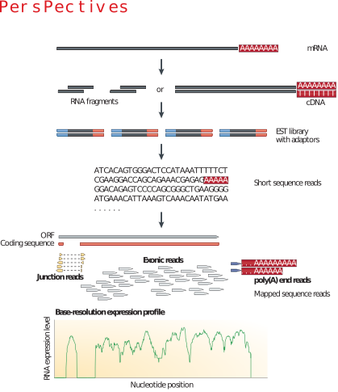

Briefly Single-cell RNA-Seq Sequencing
===

[Drop Seq Video Abstract](http://www.sciencedirect.com/science/article/pii/S0092867415005498)

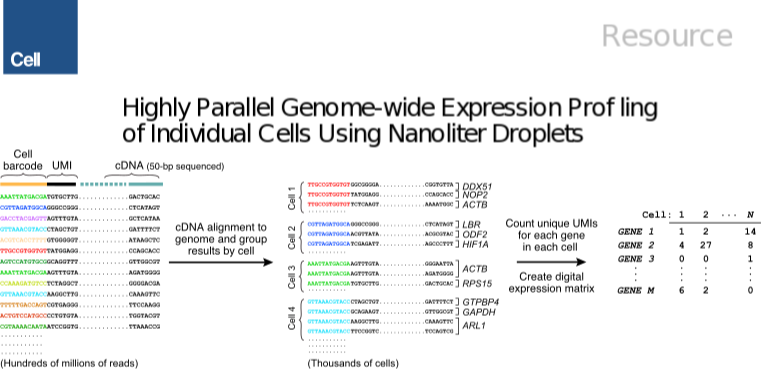

We Start with a Matrix of Expression
===

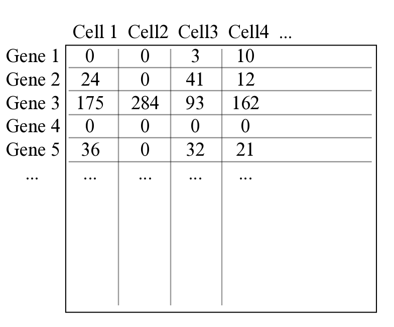

Genes Have Different Distributions
===
class:small-code

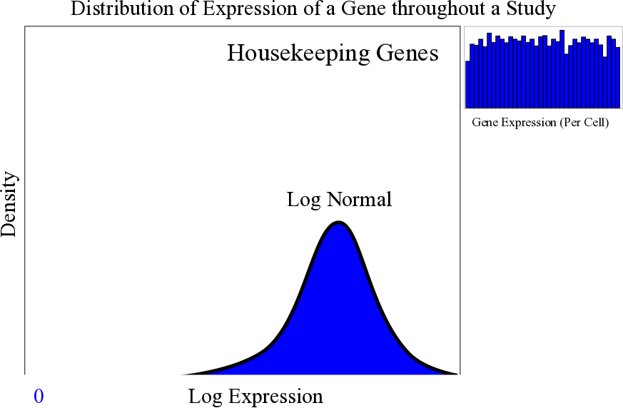

Genes Have Different Distributions
===
class:small-code

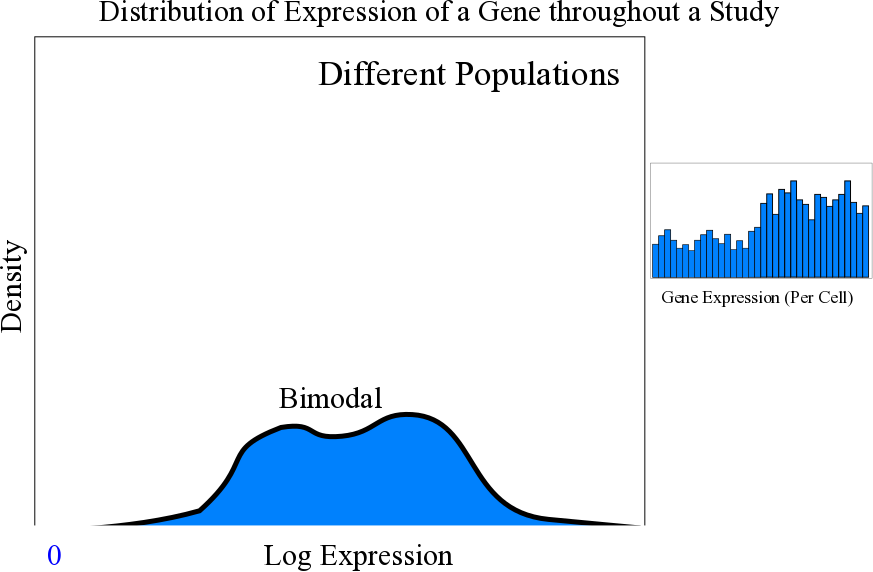

Genes Have Different Distributions
===
class:small-code

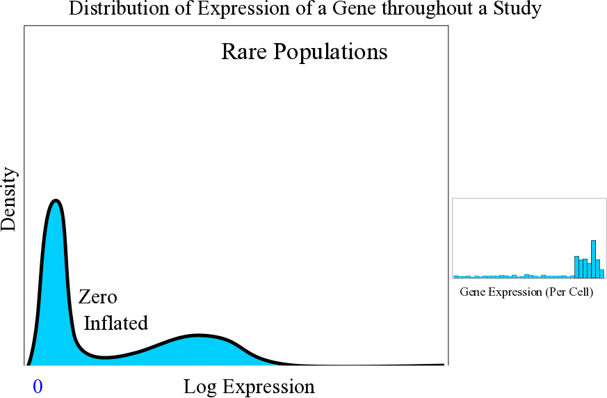

Genes Have Different Distributions
===
class:small-code

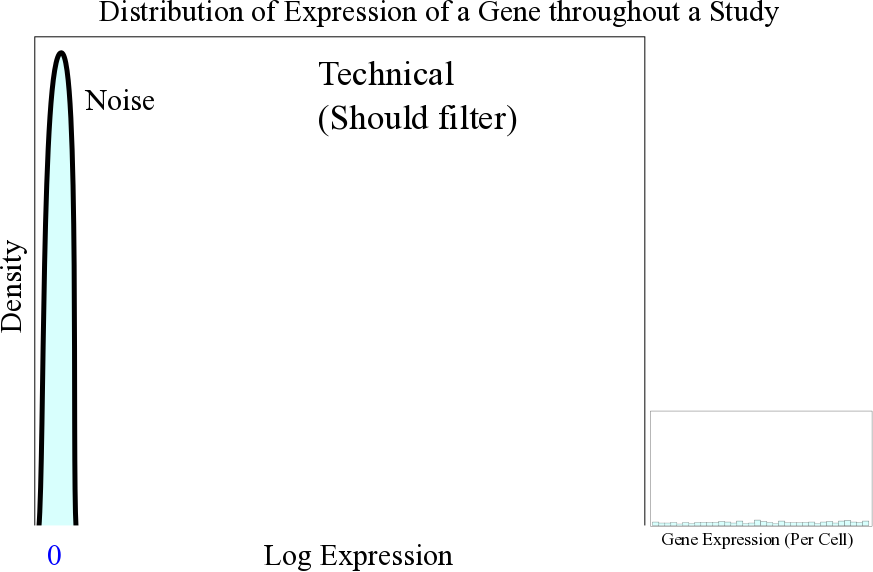

Genes Have Different Distributions
===
class:small-code

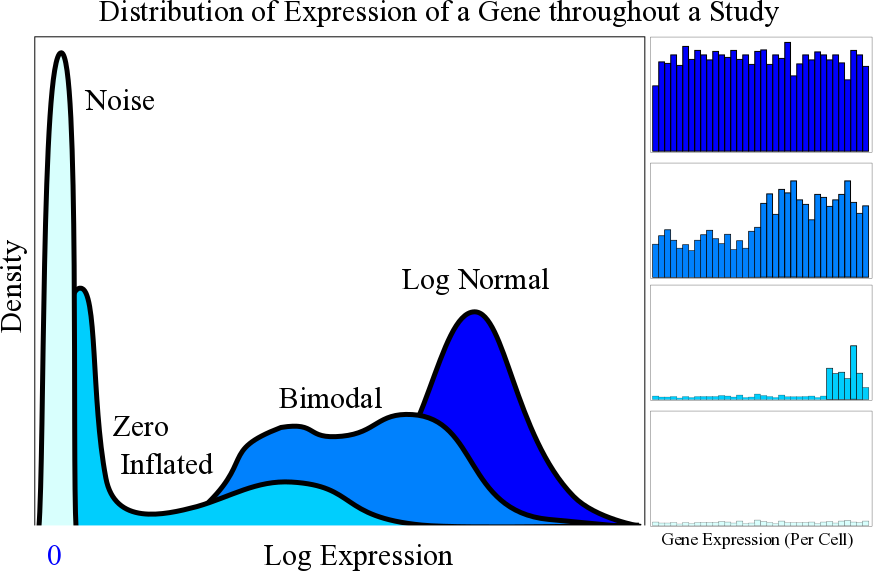

Underlying Biology
===

Zero inflation.
- Drop-out event during reverse-transcription.
- Genes with more expression have less zeros.
- Complexity varies.

Transcription stochasticity.
- Transcription bursting.
- Coordinated transcription of multigene networks.
- Overdispersed counts.

---

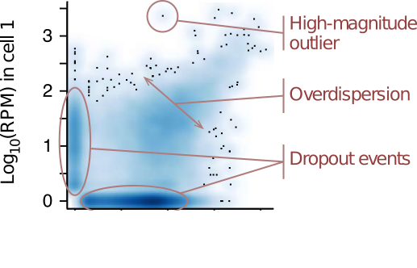

Summary: of the Data
===

- We are still understanding scData and how to apply it.
  - Data can be NOT normal.
  - Data can be Zero-inflated.
  - Data can be very noisey.
  - Cells vary in library complexity.
- Keeping these characteristics in analysis assumptions.

Logistics
===
class:small-code


```r
# Load library
library(vioplot) # violin plots
library(Seurat)
```

Load Code
===
class:small-code


```r
# Source code Helper functions
source(file.path("src", "Modules.R"))
```

Data: Ready, Get Set, Load!
===
class:small-code


```r
# Load tab delimited file
data.set = read.delim(file.path("data", "GSE29087_L139_updated.txt"))
```

Always Look at Your Data
===
class:midcenter

- These are important steps for any scRNA-Seq data set.


What are Our Genes?
===
class:small-code


```r
# Gene names (row names)
rownames(data.set)
```

What are Our Genes?
===
class:small-code


```
[1] "Tor1aip2"      "Pnkd"          "Smyd3"         "4921521F21Rik"
[5] "Gpbar1"        "1700016C15Rik"
```

What are Our Cells?
===
class:small-code


```r
# Column names
# Sample / Cell names
colnames( data.set )
```

What are Our Cells?
===
class:small-code


```
[1] "ES_A01" "ES_B01" "ES_C01" "ES_D01" "ES_E01" "ES_F01"
```

How to Show Expression?
===
class:small-code


```r
# Only the corner
# The full data will be too large to see
corner( data.set )
```

How to Show Expression?
===
class:small-code


```
              ES_A01 ES_B01 ES_C01 ES_D01 ES_E01
Tor1aip2           1      0      1     26      4
Pnkd               0      0     27      1      0
Smyd3              0      0     37      3      0
4921521F21Rik      0      0      0      0      0
Gpbar1             0      0      0      0      0
```

How Many Expressed Genes (Complexity)?
===
class:small-code


```r
# Plot genes per cell How many genes express
genes.per.cell <- apply(data.set, 2, function(x) sum(x > 0))
```

Identifying Outliers?
===
class:small-code

- One simple definition of complexity


```r
# Each cell is a dot
cell.outlier = plot.cell.complexity( genes.per.cell )
```

Identifying Outliers?
===
class:small-code

- One simple definition of complexity


Identifying Outliers?
===
class:small-code

- Cells that are unusually simple (or no expression)
- Cells that are unusually complex (doublets?)


```r
# Each cell is a dot
cell.outlier = plot.cell.complexity( demo.complexity.outliers() )
```

Identifying Outliers?
===
class:small-code

- Cells that are unusually simple (or no expression)
- Cells that are unusually complex (doublets?)


Filter Cells: Removing the Outlier Cells
===
class:small-code


```r
# Which outliers?
cell.outlier
```

```
[1]  1  2  3  4  5 63 75
```

```r
# Remove outlier cells
cells.to.drop = 1:ncol(data.set) %in% cell.outlier
data.set = data.set[, !cells.to.drop]
ncol(data.set)
```

```
[1] 85
```

Filter Cells: Removing the Outlier Cells
===
class:small-code

- Outlier samples are not just measured by complexity
  - Percent Reads Mapping
  - Percent Mitochondrial Reads
  - Presence of marker genes
  - Intergenic/ exonic rate
  - 5' or 3' bias
  - etc ...
- Picard Tools and RNASeQC

Filter Genes: Averages are Less Useful
===
class:small-code

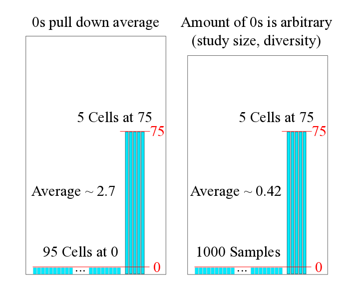

Filter Genes: Using Prevalence
===
class:small-code


```r
# Remove low expressing genes
# Remove genes that do not have atleast 5 counts in 10 samples.
data.cleaned <- filter.by.occurence( data.set, 5, 10 )
```

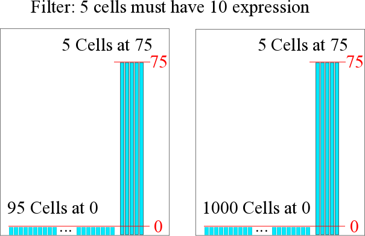

Normalization in scData
===

- Lack of publications / annecdotal .
- If not using UMIs one can use traditional measurements
  - TPM, RPM, FPKM
  - Log + 1
- If using UMI normalization
  - $LogCPX=Log(( Count / cell\_sum * median\_study\_cell\_sum )+1)$.
  - Median_study_cell_sum = A magnitude more than the median of sum of all expression for each cell.
  - Median sum = 6024, Median_study_cell_sum = 10000

Normalizing for Cell Sequencing Depth
===
class:small-code


```r
# Counts to CPX
data.cleaned.norm <- normalize.cpx(data.cleaned)
```

Sequencing Saturation
====

- The correct depth of sequencing will depend on the cell and the question.
- Can view saturation levels.


Plotting Sequencing Saturation of a Cell
===
class:small-code


```r
plot.saturation.curve(data.cleaned[, 1], 1000)
```


Getting Your Data Out of R
===


```r
# Write your data frame to your computer.
write.table(data.cleaned, file = "basic_table.txt")
```

Seurat
===

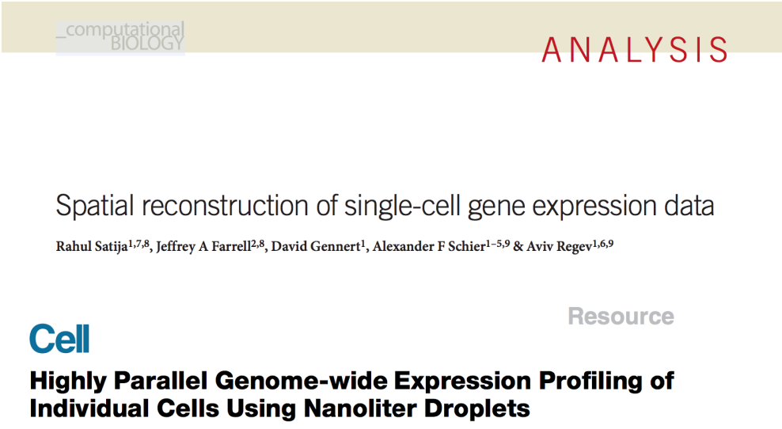

Loading Data into Seurat
===
class:small-code


```r
# Read data in to Seurat
nbt = read.into.seurat(file.path("data", "HiSeq301_RSEM_linear_values.txt"), 
    sep = "\t", header = TRUE, row.names = 1)

# Sets up object, filters
nbt = setup(nbt, project = "NBT", min.cells = 3, names.field = 2, names.delim = "_", 
    min.genes = 1000, is.expr = 1)
```

Quality Control in scData
===
class:small-code

- Check the identity of the cells!!!

```r
# Plot gene expression throughout cell groups
vlnPlot(nbt, c("DPPA4"))
```

Viewing Specific Genes in Data
===
class:small-code

- Check the identity of the cells!!!


Viewing Genes vs Genes
===
class:small-code


```r
# Plot a gene vs a gene
genePlot(nbt, "SOX11", "BCL11A", cex.use = 1)
```

Viewing Genes vs Genes
===
class:small-code


Viewing Cells vs Cells
===
class:small-code


```r
# Plot a cell vs a cell
cellPlot(nbt, "Hi_2338_3", "Hi_2338_4", do.ident = FALSE)
```

Viewing Cells vs Cells
===
class:small-code


Getting Your Data Out of R
===


```r
# Log-scale expression matrix
write.table(nbt@data, file = "seurat_expression.txt")

# Study metadata
write.table(nbt@data.info, file = "seurat_metadata.txt")

# What is the metadata so far
head(nbt@data.info)
```

```
          nGene orig.ident
Hi_2338_1  7283       2338
Hi_2338_2  6968       2338
Hi_2338_3  7229       2338
Hi_2338_4  8638       2338
Hi_2338_5  5804       2338
Hi_2338_6  8283       2338
```

Dimensionality Reduction and Ordination
===

- Start with many measurements (high dimensional).
  - Want to reduce to a few features (lower-dimensional space).
- One way is to extract features based on capturing groups of variance.
- Another could be to preferentially select some of the current features.
  - We have already done this.
- We need this to plot the cells in 2D (or ordinate them).

PCA: in Quick Theory
===

- Eigenvectors of covariance matrix.
- Find orthogonal groups of variance.
- Given from most to least variance.
  - Components of variation.
  - Linear combinations explaining the variance.
  
---

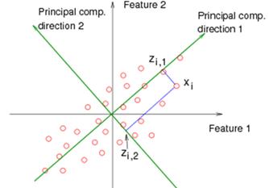

PCA: in Practice
===

Things to be aware of.
- Data with different magnitudes will dominate.
  - Zero center and divided by SD.
  - (Standardized).
- Can be affected by outliers.

---


PCA using Seurat
===
class:small-code


```r
# Prep data for PCA
nbt = prep.pca.seurat(nbt, y.cutoff = 2, x.low.cutoff = 2)

# Plot PCA
pca.plot(nbt, 1, 2, pt.size = 3)
```

PCA using Seurat
===
class:small-code


Genes Contributing to Components
===
class:small-code


```r
# List driving PC1
print.pca(nbt, 1)
```

```
[1] "PC1"
 [1] "LGALS1"    "TIMP1"     "KRT18"     "IFI30"     "ARHGDIB"  
 [6] "IFI27"     "UCA1"      "HIST1H2BK" "KRT15"     "LCN2"     
[11] "S100A9"    "KRT81"     "ALDH1A3"   "KLK5"      "CEACAM6"  
[1] ""
 [1] "SOX11"     "TUBB2B"    "DCX"       "GPM6A"     "CRMP1"    
 [6] "RTN1"      "NNAT"      "C1orf61"   "STMN2"     "FABP7"    
[11] "LOC150568" "41520"     "TMSB15A"   "PPP2R2B"   "GAP43"    
[16] "NREP"     
[1] ""
[1] ""
```

Genes Contributing to Components
===
class:small-code


```r
# View genes driving PC1
viz.pca(nbt, 1:2)
```


t-SNE: Nonlinear Dimensional Reduction
===

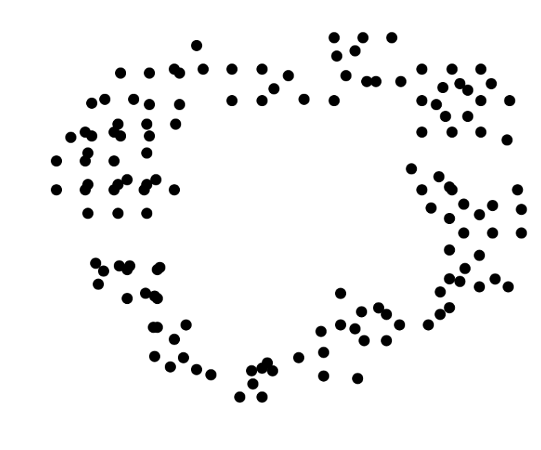

t-SNE: Nonlinear Dimensional Reduction
===

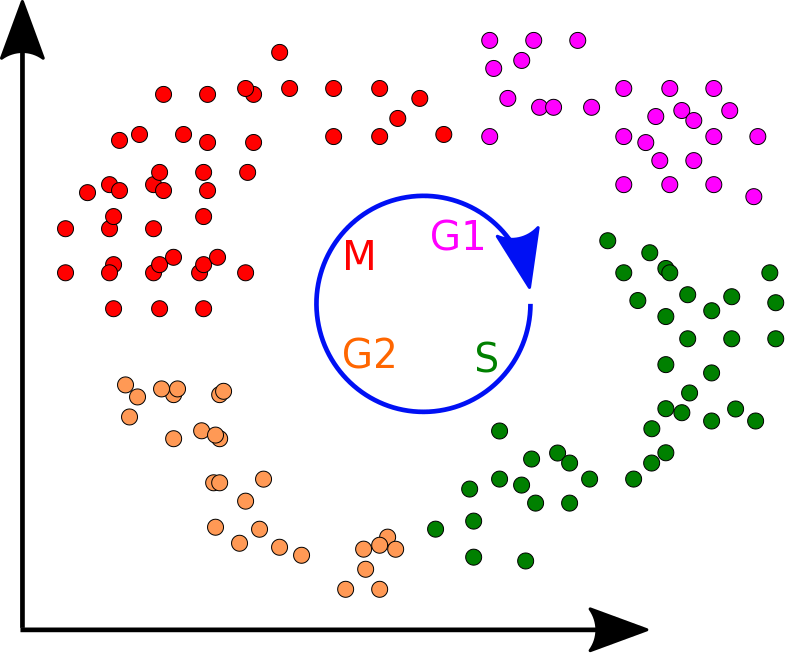

t-SNE: Collapsing the Visualization to 2D
===

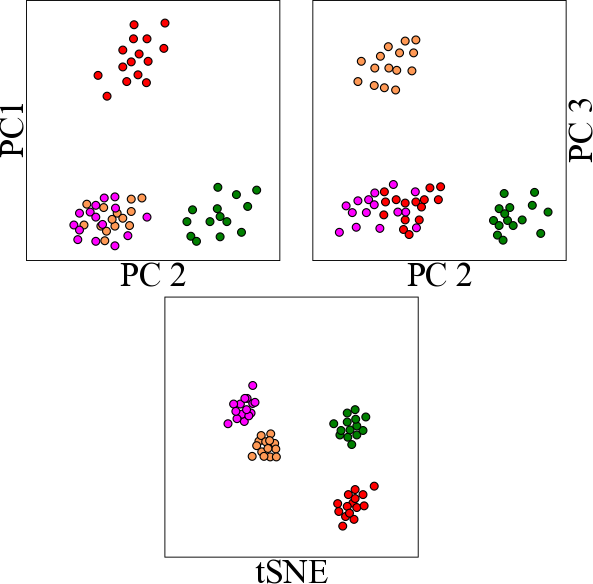

t-SNE: What and Why?
===

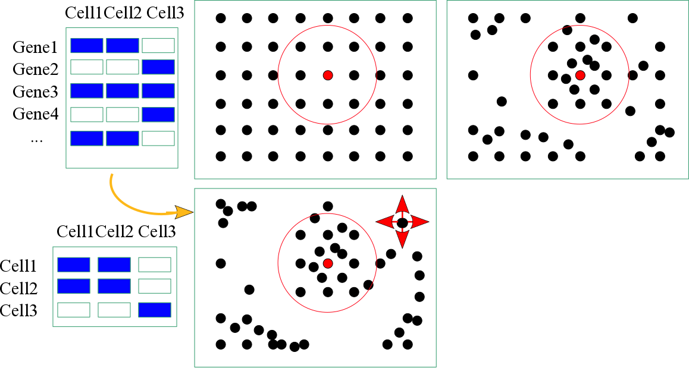

t-SNE using Seurat
===
class:small-code


```r
# Run the t-SNE alogirthm
nbt = run_tsne(nbt, dims.use = 1:11, max_iter = 2000)

# Plot results
tsne.plot(nbt, pt.size = 3)
```

t-SNE using Seurat
===
class:small-code


t-SNE: PCA & t-SNE side by side
===
class:small-code

 

---

 

Quality Control in scData
===

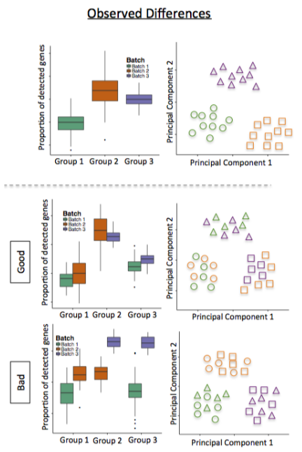

QC the Clusters!
===
class:small-code


```r
# Paint PCA by complexity
pca.plot(nbt, 1, 2, pt.size = 3, group.by = "nGene")

# Paint the t-SNE by complexity
tsne.plot(nbt, pt.size = 3, group.by = "nGene")
```

QC the Clusters!
===
class:small-code

 

---

 

Defining Clusters from PCA or t-SNE
===

- Density based clustering.

```r
# Perform clustering
nbt = DBclust_dimension(nbt, 1, 2, reduction.use = "tsne", G.use = 8, set.ident = TRUE)

# Identify groups
nbt = buildClusterTree(nbt, do.reorder = TRUE, reorder.numeric = TRUE, pcs.use = 1:11, 
    do.plot = TRUE)
```

Defining Clusters from PCA or t-SNE
===

```r
# Plot
tsne.plot(nbt, do.label = TRUE, label.pt.size = 0.5)
```

Defining Clusters from PCA or t-SNE
===


Defining Clusters from PCA or t-SNE
===


Getting Your Data Out of R
===


```r
# Log-scale expression matrix
write.table(nbt@data, file = "seurat_expression_tsne.txt")

# Study metadata
write.table(nbt@data.info, file = "seurat_metadata_tsne.txt")

# What is the metadata so far
head(nbt@data.info)
```

```
          nGene orig.ident DBclust.ident tree.ident
Hi_2338_1  7283       2338             2          7
Hi_2338_2  6968       2338             2          7
Hi_2338_3  7229       2338             2          7
Hi_2338_4  8638       2338             2          7
Hi_2338_5  5804       2338             2          7
Hi_2338_6  8283       2338             2          7
```

SCDE: Single Cell Differential Expression
===

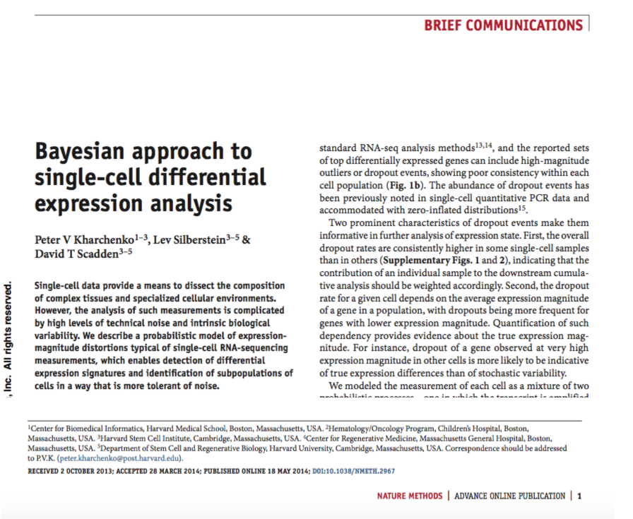

SCDE: in Quick Theory
===

For each group (ES or MEF).
- Genes are modeled to have two groups of counts.
  - Noisey area highly prone to dropout (Poisson distribution).
  - "Amplified" signal (Negative Binomial distribution).
- This makes the error model or how much one can trust counts.
- Pairwise within groups.

Differential Expression.
- Expected value * the probability of dropout in that cell for that expression level .

SCDE: in Code
===
class:small-code


```r
#library(scde) # Differential Expressions
## Setting up cells groups
# data.groups <- rep(NA, ncol(data.cleaned))
# data.groups[ grep("MEF", names(data.cleaned)) ] <- "MEF"
# data.groups[ grep("ES", names(data.cleaned)) ] <- "ES"
# data.groups <- factor(data.groups, levels = c("ES","MEF"))
```

SCDE: in Code
===
class:small-code


```r
#library(scde)

## Calculate error models (Takes time)
# o.ifm <- scde.error.models( as.matrix( data.cleaned ), groups = data.groups, n.cores=3, threshold.segmentation=TRUE, save.crossfit.plot=FALSE, save.model.plots=FALSE, verbose=1 )

## Filter out cell (QC)
# o.ifm <- o.ifm[ o.ifm$corr.a > 0, ]
```

SCDE: in Code
===
class:small-code


```r
## Set up the Prior (starting value)
# o.prior <- scde.expression.prior(models=o.ifm, counts=as.matrix(data.cleaned),length.out=400, show.plot=FALSE)

## Perform T-test like analysis
# ediff <- scde.expression.difference(o.ifm, as.matrix(data.cleaned), o.prior, groups=data.groups, n.randomizations=100, n.cores=1,verbose=1)

# write.table(ediff[order(abs(ediff$Z), decreasing=T),], file="scde_results.txt", row.names=T, col.names=T, sep="\t", quote=F)
```

Visualize Differentially Expressed Genes
===

- mle = log2 fold change (estimate) .
- ub and lb = upper and lower bound on mle .
- ce = log2 fold change (conservative estimate) .
- Z = Z-score .
- cZ = Z-score corrected for multiple hypothesis testing .

---

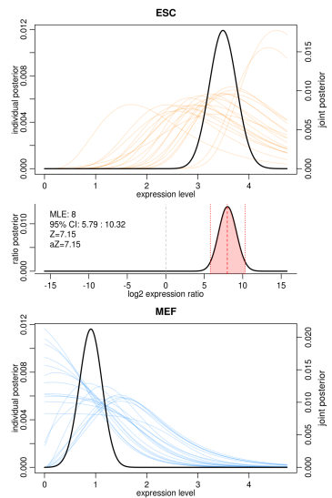

RaceID: Detecting Rare Cell Populations
===

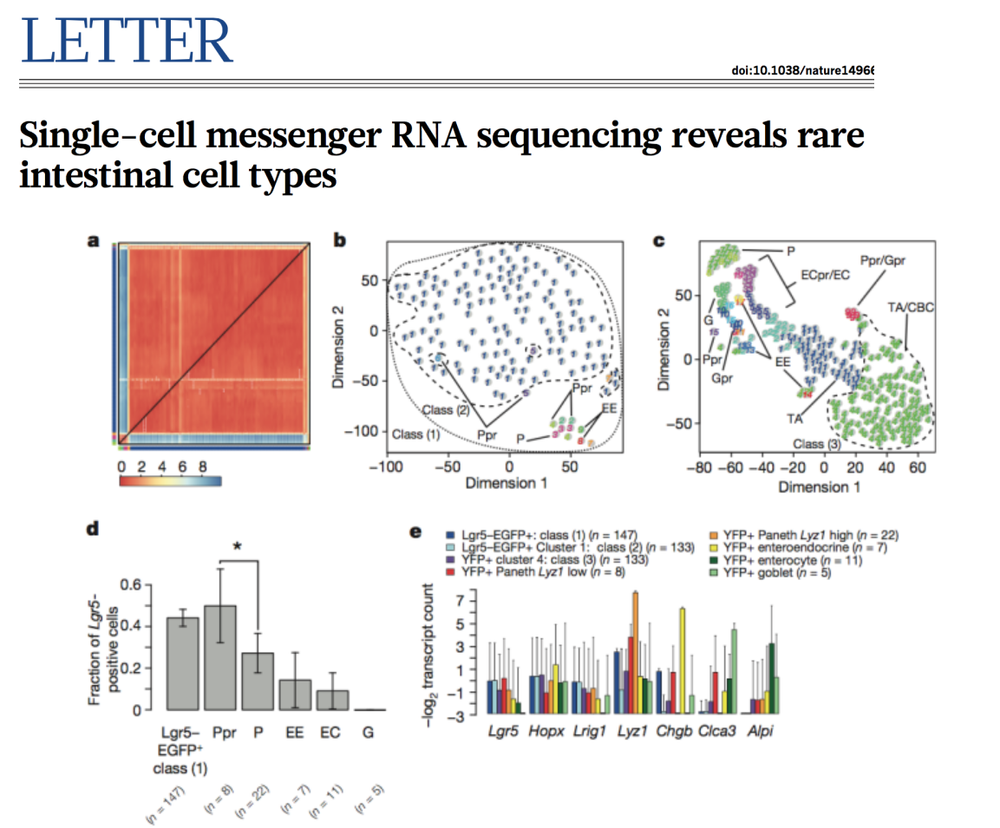

RaceID: Detecting Rare Cell Populations
===
class:small-code

- **Ra**re **Ce**ll Type **ID**entification
- Raw expression, remove Spike-ins
- Large clusters are identifed with K-means clustering.
- Within each cluster outlier genes are identified with a negative binomial distribution.
- Outlier cells are identified by containing a certain number of outlier genes.
- New outlier clusters are made from the outlier cells in a k-means manner.

K-means Clustering
===

- Pick the number of clusters you want (K).
- Randomly pick K points to be the groups to start with.
- Do the following until results do not change.
  - Assign all other points to the nearest group.
  - Update the group's center to the mean of the group.
- Will give you K groups even if it is NOT appropriate.
- Not robust to outliers.

RaceID: Detecting Rare Cell Populations
===
class:small-code


```r
# Load code
source(file.path("src", "RaceID_class.R"))

# Load tutorial data
race.in <- read.csv(file.path("data", "transcript_counts_intestine.xls"), sep = "\t", 
    header = TRUE)

# Set up data
rownames(race.in) <- race.in$GENEID
race.in <- race.in[grep("ERCC", rownames(race.in), invert = TRUE), -1]
race.data <- SCseq(race.in)
```

RaceID: Detecting Rare Cell Populations
===
class:small-code


```r
# Filter data
race.data <- filterdata(race.data, mintotal = 3000, minexpr = 5, minnumber = 1, 
    maxexpr = 500, downsample = FALSE, dsn = 1, rseed = 17000)

# K-Means cluster data
race.data <- clustexp(race.data, metric = "pearson", cln = 0, do.gap = TRUE, 
    clustnr = 20, B.gap = 50, SE.method = "Tibs2001SEmax", SE.factor = 0.25, 
    bootnr = 50, rseed = 17000)
```

```
boot 1 
boot 2 
boot 3 
boot 4 
boot 5 
boot 6 
boot 7 
boot 8 
boot 9 
boot 10 
boot 11 
boot 12 
boot 13 
boot 14 
boot 15 
boot 16 
boot 17 
boot 18 
boot 19 
boot 20 
boot 21 
boot 22 
boot 23 
boot 24 
boot 25 
boot 26 
boot 27 
boot 28 
boot 29 
boot 30 
boot 31 
boot 32 
boot 33 
boot 34 
boot 35 
boot 36 
boot 37 
boot 38 
boot 39 
boot 40 
boot 41 
boot 42 
boot 43 
boot 44 
boot 45 
boot 46 
boot 47 
boot 48 
boot 49 
boot 50 
```

RaceID: Detecting Rare Cell Populations
===
class:small-code


```r
# Check clusters
plotgap(race.data)
```


RaceID: Detecting Rare Cell Populations
===
class:small-code


```r
# Find outliers
race.data <- findoutliers(race.data, outminc = 5, outlg = 2, probthr = 0.001, 
    thr = 2^-(1:40), outdistquant = 0.75)

# Project with t-SNE
race.data <- comptsne(race.data, rseed = 15555)
```

RaceID: Detecting Rare Cell Populations
===
class:small-code


```r
# Plot t-SNE
plottsne(race.data, final = FALSE)
```


RaceID: Detecting Rare Cell Populations
===
class:small-code


```r
plottsne(race.data, final = TRUE)
```


RaceID: Detecting Rare Cell Populations
===
class:small-code


```r
# Interesting genes
target.genes <- c("Apoa1__chr9", "Apoa1bp__chr3", "Apoa2__chr1", "Apoa4__chr9", 
    "Apoa5__chr9")

# Plot expresssion of interesting genes
plotexptsne(race.data, target.genes)
```

RaceID: Detecting Rare Cell Populations
===
class:small-code


RaceID: Detecting Rare Cell Populations
===
class:small-code


```r
# Plot t-SNE labeling groups with symbols
plotsymbolstsne(race.data, type = sub("\\_\\d+$", "", names(race.data@ndata)))
```

RaceID: Detecting Rare Cell Populations
===
class:small-code


```r
# Plot t-SNE labeling groups with symbols
plotsymbolstsne(race.data, type = sub("\\_\\d+$", "", names(race.data@ndata)))
```


Getting Your Data Out of R
===


```r
# Write expression data
write.table(race.data@expdata, file = "race_id_expression.txt")

# Write kmeans clusters
write.table(race.data@kmeans$kpart)
```

```
"x"
"I_1" 5
"I_2" 5
"I_3" 5
"I_4" 5
"I_5" 4
"I_6" 3
"I_7" 4
"I_8" 3
"I_9" 2
"I_10" 2
"I_12" 5
"I_13" 4
"I_14" 3
"I_15" 5
"I_16" 2
"I_17" 5
"I_18" 1
"I_19" 1
"I_20" 5
"I_21" 2
"I_22" 3
"I_23" 5
"I_24" 2
"I_25" 2
"I_26" 1
"I_27" 6
"I_28" 5
"I_29" 3
"I_30" 5
"I_31" 6
"I_32" 4
"I_33" 6
"I_35" 4
"I_36" 5
"I_37" 1
"I_38" 2
"I_39" 5
"I_40" 4
"I_41" 4
"I_42" 4
"I_43" 4
"I_44" 5
"I_45" 5
"I_46" 6
"I_47" 5
"I_48" 5
"I_49" 5
"I_50" 2
"I_51" 4
"I_52" 1
"I_53" 5
"I_54" 5
"I_55" 5
"I_56" 4
"I_57" 2
"I_58" 4
"I_59" 5
"I_60" 6
"I_61" 4
"I_62" 5
"I_63" 5
"I_64" 2
"I_65" 3
"I_66" 5
"I_67" 4
"I_68" 4
"I_69" 3
"I_70" 5
"I_71" 3
"I_72" 5
"I_73" 5
"I_75" 4
"I_76" 6
"I_77" 5
"I_78" 2
"I_79" 4
"I_80" 4
"I_81" 4
"I_82" 3
"I_83" 2
"I_84" 2
"I_85" 1
"I_86" 4
"I_87" 5
"I_88" 1
"I_89" 1
"I_91" 3
"I_92" 4
"I_93" 4
"I_94" 2
"I_95" 2
"I_96" 4
"II_1" 5
"II_2" 2
"II_3" 5
"II_4" 4
"II_5" 2
"II_6" 2
"II_8" 2
"II_9" 2
"II_10" 2
"II_11" 4
"II_12" 2
"II_13" 2
"II_14" 2
"II_15" 3
"II_17" 1
"II_18" 4
"II_19" 2
"II_20" 5
"II_21" 2
"II_23" 3
"II_24" 5
"II_26" 2
"II_27" 4
"II_28" 5
"II_29" 3
"II_30" 2
"II_31" 4
"II_32" 5
"II_33" 1
"II_34" 5
"II_35" 4
"II_36" 1
"II_37" 1
"II_39" 4
"II_40" 5
"II_41" 4
"II_42" 5
"II_44" 5
"II_45" 5
"II_46" 5
"II_47" 3
"II_48" 4
"II_50" 5
"II_51" 3
"II_52" 2
"II_53" 2
"II_54" 2
"II_55" 5
"II_56" 4
"II_57" 5
"II_58" 5
"II_59" 2
"II_60" 1
"II_62" 1
"II_63" 2
"II_64" 2
"II_66" 4
"II_67" 1
"II_68" 1
"II_69" 4
"II_70" 2
"II_72" 1
"II_73" 4
"II_74" 4
"II_75" 4
"II_76" 5
"II_77" 2
"II_78" 2
"II_79" 5
"II_80" 5
"II_81" 5
"II_82" 5
"II_83" 5
"II_84" 5
"II_85" 2
"II_87" 5
"II_88" 5
"II_89" 4
"II_91" 1
"II_92" 5
"II_93" 1
"II_95" 5
"III_1" 2
"III_6" 5
"III_8" 2
"III_10" 4
"III_13" 1
"III_14" 5
"III_16" 5
"III_17" 2
"III_20" 3
"III_21" 4
"III_22" 5
"III_23" 1
"III_25" 2
"III_26" 4
"III_28" 6
"III_29" 2
"III_30" 5
"III_33" 2
"III_34" 2
"III_35" 5
"III_36" 5
"III_38" 2
"III_39" 5
"III_40" 4
"III_41" 5
"III_42" 5
"III_43" 5
"III_45" 5
"III_46" 4
"III_47" 2
"III_48" 1
"III_49" 4
"III_51" 4
"III_54" 4
"III_55" 1
"III_56" 5
"III_57" 4
"III_58" 2
"III_59" 5
"III_61" 5
"III_64" 3
"III_66" 2
"III_67" 1
"III_68" 4
"III_70" 2
"III_71" 2
"III_72" 2
"III_73" 2
"III_74" 4
"III_75" 2
"III_78" 3
"III_79" 5
"III_81" 3
"III_82" 5
"III_83" 3
"III_84" 5
"III_87" 2
"III_88" 1
"III_89" 5
"III_90" 5
"III_91" 2
"III_92" 5
"III_93" 5
"III_95" 4
```

```r
# Write clusters with outlier refinement
write.table(race.data@cpart)
```

```
"x"
"I_1" 5
"I_2" 5
"I_3" 5
"I_4" 5
"I_5" 4
"I_6" 23
"I_7" 4
"I_8" 3
"I_9" 2
"I_10" 2
"I_12" 4
"I_13" 4
"I_14" 3
"I_15" 5
"I_16" 2
"I_17" 5
"I_18" 1
"I_19" 1
"I_20" 5
"I_21" 2
"I_22" 22
"I_23" 5
"I_24" 2
"I_25" 2
"I_26" 21
"I_27" 6
"I_28" 5
"I_29" 17
"I_30" 5
"I_31" 6
"I_32" 15
"I_33" 6
"I_35" 4
"I_36" 5
"I_37" 1
"I_38" 2
"I_39" 4
"I_40" 4
"I_41" 14
"I_42" 1
"I_43" 4
"I_44" 5
"I_45" 8
"I_46" 6
"I_47" 5
"I_48" 5
"I_49" 5
"I_50" 2
"I_51" 13
"I_52" 1
"I_53" 5
"I_54" 8
"I_55" 5
"I_56" 4
"I_57" 7
"I_58" 4
"I_59" 5
"I_60" 8
"I_61" 5
"I_62" 5
"I_63" 5
"I_64" 2
"I_65" 9
"I_66" 5
"I_67" 4
"I_68" 4
"I_69" 3
"I_70" 5
"I_71" 22
"I_72" 5
"I_73" 5
"I_75" 4
"I_76" 8
"I_77" 5
"I_78" 2
"I_79" 4
"I_80" 5
"I_81" 4
"I_82" 3
"I_83" 2
"I_84" 2
"I_85" 1
"I_86" 15
"I_87" 8
"I_88" 1
"I_89" 1
"I_91" 3
"I_92" 5
"I_93" 4
"I_94" 2
"I_95" 2
"I_96" 4
"II_1" 5
"II_2" 2
"II_3" 5
"II_4" 4
"II_5" 2
"II_6" 2
"II_8" 2
"II_9" 2
"II_10" 2
"II_11" 4
"II_12" 2
"II_13" 2
"II_14" 2
"II_15" 3
"II_17" 1
"II_18" 4
"II_19" 2
"II_20" 5
"II_21" 12
"II_23" 9
"II_24" 5
"II_26" 2
"II_27" 14
"II_28" 5
"II_29" 19
"II_30" 2
"II_31" 4
"II_32" 5
"II_33" 1
"II_34" 5
"II_35" 4
"II_36" 1
"II_37" 1
"II_39" 4
"II_40" 8
"II_41" 4
"II_42" 5
"II_44" 5
"II_45" 5
"II_46" 5
"II_47" 22
"II_48" 4
"II_50" 6
"II_51" 3
"II_52" 2
"II_53" 10
"II_54" 11
"II_55" 5
"II_56" 4
"II_57" 5
"II_58" 5
"II_59" 2
"II_60" 1
"II_62" 1
"II_63" 2
"II_64" 2
"II_66" 4
"II_67" 1
"II_68" 1
"II_69" 5
"II_70" 2
"II_72" 1
"II_73" 4
"II_74" 4
"II_75" 5
"II_76" 5
"II_77" 2
"II_78" 2
"II_79" 5
"II_80" 5
"II_81" 5
"II_82" 5
"II_83" 8
"II_84" 5
"II_85" 2
"II_87" 5
"II_88" 5
"II_89" 4
"II_91" 1
"II_92" 5
"II_93" 1
"II_95" 5
"III_1" 2
"III_6" 5
"III_8" 2
"III_10" 4
"III_13" 1
"III_14" 5
"III_16" 5
"III_17" 2
"III_20" 7
"III_21" 4
"III_22" 5
"III_23" 1
"III_25" 2
"III_26" 4
"III_28" 15
"III_29" 2
"III_30" 5
"III_33" 2
"III_34" 2
"III_35" 5
"III_36" 5
"III_38" 2
"III_39" 5
"III_40" 4
"III_41" 5
"III_42" 5
"III_43" 5
"III_45" 5
"III_46" 4
"III_47" 2
"III_48" 1
"III_49" 4
"III_51" 4
"III_54" 4
"III_55" 1
"III_56" 5
"III_57" 4
"III_58" 2
"III_59" 5
"III_61" 5
"III_64" 9
"III_66" 2
"III_67" 1
"III_68" 4
"III_70" 2
"III_71" 2
"III_72" 2
"III_73" 2
"III_74" 4
"III_75" 2
"III_78" 16
"III_79" 5
"III_81" 20
"III_82" 5
"III_83" 18
"III_84" 5
"III_87" 2
"III_88" 1
"III_89" 5
"III_90" 5
"III_91" 2
"III_92" 5
"III_93" 5
"III_95" 4
```

Where Do We Go?
===

- Gene Set Enrichment.
  - DAVID (online or R library RDAVIDWebService).
  - GSEA (online or many libraries).
    - wilcoxGST from the limma library.
    - GSEABase.
- GenePattern workshop.

---


What Did We Miss?
===

- Seurat
  - Data imputation and Spatial Inference.
- SCDE
  - Batch Effect Correction.
- RaceIDs
  - Alternative methods to evaluating clusters.
  - Differential Expression between clusters.

Summary: of Today
===

- Created expectations for scData.
- Performed QC.
- Plotted genes and cells.
- Detected novel structure.
- Applied a statistical inference method.

Thank You
===

- Aviv Regev
- Asma Bankapur
- Brian Haas
- Karthik Shekhar
- Today's Attendees

References
===

Please note this is a collection of many peoples ideas.
Included in the download is a references.txt to document sources, tutorials, software, and links to cute corgi pictures :-)

Questions?
===


Notes: to Make a PDF
===
class:small-code

- Create a pdf file before you plot ( can plot multiple plots ).
- Close the plotting.


```r
# pdf( 'data/my_file.pdf', useDingbats = FALSE ) # Start pdf plot( 1:10,
# log(1:10 ) ) # plot in to the pdf file plot( seq(0,.9,.1), sin(0:9) ) #
# another plot for the pdf file dev.off() # Close pdf file ( very important
# )
```
