Single-cell RNA-Seq Analysis
========================================================
author: Timothy Tickle and Brian Haas
css: single_cell_analysis.css
date: October 12, 2016

We Know Tissues are Complex
===

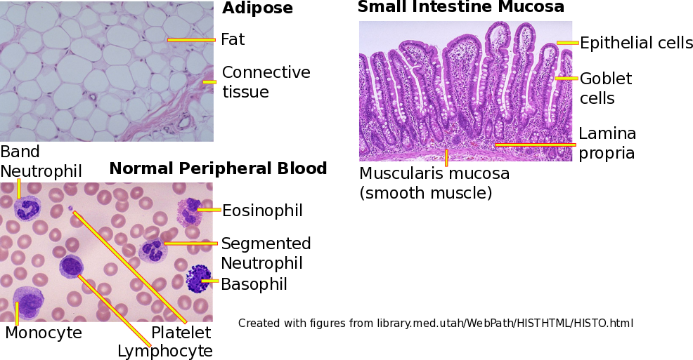

We can Separate Populations of Cells
===

<div align="center">
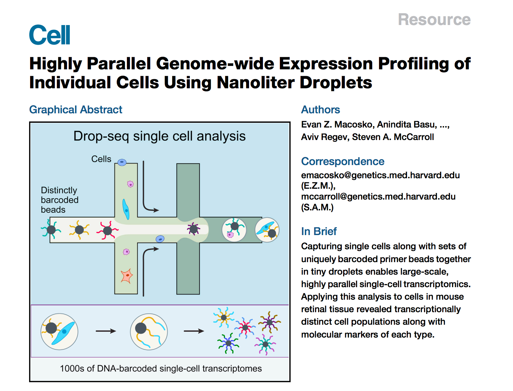
</div>

We can Separate Populations of Cells
===

<div align="center">
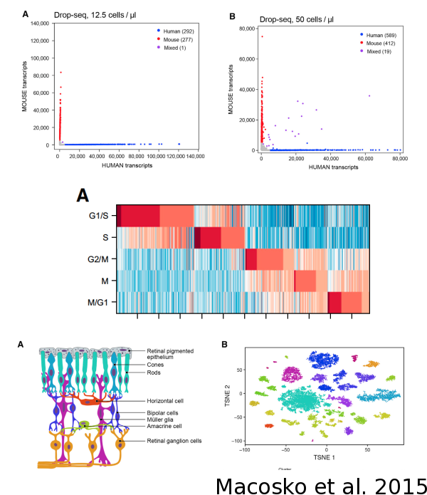
</div>

Heterogeneity can Help Describe Cell Type
===

<div align="center">
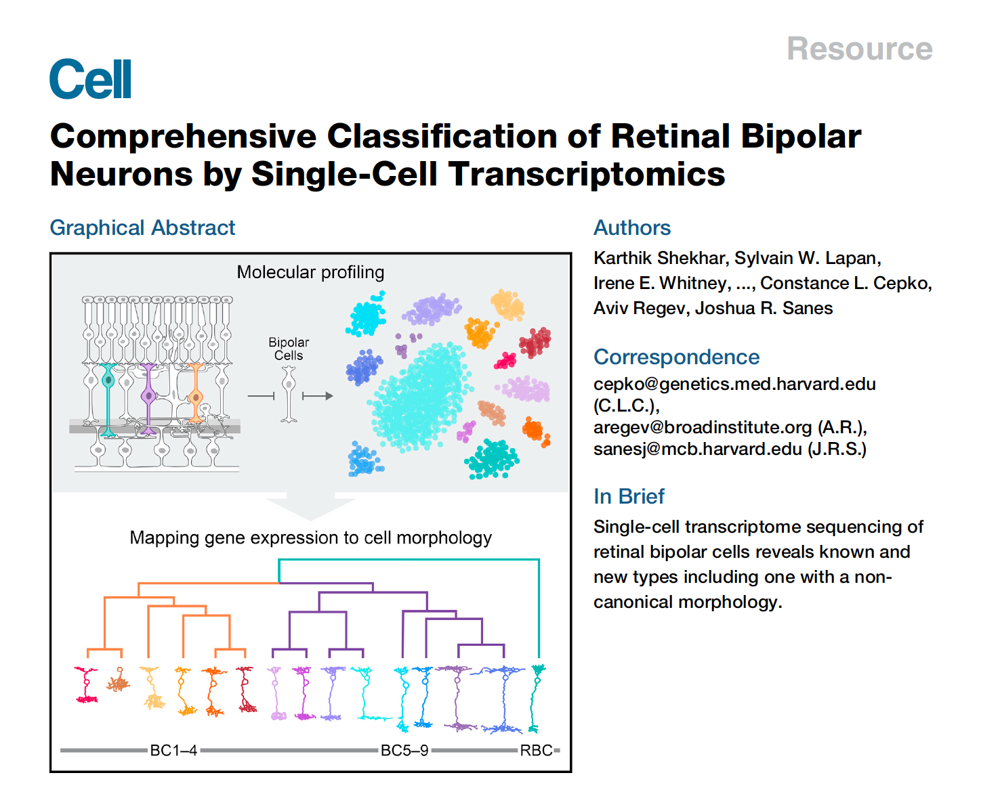
</div>

Heterogeneity can Help Describe Cell Type
===

<div align="center">
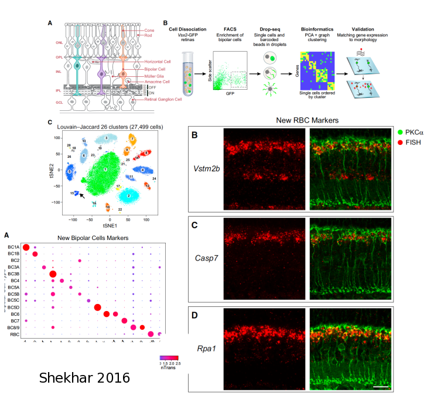
</div>

Heterogeneity can Describe Phenotypes
===

<div align="center">

</div>

Heterogeneity can Describe Phenotypes
===

<div align="center">
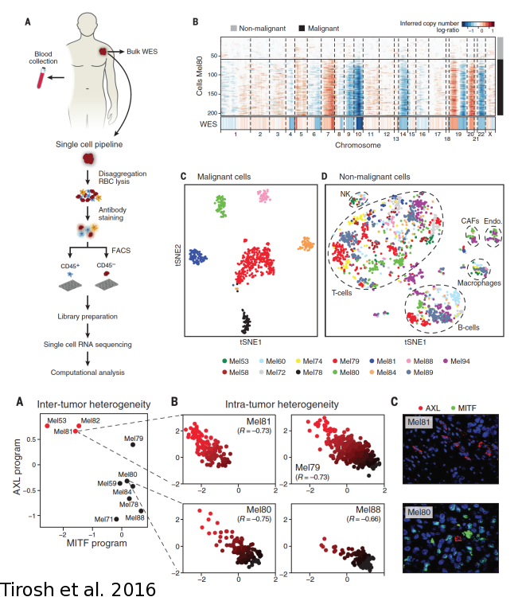
</div>

Before We Get Started
===

- Single-cell RNA-Seq analysis is developing.
  - Give you a feel for the data.
  - Walk different analysis in a couple data sets.
- There is a vivid diversity of methodology
  - These techniques will grow as the field does.
  - Why these tools were chosen.
- This is a guided conversation through scRNA-Seq Analysis
  - Breadth and targeted depth
  - If you have expertise to add, let's have that conversation!

Before We Get Started
===

- This is VERY hands-on.
  - Much can be applied to other analyses.
  - Strengthen those R ninja skills!
  - If you need, cut and pasting is available (cut_and_paste.txt).
  - There will many cute corgi pictures.

---


What We Will Attempt to Cover
===

### Section 1  
__Part 1:__ Overview of laboratory prep and sequence analysis.  
__Part 2:__ Characteristics of expression data and QC.  

### Section 2  
__Part 1:__ Plotting Single Cell RNA-Seq data.  
__Part 2:__ Evaluating and defining cell populations.  

Welcome to Section 1
===

- Overview of assays (SmartSeq2, Dropseq, 10X).
- Overview of sequence data (SmartSeq2, Dropseq, 10X).
- Overview of Dropseq sequence analysis pipeline.
- Overview of 10X sequence analysis pipeline.
- Sequence level quality control.
- What does single cell expression data look like and why?
- Introduction to RStudio.
- Initial data exploration.
- Quality control for expression matrices.
- Filtering genes and cells.
- Data analysis using UMIs.

Overview of assays
===

<div align="center">

</div>

SmartSeq2
===
  
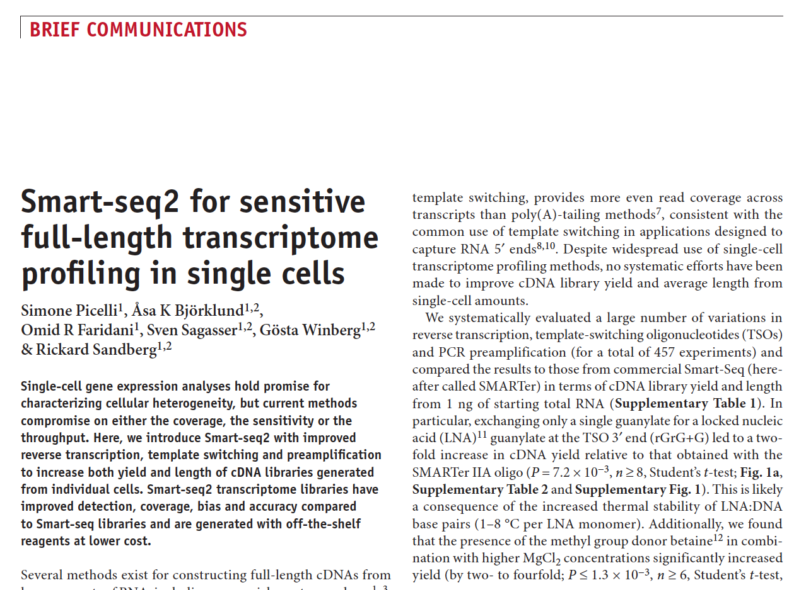

---


SmartSeq2: Description
===

- Developed for single cell but can performed using total RNA.
- Selects for poly-A tail.
- Full transcript assay.
  - Uses template switching for 5' end capture.
- Standard illumina sequencing.
  - Off-the-shelf products.
- Hundreds of samples.
- Often do not see UMI used.

SmartSeq2: Assay Overview
===

<div> 
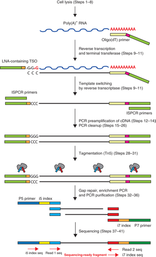
</div>

---

- Poly-A capture with 30nt polyT and 25nt 5' anchor sequence.
- RT adding untemplated C
- Template switching
  - Locked Nucleic Acid binds to untemplated C
  - RT switches template
- Preamplification / cleanup
- DNA fragmentation and adapter ligation together.
- Gap Repair, enrich, purify

SmartSeq2: Equipment
===

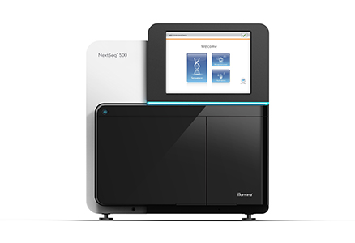

---

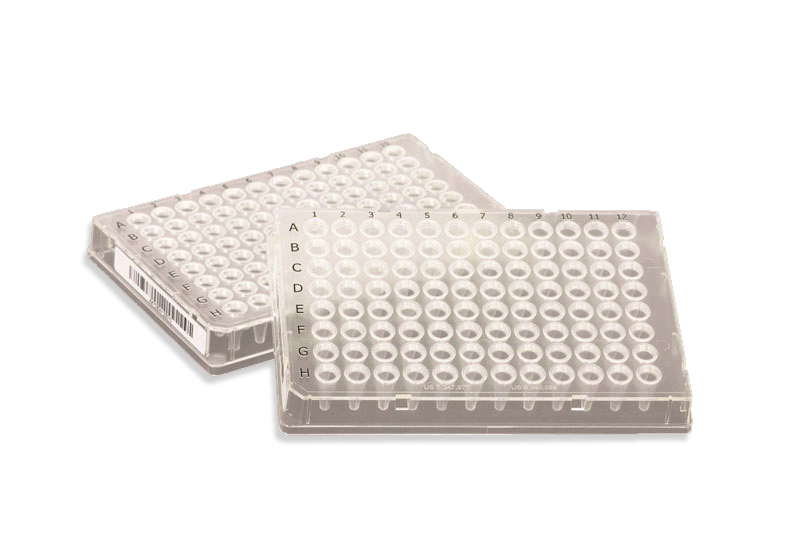

Dropseq
===

<div>

</div>

Dropseq: Description
===

- Moved throughput from hundreds to thousands.
- Droplet-based processing using microfluidics
  - Nanoliter scale aqueous drops in oil.
  - 3' End
- Bead based (STAMPs).
  - Single-cell transcriptomes attached to microparticles.
  - Cell barcodes use split-pool synthesis.
- Uses UMI (Unique Molecular Identifier).
  - RMT (Random Molecular Tag).
  - Degenerate synthesis.

Dropseq: Assay Overview
===

[Click Here for Dropseq Video Abstract](http://www.sciencedirect.com/science/article/pii/S0092867415005498)

Dropseq: Assay and UMI Construction
===

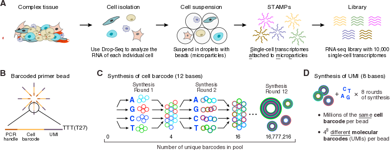   
Macosko et al. 2015

Dropseq: Sequencing Overview
===

<div>

</div>
Macosko et al. 2015

Dropseq: Microfluidics
===

   
Source: http://mccarrolllab.com/dropseq

Dropseq: Equipment
===

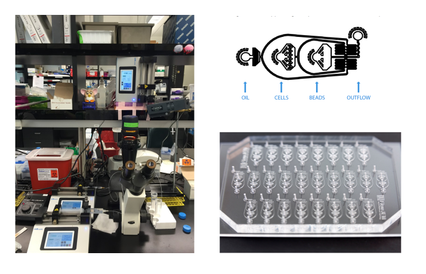

Dropseq: Pointers
===

- Droplet-based assays can have leaky RNA.
- Before library generation wash off any medium (inhibits library generation).
- Adding PBS and BSA (0.05-0.01%) can protect the cell.
  - Too much produces a residue making harvesting the beads difficult.
- Filter all reagent with a 80 micron strainer before microfluidics.
- Some purchased devices add a hydrophobic coating.
  - Can deteriorate (2 months at best).
  - Recoating does work (in-house).

10X: Massively Parallel Sequencing
===

<div>
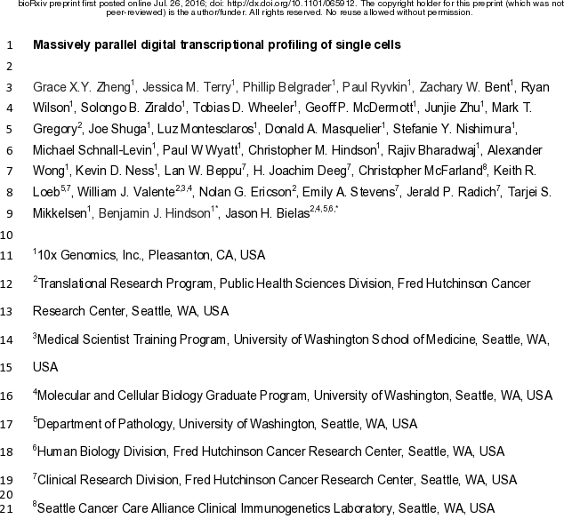
</div>

10X: Description
===

- Droplet-based, 3' mRNA.
  - GEM (Gel Bead in Emulsion)
- Standardized instrumentation and reagents.
- More high-throughput scaling to tens of thousands.
- Less processing time.
- Up to 50% capture rate.
- Cell Ranger software is available for install.

10X: Assay Overview
===

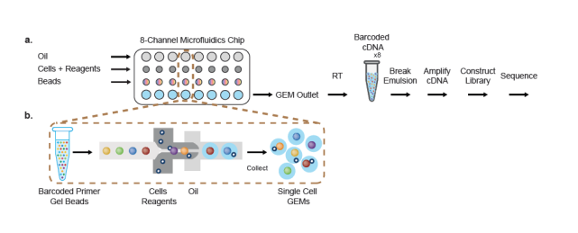   
Zheng et al.

10X: Sequences
===

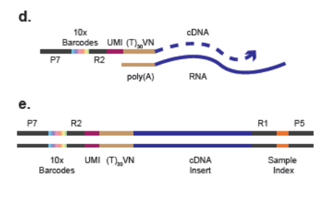   
Zheng et al.

- 14nt barcode, 10nt UMI, 30nt polyT + sequencing adaptor and primers.

10X: Equipment
===

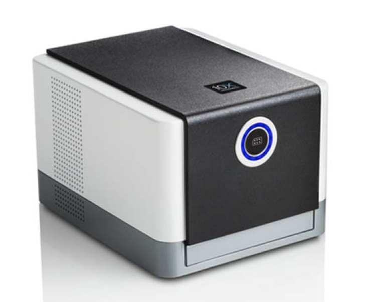

---

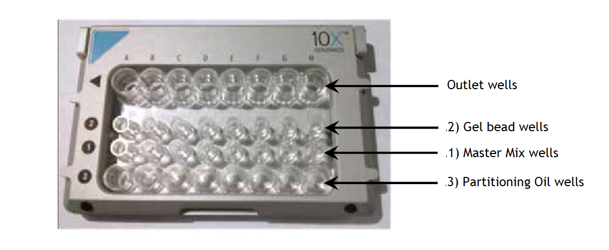

Comparing Assays
===

<div>
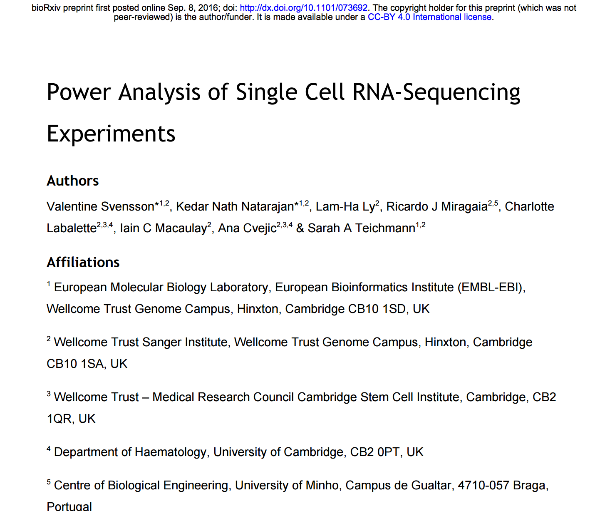
</div>

Comparing Assays
===

Based on ERCC spike-ins.   

**Accuracy:** How well the abundance levels correlated with known spiked-in amounts.   

**Sensitivity:** Minimum number of input RNA molecules required to detect a spike-in.   

Comparing Assays
===

Svensson et al. 2016
<div>
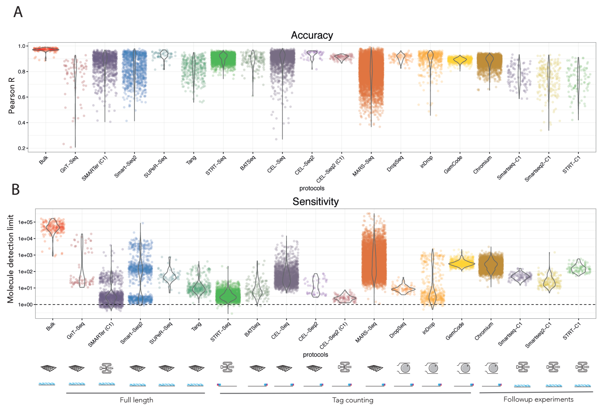
</div>

Comparing Assays
===

- Different assays have different throughput.
  - SmartSeq2 < Dropseq < 10X
- SmartSeq2 is full transcript.
- Plate-based methods get lysed in wells and so do not leak.
  - Droplet-based can have leaky RNA.
- In Dropseq assays RT happens outside the droplets
  - Can use harsher lysis buffers.
  - 10X needs lysis buffers compatible with the RT enzyme.
- 10X is more standardized and comes with a pipeline.
  - Dropseq is more customizable but more hands-on.
- Cost per library varies greatly.

A Word on Sorting
===

- After disassociating cells cells can be performed.
- Know your cells, are they sticky, are they big?
  - Select an appropriate sized nozzle.
- Don't sort too quickly (1-2k cells per second or lower)
  - the slower the more time cells sit in lysis after sorting
    - 10 minutes max in lysis (some say 30 minutes)
- Calibrate speed of instrument with beads
  - Check alignment every 5-6 plates
- Afterwards spin down to make sure cells are in lysis buffer
  - Flash freeze
- Chloe Villani on sorting https://youtu.be/HiKY0eHDhIs

Sequence Pipeline Overviews
===


Starting Sequences
===

<div align="center">
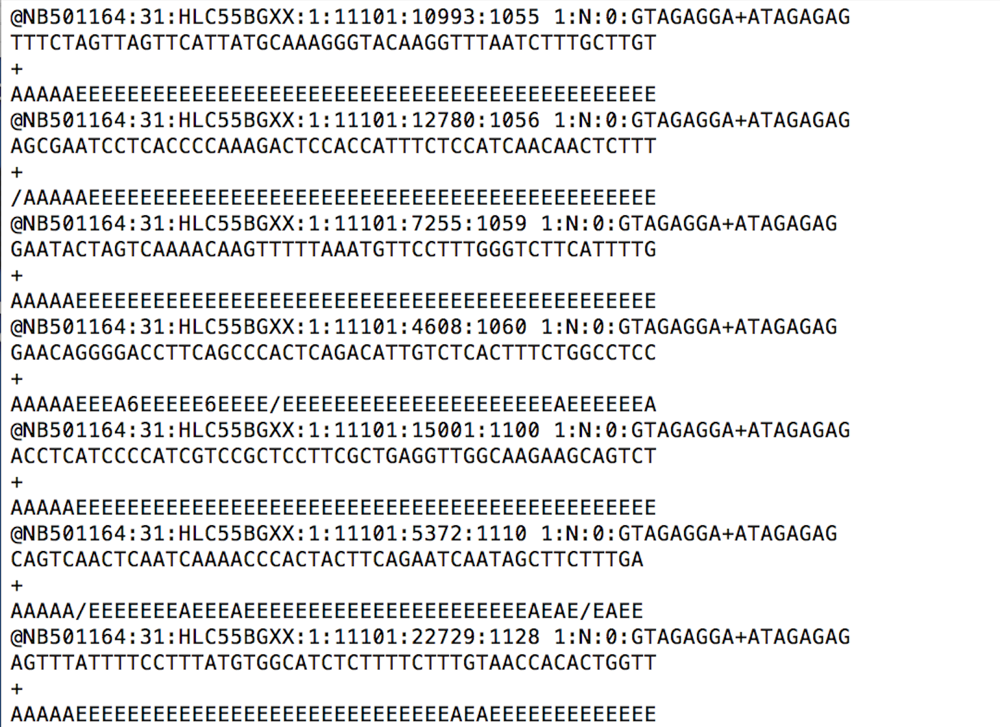
</div>

Assays have Different Formats
===

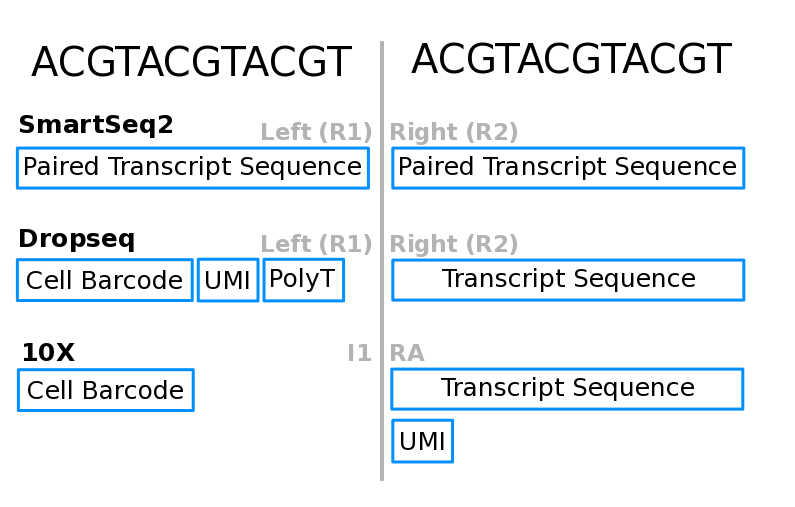

Smartseq2: Pipeline Overview
===

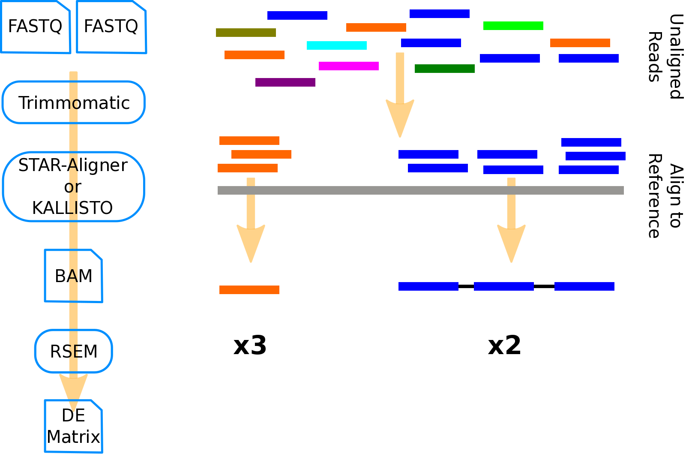

Dropseq: Pipeline Overview
===

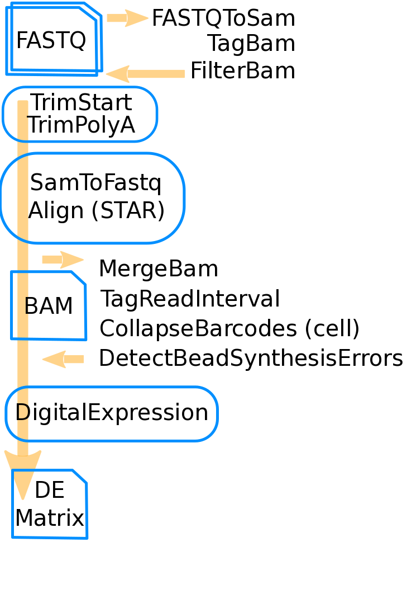

---

- Common functionality: trimming, alignment, generating count matrix.
- Adds book keeping for cell barcodes and UMIs, bead error detection, cell barcode collapsing, UMI collapsing.

Dropseq: Further Help
===


10X: Pipeline Overview
===

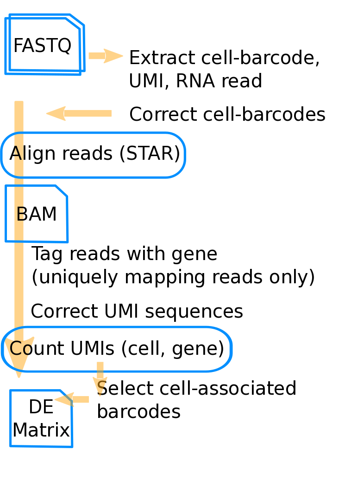

---

- Steps very similar to the Dropseq pipeline.

10X: Further Help
===

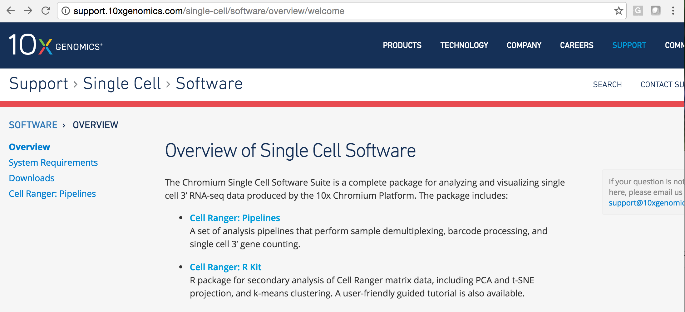

Sequence Level Quality Control
===

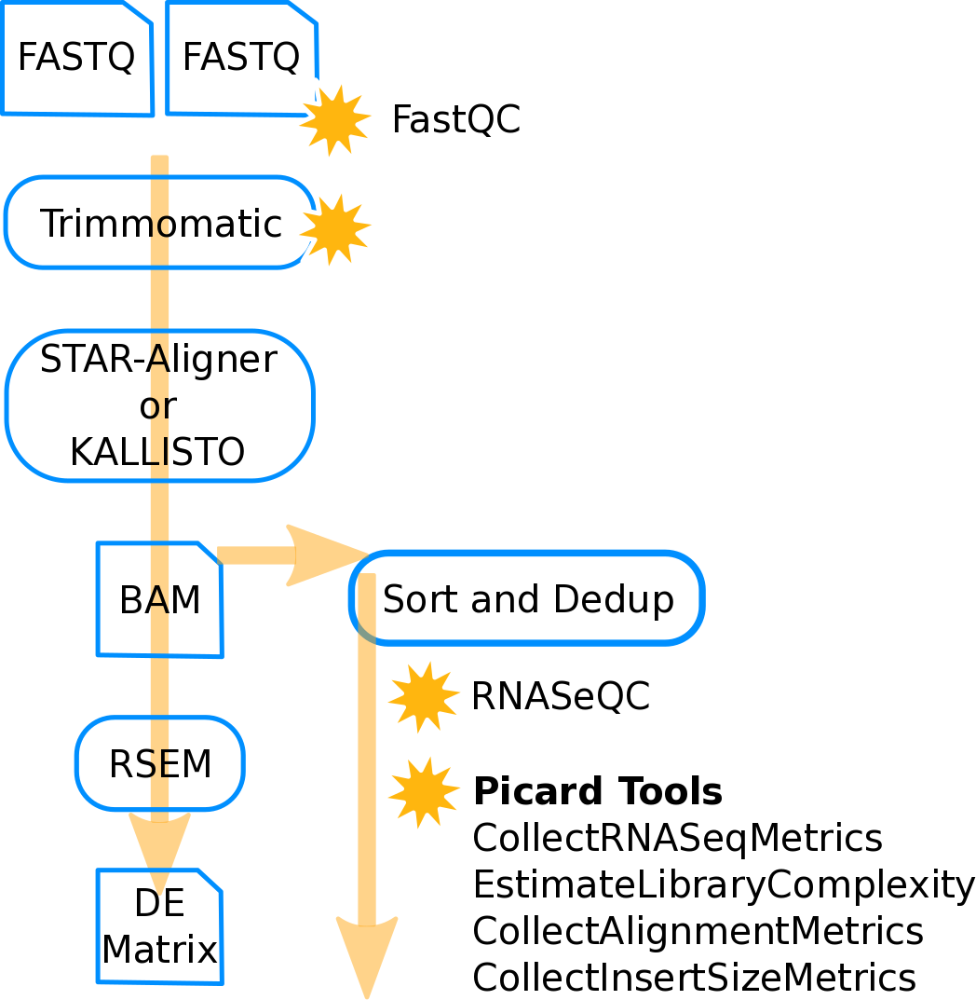

---

- Much of the QC that is performed is using traditional tools.

Section Summary
===

- Single-cell RNA-Seq is a diverse ecosystem of assays.
  - Each assay has pros and cons.
- Sequences derived from these assays are complex and vary.
- Different pipelines are needed to address different sequence formats.
  - Common steps like aligning, QC, and reads counting are in common.

Let's Describe scRNA-Seq Count Data
===


We Start with a Matrix of Expression
===


Genes Have Different Distributions
===
class:small-code


Genes Have Different Distributions
===
class:small-code


Genes Have Different Distributions
===
class:small-code


Genes Have Different Distributions
===
class:small-code


Genes Have Different Distributions
===
class:small-code


Underlying Biology
===

Zero inflation.
- Drop-out event during reverse-transcription.
- Genes with more expression have less zeros.
- Complexity varies.

Transcription stochasticity.
- Transcription bursting.
- Coordinated transcription of multigene networks.
- Overdispersed counts.

Higher Resolution.
- More sources of signal
  - Cell cycle

---

  
Karchenko et al.

Data analysis when using UMIs
===

**Read Counts**
 
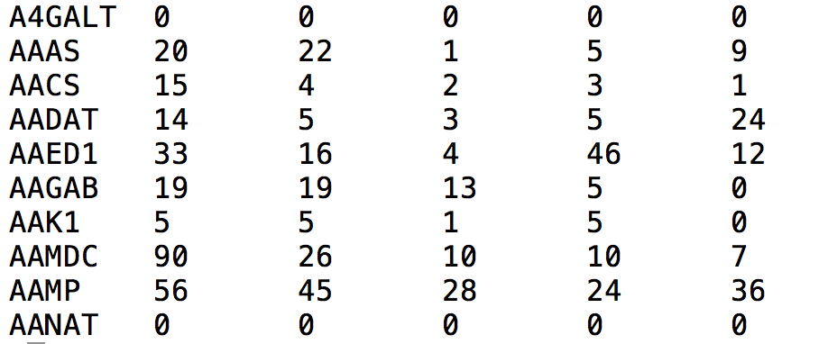

---

 **Counts by UMIs**
 
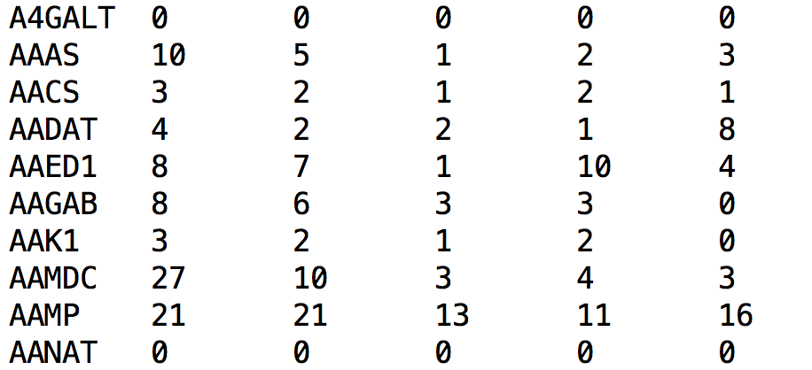

Summary of the Data
===

- We are still understanding scData and how to apply it.
  - Data can be NOT normal.
  - Data can be Zero-inflated.
  - Data can be very noisy.
  - Cells vary in library complexity.
- Keeping these characteristics in analysis assumptions.
- Trend to filter more conservatively with UMIs.

Introduction to RStudio
===


Motivation: Why Am I Using R?
===

- A lot of method development is happening in R.
- Free / open source / open science.
- Many supplemental computational biology packages.
- Data science is an art.
  - Data often requires one to create and manipulate analysis.
- This will allow you to experience key concepts in analysis.

RStudio (IDE)
===


Initial data exploration
===


Seurat
===


Seurat: Today's Data
===

- Using data provided by 10X (2700 cells).
- Peripheral blood mononuclear cells (PBMCs).
  - Any peripheral blood cell with a round nucleus.
  - Lymphocytes (T cells, B cells, NK cells)
  - Monocytes
- Complex mix cell populations used in immunity.

Logistics
===
class:small-code

- R allows methodology written by others to be imported.
  - Leverage other code.
  - Make your code available to others.  


```r
# Load libraries
library(dplyr) # Dataframe manipulation
library(Matrix) # Sparse matrices
library(useful) # Corner function
library(vioplot) # Violin pots
library(scater) # Single Cell QC
library(scde) # Differential Expression
library(org.Hs.eg.db) # Gene name manipulation
library(Seurat) # Single cell General Analysis
```

Representing Sparse Matrices
===


```r
# Load 10X data
pbmc.10X <- Read10X("./data/filtered_gene_bc_matrices/hg19")

# Memory use as a sparse matrix
object.size(pbmc.10X)
```

```
38715120 bytes
```

```r
# Memory use as a dense matrix
# 18 X more
object.size(as.matrix(pbmc.10X))
```

```
709264728 bytes
```

How are Sparse Representations Made?
===

- Sparse Matrix: A matrix where most of the elements are 0.
- Dense Matrix: A matrix where most elements are not 0.
- In this case, underlying data structure is a coordinate list.

2D Arrays vs Coordinate List
===


Create a Seurat Object
===


```r
# Expected raw counts (non-normalized data)
# Can give log transformed data but do not transform in setup method
pbmc.seurat <- new("seurat", raw.data=pbmc.10X)
```

What is in a Seurat Object?
===


```r
# Display the internal pieces of the Seurat Object
slotNames(pbmc.seurat)
```

```
 [1] "raw.data"            "data"                "scale.data"         
 [4] "var.genes"           "is.expr"             "ident"              
 [7] "pca.x"               "pca.rot"             "emp.pval"           
[10] "kmeans.obj"          "pca.obj"             "gene.scores"        
[13] "drop.coefs"          "wt.matrix"           "drop.wt.matrix"     
[16] "trusted.genes"       "drop.expr"           "data.info"          
[19] "project.name"        "kmeans.gene"         "kmeans.cell"        
[22] "jackStraw.empP"      "jackStraw.fakePC"    "jackStraw.empP.full"
[25] "pca.x.full"          "kmeans.col"          "mean.var"           
[28] "imputed"             "mix.probs"           "mix.param"          
[31] "final.prob"          "insitu.matrix"       "tsne.rot"           
[34] "ica.rot"             "ica.x"               "ica.obj"            
[37] "cell.names"          "cluster.tree"        "snn.sparse"         
[40] "snn.dense"           "snn.k"              
```

What is in a Seurat Object?
===


```
 [1] "raw.data"            "data"                "scale.data"         
 [4] "var.genes"           "is.expr"             "ident"              
 [7] "pca.x"               "pca.rot"             "emp.pval"           
[10] "kmeans.obj"          "pca.obj"             "gene.scores"        
[13] "drop.coefs"          "wt.matrix"           "drop.wt.matrix"     
[16] "trusted.genes"       "drop.expr"           "data.info"          
[19] "project.name"        "kmeans.gene"         "kmeans.cell"        
[22] "jackStraw.empP"      "jackStraw.fakePC"    "jackStraw.empP.full"
[25] "pca.x.full"          "kmeans.col"          "mean.var"           
[28] "imputed"             "mix.probs"           "mix.param"          
[31] "final.prob"          "insitu.matrix"       "tsne.rot"           
[34] "ica.rot"             "ica.x"               "ica.obj"            
[37] "cell.names"          "cluster.tree"        "snn.sparse"         
[40] "snn.dense"           "snn.k"              
```

What is in a Seurat Object?
===

Raw sparse matrix


```r
head(pbmc.seurat@raw.data)
```

```
6 x 2700 sparse Matrix of class "dgTMatrix"
                                                                          
MIR1302-10   . . . . . . . . . . . . . . . . . . . . . . . . . . . . . . .
FAM138A      . . . . . . . . . . . . . . . . . . . . . . . . . . . . . . .
OR4F5        . . . . . . . . . . . . . . . . . . . . . . . . . . . . . . .
RP11-34P13.7 . . . . . . . . . . . . . . . . . . . . . . . . . . . . . . .
RP11-34P13.8 . . . . . . . . . . . . . . . . . . . . . . . . . . . . . . .
AL627309.1   . . . . . . . . . . . . . . . . . . . . . . . . . . . . . . .
                                                                          
MIR1302-10   . . . . . . . . . . . . . . . . . . . . . . . . . . . . . . .
FAM138A      . . . . . . . . . . . . . . . . . . . . . . . . . . . . . . .
OR4F5        . . . . . . . . . . . . . . . . . . . . . . . . . . . . . . .
RP11-34P13.7 . . . . . . . . . . . . . . . . . . . . . . . . . . . . . . .
RP11-34P13.8 . . . . . . . . . . . . . . . . . . . . . . . . . . . . . . .
AL627309.1   . . . . . . . . . . . . . . . . . . . . . . . . . . . . . . .
                                                                          
MIR1302-10   . . . . . . . . . . . . . . . . . . . . . . . . . . . . . . .
FAM138A      . . . . . . . . . . . . . . . . . . . . . . . . . . . . . . .
OR4F5        . . . . . . . . . . . . . . . . . . . . . . . . . . . . . . .
RP11-34P13.7 . . . . . . . . . . . . . . . . . . . . . . . . . . . . . . .
RP11-34P13.8 . . . . . . . . . . . . . . . . . . . . . . . . . . . . . . .
AL627309.1   . . . . . . . . . . . . . . . . . . . . . . . . . . . . . . .
                                                                          
MIR1302-10   . . . . . . . . . . . . . . . . . . . . . . . . . . . . . . .
FAM138A      . . . . . . . . . . . . . . . . . . . . . . . . . . . . . . .
OR4F5        . . . . . . . . . . . . . . . . . . . . . . . . . . . . . . .
RP11-34P13.7 . . . . . . . . . . . . . . . . . . . . . . . . . . . . . . .
RP11-34P13.8 . . . . . . . . . . . . . . . . . . . . . . . . . . . . . . .
AL627309.1   . . . . . . . . . . . . . . . . . . . . . . . . . . . . . . .
                                                                          
MIR1302-10   . . . . . . . . . . . . . . . . . . . . . . . . . . . . . . .
FAM138A      . . . . . . . . . . . . . . . . . . . . . . . . . . . . . . .
OR4F5        . . . . . . . . . . . . . . . . . . . . . . . . . . . . . . .
RP11-34P13.7 . . . . . . . . . . . . . . . . . . . . . . . . . . . . . . .
RP11-34P13.8 . . . . . . . . . . . . . . . . . . . . . . . . . . . . . . .
AL627309.1   . . . . . . . . . . . . . . . . . . . . . . . . . . . . . . .
                                                                          
MIR1302-10   . . . . . . . . . . . . . . . . . . . . . . . . . . . . . . .
FAM138A      . . . . . . . . . . . . . . . . . . . . . . . . . . . . . . .
OR4F5        . . . . . . . . . . . . . . . . . . . . . . . . . . . . . . .
RP11-34P13.7 . . . . . . . . . . . . . . . . . . . . . . . . . . . . . . .
RP11-34P13.8 . . . . . . . . . . . . . . . . . . . . . . . . . . . . . . .
AL627309.1   . . . . . . . . . . . . . . . . . . . . . . . . . . . . . . .
                                                                          
MIR1302-10   . . . . . . . . . . . . . . . . . . . . . . . . . . . . . . .
FAM138A      . . . . . . . . . . . . . . . . . . . . . . . . . . . . . . .
OR4F5        . . . . . . . . . . . . . . . . . . . . . . . . . . . . . . .
RP11-34P13.7 . . . . . . . . . . . . . . . . . . . . . . . . . . . . . . .
RP11-34P13.8 . . . . . . . . . . . . . . . . . . . . . . . . . . . . . . .
AL627309.1   . . . . . . . . . . . . . . . . . . . . . . . . . . . . . . .
                                                                          
MIR1302-10   . . . . . . . . . . . . . . . . . . . . . . . . . . . . . . .
FAM138A      . . . . . . . . . . . . . . . . . . . . . . . . . . . . . . .
OR4F5        . . . . . . . . . . . . . . . . . . . . . . . . . . . . . . .
RP11-34P13.7 . . . . . . . . . . . . . . . . . . . . . . . . . . . . . . .
RP11-34P13.8 . . . . . . . . . . . . . . . . . . . . . . . . . . . . . . .
AL627309.1   . . . . . . . . . . . . . . . . . . . . . . . . . . . . . . .
                                                                          
MIR1302-10   . . . . . . . . . . . . . . . . . . . . . . . . . . . . . . .
FAM138A      . . . . . . . . . . . . . . . . . . . . . . . . . . . . . . .
OR4F5        . . . . . . . . . . . . . . . . . . . . . . . . . . . . . . .
RP11-34P13.7 . . . . . . . . . . . . . . . . . . . . . . . . . . . . . . .
RP11-34P13.8 . . . . . . . . . . . . . . . . . . . . . . . . . . . . . . .
AL627309.1   . . . . . . . . . . . . . . . . . . . . . . . . . . . . . . .
                                                                          
MIR1302-10   . . . . . . . . . . . . . . . . . . . . . . . . . . . . . . .
FAM138A      . . . . . . . . . . . . . . . . . . . . . . . . . . . . . . .
OR4F5        . . . . . . . . . . . . . . . . . . . . . . . . . . . . . . .
RP11-34P13.7 . . . . . . . . . . . . . . . . . . . . . . . . . . . . . . .
RP11-34P13.8 . . . . . . . . . . . . . . . . . . . . . . . . . . . . . . .
AL627309.1   . . . . . . . . . . . . . . . . . . . . . . . . . . . . . . .
                                                                          
MIR1302-10   . . . . . . . . . . . . . . . . . . . . . . . . . . . . . . .
FAM138A      . . . . . . . . . . . . . . . . . . . . . . . . . . . . . . .
OR4F5        . . . . . . . . . . . . . . . . . . . . . . . . . . . . . . .
RP11-34P13.7 . . . . . . . . . . . . . . . . . . . . . . . . . . . . . . .
RP11-34P13.8 . . . . . . . . . . . . . . . . . . . . . . . . . . . . . . .
AL627309.1   . . . . . . . . . . . . . . . . . . . . . . . . . . . . . . .
                                                                          
MIR1302-10   . . . . . . . . . . . . . . . . . . . . . . . . . . . . . . .
FAM138A      . . . . . . . . . . . . . . . . . . . . . . . . . . . . . . .
OR4F5        . . . . . . . . . . . . . . . . . . . . . . . . . . . . . . .
RP11-34P13.7 . . . . . . . . . . . . . . . . . . . . . . . . . . . . . . .
RP11-34P13.8 . . . . . . . . . . . . . . . . . . . . . . . . . . . . . . .
AL627309.1   . . . . . . . . . . . . . . . . . . . . . . . . . . . . . . .
                                                                          
MIR1302-10   . . . . . . . . . . . . . . . . . . . . . . . . . . . . . . .
FAM138A      . . . . . . . . . . . . . . . . . . . . . . . . . . . . . . .
OR4F5        . . . . . . . . . . . . . . . . . . . . . . . . . . . . . . .
RP11-34P13.7 . . . . . . . . . . . . . . . . . . . . . . . . . . . . . . .
RP11-34P13.8 . . . . . . . . . . . . . . . . . . . . . . . . . . . . . . .
AL627309.1   . . . . . . . . . . . . . . . . . . . . . . . . . . . . . . .
                                                                          
MIR1302-10   . . . . . . . . . . . . . . . . . . . . . . . . . . . . . . .
FAM138A      . . . . . . . . . . . . . . . . . . . . . . . . . . . . . . .
OR4F5        . . . . . . . . . . . . . . . . . . . . . . . . . . . . . . .
RP11-34P13.7 . . . . . . . . . . . . . . . . . . . . . . . . . . . . . . .
RP11-34P13.8 . . . . . . . . . . . . . . . . . . . . . . . . . . . . . . .
AL627309.1   . . . . . . . . . . . . . . . . . . . . . . . . . . . . . . .
                                                                          
MIR1302-10   . . . . . . . . . . . . . . . . . . . . . . . . . . . . . . .
FAM138A      . . . . . . . . . . . . . . . . . . . . . . . . . . . . . . .
OR4F5        . . . . . . . . . . . . . . . . . . . . . . . . . . . . . . .
RP11-34P13.7 . . . . . . . . . . . . . . . . . . . . . . . . . . . . . . .
RP11-34P13.8 . . . . . . . . . . . . . . . . . . . . . . . . . . . . . . .
AL627309.1   . . . . . . . . . . 1 . . . . . . . . . . . . . . . . . . . .
                                                                          
MIR1302-10   . . . . . . . . . . . . . . . . . . . . . . . . . . . . . . .
FAM138A      . . . . . . . . . . . . . . . . . . . . . . . . . . . . . . .
OR4F5        . . . . . . . . . . . . . . . . . . . . . . . . . . . . . . .
RP11-34P13.7 . . . . . . . . . . . . . . . . . . . . . . . . . . . . . . .
RP11-34P13.8 . . . . . . . . . . . . . . . . . . . . . . . . . . . . . . .
AL627309.1   . . . . . . . . . . . . . . . . . . . . . . . . . . . . . . .
                                                                          
MIR1302-10   . . . . . . . . . . . . . . . . . . . . . . . . . . . . . . .
FAM138A      . . . . . . . . . . . . . . . . . . . . . . . . . . . . . . .
OR4F5        . . . . . . . . . . . . . . . . . . . . . . . . . . . . . . .
RP11-34P13.7 . . . . . . . . . . . . . . . . . . . . . . . . . . . . . . .
RP11-34P13.8 . . . . . . . . . . . . . . . . . . . . . . . . . . . . . . .
AL627309.1   . . . . . . . . . . . . . . . . . . . . . . . . . . . . . . .
                                                                          
MIR1302-10   . . . . . . . . . . . . . . . . . . . . . . . . . . . . . . .
FAM138A      . . . . . . . . . . . . . . . . . . . . . . . . . . . . . . .
OR4F5        . . . . . . . . . . . . . . . . . . . . . . . . . . . . . . .
RP11-34P13.7 . . . . . . . . . . . . . . . . . . . . . . . . . . . . . . .
RP11-34P13.8 . . . . . . . . . . . . . . . . . . . . . . . . . . . . . . .
AL627309.1   . . . . . . . . . . . . . . . . . . . . . . . . . . . . . . .
                                                                          
MIR1302-10   . . . . . . . . . . . . . . . . . . . . . . . . . . . . . . .
FAM138A      . . . . . . . . . . . . . . . . . . . . . . . . . . . . . . .
OR4F5        . . . . . . . . . . . . . . . . . . . . . . . . . . . . . . .
RP11-34P13.7 . . . . . . . . . . . . . . . . . . . . . . . . . . . . . . .
RP11-34P13.8 . . . . . . . . . . . . . . . . . . . . . . . . . . . . . . .
AL627309.1   . . . . . . . . . . . . . . . . . . . . . . . . . . . . . . .
                                                                          
MIR1302-10   . . . . . . . . . . . . . . . . . . . . . . . . . . . . . . .
FAM138A      . . . . . . . . . . . . . . . . . . . . . . . . . . . . . . .
OR4F5        . . . . . . . . . . . . . . . . . . . . . . . . . . . . . . .
RP11-34P13.7 . . . . . . . . . . . . . . . . . . . . . . . . . . . . . . .
RP11-34P13.8 . . . . . . . . . . . . . . . . . . . . . . . . . . . . . . .
AL627309.1   . . . . . . . . . . . . . . . . . . . . . . . . . . . . . . .
                                                                          
MIR1302-10   . . . . . . . . . . . . . . . . . . . . . . . . . . . . . . .
FAM138A      . . . . . . . . . . . . . . . . . . . . . . . . . . . . . . .
OR4F5        . . . . . . . . . . . . . . . . . . . . . . . . . . . . . . .
RP11-34P13.7 . . . . . . . . . . . . . . . . . . . . . . . . . . . . . . .
RP11-34P13.8 . . . . . . . . . . . . . . . . . . . . . . . . . . . . . . .
AL627309.1   . . . . . . . . . . . . . . . . . . . . . . . . . . . . . . .
                                                                          
MIR1302-10   . . . . . . . . . . . . . . . . . . . . . . . . . . . . . . .
FAM138A      . . . . . . . . . . . . . . . . . . . . . . . . . . . . . . .
OR4F5        . . . . . . . . . . . . . . . . . . . . . . . . . . . . . . .
RP11-34P13.7 . . . . . . . . . . . . . . . . . . . . . . . . . . . . . . .
RP11-34P13.8 . . . . . . . . . . . . . . . . . . . . . . . . . . . . . . .
AL627309.1   . . . . . . . . . . . . . . . . . . . . . . . . . . . . . . .
                                                                          
MIR1302-10   . . . . . . . . . . . . . . . . . . . . . . . . . . . . . . .
FAM138A      . . . . . . . . . . . . . . . . . . . . . . . . . . . . . . .
OR4F5        . . . . . . . . . . . . . . . . . . . . . . . . . . . . . . .
RP11-34P13.7 . . . . . . . . . . . . . . . . . . . . . . . . . . . . . . .
RP11-34P13.8 . . . . . . . . . . . . . . . . . . . . . . . . . . . . . . .
AL627309.1   . . . . . . . . . . . . . . . . . . . . . . . . . . . . . . .
                                                                          
MIR1302-10   . . . . . . . . . . . . . . . . . . . . . . . . . . . . . . .
FAM138A      . . . . . . . . . . . . . . . . . . . . . . . . . . . . . . .
OR4F5        . . . . . . . . . . . . . . . . . . . . . . . . . . . . . . .
RP11-34P13.7 . . . . . . . . . . . . . . . . . . . . . . . . . . . . . . .
RP11-34P13.8 . . . . . . . . . . . . . . . . . . . . . . . . . . . . . . .
AL627309.1   . . . . . . . . . . . . . . . . . . . . . . . . . . . . . . .
                                                                          
MIR1302-10   . . . . . . . . . . . . . . . . . . . . . . . . . . . . . . .
FAM138A      . . . . . . . . . . . . . . . . . . . . . . . . . . . . . . .
OR4F5        . . . . . . . . . . . . . . . . . . . . . . . . . . . . . . .
RP11-34P13.7 . . . . . . . . . . . . . . . . . . . . . . . . . . . . . . .
RP11-34P13.8 . . . . . . . . . . . . . . . . . . . . . . . . . . . . . . .
AL627309.1   . . . . . . . . . . . . . . . . . . . . . . . . . . . . . . .
                                                                          
MIR1302-10   . . . . . . . . . . . . . . . . . . . . . . . . . . . . . . .
FAM138A      . . . . . . . . . . . . . . . . . . . . . . . . . . . . . . .
OR4F5        . . . . . . . . . . . . . . . . . . . . . . . . . . . . . . .
RP11-34P13.7 . . . . . . . . . . . . . . . . . . . . . . . . . . . . . . .
RP11-34P13.8 . . . . . . . . . . . . . . . . . . . . . . . . . . . . . . .
AL627309.1   . . . . . . . . . . . . . . . . . . . . . . . . . . . . . . .
                                                                          
MIR1302-10   . . . . . . . . . . . . . . . . . . . . . . . . . . . . . . .
FAM138A      . . . . . . . . . . . . . . . . . . . . . . . . . . . . . . .
OR4F5        . . . . . . . . . . . . . . . . . . . . . . . . . . . . . . .
RP11-34P13.7 . . . . . . . . . . . . . . . . . . . . . . . . . . . . . . .
RP11-34P13.8 . . . . . . . . . . . . . . . . . . . . . . . . . . . . . . .
AL627309.1   . . . . . . . . . . . . . . . . . . . . . . . . . . . . . . .
                                                                          
MIR1302-10   . . . . . . . . . . . . . . . . . . . . . . . . . . . . . . .
FAM138A      . . . . . . . . . . . . . . . . . . . . . . . . . . . . . . .
OR4F5        . . . . . . . . . . . . . . . . . . . . . . . . . . . . . . .
RP11-34P13.7 . . . . . . . . . . . . . . . . . . . . . . . . . . . . . . .
RP11-34P13.8 . . . . . . . . . . . . . . . . . . . . . . . . . . . . . . .
AL627309.1   . . . . . . . . . . . . . . . . . . . . . . . . . . . . . . .
                                                                          
MIR1302-10   . . . . . . . . . . . . . . . . . . . . . . . . . . . . . . .
FAM138A      . . . . . . . . . . . . . . . . . . . . . . . . . . . . . . .
OR4F5        . . . . . . . . . . . . . . . . . . . . . . . . . . . . . . .
RP11-34P13.7 . . . . . . . . . . . . . . . . . . . . . . . . . . . . . . .
RP11-34P13.8 . . . . . . . . . . . . . . . . . . . . . . . . . . . . . . .
AL627309.1   . . . . . . . . . . . . . . . . . . . . . . . . . . . . . . .
                                                                          
MIR1302-10   . . . . . . . . . . . . . . . . . . . . . . . . . . . . . . .
FAM138A      . . . . . . . . . . . . . . . . . . . . . . . . . . . . . . .
OR4F5        . . . . . . . . . . . . . . . . . . . . . . . . . . . . . . .
RP11-34P13.7 . . . . . . . . . . . . . . . . . . . . . . . . . . . . . . .
RP11-34P13.8 . . . . . . . . . . . . . . . . . . . . . . . . . . . . . . .
AL627309.1   . . . . . . . . . . . . . . . . . . . . . . . . . . . . . . .
                                                                          
MIR1302-10   . . . . . . . . . . . . . . . . . . . . . . . . . . . . . . .
FAM138A      . . . . . . . . . . . . . . . . . . . . . . . . . . . . . . .
OR4F5        . . . . . . . . . . . . . . . . . . . . . . . . . . . . . . .
RP11-34P13.7 . . . . . . . . . . . . . . . . . . . . . . . . . . . . . . .
RP11-34P13.8 . . . . . . . . . . . . . . . . . . . . . . . . . . . . . . .
AL627309.1   . . . . . . . . . . . . . . . . . . . . . . . . . . . . . . .
                                                                          
MIR1302-10   . . . . . . . . . . . . . . . . . . . . . . . . . . . . . . .
FAM138A      . . . . . . . . . . . . . . . . . . . . . . . . . . . . . . .
OR4F5        . . . . . . . . . . . . . . . . . . . . . . . . . . . . . . .
RP11-34P13.7 . . . . . . . . . . . . . . . . . . . . . . . . . . . . . . .
RP11-34P13.8 . . . . . . . . . . . . . . . . . . . . . . . . . . . . . . .
AL627309.1   . . . . . . . . . . . . . . . . . . . . . . . . . . . . . . .
                                                                          
MIR1302-10   . . . . . . . . . . . . . . . . . . . . . . . . . . . . . . .
FAM138A      . . . . . . . . . . . . . . . . . . . . . . . . . . . . . . .
OR4F5        . . . . . . . . . . . . . . . . . . . . . . . . . . . . . . .
RP11-34P13.7 . . . . . . . . . . . . . . . . . . . . . . . . . . . . . . .
RP11-34P13.8 . . . . . . . . . . . . . . . . . . . . . . . . . . . . . . .
AL627309.1   . . . . . . . . . . . . . . . . . . . . . . . . . 1 . . . . .
                                                                          
MIR1302-10   . . . . . . . . . . . . . . . . . . . . . . . . . . . . . . .
FAM138A      . . . . . . . . . . . . . . . . . . . . . . . . . . . . . . .
OR4F5        . . . . . . . . . . . . . . . . . . . . . . . . . . . . . . .
RP11-34P13.7 . . . . . . . . . . . . . . . . . . . . . . . . . . . . . . .
RP11-34P13.8 . . . . . . . . . . . . . . . . . . . . . . . . . . . . . . .
AL627309.1   . . . . . . . . . . . . . . . . . . . . . . . . . . . . . . .
                                                                          
MIR1302-10   . . . . . . . . . . . . . . . . . . . . . . . . . . . . . . .
FAM138A      . . . . . . . . . . . . . . . . . . . . . . . . . . . . . . .
OR4F5        . . . . . . . . . . . . . . . . . . . . . . . . . . . . . . .
RP11-34P13.7 . . . . . . . . . . . . . . . . . . . . . . . . . . . . . . .
RP11-34P13.8 . . . . . . . . . . . . . . . . . . . . . . . . . . . . . . .
AL627309.1   . . . . . . . . . . . . . . . . . . . . . . . . . . . . . . .
                                                                          
MIR1302-10   . . . . . . . . . . . . . . . . . . . . . . . . . . . . . . .
FAM138A      . . . . . . . . . . . . . . . . . . . . . . . . . . . . . . .
OR4F5        . . . . . . . . . . . . . . . . . . . . . . . . . . . . . . .
RP11-34P13.7 . . . . . . . . . . . . . . . . . . . . . . . . . . . . . . .
RP11-34P13.8 . . . . . . . . . . . . . . . . . . . . . . . . . . . . . . .
AL627309.1   . . . . . . . . . . . . . . . . . . . . . 1 . . . . . . . . .
                                                                          
MIR1302-10   . . . . . . . . . . . . . . . . . . . . . . . . . . . . . . .
FAM138A      . . . . . . . . . . . . . . . . . . . . . . . . . . . . . . .
OR4F5        . . . . . . . . . . . . . . . . . . . . . . . . . . . . . . .
RP11-34P13.7 . . . . . . . . . . . . . . . . . . . . . . . . . . . . . . .
RP11-34P13.8 . . . . . . . . . . . . . . . . . . . . . . . . . . . . . . .
AL627309.1   . . . . . . . . . . . . . . . . . . . . . . . . . . . . . . .
                                                                          
MIR1302-10   . . . . . . . . . . . . . . . . . . . . . . . . . . . . . . .
FAM138A      . . . . . . . . . . . . . . . . . . . . . . . . . . . . . . .
OR4F5        . . . . . . . . . . . . . . . . . . . . . . . . . . . . . . .
RP11-34P13.7 . . . . . . . . . . . . . . . . . . . . . . . . . . . . . . .
RP11-34P13.8 . . . . . . . . . . . . . . . . . . . . . . . . . . . . . . .
AL627309.1   . . . . . . . . . . . . . . 1 . . . . . . . . . . . . . . . .
                                                                          
MIR1302-10   . . . . . . . . . . . . . . . . . . . . . . . . . . . . . . .
FAM138A      . . . . . . . . . . . . . . . . . . . . . . . . . . . . . . .
OR4F5        . . . . . . . . . . . . . . . . . . . . . . . . . . . . . . .
RP11-34P13.7 . . . . . . . . . . . . . . . . . . . . . . . . . . . . . . .
RP11-34P13.8 . . . . . . . . . . . . . . . . . . . . . . . . . . . . . . .
AL627309.1   . . . . . . . . . . . . . . . . . . . . . . . . . . . . . . .
                                                                          
MIR1302-10   . . . . . . . . . . . . . . . . . . . . . . . . . . . . . . .
FAM138A      . . . . . . . . . . . . . . . . . . . . . . . . . . . . . . .
OR4F5        . . . . . . . . . . . . . . . . . . . . . . . . . . . . . . .
RP11-34P13.7 . . . . . . . . . . . . . . . . . . . . . . . . . . . . . . .
RP11-34P13.8 . . . . . . . . . . . . . . . . . . . . . . . . . . . . . . .
AL627309.1   . . . . . . . . . . . . . . . . . . . . . . . . . . . . . . .
                                                                          
MIR1302-10   . . . . . . . . . . . . . . . . . . . . . . . . . . . . . . .
FAM138A      . . . . . . . . . . . . . . . . . . . . . . . . . . . . . . .
OR4F5        . . . . . . . . . . . . . . . . . . . . . . . . . . . . . . .
RP11-34P13.7 . . . . . . . . . . . . . . . . . . . . . . . . . . . . . . .
RP11-34P13.8 . . . . . . . . . . . . . . . . . . . . . . . . . . . . . . .
AL627309.1   . . . . . . . . . . . . . . . . . . . . . . . . . . . . . . .
                                                                          
MIR1302-10   . . . . . . . . . . . . . . . . . . . . . . . . . . . . . . .
FAM138A      . . . . . . . . . . . . . . . . . . . . . . . . . . . . . . .
OR4F5        . . . . . . . . . . . . . . . . . . . . . . . . . . . . . . .
RP11-34P13.7 . . . . . . . . . . . . . . . . . . . . . . . . . . . . . . .
RP11-34P13.8 . . . . . . . . . . . . . . . . . . . . . . . . . . . . . . .
AL627309.1   . . . . . . . . . . . . . . . . . . . . . . . . . . . . . . .
                                                                          
MIR1302-10   . . . . . . . . . . . . . . . . . . . . . . . . . . . . . . .
FAM138A      . . . . . . . . . . . . . . . . . . . . . . . . . . . . . . .
OR4F5        . . . . . . . . . . . . . . . . . . . . . . . . . . . . . . .
RP11-34P13.7 . . . . . . . . . . . . . . . . . . . . . . . . . . . . . . .
RP11-34P13.8 . . . . . . . . . . . . . . . . . . . . . . . . . . . . . . .
AL627309.1   . . . . . . . . . . . . . . . . . . . . . . . . . . . . . . .
                                                                          
MIR1302-10   . . . . . . . . . . . . . . . . . . . . . . . . . . . . . . .
FAM138A      . . . . . . . . . . . . . . . . . . . . . . . . . . . . . . .
OR4F5        . . . . . . . . . . . . . . . . . . . . . . . . . . . . . . .
RP11-34P13.7 . . . . . . . . . . . . . . . . . . . . . . . . . . . . . . .
RP11-34P13.8 . . . . . . . . . . . . . . . . . . . . . . . . . . . . . . .
AL627309.1   . . . . . . . . . . . . . . . . . . . . . . . . . . 1 . . . .
                                                                          
MIR1302-10   . . . . . . . . . . . . . . . . . . . . . . . . . . . . . . .
FAM138A      . . . . . . . . . . . . . . . . . . . . . . . . . . . . . . .
OR4F5        . . . . . . . . . . . . . . . . . . . . . . . . . . . . . . .
RP11-34P13.7 . . . . . . . . . . . . . . . . . . . . . . . . . . . . . . .
RP11-34P13.8 . . . . . . . . . . . . . . . . . . . . . . . . . . . . . . .
AL627309.1   . . . . . . . . . . . . . . . . . . . . . . . . . . . . . . .
                                                                          
MIR1302-10   . . . . . . . . . . . . . . . . . . . . . . . . . . . . . . .
FAM138A      . . . . . . . . . . . . . . . . . . . . . . . . . . . . . . .
OR4F5        . . . . . . . . . . . . . . . . . . . . . . . . . . . . . . .
RP11-34P13.7 . . . . . . . . . . . . . . . . . . . . . . . . . . . . . . .
RP11-34P13.8 . . . . . . . . . . . . . . . . . . . . . . . . . . . . . . .
AL627309.1   . . . . . . . . . . . . . . . . . . . . . . . . . . . . . . .
                                                                          
MIR1302-10   . . . . . . . . . . . . . . . . . . . . . . . . . . . . . . .
FAM138A      . . . . . . . . . . . . . . . . . . . . . . . . . . . . . . .
OR4F5        . . . . . . . . . . . . . . . . . . . . . . . . . . . . . . .
RP11-34P13.7 . . . . . . . . . . . . . . . . . . . . . . . . . . . . . . .
RP11-34P13.8 . . . . . . . . . . . . . . . . . . . . . . . . . . . . . . .
AL627309.1   . . . . . . . . 1 . . . . . . . . . . . . . . . . . . . . . .
                                                                          
MIR1302-10   . . . . . . . . . . . . . . . . . . . . . . . . . . . . . . .
FAM138A      . . . . . . . . . . . . . . . . . . . . . . . . . . . . . . .
OR4F5        . . . . . . . . . . . . . . . . . . . . . . . . . . . . . . .
RP11-34P13.7 . . . . . . . . . . . . . . . . . . . . . . . . . . . . . . .
RP11-34P13.8 . . . . . . . . . . . . . . . . . . . . . . . . . . . . . . .
AL627309.1   . . . . . . . . . . . . . . . . . . . . . . . . . . . . . . .
                                                                          
MIR1302-10   . . . . . . . . . . . . . . . . . . . . . . . . . . . . . . .
FAM138A      . . . . . . . . . . . . . . . . . . . . . . . . . . . . . . .
OR4F5        . . . . . . . . . . . . . . . . . . . . . . . . . . . . . . .
RP11-34P13.7 . . . . . . . . . . . . . . . . . . . . . . . . . . . . . . .
RP11-34P13.8 . . . . . . . . . . . . . . . . . . . . . . . . . . . . . . .
AL627309.1   . . . . . . . . . . . . . . . . . . . . . . . . . . . . . . .
                                                                          
MIR1302-10   . . . . . . . . . . . . . . . . . . . . . . . . . . . . . . .
FAM138A      . . . . . . . . . . . . . . . . . . . . . . . . . . . . . . .
OR4F5        . . . . . . . . . . . . . . . . . . . . . . . . . . . . . . .
RP11-34P13.7 . . . . . . . . . . . . . . . . . . . . . . . . . . . . . . .
RP11-34P13.8 . . . . . . . . . . . . . . . . . . . . . . . . . . . . . . .
AL627309.1   . . . . . . . . . . . . . . . . . . . . . . . . . . . . . . .
                                                                          
MIR1302-10   . . . . . . . . . . . . . . . . . . . . . . . . . . . . . . .
FAM138A      . . . . . . . . . . . . . . . . . . . . . . . . . . . . . . .
OR4F5        . . . . . . . . . . . . . . . . . . . . . . . . . . . . . . .
RP11-34P13.7 . . . . . . . . . . . . . . . . . . . . . . . . . . . . . . .
RP11-34P13.8 . . . . . . . . . . . . . . . . . . . . . . . . . . . . . . .
AL627309.1   . . . . . . . . . . . . . . . . . . . . . . . . . . . . . . .
                                                                          
MIR1302-10   . . . . . . . . . . . . . . . . . . . . . . . . . . . . . . .
FAM138A      . . . . . . . . . . . . . . . . . . . . . . . . . . . . . . .
OR4F5        . . . . . . . . . . . . . . . . . . . . . . . . . . . . . . .
RP11-34P13.7 . . . . . . . . . . . . . . . . . . . . . . . . . . . . . . .
RP11-34P13.8 . . . . . . . . . . . . . . . . . . . . . . . . . . . . . . .
AL627309.1   . . . . . . . . . . . . . . . . . . . . . . . . . . . . . . .
                                                                          
MIR1302-10   . . . . . . . . . . . . . . . . . . . . . . . . . . . . . . .
FAM138A      . . . . . . . . . . . . . . . . . . . . . . . . . . . . . . .
OR4F5        . . . . . . . . . . . . . . . . . . . . . . . . . . . . . . .
RP11-34P13.7 . . . . . . . . . . . . . . . . . . . . . . . . . . . . . . .
RP11-34P13.8 . . . . . . . . . . . . . . . . . . . . . . . . . . . . . . .
AL627309.1   . . . . . . . . . . . . . . . . 1 . . . . . . . . . . . . . .
                                                                          
MIR1302-10   . . . . . . . . . . . . . . . . . . . . . . . . . . . . . . .
FAM138A      . . . . . . . . . . . . . . . . . . . . . . . . . . . . . . .
OR4F5        . . . . . . . . . . . . . . . . . . . . . . . . . . . . . . .
RP11-34P13.7 . . . . . . . . . . . . . . . . . . . . . . . . . . . . . . .
RP11-34P13.8 . . . . . . . . . . . . . . . . . . . . . . . . . . . . . . .
AL627309.1   . . . . . . . . . . . . . . . . . . . . . . . . . . . . . . .
                                                                          
MIR1302-10   . . . . . . . . . . . . . . . . . . . . . . . . . . . . . . .
FAM138A      . . . . . . . . . . . . . . . . . . . . . . . . . . . . . . .
OR4F5        . . . . . . . . . . . . . . . . . . . . . . . . . . . . . . .
RP11-34P13.7 . . . . . . . . . . . . . . . . . . . . . . . . . . . . . . .
RP11-34P13.8 . . . . . . . . . . . . . . . . . . . . . . . . . . . . . . .
AL627309.1   . . . . . . . . . . . . . . . . . . . . . . . . . . . . . . .
                                                                          
MIR1302-10   . . . . . . . . . . . . . . . . . . . . . . . . . . . . . . .
FAM138A      . . . . . . . . . . . . . . . . . . . . . . . . . . . . . . .
OR4F5        . . . . . . . . . . . . . . . . . . . . . . . . . . . . . . .
RP11-34P13.7 . . . . . . . . . . . . . . . . . . . . . . . . . . . . . . .
RP11-34P13.8 . . . . . . . . . . . . . . . . . . . . . . . . . . . . . . .
AL627309.1   . . . . . . . . . . . . . . . . . . . . . . . . . . . . . . .
                                                                          
MIR1302-10   . . . . . . . . . . . . . . . . . . . . . . . . . . . . . . .
FAM138A      . . . . . . . . . . . . . . . . . . . . . . . . . . . . . . .
OR4F5        . . . . . . . . . . . . . . . . . . . . . . . . . . . . . . .
RP11-34P13.7 . . . . . . . . . . . . . . . . . . . . . . . . . . . . . . .
RP11-34P13.8 . . . . . . . . . . . . . . . . . . . . . . . . . . . . . . .
AL627309.1   . . . . . . . . . . . . . . . . . . . . . . . . . . . . . . .
                                                                          
MIR1302-10   . . . . . . . . . . . . . . . . . . . . . . . . . . . . . . .
FAM138A      . . . . . . . . . . . . . . . . . . . . . . . . . . . . . . .
OR4F5        . . . . . . . . . . . . . . . . . . . . . . . . . . . . . . .
RP11-34P13.7 . . . . . . . . . . . . . . . . . . . . . . . . . . . . . . .
RP11-34P13.8 . . . . . . . . . . . . . . . . . . . . . . . . . . . . . . .
AL627309.1   . . . . . . . . . . . . . . . . . . . . . . . . . . . . . . .
                                                                          
MIR1302-10   . . . . . . . . . . . . . . . . . . . . . . . . . . . . . . .
FAM138A      . . . . . . . . . . . . . . . . . . . . . . . . . . . . . . .
OR4F5        . . . . . . . . . . . . . . . . . . . . . . . . . . . . . . .
RP11-34P13.7 . . . . . . . . . . . . . . . . . . . . . . . . . . . . . . .
RP11-34P13.8 . . . . . . . . . . . . . . . . . . . . . . . . . . . . . . .
AL627309.1   1 . . . . . . . . . . . . . 1 . . . . . . . . . . . . . . . .
                                                                          
MIR1302-10   . . . . . . . . . . . . . . . . . . . . . . . . . . . . . . .
FAM138A      . . . . . . . . . . . . . . . . . . . . . . . . . . . . . . .
OR4F5        . . . . . . . . . . . . . . . . . . . . . . . . . . . . . . .
RP11-34P13.7 . . . . . . . . . . . . . . . . . . . . . . . . . . . . . . .
RP11-34P13.8 . . . . . . . . . . . . . . . . . . . . . . . . . . . . . . .
AL627309.1   . . . . . . . . . . . . . . . . . . . . . . . . . . . . . . .
                                                                          
MIR1302-10   . . . . . . . . . . . . . . . . . . . . . . . . . . . . . . .
FAM138A      . . . . . . . . . . . . . . . . . . . . . . . . . . . . . . .
OR4F5        . . . . . . . . . . . . . . . . . . . . . . . . . . . . . . .
RP11-34P13.7 . . . . . . . . . . . . . . . . . . . . . . . . . . . . . . .
RP11-34P13.8 . . . . . . . . . . . . . . . . . . . . . . . . . . . . . . .
AL627309.1   . . . . . . . . . . . . . . . . . . . . . . . . . . . . . . .
                                                                          
MIR1302-10   . . . . . . . . . . . . . . . . . . . . . . . . . . . . . . .
FAM138A      . . . . . . . . . . . . . . . . . . . . . . . . . . . . . . .
OR4F5        . . . . . . . . . . . . . . . . . . . . . . . . . . . . . . .
RP11-34P13.7 . . . . . . . . . . . . . . . . . . . . . . . . . . . . . . .
RP11-34P13.8 . . . . . . . . . . . . . . . . . . . . . . . . . . . . . . .
AL627309.1   . . . . . . . . . . . . . . . . . . . . . . . . . . . . . . .
                                                                          
MIR1302-10   . . . . . . . . . . . . . . . . . . . . . . . . . . . . . . .
FAM138A      . . . . . . . . . . . . . . . . . . . . . . . . . . . . . . .
OR4F5        . . . . . . . . . . . . . . . . . . . . . . . . . . . . . . .
RP11-34P13.7 . . . . . . . . . . . . . . . . . . . . . . . . . . . . . . .
RP11-34P13.8 . . . . . . . . . . . . . . . . . . . . . . . . . . . . . . .
AL627309.1   . . . . . . . . . . . . . . . . . . . . . . . . . . . . . . .
                                                                          
MIR1302-10   . . . . . . . . . . . . . . . . . . . . . . . . . . . . . . .
FAM138A      . . . . . . . . . . . . . . . . . . . . . . . . . . . . . . .
OR4F5        . . . . . . . . . . . . . . . . . . . . . . . . . . . . . . .
RP11-34P13.7 . . . . . . . . . . . . . . . . . . . . . . . . . . . . . . .
RP11-34P13.8 . . . . . . . . . . . . . . . . . . . . . . . . . . . . . . .
AL627309.1   . . . . . . . . . . . . . . . . . . . . . . . . . . . . . . .
                                                                          
MIR1302-10   . . . . . . . . . . . . . . . . . . . . . . . . . . . . . . .
FAM138A      . . . . . . . . . . . . . . . . . . . . . . . . . . . . . . .
OR4F5        . . . . . . . . . . . . . . . . . . . . . . . . . . . . . . .
RP11-34P13.7 . . . . . . . . . . . . . . . . . . . . . . . . . . . . . . .
RP11-34P13.8 . . . . . . . . . . . . . . . . . . . . . . . . . . . . . . .
AL627309.1   . . . . . . . . . . . . . . . . . . . . . . . . . . . . . . .
                                                                          
MIR1302-10   . . . . . . . . . . . . . . . . . . . . . . . . . . . . . . .
FAM138A      . . . . . . . . . . . . . . . . . . . . . . . . . . . . . . .
OR4F5        . . . . . . . . . . . . . . . . . . . . . . . . . . . . . . .
RP11-34P13.7 . . . . . . . . . . . . . . . . . . . . . . . . . . . . . . .
RP11-34P13.8 . . . . . . . . . . . . . . . . . . . . . . . . . . . . . . .
AL627309.1   . . . . . . . . . . . . . . . . . . . . . . . . . . . . . . .
                                                                          
MIR1302-10   . . . . . . . . . . . . . . . . . . . . . . . . . . . . . . .
FAM138A      . . . . . . . . . . . . . . . . . . . . . . . . . . . . . . .
OR4F5        . . . . . . . . . . . . . . . . . . . . . . . . . . . . . . .
RP11-34P13.7 . . . . . . . . . . . . . . . . . . . . . . . . . . . . . . .
RP11-34P13.8 . . . . . . . . . . . . . . . . . . . . . . . . . . . . . . .
AL627309.1   . . . . . . . . . . . . . . . . . . . . . . . . . . . . . . .
                                                                          
MIR1302-10   . . . . . . . . . . . . . . . . . . . . . . . . . . . . . . .
FAM138A      . . . . . . . . . . . . . . . . . . . . . . . . . . . . . . .
OR4F5        . . . . . . . . . . . . . . . . . . . . . . . . . . . . . . .
RP11-34P13.7 . . . . . . . . . . . . . . . . . . . . . . . . . . . . . . .
RP11-34P13.8 . . . . . . . . . . . . . . . . . . . . . . . . . . . . . . .
AL627309.1   . . . . . . . . . . . . . . . . . . . . . . . . . . . . . . .
                                                                          
MIR1302-10   . . . . . . . . . . . . . . . . . . . . . . . . . . . . . . .
FAM138A      . . . . . . . . . . . . . . . . . . . . . . . . . . . . . . .
OR4F5        . . . . . . . . . . . . . . . . . . . . . . . . . . . . . . .
RP11-34P13.7 . . . . . . . . . . . . . . . . . . . . . . . . . . . . . . .
RP11-34P13.8 . . . . . . . . . . . . . . . . . . . . . . . . . . . . . . .
AL627309.1   . . . . . . . . . . . . . . . . . . . . . . . . . . . . . . .
                                                                          
MIR1302-10   . . . . . . . . . . . . . . . . . . . . . . . . . . . . . . .
FAM138A      . . . . . . . . . . . . . . . . . . . . . . . . . . . . . . .
OR4F5        . . . . . . . . . . . . . . . . . . . . . . . . . . . . . . .
RP11-34P13.7 . . . . . . . . . . . . . . . . . . . . . . . . . . . . . . .
RP11-34P13.8 . . . . . . . . . . . . . . . . . . . . . . . . . . . . . . .
AL627309.1   . . . . . . . . . . . . . . . . . . . . . . . . . . . . . . .
                                                                          
MIR1302-10   . . . . . . . . . . . . . . . . . . . . . . . . . . . . . . .
FAM138A      . . . . . . . . . . . . . . . . . . . . . . . . . . . . . . .
OR4F5        . . . . . . . . . . . . . . . . . . . . . . . . . . . . . . .
RP11-34P13.7 . . . . . . . . . . . . . . . . . . . . . . . . . . . . . . .
RP11-34P13.8 . . . . . . . . . . . . . . . . . . . . . . . . . . . . . . .
AL627309.1   . . . . . . . . . . . . . . . . . . . . . . . . . . . . . . .
                                                                          
MIR1302-10   . . . . . . . . . . . . . . . . . . . . . . . . . . . . . . .
FAM138A      . . . . . . . . . . . . . . . . . . . . . . . . . . . . . . .
OR4F5        . . . . . . . . . . . . . . . . . . . . . . . . . . . . . . .
RP11-34P13.7 . . . . . . . . . . . . . . . . . . . . . . . . . . . . . . .
RP11-34P13.8 . . . . . . . . . . . . . . . . . . . . . . . . . . . . . . .
AL627309.1   . . . . . . . . . . . . . . . . . . . . . . . . . . . . . . .
                                                                          
MIR1302-10   . . . . . . . . . . . . . . . . . . . . . . . . . . . . . . .
FAM138A      . . . . . . . . . . . . . . . . . . . . . . . . . . . . . . .
OR4F5        . . . . . . . . . . . . . . . . . . . . . . . . . . . . . . .
RP11-34P13.7 . . . . . . . . . . . . . . . . . . . . . . . . . . . . . . .
RP11-34P13.8 . . . . . . . . . . . . . . . . . . . . . . . . . . . . . . .
AL627309.1   . . . . . . . . . . . . . . . . . . . . . . . . . . . . . . .
                                                                          
MIR1302-10   . . . . . . . . . . . . . . . . . . . . . . . . . . . . . . .
FAM138A      . . . . . . . . . . . . . . . . . . . . . . . . . . . . . . .
OR4F5        . . . . . . . . . . . . . . . . . . . . . . . . . . . . . . .
RP11-34P13.7 . . . . . . . . . . . . . . . . . . . . . . . . . . . . . . .
RP11-34P13.8 . . . . . . . . . . . . . . . . . . . . . . . . . . . . . . .
AL627309.1   . . . . . . . . . . . . . . . . . . . . . . . . . . . . . . .
                                                                          
MIR1302-10   . . . . . . . . . . . . . . . . . . . . . . . . . . . . . . .
FAM138A      . . . . . . . . . . . . . . . . . . . . . . . . . . . . . . .
OR4F5        . . . . . . . . . . . . . . . . . . . . . . . . . . . . . . .
RP11-34P13.7 . . . . . . . . . . . . . . . . . . . . . . . . . . . . . . .
RP11-34P13.8 . . . . . . . . . . . . . . . . . . . . . . . . . . . . . . .
AL627309.1   . . . . . . . . . . . . . . . . . . . . . . . . . . . . . . .
                                                                          
MIR1302-10   . . . . . . . . . . . . . . . . . . . . . . . . . . . . . . .
FAM138A      . . . . . . . . . . . . . . . . . . . . . . . . . . . . . . .
OR4F5        . . . . . . . . . . . . . . . . . . . . . . . . . . . . . . .
RP11-34P13.7 . . . . . . . . . . . . . . . . . . . . . . . . . . . . . . .
RP11-34P13.8 . . . . . . . . . . . . . . . . . . . . . . . . . . . . . . .
AL627309.1   . . . . . . . . . . . . . . . . . . . . . . . . . . . . . . .
                                                                          
MIR1302-10   . . . . . . . . . . . . . . . . . . . . . . . . . . . . . . .
FAM138A      . . . . . . . . . . . . . . . . . . . . . . . . . . . . . . .
OR4F5        . . . . . . . . . . . . . . . . . . . . . . . . . . . . . . .
RP11-34P13.7 . . . . . . . . . . . . . . . . . . . . . . . . . . . . . . .
RP11-34P13.8 . . . . . . . . . . . . . . . . . . . . . . . . . . . . . . .
AL627309.1   . . . . . . . . . . . . . . . . . . . . . . . . . . . . . . .
                                                                          
MIR1302-10   . . . . . . . . . . . . . . . . . . . . . . . . . . . . . . .
FAM138A      . . . . . . . . . . . . . . . . . . . . . . . . . . . . . . .
OR4F5        . . . . . . . . . . . . . . . . . . . . . . . . . . . . . . .
RP11-34P13.7 . . . . . . . . . . . . . . . . . . . . . . . . . . . . . . .
RP11-34P13.8 . . . . . . . . . . . . . . . . . . . . . . . . . . . . . . .
AL627309.1   . . . . . . . . . . . . . . . . . . . . . . . . . . . . . . .
                                                                          
MIR1302-10   . . . . . . . . . . . . . . . . . . . . . . . . . . . . . . .
FAM138A      . . . . . . . . . . . . . . . . . . . . . . . . . . . . . . .
OR4F5        . . . . . . . . . . . . . . . . . . . . . . . . . . . . . . .
RP11-34P13.7 . . . . . . . . . . . . . . . . . . . . . . . . . . . . . . .
RP11-34P13.8 . . . . . . . . . . . . . . . . . . . . . . . . . . . . . . .
AL627309.1   . . . . . . . . . . . . . . . . . . . . . . . . . . . . . . .
                                                                          
MIR1302-10   . . . . . . . . . . . . . . . . . . . . . . . . . . . . . . .
FAM138A      . . . . . . . . . . . . . . . . . . . . . . . . . . . . . . .
OR4F5        . . . . . . . . . . . . . . . . . . . . . . . . . . . . . . .
RP11-34P13.7 . . . . . . . . . . . . . . . . . . . . . . . . . . . . . . .
RP11-34P13.8 . . . . . . . . . . . . . . . . . . . . . . . . . . . . . . .
AL627309.1   . . . . . . . . . . . . . . . . . . . . . . . . . . . . . . .
                                                                          
MIR1302-10   . . . . . . . . . . . . . . . . . . . . . . . . . . . . . . .
FAM138A      . . . . . . . . . . . . . . . . . . . . . . . . . . . . . . .
OR4F5        . . . . . . . . . . . . . . . . . . . . . . . . . . . . . . .
RP11-34P13.7 . . . . . . . . . . . . . . . . . . . . . . . . . . . . . . .
RP11-34P13.8 . . . . . . . . . . . . . . . . . . . . . . . . . . . . . . .
AL627309.1   . . . . . . . . . . . . . . . . . . . . . . . . . . . . . . .
                                                                          
MIR1302-10   . . . . . . . . . . . . . . . . . . . . . . . . . . . . . . .
FAM138A      . . . . . . . . . . . . . . . . . . . . . . . . . . . . . . .
OR4F5        . . . . . . . . . . . . . . . . . . . . . . . . . . . . . . .
RP11-34P13.7 . . . . . . . . . . . . . . . . . . . . . . . . . . . . . . .
RP11-34P13.8 . . . . . . . . . . . . . . . . . . . . . . . . . . . . . . .
AL627309.1   . . . . . . . . . . . . . . . . . . . . . . . . . . . . . . .
                                                                          
MIR1302-10   . . . . . . . . . . . . . . . . . . . . . . . . . . . . . . .
FAM138A      . . . . . . . . . . . . . . . . . . . . . . . . . . . . . . .
OR4F5        . . . . . . . . . . . . . . . . . . . . . . . . . . . . . . .
RP11-34P13.7 . . . . . . . . . . . . . . . . . . . . . . . . . . . . . . .
RP11-34P13.8 . . . . . . . . . . . . . . . . . . . . . . . . . . . . . . .
AL627309.1   . . . . . . . . . . . . . . . . . . . . . . . . . . . . . . .
                                                                          
MIR1302-10   . . . . . . . . . . . . . . . . . . . . . . . . . . . . . . .
FAM138A      . . . . . . . . . . . . . . . . . . . . . . . . . . . . . . .
OR4F5        . . . . . . . . . . . . . . . . . . . . . . . . . . . . . . .
RP11-34P13.7 . . . . . . . . . . . . . . . . . . . . . . . . . . . . . . .
RP11-34P13.8 . . . . . . . . . . . . . . . . . . . . . . . . . . . . . . .
AL627309.1   . . . . . . . . . . . . . . . . . . . . . . . . . . . . . . .
                                                                          
MIR1302-10   . . . . . . . . . . . . . . . . . . . . . . . . . . . . . . .
FAM138A      . . . . . . . . . . . . . . . . . . . . . . . . . . . . . . .
OR4F5        . . . . . . . . . . . . . . . . . . . . . . . . . . . . . . .
RP11-34P13.7 . . . . . . . . . . . . . . . . . . . . . . . . . . . . . . .
RP11-34P13.8 . . . . . . . . . . . . . . . . . . . . . . . . . . . . . . .
AL627309.1   . . . . . . . . . . . . . . . . . . . . . . . . . . . . . . .
                                                                          
MIR1302-10   . . . . . . . . . . . . . . . . . . . . . . . . . . . . . . .
FAM138A      . . . . . . . . . . . . . . . . . . . . . . . . . . . . . . .
OR4F5        . . . . . . . . . . . . . . . . . . . . . . . . . . . . . . .
RP11-34P13.7 . . . . . . . . . . . . . . . . . . . . . . . . . . . . . . .
RP11-34P13.8 . . . . . . . . . . . . . . . . . . . . . . . . . . . . . . .
AL627309.1   . . . . . . . . . . . . . . . . . . . . . . . . . . . . . . .
                                                                          
MIR1302-10   . . . . . . . . . . . . . . . . . . . . . . . . . . . . . . .
FAM138A      . . . . . . . . . . . . . . . . . . . . . . . . . . . . . . .
OR4F5        . . . . . . . . . . . . . . . . . . . . . . . . . . . . . . .
RP11-34P13.7 . . . . . . . . . . . . . . . . . . . . . . . . . . . . . . .
RP11-34P13.8 . . . . . . . . . . . . . . . . . . . . . . . . . . . . . . .
AL627309.1   . . . . . . . . . . . . . . . . . . . . . . . . . . . . . . .
                  
MIR1302-10   . . .
FAM138A      . . .
OR4F5        . . .
RP11-34P13.7 . . .
RP11-34P13.8 . . .
AL627309.1   . . .
```

What is in a Seurat Object?
===

- __var.genes__ Variable genes across cells
- __data.info__ Misc info including complexity (nGene) 
- __cell.names__ Column (cell) names 
- __gene.names__ Row (gene) names


```r
?seurat
```

Always Look at Your Data
===
class:midcenter

_**Hiding within those mounds of data is knowledge that could change the life of a patient, or change the world.**_  -– Atul Butte

What are Our Genes?
===
class:small-code


```r
# Gene names (row names)
head(row.names(pbmc.seurat@raw.data))
```

```
[1] "MIR1302-10"   "FAM138A"      "OR4F5"        "RP11-34P13.7"
[5] "RP11-34P13.8" "AL627309.1"  
```

```r
length(row.names(pbmc.seurat@raw.data))
```

```
[1] 32738
```

What are Our Cells?
===
class:small-code


```r
# Column names
# Sample / Cell names / Barcodes
head(colnames(pbmc.seurat@raw.data))
```

```
[1] "AAACATACAACCAC" "AAACATTGAGCTAC" "AAACATTGATCAGC" "AAACCGTGCTTCCG"
[5] "AAACCGTGTATGCG" "AAACGCACTGGTAC"
```

```r
length(colnames(pbmc.seurat@raw.data))
```

```
[1] 2700
```

How to Show Counts?
===
class:small-code


```r
# Only the corner
# The full data will be too large to see
corner(as.matrix(pbmc.seurat@raw.data))
```

How to Show Counts?
===
class:small-code


```
             AAACATACAACCAC AAACATTGAGCTAC AAACATTGATCAGC AAACCGTGCTTCCG
MIR1302-10                0              0              0              0
FAM138A                   0              0              0              0
OR4F5                     0              0              0              0
RP11-34P13.7              0              0              0              0
RP11-34P13.8              0              0              0              0
             AAACCGTGTATGCG
MIR1302-10                0
FAM138A                   0
OR4F5                     0
RP11-34P13.7              0
RP11-34P13.8              0
```

Complexity of Libraries
===

- Very important metadata.
- How many genes had a count of more than 1 in a cell.
  - Simplest, most common definition.

How Many Expressed Genes?
===
class:small-code


```r
# Plot genes per cell How many genes expressed per cells
complexity.per.cell <- apply(pbmc.seurat@raw.data, 2, function(x) sum(x > 0))
# Mean count per cell.
mean.count.per.cell <- apply(pbmc.seurat@raw.data, 2, function(x) mean(x))
# Gene prevalence
gene.prevalence <- apply(pbmc.seurat@raw.data, 1, function(x) sum(x > 0))
```

How Many Expressed Genes?
===
class:small-code


```r
# Plot genes per cell How many genes expressed per cell
vioplot(complexity.per.cell)
stripchart(complexity.per.cell, add = TRUE, vertical = TRUE, method = "jitter", 
    jitter = 0.3, pch = 19)
abline(h = 200, col = "red")
abline(h = 2500, col = "blue")
title("Study Complexity")
axis(side = 1, at = 1, labels = c("Study"))
```

How Many Expressed Genes?
===
class:small-code


---

- Shown complexity of all cells in a study. 
- Wide range of complexity.
- Prefiltered data at red line.
- Will define points about the blue line as outlier.

Box Plots vs Violin Plots
===
class:small-code

**Boxplot:**  
Robust representation of a distribution using quantiles


---

**Violin Plot:**  
Box plot with kernel density plot mirrored on sides.


Identifying Outliers?
===
class:small-code

- Cells that are unusually simple (or no counts)
- Cells that are unusually complex (doublets?)


```r
plot(complexity.per.cell, mean.count.per.cell)
abline(v = 200, col = "red")
abline(h = log2(4))
```

Identifying Outliers?
===
class:small-code

- We will filter in a standard way, we are just describing the data.
- Red line shows a point of prefiltering.


Identifying Noise?
===
class:small-code


```r
hist(log2(gene.prevalence))
```

Identifying Noise?
===
class:small-code

- People tend to filter very conservatively.
- Remember this is in log space.


Filter Cells: Removing the Outlier Cells
===
class:small-code

- Genes must be in 3 cells with alteast 200 genes.
- Scaled by 1000 (Total Sum Scaling)

```r
pbmc.seurat <- Setup(pbmc.seurat, min.cells = 3, min.genes = 200, do.logNormalize = TRUE, 
    total.expr = 10000, project = "Tutorial")
```

```
[1] "Performing log-normalization"

  |                                                                       
  |                                                                 |   0%
  |                                                                       
  |======================                                           |  33%
  |                                                                       
  |===========================================                      |  67%
  |                                                                       
  |=================================================================| 100%
[1] "Scaling data matrix"

  |                                                                       
  |                                                                 |   0%
  |                                                                       
  |=====                                                            |   7%
  |                                                                       
  |=========                                                        |  14%
  |                                                                       
  |==============                                                   |  21%
  |                                                                       
  |===================                                              |  29%
  |                                                                       
  |=======================                                          |  36%
  |                                                                       
  |============================                                     |  43%
  |                                                                       
  |================================                                 |  50%
  |                                                                       
  |=====================================                            |  57%
  |                                                                       
  |==========================================                       |  64%
  |                                                                       
  |==============================================                   |  71%
  |                                                                       
  |===================================================              |  79%
  |                                                                       
  |========================================================         |  86%
  |                                                                       
  |============================================================     |  93%
  |                                                                       
  |=================================================================| 100%
```

Expression: Definition
===

**Population based RNA-Seq**
- Different ways to move from counts to expression.
- EM algorithms (RSEM)
- TPM with TMM normalization.
  - Control for transcript length and force the depth to be 10^6.
  - Trimmed means weighted focusing on invariant genes through samples.

**Today we are using**
- log2( ( cell_counts / cell_sum ) * 1000 + 1 )
- Account for sequencing depth.

Filter Genes: Averages are Less Useful
===
class:small-code

_**Say you were standing with one foot in the oven and one foot in an ice bucket. According to the percentage people, you should be perfectly comfortable.**_ --Bobby Bragan

Filter Genes: Averages are Less Useful
===
class:small-code


Filter Genes: Using Prevalence
===

**Filtering with gene prevalence:**   
How many times a gene's count is greater than or equal to an expression threshold throughout cells.

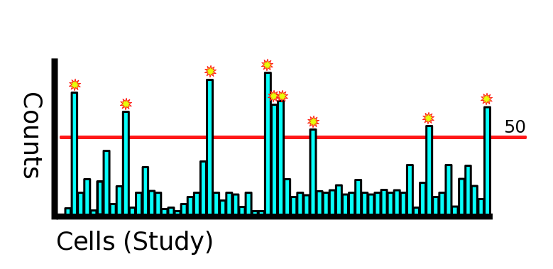

Filter Genes: Using Prevalence
===
class:small-code


Filtering Using Metadata
===


What is Metadata?
===

Other information that describes your measurements.
- Patient information.
  - Life style (smoking), Patient Biology (age), Comorbidity
- Study information.
  - Treatment, Cage, Sequencing Site, Sequencing Date
- Sequence QC on cells.
  - Useful in filtering.

Filter Cells: Removing the Outlier Cells
===
class:small-code

- Outlier cells are not just measured by complexity
  - **Useful Metrics**
     - Percent Reads Mapping
     - Percent Mitochondrial Reads
     - Presence of marker genes
     - Intergenic/ exonic rate
     - 5' or 3' bias
     - other metadata ...
  - **Useful Tools**
     - Picard Tools and RNASeQC

Seurat: Filtering on Metadata
===
class:small-code

- Filtering on mitochondrial reads in Seurat.  

```r
# Get gene names
mito.gene.names <- grep("^MT-", rownames(pbmc.seurat@data), value=TRUE)

# Get TSS normalized mitochodrial counts
col.total.counts <- Matrix::colSums(expm1(pbmc.seurat@data))
mito.percent.counts <- Matrix::colSums(expm1(pbmc.seurat@data[mito.gene.names, ]))/col.total.counts

# Add to seurat object as a metadata
pbmc.seurat <- AddMetaData(pbmc.seurat, mito.percent.counts, "percent.mitochodrial")
```

Seurat: Filtering on Metadata
===
class:small-code

- Plot current metadata in Seurat Object.
 - Number gene.
 - Number UMI.
 - Percent mitochondrial counts.
 


Seurat: Filtering on Metadata
===
class:small-code


Seurat: Filtering on Metadata
===
class:small-code


```r
GenePlot(pbmc.seurat, "nUMI", "percent.mitochodrial")
```

Seurat: Filtering on Metadata
===
class:small-code

- Outlier percent mitochondria are very low expression.
- Very high expression low percent mitochondrial reads.


Seurat: Filtering on Metadata
===
class:small-code


Seurat: Filtering on Metadata
===
class:small-code


```r
dim(pbmc.seurat@data)
```

```
[1] 13714  2700
```

```r
pbmc.seurat <- SubsetData(pbmc.seurat, subset.name = "nGene", accept.high = 2500)
pbmc.seurat <- SubsetData(pbmc.seurat, subset.name = "percent.mitochodrial", accept.high = 0.05)
dim(pbmc.seurat@data)
```

```
[1] 13714  2638
```

Saving as an R Object
===
class:small-code

Saving the Seurat object
- Contains all manipulation so far.
- Can be loaded or shared.
- Does not contain environment.


```r
# How to save the intact object.
save(pbmc.seurat, file = "seurat_tutorial.Robj")
```

```r
# How to retrieve the intact object.
load("seurat_tutorial.Robj")
```

Saving as Text Files
===

You may need to export data to import into other applications.


```r
# Log-scale expression matrix
write.table(as.matrix(pbmc.seurat@data), file = "seurat_data.txt")

# Study metadata
write.table(pbmc.seurat@data.info, file = "seurat_metadata.txt")

# What is the metadata so far
head(pbmc.seurat@data.info)
```

Scater: Complex QC Plotting
===

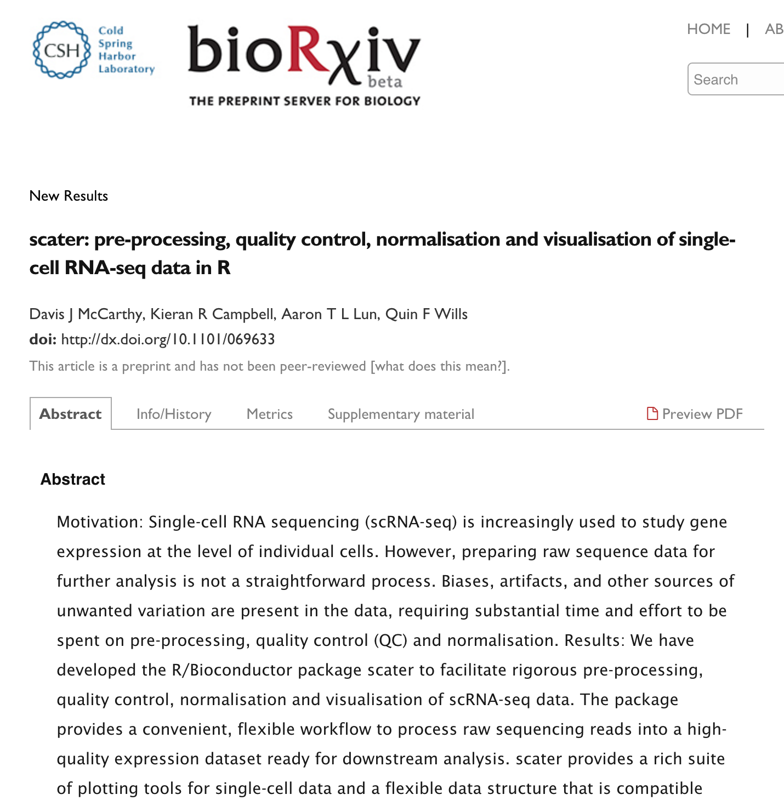

Scater: Motivation
===

- Clinical studies are often rich with metadata.
- Most differential expression methodology is T-test.
  - Much like using covariates in linear regression to control here we stratify by metadata to describe the impact of the metadatum.
- More than what we are covering here.
- Online tutorial [Click Here](//bioconductor.org/packages/release/bioc/vignettes/scater/inst/doc/vignette.html)

Scater: Skipping Ahead
===
class:small-code


```r
# Load Data
data("sc_example_counts")
data("sc_example_cell_info")
pd <- new("AnnotatedDataFrame", data=sc_example_cell_info)
rownames(pd) <- pd$Cell
example_sceset <- newSCESet(countData=sc_example_counts, phenoData=pd)
keep_feature <- rowSums(exprs(example_sceset)) > 0
example_sceset <- example_sceset[keep_feature,]
example_sceset <- calculateQCMetrics(example_sceset, feature_controls = 1:40)
```

Scater: Describe the Data
===

Small data set of 40 cells.
- Constructed metadata
- Metadata including
  - Mutation status (positive, negative)
  - Cell Cycle (S, G0, G1, G2M)
  - Treament (treat1, treat2)

Scater: What is the Data?
===
class:small-code


```r
corner(sc_example_counts)
```

```
          Cell_001 Cell_002 Cell_003 Cell_004 Cell_005
Gene_0001        0      123        2        0        0
Gene_0002      575       65        3     1561     2311
Gene_0003        0        0        0        0     1213
Gene_0004        0        1        0        0        0
Gene_0005        0        0       11        0        0
```

Scater: What is the info?
===
class:small-code


```r
corner(sc_example_cell_info)
```

```
             Cell Mutation_Status Cell_Cycle Treatment
Cell_001 Cell_001        positive          S    treat1
Cell_002 Cell_002        positive         G0    treat1
Cell_003 Cell_003        negative         G1    treat1
Cell_004 Cell_004        negative          S    treat1
Cell_005 Cell_005        negative         G1    treat2
```

Scater: Stratifying for Metadata
===
class:small-code


```r
plot(example_sceset, block1 = "Mutation_Status", block2 = "Treatment",
     colour_by = "Cell_Cycle", nfeatures = 300, exprs_values = "counts")
```

Scater: Stratifying for Metadata
===
class:small-code


Scater: Stratifying for Metadata
===
class:small-code


```r
plotExpression(example_sceset, rownames(example_sceset)[1:6],
               x = "Mutation_Status", exprs_values = "exprs", colour = "Treatment")
```

Scater: Stratifying for Metadata
===
class:small-code


Scater: Interactive Exploration
===
class:small-code


```r
scater_gui(example_sceset)
```

Section Summary
===

- scRNA-Seq is complex and can NOT be treated as population based measurements.
- Cell complexity is an important metadatum for QC.
- Conservative gene filtering based on gene count and prevalence is often used.
- Cells can be filtered by complexity and also other metadatum.

Where are we at?
===

We have now
- Loaded in data into R.
- Explored and plotted the data for QC.
- Filtered on counts and metadata.

Next
- Focus on plotting Genes and Cells.
- View cell groups to later use in DE.

Let's Get Started!
===

<div align="center">

</div>

Welcome to section 2!
===

- Using Seurat to plot genes
- Batch effects and study confounding
- Dimensionality reduction and plotting (PCA, t-SNE).
- Plotting cells.
- Moving from clusters to populations of cells.
- Differential Expression (SCDE).
- Pathway analysis.
- Overview of available methodology.

Using Seurat to plot genes
===


Seurat: Viewing Specific Genes
===
class:small-code

- Check the identity of the cells!!!
- Notice many zeros.


```r
VlnPlot(pbmc.seurat, c("GAPDH"))
```

Seurat: Viewing Specific Genes
===
class:small-code

- Check the identity of the cells!!!
- Notice many zeros.


Seurat: Plotting Genes vs Genes
===
class:small-code


```r
# Plot a gene vs a gene
GenePlot(pbmc.seurat, "CD79A", "CD79B", cex.use = 1)
```

Seurat: Plotting Genes vs Genes
===
class:small-code


```r
GenePlot(pbmc.seurat, "CD79A", "CD79B", cex.use = 1)
```


Single Cell RNA-Seq and Batch Affects
===


Single Cell RNA-Seq and Batch Affects
===

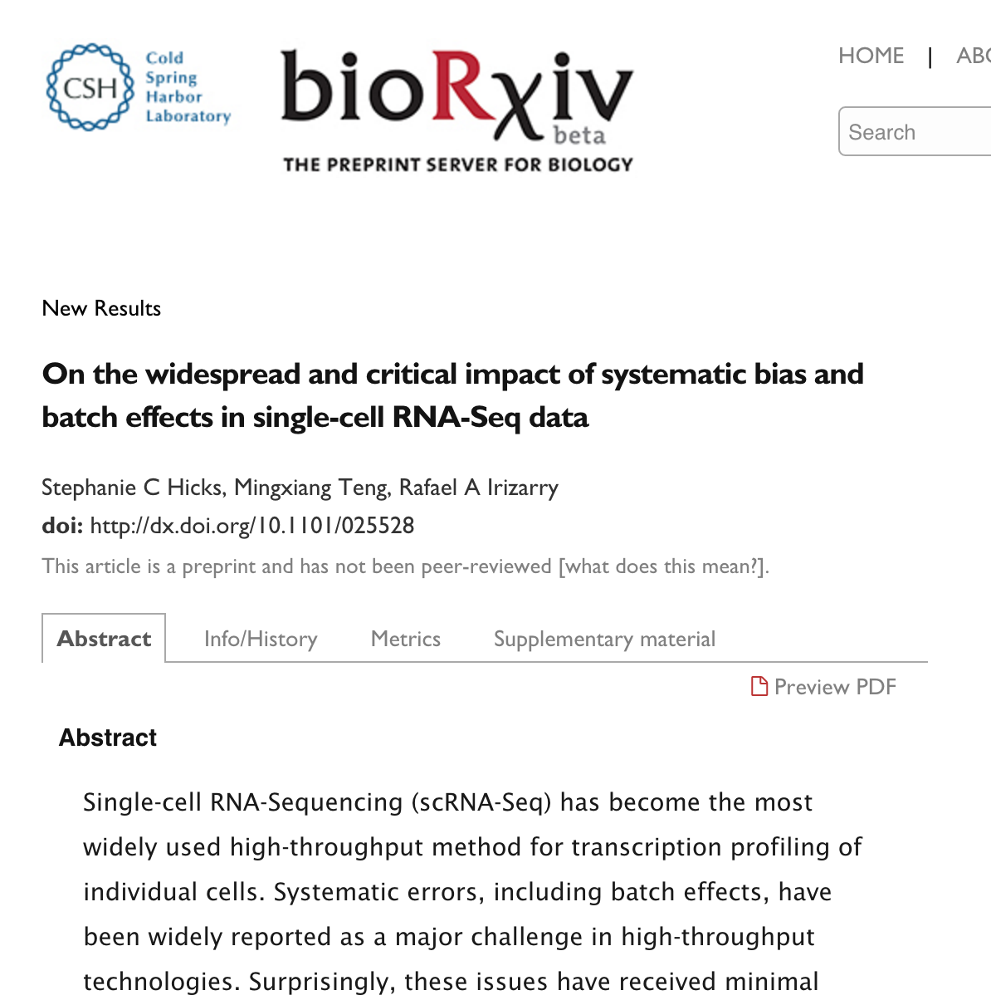

What is Confounding?
===

<div align="center">
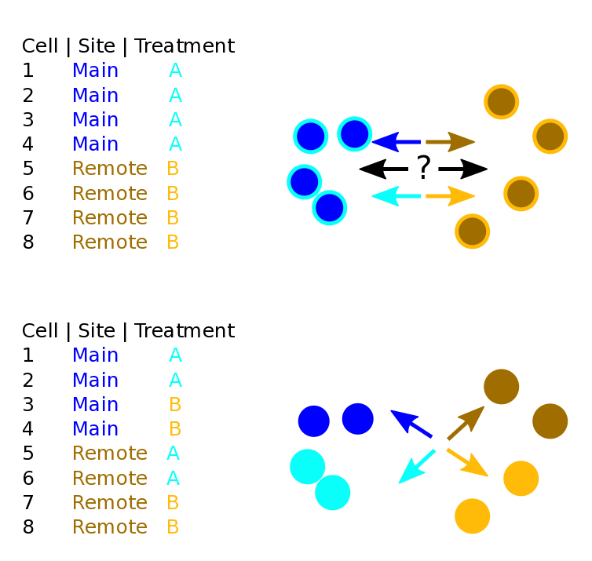
</div>

Confounding by Design
===

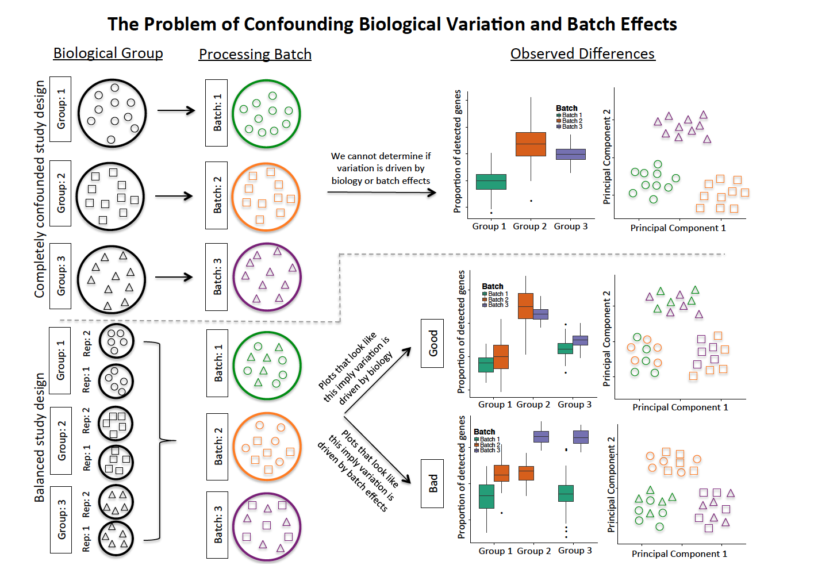

Normalization and Batch Affect Correction
===

- The nature of scRNA-Seq assays can make them prone to confounding with batch affects.
  - Normalization and batch affect correction can help.
- Some are moving away from relying on a specific method.
  - Exploring the idea of combining or selecting from a collection of normalization or correction methods best for a specific study.
- Some believe UMI based analysis need not be normalized between samples given the absolute count of the molecules are being reported.
  - Be careful not to remove biological signal with good experimental design (avoiding confounding by design).

Seurat and Batch Affect Correction
===

- Using linear models one can regress covariates.
  - scale.data hold the residuals after regressing (z-scored)
- Dimensionality reduction and clustering.
- We use metadata we have.
  - One could imagine creating a metadata for cell cycle.

Seurat and Batch Affect Correction
===
class:small-code


```r
pbmc.seurat <- RegressOut(pbmc.seurat, latent.vars = c("nUMI", "percent.mitochodrial"))
```

```
[1] "Regressing out nUMI"                
[2] "Regressing out percent.mitochodrial"

  |                                                                       
  |                                                                 |   0%
  |                                                                       
  |                                                                 |   1%
  |                                                                       
  |=                                                                |   1%
  |                                                                       
  |=                                                                |   2%
  |                                                                       
  |==                                                               |   3%
  |                                                                       
  |==                                                               |   4%
  |                                                                       
  |===                                                              |   4%
  |                                                                       
  |===                                                              |   5%
  |                                                                       
  |====                                                             |   6%
  |                                                                       
  |====                                                             |   7%
  |                                                                       
  |=====                                                            |   7%
  |                                                                       
  |=====                                                            |   8%
  |                                                                       
  |======                                                           |   9%
  |                                                                       
  |=======                                                          |  10%
  |                                                                       
  |=======                                                          |  11%
  |                                                                       
  |========                                                         |  12%
  |                                                                       
  |========                                                         |  13%
  |                                                                       
  |=========                                                        |  14%
  |                                                                       
  |==========                                                       |  15%
  |                                                                       
  |==========                                                       |  16%
  |                                                                       
  |===========                                                      |  17%
  |                                                                       
  |============                                                     |  18%
  |                                                                       
  |============                                                     |  19%
  |                                                                       
  |=============                                                    |  20%
  |                                                                       
  |==============                                                   |  21%
  |                                                                       
  |==============                                                   |  22%
  |                                                                       
  |===============                                                  |  22%
  |                                                                       
  |===============                                                  |  23%
  |                                                                       
  |================                                                 |  24%
  |                                                                       
  |================                                                 |  25%
  |                                                                       
  |=================                                                |  26%
  |                                                                       
  |=================                                                |  27%
  |                                                                       
  |==================                                               |  28%
  |                                                                       
  |===================                                              |  29%
  |                                                                       
  |===================                                              |  30%
  |                                                                       
  |====================                                             |  30%
  |                                                                       
  |====================                                             |  31%
  |                                                                       
  |=====================                                            |  32%
  |                                                                       
  |=====================                                            |  33%
  |                                                                       
  |======================                                           |  33%
  |                                                                       
  |======================                                           |  34%
  |                                                                       
  |=======================                                          |  35%
  |                                                                       
  |=======================                                          |  36%
  |                                                                       
  |========================                                         |  36%
  |                                                                       
  |========================                                         |  37%
  |                                                                       
  |========================                                         |  38%
  |                                                                       
  |=========================                                        |  38%
  |                                                                       
  |=========================                                        |  39%
  |                                                                       
  |==========================                                       |  40%
  |                                                                       
  |==========================                                       |  41%
  |                                                                       
  |===========================                                      |  41%
  |                                                                       
  |===========================                                      |  42%
  |                                                                       
  |============================                                     |  43%
  |                                                                       
  |=============================                                    |  44%
  |                                                                       
  |=============================                                    |  45%
  |                                                                       
  |==============================                                   |  46%
  |                                                                       
  |===============================                                  |  47%
  |                                                                       
  |===============================                                  |  48%
  |                                                                       
  |================================                                 |  49%
  |                                                                       
  |================================                                 |  50%
  |                                                                       
  |=================================                                |  51%
  |                                                                       
  |==================================                               |  52%
  |                                                                       
  |==================================                               |  53%
  |                                                                       
  |===================================                              |  54%
  |                                                                       
  |====================================                             |  55%
  |                                                                       
  |====================================                             |  56%
  |                                                                       
  |=====================================                            |  57%
  |                                                                       
  |======================================                           |  58%
  |                                                                       
  |======================================                           |  59%
  |                                                                       
  |=======================================                          |  59%
  |                                                                       
  |=======================================                          |  60%
  |                                                                       
  |========================================                         |  61%
  |                                                                       
  |========================================                         |  62%
  |                                                                       
  |=========================================                        |  62%
  |                                                                       
  |=========================================                        |  63%
  |                                                                       
  |=========================================                        |  64%
  |                                                                       
  |==========================================                       |  64%
  |                                                                       
  |==========================================                       |  65%
  |                                                                       
  |===========================================                      |  66%
  |                                                                       
  |===========================================                      |  67%
  |                                                                       
  |============================================                     |  67%
  |                                                                       
  |============================================                     |  68%
  |                                                                       
  |=============================================                    |  69%
  |                                                                       
  |=============================================                    |  70%
  |                                                                       
  |==============================================                   |  70%
  |                                                                       
  |==============================================                   |  71%
  |                                                                       
  |===============================================                  |  72%
  |                                                                       
  |================================================                 |  73%
  |                                                                       
  |================================================                 |  74%
  |                                                                       
  |=================================================                |  75%
  |                                                                       
  |=================================================                |  76%
  |                                                                       
  |==================================================               |  77%
  |                                                                       
  |==================================================               |  78%
  |                                                                       
  |===================================================              |  78%
  |                                                                       
  |===================================================              |  79%
  |                                                                       
  |====================================================             |  80%
  |                                                                       
  |=====================================================            |  81%
  |                                                                       
  |=====================================================            |  82%
  |                                                                       
  |======================================================           |  83%
  |                                                                       
  |=======================================================          |  84%
  |                                                                       
  |=======================================================          |  85%
  |                                                                       
  |========================================================         |  86%
  |                                                                       
  |=========================================================        |  87%
  |                                                                       
  |=========================================================        |  88%
  |                                                                       
  |==========================================================       |  89%
  |                                                                       
  |==========================================================       |  90%
  |                                                                       
  |===========================================================      |  91%
  |                                                                       
  |============================================================     |  92%
  |                                                                       
  |============================================================     |  93%
  |                                                                       
  |=============================================================    |  93%
  |                                                                       
  |=============================================================    |  94%
  |                                                                       
  |==============================================================   |  95%
  |                                                                       
  |==============================================================   |  96%
  |                                                                       
  |===============================================================  |  96%
  |                                                                       
  |===============================================================  |  97%
  |                                                                       
  |================================================================ |  98%
  |                                                                       
  |================================================================ |  99%
  |                                                                       
  |=================================================================|  99%
  |                                                                       
  |=================================================================| 100%
[1] "Scaling data matrix"

  |                                                                       
  |                                                                 |   0%
  |                                                                       
  |=====                                                            |   7%
  |                                                                       
  |=========                                                        |  14%
  |                                                                       
  |==============                                                   |  21%
  |                                                                       
  |===================                                              |  29%
  |                                                                       
  |=======================                                          |  36%
  |                                                                       
  |============================                                     |  43%
  |                                                                       
  |================================                                 |  50%
  |                                                                       
  |=====================================                            |  57%
  |                                                                       
  |==========================================                       |  64%
  |                                                                       
  |==============================================                   |  71%
  |                                                                       
  |===================================================              |  79%
  |                                                                       
  |========================================================         |  86%
  |                                                                       
  |============================================================     |  93%
  |                                                                       
  |=================================================================| 100%
```

Scone: Data
===

- 65 human cells
  - Cultured neural progenitor cells ("NPC") from pluripotent stem cells.
  - Primary cortical samples at 16 and 21 gestation weeks.
    - 21 gestation weeks then cultered for 3 weeks.
- Pollen et al 2014

Scone: Batch Correction
===
class:small-code


```r
set.seed(6473)
library(scone)
library(RColorBrewer)
library(scRNAseq)
data(fluidigm)
# Set assay to RSEM estimated counts
assay(fluidigm) = assays(fluidigm)$rsem_counts
```

Scone: Which Metadata?
===
class:small-code

- Which metadata are we using?


```r
metadata(fluidigm)$which_qc
```

Scone: Which Metadata?
===
class:small-code


```
 [1] "NREADS"                       "NALIGNED"                    
 [3] "RALIGN"                       "TOTAL_DUP"                   
 [5] "PRIMER"                       "INSERT_SZ"                   
 [7] "INSERT_SZ_STD"                "COMPLEXITY"                  
 [9] "NDUPR"                        "PCT_RIBOSOMAL_BASES"         
[11] "PCT_CODING_BASES"             "PCT_UTR_BASES"               
[13] "PCT_INTRONIC_BASES"           "PCT_INTERGENIC_BASES"        
[15] "PCT_MRNA_BASES"               "MEDIAN_CV_COVERAGE"          
[17] "MEDIAN_5PRIME_BIAS"           "MEDIAN_3PRIME_BIAS"          
[19] "MEDIAN_5PRIME_TO_3PRIME_BIAS"
```

Scone: Accessing Metadata
===
class:small-code


```r
head(colData(fluidigm))
head(colData(fluidigm)$Coverage_Type)
```

Scone: Logistics
===
class:small-code

- Cells were sequenced twice.
- Removing low coverage replicates.
- Removing undetected genes.


```r
# Preliminary Sample Filtering: High-Coverage Only
is_select = colData(fluidigm)$Coverage_Type == "High" 
fluidigm = fluidigm[,is_select]
# Retain only detected transcripts
fluidigm = fluidigm[which(apply(assay(fluidigm) > 0,1,any)),]
```

Scone: Batches
===
class:small-code


Scone: Batches
===
class:small-code


Scone: Related Metrics
===
class:small-code


Scone: Strongest Signal
===
class:small-code


Scone: Filtering
===
class:small-code

- Filtering on prevalance at a certain level of expression.


```r
# Initial Gene Filtering: Select "common" transcripts based on proportional criteria.
num_reads = quantile(assay(fluidigm)[assay(fluidigm) > 0])[4]
num_cells = 0.25*ncol(fluidigm)
is_common = rowSums(assay(fluidigm) >= num_reads ) >= num_cells
```

Scone: Filtering
===
class:small-code

- We will be pulling in house keeping genes for the filtering.


```r
data(housekeeping)
hk = intersect(housekeeping$V1,rownames(assay(fluidigm)))
head(housekeeping$V1)
```

```
[1] "AATF"  "ABL1"  "ACAT2" "ACTB"  "ACTG1" "ACTN4"
```

Scone: Filtering
===
class:small-code


```r
# Metric-based Filtering
mfilt = metric_sample_filter(assay(fluidigm), 
          nreads=colData(fluidigm)$NREADS,
          ralign=colData(fluidigm)$RALIGN,
          gene_filter=is_common,
          pos_controls=rownames(fluidigm) %in% hk,
          zcut=3, mixture=FALSE, 
          plot=FALSE)
```

Scone: Filtering
===
class:small-code


Scone: Filtering
===
class:small-code


```r
 # Simplify to a single logical
mfilt = !apply(simplify2array(mfilt[!is.na(mfilt)]),1,any)
```

Scone: Filtering
===
class:small-code

- Apply cell filtering and filter on highly expressed gene.


```r
# Cell filter
goodDat = fluidigm[,mfilt]

# Final Gene Filtering: Highly expressed in at least 5 cells
num_reads = quantile(assay(fluidigm)[assay(fluidigm) > 0])[4]
num_cells = 5
is_quality = rowSums(assay(fluidigm) >= num_reads ) >= num_cells
```

Scone: Workflows Inputs
===
class:small-code


```r
# Expression Data (Required)
expr = assay(goodDat)[is_quality,]

# Biological Origin - Variation to be preserved (Optional)
bio = factor(colData(goodDat)$Biological_Condition)
```

Scone: Workflows Inputs
===
class:small-code


```r
# Processed Alignment Metrics - Variation to be removed (Optional)
qc = colData(goodDat)[,metadata(goodDat)$which_qc]
ppq = scale(qc[,apply(qc,2,sd) > 0],center = TRUE,scale = TRUE)

# Positive Control Genes - Prior knowledge of DE (Optional)
poscon = intersect(rownames(expr),strsplit("ALS2, CDK5R1, CYFIP1, DPYSL5, FEZ1, FEZ2, MAPT, MDGA1, NRCAM, NRP1, NRXN1, OPHN1, OTX2, PARD6B, PPT1, ROBO1, ROBO2, RTN1, RTN4, SEMA4F, SIAH1, SLIT2, SMARCA1, THY1, TRAPPC4, UBB, YWHAG, YWHAH",split = ", ")[[1]])
```

Scone: Workflows Inputs
===
class:small-code


```r
# Negative Control Genes - Uniformly expressed transcripts (Optional)
negcon = intersect(rownames(expr),hk)
```

Scone: User Functions
===
class:small-code

- Total sum scaling


```r
SUM_FN = function (ei) 
{ # TSS
  sums = colSums(ei)
  eo = t(t(ei)*mean(sums)/sums)
  return(eo)
}
```

Scone: User Functions
===
class:small-code

- Similar to TSS but with complexity.


```r
EFF_FN = function (ei) 
{ # Divided by complexity
  sums = colSums(ei > 0)
  eo = t(t(ei)*sums/mean(sums))
  return(eo)
}
```

Scone: User Functions
===
class:small-code


```r
scaling=list(none=identity, #do nothing
             sum = SUM_FN,  # User functions
             eff = EFF_FN,
             tmm = TMM_FN, # SCONE
             uq = UQ_FN,
             uqp = UQ_FN_POS,
             fq = FQT_FN,
             fqp = FQ_FN_POS,
             deseq=DESEQ_FN,
             deseqp=DESEQ_FN_POS)
```

Scone: Imputation Settings
===
class:small-code


```r
# Simple FNR model estimation with SCONE::estimate_ziber
# fnr_out = estimate_ziber(x = expr, bulk_model = TRUE,
#                         pos_controls = rownames(expr) %in% hk,
#                         maxiter = 10000)
load("data/fnr_out.Robj")
```

Scone: Imputation Settings
===
class:small-code


```r
## ----- Imputation List Argument ----- 
imputation=list(none=impute_null, # No imputation
                expect=impute_expectation)
                # Replace zeroes with expected expression level
```

Scone: Imputation Settings
===
class:small-code

- Passed into functions in the imputation list.


```r
impute_args = list(p_nodrop = fnr_out$p_nodrop, mu = exp(fnr_out$Alpha[1,]))
```

Scone: Setting Up Params
===
class:small-code


```r
params <- scone(expr, 
                imputation = imputation, impute_args = impute_args,
                scaling=scaling, 
                qc=ppq, bio = bio,
                # Negative controls for RUVg
                # normalization and evaluation
                ruv_negcon = negcon,
                # Parameter Arguments
                k_qc=3, k_ruv = 3,
                adjust_bio="no", 
                run=FALSE)
```

Scone: Workflow Params
===
class:small-code


```r
# Visualize output params object
head(params)
```

Scone: Workflow Params
===
class:small-code


```r
apply(params,2,unique)
```

Scone: Updating for Imputation
===
class:small-code

- Removing some filtering for the imputed data.


```r
is_screened = ((params$imputation_method == "expect") & (params$scaling_method %in% c("none","deseqp","uqp","fqp","eff")))
params = params[!is_screened,]
```

Scone: Filtered Params
===
class:small-code


```r
head(params)
```

Scone: Run!
===
class:small-code


```r
BiocParallel::register(BiocParallel::SerialParam())
res <- scone(expr, 
             imputation = imputation, impute_args = impute_args,
             scaling=scaling,
             qc=ppq, bio = bio,
             ruv_negcon = negcon,
             k_qc=3, k_ruv = 3, 
             adjust_bio="no", 
             eval_poscon = poscon, # Positive controls for evaluation
             run=TRUE, params = params, # Additional params
             eval_kclust = 2:6,stratified_pam = TRUE,
             return_norm = "in_memory",
             rezero = TRUE)
```

Scone: Output
===
class:small-code

- normalized_data: list of normalized expression data (log-scale).
- metrics: raw metrics for normalizations.
- scores: sorted priority of best workslows.

class:small-code


```r
names(res)
```

```
[1] "normalized_data" "metrics"         "scores"          "params"         
```

Scone: Biplot
===
class:small-code


Scone: Interactive!
===
class:small-code


```r
sconeReport(scone_res = res,
            qc = ppq,
            bio = bio,
            negcon = negcon, poscon = poscon)
```

Scone: Tutorial
===

If you are interested in reading more about Scone feel free to visit [this tutorial](//github.com/YosefLab/scone/blob/develop/vignettes/sconeTutorial.Rmd).

Dimensionality reduction and plotting
===


Dimensionality Reduction and Ordination
===

- Start with many measurements (high dimensional).
  - Want to reduce to a few features (lower-dimensional space).
- One way is to extract features based on capturing groups of variance.
- Another could be to preferentially select some of the current features.
  - We have already done this.
- We need this to plot the cells in 2D (or ordinate them)
- In scRNA-Seq PC1 may be complexity.

PCA: in Quick Theory
===

- Eigenvectors of covariance matrix.
- Find orthogonal groups of variance.
- Given from most to least variance.
  - Components of variation.
  - Linear combinations explaining the variance.
  
---


PCA: in Quick Theory
===

http://setosa.io/ev/principal-component-analysis

PCA: in Practice
===

Things to be aware of.
- Data with different magnitudes will dominate.
  - Zero center and divided by SD.
  - (Standardized).
- Can be affected by outliers.

t-SNE: Nonlinear Dimensional Reduction
===


t-SNE: Collapsing the Visualization to 2D
===


t-SNE: What and Why?
===


PCA and t-SNE Together
===

Often t-SNE is performed on PCA components
- Liberal number of components.
- Removes mild signal (assumption of noise).
- Faster, on less data but, hopefully the same signal.

Plotting Cells
===


Select Variable Genes
===
class:small-code

- We are going to focus on highly variable genes.
  - Average expression (X) and dispersion (SD)(Y).
  - Bins genes (20).
  - Z-score for dispersion.
- fxn.x and fxn.y allow one to change the measurements.
  - Cut.offs are high and low, X and Y.


```r
pbmc.seurat <- MeanVarPlot(pbmc.seurat,fxn.x=expMean,fxn.y=logVarDivMean,
                           x.low.cutoff=0.0125,x.high.cutoff=3,
                           y.cutoff=0.5,do.contour=FALSE,do.plot=FALSE)
```

Select Variable Genes
===
class:small-code


```
[1] "Calculating gene dispersion"

  |                                                                       
  |                                                                 |   0%
  |                                                                       
  |=====                                                            |   7%
  |                                                                       
  |=========                                                        |  14%
  |                                                                       
  |==============                                                   |  21%
  |                                                                       
  |===================                                              |  29%
  |                                                                       
  |=======================                                          |  36%
  |                                                                       
  |============================                                     |  43%
  |                                                                       
  |================================                                 |  50%
  |                                                                       
  |=====================================                            |  57%
  |                                                                       
  |==========================================                       |  64%
  |                                                                       
  |==============================================                   |  71%
  |                                                                       
  |===================================================              |  79%
  |                                                                       
  |========================================================         |  86%
  |                                                                       
  |============================================================     |  93%
  |                                                                       
  |=================================================================| 100%
```

Select Variable Genes
===


```r
length(pbmc.seurat@var.genes)
```

```
[1] 1839
```

Seurat: Performing PCA
===
class:small-code

- Calculating PCA with the highly variable genes.   


```r
pbmc.seurat <- PCA(pbmc.seurat,pc.genes=pbmc.seurat@var.genes,do.print=FALSE)
```

Seurat: Performing PCA
===
class:small-code


```r
# Calculate PCA projection
pbmc.seurat <- ProjectPCA(pbmc.seurat)
```

```

  |                                                                       
  |                                                                 |   0%
  |                                                                       
  |=====                                                            |   7%
  |                                                                       
  |=========                                                        |  14%
  |                                                                       
  |==============                                                   |  21%
  |                                                                       
  |===================                                              |  29%
  |                                                                       
  |=======================                                          |  36%
  |                                                                       
  |============================                                     |  43%
  |                                                                       
  |================================                                 |  50%
  |                                                                       
  |=====================================                            |  57%
  |                                                                       
  |==========================================                       |  64%
  |                                                                       
  |==============================================                   |  71%
  |                                                                       
  |===================================================              |  79%
  |                                                                       
  |========================================================         |  86%
  |                                                                       
  |============================================================     |  93%
  |                                                                       
  |=================================================================| 100%
[1] "PC1"
 [1] "CST3"     "S100A9"   "FTL"      "TYROBP"   "FCN1"     "LYZ"     
 [7] "LST1"     "AIF1"     "S100A8"   "FTH1"     "TYMP"     "LGALS2"  
[13] "CFD"      "FCER1G"   "LGALS1"   "CD68"     "CTSS"     "SERPINA1"
[19] "SAT1"     "NPC2"     "GRN"      "CFP"      "IFITM3"   "COTL1"   
[25] "IFI30"    "PSAP"     "SPI1"     "CD14"     "GPX1"     "S100A11" 
[1] ""
 [1] "MALAT1"  "RPS27A"  "PTPRCAP" "RPSA"    "RPS3A"   "RPL23A"  "IL32"   
 [8] "RPL3"    "RPL9"    "RPS27"   "CD3D"    "LTB"     "RPL21"   "RPS3"   
[15] "RPS6"    "RPS15A"  "RPL31"   "CD3E"    "RPL13A"  "LDHB"    "RPS25"  
[22] "RPL30"   "RPS12"   "RPS18"   "RPS23"   "RPS29"   "RPL27A"  "RPL5"   
[29] "EEF1A1"  "AES"    
[1] ""
[1] ""
[1] "PC2"
 [1] "NKG7"   "GZMB"   "PRF1"   "CST7"   "GZMA"   "FGFBP2" "GNLY"  
 [8] "CTSW"   "SPON2"  "CCL4"   "GZMH"   "CCL5"   "FCGR3A" "KLRD1" 
[15] "XCL2"   "CLIC3"  "SRGN"   "GZMM"   "B2M"    "CD247"  "AKR1C3"
[22] "S100A4" "PRSS23" "TTC38"  "S1PR5"  "HCST"   "IGFBP7" "ITGB2" 
[29] "HOPX"   "GPR56" 
[1] ""
 [1] "CD79A"     "MS4A1"     "RPL18A"    "HLA-DQA1"  "TCL1A"    
 [6] "HLA-DQB1"  "CD79B"     "LINC00926" "LTB"       "RPL32"    
[11] "VPREB3"    "RPL13A"    "HLA-DRA"   "RPL13"     "RPS23"    
[16] "RPS27"     "RPL11"     "RPS18"     "RPL8"      "RPS5"     
[21] "HLA-DQA2"  "RPLP2"     "RPL12"     "RPS2"      "CD37"     
[26] "FCER2"     "CD74"      "BANK1"     "RPS12"     "HLA-DRB1" 
[1] ""
[1] ""
[1] "PC3"
 [1] "RPL10"  "RPS2"   "RPL11"  "RPL28"  "RPL32"  "RPL18A" "RPL12" 
 [8] "RPL19"  "RPS6"   "TMSB10" "RPS14"  "RPL13"  "RPS19"  "RPS15" 
[15] "RPL6"   "RPL29"  "RPLP1"  "RPS3"   "RPL15"  "RPL26"  "RPS4X" 
[22] "EEF1A1" "RPS16"  "RPS7"   "GNB2L1" "RPL14"  "RPL13A" "RPL3"  
[29] "RPS18"  "RPL8"  
[1] ""
 [1] "PF4"          "PPBP"         "SDPR"         "SPARC"       
 [5] "GNG11"        "HIST1H2AC"    "GP9"          "NRGN"        
 [9] "TUBB1"        "RGS18"        "CLU"          "AP001189.4"  
[13] "ITGA2B"       "CD9"          "PTCRA"        "TMEM40"      
[17] "CA2"          "ACRBP"        "MMD"          "TREML1"      
[21] "F13A1"        "SEPT5"        "PGRMC1"       "MYL9"        
[25] "TSC22D1"      "MPP1"         "CMTM5"        "PTGS1"       
[29] "SNCA"         "RP11-367G6.3"
[1] ""
[1] ""
[1] "PC4"
 [1] "CD3D"    "LDHB"    "IL7R"    "RPS14"   "CD3E"    "VIM"     "IL32"   
 [8] "RPL32"   "RPS12"   "NOSIP"   "RPL28"   "RPS25"   "GIMAP7"  "RPL11"  
[15] "JUNB"    "RPL13"   "RPS3"    "AQP3"    "ZFP36L2" "FYB"     "RPL10"  
[22] "RGCC"    "MAL"     "FOS"     "LEF1"    "RPLP1"   "CD2"     "RPL35A" 
[29] "RPL36"   "RPS28"  
[1] ""
 [1] "CD79A"     "HLA-DQA1"  "CD79B"     "MS4A1"     "CD74"     
 [6] "HLA-DQB1"  "HLA-DPB1"  "HLA-DPA1"  "HLA-DRB1"  "TCL1A"    
[11] "HLA-DRA"   "LINC00926" "HLA-DRB5"  "HLA-DQA2"  "VPREB3"   
[16] "HLA-DMA"   "GZMB"      "HLA-DMB"   "HVCN1"     "FCER2"    
[21] "BANK1"     "FGFBP2"    "HLA-DOB"   "PDLIM1"    "FCRLA"    
[26] "TSPAN13"   "PRF1"      "GNLY"      "CD72"      "EAF2"     
[1] ""
[1] ""
[1] "PC5"
 [1] "FCER1A"   "LGALS2"   "MS4A6A"   "S100A8"   "CLEC10A"  "FOLR3"   
 [7] "GPX1"     "CD14"     "GSTP1"    "ALDH2"    "S100A12"  "SERPINF1"
[13] "ID1"      "CD1C"     "GRN"      "RNASE6"   "GSN"      "IER3"    
[19] "CSF3R"    "BLVRB"    "RPL13"    "ASGR1"    "S100A9"   "RNASE2"  
[25] "VCAN"     "LYZ"      "SAT2"     "QPCT"     "CEBPD"    "FCGR1A"  
[1] ""
 [1] "FCGR3A"        "CDKN1C"        "MS4A7"         "HES4"         
 [5] "CKB"           "RP11-290F20.3" "RHOC"          "CTSL"         
 [9] "MS4A4A"        "LILRA3"        "SIGLEC10"      "CTD-2006K23.1"
[13] "IFITM3"        "HMOX1"         "ABI3"          "LRRC25"       
[17] "IFITM2"        "LILRB1"        "BATF3"         "PTP4A3"       
[21] "CEBPB"         "PILRA"         "CSF1R"         "HCK"          
[25] "CXCL16"        "VMO1"          "C1QA"          "TPPP3"        
[29] "TCF7L2"        "TNFSF10"      
[1] ""
[1] ""
```

```r
# Can plot top genes for top components
PrintPCA(pbmc.seurat, pcs.print = 1:2, genes.print = 5, use.full = TRUE)
```

```
[1] "PC1"
[1] "CST3"   "S100A9" "FTL"    "TYROBP" "FCN1"  
[1] ""
[1] "MALAT1"  "RPS27A"  "PTPRCAP" "RPSA"    "RPS3A"  
[1] ""
[1] ""
[1] "PC2"
[1] "NKG7" "GZMB" "PRF1" "CST7" "GZMA"
[1] ""
[1] "CD79A"    "MS4A1"    "RPL18A"   "HLA-DQA1" "TCL1A"   
[1] ""
[1] ""
```

Seurat: Performing PCA
===
class:small-code


```r
# Calculate PCA projection
pbmc.seurat <- ProjectPCA(pbmc.seurat)
```

```

  |                                                                       
  |                                                                 |   0%
  |                                                                       
  |=====                                                            |   7%
  |                                                                       
  |=========                                                        |  14%
  |                                                                       
  |==============                                                   |  21%
  |                                                                       
  |===================                                              |  29%
  |                                                                       
  |=======================                                          |  36%
  |                                                                       
  |============================                                     |  43%
  |                                                                       
  |================================                                 |  50%
  |                                                                       
  |=====================================                            |  57%
  |                                                                       
  |==========================================                       |  64%
  |                                                                       
  |==============================================                   |  71%
  |                                                                       
  |===================================================              |  79%
  |                                                                       
  |========================================================         |  86%
  |                                                                       
  |============================================================     |  93%
  |                                                                       
  |=================================================================| 100%
[1] "PC1"
 [1] "CST3"     "S100A9"   "FTL"      "TYROBP"   "FCN1"     "LYZ"     
 [7] "LST1"     "AIF1"     "S100A8"   "FTH1"     "TYMP"     "LGALS2"  
[13] "CFD"      "FCER1G"   "LGALS1"   "CD68"     "CTSS"     "SERPINA1"
[19] "SAT1"     "NPC2"     "GRN"      "CFP"      "IFITM3"   "COTL1"   
[25] "IFI30"    "PSAP"     "SPI1"     "CD14"     "GPX1"     "S100A11" 
[1] ""
 [1] "MALAT1"  "RPS27A"  "PTPRCAP" "RPSA"    "RPS3A"   "RPL23A"  "IL32"   
 [8] "RPL3"    "RPL9"    "RPS27"   "CD3D"    "LTB"     "RPL21"   "RPS3"   
[15] "RPS6"    "RPS15A"  "RPL31"   "CD3E"    "RPL13A"  "LDHB"    "RPS25"  
[22] "RPL30"   "RPS12"   "RPS18"   "RPS23"   "RPS29"   "RPL27A"  "RPL5"   
[29] "EEF1A1"  "AES"    
[1] ""
[1] ""
[1] "PC2"
 [1] "NKG7"   "GZMB"   "PRF1"   "CST7"   "GZMA"   "FGFBP2" "GNLY"  
 [8] "CTSW"   "SPON2"  "CCL4"   "GZMH"   "CCL5"   "FCGR3A" "KLRD1" 
[15] "XCL2"   "CLIC3"  "SRGN"   "GZMM"   "B2M"    "CD247"  "AKR1C3"
[22] "S100A4" "PRSS23" "TTC38"  "S1PR5"  "HCST"   "IGFBP7" "ITGB2" 
[29] "HOPX"   "GPR56" 
[1] ""
 [1] "CD79A"     "MS4A1"     "RPL18A"    "HLA-DQA1"  "TCL1A"    
 [6] "HLA-DQB1"  "CD79B"     "LINC00926" "LTB"       "RPL32"    
[11] "VPREB3"    "RPL13A"    "HLA-DRA"   "RPL13"     "RPS23"    
[16] "RPS27"     "RPL11"     "RPS18"     "RPL8"      "RPS5"     
[21] "HLA-DQA2"  "RPLP2"     "RPL12"     "RPS2"      "CD37"     
[26] "FCER2"     "CD74"      "BANK1"     "RPS12"     "HLA-DRB1" 
[1] ""
[1] ""
[1] "PC3"
 [1] "RPL10"  "RPS2"   "RPL11"  "RPL28"  "RPL32"  "RPL18A" "RPL12" 
 [8] "RPL19"  "RPS6"   "TMSB10" "RPS14"  "RPL13"  "RPS19"  "RPS15" 
[15] "RPL6"   "RPL29"  "RPLP1"  "RPS3"   "RPL15"  "RPL26"  "RPS4X" 
[22] "EEF1A1" "RPS16"  "RPS7"   "GNB2L1" "RPL14"  "RPL13A" "RPL3"  
[29] "RPS18"  "RPL8"  
[1] ""
 [1] "PF4"          "PPBP"         "SDPR"         "SPARC"       
 [5] "GNG11"        "HIST1H2AC"    "GP9"          "NRGN"        
 [9] "TUBB1"        "RGS18"        "CLU"          "AP001189.4"  
[13] "ITGA2B"       "CD9"          "PTCRA"        "TMEM40"      
[17] "CA2"          "ACRBP"        "MMD"          "TREML1"      
[21] "F13A1"        "SEPT5"        "PGRMC1"       "MYL9"        
[25] "TSC22D1"      "MPP1"         "CMTM5"        "PTGS1"       
[29] "SNCA"         "RP11-367G6.3"
[1] ""
[1] ""
[1] "PC4"
 [1] "CD3D"    "LDHB"    "IL7R"    "RPS14"   "CD3E"    "VIM"     "IL32"   
 [8] "RPL32"   "RPS12"   "NOSIP"   "RPL28"   "RPS25"   "GIMAP7"  "RPL11"  
[15] "JUNB"    "RPL13"   "RPS3"    "AQP3"    "ZFP36L2" "FYB"     "RPL10"  
[22] "RGCC"    "MAL"     "FOS"     "LEF1"    "RPLP1"   "CD2"     "RPL35A" 
[29] "RPL36"   "RPS28"  
[1] ""
 [1] "CD79A"     "HLA-DQA1"  "CD79B"     "MS4A1"     "CD74"     
 [6] "HLA-DQB1"  "HLA-DPB1"  "HLA-DPA1"  "HLA-DRB1"  "TCL1A"    
[11] "HLA-DRA"   "LINC00926" "HLA-DRB5"  "HLA-DQA2"  "VPREB3"   
[16] "HLA-DMA"   "GZMB"      "HLA-DMB"   "HVCN1"     "FCER2"    
[21] "BANK1"     "FGFBP2"    "HLA-DOB"   "PDLIM1"    "FCRLA"    
[26] "TSPAN13"   "PRF1"      "GNLY"      "CD72"      "EAF2"     
[1] ""
[1] ""
[1] "PC5"
 [1] "FCER1A"   "LGALS2"   "MS4A6A"   "S100A8"   "CLEC10A"  "FOLR3"   
 [7] "GPX1"     "CD14"     "GSTP1"    "ALDH2"    "S100A12"  "SERPINF1"
[13] "ID1"      "CD1C"     "GRN"      "RNASE6"   "GSN"      "IER3"    
[19] "CSF3R"    "BLVRB"    "RPL13"    "ASGR1"    "S100A9"   "RNASE2"  
[25] "VCAN"     "LYZ"      "SAT2"     "QPCT"     "CEBPD"    "FCGR1A"  
[1] ""
 [1] "FCGR3A"        "CDKN1C"        "MS4A7"         "HES4"         
 [5] "CKB"           "RP11-290F20.3" "RHOC"          "CTSL"         
 [9] "MS4A4A"        "LILRA3"        "SIGLEC10"      "CTD-2006K23.1"
[13] "IFITM3"        "HMOX1"         "ABI3"          "LRRC25"       
[17] "IFITM2"        "LILRB1"        "BATF3"         "PTP4A3"       
[21] "CEBPB"         "PILRA"         "CSF1R"         "HCK"          
[25] "CXCL16"        "VMO1"          "C1QA"          "TPPP3"        
[29] "TCF7L2"        "TNFSF10"      
[1] ""
[1] ""
```

Seurat: Performing PCA
===
class:small-code

- Top 5 genes in the loading for PC1 and PC2.


```r
# Can plot top genes for top components
PrintPCA(pbmc.seurat, pcs.print = 1:2, genes.print = 5, use.full = TRUE)
```

```
[1] "PC1"
[1] "CST3"   "S100A9" "FTL"    "TYROBP" "FCN1"  
[1] ""
[1] "MALAT1"  "RPS27A"  "PTPRCAP" "RPSA"    "RPS3A"  
[1] ""
[1] ""
[1] "PC2"
[1] "NKG7" "GZMB" "PRF1" "CST7" "GZMA"
[1] ""
[1] "CD79A"    "MS4A1"    "RPL18A"   "HLA-DQA1" "TCL1A"   
[1] ""
[1] ""
```

Seurat: PCA Visualizations
===
class:small-code

- Top 30 genes associated with the first two components.


```r
VizPCA(pbmc.seurat, pcs.use=1:2)
```

Seurat: PCA Visualizations
===
class:small-code


Seurat: Check your Batch Correction
===

How can we apply this?
- Can check components to see if gene show up that are enriched in components.
- Using the scores you can perform GE analysis to decribe the component.

Seurat: PCA Visualizations
===
class:small-code


```r
PCAPlot(pbmc.seurat, 1, 2)
```

Seurat: PCA Visualizations
===
class:small-code


Seurat: PCA Visualizations
===
class:small-code

- Plot top 30 genes in top 100 cells for PC1.


```r
PCHeatmap(pbmc.seurat, pc.use=1, cells.use=100, do.balanced=TRUE)
```

Seurat: PCA Visualizations
===
class:small-code


Seurat: Choosing Components
===
class:small-code


```r
# Time Intensive
# Jackstraw
# pbmc.seurat <- JackStraw(pbmc.seurat, num.replicate = 100, do.print = FALSE)
```

Seurat: Choosing Components
===
class:small-code

How do we choose how many components to use?   
 - When there is diminishing returns to include it.
 - Selection is performed more liberally in our setting.


```r
# Scree (elbow) plot
PCElbowPlot(pbmc.seurat)
```

Seurat: Choosing Components
===
class:small-code


Seurat: Store Clusters
===
class:small-code

- Determine subclusters for the plot.
- Separate graph based approach.
   - is not aware of the t-SNE projection.
- Using PC 1-10


```r
# 1 minute
pbmc.seurat <- FindClusters(pbmc.seurat, pc.use = 1:10, resolution = 0.6, print.output = 0, save.SNN = TRUE)
```

Seurat: Run t-SNE
===
class:small-code

- Calculate and plot t-SNE on PC 1- 10.   
- Uses Barnes-hut implementation.


```r
# Calculate t-SNE Ordination
pbmc.seurat <- RunTSNE(pbmc.seurat, dims.use = 1:10, do.fast = TRUE)
# Plot
TSNEPlot(pbmc.seurat)
```

Seurat: Run t-SNE
===
class:small-code


---

This is not PCA
- Distance is best understood in close neighbors.
- The measurement of distance is difficult to understand.

Seurat: Side by side
===
class:small-code

**PCA**  


---

**t-SNE**  


Seurat: Plotting Genes Through Clusters
===
class:small-code

Now that we have subclusters of cell populations plotting genes through subclusters is identical to before.
- Seurat stores and groups by subclusters automatically.


```r
VlnPlot(pbmc.seurat, c("MS4A1","CD79A"))
```

Seurat: Plotting Genes Through Clusters
===
class:small-code


Seurat: Plotting Genes on Clusters
===
class:small-code

You can also gene expression through out the cell ordination.
- Marker genes can help identify cell groups.
- Metadata can help visualize batch affects.


```r
FeaturePlot(pbmc.seurat, c("MS4A1","CD3E", "GNLY", "FCER1A"), cols.use = c("grey","blue"))
```

Seurat: Plotting Genes on Clusters
===
class:small-code


Confirm Cell Identity
===
class:small-code

It is important to know cells are expressing expected genes.
- Many cell populations have known expressing genes.
- Many assays use sorting.
- Could have contaminants or unexpected diversity.

QC the Clusters!
===
class:small-code


```r
FeaturePlot(pbmc.seurat, c("nGene"), cols.use = c("grey","blue"))
```

QC the Clusters!
===
class:small-code


QC the Clusters!
===
class:small-code

Check for your batch affect.
- We are going to make a fake batch affect (site) and plot this as an example of how one can visualize unwanted signal.


```r
# Making Fake Data
fake.sites <- as.integer(pbmc.seurat@ident %in% c(5,2,8,7))
names(fake.sites) <- colnames(pbmc.seurat@data)
# Add metadata
pbmc.seurat <- AddMetaData(pbmc.seurat, fake.sites, "site")
# Plot feature
FeaturePlot(pbmc.seurat, c("site"), cols.use = c("green","orange"))
```

QC the Clusters!
===
class:small-code


Seurat: Getting your labels
===


```r
cell.labels <- pbmc.seurat@ident
corner(cell.labels)
```

Seurat: Getting your labels
===


```
AAACATACAACCAC AAACATTGAGCTAC AAACATTGATCAGC AAACCGTGCTTCCG AAACCGTGTATGCG 
             0              2              0              1              5 
Levels: 0 1 2 3 4 5 6 7
```

Section Summary
===

- Dimensionality reduction help reduce data while *hopefully* keeping important signal.
  - t-SNE on PCA is often used in analysis
- Created several types of plot often seen in publications.
  - Plotting genes (through subgroups).
  - Ordinating cells in t-SNE space.
  - Heat maps of genes associated with PC components.
  - Plotting metadata on projects of data is an important QC tool.

Where are We at Now?
===

- Can plot genes vs genes, and throughout cells.
- Can plot cells.
- Can break plotted cells into subgroups.
  - These can become labels for later DE.
- Can plot across subgroups (maker genes).
- We can use plots of cells for batch affect visualization.

Differential Expression
===


Seurat: Differential Expression
===
class:small-code

- Default if one cluster again many tests.
  - Can specify an ident.2 test between clusters.
- Adding speed by exluding tests.
  - Min.pct - controls for sparsity
    - Min percentage in a group
  - Thresh.test - must have this difference in averages.


```r
cluster1.markers <- FindMarkers(pbmc.seurat, ident.1 = 1, min.pct = 0.25)
head(cluster1.markers, 5)
```

Seurat: Differential Expression
===
class:small-code

- Find all cluster against all others.


```r
pbmc.markers <- FindAllMarkers(pbmc.seurat, only.pos = TRUE, min.pct = 0.25, thresh.use = 0.25)
pbmc.markers %>% group_by(cluster) %>% top_n(2, avg_diff)
```

```
Source: local data frame [16 x 6]
Groups: cluster [8]

   p_val avg_diff pct.1 pct.2 cluster     gene
   <dbl>    <dbl> <dbl> <dbl>  <fctr>    <chr>
1      0 1.148598 0.925 0.482       0     LDHB
2      0 1.064824 0.662 0.202       0     IL7R
3      0 3.822197 0.996 0.217       1   S100A9
4      0 3.784692 0.975 0.123       1   S100A8
5      0 2.977214 0.936 0.042       2    CD79A
6      0 2.485397 0.623 0.022       2    TCL1A
7      0 2.171555 0.974 0.230       3     CCL5
8      0 2.113108 0.588 0.050       3     GZMK
9      0 2.268441 0.962 0.137       4   FCGR3A
10     0 2.150098 1.000 0.316       4     LST1
11     0 3.763449 0.961 0.131       5     GNLY
12     0 3.333932 0.955 0.068       5     GZMB
13     0 2.735429 0.861 0.009       6   FCER1A
14     0 2.013750 0.944 0.208       6 HLA-DQA1
15     0 5.872560 1.000 0.023       7     PPBP
16     0 4.949401 1.000 0.010       7      PF4
```

Seurat: DE Tests
===
class:small-code

**bimod:** Tests differences in mean and proportions.  
**roc:** Uses AUC like definition of separation.  
**t:** Student's T-test.  
**tobit:** Tobit regression on a smoothed data.  

Seurat: Plotting DE Genes
===
class:small-code


```r
pbmc.markers %>% group_by(cluster) %>% top_n(10, avg_diff) -> top10
DoHeatmap(pbmc.seurat, genes.use = top10$gene, order.by.ident = TRUE, slim.col.label = TRUE, remove.key = TRUE)
```

Seurat: Plotting DE Genes
===
class:small-code


```r
pbmc.markers %>% group_by(cluster) %>% top_n(10, avg_diff) -> top10
DoHeatmap(pbmc.seurat, genes.use = top10$gene, order.by.ident = TRUE, slim.col.label = TRUE, remove.key = TRUE)
```


SCDE: What is the Data?
===

- Data is from [Islam et al. 2011](http://genome.cshlp.org/content/21/7/1160.long)
- Approximately 100 samples.
  - Caution we use less...
- Mouse cells
  - Embryonic fibroblasts (MEF; control)
  - Embryonic stem cells (ES)

SCDE: Single Cell Differential Expression
===


SCDE: in Quick Theory
===

For each group (ES or MEF).
- Genes are modeled to have two groups of counts.
  - Noisy area highly prone to dropout (Poisson distribution).
  - "Amplified" signal (Negative Binomial distribution).
- This makes the error model to understand how much one can trust counts.
- Pairwise within groups.

Differential Expression.
- Expected value * the probability of dropout in that cell for that expression level.

SCDE: Load Data
===
class:small-code

- Pull in the data for the tutorial.
- In the future you would read in the data.
  - Read.table or load Seurat object.


```r
data(es.mef.small)
```

SCDE: Filter
===
class:small-code

- Filter the noise.
  - Almost every package has a function for this.
  - Filtering on gene prevalence.


```r
dim(es.mef.small)
```

```
[1] 14897    40
```

```r
cd <- clean.counts(es.mef.small, min.lib.size=1000, min.reads = 1, min.detected = 1)
dim(cd)
```

```
[1] 12142    40
```

SCDE: Create Labels
===
class:small-code

- Let's labels for the two groups.


```r
## Setting up cells groups
data.groups <- rep(NA, ncol(es.mef.small))
data.groups[ grep("MEF", names(es.mef.small)) ] <- "MEF"
data.groups[ grep("ESC", names(es.mef.small)) ] <- "ESC"
data.groups <- factor(data.groups, levels = c("ESC","MEF"))
names(data.groups) <- colnames(es.mef.small)
table(data.groups)
```

```
data.groups
ESC MEF 
 20  20 
```

SCDE: Calculate Error Models
===
class:small-code

- Some steps in SCDE can be time intensive.   
  - For the tutorial we will read in the result of this step.


```r
## Calculate error models
## Time Intensive step
# o.ifm <- scde.error.models(counts=cd, groups= data.groups, n.cores=4,
#                           threshold.segmentation=TRUE, save.crossfit.plots=FALSE,
#                           save.model.plots=FALSE, verbose=1)
## Precomputed
data(o.ifm)
```

SCDE: Calculate Error Models
===
class:small-code

- How do we speed this up?


```r
## Calculate error models
## Time Intensive step
# o.ifm <- scde.error.models(counts=cd, groups= data.groups, n.cores=4,
#                           threshold.segmentation=TRUE, save.crossfit.plots=FALSE,
#                           save.model.plots=FALSE, verbose=1)
# Check number of cores
detectCores()
```

```
[1] 8
```

SCDE: Model Details
===
class:small-code


```r
# Error model coefficients (cells = rows)
# corr.a = slope of the correlated component fit
# Negative corr.a could be bad cells
# corr.b intercept of the correlated component fit
# corr.theta is NB over-dispersion
# fail.r background poisson rate
head(o.ifm)
```

SCDE: Model Details
===
class:small-code


```
          conc.b    conc.a    fail.r    corr.b    corr.a corr.theta
ESC_10 -1.449443 0.5639140 -2.302585 0.7148157 0.6496142  0.7732069
ESC_11 -3.244421 0.7327046 -2.302585 1.5918205 0.5351960  0.7070433
ESC_12 -4.472559 0.8073935 -2.302585 1.5203470 0.4909147  0.7372590
ESC_13 -5.208909 0.8804523 -2.302585 1.2539230 0.5242493  0.8215473
ESC_14 -4.124369 0.7794612 -2.302585 1.1127353 0.5620266  0.7456712
ESC_15 -5.410838 0.9324758 -2.302585 1.1571732 0.5482784  0.7712750
```

SCDE: Filter Out Poor Fits
===
class:small-code


```r
dim(o.ifm)
```

```
[1] 40  6
```

```r
valid.cells <- o.ifm$corr.a > 0
table(valid.cells)
```

```
valid.cells
TRUE 
  40 
```

```r
o.ifm <- o.ifm[valid.cells, ]
dim(o.ifm)
```

```
[1] 40  6
```

SCDE: Estimate a Prior to Start
===
class:small-code

- Bayesian technique
- Need a starting point or first good guess to start.   


```r
## Calculate the Prior (starting value)
o.prior <- scde.expression.prior(models=o.ifm, counts=cd, length.out=400, show.plot=FALSE)
```

SCDE: Perform Differential Tests
===

- Why are we doing this again?


```r
## Setting up cells groups
data.groups <- rep(NA, nrow(o.ifm))
data.groups[ grep("MEF", rownames(o.ifm)) ] <- "MEF"
data.groups[ grep("ESC", rownames(o.ifm)) ] <- "ESC"
data.groups <- factor(data.groups, levels = c("ESC","MEF"))
names(data.groups) <- row.names(o.ifm)

## Perform T-test like analysis
# 2 minutes on standard computer, 1 core
#ediff <- scde.expression.difference(o.ifm, cd, o.prior, groups=data.groups, n.randomizations=100, n.cores=2, verbose=1)
load("data/ediff.Robj")
```

Visualize Differentially Expressed Genes
===

- mle = log2 fold change (estimate).
- ub and lb = upper and lower bound on mle.
- ce = log2 fold change (conservative estimate).
- Z = Z-score .
- cZ = Z-score corrected for multiple hypothesis testing.

---


SCDE: Top Upregulated Genes
===

- What are the top upregulated genes?


```r
head(ediff[order(ediff$Z, decreasing  =  TRUE), ])
```

```
                    lb      mle        ub       ce        Z       cZ
Dppa5a        8.075220 9.984631 11.575807 8.075220 7.160813 5.989598
Pou5f1        5.370220 7.200073  9.189043 5.370220 7.160328 5.989598
Gm13242       5.688455 7.677425  9.785734 5.688455 7.159979 5.989598
Tdh           5.807793 8.075220 10.302866 5.807793 7.159589 5.989598
Ift46         5.449779 7.359190  9.228822 5.449779 7.150242 5.989598
4930509G22Rik 5.409999 7.478528  9.785734 5.409999 7.115605 5.978296
```

SCDE: Write Data to Text File
===

- Save your data.   


```r
write.table(ediff[order(abs(ediff$Z), decreasing = TRUE), ],
            file = "data/scde_results.txt", row.names = TRUE, col.names = TRUE, sep = "\t", quote = FALSE)
```

SCDE: Plot a Gene
===

- Let's look at our data.   


```r
scde.test.gene.expression.difference("Tdh", models = o.ifm, counts = cd, prior = o.prior)
```

SCDE: Plot a Gene
===


```
          lb     mle       ub       ce        Z       cZ
Tdh 5.728235 8.03544 10.30287 5.728235 7.151425 7.151425
```

SCDE: Interactive Exploration
===

- Interactive exploration.


```r
# scde.browse.diffexp(ediff, o.ifm, cd, o.prior, groups = groups, name = "diffexp1", port = 1299)
```

SCDE and Batch Affects
===

- Create fake metadata.


```r
batch <- as.factor(ifelse(rbinom(nrow(o.ifm), 1, 0.5) == 1, "batch1", "batch2"))
table(groups, batch)
```

SCDE and Batch Affects
===


```r
scde.test.gene.expression.difference("Tdh", models = o.ifm, counts = cd, prior = o.prior, batch = batch)
```

SCDE and Batch Affects
===

- Here we correct initially instead of per gene.


```r
ediff.batch <- scde.expression.difference(o.ifm, cd, o.prior, groups = groups, batch = batch, n.randomizations = 100, n.cores = 1, return.posteriors = TRUE, verbose = 1)
```

Pathway analysis
===


Pagoda
===

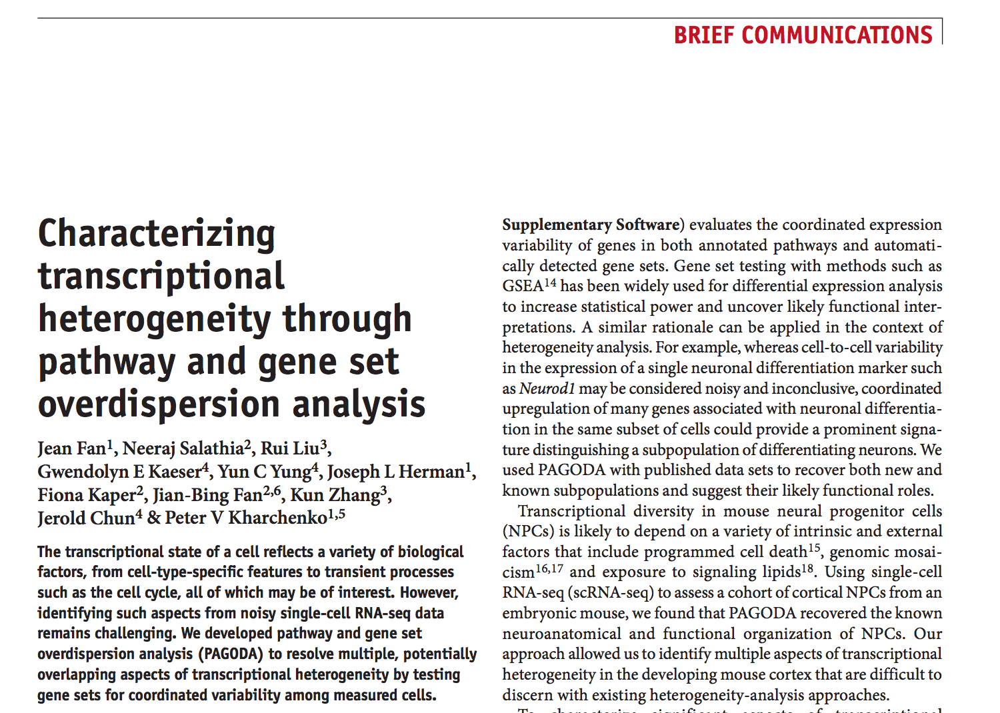

Pagoda: Overview Methodology
===

<div align="center">
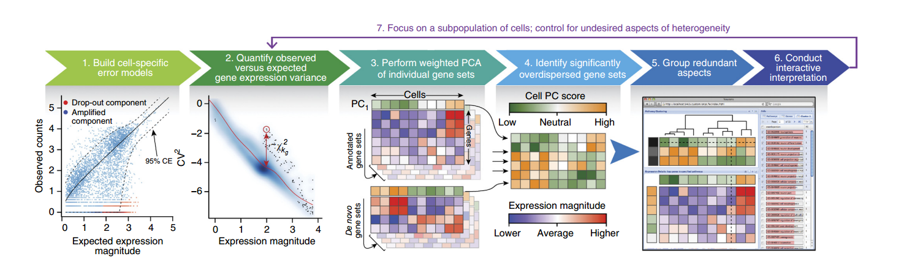
</div>
Fan et al.

Pagoda: What is the Data?
===

- Data being used is [Pollen et al. 2014](//www.ncbi.nlm.nih.gov/pubmed/25086649)
- Approximately 300 samples.
  - We focus on 64 samples (human, cortex)
  - NPC - Neuronal Progenitor Cells
  - GW16 - Gestational week 16
  - GW21 - Gestational week 21
  - GW21+3 - Gestational week 21 + 3 weeks.

Pagoda: Load Data
===
class:small-code


```r
data(pollen)
# Original genes and cells (count matrix)
dim(pollen)
```

```
[1] 23710    64
```

```r
# Filter poor cells
pollen.clean <- clean.counts(pollen)
# Cleaned matrix dimensions
dim(pollen.clean)
```

```
[1] 11310    64
```

Pagoda: Create a Color Legend
===
class:small-code


```r
name.keys <- gsub("^Hi_(.*)_.*", "\\1", colnames(pollen.clean))
name.keys
```

```
 [1] "NPC"    "NPC"    "NPC"    "NPC"    "NPC"    "NPC"    "NPC"   
 [8] "NPC"    "NPC"    "NPC"    "NPC"    "NPC"    "NPC"    "NPC"   
[15] "NPC"    "GW16"   "GW16"   "GW21"   "GW21+3" "GW21+3" "GW16"  
[22] "GW21+3" "GW21+3" "GW16"   "GW16"   "GW16"   "GW16"   "GW16"  
[29] "GW16"   "GW16"   "GW16"   "GW16"   "GW16"   "GW21"   "GW21"  
[36] "GW16"   "GW16"   "GW21"   "GW16"   "GW16"   "GW16"   "GW16"  
[43] "GW16"   "GW21"   "GW21"   "GW21"   "GW21+3" "GW16"   "GW16"  
[50] "GW16"   "GW16"   "GW16"   "GW21"   "GW21+3" "GW21+3" "GW21+3"
[57] "GW21+3" "GW21+3" "GW21+3" "GW21+3" "GW21+3" "GW21+3" "GW21+3"
[64] "GW21+3"
```

Pagoda: Create a Color Legend
===
class:small-code


```r
l2cols <- c("coral4", "olivedrab3", "skyblue2", "slateblue3")[as.integer(factor(name.keys, 
    levels = c("NPC", "GW16", "GW21", "GW21+3")))]
l2cols
```

```
 [1] "coral4"     "coral4"     "coral4"     "coral4"     "coral4"    
 [6] "coral4"     "coral4"     "coral4"     "coral4"     "coral4"    
[11] "coral4"     "coral4"     "coral4"     "coral4"     "coral4"    
[16] "olivedrab3" "olivedrab3" "skyblue2"   "slateblue3" "slateblue3"
[21] "olivedrab3" "slateblue3" "slateblue3" "olivedrab3" "olivedrab3"
[26] "olivedrab3" "olivedrab3" "olivedrab3" "olivedrab3" "olivedrab3"
[31] "olivedrab3" "olivedrab3" "olivedrab3" "skyblue2"   "skyblue2"  
[36] "olivedrab3" "olivedrab3" "skyblue2"   "olivedrab3" "olivedrab3"
[41] "olivedrab3" "olivedrab3" "olivedrab3" "skyblue2"   "skyblue2"  
[46] "skyblue2"   "slateblue3" "olivedrab3" "olivedrab3" "olivedrab3"
[51] "olivedrab3" "olivedrab3" "skyblue2"   "slateblue3" "slateblue3"
[56] "slateblue3" "slateblue3" "slateblue3" "slateblue3" "slateblue3"
[61] "slateblue3" "slateblue3" "slateblue3" "slateblue3"
```

Pagoda: Create Error Models
===
class:small-code

- This is a time intensive step.
- For now we are going to read in the data.


```r
# knn <- knn.error.models(pollen.clean, k=ncol(pollen.clean)/4, n.cores=2,
# min.count.threshold=2, min.nonfailed=5, max.model.plots=10) Precomputed
# data
data(knn)
```

Pagoda: Normalize the Variance
===
class:small-code


```r
# varinfo <- pagoda.varnorm(knn, counts=pollen.clean,
# trim=3/ncol(pollen.clean), max.adj.var=5, n.cores=1, plot=TRUE)
load("data/varinfo.Robj")

# list top overdispersed genes
sort(varinfo$arv, decreasing = TRUE)[1:10]
# Control for complexity
varinfo <- pagoda.subtract.aspect(varinfo, colSums(pollen.clean[, rownames(knn)] > 
    0))
```

Pagoda: Normalize the Variance
===
class:small-code


```r
# varinfo <- pagoda.varnorm(knn, counts=pollen.clean,
# trim=3/ncol(pollen.clean), max.adj.var=5, n.cores=2, plot=TRUE)
load("data/varinfo.Robj")
```

Pagoda: Normalize the Variance
===
class:small-code

<div align="center">
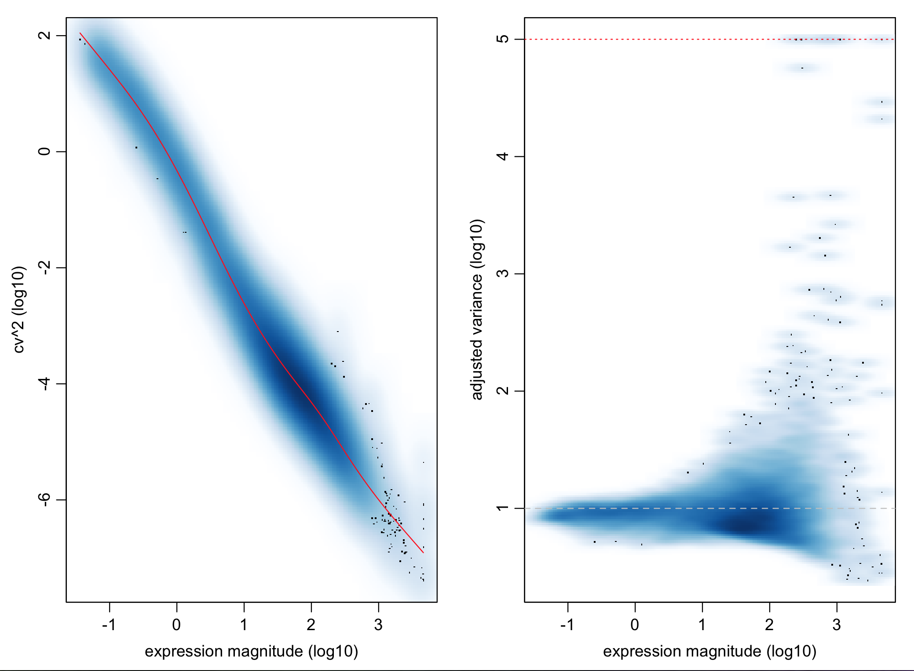
</div>

Pagoda: Normalize the Variance
===
class:small-code


```r
# list top overdispersed genes
sort(varinfo$arv, decreasing = TRUE)[1:10]
```

```
     DCX     EGR1      FOS  IGFBPL1   MALAT1    MEF2C    STMN2    TOP2A 
5.000000 5.000000 5.000000 5.000000 5.000000 5.000000 5.000000 5.000000 
  BCL11A     SOX4 
4.739497 4.489101 
```

```r
# Control for complexity
varinfo <- pagoda.subtract.aspect(varinfo, colSums(pollen.clean[, rownames(knn)] > 
    0))
```

Pagoda: Load Precomputed Gene Groups
===
class:small-code

- This analysis path relies on known gene groups.   


```r
library(org.Hs.eg.db)
# translate gene names to ids
ids <- unlist(lapply(mget(rownames(pollen.clean), org.Hs.egALIAS2EG, ifnotfound = NA), 
    function(x) x[1]))
rids <- names(ids)
names(rids) <- ids
```

Pagoda: Load Precomputed Gene Groups
===
class:small-code


```r
# convert GO lists from ids to gene names
gos.interest <- unique(c(ls(org.Hs.egGO2ALLEGS)[1:100], "GO:0022008", "GO:0048699", 
    "GO:0000280", "GO:0007067"))
go.env <- lapply(mget(gos.interest, org.Hs.egGO2ALLEGS), function(x) as.character(na.omit(rids[x])))
go.env <- clean.gos(go.env)  # remove GOs with too few or too many genes
go.env <- list2env(go.env)  # convert to an environment
```

Pagoda: Known Gene Groups Overdispersion
===
class:small-code


```r
# pwpca <- pagoda.pathway.wPCA(varinfo, go.env, n.components = 1, n.cores =
# 1)
load("data/pwpca.Robj")
df <- pagoda.top.aspects(pwpca, return.table = TRUE, plot = TRUE, z.score = 1.96)
```

Pagoda: Known Gene Groups Overdispersion
===
class:small-code


Pagoda: Known Gene Groups Overdispersion
===
class:small-code


```r
head(df)
```

Pagoda: Novel Gene Group Overdispersion
===
class:small-code

- Unsupervised path.   


```r
# clpca <- pagoda.gene.clusters(varinfo, trim = 7.1/ncol(varinfo$mat),
# n.clusters = 50, n.cores = 1, plot = TRUE)
load("data/clpca.Robj")
```

Pagoda: Novel Gene Group Overdispersion
===
class:small-code

<div align="center">
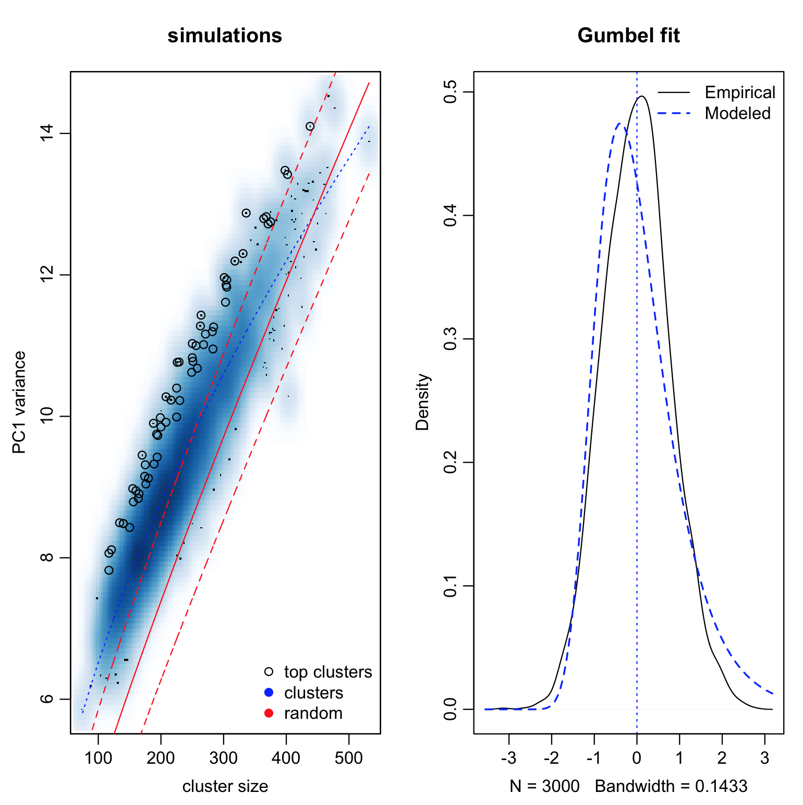
</div>

Pagoda: Novel Gene Group Overdispersion
===
class:small-code


```r
df <- pagoda.top.aspects(pwpca, clpca, return.table = TRUE, plot = TRUE, z.score = 1.96)
```

Pagoda: Novel Gene Group Overdispersion
===
class:small-code


Pagoda: Novel Gene Group Overdispersion
===
class:small-code


```r
head(df)
```

Pagoda: Novel Gene Group Overdispersion
===
class:small-code


```
             name npc   n    score         z     adj.z sh.z adj.sh.z
56  geneCluster.6   1 391 3.289412 13.814757 13.530139   NA       NA
49     GO:0000280   1 428 1.587359 11.592060 11.252131   NA       NA
50     GO:0007067   1 362 1.585331 10.873998 10.576419   NA       NA
79 geneCluster.29   1 171 1.583733  5.162516  4.523195   NA       NA
14     GO:0000070   1 116 1.446979  5.625549  5.247594   NA       NA
89 geneCluster.39   1 178 1.392980  4.137589  3.438496   NA       NA
```

Pagoda: Cell Clustering
===
class:small-code


```r
# Get full info on the top aspects tam <- pagoda.top.aspects(pwpca, clpca,
# n.cells = NULL, z.score = qnorm(0.01/2, lower.tail = FALSE))
load("data/tam.Robj")
# Determine overall cell clustering
hc <- pagoda.cluster.cells(tam, varinfo)
# tamr <- pagoda.reduce.loading.redundancy(tam, pwpca, clpca)
load("data/tamr.Robj")
# tamr2 <- pagoda.reduce.redundancy(tamr, distance.threshold = 0.9, plot =
# TRUE, cell.clustering = hc, labRow = NA, labCol = NA, box = TRUE, margins
# = c(0.5, 0.5), trim = 0)
load("data/tamr2.Robj")
col.cols <- rbind(groups = cutree(hc, 3))
```

Pagoda: Visualize Clustering
===
class:small-code


```r
pagoda.view.aspects(tamr2, cell.clustering = hc, box = TRUE, labCol = NA, margins = c(0.5, 
    20), col.cols = rbind(l2cols))
```

Pagoda: Visualize Clustering
===
class:small-code


Pagoda: Interactive Clustering
===
class:small-code


```r
## compile a browsable app, showing top three clusters with the top color bar
## app <- make.pagoda.app(tamr2, tam, varinfo, go.env, pwpca, clpca, col.cols
## = col.cols, cell.clustering = hc, title = 'NPCs') show app in the browser
## (port 1468) show.app(app, 'pollen', browse = TRUE, port = 1468)
```

Section Summary
===

- Generated groups of cells (labels) from subclusters.
- DE can be performed on cell subclusters.
  - Addresses the specific characteristics of the underlying data.
  - Is a t-test not an ANOVA
  - Can be time intensive.
- Pathway enrichment analysis can be performed using de novo and established gene groupings.

What Did We Miss? (So Much)
===

- Seurat
  - Data imputation, spatial inference, batch effect correction, ...
- SCDE
  - Batch Effect Correction, ...
- Pseudotemporal Analysis (time-series)
  - Monocle2, ...
- So many more tools are emerging, ...
-- https://github.com/seandavi/awesome-single-cell

What did we accomplish?
===

- Looked at the data and performed filtering and QC
- Plot genes and cells.
- Discovered subgroups of cells.
- Groups of cells were used as labels in DE.
- Groups of genes were analyzed for enrichment.

Thank You
===

- Aviv Regev
- Brian Haas
- Anindita Basu
- Asma Bankapur
- Chloe Villani
- Karthik Shekhar

---

- Matan Hofree
- Michel Cole
- Monika Kowalczyk
- Nir Yosef
- Regev Single Cell Working Group
- Today's Attendees

Questions?
===


Notes: to Make a PDF
===
class:small-code

- Create a pdf file before you plot ( can plot multiple plots ).
- Close the plotting.


```r
# pdf( 'data/my_file.pdf', useDingbats = FALSE ) # Start pdf plot( 1:10,
# log(1:10 ) ) # plot in to the pdf file plot( seq(0,.9,.1), sin(0:9) ) #
# another plot for the pdf file dev.off() # Close pdf file ( very important
# )
```
